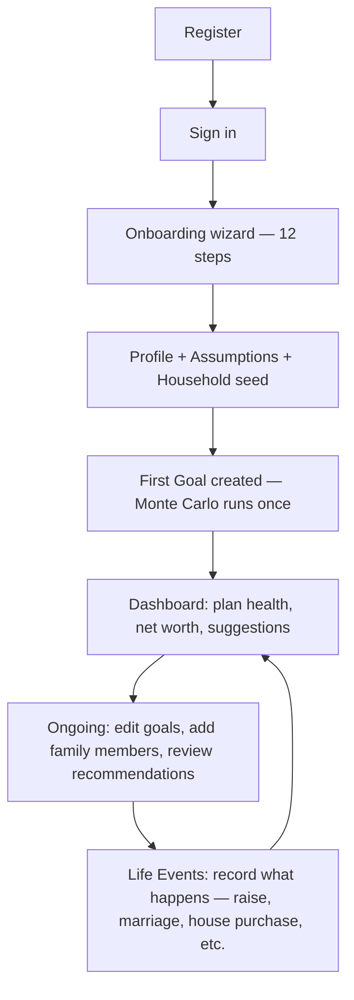

# User Journeys

**Status:** Canonical · **Last verified against code:** 2026-07-06, cross-checked 2026-07-13
**Supersedes:** `UserJourney.md`, `ScreenInventory.md` (both archived).

---

## 1. The Core Journey: Registration → First Goal → Ongoing Planning

Every transition names the exact screen/endpoint involved — see `docs/02_Architecture/SystemArchitecture.md` §10.1 for the full sequence diagram this journey traces through the backend.

## 2. Family Journey (the product's most differentiated path)

Onboarding's three yes/no questions seed placeholder household members → the user completes each member's details on the Family Home screen → the Government Schemes, Insurance, and Recommendations screens surface personalized, pre-filtered guidance the moment enough data exists (no explicit "check eligibility" action required — it's live on every visit). Full business-rule detail: `docs/02_Architecture/RecommendationEngine.md`.

## 3. Life Event Journey (the newest major surface)

Pick a category → pick one of 18 events → fill a guided form (with suggestions where helpful) → preview exactly what will change → confirm → (for 6 unambiguous milestones) an honest celebration screen → the event appears in history with a plain-language summary and a guarded Undo. Full detail: `docs/02_Architecture/LifeEventEngine.md` §5–6.

## 4. Screen Inventory (Northstar's complete site map)

| Area | Screens |
|---|---|
| Public | Landing (`/`) |
| Auth | Sign in, Forgot password, Reset password |
| Onboarding | One 12-step wizard |
| Core | Dashboard, Goals, Reports, AI Copilot, Profile, Settings |
| Life Events | Life Events history + record dialog |
| Family | Family Home, Add Member, Member Detail, Family Goals, Government Schemes, Insurance, Recommendations |

Full route-to-component mapping: `docs/06_Frontend/FrontendArchitecture.md` §2–3.

## 5. Known Journey Gaps (verified, not resolved)

- Dashboard goal cards are not clickable through to a detail view (`docs/08_Testing/QualityMetrics.md` §2).
- The Command Palette cannot deep-link a Goal, Government Scheme, or Insurance Policy search result to its specific record — only Family Member results do (`docs/06_Frontend/FrontendArchitecture.md` §14, FE-009).
- No "Death of a Family Member" journey exists — a real, named gap surfaced by the Life Event Engine's own customer-journey replay audit (`docs/02_Architecture/LifeEventEngine.md` §8).

---

## Related Documents
`docs/01_Product/UserPersonas.md` · `docs/06_Frontend/FrontendArchitecture.md` (screen-by-screen composition) · `docs/02_Architecture/LifeEventEngine.md` (the Life Event journey in full)

## Related Tests
No automated E2E suite exists for these journeys yet (`08_Testing/TestingStrategy.md` §5) — verified live/manually per release.

---

*Archived originals: `docs/13_Archive/ArchivedReports/UserJourney.md`, `ScreenInventory.md`.*
