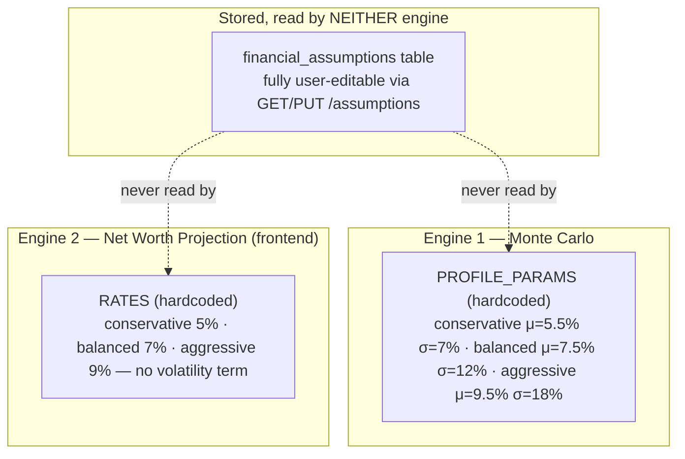

# Calculation Engine

**Status:** Canonical · **Last verified against code:** 2026-07-09 (no calculation code has changed since; the most recent completion mission, 07-12/07-13, was explicitly frontend-only and never touched `backend/app/services/monte_carlo.py` or `planning_service.py`, confirmed via `git status backend/` in every one of its phase reports).
**Supersedes:** `CalculationEngineBible.md` (archived), `CalculationEngineReport.md` (archived, 07-06, earlier and less precise).
**Method:** every formula below was traced from its frontend call site to its exact backend implementation (or confirmed to have none) by reading the actual executable source. Every hardcoded rate/threshold named here is a literal fact about the current code, confirmed by direct reading and grep — not inference.

---

## 1. Overview: three independent, non-communicating calculation surfaces

Northstar does not have one calculation engine — it has **three**:

| # | Engine | Where it lives | Persisted? |
|---|---|---|---|
| 1 | **Monte Carlo Goal Probability Engine** | `backend/app/services/monte_carlo.py` + `planning_service.py` | Yes — `goals.probability`, `goals.on_track` |
| 2 | **Deterministic Net Worth Projection** | `code/src/components/dashboard/NetWorthProjection.tsx` (frontend only) | No — recomputed every render |
| 3 | **Education Cost Inflation Projection** | `code/src/components/dashboard/EducationPlanningSection.tsx` (frontend only) | No — only the *rate* (`custom_inflation_rate`) is persisted, never the projected cost |

**The single most important architectural fact in this document:** these three engines use three different sets of assumed rates, and **none reads from the same source**. A user can change their "balanced expected return" from 7% to 15% via `PUT /api/v1/assumptions` and it will have **zero effect** on any Monte Carlo simulation or net-worth projection they subsequently see — see §7 (Known Gaps).



---

## 2. Financial Mathematics

### 2.1 Compound growth (single lump sum) — `EducationPlanningSection.tsx`
```ts
projectedCost(currentCost, years, rate) = currentCost * (1 + rate) ** years
```
Textbook `FV = PV × (1+r)^n`, annual compounding, single lump sum — no monthly contribution term, since this answers "what will this cost," not "will I have saved enough."

### 2.2 Future value of a growing series — `NetWorthProjection.tsx`
```
FV = P₀(1+i)^n + PMT × [(1+i)^n − 1] / i        where i = rate/12, n = years × 12
```
Closed-form future value of an initial lump sum plus an ordinary annuity. The `i === 0` branch falls back to simple non-compounding addition to avoid division by zero.

### 2.3 Log-normal monthly return sampling — the Monte Carlo core
```python
monthly_mu = mu_annual / 12
monthly_sigma = sigma_annual / (12 ** 0.5)
log_returns = rng.normal(loc=monthly_mu - 0.5 * monthly_sigma**2, scale=monthly_sigma, size=(num_simulations, months))
monthly_returns = np.exp(log_returns)
```
Samples each month's multiplicative return from a **log-normal distribution** (the discretized Geometric Brownian Motion model). The `- 0.5σ²` term is the **Itô correction** — without it, `E[e^X] = e^(μ+σ²/2)` would make the simulation's realized average return exceed the configured `mu`; subtracting it cancels that bias exactly.

**Annual→monthly conversion:** mean scales linearly (`mu/12`); volatility scales by `√12` (variance, not std-dev, is additive across independent periods).

### 2.4 Portfolio compounding with contributions
```python
portfolio = np.full(num_simulations, initial_amount)
for t in range(months):
    portfolio = portfolio * monthly_returns[:, t] + monthly_contribution
```
Vectorized across all paths simultaneously (NumPy broadcasting, not a per-path Python loop) — necessary because the return is stochastic per month per path, so no closed-form annuity formula applies.

### 2.5 Success rate and percentiles
```python
success_rate = float((terminal_values >= target_amount).mean() * 100)
p10, p25, p50, p75, p90 = np.percentile(terminal_values, [10, 25, 50, 75, 90])
```
The empirical fraction of paths meeting the target — not a closed-form probability.

### 2.6 Plan health score — `planning_service.compute_plan_health`
```python
raw = sum(g.probability * g.target_amount for g in goals) / sum(g.target_amount for g in goals)
return min(100, max(0, round(raw)))
```
A **target-amount-weighted average** — a $500k goal at 90% influences the score 5× as much as a $100k goal at 90%. Deliberate (confirmed by `test_weighted_by_target_amount`), not an accident of formula shape.

### 2.7 Savings rate
```python
savings_rate = max(0.0, (monthly_income - monthly_expenses) / monthly_income * 100)
```
Floored at zero — a display decision (overspending isn't hidden; `monthly_expenses` itself is never clamped).

### 2.8 Net worth
```python
net_worth = total_assets - total_liabilities
```
No illiquidity, tax-basis, or depreciation adjustment.

---

## 3. Goal Calculations

Every numeric goal field is schema-bounded (`_MAX_AMOUNT = 1_000_000_000`, `_MAX_MONTHLY_AMOUNT = 10_000_000`) specifically to keep the Monte Carlo compounding loop away from `inf`/`NaN` — a correctness safeguard, not just anti-typo.

**Years-to-goal is computed twice, two different ways — a verified, real inconsistency:**
- **Backend** (drives the actual simulation): `max(0.1, (target_date - today).days / 365.25)` — exact day-count.
- **Frontend** (`GoalSimPanel.tsx`, display/edit only): `max(1, targetYear - currentYear)` — calendar-year subtraction, ignoring month/day.

A goal created Dec 1 with a Jan 15 target is "1.13 years" to the backend but "1 year" to the edit form — real, minor, and never affects the actual simulated result (which always uses the backend's value).

**Custom Inflation Rate** (`goals.custom_inflation_rate`, nullable, `[0, 0.5]`) feeds *only* the Education Cost projection (§2.1) — permanently excluded from the Calculation Context (§6), confirmed by 8 dedicated tests including one that PATCHes it three times and asserts `probability` never moves.

---

## 4. Inflation Engine

**There is no backend inflation engine.** `financial_assumptions.inflation_rate` exists with a full CRUD API, but grep confirms **zero backend service reads it in any calculation.** The *only* consumer anywhere is `EducationPlanningSection.tsx` (client-side): `effectiveRate = goal.customInflationRate ?? globalRate`, then the compound-growth formula (§2.1).

**Not implemented:** no inflation adjustment anywhere in the Monte Carlo engine — its `mu`/`sigma` are nominal, never inflation-adjusted.

---

## 5. Retirement Calculations

**No dedicated retirement engine exists.** A "retirement goal" is an ordinary `Goal` with `category="retirement"`, receiving special treatment in exactly two narrow, non-calculating places:
1. `get_dashboard()`'s `projected_retirement` — a direct read of the first retirement goal's `target_amount`, zero compounding.
2. `family_dashboard_service._retirement_card()` — a pass-through read of stored `probability`/`on_track`.

**Zero-consumer schema fields** (confirmed by grep): `financial_assumptions.retirement_age` (default 65), `.social_security_monthly` (default 0.0).

**Not implemented:** no safe-withdrawal-rate calculation, no decumulation/drawdown simulation (Monte Carlo only ever models accumulation), no Social Security integration, no retirement-age-driven horizon.

---

## 6. Monte Carlo Simulation & the Calculation Context

**The engine's entire contract:** `planning_service.calculate_goal_probability(goal) -> None`:
```python
years_to_goal = max(0.1, (goal.target_date - date.today()).days / 365.25)
probability = await quick_probability_async(goal.current_amount, goal.monthly_contribution, years_to_goal, goal.risk_profile, goal.target_amount, seed=settings.monte_carlo_seed)
goal.probability = round(probability, 1)
goal.on_track = probability >= 70.0     # single hardcoded literal, not configurable anywhere
```

**Exactly two callers, exhaustively verified by grep:** `routers/goals.py`'s `create_goal` (unconditional) and `update_goal` (conditional — see Calculation Context below). No other code path calls this function; Dashboard/Reports/AI Copilot/Family Dashboard all read the already-stored value.

**Calculation Context** (`planning_service.CALCULATION_CONTEXT_FIELDS`) — the single source of truth for "which goal field changes trigger recalculation":
```python
frozenset({"current_amount", "monthly_contribution", "target_date", "risk_profile", "target_amount"})
```
Checked via one set-intersection in `update_goal`. Deliberately excludes `name`/`category`/`priority` (cosmetic) and `custom_inflation_rate` (feeds a wholly separate frontend projection, §3).

**Two entry points, one engine:** `quick_probability` (2,000 paths, used inline on every create/update — speed matters more than precision here) and `run_simulation` (10,000 paths, the explicit user-triggered `/simulate` endpoint, which also returns percentiles/distribution the quick path discards). Both async variants offload the CPU-bound NumPy work to the default thread-pool executor so the event loop is never blocked.

**Edge cases, verified against the test suite:** unknown risk-profile strings silently fall back to `"balanced"` (never crash); `months = max(1, round(years_to_goal * 12))` (never zero); reproducible under a fixed seed (`np.random.default_rng(seed)`, fresh per call); monotonic in contribution/horizon/risk (dedicated tests); no golden/hand-calculated numeric test exists anywhere — every test is a property/invariant assertion, which is the correct kind of test for a stochastic engine, not a gap.

**Risk profiles appear in four places with four different numbers** — `monte_carlo.PROFILE_PARAMS` (the only one that actually drives simulations, has volatility), `financial_assumptions` defaults (never read by any calculation), `NetWorthProjection.tsx`'s hardcoded `RATES` (coincidentally numerically identical to the assumptions defaults — **coincidence, not integration**), and `GoalSimPanel.tsx`'s "30/70"/"60/40"/"90/10" display labels (purely cosmetic, parsed by nothing).

---

## 7. Recommendation Calculation Dependencies (calculation-adjacent, not duplicative)

Two "recommendation" surfaces exist; **neither performs original financial calculation**:

- **Family Insurance** (`family_insurance_service.compute_insurance_recommendation()`): the one genuine tax figure — the ₹25,000 base 80D limit — is read live from the seeded `tax_sections` table, never hardcoded; doubled to ₹50,000 if any uninsured parent is 60+ (`_SENIOR_CITIZEN_AGE`); confidence is a two-tier value (1.0 or 0.7), never interpolated.
- **Government Schemes** (`scheme_eligibility_service.py`): exact completed-years age math (calendar idiom, not day-count — boundary-tested to the literal day); threshold comparisons per rule type (`max_age`/`min_age`/`gender`), no dollar figures; a 5-year "potentially eligible" window is a stated **product decision, not a policy fact**.
- **Family Recommendations Aggregation** (`family_recommendations_service.py`): its own docstring states "zero eligibility math and zero deduction-figure computation of its own" — its only original logic is conflict detection (grouping by subject + tax reference code, a pure set operation).
- **Notification Center**: reuses the exact same function calls the Insurance/Schemes pages make — zero new calculation logic; its only original computation is a deterministic `uuid5` identity hash, not a financial one.

Full detail on the Recommendation Engine itself: `docs/02_Architecture/RecommendationEngine.md`.

---

## 8. Known Gaps (verified, not invented)

1. `financial_assumptions.expected_return_*` are fully disconnected from Monte Carlo — `PROFILE_PARAMS` is hardcoded; zero code path reads stored assumptions into a simulation.
2. `NetWorthProjection.tsx`'s hardcoded rates are also disconnected from `financial_assumptions`, with no volatility term at all — presented alongside a genuinely probabilistic Monte Carlo result with no UI distinction that they're fundamentally different kinds of claims.
3. `financial_assumptions.tax_rate`/`.retirement_age`/`.social_security_monthly` have zero calculation consumers anywhere.
4. No retirement decumulation/withdrawal-phase modeling exists.
5. `ANNUAL_INFLATION = 0.03` in `monte_carlo.py` is declared and never referenced — dead code, confirmed by grep.
6. `years_to_goal` is computed three different ways across the codebase (backend day-count; frontend calendar-year subtraction for goal editing; a third, millisecond-based `yearsUntil()` in `EducationPlanningSection.tsx`) — can disagree by close to a year depending on calendar position.
7. No golden/hand-verified numeric test exists for Monte Carlo — every test is property/invariant-based (the correct choice for a stochastic engine, not a coverage gap).
8. The 70% on-track threshold, the 5-year scheme "potentially eligible" window, and the two-tier insurance confidence score are all single hardcoded literals with no configuration surface — verified as a genuine unresolved simplification (no comment/test/schema field suggests otherwise), not a deliberate design decision like the others above.

---

## 9. Validation Summary

| Investigation | Date | Finding | Resolution |
|---|---|---|---|
| Monte Carlo Consistency Investigation (PCA-3) | 07-07 | **Root cause identified:** `get_dashboard()` called an internal `refresh_goal_probabilities()` on every read, re-running an *unseeded* simulation and overwriting the stored probability on every Dashboard/Reports view — the same goal could show a different probability, and a boundary-case `on_track` flag could silently flip, purely depending on which screen was opened last. | **Fixed** — the mutating call was removed entirely (this is the incident behind ADR-001). Confirmed by grep: `refresh_goal_probabilities` does not exist anywhere in the current codebase. |
| Calculation Context Review (Task 9 — Family Goals & Custom Inflation) | 07-07 | Verified `custom_inflation_rate`'s exclusion from `CALCULATION_CONTEXT_FIELDS` holds under repeated PATCH | **Confirmed correct**, 8 dedicated tests added |
| This document's own re-verification | 07-09, reconfirmed 07-13 | Every formula, threshold, and gap above re-read directly against current source | **All findings hold** — zero backend calculation files have changed since 07-09 |

---

## Related Documents
`docs/02_Architecture/SystemArchitecture.md` (§7.1, §10 — request lifecycle context), `docs/02_Architecture/RecommendationEngine.md` (§7 above), `docs/03_Engineering/ArchitectureDecisionRecords.md` (ADR-001), `docs/08_Testing/ValidationStrategy.md` (Monte Carlo test coverage detail).

## Related ADRs
ADR-001 (Calculation Lifecycle — the direct fix for the PCA-3 incident above).

## Related APIs
`POST /goals`, `PATCH /goals/{id}`, `POST /simulate`, `POST /simulate/optimize`, `GET/PUT /assumptions`.

## Related Database Tables
`goals`, `simulations`, `financial_assumptions`.

## Related Services
`monte_carlo.py`, `planning_service.py`, `optimizer.py`.

## Related Frontend Components
`GoalSimPanel.tsx`, `NetWorthProjection.tsx`, `EducationPlanningSection.tsx`.


## Related Tests
`test_monte_carlo.py` (the full property/invariant suite: monotonicity, reproducibility-under-seed, extreme-input bounds), `test_planning_service.py::TestCalculateGoalProbability`, `test_goal_inflation.py` (asserts `custom_inflation_rate` never perturbs probability).

## Related Validation Reports
The Monte Carlo Consistency Investigation behind ADR-001, archived in full at `13_Archive/ArchivedReports/MonteCarloConsistencyReport.md` — the origin incident this engine's current read-only Dashboard contract was built to prevent recurring.

## Related Implementation Reports
None specific beyond the architecture Bible itself — this engine has not changed since the source Bible's 2026-07-09 compile date.

## Related Future Work
Wiring `financial_assumptions.expected_return_*` into `PROFILE_PARAMS` (the single most-repeated open finding across this documentation system) · a future Tax Optimizer service reading `tax_regimes`/`tax_slabs` · retirement decumulation modeling.
---

*Archived originals: `docs/13_Archive/ArchivedReports/CalculationEngineBible.md`, `CalculationEngineReport.md`, `CalculationContextReview.md`, `MonteCarloConsistencyReport.md`.*
