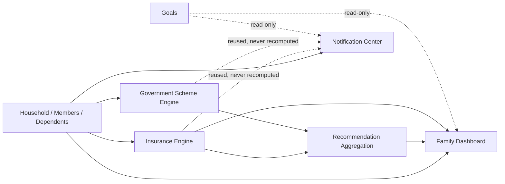
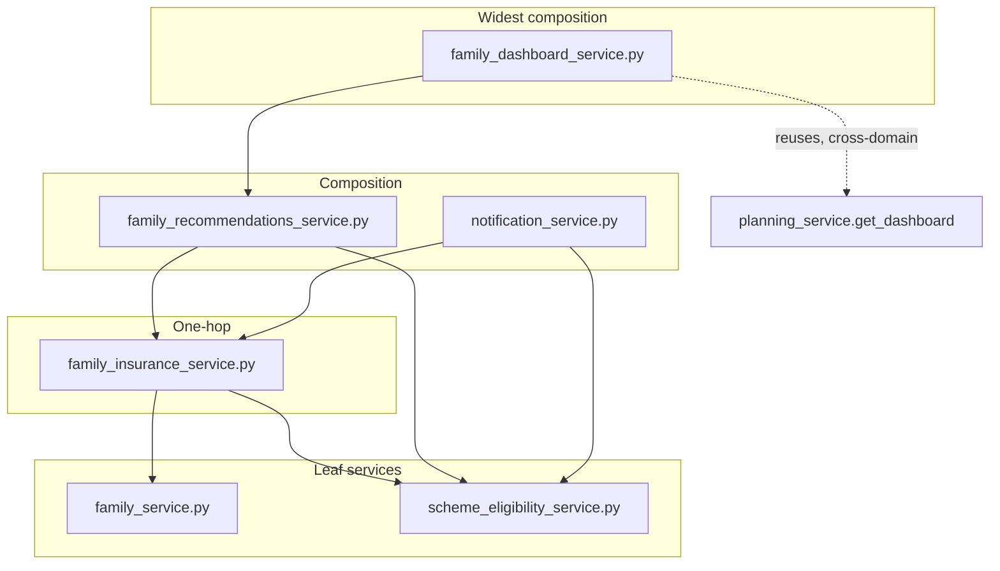

# Recommendation Engine (Family, Government Schemes & Insurance)

**Status:** Canonical · **Last verified against code:** 2026-07-10
**Supersedes:** `FamilyGovernmentSchemeRecommendationEngineBible.md` (archived), `RecommendationEngineReport.md`, `RecommendationEngineV2.md`, `RecommendationEngineV2Validation.md`, `RecommendationEngineV2_E2EValidation.md`, `PolicyEngineReport.md`, `GovernmentPolicyReport.md`, `FamilyHUFPlanningReport.md`, `FamilyPlanningDesign.md`, and the entire Task 9–12 micro-documentation set (35 source files total — see `docs/14_KnowledgeBase/DocumentationInventory.md` §2.2 for the full list).
**Method:** every business rule below is traced to the exact function or schema field that enforces it. Where a rule does not exist in code, this document says **"Not implemented"** rather than describing an aspiration.

---

## 1. Business Domain Overview

**Why this module exists.** Northstar's core Goal/Monte Carlo engine (`CalculationEngine.md`) answers "will *I* reach *my* target?" for an individual. This module answers a different question: "what is my household's total picture, and what does the Indian tax/policy system owe *these people* — my spouse, my children, my parents?" This is a second planning surface with its own data model (`households`/`household_members`/`dependents`), because a spouse or minor child is frequently a real financial-planning subject without ever being a Northstar account holder.

**Why Government Schemes exist.** India has a large catalog of state-run savings/insurance instruments (PPF, SSY, SCSS, EPF, NPS, NSC, KVP, APY, PMVVY), each with its own eligibility rules and tax treatment, amid an Income-tax Act mid-transition (1961 Act → 2025 Act, e.g. `80C` → `123`). The Scheme Engine evaluates real, dated eligibility rules against real household data so the product can present a **personalized, pre-filtered answer**, never a flat catalog.

**Why Insurance exists.** Section 80D gives a distinct, additional deduction for health-insurance premiums paid for parents, doubling if a covered parent is a senior citizen — a real, easy-to-miss planning opportunity the Insurance module surfaces precisely.

**Why Recommendations exist.** Insurance and Schemes are two independently-correct engines that can, in principle, compete for the same bounded tax ceiling. The aggregation layer composes them into one feed **and** flags that competition explicitly — something neither underlying engine can see alone.



---

## 2. Household Model

A **Household** is created lazily on first Family-domain access, one per user. It **aggregates** existing per-user data for a shared view — it is never a second source of truth (goals, assets, income stay keyed to `user_id` exactly as elsewhere).

**Members**: one row per person the household cares about, including the account owner (`self`, auto-created, never user-editable). `user_id` is nullable — a spouse/child/parent is a real planning subject without a login.

**Relationships**: a coarse bucket (`spouse|child|parent|other`, plus `self`) distinct from `Dependent.relationship_detail` (a finer sub-label, e.g. `mother`/`father`).

**Dependents**: one-to-one with every non-`self` member (DB-enforced), carrying `date_of_birth`, `gender`, `has_own_insurance`, `is_tax_dependent`. **Every** non-`self` member gets one unconditionally, including spouses — a corrected assumption (the original design assumed a spouse wouldn't need one, until it became clear DOB/gender had nowhere else to live).

**Parents** require `relationship_detail ∈ {mother, father}` and `has_own_insurance ∈ {yes, no, not_sure}` — these exist specifically to drive uncovered-parent detection (§4).

**Ownership model**: every table resolves ownership through one household's `created_by_user_id` (`family_service.resolve_owned_household`), written against a slightly more general rule ("created it, or is a member of it") than currently needed, so it won't require rewriting when shared-household-login ships. **Not implemented today:** no household member other than `self` has ever had `user_id` populated.

**Why this architecture:** a household-as-aggregator (not household-as-owner) model meant adding this module required zero changes to how Goals/Assets/Income are queried or secured anywhere else — every existing ownership check continues filtering by `user_id` exactly as before.

---

## 3. Family Lifecycle

Onboarding asks exactly three yes/no questions (spouse? children — with a 1–10 count follow-up? dependent parents?), converting answers into **bare placeholder `HouseholdMember` rows** (no name, no DOB). **Verified gap:** a household with two dependent parents gets **one** placeholder parent row — the wizard has no "how many parents" follow-up the way it does for children; the user must add the second manually.

Seeding is idempotent (checked via the household's own existence, not a DB constraint). A placeholder is real and visible immediately but flagged `is_complete: false` until relationship-type-specific fields are filled (`family_service.is_complete()` — the same function gates the Insurance Engine's parent evaluation). The `self` member is permanently protected: both edit and delete on it return `400`.

Completing/changing a parent's `has_own_insurance` or DOB can cause an insurance recommendation to appear or disappear on the very next request — no explicit recompute step exists anywhere (§7).

---

## 4. Goal Ownership vs. Family Tagging

`goals.user_id` is set once at creation and **never** changed by any Family-domain operation. Family tagging (`PUT /goals/{id}/family-tags`) replaces the *entire* tag set in one delete-then-reinsert call; a cross-household member ID is rejected outright (`422`), never silently dropped; an empty list validly untags everyone. Tagging does not require the tagged member to be `is_complete`.

**Why tags never imply ownership:** tagging a goal with a spouse's name is a UI affordance ("this affects this person"), never a joint-editing or joint-viewing grant — the data model has no mechanism for a second user to read/modify another user's goal. Building UI implying otherwise would describe a capability that doesn't exist. The alternative (genuine co-ownership) would require rewriting every ownership check across the codebase — a materially larger change than this feature's actual need.

---

## 5. Government Scheme Engine

**Source of truth for the catalog:** `backend/scripts/seed_policy_data.py`. **Nine schemes are seeded; eligibility rules exist for exactly two.**

| Code | Name | Category | Status | Rules seeded? |
|---|---|---|---|---|
| PPF | Public Provident Fund | general_savings | active | No |
| EPF | Employees' Provident Fund | retirement | active | No |
| NPS | National Pension System | retirement | active | No |
| **SSY** | Sukanya Samriddhi Yojana | child | active | **Yes** — `max_age lt 10`, `gender eq female` |
| **SCSS** | Senior Citizens' Savings Scheme | senior | active | **Yes** — `min_age gte 60` |
| NSC | National Savings Certificate | general_savings | active | No |
| KVP | Kisan Vikas Patra | general_savings | active | No |
| APY | Atal Pension Yojana | retirement | active | No |
| PMVVY | Pradhan Mantri Vaya Vandana Yojana | senior | **closed_to_new** | No (moot) |

`SchemeRate` rows (interest rate, min/max contribution) are seeded for all nine but read by **zero application code** — the Schemes screen shows eligibility buckets and reasons only, never a rate figure.

**SSY** (girl child, under 10): both rules must pass. Age uses **exact completed-years** arithmetic (calendar idiom, not day-count) — boundary-tested to the literal day (exact 10th birthday = not eligible; day before = eligible). A `max_age` ceiling never produces `potentially_eligible` (no "will qualify by getting older" direction exists for a ceiling). Gender is exact-string-equality; unknown gender fails silently rather than being guessed.

**SCSS** (60+): a `min_age` floor works oppositely to a ceiling — within 5 years below the threshold (`_POTENTIALLY_ELIGIBLE_WINDOW_YEARS`, a **product decision, not a policy fact**) resolves to `potentially_eligible`; further away, `not_eligible`. **Known, deliberate, most-consequential unseeded gap:** the real SCSS has two additional eligibility routes (55+ VRS retirees, 50+ defense personnel) that are **not seeded**, because no field anywhere records retirement status or defense-service history — seeding a rule with nothing to evaluate it against would be dead data or a guess, both ruled out by this codebase's "never invent a financial fact" discipline.

**The remaining seven schemes** have zero seeded rules — bucketed `not_eligible` with the explicit reason `"Eligibility criteria... are not yet configured"`, **never** guessed into `eligible` or silently omitted. `PMVVY` additionally short-circuits on `status == "closed_to_new"` before any rule lookup.

**The evaluation engine itself:** only three `rule_type` values are ever branched on (`max_age`/`min_age`/`gender`) — a deliberate scope boundary (a 4th type requires a code change, not built ahead of need). Evaluation is narrow to **non-`self`** household members — a `self` member's own eligibility (e.g. for SCSS) is never evaluated, a documented future extension, not a bug. An incomplete member (no DOB) is never guessed — simply skipped for that scheme. **Performance note:** every call loads all nine schemes and all rules unconditionally (no `WHERE` clause) — correct at this catalog size, a real scaling risk if the catalog ever grows to hundreds of schemes.

---

## 6. Insurance Engine

**Coverage** is always managed as a complete replacement of the covered-member set (never incremental add/remove) — the same pattern goal-tagging uses. A policy must cover at least one member (schema-enforced).

**Gap detection (`uncovered_parents`)** — a parent-type member qualifies only if **all three** hold: (1) `is_complete()` — an incomplete placeholder never triggers a gap; (2) `has_own_insurance != "yes"` — fires identically for `"no"` **and** `"not_sure"`, a deliberate resolution (an unanswered/uncertain status is itself the gap); (3) not already covered by an active policy — checked *after* the self-report, since actual coverage data is treated as more current than a possibly-stale answer (even a parent whose self-report still says "no" produces no recommendation once a policy covers them).

**80D calculation:**
```
base_limit = tax_sections WHERE section_number='80D'   (never a hardcoded literal — None if absent, and compute_insurance_recommendation returns None immediately, never fabricating a fallback)
parent_limit = base_limit × 2 if any known-age uninsured parent ≥ 60, else base_limit
confidence = 1.0 if every eligible parent's age is known, else 0.7
```
Missing DOB is excluded from `ages_known`, never assumed non-senior or senior. **Not seeded, by deliberate design:** the real 80D scheme has an additional senior-specific ₹50,000 tier distinct from the doubling logic — not seeded because the current schema's single-limit-per-section shape can't represent an age-conditional limit honestly; the doubling in application code is this codebase's own workaround for that schema limitation.

---

## 7. Recommendation Aggregation & Conflict Detection

`get_family_recommendations()` calls two independent collectors exactly once each: `_insurance_recommendations` (one `FamilyRecommendation`, `source="insurance"`, `reference_code="80D"`) and `_scheme_recommendations` (one per **`eligible`**-bucket entry only, never `potentially_eligible`/`not_eligible`, `source="schemes"`, `reference_code="80C/123"`). **Zero eligibility math or deduction-figure computation happens in this module** — every value is read verbatim from the underlying engine and reformatted.

**Aggregation** is a flat, source-tagged list with no ranking/priority/dedup beyond conflict detection. **Not implemented:** no "top 3" truncation, no priority score.

**Conflict detection**: a conflict requires **both** a shared subject **and** a shared `reference_code` — different reference codes for the same person, or the same code for different people, are each **not** a conflict; only the intersection is. Purely set-membership grouping, zero arithmetic. **Conflicts are additive, never suppressive** — both original recommendations always remain in the response, permanently locked in by test.

**Reason generation** is plain Python string interpolation, category-keyed (`"child"`/`"senior"` — the only two categories that can currently produce an eligible match). Every recommendation's `why`/`why_now`/evidence lists are mandatory, never optional, in the schema — the mechanism behind "every recommendation is fully explained."

**Confidence**: insurance inherits the 1.0/0.7 two-tier score; scheme recommendations are **always** `1.0` (a literal constant — no missing-information branch exists for a deterministic age/gender match; an incomplete member is simply never evaluable at all).

**Why never persisted** (restated at the business level; the architecture-level reasoning is ADR-005): a recommendation is a claim about *current* household state. A persisted recommendation becomes actively wrong the moment that state changes — exactly the kind of staleness-with-no-audit-trail failure mode ADR-001 already documents as a real, prior incident (the Dashboard's old `refresh_goal_probabilities()` bug). Recomputing fresh costs a handful of extra queries per request in exchange for a correctness guarantee needing no invalidation logic, no cache to bust, no background job.

**Notably, this same "compute live, never persist" answer was arrived at independently four times** — Insurance (Task 10), Schemes (Task 3), Recommendations (Task 11), and later Notifications (Phase 3) — without code reuse between the decisions, which is itself evidence this is the *correct* answer for this domain, not one engineer's preference repeated by habit.

---

## 8. Family Dashboard

Six independent card computations plus the Recommendations feed, composed from **two shared fetches** (member list, goal-with-tags list — each queried exactly once, a documented Milestone 2.1-P4 optimization).

| Card | Source | Limitation |
|---|---|---|
| "Who depends on me?" | Member list, grouped by relationship | Excludes `self`; `other`-type has no further breakdown |
| "Education costs ahead" | Goals tagged `education`, nearest future-dated | A past-dated education goal never shown; only one goal surfaced even with several |
| "Insurance coverage" | Policies + coverage join | Pure count — no adequacy signal (comprehensive vs. minimal policy indistinguishable) |
| "Parents" | **The exact same `uncovered_parents` function/call as the Insurance recommendation** | Deliberately shares one authority — the warning and recommendation appear/disappear together by construction |
| "Retirement readiness" | First retirement goal's persisted probability | A household with two retirement goals only ever surfaces one |
| "Emergency readiness" | `planning_service.get_dashboard()` verbatim (cross-domain reuse) | No months-of-coverage figure computed on the backend — left to the frontend |
| Recommendations feed | §7 | Guarded by its own `try`/`except`; `recommendations_unavailable` is a distinct boolean from an empty list |

**Graceful degradation** is the composition-wide contract: each card computes under its own `_safe()` wrapper — an exception is logged in full (never silently swallowed) and that one card degrades to `None` while every other card still populates. A `None` card renders as "unavailable," **never** a zero that could be mistaken for a real figure. **Zero financial arithmetic in this layer** — its own docstring states this directly: "only counting, set membership, and `min()`-by-date selection."

---

## 9. Notification Business Logic

Exactly **five** sources, collected fresh on every call, each reusing an already-certified engine: `insurance`, `schemes` (the only source surfacing `potentially_eligible`, not just `eligible`), `family_member_added` (30-day recency window off `AuditLog`), `goal_at_risk`, `goal_completed`. **Precedence:** `current_amount >= target_amount` is checked *before* `on_track` — a fully-funded-but-transiently-not-`on_track` goal only ever surfaces as `goal_completed`, never simultaneously `goal_at_risk`.

`notification_markers` stores only `read_at`/`dismissed_at` — **never** content, never created by a read (verified: 3 consecutive list calls leave the table empty). Dismissal is permanent — does not reappear even if the underlying fact still exists. No un-dismiss endpoint exists.

A deterministic `uuid5` dedupe key gives a live-computed, never-persisted fact a stable identity for read/dismiss tracking without ever storing its actual text — the single mechanism that makes "never stored" and "individually dismissible" simultaneously true.

---

## 10. Audit Logging

Seven action types, all in the Family domain, written by exactly two services (`family_service.py`, `family_insurance_service.py`): `household_created`, `family_member_added/_updated/_removed`, `family_goal_tag_changed`, `insurance_policy_created`, `insurance_policy_coverage_updated`. **Not logged:** Goals and Financials CRUD write zero audit entries. Reads never write an audit entry. **No direct reader exists** — there is no `GET /audit-logs` endpoint or viewer UI; the one indirect exception is the Notification Center's `family_member_added` source, which queries `AuditLog` directly.

---

## 11. Business Rule Catalog (selected — see archived Bible for the full 51-rule table)

The complete, individually-evidenced 51-rule catalog (BR-001 through BR-051, each traced to its enforcing function and test) is preserved verbatim in the archived source: `docs/13_Archive/ArchivedReports/FamilyGovernmentSchemeRecommendationEngineBible.md` §11. Highlights:

- **BR-007** Completeness definition, per relationship type — the single function every downstream consumer agrees on.
- **BR-014/017/018/019** Scheme evaluation's four "never guess" guarantees: no seeded rules → `not_eligible` with an honest reason; `closed_to_new` short-circuits before any rule lookup; `self` members excluded; missing DOB → skipped, not bucketed.
- **BR-022/023/024/025/026** The full insurance-gap qualification chain, the `not_sure`≡`no` resolution, senior doubling, and the two-tier confidence score.
- **BR-030/031/032/033/034/035** The Recommendation Aggregation contract: zero original calculation, conflict requires both shared subject and code, conflicts are additive, reference codes ground but never display, every recommendation is fully explained, nothing is ever persisted.
- **BR-036–042** The Family Dashboard's shared-fetch optimization and per-card degradation contract.
- **BR-043–051** The Notification domain's five sources, mutual exclusion of `goal_completed`/`goal_at_risk`, permanent dismissal, and the audit-logging scope boundary.

---

## 12. Cross-System Dependency Depth



`family_service.py` and `scheme_eligibility_service.py` are true leaves (call nothing else). `family_insurance_service.py` reuses exactly one pure function from Schemes (`age_years`) — the only cross-pollination between the two otherwise-independent engines, and it's age arithmetic, not eligibility logic. `family_dashboard_service.py` is the single deepest call chain in the codebase (4 layers for one field) and the only Family-domain service reaching outside the domain entirely (into `planning_service`). `notification_service.py` calls Insurance/Schemes **directly**, not through Recommendations — deliberately duplicating the *call*, never the *calculation*. `planning_service.py` never calls into any Family-domain service — the dependency is strictly one-directional.

---

## 13. Known Risks (Verified Findings)

| ID | Severity | Finding | Recommendation |
|---|---|---|---|
| BUS-001 | Medium | `_base_80d_limit` reads `tax_sections` without an `effective_from`/`effective_to` filter, despite the table's entire purpose being effective-dating | Add the filter before a second `80D` row is ever seeded (e.g. a 2025-Act rate change) |
| BUS-002 | Medium | SCSS's 55+/50+ special routes are deliberately unseeded — a real qualifying household member sees `not_eligible`, indistinguishable from someone who genuinely doesn't qualify | Add `retired_status`/`is_defense_personnel` fields to `Dependent` and seed the routes once that data can be honestly captured |
| BUS-003 | Low | Onboarding seeds exactly one parent placeholder regardless of actual count — likely accidental (no comment documents it as deliberate, unlike BUS-002) | Add a parent-count follow-up question, mirroring `children_count` |
| BUS-004 | Low | `health_policy_coverage` has no `UNIQUE` constraint, unlike its sibling `goal_household_members` | Add the matching constraint for defense-in-depth |
| BUS-005 | Low | No `DELETE /family/insurance/policies/{id}` endpoint exists | Add a soft-delete endpoint mirroring the domain's existing pattern |
| BUS-006 | Low | Scheme evaluation loads the entire catalog unconditionally on every call — fine at 9 schemes, a real scaling risk at "hundreds" | Add a targeted query before the catalog grows materially |
| BUS-009 | Info | The `"80C/123"` conflict reference code lumps the whole ceiling under one label rather than modeling actual remaining room in the ₹150,000 basket | A future iteration could compute real remaining capacity — a materially larger feature, documented as a known simplification |
| BUS-010 | Info | `household_members.role` is a fully-migrated, non-null, never-read column — positive-by-absence forward-compatible schema for a future shared-login feature, not misleading dead code | Wire into a real permission concept if/when shared household login ships |

---

## 14. Future Extension Points

- **Portfolio recommendations:** the `FamilyRecommendation` envelope already generalizes to a third `source` value with zero changes to conflict detection (which operates purely on `(subject, reference_code)`, agnostic to origin engine).
- **Investment/tax engine:** `tax_regimes`/`tax_slabs` are fully migrated, zero-consumer, ready for a new service function following `_base_80d_limit`'s established pattern.
- **Estate planning:** `HUFEntity`/`HUFCoparcener`/`Nominee`/`EstateDocument` are fully migrated; `HUFCoparcener` already links to `household_members`, extending the existing model rather than a parallel one.
- **LLM recommendations / RAG:** the `Recommendation`/`RecommendationCitation` and `policy_citations` schemas already represent "the literal database representation of the explainable-AI requirement" — an LLM-backed generator should write into this existing schema and inherit the AI Copilot's "ground in already-computed figures" discipline, never originating a financial fact itself.
- **Explicitly cautioned against:** replacing the deterministic rule engines with a fine-tuned model would be a genuine architectural regression relative to this codebase's own "never invent a financial fact" discipline — the more consistent path, if ML-driven ranking is ever wanted, is a model that *ranks* the deterministically-generated recommendations, not one that *generates* eligibility/deduction facts.

---

## Related Documents
`docs/02_Architecture/SystemArchitecture.md` §2.5, §7.4 · `docs/02_Architecture/CalculationEngine.md` §7 · `docs/02_Architecture/LifeEventEngine.md` (Family/Financials effects) · `docs/03_Engineering/ArchitectureDecisionRecords.md` (ADR-001, ADR-005) · `docs/05_Database/DatabaseSchema.md` (household/policy/insurance tables) · `docs/08_Testing/ValidationStrategy.md` (Task 9–12 validation history)

## Related ADRs
ADR-001 (Calculation Lifecycle, extended into this domain via `_emergency_card`), ADR-005 (Recommendation Freshness — this module is where the pattern was proven four independent times).

## Related APIs
`GET /family`, `POST /family/onboarding-seed`, `POST/PUT/DELETE /family/members`, `PUT /goals/{id}/family-tags`, `GET /family/schemes`, `GET/POST /family/insurance*`, `GET /family/recommendations`, `GET /family/dashboard`, `GET/POST /notifications*`.

## Related Database Tables
`households`, `household_members`, `dependents`, `schemes`, `scheme_eligibility_rules`, `scheme_rates`, `health_policies`, `health_policy_coverage`, `tax_sections`, `goal_household_members`, `audit_logs`, `notification_markers`.

## Related Services
`family_service.py`, `scheme_eligibility_service.py`, `family_insurance_service.py`, `family_recommendations_service.py`, `family_dashboard_service.py`, `notification_service.py`.

## Related Frontend Components
`app.family.*.tsx` (index, members, insurance, schemes, recommendations, add), `wizard-steps.tsx` (onboarding), `notification-center.tsx`.


## Related Tests
`test_scheme_eligibility_service.py`, `test_family_insurance.py`, `test_family_recommendations.py`, `test_family_dashboard.py`, `test_family_router.py`, `test_notifications.py` — collectively the largest test surface of any single domain in this codebase, matching this document's own status as the largest single merge (35 sources).

## Related Validation Reports
The full Task 9–12 validation cluster (Data Integrity, Dependency Validation, Recommendation Integrity, User Trust reviews — 29 files) and the M2.1 stabilization cluster, both archived under `13_Archive/ArchivedValidationReports/` and folded into `ValidationStrategy.md`'s chronological record.

## Related Implementation Reports
Milestone 2 Task 1–8 implementation history, archived at `13_Archive/ArchivedReports/`.

## Related Future Work
Portfolio recommendations (a 3rd `source` value, zero changes needed to conflict detection) · a future Investment/Tax Optimizer reusing the `_base_80d_limit`-style versioned-table-read pattern · SCSS's unseeded 55+/50+ special routes, pending new `Dependent` fields.
---

*Archived originals (35 files): `docs/13_Archive/ArchivedReports/FamilyGovernmentSchemeRecommendationEngineBible.md` and the full Task 9–12 / Milestone 2 documentation set — see `docs/14_KnowledgeBase/DocumentationInventory.md` §2.2 (RECO_ENGINE cluster) for the complete list.*
