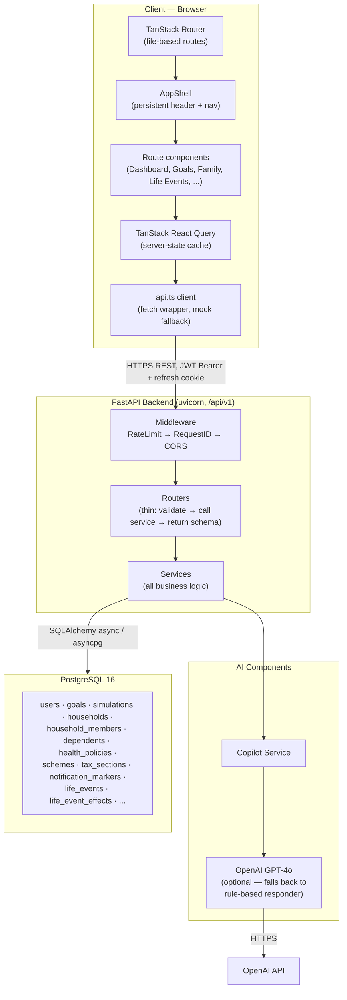
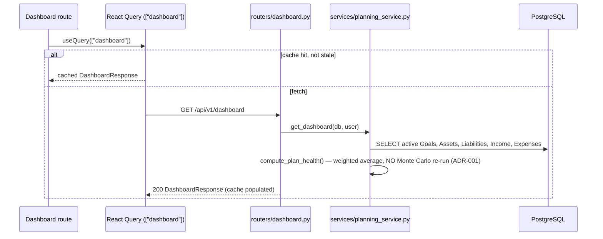
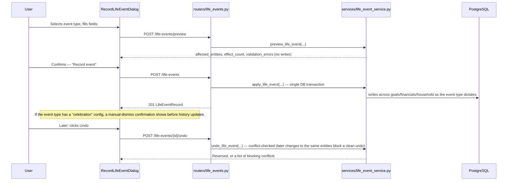

# System Architecture

**Status:** Canonical · **Last verified against code:** 2026-07-14
**Supersedes:** `SystemArchitectureBible.md` (compiled 2026-07-09, archived at `docs/13_Archive/ArchivedReports/SystemArchitectureBible.md`), `ArchitectureReport.md`, `docs/architecture.md` (pre-existing, archived — accurate for Milestone 1 only).
**Method:** Every statement below was verified by reading the source in this repository directly — routers, services, models, schemas, middleware, the frontend route tree, `api.ts`, and `package.json`/`pyproject.toml`. Where something is not implemented, this document says so explicitly rather than describing an aspiration. Where the source Bible (07-09) was found to be stale against the current codebase, this document corrects it and says so — see §2.9.

---

## 1. Executive Summary

**Northstar is a goal-based financial planning SaaS.** A user defines financial goals — retirement, a child's education, a home purchase, an emergency fund — and the platform runs a real Monte Carlo simulation to compute an actual, statistically-grounded probability that the goal will be met, then surfaces concrete, ranked ways to improve that probability (save more, extend the timeline, take more risk). Beyond individual goals, Northstar has a genuinely differentiated second pillar: **family-first, India-specific financial planning** — a household model that tracks family members, evaluates their eligibility for real Indian government schemes (Sukanya Samriddhi Yojana, Senior Citizens' Savings Scheme, etc.) against versioned, effective-dated policy data, and computes tax-deduction-aware insurance recommendations (Section 80D). A third pillar, added after the original Bible was compiled and folded in here (§2.9), is the **Life Event Engine** — a system that translates a real-world life event (marriage, house purchase, job change, divorce, retirement...) into a coordinated, previewable, undoable set of changes across goals, financials, and household state in one transaction.

**Who are the users?** Individuals and families building a long-term financial plan, most concretely modeled around Indian tax/scheme context (the family/insurance/schemes subsystem is explicitly India-specific), while the core goal/Monte-Carlo engine is currency-agnostic.

**What business value does it provide?** It replaces a spreadsheet-and-guesswork approach to "will I actually retire on time?" with a real probabilistic answer, replaces "do I qualify for any of these nine government schemes?" with a personalized, pre-filtered, explained answer, and replaces "what do I even need to update after a life event?" with one coordinated, reversible action — all three commitments trace to `docs/03_Engineering/CodingStandards.md`'s Product Principles (#2 every recommendation must be explainable; #6 schemes are personalized, never a flat catalog).

**Major capabilities, verified present in this codebase:**
- Goal creation/tracking with a real 10,000-path Monte Carlo simulation engine (`backend/app/services/monte_carlo.py`)
- A financial dashboard aggregating goals, assets, liabilities, income, and expenses into net worth, savings rate, and a weighted "plan health" score
- An Optimizer that proposes ranked, concrete contribution/risk-profile changes to raise a goal's success probability
- A Family module: household/member management, government scheme eligibility evaluation, family health-insurance tracking with an 80D-deduction recommendation, a cross-source recommendation aggregator with conflict detection, and a composed Family Dashboard
- A **Life Event Engine**: 18 event types (Retirement, House Purchase, Marriage, Birth of Child, Divorce, Job Change, Salary Raise, Bonus, Inheritance, Business Start/Sale, Home Sale, New Loan, Loan Payoff, Medical Emergency, Caring for a Parent, Adoption, Education Planning), each with a preview-before-commit step, a single-transaction multi-entity effect application, and a conflict-aware undo
- A Global Shell: a persistent app frame with a working Global Command Palette (⌘K search), a Notification Center (backend-driven, presentation-layer-only), and a Profile Menu — all built and hardened across this project's own Milestone 2.6
- An AI Copilot that narrates the user's *already-computed* data via GPT-4o, with a deterministic rule-based fallback when no API key is configured
- JWT authentication with httpOnly-cookie refresh rotation, CSRF double-submit protection, and a token-bucket rate limiter

---

## 2. Product Overview

*(User-facing capabilities only — implementation details are covered from §6 onward.)*

### 2.1 Onboarding
A new user registers, then walks through a step-based onboarding wizard (`code/src/routes/onboarding.tsx`) that seeds their profile, financial assumptions, and an initial household (spouse/children/dependent-parents yes/no questions — deliberately kept to a handful of questions per the UX Principles, not a full census). The closing screen explains the Plan Health score in one sentence (added in the Behavioral/UX completion mission, §2.9).

### 2.2 Dashboard
The landing screen after login. Shows net worth, liquid vs. invested assets, liabilities, monthly income/expenses/savings rate, a "plan health" score (0–100, weighted by each goal's dollar size, explainable on demand via a popover), a projected retirement figure, a short list of actionable suggestions, and a "recent life events" card.

### 2.3 Goals
Users create goals (name, category — retirement/education/home/travel/wealth/emergency — target amount, target date, monthly contribution, risk profile). Every goal shows a live-computed success probability and an on-track/at-risk flag. Editing a goal's financial inputs triggers a fresh Monte Carlo run; editing anything else does not.

### 2.4 Simulation & Optimization
A dedicated simulate/optimize surface lets a user request a full 10,000-path simulation (percentile outcomes, not just pass/fail) and ask for ranked suggestions to reach a target confidence level.

### 2.5 Family
A household workspace surfacing Family Goals, Government Schemes (Eligible/Potentially Eligible/Not Eligible per member), Family Insurance (tracked policies + 80D recommendation), Family Recommendations (aggregated, conflict-flagged), and a Family Dashboard (six cards, each degrading independently rather than failing the whole page).

### 2.6 Life Events
A picker of 18 real-world events, each with its own form, a "Preview effects" step (shows exactly what will change before committing), a single-transaction commit, a history list (Recorded/Reversed status, plain-language summaries of what changed), and a conflict-aware Undo. Six unambiguously positive milestones (Retirement, House Purchase, Marriage, Birth of Child, Adoption, Loan Payoff) get an honest, specific celebratory confirmation; two hard events (Divorce, Medical Emergency) get a calm, non-alarmist supportive note — both additions from the Behavioral Design phase of the most recent completion mission, never manufacturing urgency or false positivity for ambiguous events (Bonus, Inheritance, Business Sale, etc.).

### 2.7 Global Shell (Header)
⌘K/Ctrl+K Command Palette, a real backend-driven Notification Center, and a Profile Menu.

### 2.8 AI Copilot
A chat surface grounded in the user's actual goal data — it narrates and reasons about numbers the Monte Carlo engine already computed; it never originates a financial figure itself.

### 2.9 Reports & Settings
A read-only summary report (mirrors the dashboard's figures, a per-goal breakdown, and a "Life Events This Year" section) and an account settings surface.

### 2.10 Correction to the source Bible: the Life Event Engine

`SystemArchitectureBible.md` (compiled 2026-07-09) predates this engine entirely — its Feature Inventory (§8 there) has no Life Event row, and its migration count ("9 migrations, `001`→`009`") is now stale. Verified directly against the current codebase this session: `backend/app/routers/life_events.py` and `backend/app/services/life_event_service.py` exist, and two additional migrations exist (`010_life_events.py`, `011_life_event_hardening.py`) — **11 migrations total, not 9.** This is corrected throughout this document rather than silently inherited from the stale source, per this project's own "verify against the actual codebase" discipline. Full architecture detail lives in `docs/02_Architecture/LifeEventEngine.md`.

---

## 3. High-Level Architecture



**Communication summary:** Frontend ↔ Backend over HTTPS REST under `/api/v1`, JWT access token in the `Authorization: Bearer` header plus an httpOnly refresh cookie scoped to `/api/v1/auth`. Backend ↔ Database via `asyncpg` through SQLAlchemy's async engine. Backend ↔ AI via a single module-level `AsyncOpenAI` client in `routers/copilot.py` — **no other external service exists in this codebase.**

---

## 4. Technology Stack

| Layer | Technology | Why (as evidenced in this repo) |
|---|---|---|
| Frontend framework | **TanStack Start** (React 19) | File-based routing with SSR shell support |
| Frontend build | **Vite 8** + `@tanstack/router-plugin` | Route-tree codegen, fast dev server |
| Styling | **Tailwind CSS v4** | Frozen "Deep Navy Premium" design system in `code/src/styles.css` |
| Component primitives | **Radix UI** + shadcn-style `components/ui/` | Accessible, unstyled primitives — the Global Shell's overlays are built on these |
| Command palette engine | **cmdk** | ⌘K component library |
| Server state | **TanStack React Query v5** | One `QueryClient`, single source of truth for server-derived state |
| Client routing state | **TanStack Router** | File-based routes, typed search params (Zod) |
| Forms | **react-hook-form** + Zod | Schema-validated forms |
| Charts | **Recharts** | Dashboard visualizations |
| Animation | **motion** | Compositor-friendly properties only, per convention |
| Icons | **lucide-react** | App-wide |
| Backend framework | **FastAPI 0.115** | Async-native, Pydantic-integrated, automatic OpenAPI |
| ASGI server | **uvicorn[standard] 0.32** | |
| ORM | **SQLAlchemy 2.0 (async)** + **asyncpg 0.30** | Async-first end to end; no sync DB driver anywhere |
| Migrations | **Alembic 1.14** | **11** migrations to date (`001`→`011`), all additive |
| Validation | **Pydantic 2.10** | Every request/response schema |
| Auth | **python-jose** (JWT) + **passlib[bcrypt]** | Hand-rolled JWT issuance/verification, no third-party auth-as-a-service |
| Numerics | **NumPy 2.2** | Fully vectorized Monte Carlo engine — no per-path Python loop |
| AI | **openai 1.58** | `AsyncOpenAI`, GPT-4o |
| Database | **PostgreSQL 16** | |
| Backend testing | **pytest** + **pytest-asyncio** + **pytest-cov** | `--cov-fail-under=80` enforced |
| Backend lint/type-check | **Ruff** + **mypy --strict** | Hard gate |
| Frontend lint/format | **ESLint 9** (flat config) + **Prettier** | |
| Deployment | `backend/Dockerfile`, `.github/workflows/ci.yml` | **Corrected in V2 (a real documentation-vs-implementation contradiction found and fixed):** a CI pipeline *does* exist — present since the repository's initial commit, predating every prior architecture document that claimed otherwise. It runs backend lint (Ruff) + type-check (mypy) + tests, frontend type-check + lint, and a Docker build-check for the backend image, on every push/PR to `main`/`develop`. **Still genuinely absent:** no frontend Dockerfile, no CD/deployment step (build-verification only, nothing publishes or deploys). The CI test invocation itself is a bare `pytest -v --tb=short`, but `backend/pyproject.toml`'s own `[tool.pytest.ini_options]` `addopts` already bakes in `--cov=app --cov-fail-under=80`, so the 80% coverage gate **is** enforced in CI by inheritance, not by an explicit CI-level flag — confirmed by reading `pyproject.toml` directly. |

---

## 5. Repository Structure

```
Goal-oriented/
├── backend/app/
│   ├── main.py            App factory: middleware order, router registration, /health
│   ├── config.py          Pydantic Settings — every env-driven value in one place
│   ├── database.py        Async engine, session factory, declarative Base
│   ├── middleware/         auth.py, rate_limit.py, request_id.py
│   ├── models/             SQLAlchemy ORM — the schema's source of truth
│   ├── schemas/            Pydantic request/response contracts
│   ├── routers/            Thin HTTP handlers, one file per domain (incl. life_events.py)
│   └── services/           All business logic (incl. life_event_service.py)
├── backend/alembic/versions/   11 migrations, additive-only
├── backend/tests/              pytest suite, ≥80% coverage enforced
├── code/src/
│   ├── routes/              File-based routes, one file = one URL
│   ├── components/          app-shell.tsx, global-palette.tsx, notification-center.tsx,
│   │                         dashboard/, family/, life-events/, onboarding/, ui/
│   ├── hooks/                Custom hooks (incl. use-dialog-a11y.ts)
│   └── lib/                  api.ts (the entire backend contract), utils, mock-data
└── docs/                    This documentation system (v2)
```

---

## 6. Application Layers

| Layer | Purpose | Main files | Communicates with |
|---|---|---|---|
| **Presentation** | Renders UI, captures input | `code/src/routes/*.tsx`, `code/src/components/**` | React Query hooks → `api.ts` |
| **API (frontend)** | Single point of contact with backend; snake_case ↔ camelCase; token refresh | `code/src/lib/api.ts` | `fetch` → Backend API layer |
| **API (backend)** | HTTP concerns only | `backend/app/routers/*.py` | Service layer |
| **Business/Service** | All calculations, validation-with-context, orchestration | `backend/app/services/*.py` | Persistence layer |
| **Persistence (ORM)** | Schema, relationships, cascades | `backend/app/models/*.py` | Database via SQLAlchemy |
| **Database** | Durable storage | PostgreSQL 16, Alembic-migrated | — |
| **Infrastructure** | Auth, rate limiting, request correlation, CORS | `backend/app/middleware/*.py` | Wraps every request |

**The one rule enforced without exception across every router read for this document:** a router calls at most one service function's worth of logic and returns a schema.

---

## 7. Request Lifecycle (representative flows)

### 7.1 Goal Creation (with Monte Carlo trigger)

```mermaid
sequenceDiagram
    participant U as User
    participant FE as Goals page
    participant R as routers/goals.py
    participant S as services/planning_service.py
    participant MC as services/monte_carlo.py
    participant DB as PostgreSQL

    U->>FE: Fills goal form, submits
    FE->>R: POST /api/v1/goals
    R->>S: calculate_goal_probability(goal)
    S->>MC: quick_probability_async(...)
    MC->>MC: run_simulation() — 2,000 paths, vectorized NumPy
    MC-->>S: success_rate
    S->>S: goal.probability = round(success_rate, 1); on_track = probability >= 70.0
    R->>DB: db.add(goal); db.flush()
    R-->>FE: 201 GoalResponse
```

**Why this matters (ADR-001):** this is the *only* path that ever writes `goal.probability`/`goal.on_track`. See `docs/03_Engineering/ArchitectureDecisionRecords.md`.

### 7.2 Dashboard Load (read-only, verified)



`AppShell` shares this exact `["dashboard"]` query key with the Dashboard route, so both consumers read one cached response, not two independent fetches.

### 7.3 Life Event: Record, Preview, Undo (added since the source Bible — §2.9)



Full detail (all 18 event types, effect contracts, undo-conflict rules) lives in `docs/02_Architecture/LifeEventEngine.md`.

### 7.4 Family Recommendation Generation

`family_recommendations_service.py` performs **zero eligibility math and zero deduction-figure computation of its own** — every value is read live from an already-certified engine (insurance service, scheme eligibility service) and only reformatted/conflict-checked. Full sequence in `docs/02_Architecture/RecommendationEngine.md`.

---

## 8. Feature Inventory

| Feature | Frontend | Backend | Database | Status |
|---|---|---|---|---|
| Auth | `routes/auth.*.tsx` | `routers/auth.py` | `users`, `password_reset_tokens` | ✅ Complete |
| Goals (CRUD + probability) | `routes/app.goals.tsx` | `routers/goals.py`, `services/planning_service.py` | `goals` | ✅ Complete |
| Monte Carlo Simulation | `GoalSimPanel.tsx` | `routers/simulate.py`, `services/monte_carlo.py` | `simulations` | ✅ Complete |
| Optimizer | via simulate/optimize | `services/optimizer.py` | reads `goals` | ✅ Complete |
| Dashboard | `routes/app.index.tsx` | `routers/dashboard.py` | reads goals/assets/liabilities/income/expenses | ✅ Complete |
| Financials | financials forms | `routers/financials.py` | `income_sources`,`expenses`,`assets`,`liabilities` | ✅ Complete (CRUD) |
| Assumptions | settings-adjacent | `routers/assumptions.py` | `financial_assumptions` | ⚠️ Complete as CRUD, **disconnected from Monte Carlo** — see §10.9 |
| Profile | `routes/app.profile.tsx` | `routers/profile.py` | `user_profiles` | ✅ Complete, 2 deprecated fields |
| Family Home/Members | `routes/app.family.*.tsx` | `routers/family.py` | `households`,`household_members`,`dependents` | ✅ Complete |
| Government Scheme Eligibility | `routes/app.family.schemes.tsx` | `services/scheme_eligibility_service.py` | `schemes`,`scheme_eligibility_rules`,`scheme_rates` | ✅ Complete, narrow scope (3 rule types) |
| Family Insurance | `routes/app.family.insurance.tsx` | `services/family_insurance_service.py` | `health_policies`,`health_policy_coverage`,`tax_sections` | ✅ Complete |
| Family Recommendations | `routes/app.family.recommendations.tsx` | `services/family_recommendations_service.py` | reads only | ✅ Complete |
| Family Dashboard | `routes/app.family.index.tsx` | `services/family_dashboard_service.py` | reads only, graceful degradation | ✅ Complete |
| **Life Events** (18 types) | `routes/app.life-events.tsx`, `components/life-events/*` | `routers/life_events.py`, `services/life_event_service.py` | `life_events`, `life_event_effects` | ✅ Complete — **added since the source Bible, corrected here (§2.9)** |
| Global Command Palette | `components/global-palette.tsx` | none (client-side) | none | ✅ Complete |
| Notification Center | `components/notification-center.tsx` | `routers/notifications.py` | `notification_markers` (state only) | ✅ Complete |
| Profile Menu / Persistent AppShell | `components/app-shell.tsx` | none | none | ✅ Complete |
| AI Copilot | `routes/app.copilot.tsx` | `routers/copilot.py` | reads `goals` | ✅ Complete, deterministic fallback |
| Reports | `routes/app.reports.tsx` | `routers/reports.py` | reads only | ✅ Complete |
| Recommendation Engine (persisted, general-purpose) | — | — | `recommendations`,`recommendation_citations` | ⛔ Not implemented — schema exists, zero consumers |
| HUF entities | — | — | `huf_entities`,`huf_coparceners` | ⛔ Not implemented — schema-only |
| Nominees / Estate Documents | — | — | `nominees`,`estate_documents` | ⛔ Not implemented — schema-only |
| Best-Practice / Company Policy rules | — | — | `best_practice_rules`,`company_policies` | ⛔ Not implemented — schema-only |

---

## 9. State Management (frontend)

- **Server state:** exclusively TanStack React Query. One `QueryClient`, provided once. Query keys deliberately shared across independent call sites (`["dashboard"]` used by both `AppShell` and the Dashboard route).
- **Known, unresolved gap:** `app.goals.tsx`, `app.profile.tsx`, **and now also `app.reports.tsx`/`app.copilot.tsx`** (confirmed by the most recent completion mission's own Phase 9 report) bypass the shared cache via raw `useEffect`+`fetch` — tracked as FE-005, see §10.
- **Shared UI state (Global Shell overlays):** a single discriminated-union `activeOverlay` state in `AppShell`, structurally guaranteeing only one header overlay can be open at once (Milestone 2.6.1 fix).
- **Hand-rolled dialogs:** three overlays (`RecordLifeEventDialog`, `GoalSimPanel`, the inline "New goal" modal) are framer-motion-based, not Radix — as of the most recent completion mission's Phase 8, all three now have Escape-to-close, a focus trap, and focus return via a shared `useDialogA11y` hook, at parity with the Radix-based shell overlays.
- **Local state:** ordinary `useState` everywhere else — no Redux/Zustand/Context-based global store exists anywhere in this codebase.

---

## 10. Known Risks & Limitations

*(Only limitations directly verified in this codebase — nothing invented. Merged from the source Bible §16, `ArchitectureDriftReview.md`, `GlobalShellTechnicalDebt.md`, and the most recent completion mission's own phase reports.)*

1. **`FinancialAssumptions` is disconnected from the Monte Carlo engine.** A user's configured expected-return assumptions have zero effect on their simulations (`monte_carlo.py`'s `PROFILE_PARAMS` is a hardcoded module constant). `monte_carlo.py`'s `ANNUAL_INFLATION = 0.03` is declared but never referenced — dead code, confirmed by grep.
2. **`user_profiles.marital_status`/`.dependents` and `financial_assumptions.tax_rate` are deprecated but not removed** — a documented removal plan exists (`FoundationReconciliationReport.md`), not yet executed. Re-verified during the Milestone 2 Architecture Drift Review (07-07): zero remaining frontend consumers of the deprecated Profile fields.
3. **FE-005 — four frontend pages bypass the shared React Query cache**: `app.goals.tsx`, `app.profile.tsx`, `app.reports.tsx`, `app.copilot.tsx` use raw `useEffect`+`fetch` instead of `useQuery`. The first two were flagged as far back as Milestone 2.6's own Global Shell Technical Debt review; the latter two were confirmed still open as of the most recent completion mission (Phase 2/Phase 9 reports), which deliberately left this out of scope each time (a data-layer migration, not a targeted UX fix).
4. **No frontend automated test suite exists** — no `*.test.tsx` files anywhere under `code/src/`; correctness is verified via `tsc`/`eslint` plus manual/live browser verification.
5. **Scheme eligibility evaluation is narrow by design** — exactly three rule types (`max_age`, `min_age`, `gender`); a `self` member's own eligibility is not evaluated; SCSS's retiree/defense-personnel special cases have no seeded rules.
6. **No real-time transport** — Notification Center polling only (120s interval), no WebSocket/SSE anywhere.
7. **No frontend Dockerfile or CD/deployment step.** (Corrected in V2: a backend-lint/test + frontend-lint/typecheck + Docker-build-check **CI** pipeline does exist, `.github/workflows/ci.yml`, present since the initial commit — every prior document's "no CI" claim was stale, never re-checked against `.github/` directly. What's genuinely still missing is *deployment* automation, not verification.)
8. **Audit logging is scoped to the Family domain only** — Goals and Financials CRUD are not audit-logged.
9. **Rate limiting is in-memory, single-process** — will not correctly share limits across multiple uvicorn workers or horizontally-scaled instances without a Redis-backed replacement.
10. **The Command Palette cannot deep-link to a specific Goal, Government Scheme, or Insurance Policy** — only Family Member results deep-link to a record-specific route.
11. **Hand-rolled dialog focus-trap is minimal, not general-purpose** (Phase 8 of the most recent completion mission) — sufficient for the three current dialogs' simple content; a future dialog needing nested-dialog focus semantics should adopt Radix's `Dialog` primitive directly rather than extending `useDialogA11y` further.
12. **App-wide raw-Tailwind-vs-semantic-color-token split** — raw Tailwind colors (`red-400`) are the dominant, working convention for error banners across 22 files vs. 15 files using semantic tokens (`text-destructive`) — confirmed via grep during the most recent completion mission's Phase 6, correctly left as-is (chasing a textbook ideal that isn't this codebase's actual convention would be the wrong "consistency" fix) but flagged as a candidate for a future, deliberate, dedicated migration if the semantic-token convention is ever declared the standard.

---

## 11. Validation Summary

Architecture health has been checked at multiple points across this project's history, not just once at Bible-compile time:

| Checkpoint | Date | Result |
|---|---|---|
| Architecture Drift Review (post-Stabilization-Sprint) | 07-07 | **PASS** — no drift, no duplicate services/APIs/calculations, no deprecated consumers left unresolved, no broken ownership model, no policy inconsistencies. |
| Milestone Resumption Certification | 07-07 | **PASS** |
| Architecture Review — Phase 0 (Persistent AppShell) | 07-08 | **PASS** |
| Architecture Review — Phase 2 (Command Palette), superseded by Phase 2 Final | 07-08 | **PASS** |
| Architecture Review — Phase 3 (Notification Center) | 07-08 | **PASS** |
| Architecture Review — M2.1-P4 (Dashboard Query Optimization) | 07-08 | **PASS** |
| Architecture Review — M2.6.1 (Overlay Mutual Exclusion Fix) | 07-08 | **PASS**, and the one real certification gap found earlier (Profile Menu not yielding to Command Palette, `GlobalShellTechnicalDebt.md`) was fixed by this same change. |
| Global Shell Certification (Milestone 2.6, full) | 07-08 | **PASS** — keyboard-only reachability, focus trapping, focus return, Escape handling, ARIA correctness, cross-account data isolation all verified live. |
| Northstar Final Product Review (Phases 1–10 completion mission) | 07-13 | **GO WITH MINOR CHANGES** — Overall 9/10; zero backend files touched across all 9 product-experience phases; 673/673 backend tests passing at 97.89% coverage throughout. |

No checkpoint found unresolved architecture drift at the time it ran. Every finding logged above in §10 remains open by deliberate choice (documented reasoning available in each source review), not by oversight.

---

## 12. Future Extension Points

- **AI:** `Recommendation`/`RecommendationCitation` schema (reasoning, confidence, alternatives, citation back to source data) is ready for a future Recommendation Engine milestone with zero migration needed.
- **HUF / Estate Planning:** `HUFEntity`, `HUFCoparcener`, `Nominee` (SEBI 2026 nomination-rule-shaped), `EstateDocument` — fully migrated, zero consumers, intentional pre-built runway.
- **Policy Engine, Layers 2-3:** `BestPracticeRule`, `CompanyPolicy` — structural support for a future ranking layer atop the already-built government-scheme Layer 1.
- **Investment / Tax Engine:** versioned `tax_regimes`/`tax_slabs`/`tax_acts`/`tax_sections` already support effective-dated old-vs-new regime comparison; no router exposes a full tax calculation yet.
- **Simulation infrastructure:** moving Monte Carlo to a Celery/Redis worker with SSE streaming is the documented next step if inline p99 latency ever exceeds 200ms.
- **Notifications:** a "goal probability changed" source was deliberately deferred (would need new last-notified-probability state).
- **FE-005 remediation:** migrate `app.goals.tsx`, `app.profile.tsx`, `app.reports.tsx`, `app.copilot.tsx` onto the shared React Query cache.

---

## 13. Glossary

| Term | Meaning |
|---|---|
| **Calculation Context** | The `Goal` fields whose change is the only trigger for Monte Carlo recalculation (`planning_service.CALCULATION_CONTEXT_FIELDS`) |
| **ADR-001** | The Calculation Lifecycle rule — reads never recompute or persist financial calculations |
| **ADR-005** | Recommendations computed live on every read, never persisted |
| **Household** | The family-grouping entity — aggregates existing per-user data, never becomes source of truth for any individual's own records |
| **80D** | The Indian Income Tax Act section governing health-insurance-premium deductions |
| **Plan Health Score** | 0–100 integer, target-amount-weighted average of every active goal's Monte Carlo success probability |
| **On Track** | `probability >= 70.0` — the single hardcoded threshold |
| **Active Overlay** | The single-state variable structurally guaranteeing only one header overlay is open at a time |
| **Life Event** | A real-world event (18 types) that, once recorded, applies a coordinated, previewable, undoable set of effects across goals/financials/household in one transaction |
| **Celebration / Supportive Note** | The Behavioral Design phase's honest, manual-dismiss confirmation for 6 unambiguously positive life events, and calm acknowledgment banner for 2 hard ones |
| **FE-005** | The tracked, known gap where 4 frontend pages bypass the shared React Query cache |

---

## Related Documents

- `docs/02_Architecture/CalculationEngine.md` — the Monte Carlo engine referenced throughout §7.1, §10.1
- `docs/02_Architecture/RecommendationEngine.md` — the Family/Government-Scheme/Recommendation subsystem referenced in §2.5, §7.4
- `docs/02_Architecture/LifeEventEngine.md` — full detail on the engine summarized in §2.6, §2.9, §7.3
- `docs/07_AI/AIArchitecture.md` — the AI Copilot referenced in §2.8
- `docs/06_Frontend/FrontendArchitecture.md` — the Global Shell, dialogs, and state-management detail referenced in §2.7, §9
- `docs/05_Database/DatabaseArchitecture.md` — full schema behind every table named in §3, §8
- `docs/03_Engineering/ArchitectureDecisionRecords.md` — full ADR text for ADR-001, ADR-005, and every other numbered decision referenced in §7, §13
- `docs/03_Engineering/EngineeringHandbook.md` — safe-modification guidance for every subsystem named here
- `docs/04_API/ServiceInteractions.md` — every API call implied by §7's sequence diagrams
- `docs/08_Testing/ValidationStrategy.md` — full detail behind §11's checkpoint table

## Related ADRs
ADR-001 (Calculation Lifecycle), ADR-005 (Recommendation Freshness), ADR-011 (Deprecation Completion) — see `ArchitectureDecisionRecords.md`.

## Related APIs
`POST/PATCH /goals`, `GET /dashboard`, `POST/GET/POST .../undo /life-events*`, `GET /family/recommendations` — see `docs/04_API/RESTAPI.md`.

## Related Database Tables
`goals`, `simulations`, `households`, `household_members`, `life_events`, `life_event_effects`, `notification_markers` — see `docs/05_Database/DatabaseSchema.md`.

## Related Services
`planning_service.py`, `monte_carlo.py`, `family_recommendations_service.py`, `life_event_service.py`, `notification_service.py`.

## Related Frontend Components
`app-shell.tsx`, `global-palette.tsx`, `notification-center.tsx`, `RecordLifeEventDialog.tsx`, `GoalSimPanel.tsx`, `use-dialog-a11y.ts`.


## Related Tests
`test_planning_service.py`, `test_goals.py`, `test_monte_carlo.py`, `test_family_dashboard.py`, `test_notifications.py` — the cross-domain integration suites that exercise this document's own request-lifecycle diagrams end to end.

## Related Validation Reports
`ValidationStrategy.md` §"Global Shell Certification" and §"Life Event Engine — Final Release Audit" — the two most comprehensive system-wide validation passes this document's own claims rest on.

## Related Implementation Reports
The Life Event Engine's Phase A–F implementation reports and the most recent Product Experience Completion mission's 10 phase reports (archived, `13_Archive/ArchivedImplementationReports/` and `ArchivedAudits/`).

## Related Future Work
`ArchitectureDecisionRecords.md` §"Future Decisions" (Portfolio Engine, Tax Optimizer, Estate Planning activation) · `AIArchitecture.md` §10 (the AI migration roadmap V1–V5) · `Roadmap.md` (product-level V2/V3/V4).
---

*Archived originals for this document's full merge history: `docs/13_Archive/ArchivedReports/SystemArchitectureBible.md`, `ArchitectureReport.md`, `ArchitectureDriftReview.md`, `ArchitectureReview_Phase0/2/2_Final/3.md`, `ArchitectureReview_M2.1-P4.md`, `ArchitectureReview_M2.6.1.md`, `GlobalShellArchitecture.md`, `GlobalShellImplementationPlan.md`, `GlobalShellCertification.md`, `GlobalShellRegressionReport.md`, `GlobalShellTechnicalDebt.md`, `ExecutiveSummary.md`, `MilestoneResumptionCertification.md`, `DesignAuthorityReview_Milestone1_v2.md`, `ProductDesignAuthorityReview.md`.*
