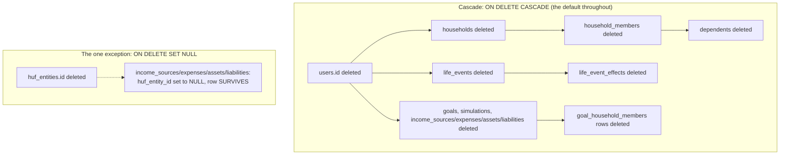
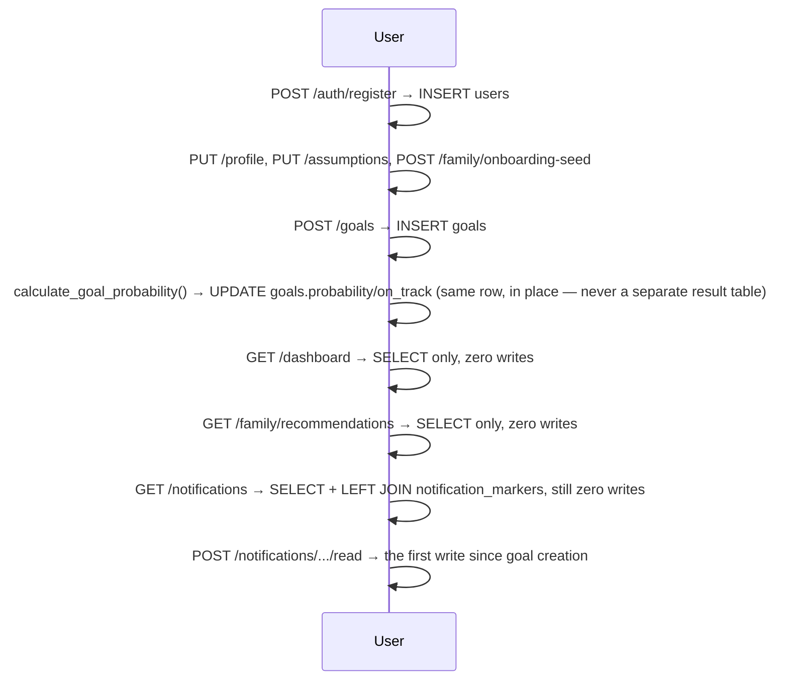

# Database Architecture

**Status:** Canonical · **Last verified against code:** 2026-07-09, updated 2026-07-13 for the Life Event Engine's 2 additional tables (added since the source Bible)
**Supersedes:** `DatabaseSchemaBible.md` (archived — the single largest source document in this archive at 108KB), `DatabaseDesignReport.md` (earlier, 07-06, superseded).
**Companion reference doc:** `docs/05_Database/DatabaseSchema.md` — the full table inventory, CRUD matrix, and migration-by-migration history live there; this document covers the conceptual model, relationships, lifecycle, and security/performance posture.
**Method:** every SQLAlchemy model file and every Alembic migration was read in full for the source Bible. This pass re-verifies the migration count (now 11, not 9) and table count (now 36, not 34) directly against the live codebase.

---

## 1. Overview

**PostgreSQL 16 is the single source of truth for every piece of durable state** — no secondary datastore, cache-as-source-of-truth, or document store exists anywhere. Every user-facing fact is a row in one of **36 tables** (34 at the source Bible's compile time, plus `life_events`/`life_event_effects` added since), reached exclusively through SQLAlchemy's async engine.

**Overall philosophy, verified across every migration:**
- **Additive-only migrations.** All 11 migrations (through `011_life_event_hardening.py`) either `CREATE TABLE IF NOT EXISTS` or `ADD COLUMN IF NOT EXISTS` — not one alters an existing column's type or drops a column with real data.
- **Soft delete over hard delete, almost everywhere.** Every user-owned entity table carries `is_active`; deletion means setting this to `false`, never `DELETE FROM`.
- **Versioned, effective-dated reference data for anything a regulator can change** — every Government Schemes table carries `effective_from`/`effective_to`; a superseded rate is never deleted, only superseded.
- **UUID primary keys everywhere**, generated by PostgreSQL's `gen_random_uuid()`.
- **Ownership resolved through `user_id` foreign keys**, not row-level security — every query enforces "does this row belong to the requesting user" explicitly in application code; PostgreSQL RLS is not used anywhere.

**Major domains:** Authentication, Goals, Financial Planning, Family, Government Schemes, Insurance, Recommendations, **Life Events** (new), Notifications, Audit Logs, and a "Future Modules" domain covering tables fully migrated but with zero current application consumers.

**Architectural principles:** a table's existence does not imply an active feature (12 of 36 tables have zero router/service consumers, §5); a foreign key's `ON DELETE` behavior is a deliberate per-relationship decision — verified to differ meaningfully between `CASCADE` and `SET NULL` in exactly one place (`huf_entity_id`).

---

## 2. Relationships

**One-to-one** (verified by a `UNIQUE` constraint on the FK column itself): `users`↔`user_profiles`, `users`↔`financial_assumptions`, `household_members`↔`dependents`.

**One-to-many** (the overwhelming majority): `users` → `goals`/`simulations`/`income_sources`/`expenses`/`assets`/`liabilities`/`households`/`health_policies`/`notification_markers`/`audit_logs`/**`life_events`** (new); `goals` → `simulations`; `households` → `household_members`; `health_policies` → `health_policy_coverage`; **`life_events` → `life_event_effects`** (new, `ON DELETE CASCADE`).

**Many-to-many**, both as explicit join tables, never a raw array/JSON column: `goals`↔`household_members` via `goal_household_members` (`UNIQUE(goal_id, household_member_id)` enforced); `health_policies`↔`household_members` via `health_policy_coverage` (**no** uniqueness constraint — a real, verified schema asymmetry with its sibling join table).

**Ownership model:** every table resolves ownership through either a direct `user_id` FK (the majority pattern) or indirect resolution through a household's `created_by_user_id` (the Family domain, via `family_service.resolve_owned_household`). **No table is owned by more than one user simultaneously** — `goal_household_members` is explicitly, repeatedly documented as descriptive tagging, never shared ownership.

**Delete behavior summary:**

| Strategy | Tables |
|---|---|
| Soft delete only (`is_active`, app-set) | `users`, `goals`, `income_sources`, `expenses`, `assets`, `liabilities`, `household_members`, `dependents`, `health_policies` (flag exists but no endpoint sets it — see Known Risks), **`life_events`** (via `status="undone"`, a richer state than a bare flag) |
| No delete path at all | `households`, `user_profiles`, `financial_assumptions`, `simulations`, `password_reset_tokens`, `notification_markers`, `audit_logs`, `health_policy_coverage` |
| Hard delete, cascading (only via parent) | `goal_household_members`, `huf_coparceners`, `nominees`, **`life_event_effects`** |
| Hard delete via `SET NULL` | financial tables' `huf_entity_id` on `huf_entities` deletion |

---

## 3. Data Lifecycle

### 3.1 Registration → Profile → Goals → Monte Carlo → Dashboard → Recommendations → Notifications

**The single most important lifecycle fact:** between goal creation and a notification being marked read, **every intervening step is a pure read** — Dashboard, Family Recommendations, and Notifications all touch the database only to `SELECT`. The only two write events in this entire chain are the initial goal creation and the explicit, user-initiated "mark as read" action.

### 3.2 Life Event Recording (new since the source Bible)

A life event's `record` call is the one place in this schema where a **single transaction routinely writes to more than one table** (e.g. House Purchase: `assets` + `liabilities` + optionally `goals`) — `life_event_effects` captures each touched row individually, enabling partial, guarded undo. Full detail: `docs/02_Architecture/LifeEventEngine.md`.

---

## 4. Security & Performance Posture

**Ownership checks** are verified at the table level: every single-resource query filters by `user_id`/household-ownership in the *same* query that fetches the row, never as a separate check after the fact. **Isolation** was confirmed via live cross-account testing during Global Shell Certification — a mismatched-owner request returns 404, never a data leak.

**Foreign-key safety:** every FK specifies an explicit `ON DELETE` behavior — no FK anywhere is left to its default (implicit `RESTRICT`) behavior.

**Validation** is predominantly enforced at the Pydantic layer, not mirrored by database-level `CHECK` constraints — the one verified exception is `nominees.percentage_share`'s `CHECK (0 < x <= 100)`, the single database-level numeric constraint in this entire schema.

**PII / sensitive data, precisely located:** `users.hashed_password` (bcrypt, never plaintext); `password_reset_tokens.token_hash` (SHA-256 of the token, never the raw value); date-of-birth fields; `huf_entities.huf_pan` (a government tax ID, stored in **plaintext — no encryption-at-rest anywhere in this schema**, confirmed by the absence of any encryption library in `requirements.txt`); every financial figure (income, asset value, liability balance) is plaintext, protected only by application-layer ownership checks, not database-level access control.

**Performance:** indexes are genuinely well-targeted, not generic (`ix_goals_user_id_priority` precisely matches the default goal-list query's `ORDER BY`); `family_dashboard_service` fetches its two shared lists exactly once each across 6 cards (a documented optimization); `family_insurance_service._covered_members_for_policies` is a verified, named N+1 fix (one batched query replacing a prior per-policy loop). **Known bottleneck:** `scheme_eligibility_service.evaluate_household_eligibility` loads every scheme and rule unconditionally on every call — fine at today's catalog size, a real scaling risk at "hundreds of schemes." **Unused indexes exist** on every zero-consumer table (§5) — real, if small, write-amplification cost with zero read benefit today.

---

## 5. Future Tables (fully migrated, zero application consumers)

12 tables, verified by exhaustive grep across `routers/` and `services/`, exercised only by model-level tests, never production code: `scheme_rates`, `tax_acts`, `tax_regimes`, `tax_slabs`, `policy_citations` (Government Schemes domain — Layer 1's data already active, these represent unbuilt display/comparison features); `recommendations`/`recommendation_citations` (a persisted, general-purpose citable-recommendation schema, deliberately unused in favor of live computation, §6); `huf_entities`/`huf_coparceners`/`nominees`/`estate_documents` (Estate/HUF planning); `best_practice_rules`/`company_policies` (Layers 2–3 of a documented 5-layer policy engine).

This is **not** dead code in the usual sense — each model file's own comments cite the specific future-milestone report that justifies its existence, a deliberate "schema built ahead of the feature" pattern so a future milestone doesn't require a migration to start.

---

## 6. Engineering Decisions

- **Goal ownership is singular and permanent** — `goal_household_members` exists specifically to add descriptive context without ever touching `goals.user_id`.
- **Household model aggregates, never duplicates** — no financial fact is ever copied into a household-scoped table.
- **Recommendation persistence was deliberately rejected** in favor of live computation — the unused `recommendations` table alongside live-computed Pydantic schemas is not an oversight; persisting recommendation content would recreate a staleness risk this schema was explicitly built to avoid (ADR-005).
- **Notification markers store state, never content** — the same "never persist a derived fact, only acknowledgment of it" principle, applied to a second feature after being established for recommendations.
- **`life_event_effects` captures before/after state per touched row, not one JSON blob on `life_events`** — this is what makes partial, guarded undo possible; a single blob no later code could safely reason about would not.
- **Audit logs use a generic before/after JSON shape** rather than one table per action type — flexibility over type safety, a trade-off made once and reused.
- **Join tables over array/JSON columns for every many-to-many relationship** — enabling FK-level cascade guarantees a JSON-array approach could not provide.

---

## Related Documents
`docs/05_Database/DatabaseSchema.md` (full table inventory, CRUD matrix, migration history) · `docs/02_Architecture/RecommendationEngine.md` (the Government Schemes/Insurance domain tables) · `docs/02_Architecture/LifeEventEngine.md` (`life_events`/`life_event_effects`) · `docs/03_Engineering/ArchitectureDecisionRecords.md` (ADR-001, ADR-005) · `docs/09_Security/SecurityArchitecture.md`

## Related ADRs
ADR-001, ADR-005.

## Related Database Tables
All 36 — see `docs/05_Database/DatabaseSchema.md` for the full inventory.

## Related Services
Every service in `backend/app/services/` ultimately reads/writes through this schema.

## Related Tests
`test_household_policy_models.py`, `test_foundation_reconciliation.py` — the model-level tests proving the 12 zero-consumer tables' schemas are structurally sound.

## Related Validation Reports
None beyond the source Bible's own verification pass (2026-07-09) — the schema has grown by exactly 2 tables (`life_events`, `life_event_effects`) since, both independently verified this pass.

## Related Implementation Reports
The 11 Alembic migrations themselves are the implementation record for this domain — see `DatabaseSchema.md` §2.

## Related Future Work
Adding the `UNIQUE` constraint `health_policy_coverage` is missing (DB-005) · filtering `tax_sections` by `effective_from`/`effective_to` before a second row is ever seeded (DB-003).

---

*Archived originals: `docs/13_Archive/ArchivedReports/DatabaseSchemaBible.md`, `DatabaseDesignReport.md`.*
