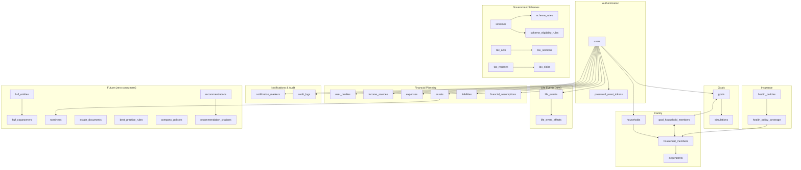

# Entity Relationships

**Status:** Canonical · **Last verified against code:** 2026-07-13
**Supersedes:** `DatabaseSchemaBible.md` §2 (the complete ER diagram, archived in full — 400 lines of per-table Mermaid ERD, preserved there rather than reproduced here, since this document's job is the *relationship* summary a reader needs before diving into that much detail, not a duplicate of it).
**Companion docs:** `docs/05_Database/DatabaseArchitecture.md` (conceptual model, cascade behavior) · `docs/05_Database/DatabaseSchema.md` (flat table inventory).

---

## Domain Clusters

---

## Cardinality Reference

| Relationship | Type | Enforcement |
|---|---|---|
| `users` ↔ `user_profiles` | 1:1 | `UNIQUE(user_id)` |
| `users` ↔ `financial_assumptions` | 1:1 | `UNIQUE(user_id)` |
| `household_members` ↔ `dependents` | 1:1 | `UNIQUE(household_member_id)` |
| `users` → `goals`/`simulations`/financial tables/`households`/`health_policies`/`notification_markers`/`audit_logs`/**`life_events`** | 1:many | `user_id` FK, `ON DELETE CASCADE` |
| `households` → `household_members` → `dependents` | 1:many chain | FK, `ON DELETE CASCADE` |
| `goals` ↔ `household_members` | many:many | `goal_household_members`, `UNIQUE(goal_id, household_member_id)` enforced |
| `health_policies` ↔ `household_members` | many:many | `health_policy_coverage`, **no** uniqueness constraint (a real, verified asymmetry vs. its sibling table — DB-005) |
| **`life_events` → `life_event_effects`** | 1:many | FK, `ON DELETE CASCADE` |
| `huf_entities` ⇢ financial tables | optional attribution | `huf_entity_id`, nullable, **`ON DELETE SET NULL`** — the one relationship in this schema using this behavior instead of `CASCADE` |

**The single rule governing every relationship in this schema:** ownership resolves through exactly one of two mechanisms — a direct `user_id` FK, or indirect resolution through a household's `created_by_user_id`. No table is ever owned by more than one user simultaneously.

---

## Related Documents
`docs/05_Database/DatabaseArchitecture.md` (relationships in architectural context, cascade diagram) · `docs/05_Database/DatabaseSchema.md` (flat inventory) · `docs/02_Architecture/RecommendationEngine.md` (the business meaning behind the Family/Schemes/Insurance clusters) · `docs/02_Architecture/LifeEventEngine.md` (the new Life Events cluster)

## Related Tests
`test_foundation_reconciliation.py::test_deleting_huf_entity_nulls_ownership_not_cascades`, `test_family_goal_tagging_schema.py::test_deleting_goal_cascades_tag_removal` — the two FK-cascade behaviors specifically confirmed against real Postgres, not just SQLite (DB-011).

---

*Archived original: `docs/13_Archive/ArchivedReports/DatabaseSchemaBible.md` (full per-table ER diagram, §2, preserved there in complete detail).*
