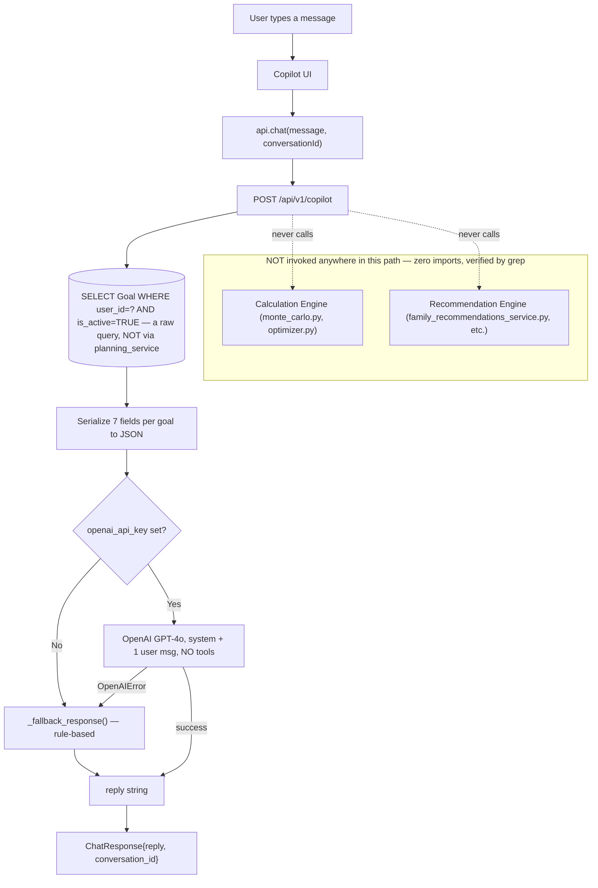
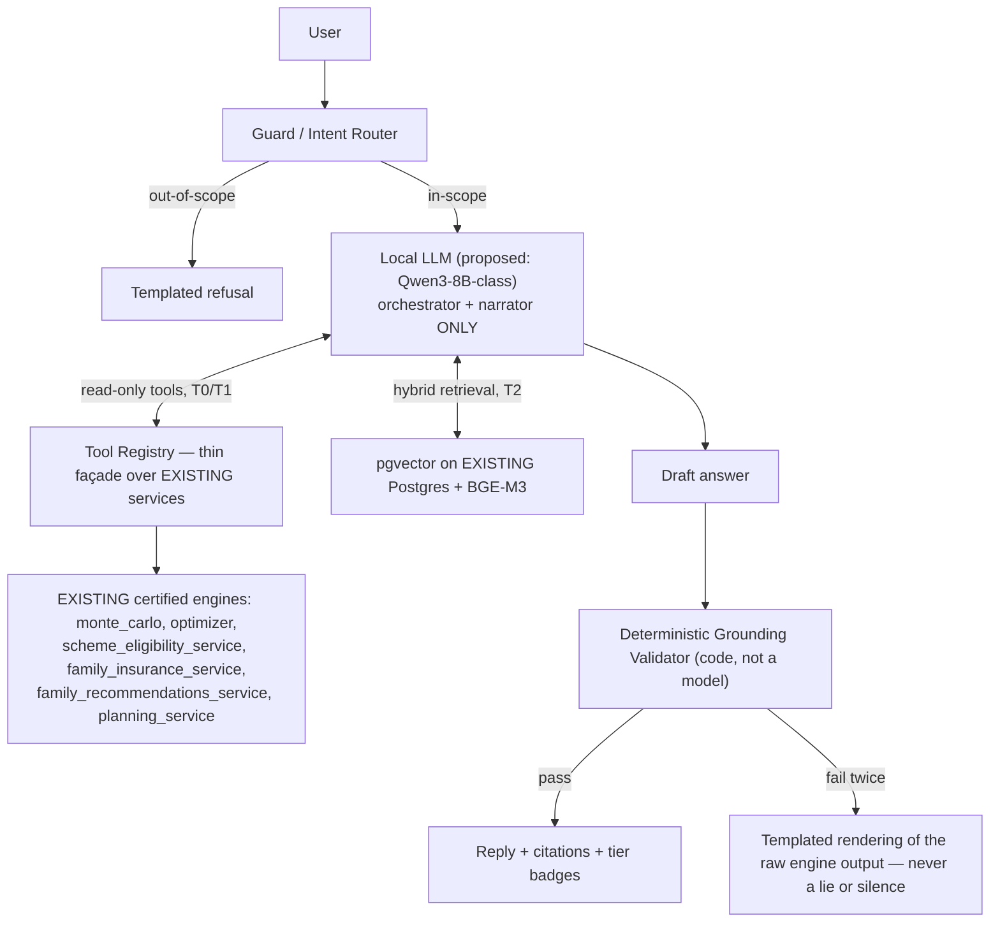

# AI Architecture (Copilot — Current State & Future Roadmap)

**Status:** Canonical · **Last verified against code:** 2026-07-10 (Copilot endpoint unchanged since; the most recent completion mission's Phase 4 touched only the Copilot's frontend badge text, not its backend logic)
**Supersedes:** `AICopilotFutureAIArchitectureBible.md` (archived), `AIArchitectureReport.md` (earlier, 07-06, superseded synthesis).
**Companion appendix (kept linked, not dissolved):** the 14-part `AIAssistantResearch/` series (`docs/12_Research/00`–`13`) — a complete, internally-cross-referenced, evidence-tiered research report (every claim marked `[verified-web]`/`[training-knowledge]`/`[assumption]` by its own authors) that this document's §5–§10 (Future Architecture) synthesizes. **Both this document's future-facing sections and the research series describe proposals — nothing in them is implemented.**
**Method:** §1–4 (current implementation) are verified directly against `backend/app/routers/copilot.py`, its schemas, config, tests, and the frontend Copilot surface. §5–10 (future architecture) are clearly marked as such throughout — never blurred with what exists today.

---

## 1. What the AI Copilot Currently Is

One HTTP endpoint, `POST /api/v1/copilot` — a stateless, single-turn chat function that reads the caller's own active goals, optionally passes them plus the user's message to OpenAI's GPT-4o, and returns a plain-text reply. When no API key is configured, or the OpenAI call fails for any reason, it falls back to a small, deterministic, rule-based Python function (`_fallback_response`) — engineered to never be fully non-functional.

**What it is NOT**, each verified by direct code reading:
- **Not a recommendation engine** — computes nothing; every number it can narrate was already computed by `planning_service.calculate_goal_probability` before the Copilot ever runs.
- **Not connected to Family/Insurance/Schemes/Recommendations** — zero calls anywhere in `copilot.py` to any Family-domain service.
- **Not stateful** — `conversation_id` is generated/echoed but never persisted; no `Conversation`/`ChatMessage` table exists anywhere.
- **Not a tool-calling agent** — no `tools` parameter is ever sent; the model cannot call anything or take any action beyond generating text.
- **Not retrieval-augmented** — no vector store, no embedding model, no document corpus exists anywhere in this codebase.
- **Not fine-tuned** — calls the stock, vendor-hosted `gpt-4o`.

**Business purpose:** a chat surface that narrates the user's *already-computed* data in plain English — it never originates a financial figure itself. This is the entire job today: rephrase 7 fields of already-persisted goal data into conversational text, or, absent an API key, apply one hardcoded threshold rule to the same 7 fields.

---

## 2. Current Architecture — the Literal, Traced Flow

The intuitive diagram ("User → Copilot UI → API → Backend → Calculation Engine → Recommendation Engine → Response") describes what a *fully integrated* AI layer would look like. **The verified, current architecture is narrower** — two of those layers are never actually invoked:



The endpoint's own logic lives in one router function — no service-layer file exists for this domain, a deliberate, minor exception to "routers call services" consistent with `profile.py`/`assumptions.py`'s own inline pattern.

---

## 3. Prompt Construction & Context Assembly

**The system prompt, verbatim:**
```
You are Northstar Copilot, an expert AI financial planner.
You have access to the user's goals, their Monte Carlo probabilities, and their
portfolio snapshot.  Speak in plain English — no jargon without explanation.
Keep responses under 200 words unless a detailed analysis is explicitly requested.
Always ground advice in the user's actual data.

User's financial goals (JSON):
{goals_json}
```

**Verified against what's actually sent:** "portfolio snapshot" **overstates** the payload — no net worth, no asset/liability breakdown, no income/expenses, no savings rate is ever included, only per-goal fields. Every call sends exactly **two** messages (one system, one user) — **no prior turn from either party is ever included**, the single most consequential fact about this endpoint. The frontend maintains a full, growing message history in React state, but only the current message string ever leaves the browser — the "conversation" the user sees is a rendering illusion the model never experienced.

**What's included per turn:** `name`, `category`, `target_amount`, `current_amount`, `probability`, `on_track`, `monthly_contribution` for active goals.

**What's never included, verified absent from every request:** household/family data, insurance policies, scheme eligibility, the Family Recommendations feed, Dashboard aggregates (net worth, savings rate, plan health), financial assumptions, notifications, the user's profile, audit history, and anything said earlier in the conversation.

**Other verified prompt limitations:** no output-format constraint (free-form prose only); no explicit refusal/boundary instructions; no few-shot examples; no distinction anywhere between "verified fact" and "model-generated text" — the model is free to answer confidently about schemes/tax/insurance from its own training knowledge, since nothing prevents this; `max_tokens=400`/`temperature=0.4` are hardcoded, not configurable.

**A real, minor duplication:** `copilot.py` re-implements the "active goals for this user" filter independently rather than calling `planning_service._active_goals()`, which applies the identical filter — a low-priority, exact (not drifting) duplication.

---

## 4. Current Intelligence — Every "AI"-Adjacent Surface, Traced

| Capability | Mechanism | Reads a calculation? | Reads a recommendation? |
|---|---|---|---|
| Chat reply (OpenAI path) | GPT-4o free-generates from system prompt + 1 message | `goal.probability` (pre-computed) | None |
| Chat reply (fallback path) | One Python `if goal.probability < 70` | Same | None |
| Greeting message | Static template, personalized via a separate `auth.me()` call | None | None |
| "Suggested prompts" (4 chips) | Hardcoded string array | None | None |
| **Dashboard's "AI Copilot" preview card** | Renders `dashData.suggestions` — a **completely separate**, non-chat, rule-based function | `planning_service._generate_suggestions()` | None — **not the `/copilot` endpoint at all** |
| Scheme/insurance recommendations elsewhere in the product | Deterministic, versioned-data-driven | None (not Monte Carlo) | Self — entirely disconnected from the Copilot |

**The single most important fact this table makes visible:** there are, today, **two unrelated "AI"-adjacent surfaces** — the actual `/copilot` chat endpoint and the Dashboard's rule-based suggestion list, presented under an "AI Copilot" heading with a Sparkles icon but with zero code-level relationship to GPT-4o or any LLM at all.

---

## 5. Current Limitations (verified by absence, not inferred)

No persistent memory (§ above); no conversation memory even within one browser session; no semantic search, embeddings, vector database, or RAG; no fine-tuned model; no planning/tool-calling agent; no integration with 5 of the app's 6 major domains; no confidence scoring or citation mechanism (contrast with every `FamilyRecommendation`, which has exactly such fields); no safety/guardrail layer beyond the vendor's own model behavior; no audit trail for Copilot conversations; **no endpoint-specific rate limiting** — `/copilot` shares the generic per-IP bucket rather than a tightened one, a real asymmetry worth naming precisely since it's the one endpoint with a genuine per-call external dollar cost, unlike `/simulate`'s tightened bucket for a purely local compute cost; no frontend automated tests; no streaming; no multi-model routing.

---

## 6. Future AI Architecture — PLANNED, NOT IMPLEMENTED

Everything from here on is a design proposal from `AIArchitectureReport.md` and the `AIAssistantResearch/` series. **Nothing described below exists in the current codebase.**



**Why this is additive, not a rewrite:** every box *not* labeled "EXISTING" is new; nothing proposes changing, replacing, or bypassing any currently-certified service. A tool wrapping `planning_service.get_dashboard()` is still a pure read, never calling `calculate_goal_probability`. The only genuinely new backend seam is `routers/copilot.py` itself — its existing provider-optional design (`openai_api_key` present/absent) is the identified extension point, generalizing to `LLM_PROVIDER = local|openai|none`, with the existing `_fallback_response` retained as the permanent kill switch.

---

## 7. Tool Calling — the Most Immediately Buildable Piece

**9 of 10 proposed tools already exist as certified service functions:**

| Proposed tool | Backing implementation | Status |
|---|---|---|
| `calculate_probability` | `monte_carlo.quick_probability()` | ✅ Exists |
| `run_simulation` | `monte_carlo.run_simulation()` | ✅ Exists |
| `optimize_goal` | `optimizer.py` | ✅ Exists |
| `evaluate_scheme`/`list_scheme_eligibility` | `scheme_eligibility_service.evaluate_household_eligibility()` | ✅ Exists |
| `family_recommendations` | `family_recommendations_service.get_family_recommendations()` | ✅ Exists |
| `insurance_recommendations` | `family_insurance_service.compute_insurance_recommendation()` | ✅ Exists |
| `dashboard_summary` | `planning_service.get_dashboard()` + `family_dashboard_service` | ✅ Exists |
| `report_generation` | Reports router/service | ✅ Exists (read/summarize only) |
| `portfolio_analysis` | Financials models exist; no dedicated analysis engine | ⚠️ Partial |
| `calculate_tax` | **Does not exist** — `tax_sections`/`tax_slabs` are versioned data, not a computation service | ❌ Gap, named as future deterministic-engine work in its own right, not something the AI layer should informally absorb |

**Four decisions requiring zero backend rewrite:** tools call services directly, in-process, never the REST API; auth is injected server-side from the authenticated request, never supplied by the model (making cross-tenant prompt injection unexpressible by construction, since tool schemas carry no `user_id` parameter); every V1 tool is read-only, inheriting ADR-001 for free; the tool-call wire format is the standard OpenAI-compatible schema the current client already speaks.

---

## 8. RAG, Fine-Tuning & Memory (proposed)

**RAG:** a deliberately narrow, curated corpus (government/regulator primary documents + Northstar-authored explainers) built *around* the existing versioned `tax_sections`/`scheme_rates` tables, never duplicating their numeric content in prose. Hybrid retrieval (dense + lexical) with a relevance floor below which retrieval honestly returns nothing. Every retrieved chunk is filtered by its `effective_from`/`effective_to` window *before* ranking — the same versioned-data discipline already governing scheme rates, extended to a new data type. pgvector on the **existing** Postgres instance — no new database.

**Fine-tuning:** narrow, format/behavior targets only (tool-call accuracy, refusal discipline, voice/tone) — **never** knowledge injection; any financial fact, rate, or rule baked into model weights becomes unaudited and un-updatable except by retraining, a direct violation of this codebase's "never invent a financial fact" discipline extended to weights. QLoRA recommended if evidence ever justifies it. Training data would be exclusively synthetic, generated from Northstar's own already-certified engines — real user data is never used for training, at any phase, on any version, stated as permanent doctrine.

**Memory:** conversation-turn memory and durable, opt-in user-stated preferences would be new, additive tables. **Financial/plan data is explicitly NOT memory** — always re-read live through tools on every turn, never cached as "what the assistant remembers about the user's plan," the same discipline ADR-001 already applies to the Dashboard. The core design constraint: memory should store what was *said*, never what was *computed*.

---

## 9. Safety Architecture (proposed) — the Truth Hierarchy

Every claim in a future reply would be tiered: **T0** (deterministic engines — may supply any number), **T1** (versioned fact tables, read only through an engine/tool), **T2** (curated RAG corpus — explanations/procedures, never numbers T1 already holds), **T3** (the model's own parametric knowledge — language competence only; "T3 asserting a fact is, by definition, a hallucination even when correct"). A claim may only move *down* in trust tier between layers, never up.

**Grounding validator:** a deterministic, non-LLM function extracting every number/date/rate/citation from a draft reply and verifying each traces to that turn's actual tool outputs or retrieved chunks — on failure, one regeneration attempt naming the violation, then a fallback to a templated rendering of the raw engine output. Never silence, never an apology, never a lie.

**Explicitly honest limitation the research states itself:** no known technique makes prompt injection impossible — the design caps the blast radius instead (V1's worst case: a badly-phrased reply about the user's own data, no writes, no other tenants, no invented number passing the validator).

**Regulatory positioning, flagged as unresolved:** SEBI's Investment Adviser regulations would require legal counsel review before any default-on, advice-adjacent framing ships — named as an open flag, not resolved here.

---

## 10. Migration Roadmap (proposed)

| Stage | Adds | Explicitly postponed |
|---|---|---|
| **V0 — Today** | Current rule engine (§1–5) | — |
| **V1 — Grounded Narrator** | Local model behind the existing seam; `LLM_PROVIDER` switch; ~10 read-only tools; grounding validator; minimal RAG; eval harness; dogfood-only | Fine-tuning, write tools, Hindi, memory beyond one conversation |
| **V2 — Reliable Specialist** | QLoRA only if evals show a gap; corpus expansion; conversation persistence; default-on with counsel-reviewed framing | Writes, proactive features, preference tuning |
| **V3 — Coach** | Preference tuning; proactive insights (suggestions, never auto-actions); report narration; `calculate_tax` **contingent on the tax engine being built separately first** | Write tools, multi-model routing |
| **V4 — Assistant with Hands** | First write tools (create goal, adjust contribution), each with explicit confirmation UI, Pydantic validation, `AuditLog` entries, undo where supported | — |
| **V5 — Platform** | Self-hosted/desktop distribution; household multi-user awareness | — |

**Permanently out of scope at every version, by doctrine:** LLM-computed financial numbers, security/fund recommendations, market prediction, training on real user data, from-scratch pretraining.

---

## 11. Findings Register

| ID | Severity | Finding | Future fix |
|---|---|---|---|
| AI-001 | High | No conversation history is ever sent to the model, despite the frontend presenting a full scrolling conversation — a user referencing an earlier turn gets a reply from a model with zero awareness it happened | V1's conversation-memory design closes this, but it's scoped to V2 in the roadmap — the gap persists through V1 |
| AI-002 | High | Zero access to 5 of 6 major domains while the system prompt claims "portfolio snapshot" access | The Tool Calling architecture (§7) is designed specifically to close this — 6 of 7 missing domains already have a certified service ready to wrap |
| AI-003 | Medium | The Dashboard's "AI Copilot" card renders pure rule-based logic under an AI label + Sparkles icon, while Family's equivalent logic is deliberately never labeled "AI" — an internal naming inconsistency | Align the labeling convention product-wide |
| AI-004 | Medium | `/copilot` shares the generic rate-limit bucket despite being the one endpoint with a real per-call external dollar cost | Add to `_SENSITIVE_PREFIXES` with a tightened, cost-aware bucket — buildable independently of any local-model migration work |
| AI-005 | Low | The fallback response's own "want me to model that?" offer has no follow-up mechanism — a dead end dressed as an actionable prompt | The `optimize_goal` tool (§7) is the direct, ready-to-build fix |
| AI-006 | Low | `copilot.py` re-implements the active-goals filter rather than calling `planning_service._active_goals()` | Fix opportunistically; low risk since both filters are currently exact |
| AI-007 | Info | An earlier report referenced `AI_CONVERSATIONS`/`AI_MESSAGES` tables that don't exist in the current schema — a proposal, not a fact | Re-derive from the more recent `AIAssistantResearch/05_RAG_Architecture.md` §6 when memory is actually built, not this older report's table names |

---

## Related Documents
`docs/02_Architecture/SystemArchitecture.md` §2.8 · `docs/02_Architecture/CalculationEngine.md` (the engines any future tool layer would wrap) · `docs/02_Architecture/RecommendationEngine.md` (the 5 domains currently invisible to the Copilot) · `docs/03_Engineering/ArchitectureDecisionRecords.md` (Engineering Constitution Rule 10: "the AI Advisor computes nothing; it narrates what was already computed")

## Related ADRs
Rule 10 (AI narrates, never computes) · ADR-001 (the discipline the proposed Memory Architecture explicitly extends).

## Related APIs
`POST /api/v1/copilot`.

## Related Database Tables
None currently (stateless) — proposed: conversation-memory tables (V2+).

## Related Services
`routers/copilot.py` (no dedicated service file today, by deliberate exception).

## Related Frontend Components
`app.copilot.tsx`.


## Related Tests
`test_copilot.py` (both the OpenAI-path fake-client tests and the fallback-path tests) — the entire current test surface for this domain, since the proposed future architecture (§6–10) has no code yet to test.

## Related Validation Reports
None specific to the AI domain beyond this document's own re-verification pass — the future architecture (RAG, tool calling, fine-tuning) has never been implemented, so no validation report for it exists yet.

## Related Implementation Reports
None — `routers/copilot.py` has not changed since this document's 2026-07-10 source compile date.

## Related Future Work
The full V1–V5 migration roadmap (§10) · adding `/copilot` to the rate limiter's tightened-bucket list (AI-004, a one-line fix buildable independently of any of the larger roadmap items).
---

*Archived originals: `docs/13_Archive/ArchivedReports/AICopilotFutureAIArchitectureBible.md`, `AIArchitectureReport.md`. Research appendix preserved in full at `docs/12_Research/` (14 files, `AIAssistantResearch/00`–`13`).*
