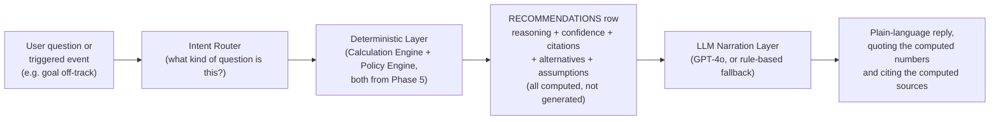

# AI Architecture Report — Explainable Financial Advisor

**Date:** 2026-07-06
**Method:** Pure design synthesis, building directly on `PolicyEngineReport.md`'s five-layer model and `DatabaseDesignReport.md`'s `RECOMMENDATIONS`/`RECOMMENDATION_CITATIONS` schema. No new research this section — this is architecture, not fact-finding.

---

## Where Northstar's AI Is Today (baseline, from Project Discovery)

A single stateless chat endpoint: GPT-4o with the user's goals/probabilities dumped into a system prompt, or a rule-based fallback with no API key. **No memory** (`conversation_id` accepted, never persisted — `AUDIT.md` #11), **no structured reasoning trace**, **no confidence score**, **no citation of what data or policy informed the reply**, **no alternatives shown**. It is a text-in, text-out function, not an advisor in the sense your brief requires.

---

## Required Shape (from your brief): Every Recommendation Must Include

Reason · Supporting calculations · Policies used · Government schemes considered · Alternative recommendations · Confidence score · Tradeoffs · Required assumptions

This is **not a prompt-engineering problem** — asking GPT-4o to "explain your reasoning" produces plausible-sounding text, not a verifiable trace. The only way to satisfy "every recommendation must include supporting calculations and policies used" **truthfully** is to compute the recommendation with the deterministic engines from Phase 5 (Calculation Engine, Policy Engine) **first**, and use the LLM only to narrate an already-computed, already-cited result in plain language — never to originate the financial conclusion itself.

**Why this ordering matters:** in the HUF worked example from `PolicyEngineReport.md`, the *funding-source gate*, the *tax-benefit computation*, and the *rupee value* are all deterministic outputs of Layers 1-3. If an LLM were asked to reason about HUF eligibility directly from a prompt, it could plausibly hallucinate a funding-source check that doesn't match Northstar's actual `company_policies` gate, or misstate the ₹1.5L/₹50K deduction ceilings from memory rather than reading the actual `scheme_rates`/`tax_sections` rows verified in Phase 1. **The LLM's job is narration and conversational flexibility, not computation or citation-sourcing** — this is the single most important architectural decision in this report, and it directly follows from this entire engagement's own operating principle (verify from authoritative sources, never state a figure from memory).

---

## Components

### 1. Intent Router

Classifies an incoming question/event into a known recommendation type (matching `RECOMMENDATIONS.recommendation_type` from Phase 5: `scheme_suggestion`, `risk_adjustment`, `huf_eligibility`, `insurance_gap`, plus new types this phase implies: `tax_regime_comparison`, `goal_prioritization`, `withdrawal_sustainability`). Unclassifiable questions fall through to the existing rule-based/GPT-4o free-text path — **this is where today's Copilot already sits**, so nothing about the current fallback needs to be discarded, only supplemented.

### 2. Deterministic Layer

Directly invokes Phase 5's Calculation Engine functions and Policy Engine layers. Produces a structured result object: the numeric answer, which `scheme_rates`/`tax_sections`/`company_policies`/`best_practice_rules` rows it read, what alternatives it evaluated (e.g., for a contribution-increase suggestion, the 2-3 other contribution levels the optimizer also priced out — this data already exists in `optimizer.generate_suggestions`'s current output shape, per Project Discovery, it just isn't persisted or surfaced as "alternatives considered" today), and a confidence score.

### 3. Confidence Scoring — must be principled, not a vibe

A recommendation's confidence should be **computed from the provenance of the data it used**, not asserted by the LLM:

| Confidence tier | Condition |
|---|---|
| **High** | All cited rates/rules have `source_type = 'verified'` (or equivalent Layer-1 government data with a recent `source_citation`) and no `best_practice_rules` row used has `confidence = 'unverified_flag'` |
| **Medium** | At least one input is `best_practice_rules.confidence = 'convention'` (industry convention, not independently re-derived) |
| **Low / flagged** | Any input touches a provisionally-uncertain area — the NPS withdrawal-tax treatment of the new 20% lump-sum tranche (Phase 1) is the concrete example already on record from this engagement; any recommendation touching that must inherit its "provisional" flag, not present a confident-sounding number |

This directly operationalizes the `SCHEME_RATES`/`best_practice_rules` confidence fields designed in Phases 2 and 5 — confidence scoring isn't a new concept bolted onto the AI layer, it's the AI layer *reading* provenance data that already exists for an entirely different reason (staying correct across a budget cycle).

### 4. LLM Narration Layer

Given the structured result from Layer 2, the LLM's prompt is constrained to: rephrase these already-computed numbers and already-selected citations into plain English, in the user's conversational context, **without inventing any number or citation not present in the input**. This is a materially narrower, more constrained use of the LLM than today's Copilot (which currently receives raw goal data and free-form-generates advice) — a deliberate reduction in LLM latitude, traded for correctness guarantees the current design cannot offer.

### 5. Conversation Memory (closes AUDIT #11)

`AI_CONVERSATIONS`/`AI_MESSAGES` (Phase 5, Group F) finally give `conversation_id` a real backing store. **Design constraint worth stating explicitly:** memory should store *what was said*, not silently re-inject an old, possibly-stale computed recommendation into a new conversation turn without re-running the deterministic layer — a PPF rate quoted three months ago in a stored conversation could be stale by the time the user asks a follow-up question, per Phase 1's quarterly-rate-change finding. Every new question should re-invoke Layer 2 fresh; only the *conversational context* (what was previously discussed, not previously computed) should be replayed from memory.

---

## Explainability — Concrete Example (Tax Regime Comparison, Calculation Engine #14)

A user asks "should I switch to the new tax regime?" The system:

1. **Intent Router** → `tax_regime_comparison`
2. **Deterministic Layer** computes both regimes' tax using the user's actual recorded income/deductions against the versioned `tax_slabs`/`tax_sections` (Phase 5), producing a rupee delta
3. **Confidence:** High, since Phase 1's tax-slab data is freshly verified and not in a provisional state
4. **Alternatives considered:** the old-regime calculation itself is the "alternative" to the new-regime recommendation — both numbers are shown, not just the winner
5. **Assumptions used:** explicitly lists which deductions were included (e.g., "assumes you claim the full ₹1.5L under Section 123, ₹25K under Section 80D-equivalent" — with the exact current section citation from `tax_sections`, correctly reflecting whichever Act is in effect for the tax year in question, per Phase 1's Act-transition finding)
6. **LLM Narration:** "Based on your recorded income of ₹X and deductions of ₹Y, the old regime saves you ₹Z this year. This is computed using [cited sections]. Note: this compares only your currently recorded deductions — if you're planning any new investments before the end of the tax year, run this again after recording them."
7. Stored as a `RECOMMENDATIONS` row with full `RECOMMENDATION_CITATIONS` back to the exact `tax_slabs`/`tax_sections` rows used

---

## What This Architecture Deliberately Does Not Do

- **It does not let the LLM generate a novel financial calculation.** Every number a user sees traces to Phase 5's deterministic engines. This is a stricter constraint than most "AI financial advisor" products in the market likely implement (not independently verified — a claim about the market, not this design), and is the direct, necessary consequence of this entire engagement's "verify, don't assume" standard applied to the AI layer specifically.
- **It does not attempt real-time conversational memory across unrelated topics without re-verification.** A stored conversation is context, not a cache of trusted-forever facts.
- **It does not claim licensed financial-advisor status.** Every recommendation is a computed suggestion with explicit assumptions and confidence — the "required assumptions" field in your brief is precisely the mechanism that keeps this tool in "decision support" territory rather than presenting itself as unconditional advice, which has real regulatory implications (SEBI's Research Analyst / Investment Adviser regulations were not researched in this pass and should be reviewed before this AI advisor ships anything that could be construed as personalized investment advice rather than general planning support — flagged as a compliance question for the Risk Register).
