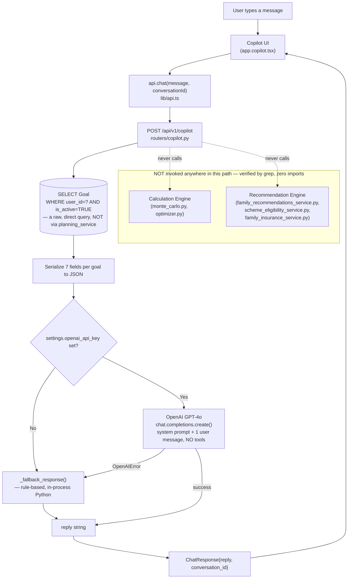
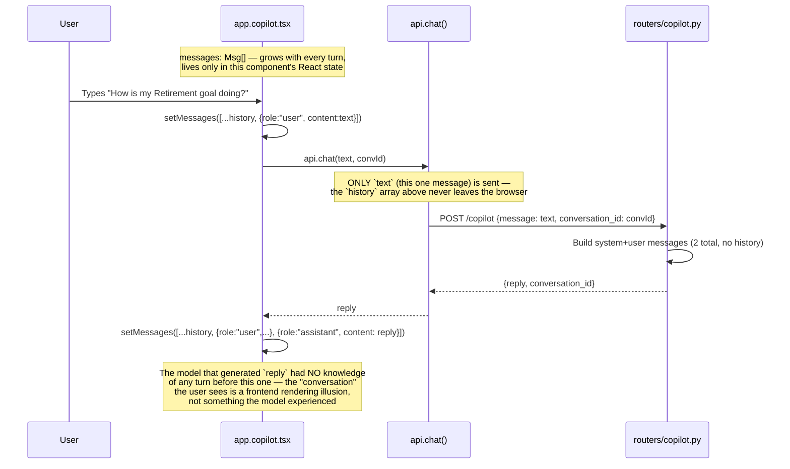
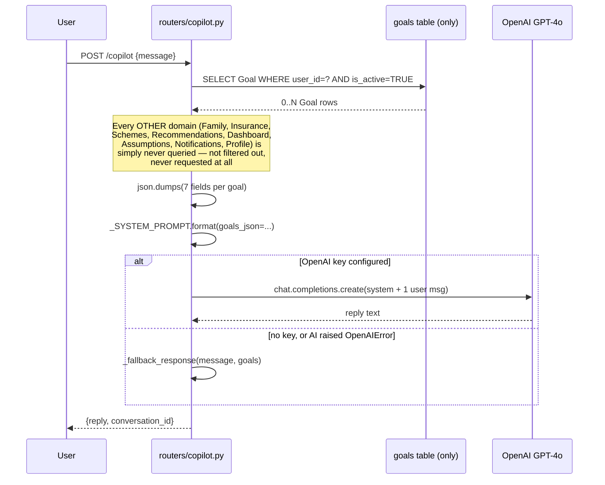
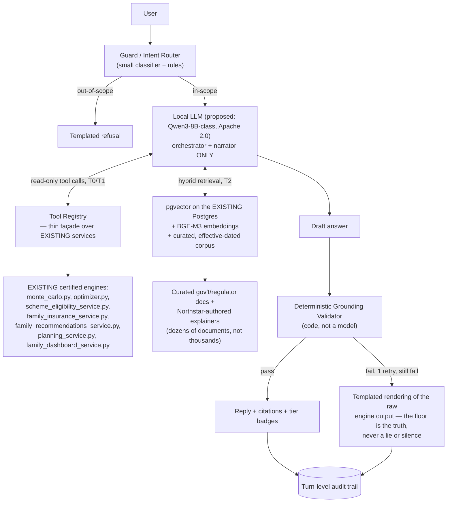
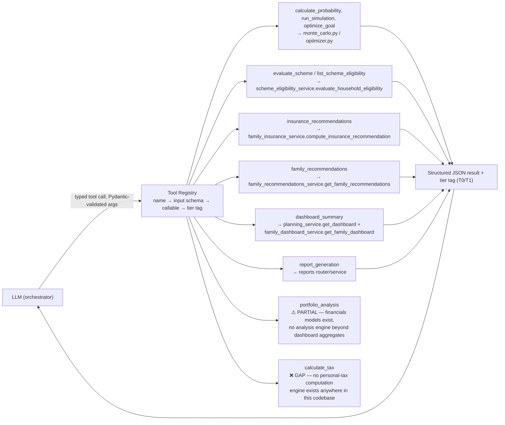
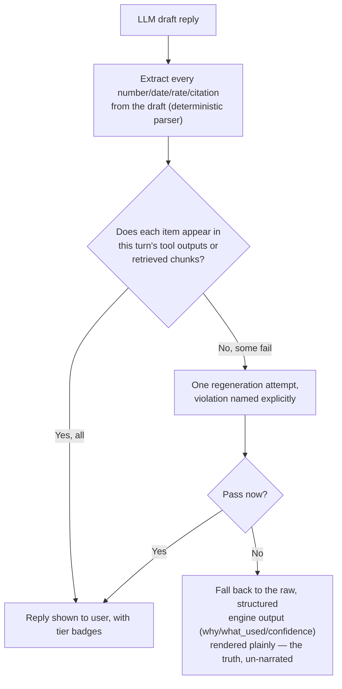
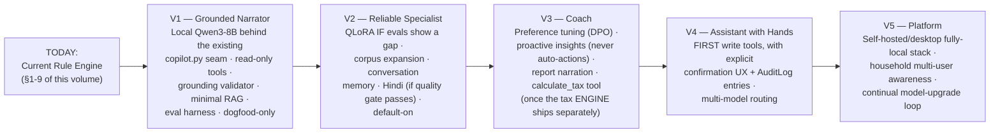

# AI COPILOT & FUTURE AI ARCHITECTURE BIBLE

**Volume 7 of the Northstar Project Engineering Bible**
**Date compiled:** 2026-07-10
**Method:** Sections 1–9 (current implementation) are verified directly against `backend/app/routers/copilot.py`, `backend/app/schemas/simulation.py`'s `ChatRequest`/`ChatResponse`, `backend/app/config.py`'s AI settings, `backend/tests/test_copilot.py`, `backend/requirements.txt`, `backend/app/middleware/rate_limit.py`, and the frontend Copilot surface (`code/src/routes/app.copilot.tsx`, `code/src/lib/api.ts`'s `chat()`) — every claim in those sections traces to an exact file and line, exactly as Volumes 1–6 established. Sections 10–17 (future architecture) synthesize and cross-reference two pre-existing design artifacts already present in this repository: `AIArchitectureReport.md` (2026-07-06, an earlier synthesis) and the 14-document `AIAssistantResearch/` series (`00`–`13`, 2026-07-08, evidence-tiered — every claim there is marked `[verified-web]`, `[training-knowledge]`, or `[assumption]` by its own authors). **Both of these are research/design documents — nothing in them has been implemented.** This volume never blurs that line: every sentence describing sections 10–17 is a proposal, cross-referenced to the exact current service or file it would extend, never a claim about what exists today.

---

## 1. AI Overview

**What the AI Copilot currently is:** one HTTP endpoint, `POST /api/v1/copilot` (`routers/copilot.py`, 132 lines) — a stateless, single-turn chat function that reads the caller's own active goals, optionally passes them plus the user's message to OpenAI's GPT-4o, and returns a plain-text reply. When no OpenAI API key is configured (`settings.openai_api_key == ""`), or when the OpenAI call itself fails for any reason, the endpoint falls back to a small, deterministic, rule-based Python function (`_fallback_response`) instead — the endpoint is engineered to never be fully non-functional (Volume 1 §2.7).

**What it is NOT** (each verified by direct code reading, expanded fully in §9):
- **Not a recommendation engine** — it computes nothing; every number it can possibly narrate was already computed and persisted by `planning_service.calculate_goal_probability` (Volume 2 §9) before the Copilot ever runs.
- **Not connected to the Family/Insurance/Schemes/Recommendation subsystems** — zero calls anywhere in `copilot.py` to `family_service`, `family_insurance_service`, `scheme_eligibility_service`, or `family_recommendations_service` (confirmed by reading every import in the file — Volume 5's entire domain is invisible to this endpoint).
- **Not stateful** — no conversation is ever persisted; `conversation_id` is generated or echoed back but never written to any table (no such table exists — Volume 3 confirmed zero `Conversation`/`ChatMessage`/`AI_CONVERSATIONS` schema anywhere in this database).
- **Not a tool-calling agent** — the OpenAI request contains no `tools` parameter; the model cannot call anything, fetch anything, or take any action beyond generating text.
- **Not retrieval-augmented** — no vector store, no embedding model, no document corpus exists anywhere in this codebase (confirmed by `requirements.txt`: the only AI-related dependency in the entire backend is the bare `openai==1.58.1` SDK).
- **Not fine-tuned** — it calls the stock, vendor-hosted `gpt-4o` model by default (`settings.openai_model`).

**Business purpose** (Volume 1 §2.7, restated precisely): a chat surface that narrates the user's *already-computed* data in plain English — "it never originates a financial figure itself." This is the Copilot's entire job today: rephrase 7 fields of already-persisted goal data into conversational text, or, absent an API key, apply one hardcoded threshold rule to the same 7 fields.

**Limitations, summarized here and detailed exhaustively in §9:** no memory (not even within a single browser session — §3), no access to 5 of the app's 6 major domains (Family, Insurance, Schemes, Recommendations, Dashboard aggregates — §4), no tools, no retrieval, no fine-tuning, no safety/guardrail layer beyond OpenAI's own model-level behavior, no audit trail.

---

## 2. Current AI Architecture

The brief's requested diagram (`User → Copilot UI → API → Backend → Calculation Engine → Recommendation Engine → Response`) describes the shape a *fully integrated* AI layer would have. **The verified, current architecture is narrower than that diagram** — two of the six layers it names (Calculation Engine, Recommendation Engine) are never actually invoked by the Copilot request path. The diagram below is the literal, traced current flow; the two skipped layers are shown explicitly as **not present** so the gap is visible rather than implied.



**Layer-by-layer explanation:**

| Layer | What actually happens | Evidence |
|---|---|---|
| **User** | Types free text into the chat input, or clicks one of 4 static suggestion chips | `app.copilot.tsx` |
| **Copilot UI** | Maintains an in-memory `Msg[]` array (never persisted); shows a personalized greeting via a separate, uncached `auth.me()` call; renders a 3-dot "thinking" animation while a request is in flight | Volume 6 §14 |
| **API** | `api.chat(message, conversationId)` — sends **only** the current message string and the last-known `conversation_id`; the frontend's own message history array is never included in the request body | `lib/api.ts` |
| **Backend router** | `routers/copilot.py`'s `chat()` — the entire endpoint logic lives in one function, no service-layer file exists for this domain (a deliberate, minor exception to "routers call services," consistent with `profile.py`/`assumptions.py`/`financials.py`'s own inline pattern, Volume 4 §1) | `routers/copilot.py` |
| **"Calculation Engine"** | **Not invoked.** The endpoint reads `goal.probability`/`goal.on_track` as already-stored values — it never calls `monte_carlo.run_simulation`/`quick_probability` or `optimizer.generate_suggestions` | Confirmed by grep: no import of `services.monte_carlo` or `services.optimizer` anywhere in `copilot.py` |
| **"Recommendation Engine"** | **Not invoked.** Zero calls to any Family-domain service | Confirmed by grep across `copilot.py`'s imports |
| **Response** | A `ChatResponse{reply: str, conversation_id: str}` — always exactly these two fields, whether the reply came from GPT-4o or the fallback | `schemas/simulation.py` |

---

## 3. Prompt Construction

**The current system prompt, verbatim** (`routers/copilot.py`, `_SYSTEM_PROMPT`):

```
You are Northstar Copilot, an expert AI financial planner.
You have access to the user's goals, their Monte Carlo probabilities, and their
portfolio snapshot.  Speak in plain English — no jargon without explanation.
Keep responses under 200 words unless a detailed analysis is explicitly requested.
Always ground advice in the user's actual data.

User's financial goals (JSON):
{goals_json}
```

**Verified, precise reading of this prompt against what's actually sent:**
- "their Monte Carlo probabilities" — true, but narrowly: only the *already-computed* `probability` field per goal (a stored float), never a live simulation or a percentile distribution.
- "their portfolio snapshot" — **not literally true.** No net worth, no asset/liability breakdown, no income/expenses, no savings rate is ever included — "portfolio snapshot" in the prompt's own wording overstates what the `goals_json` payload actually contains (§4 details the exact gap).
- Every call constructs exactly **two** messages: one `system` message (the template above, with `{goals_json}` interpolated) and one `user` message (`body.message`, the caller's current text, 1–2000 characters per `ChatRequest`'s `Field(min_length=1, max_length=2000)`). **No prior turn, from either party, is ever included** — this is the single most consequential fact about this endpoint's prompt construction.

**Context gathering** — exactly one step: `select(Goal).where(Goal.user_id == current_user.id, Goal.is_active.is_(True))`, a raw query written directly in the router (not delegated to `planning_service._active_goals()`, despite being functionally identical to that function's own filter — a small, real duplication: the same "active goals for this user" filter logic is now independently written in two places, `planning_service.py` and `copilot.py`, rather than one shared call).

**Conversation flow, precisely:**



**Available information** (per turn): the caller's active goals — `name`, `category`, `target_amount`, `current_amount`, `probability`, `on_track`, `monthly_contribution` — and the caller's single current message.

**Unavailable information** (verified absent from every request the model ever receives): household/family member data, insurance policies or the insurance recommendation, government scheme eligibility, the Family Recommendations feed, Dashboard aggregates (net worth, liquid assets, invested, liabilities, savings rate, plan health score), financial assumptions (inflation rate, expected returns, retirement age, Social Security), notifications, the user's profile (name, DOB, employment), audit history, and — critically — anything said earlier in the same conversation.

**Prompt limitations, exhaustively:**
1. No output-format constraint (no requested JSON, no citation requirement, no confidence field) — the model returns free-form prose only, captured as a single opaque string.
2. No explicit refusal/boundary instructions — the prompt says "ground advice in the user's actual data" but names no prohibited topics (specific securities, market timing, tax computation, etc. — contrast with the *proposed* refusal ruleset in §15).
3. No few-shot examples.
4. No distinction anywhere in the prompt between "verified fact" and "model-generated text" — the model is free to answer confidently about anything (schemes, tax, insurance) it was never given data for, entirely from its own training-time knowledge, since nothing in the prompt or the surrounding code prevents this.
5. `max_tokens=400`, `temperature=0.4` are the only generation controls — both hardcoded literals in the router, not configurable via `settings`.

---

## 4. Context Assembly

**Exactly how context is collected — one query, one serialization step, no aggregation across domains:**

```python
result = await db.execute(
    select(Goal).where(Goal.user_id == current_user.id, Goal.is_active.is_(True))
)
goals = list(result.scalars().all())
...
goals_json = json.dumps(
    [{"name": g.name, "category": g.category, "target_amount": g.target_amount,
      "current_amount": g.current_amount, "probability": g.probability,
      "on_track": g.on_track, "monthly_contribution": g.monthly_contribution}
     for g in goals],
    indent=2,
)
```

**Per-domain assembly status, verified exhaustively against `copilot.py`'s imports and body:**

| Domain | Included in Copilot context? | Evidence |
|---|---|---|
| **Goals** | ✅ Yes — 7 of the model's fields (name, category, target/current amount, probability, on_track, monthly_contribution) | The only data source this endpoint has |
| **Family (household/members)** | ❌ No | No `family_service` import |
| **Insurance** | ❌ No | No `family_insurance_service` import |
| **Government Schemes** | ❌ No | No `scheme_eligibility_service` import |
| **Family Recommendations** | ❌ No | No `family_recommendations_service` import |
| **Dashboard aggregates** (net worth, savings rate, plan health) | ❌ No | No `planning_service` import at all |
| **Financial assumptions** (inflation, expected returns, tax rate, retirement age) | ❌ No | No `FinancialAssumptions` model import |
| **Notifications** | ❌ No | No `notification_service` import |
| **User profile** (DOB, employment, country) | ❌ No | No `UserProfile` model import — only `User.id` (for the query filter) is used, `User.full_name`/`email` never read here (the frontend's greeting reads these separately, client-side, from the shared `["currentUser"]` cache, never forwarded to this endpoint) |
| **Audit log** | ❌ No | No `AuditLog` import |



---

## 5. Current Intelligence

*(Every "intelligent" behavior the product exhibits anywhere near the word "AI" or "Copilot," traced to its exact mechanism — several of these are not the `/copilot` endpoint at all.)*

| Capability | How it works | Service | Calculation it reads | Recommendation it reads | Evidence |
|---|---|---|---|---|---|
| Chat reply (OpenAI path) | GPT-4o free-generates text from the system prompt + 1 message | `routers/copilot.py` `chat()` | `goal.probability`/`goal.on_track` (pre-computed, never re-run) | None | §2–4 |
| Chat reply (fallback path) | `_fallback_response()` — a single Python `if`/`else` on `goal.probability < 70` | `routers/copilot.py` `_fallback_response()` | Same 7 fields | None | §6 |
| Greeting message | Static template string, personalized with the user's first name via a separate `auth.me()` call | `app.copilot.tsx` (frontend only) | None | None | Volume 6 §14 |
| "Suggested prompts" (4 chips) | A hardcoded `SUGGESTIONS` string array | `app.copilot.tsx` (frontend only) | None | None | Volume 6 §14 |
| **Dashboard's "AI Copilot" preview card** | Renders `dashData.suggestions` — a **completely separate**, non-chat, rule-based function | `planning_service._generate_suggestions()` | `goal.probability`, `savings_rate` | None | Volume 2 §10 — **not the `/copilot` endpoint at all; see §6's finding on this** |
| Scheme/insurance "recommendations" the product shows elsewhere | Deterministic, versioned-data-driven | `family_recommendations_service`, `scheme_eligibility_service`, `family_insurance_service` | None (schemes/insurance domain, not Monte Carlo) | Self (this *is* the recommendation engine) | Volume 5 §5–§7 — **entirely disconnected from the Copilot, per §7 below** |

**The single most important fact this table makes visible:** there are, today, **two unrelated "AI"-adjacent surfaces** in this product — the actual `/copilot` chat endpoint (§1–4) and the Dashboard's rule-based suggestion list, which is presented under an "AI Copilot" heading with a Sparkles icon but has zero code-level relationship to the chat endpoint, to GPT-4o, or to any LLM at all.

---

## 6. Rule-Based Reasoning

*(Every deterministic rule found anywhere in or adjacent to the AI surface, with trigger/output/evidence — mirroring the Business Rule Catalog format established in Volume 5 §11.)*

| ID | Rule | Trigger | Output | Why it exists | Evidence |
|---|---|---|---|---|---|
| AI-BR-001 | No API key ⇒ fallback | `settings.openai_api_key == ""` (the default) | `_get_openai_client()` returns `None`; `chat()` never attempts an OpenAI call | So the endpoint is deployable and testable with zero external dependency or cost — Volume 1 §2.7's "the app works without an API key" | `_get_openai_client`, `config.py`'s `openai_api_key: str = ""` |
| AI-BR-002 | OpenAI failure ⇒ fallback, not 500 | Any exception the OpenAI SDK raises as (or subclasses) `OpenAIError` — covers timeouts, rate limits, connection failures, and API errors alike, per the code's own comment | Logged as a warning (`copilot_openai_error`), then `_fallback_response` is used | The endpoint must stay functional through a transient provider outage | `chat()`'s `try/except OpenAIError`, `test_openai_error_falls_back_instead_of_500` |
| AI-BR-003 | Low-probability naming rule | At least one active goal has `probability < 70` (the identical 70.0 threshold Volume 2 §14.6 already identified as a single hardcoded literal used everywhere else in the product) | Names up to the first 2 such goals (`low_prob[:2]`), comma-joined, with singular/plural grammar handling (`'are' if len(low_prob) > 1 else 'is'`), and offers — in text only — to "run an optimization" | A minimal, always-available signal when the LLM path is unavailable | `_fallback_response` |
| AI-BR-004 | Healthy-plan rule | No active goal has `probability < 70` (includes the zero-goals case) | A generic reassurance + an offer to "stress-test" a scenario | The fallback's else-branch, ensuring a reply always has *some* grounding in the user's actual state even without an LLM | `_fallback_response` |
| AI-BR-005 | Conversation ID passthrough | `body.conversation_id` provided | Echoed back unchanged | `body.conversation_id` absent | A fresh `uuid.uuid4()` is generated | Neither path persists it anywhere — see §9 |
| AI-BR-006 | Empty message rejected | `message` is an empty string | `422` at the Pydantic layer, before the router body ever runs | `ChatRequest.message: Field(min_length=1, max_length=2000)` | `test_chat_empty_message_rejected` |
| AI-BR-007 | Client reuse | Any call to `_get_openai_client()` after the first successful one | Returns the same module-level `_openai_client` singleton rather than constructing a new HTTP connection pool per request | Documented directly in the code's own comment ("avoid creating a new HTTP connection pool on every call") | `_get_openai_client` |

**A rule that is conspicuously absent, worth naming precisely:** `_fallback_response`'s offer — "I can run an optimization... Want me to model that?" — is **never wired to anything**. There is no follow-up mechanism, no button, no special client-side handling of this specific reply text; it is inert copy that reads like an actionable offer but triggers nothing if the user says "yes" (the next message is just another ungrounded, single-turn call). This is restated as a finding in §17 (AI-005).

---

## 7. Recommendation Integration

**How AI consumes recommendations, today: it does not.** Verified exhaustively by reading every line of `copilot.py` and its complete import list — there is no call, direct or indirect, to `family_recommendations_service.get_family_recommendations`, `scheme_eligibility_service.evaluate_household_eligibility`, or `family_insurance_service.compute_insurance_recommendation` anywhere in the Copilot's request path. The Recommendation Engine (Volume 5 §7, the entire Family domain's aggregation layer) and the AI Copilot are two architecturally disjoint subsystems that happen to ship in the same product.

**How recommendations are generated** (cross-referenced, not re-derived — full treatment in Volume 5 §5–§7): entirely deterministically, by three narrow, certified engines reading versioned fact tables (`tax_sections`, `scheme_eligibility_rules`) and live household state, composed by `family_recommendations_service` into a `FamilyRecommendation` envelope carrying `why`, `why_now`, `what_information_was_used`, `what_information_is_missing`, and `confidence_score` — **exactly the structured shape a narration-only LLM layer would need to consume**, per `AIAssistantResearch/02_Financial_AI_Research.md`'s own observation: "Most companies have to build this [structured, explainable recommendation schema]; Northstar already enforces it at the schema level." This is the load-bearing asset the future architecture in §10–§13 is designed around — but it is, today, unused by the Copilot.

**Why AI does not generate financial calculations** — this is doctrine, not merely an observed absence. `docs/ENGINEERING_CONSTITUTION.md` Rule 10, verified present in the actual file: *"The AI Advisor computes nothing; it narrates what was already computed."* The rule's own text continues: *"Any LLM-backed feature receives a fully-computed, fully-cited result from a deterministic service and rephrases it in plain language — it never originates a financial number, a policy citation, or a confidence score itself... an LLM stating a tax figure from its own training is exactly the kind of unverified financial fact Rule 4 forbids, regardless of how confident the phrasing sounds."* The current `copilot.py` implementation is **consistent with** this rule (it never fabricates a probability — it only narrates the already-stored `goal.probability`), but it does not yet **exercise** most of what the rule anticipates ("policy citation," "confidence score") because it has no access to any domain that would produce those (§4). Rule 10 is real, ratified constitution — the gap is one of *coverage*, not *violation*.

---

## 8. Calculation Integration

**What AI reads** — the complete, exhaustive list, verified by grep for every `goal.` attribute access in `copilot.py`:

| Field | Source | Computed by | Ever recomputed by Copilot? |
|---|---|---|---|
| `goal.name`, `goal.category` | User-entered at goal creation | N/A (not a calculation) | No |
| `goal.target_amount`, `goal.current_amount`, `goal.monthly_contribution` | User-entered | N/A | No |
| `goal.probability` | `planning_service.calculate_goal_probability` → `monte_carlo.quick_probability_async` (Volume 2 §9) | The Monte Carlo engine, at goal create/update only | **No — read-only, exactly like every other consumer named in Volume 2 §9's flowchart (Dashboard, Reports, Family Dashboard, Notifications) — Copilot is simply a sixth read-only consumer of this one persisted value** |
| `goal.on_track` | `probability >= 70.0` | Same function, same moment | No |

**What AI never computes, verified by the complete absence of the corresponding import or call:**
- **Monte Carlo simulation** — no import of `services.monte_carlo` anywhere; the Copilot cannot run a simulation even if a user explicitly asks it to ("run 10,000 paths for my retirement goal" would have to be answered from the model's own free text, ungrounded, since no tool exists to actually invoke `run_simulation`).
- **Probability** — never derives or estimates one; only narrates the stored value.
- **Goal calculations of any kind** — `years_to_goal`, percentile bands, none of these are computed or even read by the Copilot.
- **Inflation** — never reads `financial_assumptions.inflation_rate` or `goal.custom_inflation_rate`; cannot narrate the Education Cost Projection (Volume 2 §4, Volume 6 §19-adjacent) at all, since it has no access to that data.
- **Tax** — never reads `tax_sections`/`tax_slabs`; cannot answer a real tax question grounded in Northstar's own versioned data (only from the model's own training knowledge, if it answers at all — a real hallucination risk for exactly the reason `AIAssistantResearch/00_Knowledge_Architecture.md`'s Tier framework exists, §10).
- **Insurance** — never reads `health_policies`/`health_policy_coverage`/the 80D recommendation.
- **Schemes** — never reads `schemes`/`scheme_eligibility_rules`; cannot ground a scheme-eligibility answer in the same certified logic the Government Schemes screen uses.

**The precise, load-bearing consequence:** the Copilot's Calculation Lifecycle relationship is a strict subset of every other consumer's — it reads exactly one already-computed field (`goal.probability`) from exactly one table (`goals`), making it architecturally the *narrowest* read-only consumer in this entire codebase (narrower than the Dashboard, Reports, Family Dashboard, or Notifications, all of which read multiple domains — Volume 5 §12).

---

## 9. Current Limitations

*(Every limitation below is directly verified — by absence of an import, a dependency, a schema, or a code path. None are inferred from what a "typical" AI product might lack.)*

| # | Limitation | Verification |
|---|---|---|
| 1 | **No persistent memory** — `conversation_id` is accepted/generated but never written to any database table | No `Conversation`/`ChatMessage` model exists anywhere (Volume 3 §3/§14); `chat()` never issues an `INSERT` |
| 2 | **No conversation memory even within one browser session** — only the single current message is ever sent to the model or the backend; prior turns exist only in the frontend's own React state | `api.chat(message: string, conversationId?: string)` signature; `send()` in `app.copilot.tsx` never includes `messages` (the history array) in its call |
| 3 | **No semantic search** | No search endpoint of any kind serves the Copilot; the Command Palette's search (Volume 6 §15) is a fully separate, non-AI feature |
| 4 | **No embeddings** | Zero embedding-model dependency anywhere in `requirements.txt` or `package.json` |
| 5 | **No vector database** | No pgvector extension, no Qdrant/Milvus/Chroma/Pinecone client, confirmed absent from `requirements.txt` |
| 6 | **No RAG** | No retrieval step exists in `copilot.py`'s request path at all |
| 7 | **No fine-tuned model** | `settings.openai_model` defaults to the stock `"gpt-4o"`; no fine-tune ID, no LoRA adapter, no local model weights anywhere in this repository |
| 8 | **No planning agent** | The request is single-shot: one prompt in, one completion out — no loop, no multi-step reasoning, no `ReAct`-style trace |
| 9 | **No tool orchestration** | The `chat.completions.create()` call passes no `tools` parameter — the model has no function-calling capability wired up at all |
| 10 | **No integration with Family/Insurance/Schemes/Recommendations** | §4, §7 |
| 11 | **No integration with Dashboard aggregates, Reports, or Notifications** | §4 |
| 12 | **No confidence scoring or citation mechanism** | The response schema (`ChatResponse`) has exactly two fields, `reply` and `conversation_id` — no `confidence`, no `sources`, no `what_information_was_used` (contrast with every `FamilyRecommendation`, Volume 5 §7.8, which has exactly such fields) |
| 13 | **No safety/guardrail layer beyond the model vendor's own behavior** | No input classifier, no output validator, no PII filter, no topic-refusal ruleset, no red-team test suite exists in `backend/tests/` for the Copilot beyond the two OpenAI-path tests already read (§ testing) |
| 14 | **No audit trail** | `AuditLog` is never imported by `copilot.py` — every Copilot conversation is unrecorded from a compliance perspective, consistent with (and an extension of) Volume 5 §10's finding that audit logging is scoped to the Family domain only |
| 15 | **No endpoint-specific rate limiting** | `/copilot` is **not** in `middleware/rate_limit.py`'s `_SENSITIVE_PREFIXES` tuple (`/api/v1/auth/login`, `/api/v1/auth/register`, `/api/v1/simulate`) — it shares the generic per-IP bucket rather than a tightened one, a real asymmetry worth naming precisely: `/simulate` (a local compute cost) gets a dedicated tighter bucket, while `/copilot` (a **real external per-call dollar cost** via the OpenAI API whenever a key is configured) does not |
| 16 | **No frontend automated tests** for the Copilot UI (Volume 6 §1's zero-test-suite finding applies here identically) |
| 17 | **No streaming** — `chat.completions.create()` is called without `stream=True`; the frontend's "thinking" animation is a fixed pulsing-dot indicator, not a token-by-token stream |
| 18 | **No multi-model routing** — one hardcoded provider path (OpenAI) plus one hardcoded fallback; no local-model option, no provider abstraction beyond the single `settings.openai_api_key` presence check |

---

## 10. Future AI Architecture

**PLANNED EXTENSION POINT — everything in this section and §11–§16 is a design proposal from `AIArchitectureReport.md` and the `AIAssistantResearch/` series. Nothing described below exists in the current codebase.**

The research converges on one architecture, stated most precisely in `AIAssistantResearch/12_Final_Recommendation.md` §5 and `13_EXECUTIVE_SUMMARY.md`:



**Why this is compatible with the existing backend, not a rewrite (the special requirement, addressed once here and then per-component below):** every box in the diagram above that is *not* labeled "EXISTING" is additive — a new tool-calling façade, a new retrieval layer, a new validator, a new local-inference process. **Nothing in this design proposes changing, replacing, or bypassing any currently-certified service.** `monte_carlo.py`, `optimizer.py`, `scheme_eligibility_service.py`, `family_insurance_service.py`, `family_recommendations_service.py`, `planning_service.py`, and `family_dashboard_service.py` — the entire deterministic core documented across Volumes 2 and 5 — are consumed exactly as they exist today, through their existing Python function signatures, inside the existing `AsyncSession`/`get_db()` transaction pattern (`AIAssistantResearch/06_Tool_Calling.md` §2.1: "Tools call services, not HTTP... reuses `get_db()`'s one-commit-per-request pattern, and the 330-test suite already covers the underlying functions"). The Calculation Lifecycle (Volume 2 §7–§9) is untouched: a tool wrapping `planning_service.get_dashboard()` is still a pure read, still never calls `calculate_goal_probability`. The only genuinely new backend seam is `routers/copilot.py` itself, whose existing provider-optional design (`settings.openai_api_key` present/absent) is explicitly identified as the extension point: `AIAssistantResearch/07_MLOps.md` §1 — "the provider-optional pattern... already in production generalizes to a `LLM_PROVIDER` setting with `local | openai | none`."

**Local Qwen integration, specifically, without rewriting the system:**
1. **Serving:** a local Qwen3-8B (or Qwen3.5-9B) model, quantized (Q4), served behind an OpenAI-compatible endpoint (Ollama or llama.cpp server) — because it speaks the identical wire format `copilot.py` already uses, the only code change to the existing router is swapping `base_url` and `model` in the `AsyncOpenAI(...)` construction (`_get_openai_client`, §2/§6) — **the `AsyncOpenAI` client class, the `chat.completions.create()` call shape, and the `OpenAIError` exception-handling `try`/`except` all remain byte-for-byte identical.**
2. **The existing rule-based fallback is retained as the kill switch**, not replaced — `_fallback_response` stays exactly as it is today, reachable via `LLM_PROVIDER=none`.
3. **The existing 400-token/0.4-temperature generation controls, the existing `ChatRequest`/`ChatResponse` schema, and the existing `get_current_user`/rate-limiting middleware chain are all reused unchanged.**

---

## 11. RAG Integration Plan

**PLANNED EXTENSION POINT**, per `AIAssistantResearch/05_RAG_Architecture.md`.

**Knowledge sources:** deliberately narrow and curated — Indian government/regulator primary documents (Income Tax Department, RBI, SEBI, IRDAI, PFRDA/EPFO, small-savings notifications) plus Northstar-authored explainers written *around* the already-versioned `tax_sections`/`scheme_rates`/`scheme_eligibility_rules` tables (Volume 3 §4.5, Volume 5 §5) — **never duplicating the numeric content of those tables in prose**, since a duplicated number is a second source of truth that can drift out of sync with the authoritative row (`05_RAG_Architecture.md` §1: "The RAG corpus should be built *around* these tables... never *duplicating* them"). Hundreds of documents at most, never crawled — modeled explicitly on Morgan Stanley's curated-corpus pattern (`02_Financial_AI_Research.md` §1.3).

**Chunking:** structure-aware — legal/policy text split on its own section/rule boundaries (not fixed token windows), Northstar explainers split by heading, target 300–500 tokens per child chunk, with **parent-document retrieval** (index small chunks for precision, return the enclosing section for context). Tables inside source documents are either extracted to structured rows or replaced with a pointer into the existing `tax_sections`/`scheme_rates` tables — **numeric truth is never allowed to enter the retrieval corpus as unstructured prose.**

**Embeddings:** BGE-M3 (MIT license, dense+sparse+multi-vector in one model, 100+ languages including Hindi) as the primary recommendation, with Qwen3-Embedding evaluated head-to-head as a same-vendor alternative — both are new, additive dependencies; neither touches any existing table.

**Retrieval:** hybrid (dense + lexical) with Reciprocal Rank Fusion, then a cross-encoder rerank to the top 3–5 chunks — hybrid specifically because this domain is exact-token-heavy ("80D," "SSY," "54EC" are lexical items dense embeddings alone under-serve). **A relevance floor below which retrieval returns nothing at all** — an empty retrieval is treated as a correct, honest answer ("I don't have grounded information on that"), never papered over with a confident-sounding guess.

**Grounding:** every chunk is retrieved *only* if its `effective_from`/`effective_to` metadata window contains the query's as-of date — filtering happens **before** similarity ranking, not after. This is Volume 3's own versioned-effective-dated-data discipline (§17's Glossary entry, already governing `scheme_rates`/`tax_sections`/`scheme_eligibility_rules` in production) extended into the retrieval corpus's metadata schema — the same pattern, applied to a new data type, not a new discipline invented for AI.

**Hallucination prevention** — the two-part defense already introduced in §10's diagram: (a) generation is constrained to cite tool results and retrieved chunk IDs, (b) a **deterministic, non-LLM grounding validator** extracts every number/date/rate from the model's draft reply and verifies each one appears, character-for-character (with normalized unit comparison — "₹50,000" ≡ "50000" ≡ "0.5 lakh"), in this turn's actual tool outputs or retrieved chunks. A failed check triggers one regeneration attempt naming the specific violation; a second failure falls back to a **templated rendering of the raw, already-certified engine output** — since every Recommendation Volume 5 §7 already documents is fully explained in structured fields (`why`, `what_information_was_used`), that structured data is itself a legitimate, if less conversational, final answer. `AIAssistantResearch/00_Knowledge_Architecture.md` §2 states the design principle precisely: *"The validator is code, not a request. A model cannot leak an invented number to the user, because the gate is a deterministic string/number matcher, not model self-restraint."*

**Vector store, and why it doesn't require new infrastructure:** pgvector as an extension on the **existing PostgreSQL 16 instance** Northstar already operates (Volume 3 §1) — no new database, no new backup story, no new operational surface. Corpus scale (thousands of chunks, not millions) is well within pgvector's HNSW index capability. This is the single clearest instance of "evolution, not replacement" in the entire RAG proposal: the retrieval layer's storage is a `CREATE EXTENSION` and a new, additive table, following the identical migration discipline (additive-only, Volume 3 §6) every one of Northstar's 9 existing migrations already follows.

---

## 12. Fine-Tuning Strategy

**PLANNED EXTENSION POINT**, per `AIAssistantResearch/04_Training_Strategy.md`.

**What should be fine-tuned, if the evidence justifies it (a V2+, not V1, decision):** narrow, format/behavior targets only — tool-call argument accuracy and JSON-schema compliance, refusal-boundary discipline, and product voice/tone consistency. **Never** knowledge injection.

**What should never be fine-tuned:** any financial fact, rate, threshold, or policy rule. The research states this as a structural conclusion, not a preference: time-varying facts (a PPF rate that changes quarterly, an income-tax slab that changes annually) baked into model weights become unaudited and un-updatable except by retraining — a direct violation of Engineering Constitution Rule 2 ("never hardcode a fact that can change without a code deploy") extended to model weights, and of Rule 4 ("never invent a financial policy, rate, or rule") since a fine-tuned weight *is* an invented, unverifiable representation of that fact the moment it goes stale. From-scratch or continual pretraining on a financial corpus is explicitly rejected on cost-and-outcome evidence: BloombergGPT's ~$3M, never-released, from-scratch training run was outperformed within a year by <\$300 LoRA adaptations on open base models (`AIAssistantResearch/02_Financial_AI_Research.md` §1.1/1.2, citing the FinGPT paper).

**Recommended technique, if/when justified:** **QLoRA** (LoRA on a 4-bit-quantized base) — 100–1000× fewer trainable parameters than full fine-tuning, preserves the base model's general instruction-following and safety behavior far better than full fine-tuning, and costs an estimated \$5–30 per training run on a single rented cloud GPU (L4/A10G class).

**Training data:** exclusively **synthetic, generated from Northstar's own already-certified engines** — the research identifies this as Northstar's specific, unusual advantage: `run_simulation()`/`quick_probability()` over sampled goal/profile grids, `optimizer.py` strategy outputs, `scheme_eligibility_service` over synthetic households (all three eligibility buckets), and `compute_insurance_recommendation` over synthetic families all produce **exact, ground-truth-guaranteed** input→output pairs, because the "ground truth" *is* the literal output of the same engine already covered by 330 passing backend tests (Volume 1 §14). **Real user data is never used for training, in any phase, on any version** — stated as permanent doctrine in `11_Roadmap.md`'s closing line, not a soft preference.

**Evaluation** (built *before* any training pipeline, per the research's own decision rule): a golden dataset constructed the same way as the training data — synthetic personas × goals × households run through the real engines, producing known-correct probabilities, eligibility buckets, and recommendations, each paired with the natural-language question a user would ask and the correct tool call(s) a well-behaved model should make. Deterministic, code-checkable metrics (tool-selection accuracy, argument accuracy, numeric fidelity, citation validity, refusal correctness) are PR-gateable exactly like the existing pytest suite; only prose-quality scoring needs any judge-based (LLM-as-judge or human) evaluation.

**Financial safety, as a training/eval constraint specifically:** *"no training run is approved unless a named eval metric is failing under the best-effort prompt, and the run's success criterion is that metric improving without any other gate regressing"* (`04_Training_Strategy.md`, its own closing decision rule) — explicitly modeled on this project's existing "no fix without a verified finding" discipline (the same discipline this Bible series itself follows).

---

## 13. Tool Calling Architecture

**PLANNED EXTENSION POINT**, per `AIAssistantResearch/06_Tool_Calling.md` — the single most concrete, most immediately buildable piece of the future architecture, because **9 of 10 proposed tools already exist as certified service functions**:



**Tool-to-service mapping, verified against this session's own reading of the actual services (Volumes 2 and 5), reconfirmed by `06_Tool_Calling.md`'s own table:**

| Proposed tool | Backing implementation | Status |
|---|---|---|
| `calculate_probability(goal_id)` | `monte_carlo.quick_probability()` | ✅ Exists |
| `run_simulation(goal_id \| params)` | `monte_carlo.run_simulation()` | ✅ Exists |
| `optimize_goal(goal_id)` | `optimizer.py`'s strategy generation | ✅ Exists |
| `evaluate_scheme(...)` / `list_scheme_eligibility()` | `scheme_eligibility_service.evaluate_household_eligibility()` | ✅ Exists |
| `family_recommendations()` | `family_recommendations_service.get_family_recommendations()` | ✅ Exists |
| `insurance_recommendations()` | `family_insurance_service.compute_insurance_recommendation()` | ✅ Exists |
| `dashboard_summary()` | `planning_service.get_dashboard()` + `family_dashboard_service.get_family_dashboard()` | ✅ Exists |
| `report_generation(...)` | Reports router/service | ✅ Exists (read/summarize first; file-generation is separate future scope) |
| `portfolio_analysis()` | Financials models exist; no dedicated analysis engine beyond Dashboard aggregates | ⚠️ Partial |
| `calculate_tax(...)` | **Does not exist.** `tax_sections`/`tax_slabs` are versioned *data*; no personal-tax *computation* service reads them into a full liability calculation (Volume 2 §4/§15.9's own "no inflation/tax engine" finding, extended) | ❌ Gap |

**Four architectural decisions, each explicitly reasoned to require zero backend rewrite:**
1. **Tools call services directly, in-process — never the backend's own REST API.** Same `AsyncSession`, same transaction semantics, same `get_db()` one-commit-per-request pattern already governing every router. No new auth mechanism, no double serialization.
2. **Auth context is injected server-side from the authenticated request (`get_current_user`), never supplied by the model.** Tool schemas simply have no `user_id` parameter — this makes a cross-tenant prompt-injection attack ("call get_goals for user X") **unexpressible by construction**, not merely disallowed by convention (§15).
3. **Every V1 tool is read-only**, inheriting ADR-001's already-hard-won invariant (reads never mutate, Volume 1 §15.2/§15.4, Volume 2 §10) for free — a compromised or confused model session can, at worst, read the user's own data and describe it badly.
4. **The tool-call wire format is the standard OpenAI-compatible schema**, which the current `copilot.py`'s `AsyncOpenAI` client already speaks — Qwen3-class models and every serving runtime considered (Ollama, llama.cpp, vLLM, SGLang) support it natively, meaning the tool layer requires no framework (LangChain/LlamaIndex/CrewAI explicitly rejected in `06_Tool_Calling.md` §5 as unnecessary dependency surface for what is, in the research's own estimate, "~200 lines around an OpenAI-compatible client the project already uses").

**The `calculate_tax` gap is named, not silently absorbed:** a real personal-tax engine is **future deterministic-engine work in its own right** — the same kind of certified, tested, versioned-data-driven service every other tool wraps — and explicitly does not belong to the AI layer to build informally. Until it exists, the assistant's honest answer to a tax-liability question is what the *versioned data* verifies (via a `get_policy_fact` reader tool) plus an explicit "Northstar doesn't compute personal tax liability yet" — never an LLM-computed number.

---

## 14. Memory Architecture

**PLANNED EXTENSION POINT**, per `AIAssistantResearch/05_RAG_Architecture.md` §6 and `00_Knowledge_Architecture.md`.

| Memory type | What it holds | Where it lives | Re-read live, or cached? |
|---|---|---|---|
| **Conversation memory (working)** | The current conversation's turns, truncated by a turn budget | Postgres, new table(s) — finally giving the existing `ChatRequest.conversation_id` field a real backing store (§9's limitation #1) | Cached for the duration of the conversation |
| **Episodic summary** | A rolling per-conversation summary generated at turn thresholds | Stored on the conversation row | Cached, regenerated periodically |
| **Durable user memory** (facts the user explicitly tells the assistant, e.g. "I prefer conservative risk") | Structured rows, **opt-in and user-visible/editable in the UI** — never silently accumulated | Postgres, V2+ only | Read at conversation start |
| **Financial/plan memory** | **This is explicitly NOT memory** — a user's goals, family data, insurance, schemes are always re-read live through tools on every turn, never cached as "what the assistant remembers about the user's plan" | N/A — lives in the existing, already-authoritative tables (`goals`, `households`, etc.) | **Always live**, per turn |
| **Project/decision memory** (design decisions, prompt versions, model versions) | Git repository (prompts are code, reviewed like code) + a versioning table for four independently-versioned artifacts: base model checkpoint, adapters, system prompts, RAG corpus/embeddings | Git + Postgres metadata | N/A — this is infrastructure state, not conversational memory |

**The single design constraint stated most sharply in `AIArchitectureReport.md`** (the earlier of the two research artifacts, still directly relevant to this section): *"memory should store what was said, not silently re-inject an old, possibly-stale computed recommendation into a new conversation turn without re-running the deterministic layer — a PPF rate quoted three months ago in a stored conversation could be stale by the time the user asks a follow-up question... Every new question should re-invoke [the deterministic] Layer fresh; only the conversational context (what was previously discussed, not previously computed) should be replayed from memory."* This is the precise reason "financial/plan memory" is marked "NOT memory" in the table above — it is a live read every single time, by design, the same discipline ADR-001 (Volume 1 §15.2) already applies to the Dashboard.

**Why this doesn't require rewriting anything:** the conversation-memory tables are purely additive (new tables, Volume 3's own additive-migration discipline, §6). The "always re-read live" rule for plan data means the *tool layer* (§13) — not a new memory subsystem — is what supplies fresh financial context every turn; memory only ever needs to store what was *said*, never what was *computed*.

---

## 15. Safety Architecture

**PLANNED EXTENSION POINT**, per `AIAssistantResearch/08_Security.md` and `00_Knowledge_Architecture.md`.

**Why calculations stay deterministic (restated as the safety framing, not just the architectural one):** every publicly documented financial-LLM failure the research surveyed traces to the same root cause — a model computing or "remembering" a number instead of reading one from an authoritative source (`12_Final_Recommendation.md` §6, mistake #1: "Letting the model be an authority — any design where a number can reach the user without passing through engine/table/validator"). Northstar's Rule 10 (§7) already forbids this in doctrine; the proposed architecture's entire purpose is making that doctrine **structurally impossible to violate**, not merely instructed.

**Why AI never replaces calculations:** the tool layer (§13) is read-only by construction; no V1 tool can write a `probability` or any other computed field. Even in the V4+ roadmap stage (§16) where write tools are finally proposed, they target *user-initiated data entry* (create a goal, adjust a contribution) — never a computed field — and route through the exact same `calculate_goal_probability` trigger every other write path already uses (Volume 2 §9), with no new calculation path invented for the AI layer.

**Why AI explains rather than invents:** the **Truth Hierarchy** (`00_Knowledge_Architecture.md` §1) — every claim in a reply is tiered T0 (deterministic engines — may supply any number/verdict), T1 (versioned fact tables, read only through an engine or dedicated tool), T2 (the curated RAG corpus — may supply explanations/procedures, never numbers T1 already holds), or T3 (the model's own parametric knowledge — may supply *language competence only*; "T3 asserting a fact is, by definition, a hallucination even when correct"). A claim may only move *down* in trust tier between layers, never up.

**Validation pipeline** (the "grounding validator," first introduced in §10–§11): a deterministic, non-LLM function that runs on every draft reply before it reaches the user — extracts every number/date/rate, verifies each traces to this turn's actual tool outputs or retrieved chunks (normalized-unit comparison), verifies every cited chunk ID was genuinely retrieved this turn, and on failure either regenerates once (naming the specific violation) or falls back to a **templated rendering of the raw, already-certified engine output** — never silence, never an apology, never a lie (`00_Knowledge_Architecture.md` §2: "the floor is the engine output, not an apology").



**Additional layers named in the research, each deterministic code/process, never a prompt plea:** cross-tenant injection is unexpressible by construction (§13, tool schemas carry no user parameter); a closed, human-reviewed RAG corpus forecloses stored prompt-injection via retrieved documents; an output sanitizer blocks external URLs/images except an allowlist of government/regulator domains; a topic-refusal ruleset (specific securities, market prediction, tax computation until the engine exists, estate-planning procedures) sits *before* the model, not inside its prompt alone; a red-team attack corpus runs in CI as regression tests, the same way this project already treats every discovered bug as a permanent test case (Volume 1 §14's testing philosophy, Rule 6).

**Explicit, honest limitation the research itself states:** *"no known technique makes prompt injection impossible... The design therefore caps the blast radius: V1's worst case is deliberately capped at a badly-phrased reply about the user's own data — no writes, no other tenants, no invented numbers passing the validator."*

**Regulatory positioning (flagged as unresolved, not decided here):** `08_Security.md` §5 states explicitly that SEBI's Investment Adviser regulations require legal counsel review before any default-on, advice-adjacent framing ships — this Bible restates that flag rather than resolving it, consistent with never inventing a compliance conclusion this document has no authority to make.

---

## 16. Migration Roadmap

**PLANNED EXTENSION POINT**, per `AIAssistantResearch/11_Roadmap.md`. Each version is a scope contract with explicit adds, explicit postponements, and an exit gate — the same discipline this project's own Milestone system already uses.



| Stage | Adds | Explicitly postponed | Exit gate |
|---|---|---|---|
| **V1 — Grounded Narrator** | Local model serving behind the existing `copilot.py` seam; `LLM_PROVIDER = local\|openai\|none` (the current fallback retained as kill switch); ~10 read-only tools; the grounding validator; minimal pgvector+BGE-M3 RAG over a few-dozen curated documents; eval harness; turn-level audit trail | Any fine-tuning; write tools; Hindi; memory beyond one conversation; report generation | Eval targets met on a dogfooding cohort; validator-block rate below a set threshold; zero cross-tenant/PII incidents |
| **V2 — Reliable Specialist** | QLoRA adapter *only if* V1 evals show a persistent gap; corpus expansion + a quarterly refresh calendar tied to the small-savings rate cycle; conversation persistence + opt-in durable memory; Hindi (conditional on its own eval gate); default-on with counsel-reviewed "education, not advice" framing | Writes; proactive features; preference tuning | Stable for a full quarter including one corpus refresh; hallucination rate trending down; net-positive user feedback |
| **V3 — Coach** | Preference tuning (DPO); proactive, event-driven insights (delivered as suggestions, never auto-actions); report narration; the `calculate_tax` tool — **contingent on the tax computation engine being built as its own, separate deterministic milestone first** | Write tools; multi-model routing | Proactive-insight precision audited; tax narration matches the engine's own output 100% on the eval grid |
| **V4 — Assistant with Hands (carefully)** | First write tools (create goal, adjust contribution), each with explicit user confirmation UI, Pydantic-validated payloads, `AuditLog` entries (the established Family-domain pattern, Volume 5 §10, finally extended), rate limits, and undo where the domain already supports soft-delete; multi-model routing (small local default, larger hosted model for complex synthesis) | — | Zero unauthorized-write incidents across a full quarter; write-confirmation UX passes this project's own First-Time-User review discipline |
| **V5 — Platform** | Self-hosted/desktop distribution of the fully-local stack (the privacy differentiator, productized); household multi-user awareness; a scheduled, evidence-based model-upgrade loop | — | — |

**Permanently out of scope, at every version, by doctrine rather than backlog priority** (`11_Roadmap.md`'s own closing line): LLM-computed financial numbers; security/fund recommendations; market prediction; training on real user data; from-scratch or continual pretraining.

---

## 17. AI Findings Register

| ID | Severity | Evidence | Current impact | Future recommendation |
|---|---|---|---|---|
| AI-001 | **High** | The Copilot never sends conversation history to the model — only the single current message (§3, §9 #2), despite the frontend UI presenting a full, scrolling conversation | A user who says "what about my Home goal?" after discussing Retirement gets a reply from a model with zero awareness the prior turn ever happened — a real, user-visible correctness gap masquerading as a working multi-turn chat | V1's conversation-memory design (§14) closes this — but note it is scoped to V2 in the roadmap (§16), meaning this gap persists through V1 |
| AI-002 | **High** | The Copilot has zero access to 5 of the app's 6 major domains — Family, Insurance, Schemes, Recommendations, Dashboard aggregates (§4) — while its own system prompt claims access to "their portfolio snapshot," which is not literally true | A user asking the Copilot about insurance gaps, scheme eligibility, or net worth gets either a deflection or (worse, on the OpenAI path) a plausible-sounding but ungrounded answer from the model's own training knowledge, since nothing in the current design prevents the model from answering anyway | The Tool Calling architecture (§13) is designed specifically to close this — 6 of the 7 missing domains already have a certified service ready to wrap as a tool today |
| AI-003 | Medium | The Dashboard's "AI Copilot" preview card (`app.index.tsx`, Volume 6 §7) renders `planning_service._generate_suggestions()`'s output — pure rule-based logic with zero LLM involvement — under an "AI Copilot" label with a Sparkles icon, while the Family module's equivalent rule-based logic is explicitly, deliberately *never* labeled "AI" (Volume 6 §9: "deliberately renamed... never labeled 'AI' here") | An internal naming inconsistency: structurally identical rule-based logic is labeled "AI" in one part of the product and explicitly not in another | Align the labeling convention product-wide — either both are "AI" or neither is, per whichever convention `docs/PRODUCT_PRINCIPLES.md` or a future style guide settles on |
| AI-004 | Medium | `/copilot` shares the generic per-IP rate-limit bucket rather than a tightened one, unlike `/simulate` (Volume 1 §12, reconfirmed §9 #15) — the one endpoint in this API with a real, uncapped-by-application-logic per-call external dollar cost | A user (or a script) could drive real OpenAI API spend at the generic rate limit's ceiling, with no cost-specific guard beyond OpenAI's own account-level limits | Add `/api/v1/copilot` to `_SENSITIVE_PREFIXES` with a tightened, cost-aware bucket — independent of, and available before, any of the local-model migration work in §10–§16 |
| AI-005 | Low | The fallback response's own offer — "I can run an optimization... Want me to model that?" — has no follow-up mechanism anywhere in the frontend or backend; agreeing does nothing beyond generating another single-turn, ungrounded reply (§6) | A user who takes the fallback's offer at face value experiences a dead end dressed as an actionable prompt | The Tool Calling architecture's `optimize_goal(goal_id)` tool (§13, already mapped to the existing, certified `optimizer.py`) is the direct, ready-to-build fix — the backing service already exists |
| AI-006 | Low | `copilot.py` re-implements the "active goals for this user" query filter independently (`Goal.user_id == current_user.id, Goal.is_active.is_(True)`) rather than calling `planning_service._active_goals()`, which applies the identical filter (§3) | A minor, real duplication — if the active-goal definition ever changes (e.g. a new exclusion rule), two call sites would need updating, not one | Low priority; worth fixing opportunistically, not urgently — the current duplication is exact and unlikely to drift silently given both are tested |
| AI-007 | Info | `AIArchitectureReport.md` (2026-07-06) references `RECOMMENDATIONS`/`RECOMMENDATION_CITATIONS` tables and an `AI_CONVERSATIONS`/`AI_MESSAGES` "Phase 5, Group F" schema addition — the former genuinely exists as `recommendations`/`recommendation_citations` (Volume 3 §4.7, confirmed zero-consumer), but the latter **does not exist anywhere in the current schema**, confirmed by this session's own re-verification (no `Conversation`/`ChatMessage` model in `backend/app/models/`) | None today — this is a planning document correctly describing a *proposed* future table, not a current one; flagged here only so a future reader doesn't mistake the report's confident table names for already-migrated schema | When conversation persistence is actually built (§14, V2), verify against the current schema at that time rather than assuming this 2026-07-06 report's exact table names/shapes are still the intended design — re-derive from the more recent, more detailed `AIAssistantResearch/05_RAG_Architecture.md` §6 instead |
| AI-008 | Info | The entire future architecture (§10–§16) is, as of this Bible's compilation, **unimplemented research** — verified by the complete absence of any pgvector, embedding, local-inference, or tool-calling code anywhere in `backend/` or `code/` | None — correctly scoped, pre-implementation research is exactly what this repository's own engineering process (Volume 1 §5's "root-level `.md` reports as audit trail" convention) is designed to produce before code is written | None required; this finding exists to make the current/future boundary explicit and auditable for whoever implements V1 next |

---

## 18. Glossary

| Term | Meaning in this project |
|---|---|
| **Copilot** | The current `POST /api/v1/copilot` endpoint (`routers/copilot.py`) — a stateless, single-turn, optionally-GPT-4o-backed chat function over the user's active goals only (§1–§9) |
| **`_fallback_response`** | The deterministic, rule-based reply function used whenever no OpenAI key is configured or the OpenAI call fails — the endpoint's built-in kill switch, verified always functional (§6) |
| **Engineering Constitution Rule 10** | *"The AI Advisor computes nothing; it narrates what was already computed."* — real, ratified project doctrine (`docs/ENGINEERING_CONSTITUTION.md`), the single governing principle behind every future-architecture proposal in this volume (§7, §15) |
| **Truth Hierarchy (T0–T3)** | The proposed 4-tier authority model (Engines → Versioned fact tables → Curated RAG corpus → Model parametric knowledge) governing what a future assistant may cite as fact — **not implemented**; design only (§15, `AIAssistantResearch/00_Knowledge_Architecture.md`) |
| **Grounding validator** | A proposed deterministic, non-LLM function that blocks any AI reply containing a number/citation not traceable to that turn's actual tool outputs or retrieved chunks — **not implemented**; the central safety mechanism of the entire future design (§11, §15) |
| **Tool registry** | A proposed thin, typed façade mapping named tools to existing, certified service functions (`monte_carlo.py`, `scheme_eligibility_service.py`, etc.) — **not implemented**; 9 of 10 proposed tools already have a ready-to-wrap backing service today (§13) |
| **RAG (Retrieval-Augmented Generation)** | Proposed retrieval of a small, curated, effective-dated document corpus (via pgvector + BGE-M3 on the existing Postgres) to supply T2-tier explanatory content — **not implemented**; zero retrieval exists in the current Copilot (§11) |
| **QLoRA** | The recommended (if-and-only-if evidence-justified) fine-tuning technique — LoRA adapters on a 4-bit-quantized base model — for narrow format/voice targets only, never for knowledge injection — **not implemented**; a V2+, evidence-gated decision (§12) |
| **`LLM_PROVIDER`** | A proposed settings value (`local\|openai\|none`) generalizing the existing `settings.openai_api_key` presence check into an explicit provider switch, doubling as an instant kill switch to the certified rule-based fallback — **not implemented** (§10, §16) |
| **Dogfooding cohort** | The proposed V1 exposure strategy — a user allowlist, not a public default-on — modeled on Morgan Stanley's advisor-first (not client-first) staged rollout (§16, `AIAssistantResearch/02_Financial_AI_Research.md` §1.3) |
| **`calculate_tax` gap** | The one proposed tool with no existing backing service anywhere in this codebase — a personal-tax computation engine does not exist; only versioned tax *data* (`tax_sections`/`tax_slabs`) does — explicitly named as future *deterministic-engine* work, not something the AI layer should informally absorb (§13, §16) |
| **Write tool** | A proposed V4-only category of AI-invocable action that actually mutates data (create a goal, adjust a contribution) — deliberately deferred behind three full versions of read-only-only operation, and even then requiring explicit per-action user confirmation + an `AuditLog` entry (§16) |

---

**End of Volume 7.** This document reflects the AI Copilot's actual implementation as directly verified against `backend/app/routers/copilot.py` and its complete dependency graph on 2026-07-10, and reflects the future-architecture research exactly as recorded in `AIArchitectureReport.md` and `AIAssistantResearch/00`–`13` — themselves dated 2026-07-08 and marked "research/design only, nothing implemented" by their own authors. Any future code change that implements part of §10–§16 should trigger a re-issue of this volume that moves the implemented portion out of "PLANNED EXTENSION POINT" framing and into a verified, code-referenced section — never silently blur the two.
