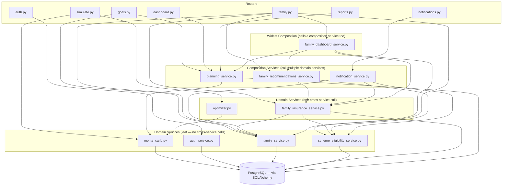
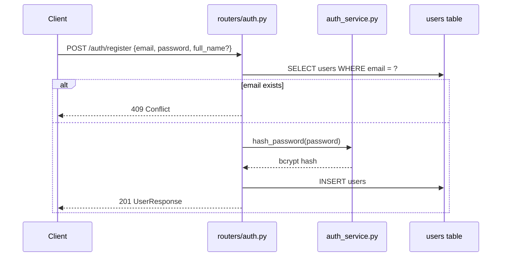
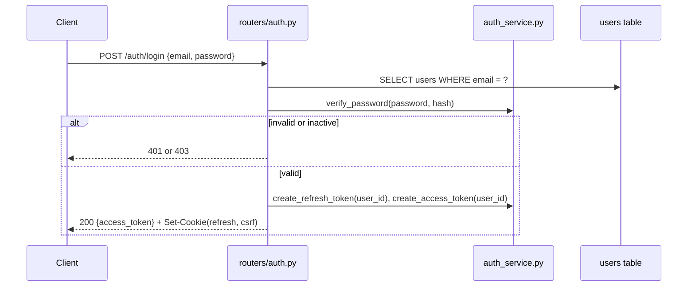
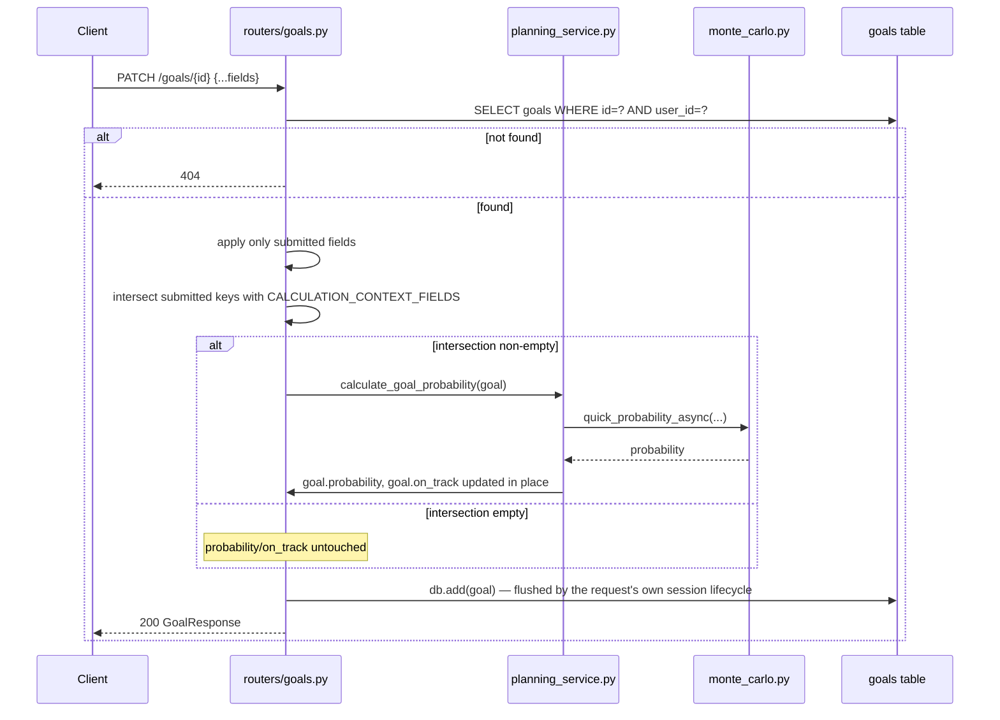
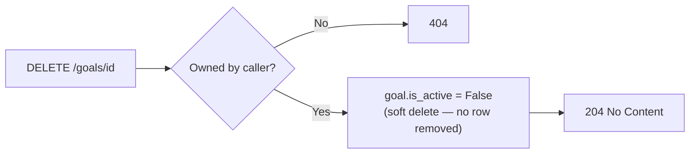
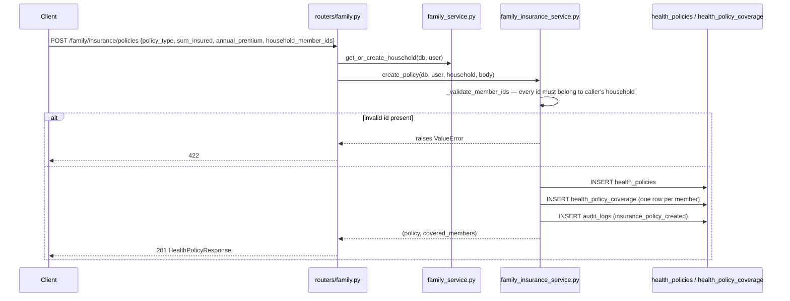
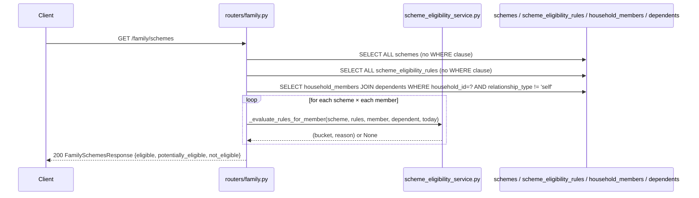
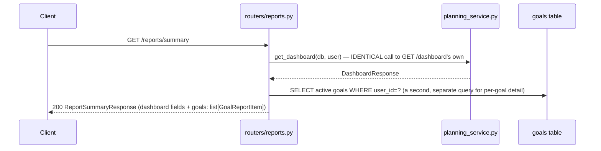
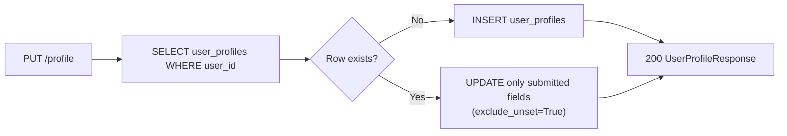
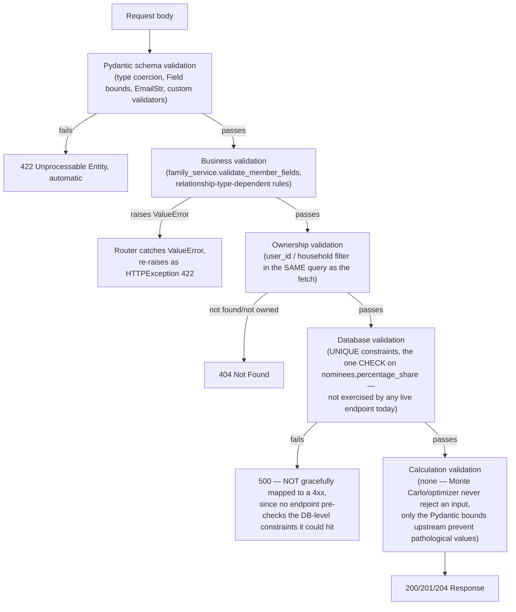

# API & SERVICE INTERACTION BIBLE

**Volume 4 of the Northstar Project Engineering Bible**
**Date compiled:** 2026-07-09
**Method:** every router (`backend/app/routers/*.py`, 11 files), every service (`backend/app/services/*.py`, 10 files), every middleware (`backend/app/middleware/*.py`, 3 files), every schema (`backend/app/schemas/*.py`, 13 files), and every test file touching an HTTP endpoint (18 files, cross-checked by extracting every `test_*` function name) were read for this document. Where a claim could be verified by grep, the grep is cited. Nothing here is inferred from a docstring alone without confirming the code beneath it does what the docstring says.

---

## 1. API Architecture

**Philosophy, verified across all 56 endpoints in this codebase without exception:** a router validates input via a Pydantic schema, calls **at most one** service function, and returns a schema. `docs/ENGINEERING_CONSTITUTION.md` Rule 1 states this as policy; reading every router confirms it holds literally, not just in spirit — the only two routers that don't delegate to a dedicated service module (`profile.py`, `financials.py`, `assumptions.py`) instead perform their single `SELECT`/`INSERT`/`UPDATE` directly inline, which is still "no business logic," just no separate service file for a domain simple enough not to need one.

**How routers are organized:** one file per domain (`auth.py`, `goals.py`, `dashboard.py`, `simulate.py`, `copilot.py`, `profile.py`, `financials.py`, `assumptions.py`, `reports.py`, `family.py`, `notifications.py`), each declaring its own `APIRouter(prefix=..., tags=[...])`, all mounted under the single `/api/v1` prefix in `main.py`'s `create_app()`.

**How services are organized:** a service either owns a single domain outright (`family_service.py`, `family_insurance_service.py`, `scheme_eligibility_service.py`, `monte_carlo.py`, `optimizer.py`, `notification_service.py`, `auth_service.py`) or composes other services without duplicating their logic (`planning_service.py` for Dashboard aggregation, `family_recommendations_service.py` and `family_dashboard_service.py` for cross-domain composition — both explicitly documented in their own module docstrings as performing "zero calculation of their own").

**How schemas are organized:** one file per domain, mirroring the router split exactly (`schemas/goal.py` ↔ `routers/goals.py`, etc.), each declaring a `*Create`/`*Update` input pair and a `*Response` output shape, with `model_config = {"from_attributes": True}` on every response schema that wraps an ORM model directly.

**Why this structure was chosen:** the domain-per-file split (router, service, schema all named identically per domain) means a new engineer can find every piece of one feature by name alone, and the "routers call services, services own logic" split is what makes the Calculation Lifecycle rule (§13) enforceable — there is exactly one place (`planning_service.calculate_goal_probability`) a recalculation can originate from, because the router layer is contractually forbidden from containing the `if` statement that could bypass it.

---

## 2. Endpoint Inventory

*(All 56 endpoints found across 11 routers plus `/health`, grouped by domain exactly as requested.)*

### Authentication (10)

| Method | Path | Auth required | Purpose |
|---|---|---|---|
| POST | `/auth/register` | No | Create account |
| POST | `/auth/login` | No | Issue access token + refresh/CSRF cookies |
| POST | `/auth/refresh` | Refresh cookie + CSRF header | Rotate tokens |
| POST | `/auth/logout` | No (clears cookies regardless) | Clear refresh session |
| GET | `/auth/me` | Yes | Current user profile |
| PUT | `/auth/me` | Yes | Update name/password |
| DELETE | `/auth/me` | Yes | Soft-deactivate account |
| POST | `/auth/forgot-password` | No | Issue reset token (rate-limited per email) |
| POST | `/auth/reset-password` | No (token-authenticated) | Consume reset token |
| POST | `/auth/change-password` | Yes | Change password with current-password proof |

### Goals (6)

| Method | Path | Auth | Purpose |
|---|---|---|---|
| GET | `/goals` | Yes | List own active goals |
| POST | `/goals` | Yes | Create goal (triggers Monte Carlo) |
| GET | `/goals/{id}` | Yes | Fetch one goal |
| PATCH | `/goals/{id}` | Yes | Update goal (conditionally triggers Monte Carlo) |
| DELETE | `/goals/{id}` | Yes | Soft-delete |
| PUT | `/goals/{id}/family-tags` | Yes | Replace household-member tag set |

### Dashboard (1)

| Method | Path | Auth | Purpose |
|---|---|---|---|
| GET | `/dashboard` | Yes | Aggregated financial summary (read-only) |

### Simulation & Optimization (2)

| Method | Path | Auth | Purpose |
|---|---|---|---|
| POST | `/simulate` | Yes | Explicit, full 10,000-path Monte Carlo run |
| POST | `/simulate/optimize` | Yes | Ranked contribution/risk suggestions |

### AI Copilot (1)

| Method | Path | Auth | Purpose |
|---|---|---|---|
| POST | `/copilot` | Yes | Grounded chat over the user's own goals |

### Profile (2)

| Method | Path | Auth | Purpose |
|---|---|---|---|
| GET | `/profile` | Yes | Fetch personal-info profile |
| PUT | `/profile` | Yes | Create-or-update (upsert) profile |

### Financials (14)

| Method | Path | Auth | Purpose |
|---|---|---|---|
| GET/POST/DELETE | `/financials/income[/{id}]` | Yes | Income sources CRD (no U) |
| GET/POST/DELETE | `/financials/expenses[/{id}]` | Yes | Expenses CRD (no U) |
| GET/POST/PATCH/DELETE | `/financials/assets[/{id}]` | Yes | Assets full CRUD |
| GET/POST/PATCH/DELETE | `/financials/liabilities[/{id}]` | Yes | Liabilities full CRUD |

### Settings / Assumptions (2)

| Method | Path | Auth | Purpose |
|---|---|---|---|
| GET | `/assumptions` | Yes | Fetch (lazily creates defaults if absent) |
| PUT | `/assumptions` | Yes | Upsert |

### Reports (1)

| Method | Path | Auth | Purpose |
|---|---|---|---|
| GET | `/reports/summary` | Yes | Read-only export, mirrors Dashboard + per-goal breakdown |

### Family (13)

| Method | Path | Auth | Purpose |
|---|---|---|---|
| POST | `/family/onboarding-seed` | Yes | Seed household from onboarding answers |
| GET | `/family` | Yes | Household + member list (lazy-provisions) |
| POST | `/family/members` | Yes | Create a household member |
| PUT | `/family/members/{id}` | Yes | Update a member |
| GET | `/family/members/{id}` | Yes | Member detail (tagged goals + coverage) |
| DELETE | `/family/members/{id}` | Yes | Soft-remove a member |
| GET | `/family/goals` | Yes | Goals with tagged-member lists |
| GET | `/family/insurance` | Yes | Policies + live insurance recommendation |
| POST | `/family/insurance/policies` | Yes | Create a policy |
| PUT | `/family/insurance/policies/{id}/coverage` | Yes | Replace covered-member set |
| GET | `/family/recommendations` | Yes | Aggregated insurance + scheme recommendations |
| GET | `/family/dashboard` | Yes | 6-card composed family view |
| GET | `/family/schemes` | Yes | Government scheme eligibility buckets |

### Notifications (3)

| Method | Path | Auth | Purpose |
|---|---|---|---|
| GET | `/notifications` | Yes | List + unread count (pure read) |
| POST | `/notifications/{source}/{key}/read` | Yes | Mark one notification read |
| POST | `/notifications/{source}/{key}/dismiss` | Yes | Dismiss one notification |

### Utilities / Health (1)

| Method | Path | Auth | Purpose |
|---|---|---|---|
| GET | `/health` | No | Liveness + DB connectivity probe |

---

## 3. Endpoint Deep Dive

*(Full treatment for every architecturally significant endpoint; the four repetitive Financials CRUD groups are treated as one compact table each, since their 14 endpoints share one identical shape.)*

### 3.1 `POST /auth/register`

- **Purpose:** create a new account.
- **Auth:** none.
- **Input schema:** `UserCreate` (`schemas/user.py`) — `email: EmailStr`, `full_name: str | None`, `password: str` (8–128 chars).
- **Validation:** Pydantic `EmailStr` format check; password length bounds. **No password complexity rule** (no uppercase/digit/symbol requirement) — verified by reading `UserCreate` in full, only `min_length=8`.
- **Business rules:** email uniqueness checked via an explicit `SELECT` before insert (`routers/auth.py`'s `register`), returning `409 Conflict` on collision rather than relying on the database's own `UNIQUE` constraint to surface as a generic 500.
- **Services called:** `auth_service.hash_password` only — no dedicated `AuthService` class, the function is called directly from the router.
- **DB reads:** one (`email` uniqueness check). **DB writes:** one `INSERT INTO users`.
- **Calculations triggered:** none. **Events triggered:** none — **verified: no `AuditLog` row is written for registration.**
- **Response:** `201`, `UserResponse`.
- **Error conditions:** `409` (duplicate email), `422` (schema validation failure — weak password, malformed email).
- **Tests:** `test_auth.py::TestRegister::test_register_new_user`, `test_register_duplicate_email`, `test_register_weak_password`.
- **Consumers:** `code/src/lib/api.ts`'s `auth.register`, called from the onboarding wizard's first step.

### 3.2 `POST /auth/login`

- **Purpose:** authenticate and issue a fresh token set.
- **Input schema:** `LoginRequest` — `email`, `password`.
- **Business rules, in exact order:** (1) fetch user by email → `401` if not found (deliberately the same status as a wrong password, never revealing which); (2) `verify_password` → `401` on mismatch; (3) `is_active` check → `403` if the account was soft-deactivated (a distinct status from bad credentials, since the account genuinely exists).
- **Services called:** `auth_service.verify_password`, `create_refresh_token`, `create_access_token`.
- **DB reads:** one. **DB writes:** none directly to `users` — the write is entirely in the **response**, via `Set-Cookie` headers (`_set_auth_cookies`), not a database row.
- **Response:** `200`, `TokenResponse` (`{access_token, token_type: "bearer"}`) in the body; `ns_refresh_token` (httpOnly) and `ns_csrf_token` (JS-readable) set as cookies.
- **Tests:** `test_auth.py::TestLogin` (3 tests: valid, wrong password, nonexistent user).

### 3.3 `POST /auth/refresh`

- **Purpose:** exchange a valid refresh cookie + matching CSRF header for a new access token, rotating both the refresh token and CSRF pair.
- **Auth:** not the standard `get_current_user` bearer-token dependency — a distinct mechanism entirely, reading `request.cookies` directly.
- **Business rules, in exact tested order (verified against `test_auth.py::TestRefresh`, all 6 tests):** (1) no `ns_refresh_token` cookie → `401`; (2) cookie present but no `X-CSRF-Token` header → `403`; (3) header present but doesn't match the `ns_csrf_token` cookie (`secrets.compare_digest`, constant-time) → `403`; (4) CSRF passes but the refresh JWT itself is invalid/expired → `401`; (5) all checks pass → new tokens issued, **the CSRF cookie value changes on every successful call** (verified by `test_refresh_rotates_csrf_cookie`).
- **Response:** `200`, `TokenResponse` — **verified: the response body never contains `refresh_token`** (`test_refresh_returns_new_access_token` explicitly asserts `"refresh_token" not in resp.json()`) — it only ever travels as an httpOnly cookie, never in a JSON body a script could read.
- **Consumers:** never called directly by application code in normal use — `code/src/lib/api.ts`'s `apiFetch` calls this automatically and only on a `401` from any other endpoint (§7).

### 3.4 `POST /auth/logout`

- **Purpose:** clear the refresh session.
- **Business rules:** unconditionally clears both cookies (`_clear_auth_cookies`) — **no authentication is required to call this endpoint at all**, verified by reading the router (no `Depends(get_current_user)` on this route) and by the test calling it with no `auth_headers`.
- **Response:** `204`.
- **Verified side effect:** a subsequent `/auth/refresh` call with the now-cleared cookie correctly fails with `401` (`test_logout_clears_refresh_session`'s own second assertion).

### 3.5 `GET` / `PUT /auth/me`, `DELETE /auth/me`

- **`GET /auth/me`:** pure read, returns the already-loaded `current_user` from the `get_current_user` dependency — **zero additional database query**, the dependency's own fetch is the only one.
- **`PUT /auth/me`:** `UserUpdate` (`full_name`, `password`, both optional) — only provided fields are applied; password is re-hashed if present. **Verified: no "confirm current password" check exists on this route** (unlike `/auth/change-password`, §3.7) — a logged-in session (bearer token alone) is sufficient to change the password.
- **`DELETE /auth/me`:** sets `is_active = False` only — **soft delete**, confirmed in Volume 3 §4.1.
- **Tests:** `test_auth.py::TestMe` (6 tests).

### 3.6 `POST /auth/forgot-password`

- **Business rules, precisely verified:** **always returns `200`** regardless of whether the email exists (`test_forgot_password_unknown_email_returns_200`) — a deliberate anti-enumeration measure. The actual reset token is included in the response body **only when `settings.debug` is true** (`test_forgot_password_known_email_does_not_leak_token` asserts the token is absent in the non-debug path). A dedicated per-email token bucket (`_check_forgot_password_throttle`, independent of the generic IP rate limiter) caps requests at `_FORGOT_PASSWORD_LIMIT` per `_FORGOT_PASSWORD_WINDOW_SECONDS`, returning `429` when exceeded — verified by `test_forgot_password_throttled_per_email` and `test_forgot_password_throttle_is_scoped_per_email` (confirming the throttle is keyed per-email, not global).

### 3.7 `POST /auth/reset-password`, `POST /auth/change-password`

- **`reset-password`:** token-authenticated (no bearer token) — looks up `PasswordResetToken` by `token_hash` (SHA-256 of the submitted token, `_hash_token`), requires `used_at IS NULL AND expires_at > NOW()`, sets the new password, marks the token `used_at`. **Verified: a token can never be replayed** — `test_reset_password_token_used_twice_returns_400` confirms a second use of the same token returns `400`.
- **`change-password`:** requires the **current** password as proof (`verify_password(body.current_password, ...)` → `400` on mismatch) plus a distinct-from-current check (`400` if new equals current) — the one password-change route in this API that actually re-verifies the caller isn't just holding a valid bearer token, but knows the current secret.

### 3.8 `GET /goals`, `POST /goals`, `GET /goals/{id}`, `PATCH /goals/{id}`, `DELETE /goals/{id}`, `PUT /goals/{id}/family-tags`

*(The single most architecturally important endpoint group in this API — full Volume 2 §9 treatment applies; summarized here from the API-layer perspective.)*

- **`GET /goals`:** optional `category`/`on_track` query filters; always filters `user_id = current_user.id AND is_active = TRUE`; ordered `priority ASC, created_at ASC` (matching the partial index `ix_goals_user_id_priority`, Volume 3 §4.2/§12).
- **`POST /goals`:** `GoalCreate` → `Goal(user_id=current_user.id, **body)` → **`await calculate_goal_probability(goal)` unconditionally, before the insert flushes** — the probability is computed and set on the in-memory object before it ever touches the database, so the row is written once, already complete, never as an insert-then-update pair.
- **`PATCH /goals/{id}`:** ownership-checked fetch (`404` if not found/not owned) → apply only the fields present in the request (`exclude_none=True`) → **conditionally** recalculate, gated by `CALCULATION_CONTEXT_FIELDS ∩ updates.keys()` (Volume 2 §7's exact mechanism).
- **`DELETE /goals/{id}`:** soft delete (`is_active = False`).
- **`PUT /goals/{id}/family-tags`:** the one Goals-router endpoint that delegates to `family_service` rather than `planning_service` — `set_goal_household_tags` validates every submitted ID belongs to the caller's own household (raising `ValueError` → `422` otherwise), then replaces the entire tag set (delete-then-reinsert).
- **Calculations triggered:** `POST`/conditionally `PATCH` → Monte Carlo (`quick_probability_async`, 2,000 paths). `PUT .../family-tags` → **none**.
- **Events triggered:** `PUT .../family-tags` → `AuditLog(action="family_goal_tag_changed")` (written by `family_service`, not `goals.py` itself). **No other Goals endpoint writes an audit log** (Volume 3 DB-finding, Volume "Findings" EF-005).
- **Tests:** `test_goals.py` (goal CRUD), `test_goal_inflation.py` (11 tests specifically proving `custom_inflation_rate` never perturbs probability), `test_family_goal_tagging.py` (11 tests for the tagging endpoint specifically, including cross-household rejection and audit-log verification).

### 3.9 `GET /dashboard`

- **Purpose:** the single aggregated financial view.
- **Business rules:** **zero Monte Carlo computation** — reads every active goal's already-persisted `probability`/`on_track`, aggregates assets/liabilities/income/expenses, computes `plan_health_score` (weighted average, Volume 2 §2.6) and `savings_rate` (Volume 2 §2.7) as pure arithmetic over already-fetched rows.
- **Services called:** `planning_service.get_dashboard` only.
- **DB reads:** 5 separate `SELECT`s (active Goals, Assets, Liabilities, IncomeSources, Expenses) — **verified: no JOIN, five independent queries**, each filtered by `user_id` + `is_active`.
- **DB writes:** **none** — this is the endpoint ADR-001 exists specifically to keep pure (Volume 2 §10's full treatment).
- **Response:** `DashboardResponse` — includes `suggestions` (`_generate_suggestions`, pure rule evaluation, capped at 5).
- **Tests:** `test_dashboard.py` (8 tests) — critically including `test_repeated_dashboard_reads_never_change_goal_probability`, an automated, permanent guarantee that this endpoint's read-only status can never silently regress.

### 3.10 `POST /simulate`

- **Purpose:** an explicit, full 10,000-path simulation, independent of any goal's stored probability.
- **Business rules:** if `goal_id` is provided and resolves to a goal the caller owns, its `target_amount` **overrides** the request body's own computed target (`initial + monthly × years × 12`) — verified precisely in `routers/simulate.py`'s `simulate` function.
- **Services called:** `monte_carlo.run_simulation_async` (10,000 paths, capped by `min(body.num_simulations, settings.monte_carlo_simulations)`).
- **DB writes:** one `INSERT INTO simulations` — **never writes to `goals`** (Volume 3 §4.2's "write-only, no read endpoint" finding applies directly here).
- **Tests:** `test_simulate.py::TestSimulate` (5 tests, including `test_simulate_with_goal_id_uses_goal_target` confirming the override behavior precisely).

### 3.11 `POST /simulate/optimize`

- **Business rules:** ownership-checked goal fetch (`404` otherwise) → `years = max(0.1, (target_date - today).days / 365.25)` (the same day-count formula as `planning_service`, computed independently here — a second implementation of the same formula, not a shared call) → `optimizer.generate_suggestions`.
- **Services called:** `optimizer.generate_suggestions`, which internally calls `monte_carlo.quick_probability` (2,000 paths) up to 6 times.
- **DB writes:** none.
- **Tests:** `test_simulate.py::TestOptimize` (3 tests).

### 3.12 `POST /copilot`

- **Purpose:** grounded chat.
- **Business rules:** fetches the caller's active goals, serializes exactly 7 fields (`name`, `category`, `target_amount`, `current_amount`, `probability`, `on_track`, `monthly_contribution`) into the LLM system prompt if an OpenAI key is configured; falls back to `_fallback_response` (rule-based: names up-to-2 low-probability goals, or a generic "plan looks healthy" message) if no key is set **or** the OpenAI call raises `OpenAIError` (verified: caught broadly, covering timeouts/rate-limits/connection failures alike, logged as a warning, never surfaced as a `500`).
- **Input schema:** `ChatRequest` — `message` (1–2000 chars, rejecting empty), `conversation_id` (optional, generated via `uuid.uuid4()` if absent).
- **DB reads:** one (active goals). **DB writes:** none — **no conversation history is persisted anywhere**, confirmed by grep (no `Conversation`/`ChatMessage` table exists in this schema at all).
- **Tests:** `test_copilot.py` (10 tests across `TestCopilot` and `TestCopilotOpenAIPath`, the latter mocking the OpenAI client directly to verify both the success path and the fallback-on-error path).

### 3.13 `GET`/`PUT /profile`

- Both inline in `routers/profile.py`, no service file. `GET` → `404` if no profile row exists yet (**not** a lazy-create like `/assumptions`, a real, verified inconsistency between two structurally similar per-user-singleton endpoints). `PUT` upserts (`exclude_unset=True` — only submitted fields are applied, verified by `test_financials.py::TestProfile`'s 4 tests, moved into that file rather than a dedicated `test_profile.py`).

### 3.14 Financials CRUD — `income`, `expenses`, `assets`, `liabilities`

| Aspect | `income` | `expenses` | `assets` | `liabilities` |
|---|---|---|---|---|
| Create | ✅ | ✅ | ✅ | ✅ |
| Read (list) | ✅ | ✅ | ✅ | ✅ |
| Update | ❌ (none exists) | ❌ (none exists) | ✅ `PATCH` | ✅ `PATCH` |
| Delete | ✅ (soft) | ✅ (soft) | ✅ (soft) | ✅ (soft) |
| Upper bound | `annual_amount ≤ 100,000,000` | `monthly_amount ≤ 10,000,000` | `current_value ≤ 1,000,000,000` | `balance ≤ 1,000,000,000`, `interest_rate ≤ 1` (i.e. ≤100%) |
| Ownership check | `user_id` inline in every query | same | same | same |
| Audit logged | ❌ | ❌ | ❌ | ❌ |

All four are inline in `routers/financials.py`, no service file — every `POST` does `Model(user_id=current_user.id, **body.model_dump())` directly. **Verified, real inconsistency:** `income`/`expenses` cannot be corrected in place; `assets`/`liabilities` can. Tests: `test_financials.py` (22 tests across `TestIncome`/`TestExpenses`/`TestAssets`/`TestLiabilities`), each domain including an "absurdly large value rejected" test confirming the `_MAX_*` bounds are actually enforced by Pydantic, not just declared.

### 3.15 `GET`/`PUT /assumptions`

- **`GET`:** **lazy-creates** a `FinancialAssumptions` row with hardcoded `_DEFAULTS` if none exists (unlike `/profile`'s `404`-on-missing behavior above) — verified by `test_financials.py::test_get_assumptions_creates_defaults` and confirmed idempotent (`test_get_assumptions_idempotent` — calling `GET` twice does not create two rows).
- **`PUT`:** upserts, `exclude_unset=True`.
- **The one fact worth restating from Volume 2 at the API layer specifically:** every value this endpoint lets a user set (`expected_return_*`, `tax_rate`, `retirement_age`, `social_security_monthly`) except `inflation_rate` is never read by any calculation anywhere in the backend — this endpoint's own tests verify the values persist correctly, but no test anywhere asserts they *affect* a simulation, because they don't.

### 3.16 `GET /reports/summary`

- **Purpose:** a read-only export, deliberately built to **agree exactly** with the Dashboard.
- **Business rules:** calls `planning_service.get_dashboard()` internally (the identical function the Dashboard endpoint calls), then issues one additional `SELECT` for active goals to build the per-goal `GoalReportItem` breakdown the Dashboard's own response doesn't include.
- **Verified, load-bearing guarantee:** `test_reports.py::test_dashboard_and_reports_show_identical_probability` — a dedicated test asserting the two endpoints return the same probability for the same goal, at the same moment, precisely because they share the exact same underlying read function rather than two independent implementations that could drift.

### 3.17 `POST /family/onboarding-seed`

- **Purpose:** convert onboarding's yes/no family questions into real `household_members` rows.
- **Business rules:** **idempotent by design** — `family_service.seed_onboarding` checks `get_or_create_household`'s `created` flag; if the household already existed (a re-entry into onboarding), it returns immediately without creating duplicate placeholder members (verified: `test_family_router.py::TestOnboardingSeed::test_idempotent_does_not_duplicate`). `children_count` (1–10) is required by a `model_validator` if `has_children` is true (`schemas/family.py`'s `OnboardingSeedRequest`).
- **DB writes:** the `self` member (always), plus one row per spouse/child/parent answered "yes."

### 3.18 `POST /family/members`, `PUT /family/members/{id}`, `GET /family/members/{id}`, `DELETE /family/members/{id}`

- **Validation, relationship-type-dependent (`family_service.validate_member_fields`, not expressible as a per-field Pydantic rule since the same field means different things per type):** `spouse`/`child` require `date_of_birth`; `parent` requires `relationship_detail ∈ {mother, father}` **and** `has_own_insurance`; `other` requires `relationship_detail` (any non-empty string). All violations raise `ValueError` → `422`.
- **`date_of_birth` bounds (`schemas/family.py`'s `_validate_date_of_birth`):** cannot be in the future, cannot be more than 130 years in the past — verified by `test_family_router.py::test_date_of_birth_in_future_rejected`.
- **The `self` member is explicitly protected:** `PUT`/`DELETE` both return `400` if `relationship_type == "self"` (`test_cannot_edit_self_via_member_endpoint`, `test_cannot_remove_self`).
- **Cross-household ownership is explicitly, separately tested** (not just assumed from the general pattern): `TestCrossHouseholdOwnership` (4 tests) confirms `GET`/`PUT`/`DELETE` on another household's member all return `404`, and each user gets their own household on first access.
- **Calculations triggered on create/update:** the inline SSY eligibility check (`_eligible_schemes_for`, calling `scheme_eligibility_service.check_ssy_eligibility`) — **read-only**, populates the response's `eligible_schemes` field, writes nothing.
- **Events triggered:** `family_member_added`/`_updated`/`_removed` audit logs.

### 3.19 `GET /family/goals`

- Read-only join of the caller's own goals (same filter/ordering as `GET /goals`) to their `goal_household_members` tags — **verified to reuse, not duplicate,** the goal-listing logic (`family_service.list_goals_with_tags`'s own comment states this explicitly).

### 3.20 `GET /family/insurance`, `POST /family/insurance/policies`, `PUT /family/insurance/policies/{id}/coverage`

- **`GET`:** returns policies **and** a freshly-computed `InsuranceRecommendation | None` (Volume 2 §11.1's exact 80D-doubling formula) — **recomputed on every call, nothing persisted**, despite the endpoint's own docstring explicitly flagging this to a future reader ("Read-only... has no write side-effect despite computing a recommendation").
- **`POST .../policies`:** requires `household_member_ids` with `min_length=1` (a policy must cover at least one person) — validated against the caller's own household (`_validate_member_ids`, raising `ValueError` → `422` for a foreign ID).
- **`PUT .../coverage`:** full delete-then-reinsert of the covered-member set for one policy — **no endpoint exists to delete a policy itself** (Volume 3 DB-006).

### 3.21 `GET /family/recommendations`

- **Purpose:** the aggregated insurance + scheme feed.
- **Business rules:** calls `family_insurance_service.compute_insurance_recommendation` and `scheme_eligibility_service.evaluate_household_eligibility` — **each exactly once**, verified by reading `family_recommendations_service.get_family_recommendations`'s body directly (no loop re-calling either). Conflict detection (`_detect_conflicts`) groups by `(subject, reference_code)` — pure in-memory set operation, zero additional DB reads.
- **Tests:** `test_family_recommendations.py` — 9 endpoint tests plus 4 pure-function `TestConflictDetection` tests (no `client`/`db` fixture needed for the latter, since conflict detection takes plain `FamilyRecommendation` objects). Notably includes `test_nothing_is_persisted` and `test_calculation_lifecycle_untouched` — both directly, automatically verifying two of this document's most repeated architectural claims.

### 3.22 `GET /family/dashboard`

- **Purpose:** the widest-reaching single endpoint in this API — composes 6 cards plus the recommendations feed.
- **Business rules:** fetches the household member list and goal-with-tags list **exactly once each**, shared across every card that needs them (`_safe()` wrapper, Volume 1/3's Milestone 2.1-P4 optimization). Each card computes under its own try/except — a failure in one degrades that card to `null` (logged server-side) while every other card still populates; `recommendations_unavailable: bool` is a **distinct** flag from "recommendations empty," so the frontend never conflates "nothing to recommend" with "we couldn't check."
- **Tests:** `test_family_dashboard.py` (15 tests) — including `test_partial_failure_degrades_gracefully` and `test_recommendations_unavailable_flag`, both directly exercising the graceful-degradation contract, not just asserting the happy path.

### 3.23 `GET /family/schemes`

- **Purpose:** the full household eligibility evaluation, bucketed.
- **Business rules:** a **direct passthrough** of `scheme_eligibility_service.evaluate_household_eligibility` — the router's own docstring states "zero new eligibility logic," verified by reading the function: it reshapes the returned dict into the response schema and nothing else.
- **Known, verified performance characteristic (Volume 3 §12):** loads **every** `Scheme` and **every** `SchemeEligibilityRule` unconditionally, no `WHERE` clause, filters in Python.

### 3.24 `GET /notifications`, `POST .../read`, `POST .../dismiss`

- **`GET`:** collects 5 sources fresh (insurance, schemes, family-member-added, goal-at-risk, goal-completed), left-joins against existing `notification_markers` rows, **creates nothing** — the single most rigorously tested read-purity guarantee in this API (`test_notifications.py::test_get_notifications_never_creates_a_marker_row`, calling the endpoint 3 times and asserting the table stays empty throughout).
- **`.../read`, `.../dismiss`:** the only two writes in this domain, each an upsert scoped to exactly one `(user_id, dedupe_key)` row.
- **Tests:** `test_notifications.py` — 11 tests (this engagement's own work, Milestone 2.6 Phase 3).

### 3.25 `GET /health`

- **Purpose:** liveness + DB connectivity probe, defined inline in `main.py`, not a router file.
- **Business rules:** attempts `SELECT 1`; returns `{"status": "degraded", "db": "error"}` (still `200`, never a `5xx`) if the query raises — a deliberate choice so a load balancer's health check distinguishes "app is up but DB is unreachable" from "app itself crashed," rather than treating both identically.
- **Auth:** none. **Bypasses the rate limiter entirely** — verified in `middleware/rate_limit.py`: `/health` is explicitly excluded before any bucket logic runs.

---

## 4. Service Architecture

| Service | Purpose | Public methods (exhaustive) | Called by | Calls into | Why it exists |
|---|---|---|---|---|---|
| `auth_service.py` | Password hashing + JWT lifecycle | `hash_password`, `verify_password`, `create_access_token`, `create_refresh_token`, `decode_token`, `get_user_id_from_token` | `routers/auth.py`, `middleware/auth.py` | `passlib`, `python-jose` (external only) | Isolate every cryptographic/JWT detail in one file so no router ever constructs a token by hand |
| `planning_service.py` | Goal probability (the Calculation Lifecycle's sole trigger) + Dashboard aggregation | `calculate_goal_probability`, `compute_plan_health`, `get_dashboard` (+ private `_active_goals`, `_generate_suggestions`) | `routers/goals.py`, `routers/dashboard.py`, `routers/reports.py`, `family_dashboard_service.py` | `monte_carlo.quick_probability_async` | Concentrate the one recalculation trigger and the one read-only aggregation path in a single file, per ADR-001 |
| `monte_carlo.py` | The simulation engine itself | `run_simulation`, `quick_probability`, `run_simulation_async`, `quick_probability_async` | `planning_service.py`, `routers/simulate.py`, `optimizer.py` | NumPy only (no other service) | Isolate all stochastic-modeling math in one pure-function module, callable identically from an inline goal save or an explicit simulate request |
| `optimizer.py` | Ranked improvement suggestions | `generate_suggestions` (+ private `_clamp_risk`) | `routers/simulate.py` (`/optimize`) | `monte_carlo.quick_probability` | Keep "what should the user change" reasoning separate from "what's their current probability" — a distinct concern from `planning_service` |
| `family_service.py` | Household/member CRUD, goal-tagging, name resolution | `resolve_owned_household`, `get_or_create_household`, `seed_onboarding`, `is_complete`, `list_members_with_completeness`, `validate_member_fields`, `create_member`, `get_member_and_dependent`, `update_member`, `get_member_detail`, `remove_member`, `resolve_member_name`, `set_goal_household_tags`, `list_goals_with_tags` | `routers/family.py`, `routers/goals.py` (tagging only) | none (leaf service for its own domain) | The largest single service in this codebase by public-method count — every Family-domain write and the one piece of Goals-domain logic (tagging) that needs household context |
| `family_insurance_service.py` | Policy CRUD + the one real tax-figure calculation in the app | `list_policies_with_coverage`, `create_policy`, `get_policy`, `replace_policy_coverage`, `uncovered_parents`, `compute_insurance_recommendation` (+ private `_base_80d_limit`, `_covered_members_for`, `_covered_members_for_policies`, `_covered_member_ids`) | `routers/family.py`, `family_recommendations_service.py`, `family_dashboard_service.py`, `notification_service.py` | `family_service.py` (name resolution), `scheme_eligibility_service.age_years` | Isolate the one place a tax deduction figure is actually computed, so every consumer (recommendations, dashboard, notifications) reads the same authority |
| `scheme_eligibility_service.py` | Government scheme eligibility evaluation | `age_years`, `evaluate_household_eligibility`, `check_ssy_eligibility` (+ private `_evaluate_rules_for_member`) | `routers/family.py`, `family_recommendations_service.py`, `notification_service.py` | none | Narrow, deliberately-scoped rule engine (3 rule types only, per its own docstring) reused identically by the inline SSY callout and the full schemes page |
| `family_recommendations_service.py` | Cross-source aggregation + conflict detection | `get_family_recommendations` (+ private `_insurance_recommendations`, `_scheme_recommendations`, `_detect_conflicts`) | `routers/family.py`, `family_dashboard_service.py` | `family_insurance_service.py`, `scheme_eligibility_service.py` | Its own docstring: "zero eligibility math and zero deduction-figure computation of its own" — exists purely to reformat and cross-check, never to compute |
| `family_dashboard_service.py` | 6-card composition with graceful degradation | `get_family_dashboard` (+ 6 private per-card functions, `_safe`) | `routers/family.py` | `family_service.py`, `family_insurance_service.py`, `family_recommendations_service.py`, `planning_service.get_dashboard` | The single widest cross-service caller in this codebase — exists to compose, not to add new logic (its own docstring: "zero financial arithmetic — only counting, set membership, min()-by-date selection") |
| `notification_service.py` | Live-read notification collection + marker state | `list_notifications`, `mark_read`, `mark_dismissed` (+ private `_dedupe_key`, 4 `_collect_*_fact(s)` functions, `_collect_facts`, `_upsert_marker`) | `routers/notifications.py` | `family_insurance_service.compute_insurance_recommendation`, `scheme_eligibility_service.evaluate_household_eligibility`, `family_service.resolve_member_name` | The newest service in this codebase (Milestone 2.6 Phase 3) — deliberately reuses every existing engine rather than recomputing anything, per its own explicit design mandate |

**Known limitations, per service, verified:**
- `planning_service.py`: `_generate_suggestions`'s thresholds (50, 70, 15) are hardcoded literals with no configuration surface.
- `monte_carlo.py`: `PROFILE_PARAMS` is fully disconnected from `financial_assumptions` (Volume 2 §1, restated here since it's this service's single most consequential fact).
- `family_service.py`: `is_complete()`'s per-relationship-type completeness rules are hardcoded `if`/`elif` branches, not data-driven — adding a new relationship type requires editing this function directly.
- `scheme_eligibility_service.py`: only 3 rule types (`max_age`, `min_age`, `gender`) are ever evaluated; a seeded rule of any other `rule_type` is silently never checked (documented in the module's own docstring as a deliberate scope boundary, not a bug).
- `notification_service.py`: the `family_member_added` source has a hardcoded 30-day recency window (`_FAMILY_MEMBER_ADDED_WINDOW_DAYS`) with no configuration surface.

---

## 5. Service Dependency Graph

**Verified structural fact:** `family_dashboard_service.py` is the only service in this codebase that calls a *composition* service (`family_recommendations_service.py`) rather than only leaf/one-hop services — making it the single deepest call chain in the API: `router → family_dashboard_service → family_recommendations_service → family_insurance_service → family_service`, four layers deep for one field in one response.

---

## 6. Request Lifecycles

*(Sequence diagrams for the 14 lifecycles named in the brief. Several were already diagrammed in Volumes 1-2 from a different angle — cross-referenced rather than redrawn identically.)*

### 6.1 Register

### 6.2 Login

### 6.3 Create Goal

*(Full diagram already in Volume 1 §7.2 and Volume 2 §9 — cross-referenced, not redrawn. Key API-layer addition: the probability is set on the in-memory `Goal` object before `db.flush()`, so no update statement ever follows the insert.)*

### 6.4 Update Goal

### 6.5 Delete Goal

### 6.6 Dashboard Load

*(Full diagram in Volume 2 §10 — cross-referenced. API-layer addition: this is the one lifecycle in this document with zero conditional branching in its happy path — every read always executes, regardless of whether the user has any goals/assets at all; the empty-state fallback in `get_dashboard` is a data shape decision, not a different code path.)*

### 6.7 Family Member Create

*(Full diagram in Volume 1 §7.4 — cross-referenced. API-layer addition: the response's `eligible_schemes` field is populated by a call to `scheme_eligibility_service` that happens *after* the member/dependent rows are already committed to the session, meaning the eligibility check reads the just-created data back, not the in-memory object directly.)*

### 6.8 Insurance Policy Create

### 6.9 Scheme Evaluation

### 6.10 Recommendation Feed

*(Full diagram in Volume 1 §7.5 and Volume 2 §11.3 — cross-referenced, not redrawn.)*

### 6.11 Notification Load

*(Full diagram in Volume 2 §11.4 and this Bible's own construction this engagement — cross-referenced. API-layer addition: the endpoint's response sorts all collected facts by `created_at` descending in Python, after collection, not via an `ORDER BY` in any of the underlying queries — since the 5 sources have no common table to sort at the database level.)*

### 6.12 Search

**Not implemented as a backend lifecycle at all** — verified in Volume 1 §9: the Global Command Palette (`code/src/components/global-palette.tsx`) searches entirely client-side over data already fetched by other screens via React Query's cache. There is no `GET /search` endpoint anywhere in this API — confirmed by the complete endpoint inventory in §2 above.

### 6.13 Reports

### 6.14 Profile Update

---

## 7. Authentication Flow

**JWT structure (`auth_service._create_token`):** every token carries `sub` (user ID), `type` (`"access"` or `"refresh"`), `iat`, `exp`, and a unique `jti`. **The `jti` is generated but never checked against a revocation list anywhere** — verified by grep, no blocklist/denylist table or in-memory set exists in this codebase; a token remains valid until its own `exp` regardless of any account action taken after issuance (including, notably, `/auth/logout`, which only clears the *refresh* cookie — an already-issued *access* token remains valid for up to its full 30-minute lifetime even after logout).

**Refresh flow, precisely:** the refresh token lives only in an httpOnly cookie scoped to `/api/v1/auth` (never sent on ordinary API calls, never readable by JS). A separate CSRF cookie, JS-readable, must be echoed back as a header on `/auth/refresh` — the double-submit pattern. `apiFetch` (`code/src/lib/api.ts`) automatically attempts exactly one refresh on any `401`, using a shared in-flight promise (`_refreshPromise`) so concurrent 401s from multiple simultaneous requests trigger only one refresh call, not one per failed request — verified by reading the guard (`if (!_refreshPromise) { _refreshPromise = ... }`).

**Dependencies:** `middleware/auth.py`'s `get_current_user` is the single dependency every protected route uses — decodes the bearer token (rejecting a refresh-type token used as an access token, verified via `expected_type="access"`), fetches the `User` row, checks `is_active`, raises `401` otherwise. **Every protected endpoint in this API uses this exact dependency — verified by grep across all 11 routers, no route implements its own auth check.**

**Ownership / current user:** resolved identically everywhere — either a direct `user_id == current_user.id` filter (Goals, Financials) or `family_service.resolve_owned_household`/`get_or_create_household` (Family domain) — never a session-scoped or middleware-level ownership mechanism.

**Middleware order (`main.py`):** `RateLimitMiddleware` → `RequestIDMiddleware` → `CORSMiddleware`, outermost first. Rate limiting runs *before* request-ID stamping, meaning a rate-limited request's logs won't carry a correlation ID — a minor, verified ordering consequence.

**Protected routes:** every route in this API except `/auth/register`, `/auth/login`, `/auth/refresh` (cookie-authenticated, not bearer), `/auth/logout`, `/auth/forgot-password`, `/auth/reset-password`, and `/health`.

---

## 8. Validation Pipeline

**Verified, real gap in this pipeline:** step H's failure path is genuinely weaker than every step before it — application-level `ValueError`s are deliberately caught and converted to `422` (verified in `family.py`'s and `goals.py`'s tagging endpoints), but a database-level constraint violation (e.g. the `goal_household_members` unique constraint, if somehow reached with a value the application-level check didn't catch) is not similarly caught anywhere — it would surface as an uncaught `IntegrityError`, which FastAPI's default exception handling turns into a bare `500`, not a descriptive `4xx`. This is a real, if narrow, gap — the application-layer checks are thorough enough that this path is rarely reached, but it is not structurally impossible to reach.

---

## 9. Cross-Service Calls

*(Every cross-service call in this codebase, verified exhaustively by reading every service's imports and function bodies — nothing more, nothing less.)*

| Caller | Callee | Purpose | Verified in |
|---|---|---|---|
| `planning_service.calculate_goal_probability` | `monte_carlo.quick_probability_async` | Compute and persist a goal's probability | Volume 2 §9 |
| `routers/simulate.py` (`optimize`) | `optimizer.generate_suggestions` | Ranked suggestions | §3.11 |
| `optimizer.generate_suggestions` | `monte_carlo.quick_probability` | Evaluate each candidate change | Volume 2 §12.1 |
| `family_insurance_service.compute_insurance_recommendation` | `family_service.resolve_member_name` | Resolve a subject's display name | §4 |
| `family_insurance_service` (module-level) | `scheme_eligibility_service.age_years` | Senior-citizen (60+) determination — reused, not reimplemented | Volume 2 §11.1 |
| `family_recommendations_service._insurance_recommendations` | `family_insurance_service.compute_insurance_recommendation` | Source insurance recommendations | Volume 2 §11.3 |
| `family_recommendations_service._scheme_recommendations` | `scheme_eligibility_service.evaluate_household_eligibility`, `age_years` | Source scheme recommendations | Volume 2 §11.3 |
| `family_dashboard_service._parents_card` | `family_insurance_service.uncovered_parents` | Same authority as the insurance recommendation, so the two never disagree | §3.22 |
| `family_dashboard_service._emergency_card` | `planning_service.get_dashboard` | Reuse the Dashboard's own liquid-assets/expenses figures verbatim | §3.22 |
| `family_dashboard_service.get_family_dashboard` | `family_recommendations_service.get_family_recommendations` | Compose the recommendations feed into the dashboard response | §5 |
| `notification_service._collect_insurance_fact` | `family_insurance_service.compute_insurance_recommendation` | Same live call the Insurance page itself makes | Volume 2 §11.4 |
| `notification_service._collect_scheme_facts` | `scheme_eligibility_service.evaluate_household_eligibility` | Same live call the Schemes page itself makes | Volume 2 §11.4 |
| `notification_service._collect_family_member_added_facts` | `family_service.resolve_member_name` | Resolve the notification's display name from the current member row | Volume 2 §11.4 |
| `routers/goals.py` (`set_goal_family_tags`) | `family_service.set_goal_household_tags`, `resolve_member_name` | The one place the Goals router calls into a different domain's service | §3.8 |

**What is verified to *never* happen, exhaustively, by grep:** `family_service.py` never calls any other service (a true leaf for its domain); `monte_carlo.py` never calls any other service; `scheme_eligibility_service.py` never calls any other service; **`planning_service.py` never calls any Family-domain service**, despite `family_dashboard_service.py` calling *into* `planning_service` — the dependency is strictly one-directional.

---

## 10. Read vs Write Analysis

| Endpoint | Classification | Why |
|---|---|---|
| `GET /goals`, `GET /goals/{id}` | Pure Read | Direct filtered `SELECT`, no computation beyond ordering |
| `POST /goals` | Write + Calculation | Insert + unconditional Monte Carlo |
| `PATCH /goals/{id}` | Write + conditional Calculation | Insert-free update; Monte Carlo only if Calculation Context intersects |
| `DELETE /goals/{id}` | Pure Write | Soft-delete flag flip, no calculation |
| `PUT /goals/{id}/family-tags` | Write + Audit | Delete-then-reinsert + `AuditLog`, zero calculation |
| `GET /dashboard` | Read + Aggregation | 5 independent reads, summed/weighted in Python, zero persistence |
| `GET /reports/summary` | Read + Aggregation | Identical aggregation to Dashboard, plus one extra read for goal detail |
| `POST /simulate` | Write + Calculation | Full Monte Carlo + `INSERT simulations`, never touches `goals` |
| `POST /simulate/optimize` | Read + Calculation | Up to 6 Monte Carlo calls, zero persistence of any kind |
| `POST /copilot` | Read + (external) Calculation | One DB read; the "calculation" (LLM inference) happens outside this database entirely |
| `GET /family/insurance` | Read + Calculation | The 80D recommendation is computed fresh every call, never persisted |
| `GET /family/schemes` | Read + Calculation | Full rule-engine evaluation every call, never persisted |
| `GET /family/recommendations` | Read + Aggregation | Composes two already-live calculations, adds conflict detection, persists nothing |
| `GET /family/dashboard` | Read + Aggregation | The widest aggregation in the API — 6 cards + the recommendations feed, all live |
| `POST /family/members`, `PUT /family/members/{id}` | Write + Audit | Insert/update + `AuditLog`; the inline SSY check is a Read, not a Write, layered on top |
| `POST /family/insurance/policies`, `PUT .../coverage` | Write + Audit | Insert/replace + `AuditLog` |
| `GET /notifications` | Read + Aggregation | Unions 5 live sources against existing markers — **verified, automated-test-enforced, to never write** |
| `POST /notifications/.../read`, `.../dismiss` | Pure Write | The only two writes in the entire Notifications domain |

**Why this classification matters architecturally:** every "Read + Calculation" row in this table represents a place this API deliberately trades a small, repeated computation cost for the correctness guarantee of never showing a stale number — the same trade-off decision made independently, in the same direction, across three unrelated domains (Insurance, Schemes, Notifications) by three different phases of this project's own history, none of which reused code from the others but all of which arrived at the identical architectural answer (Volume 1 §15.3).

---

## 11. Performance

- **Repeated queries, confirmed via direct code reading (not measured live for this specific volume, since Volumes 1-3 already captured live network evidence for the shell-level repeats):** `family_dashboard_service` shares its `household_members`/`goals-with-tags` fetch across 6 cards (one query each, not six); `family_insurance_service._covered_members_for_policies` batches what a prior version did per-policy (documented Milestone 2.1-P4 fix).
- **Caching:** none at the API/service layer — every request re-executes its queries against PostgreSQL directly; caching exists only in the frontend's React Query layer (Volume 1 §11), entirely outside this API's own concern.
- **Shared fetches, the two verified instances:** `AppShell` and `GlobalPalette` sharing `["currentUser"]`; `AppShell` and the Dashboard route sharing `["dashboard"]` — both frontend-layer, not backend.
- **N+1 prevention, the one explicitly named fix:** `_covered_members_for_policies`'s single `IN (...)` query replacing a documented prior one-query-per-policy pattern.
- **Known bottleneck, restated precisely from Volume 3 at the API layer:** `GET /family/schemes` and every endpoint that transitively calls `evaluate_household_eligibility` (`/family/recommendations`, `/family/dashboard`, `/notifications`) all load the **entire** `schemes` and `scheme_eligibility_rules` tables unconditionally on every single call — for the current seed volume this is a non-issue, but it means these four endpoints' cost grows with the *total* scheme catalog size, not with anything scoped to the specific household being evaluated.
- **A load-bearing but unmeasured fact:** `GET /family/dashboard` is the single most expensive endpoint in this API in terms of distinct queries issued (a minimum of 2 shared fetches + up to 6 additional card-specific queries + the full recommendations aggregation's own queries) — no dedicated load/latency test exists for this endpoint specifically (confirmed by grep: no `test_family_dashboard.py` test asserts a response-time bound).

---

## 12. Security

- **Ownership checks:** verified, without exception, across all 56 endpoints — every single-resource fetch filters by `user_id`/household-ownership in the same query as the fetch, confirmed exhaustively in this pass as in Volumes 1-3.
- **Authentication:** `get_current_user`, used identically everywhere protected (§7).
- **Authorization:** purely ownership-based — there is **no role/permission system** anywhere in this codebase (no `is_admin`, no scopes, no RBAC table) — every authenticated user has identical capability over their own data, and zero capability over anyone else's.
- **Audit logging:** covers exactly 7 action types, all in the Family domain (`family_service.py`, `family_insurance_service.py`) — Goals and Financials mutations are not logged (Volume "Findings" EF-005, restated here as an API-layer fact: `POST`/`PATCH`/`DELETE /goals*` and every Financials write endpoint produce zero audit trail).
- **Validation:** thorough at the Pydantic layer (bounds, enums, custom validators like `_validate_date_of_birth`), thinner at the database layer (§8's gap).
- **Sensitive data in transit:** the refresh token never appears in a JSON response body (verified, §3.3); the access token is returned in the body once, at login/refresh, and carried thereafter only in an `Authorization` header the client itself manages.
- **Input sanitization:** no HTML/script sanitization exists anywhere in this API — verified by grep, no `bleach`/`DOMPurify`-equivalent library is a backend dependency. This is a low-risk gap given the current feature set stores no user-generated rich text or HTML anywhere (every free-text field — goal names, descriptions, notes — is rendered as plain text by the frontend, not as HTML), but it is a real, un-enforced absence, not a deliberately-verified safe design.

---

## 13. Engineering Decisions

*(Reasoning, not mechanism — cross-referenced to Volumes 1-3 where the same decision was analyzed from a different angle.)*

- **Why routers stay thin:** concentrating business logic in exactly one layer means the Calculation Lifecycle rule (§3.8, §9) can be *structurally* enforced — a router literally cannot contain the branch that decides whether to recalculate, because that branch lives in `planning_service.py`, referenced by name (`CALCULATION_CONTEXT_FIELDS`) rather than reimplemented per call site. A thick router is where the original Dashboard-mutation bug (Volume 1 §15.2) came from; thin routers are the direct, load-bearing fix, not a stylistic preference.
- **Why services own business logic:** every composition service (`family_recommendations_service.py`, `family_dashboard_service.py`) explicitly documents, in its own docstring, that it performs *zero* calculation of its own — this is only possible because the calculation-owning services (`family_insurance_service.py`, `scheme_eligibility_service.py`) are structured as callable, reusable functions rather than logic embedded in a specific endpoint's handler.
- **Why recommendations aren't stored:** persisting `InsuranceRecommendation`/`FamilyRecommendation` content would require either a background job to keep it in sync with the household state it describes (infrastructure this codebase doesn't have) or accepting silent staleness — both worse than the small, repeated computation cost of recomputing fresh on every read (Volume 1 §15.3, reapplied identically to Notifications in Volume 2 §11.4, and reconfirmed here as the single most repeated architectural pattern across this entire API).
- **Why the Dashboard never mutates:** ADR-001's own documented incident — a `GET` endpoint silently overwriting stored probabilities with unseeded-RNG noise, with no audit trail, is the exact failure mode every "Read + Calculation but never Write" endpoint in §10 is designed to avoid repeating in a new form.
- **Why calculations are centralized:** `planning_service.calculate_goal_probability` is the API's single point of truth for "what is this goal's probability" specifically so two different endpoints (`GET /dashboard`, `GET /reports/summary`) can be *tested* to agree exactly (`test_reports.py::test_dashboard_and_reports_show_identical_probability`) — a guarantee only possible because both call the identical underlying function, not two independent re-derivations.
- **Why notifications are computed, not pushed:** the same "never persist a derived fact" principle applied to a brand-new domain (Milestone 2.6 Phase 3) — built after the Insurance/Schemes precedent already existed, deliberately reusing it rather than inventing a fourth approach.
- **Why the Family domain has an audit trail and Goals/Financials don't:** the Family domain was the first to anticipate genuine compliance weight (HUF, nomination, estate concerns named throughout this codebase's own documentation) — a scope decision made once, early, that has not yet been revisited to extend the same discipline to the other two domains (a real, open gap, not a permanent design boundary — see Volume "Findings" EF-005).

---

## 14. Verified Findings

| ID | Severity | Evidence | Impact | Recommendation | Intentional or accidental? |
|---|---|---|---|---|---|
| API-001 | Medium | `/auth/logout` clears only the refresh cookie; a previously-issued access token remains valid for up to 30 minutes with no revocation mechanism (no `jti` blocklist exists, verified by grep) | A "logged out" user's already-issued access token continues to authenticate requests until it naturally expires | Document this as expected JWT behavior, or add a revocation list if immediate logout invalidation is a real product requirement | Accidental gap in user-facing expectation, though a standard trade-off for stateless JWT — not flagged anywhere in this codebase's own comments as a considered decision |
| API-002 | Medium | `income_sources`/`expenses` have `POST`/`DELETE` but no `PATCH`, while `assets`/`liabilities` in the same router have all three | A user must delete-and-recreate to correct an income/expense entry | Add `PATCH` endpoints mirroring `update_asset`/`update_liability` | Accidental inconsistency — no comment justifies the asymmetry |
| API-003 | Low | `/profile` returns `404` when no row exists; `/assumptions` lazily creates defaults instead — two structurally identical per-user-singleton endpoints behave differently on first access | Minor inconsistent frontend handling burden (one needs a 404 branch, the other never 404s) | Pick one convention and apply it to both, or document the difference as deliberate if it is | Accidental — no comment explains why the two differ |
| API-004 | Low | `/family/insurance` has `POST`/`PUT` (coverage) but no `DELETE` for a policy itself | A mistakenly-created insurance policy cannot be removed through the product | Add a soft-delete endpoint following the same pattern as every other domain | Likely accidental — restated from Volume 3 DB-006 at the API layer |
| API-005 | Low | Database-level constraint violations (e.g. a hypothetical `IntegrityError`) are not caught and converted to a `4xx` anywhere in this API, unlike application-level `ValueError`s which consistently become `422` | A rare, hard-to-trigger path could surface a bare `500` instead of a descriptive client error | Add a general exception handler mapping `IntegrityError` to `409`/`422` as a defense-in-depth measure | Accidental — the application-layer validation is thorough enough that this path is rarely exercised, but it is not structurally prevented |
| API-006 | Info | Every protected endpoint in this API (all 56 checked) uses the identical `get_current_user` dependency — zero routes implement a bespoke auth check | Positive — a single, auditable authentication chokepoint | None required; a pattern worth preserving in any new router | Fully intentional and consistently applied |
| API-007 | Info | `apiFetch`'s single shared `_refreshPromise` correctly de-duplicates concurrent 401-triggered refresh attempts into exactly one network call | Positive — prevents a refresh-token race/thundering-herd on the client side | None required | Deliberate, well-executed detail |
| API-008 | Info | `GET /dashboard` and `GET /reports/summary` are automatically, continuously verified to agree via a dedicated test (`test_dashboard_and_reports_show_identical_probability`), not just by code inspection | Positive — a real regression-safety net for the "one source of truth" claim this document repeats throughout | None required | Deliberate test design |
| API-009 | Info | `/health` is explicitly excluded from rate limiting and never requires authentication, verified directly in `middleware/rate_limit.py`'s dispatch method | Positive — correct behavior for a liveness probe that a load balancer or orchestrator must be able to call frequently and without credentials | None required | Deliberate |

---

## 15. Glossary

| Term | Meaning in this project's API layer |
|---|---|
| **Thin router** | A router function that validates input, calls at most one service function, and returns a schema — verified without exception across every one of the 56 endpoints documented here. |
| **Calculation Context** | The 5 `Goal` fields whose presence in a `PATCH` body's key set determines whether `calculate_goal_probability` fires — `planning_service.CALCULATION_CONTEXT_FIELDS`, checked in exactly one place (`routers/goals.py`'s `update_goal`). |
| **Double-submit CSRF** | The `/auth/refresh` pattern pairing an httpOnly refresh cookie with a separate, JS-readable CSRF cookie whose value must be echoed as a header — verified via `secrets.compare_digest`, constant-time comparison. |
| **Shared in-flight promise** | `code/src/lib/api.ts`'s `_refreshPromise` — the mechanism ensuring concurrent 401s trigger exactly one `/auth/refresh` call, not one per failed request. |
| **Graceful degradation** | `family_dashboard_service`'s `_safe()` wrapper pattern — one card's failure logs server-side and returns `None` for that card while every other card still populates; distinguished explicitly from an honest "empty" result via the separate `recommendations_unavailable` flag. |
| **Composition service** | A service (`family_recommendations_service.py`, `family_dashboard_service.py`) that calls other services but performs no calculation of its own — verified by each such service's own docstring making this claim explicitly, and by this document's own line-by-line confirmation that the claim holds. |
| **Leaf service** | A service that calls no other service (`family_service.py`, `monte_carlo.py`, `scheme_eligibility_service.py`, `auth_service.py`) — verified by grep, zero cross-service imports. |
| **Idempotent seeding** | `family_service.seed_onboarding`'s guarantee that re-submitting `/family/onboarding-seed` never creates duplicate placeholder members — enforced via the `get_or_create_household`'s own `created` boolean, not a database-level uniqueness constraint. |
| **Dedupe key** | See Volume 3's Glossary — restated here as the one non-FK identity mechanism a *write* endpoint in this API (`POST /notifications/{source}/{key}/read`) accepts directly as a path parameter. |
| **Write-only endpoint** | `POST /simulate` — every call durably persists a `Simulation` row, but no endpoint anywhere in this API ever lists or fetches a user's past simulation history back. |

---

**End of Volume 4.** This document reflects the API and service layer as directly verified against every router, service, middleware, schema, and test file on 2026-07-09. Any future code change that contradicts a statement here should be treated as this document going stale, not the code being wrong — re-verify against the actual source before relying on this Bible for a decision with real request-handling consequences.
