# ARCHITECTURE DECISION RECORD (ADR) BIBLE

**Volume 9 of the Northstar Project Engineering Bible**
**Date compiled:** 2026-07-10
**Method:** every decision recorded below is traced to one or more of: executable code, Volumes 1–8 of this Bible, `EngineeringFindingsSummary.md`, the existing `ArchitectureDecisionRecord.md` (ADR-001), `PROJECT_STATE.md`, `CHANGELOG.md`, `MonteCarloConsistencyReport.md`, `ProductConsistencyAudit.md`, `FutureCompatibilityAuditReport.md`, and the per-milestone PR/certification reports these documents cite. Where the evidence trail is direct — a decision log entry, a rejected-alternative table, a code comment naming the reasoning — this document marks it **Verified Decision**. Where the repository's evidence is silent on *why*, and only *what* is observable, this document says so explicitly: **"Reason not fully verifiable from code. Most likely rationale based on architectural evidence,"** followed by the inference and what it's based on. The two are never blurred.

**One correction carried forward from `EngineeringFindingsSummary.md` (EF-016), restated here because it matters for how this volume should be read:** Volume 1 of this Bible stated no CI/CD pipeline exists in this repository. That was a real research gap in that pass — `.github/workflows/ci.yml` exists and is a working three-job pipeline (backend lint/type/test, frontend type-check/lint, Docker build-check). This volume treats that correction as settled fact, not a live discrepancy.

---

## 1. Executive Summary

**The overall architectural philosophy, stated in one sentence:** *build the smallest correct thing, document why, and never let two representations of the same fact exist without declaring which one is authoritative.*

This is not a philosophy imposed on the project after the fact — it is directly recoverable from the project's own history. Every major structural decision this volume catalogs was made under one of three conditions: (a) a real, reproduced defect forced a choice between competing designs (ADR-001, the Global Shell overlay fix), (b) a forward-looking audit found a schema gap before a milestone needed it and a deliberate, cheaper-now-than-later decision closed it (the Foundation Reconciliation), or (c) a genuinely new domain needed its first design and the project chose the narrowest correct shape rather than the most general one (the Family module's placeholder members, the Scheme Engine's three-rule-type scope).

**Trade-offs consistently chosen, verified across every decision in this volume:**

| When forced to choose between... | This project consistently chose... | Verified by |
|---|---|---|
| A general abstraction now vs. a narrow, concrete solution now | **Narrow, concrete, extend later** | Nullable `huf_entity_id` over a polymorphic `Owner` supertype (§4); 3 scheme rule types over a general rule interpreter (Volume 5 §5.5); no framework for AI tool-calling, a ~200-line hand-rolled loop instead (Volume 7 §13) |
| Fixing a symptom vs. fixing the root cause | **Root cause, even when the symptom fix was smaller** | ADR-001 didn't patch the Dashboard's specific display bug — it removed the entire class of "read mutates state" bug from the codebase |
| Building ahead of need vs. building exactly what's needed | **Both, deliberately, depending on cost of being wrong later** | HUF/estate schema built a full milestone ahead of its feature (cheap, additive, avoids a later migration) vs. joint-goal ownership *not* built ahead (Finding E, deliberately deferred — the cost of guessing wrong on an ownership model is high) |
| Silence vs. honest disclosure of a gap | **Honest disclosure, every time** | "Not yet configured" scheme reasons, `null` Dashboard cards rendering "Temporarily unavailable," the Family Home "Coming Soon" cards during Milestone 2's incremental rollout |
| Persisting a computed value vs. recomputing it live | **Recompute live**, once the cost of a persisted-and-stale value was understood | ADR-001, then re-applied without prompting to Insurance recommendations (Task 10), Family Recommendations (Task 11), and Notifications (Phase 3) — four independent domains converging on the same answer |

**The single principle every other principle in this volume derives from:** a financial planning product's entire value proposition is that its numbers can be trusted. Every architectural decision recorded below, when you trace its *why* far enough, resolves to protecting that one property.

---

## 2. Decision Timeline

```mermaid
timeline
    title Northstar Architecture — Verified Decision Timeline
    2025-01-01 : v0.1.0 — Lovable-scaffolded frontend, mock data only
    Pre-Milestone-2 : Backend Foundation — FastAPI, JWT auth, Monte Carlo engine, Optimizer, AI Copilot (GPT-4o + rule-based fallback), Alembic 001
    2026-07-06 : Milestone 1 — Foundation : 20 new tables (Family, Policy Engine, Estate, Insurance, Recommendation, Audit), schema-only, seed_policy_data.py
    2026-07-06 : Future Compatibility Audit : Findings A-M identified — including the "duplicate dependents source" risk that would recur as PCA-2
    2026-07-06 : Foundation Reconciliation : Resolved 4 HIGH findings (A,B,C,D) — huf_entity_id, best_practice_rules/company_policies, deprecation comments
    2026-07-06 : Milestone 2 Task 1-4 : goal_household_members schema, Household/Member service+API, Scheme Eligibility service, Onboarding Family step
    2026-07-07 : Product Consistency Audit : PCA-1 through PCA-16 — 3 Critical findings (PCA-1,2,3)
    2026-07-07 : Stabilization Sprint : PCA-1,2,3 all resolved same day — ADR-001 (Calculation Lifecycle) is the flagship fix; Rule 11 (Deprecation Completion) added
    2026-07-07 : Milestone 2 Task 5-12 : Family Home, Add/Edit Member, Goal Tagging, Custom Inflation, Insurance, Recommendations, Family Dashboard — one feature at a time
    2026-07-07 : Milestone 2.1 P0-P2 : Risk Profile field removed (never persisted), Government Schemes screen shipped, Insurance audit logging closed
    2026-07-08 : Milestone 2.1 continued : Accessibility polish (24 elements), Dashboard query optimization (25→22 queries)
    2026-07-08 : Global Shell Phase 0-3 : Persistent AppShell, Profile Menu, Command Palette, Notification Center
    2026-07-08 : Global Shell Certification : CERTIFIED WITH CONDITIONS — one cross-phase overlay bug found
    2026-07-08 : M2.6.1 : activeOverlay consolidation — the certification condition resolved, Milestone 3 not yet begun
    2026-07-09 : Bible Volumes 1-4 : System Architecture, Calculation Engine, Database Schema, API/Service Interaction
    2026-07-10 : Bible Volumes 5-9 : Family/Recommendation, Frontend, AI, Owner's Handbook, this ADR Bible
```

**Milestone → Decision → Reason → Impact, the four load-bearing entries:**

| Milestone | Decision | Reason | Impact |
|---|---|---|---|
| Milestone 1 → Foundation Reconciliation | Ship HUF/Policy-Engine schema additively, deprecate rather than remove legacy fields | A dedicated Future Compatibility Audit found 4 HIGH-severity gaps *before* Milestone 2 needed them | Milestone 2 began on a schema with zero known blocking gaps — the audit's own closing line: "materially cheaper than resolving them after Family Planning has shipped" |
| Milestone 2 Stabilization Sprint | Centralize Monte Carlo recalculation behind goal create/update only (ADR-001) | PCA-3: a goal's probability visibly disagreed across screens in the same session | Every Bible volume's "reads never mutate" discipline traces to this one decision |
| Milestone 2 Tasks 10-12 | Never persist a recommendation; recompute live on every read | Explicitly named in the CHANGELOG as reapplying ADR-001's lesson to a new domain before it could become a second instance of the same bug | Insurance, Scheme, and Family recommendations, plus Notifications (Phase 3), all inherit this property with zero additional incidents |
| Global Shell Certification → M2.6.1 | Consolidate 4 independent overlay booleans into one `activeOverlay` state | A cross-phase interaction bug no single phase's own review could have caught | The one, permanent lesson (EF-014, restated in §15): independently-developed components' *coincidentally agreeing* default behaviors are not a designed guarantee |

---

## 3. Calculation Decisions

### Why Monte Carlo (not a closed-form/deterministic formula)?

**Verified Decision.** A single deterministic `FV = PV(1+r)^n` answer gives false precision — it cannot express "how likely is this," only "what happens if returns are exactly r every year." Monte Carlo directly answers the question a goal-based planning product actually needs to answer (Volume 2 §6.1: "given how much I've saved, how much I'm adding monthly, my time horizon, and my risk tolerance, what is the probability I actually reach my target?"). Evidence: the entire `monte_carlo.py` engine, its 10-test property-based suite (Volume 2 §6.8), and the product's own framing throughout every user-facing screen ("probability of success," never a single guaranteed number).

### Why is `NetWorthProjection.tsx`'s chart a deterministic projection instead of also Monte Carlo?

**Reason not fully verifiable from code. Most likely rationale based on architectural evidence:** a 3-scenario deterministic chart (conservative/balanced/aggressive fixed lines) is cheap to render client-side with zero backend round-trip, appropriate for a "directional trend" visualization rather than a specific goal's pass/fail probability. No design document explains this choice directly — Volume 2 §15.9/EF-002 flags the resulting inconsistency (this chart's hardcoded rates disconnected from `financial_assumptions`) as a real, accidental gap, which itself is evidence the original design intent was narrower in scope than its current, unlabeled prominence beside genuinely probabilistic Monte Carlo output on the same Dashboard.

### Why are probabilities persisted (not recomputed on every read)?

**Verified Decision — the flagship decision of this entire codebase.** ADR-001, in full in §14. Originally, `get_dashboard()` called `refresh_goal_probabilities()` on every view, recomputing and **persisting** a new, unseeded result every single time (`MonteCarloConsistencyReport.md` §1). This produced PCA-3: the same goal showed 3.8% on Goals and 5% on Reports in the same session. The fix established persistence-behind-input-change as the permanent rule.

### Why does the Dashboard never recalculate?

**Verified Decision.** Direct consequence of ADR-001. `get_dashboard()` (and every function that composes it — Reports, the Family Dashboard's Emergency card) is a pure read by explicit design, confirmed by the function's own "Read-only fetch — never mutates or persists a probability" comment (Volume 1 §15.2) and by the permanent regression test `test_repeated_dashboard_reads_never_change_goal_probability`.

### Why is `settings.monte_carlo_seed` wired into `quick_probability`/`quick_probability_async`?

**Verified Decision**, the complementary half of ADR-001. `MonteCarloConsistencyReport.md` §6 found the full 10,000-path engine (`run_simulation_async`) already correctly accepted and used a seed, but the fast 2,000-path functions used by goal create/update never did — a gap, not a deliberate asymmetry (`docs/backend.md`'s own stated intent for `MONTE_CARLO_SEED` implies determinism was always meant to apply uniformly). Threading the seed through closed this gap as part of the same fix.

### Why does calculation logic centralize in `planning_service.calculate_goal_probability` rather than being computed per-call-site?

**Verified Decision.** Directly required by ADR-001's own architecture: before the fix, two independent implementations existed (`planning_service.refresh_goal_probabilities()` and `routers/goals.py`'s own `_refresh_probability()`) — two places a bug could diverge. The fix consolidated to one function with two legitimate callers (`create_goal`, conditionally `update_goal`), never a third.

### Why is `custom_inflation_rate` display-only, never affecting Monte Carlo probability?

**Verified Decision**, documented at the moment it shipped. CHANGELOG's Task 9 entry states directly: "a per-goal override of the global inflation rate. This is a display-only input this milestone: it never changes the goal's Monte Carlo probability/on_track (Milestone 4 will wire real inflation-aware Monte Carlo)." The same entry also documents a real, adjacent bug this decision surfaced and fixed: `update_goal()` previously recalculated on *any* field change, meaning adding this new field without the Calculation Context gate would have let an inflation-rate-only edit silently perturb probability from RNG noise alone — the fix made recalculation conditional on the field actually being a Calculation Context field (Volume 2 §7).

### Why do recommendations never calculate a probability or originate a financial figure of their own?

**Verified Decision**, and the most explicitly documented "why" in the entire family-domain history. `family_recommendations_service.py`'s own docstring: "zero eligibility math and zero deduction-figure computation of its own." Every recommendation reads an already-certified engine's output and reformats it. This is a direct, deliberate application of the same lesson ADR-001 taught, re-derived independently for a second domain — see §15 for the full "mistake that became a pattern" narrative.

---

## 4. Database Decisions

### Why does `Household` exist, and why does it aggregate rather than own?

**Verified Decision.** `models/household.py`'s own comment: "A household aggregates existing per-user financial data for a shared view; it never becomes the source of truth for any individual's data." `DatabaseDesignReport.md`'s explicit, cited principle (surfaced in `FutureCompatibilityAuditReport.md` Finding E's discussion): "household-level views are computed by joining... never by adding a `household_id` column to those tables directly." This is why `goals`/`income_sources`/`assets` remain strictly `user_id`-keyed even after the Family module shipped — a deliberate boundary that kept the entire pre-existing ownership/security model untouched by the new domain.

### Why is Goal ownership kept separate from household-member tagging?

**Verified Decision.** `models/goal_household_member.py`'s own comment states this explicitly: "not a joint-ownership model." `Milestone2ImplementationContract.md §0.1` is cited directly as the source of this constraint. The reasoning, made explicit at the moment `goal_household_members` shipped (CHANGELOG, Task 1/Task 8): the schema genuinely does not support per-person contribution tracking, and the UI is required to disclose that a tagged goal still belongs to one account rather than imply a joint-ownership capability that doesn't exist (`docs/PRODUCT_PRINCIPLES.md #7`).

### Why does goal tagging use a join table, not a JSON array column or a `household_id` on `goals`?

**Verified Decision.** A join table (`goal_household_members`, `UNIQUE(goal_id, household_member_id)` enforced) gets real, FK-level cascade guarantees (deleting a member removes only the tag row, never the goal) that a JSON array could not provide at the database level — the same reasoning applies identically to `health_policy_coverage`. This is consistent with, and an extension of, the Household-aggregates-never-owns principle above: a `household_id` column directly on `goals` was explicitly named and rejected by `DatabaseDesignReport.md`'s own principle.

### Why `notification_markers` (state only) instead of a stored `notifications` table (content)?

**Verified Decision**, and explicitly, directly modeled on ADR-001. Volume 5 §14.1/CHANGELOG's Phase 3 entry: "one new table (`notification_markers`) storing only read/dismissed state, never notification content, which is always read live from the same engines the Insurance/Schemes/Goals pages already call. Zero new calculation logic." This is the third domain (after the Family recommendations and before nothing else, since no fourth domain has needed this pattern yet) to independently arrive at "compute live, persist only acknowledgment" — see §15.

### Why do the `recommendations`/`recommendation_citations` tables already exist, unused?

**Verified Decision, with a real, documented gap the decision itself surfaces.** Built in Milestone 1 as part of the Recommendation Engine's *output* storage, per `PolicyEngineReport.md`/`RecommendationEngineReport.md`'s original design. `FutureCompatibilityAuditReport.md` Finding D found the *other* half of that same design — the `best_practice_rules`/`company_policies` tables the ranking/conflict-resolution logic depends on — was **not** built in Milestone 1, a genuine gap between the research-phase design and the implementation (resolved in the Foundation Reconciliation, which built the two missing tables structurally, with zero seeded rows or logic). The `recommendations` table itself remains unused today because the actual, shipped Family Recommendations feature (Task 11) took the ADR-001-derived "compute live" path instead — meaning this table's original intended consumer was designed, half-built (Layer 1 only), and then superseded by a different, live-computation architecture before Layer 2-3 was ever finished. This is one of the clearest examples in the codebase of a schema outliving the design it was built for.

### Why nullable fields, specifically for `huf_entity_id` (not a required FK, not parallel tables)?

**Verified Decision**, with the two rejected alternatives explicitly named. `FutureCompatibilityAuditReport.md` Finding B found `HUFEntity` existed with no way to hold its own income/assets. The Foundation Reconciliation's decision log states directly: "a nullable `huf_entity_id` sibling column, not parallel HUF tables (rejected: unnecessary duplication) and not a polymorphic `Owner` supertype (rejected: premature generalization for a third owner type that isn't concretely planned; would require breaking `user_id`'s existing FK target)." This is `docs/ENGINEERING_CONSTITUTION.md` Rule 7 (no premature abstraction) applied to a concrete, high-stakes schema decision — a general `Owner` polymorphism was available and explicitly rejected in favor of the narrower, additive option.

### Why soft deletes almost everywhere?

**Reason not fully verifiable from code as a single originating decision — but the pattern's consistency across all 34 tables (Volume 3 §1/§15) is itself strong evidence of a deliberate, early, and never-revisited convention.** Most likely rationale based on architectural evidence: a hard `DELETE` on a `User` row would cascade through nearly the entire schema (Volume 3 §4.1); soft delete avoids irreversible data loss from a single mistaken action, and is consistent with `docs/PRODUCT_PRINCIPLES.md`'s general "reduce user anxiety" framing (Volume 3 §15's own characterization). The one place this pattern was **deliberately not** extended — `health_policies.is_active` exists but no endpoint sets it (Volume 3 DB-006) — is itself evidence the convention was applied by habit to new tables faster than the corresponding delete endpoints were built, not evidence against the convention's intentionality.

### Why is audit logging scoped to the Family domain only?

**Verified Decision, with an honestly-acknowledged coverage gap.** Volume 1 §15.5, restated in `EngineeringFindingsSummary.md` EF-005: "The Family domain was the first to need this discipline because HUF/nomination/estate concerns... carry genuine legal weight that a goal's target-amount edit does not." EF-005 itself grades this "intentionally scoped at the time it was built... but the resulting coverage gap for Goals/Financials is a real, current fact, not something to leave unexamined indefinitely" — a rare case in this codebase of a decision being simultaneously well-reasoned *and* explicitly flagged as incomplete by the project's own audit process.

### Why `VARCHAR` instead of native `ENUM` for the new Policy Engine's fixed-vocabulary fields?

**Verified Decision**, directly against the pre-existing convention (`goals.category`/`risk_profile` are native `ENUM`s). `FutureCompatibilityAuditReport.md` Finding H: documented in `policy.py`'s own module comment as a deliberate choice — extensibility without an `ALTER TYPE` migration for a domain (government schemes/relationship types) expected to grow its vocabulary more often than a goal's category ever will. The audit itself grades this "not a defect, but worth a conscious decision... rather than an implicit one" — it was, in fact, conscious, per the code comment, even though it diverges from the established pattern.

---

## 5. API Decisions

### Why do routers stay thin?

**Verified Decision.** `docs/ENGINEERING_CONSTITUTION.md` Rule 1, and directly, causally connected to ADR-001: the original Dashboard-mutation bug existed because the decision to recompute lived partly in a router-adjacent function, not exclusively in one service. Volume 4 §13: "concentrating business logic in exactly one layer means the Calculation Lifecycle rule can be *structurally* enforced — a router literally cannot contain the branch that decides whether to recalculate, because that branch lives in `planning_service.py`."

### Why do services own business logic (not a fatter router, not a thinner one with logic in the frontend)?

**Verified Decision.** The frontend cannot be trusted as a source of truth for anything financial (Volume 6's own confirmed absence of any frontend-side Calculation Lifecycle enforcement — `NetWorthProjection.tsx` is explicitly a *display-only*, never-authoritative projection). A router-only design (no service layer) was never adopted because it would recreate the exact "logic scattered across call sites" risk ADR-001 eliminated — every composition service (`family_recommendations_service`, `family_dashboard_service`) explicitly documents itself as performing zero calculation, only because the calculation-owning services beneath them are structured as reusable, callable functions (Volume 4 §13).

### Why do calculations never happen inside routers?

**Verified Decision.** The one, narrow, explicitly-acknowledged exception (`profile.py`, `financials.py`, `assumptions.py` performing their own inline `SELECT`/`INSERT`/`UPDATE`) is itself evidence of the rule's strength: Volume 4 §1 characterizes this as "still 'no business logic,' just no separate service file for a domain simple enough not to need one" — a deliberate, minimal exception for CRUD-only domains, never for anything that computes a number.

### Why are recommendation-serving endpoints read-only (no `POST`/mutation anywhere in the Recommendations domain)?

**Verified Decision.** Direct consequence of "never persist a recommendation" (§3, §4). If nothing is ever written, there is structurally nothing for a mutation endpoint to do — `GET /family/recommendations` has no sibling write endpoint because the domain has no persisted state to write to.

### Why does the Dashboard aggregate (5 independent queries) instead of one JOIN?

**Reason not fully verifiable from code as an explicit decision log entry.** Most likely rationale based on architectural evidence: Volume 4 §3.9 confirms "no JOIN, five independent queries, each filtered by `user_id` + `is_active`" — the five domains (Goals, Assets, Liabilities, IncomeSources, Expenses) are genuinely independent tables with no natural join key beyond `user_id`, and a single mega-query joining five unrelated tables would produce a fan-out (Cartesian-product-shaped) result requiring de-duplication logic more complex than five simple, independently-cacheable queries. This is inferred from the query shape itself, not a cited design document.

### Why are APIs separated by domain (one router file per domain) rather than one general CRUD router?

**Verified Decision, by strong convention evidence.** Every domain — auth, goals, dashboard, simulate, family, notifications, copilot, financials, assumptions, profile, reports — got its own router file from the start (Volume 1 §5), and every new domain added since (Family's 13 endpoints, Notifications' 3) followed the identical pattern rather than being appended to an existing file. Volume 4 §1: "the domain-per-file split... means a new engineer can find every piece of one feature by name alone."

---

## 6. Frontend Decisions

### Why did AppShell become persistent (Phase 0)?

**Verified Decision, with measured evidence.** CHANGELOG's Phase 0 entry: "AppShell now mounts once, at the `/app` layout route, instead of independently by each of 13 leaf routes... Measured: `auth.me()` requests across a 6-navigation sequence dropped from 14 to 2... plan-health (`GET /dashboard`) requests dropped from 12 to 0, now served entirely from cache." This was the explicit, stated *prerequisite* for the Profile Menu, Global Search, and Notifications work that followed in Phases 1-3 — a foundation phase built specifically to unblock three planned features, not a standalone optimization.

### Why React Query (not Redux, not a hand-rolled fetch layer)?

**Verified Decision.** Volume 1 §11: "React Query was chosen... because it gives caching, deduping, and staleness semantics for free, which is exactly the property the Phase 0 'Persistent AppShell' work needed... a second, hand-rolled state layer would have had to reinvent this." The shared query-key pattern (`["dashboard"]` used by both `AppShell` and the Dashboard route) is the concrete mechanism this decision enabled.

### Why a Command Palette (not a dedicated search page, not a search bar with a dropdown)?

**Reason not fully verifiable from code as an explicit rejected-alternatives document — no `SearchDesignReview.md`-equivalent surfaced in this pass naming a dedicated search page as a considered-and-rejected option.** Most likely rationale based on architectural evidence: `GlobalSearchDesign.md` (a root-level report, referenced in file listings across this repository but not read in full for this volume) and the shipped implementation's own framing (Volume 1 §9: "the palette searches entirely client-side over data already fetched by other screens via React Query's cache") suggests the palette's zero-backend-dependency design was the deciding factor — a dedicated search page would need its own data-fetching strategy, while a palette reusing the shell's already-cached data costs nothing extra.

### Why are notifications computed (not stored as generated content)?

**Verified Decision.** Directly, explicitly modeled on ADR-001 and the recommendation engines' own precedent (§3, §4, §15). `GlobalShellArchitecture.md` (cited in `EngineeringFindingsSummary.md` EF-017) states directly: "Any 'real-time' notification design must in practice mean polling via the React Query the app already uses everywhere else" — a decision made explicitly during the *pre-implementation* Architecture Review phase, not discovered as a limitation afterward.

### Why Family placeholders (bare `HouseholdMember` rows with no name/DOB) instead of a multi-step "add a family member" wizard that collects everything up front?

**Verified Decision.** Onboarding's own design constraint (`docs/UX_PRINCIPLES.md #2`, "progressive disclosure instead of long forms") combined with the practical reality that onboarding's yes/no questions cannot know a spouse's name or a child's exact birthdate. `family_service.is_complete()` is the function that lets every downstream consumer agree on when a placeholder has become real data (Volume 5 §3.3/§14.4) — this shape was chosen so the household's *existence* is visible immediately (tag-able on goals right away) while detail is deferred to a purpose-built completion flow, rather than blocking the entire onboarding flow on collecting every family member's full detail up front.

### Why does the Profile Menu architecture use a `DropdownMenu` (Radix) rather than a custom-built menu?

**Reason not fully verifiable from code as an explicit decision document — no report was found comparing a custom menu implementation against the Radix primitive.** Most likely rationale based on architectural evidence: CHANGELOG's Phase 1 entry states the avatar menu was built "by reusing the existing, previously-unused `dropdown-menu` component, with zero new dependencies" — the `components/ui/dropdown-menu.tsx` scaffold (part of the shadcn install, Volume 6 §26) already existed, unused, making reuse strictly cheaper than a custom build with no offsetting benefit identified anywhere in the record.

### Why are shell overlays mutually exclusive (one `activeOverlay` state)?

**Verified Decision**, the second flagship decision of this codebase, fully documented in §14/§15 (M2.6.1). Not originally designed this way — this was a *retrofit* fix for a real, reproduced bug (EF-014), consolidating four independently-built overlay states (built across four separate development phases: Phase 0 palette, Phase 1 profile menu, Phase 2 palette refinement, Phase 3 notifications) into one, once the Global Shell Certification found they could disagree about which of them was open.

---

## 7. Business Rule Decisions

### Why is Family tagging descriptive, never ownership-transferring?

**Verified Decision.** Covered fully in §4 — restated here at the business-rule level: the UI is *required* to disclose the non-ownership nature of a tag on every screen where tagging is visible (Volume 6 §9's `disclosureText` function, rendered live as selections change), a direct, repeated enforcement of `docs/PRODUCT_PRINCIPLES.md #7` at the copy-writing layer, not left to the backend schema alone to "be correct" while the UI implies otherwise.

### Why do recommendations disappear automatically (no explicit dismissal mechanism in V1)?

**Verified Decision**, a direct, structural consequence of "never persist a recommendation" (§3). There is no "recommendation lifecycle" state machine anywhere in this codebase — Volume 5 §6.7: "a recommendation disappearing is not a feature that was built, it is the *absence* of persistence producing the correct behavior for free." `FutureCompatibilityAuditReport.md` Finding F flagged this precise gap in advance — "`Recommendation` has no dismissal/lifecycle state... without a status/dismissed field, there is no way to represent 'the user saw this and dismissed it'" — correctly predicting that the *unused* `recommendations` table would need this if it were ever activated, while the *actual*, shipped live-computation design sidesteps the need for a dismissal state entirely by never needing one.

### Why does the Insurance recommendation use a two-tier (1.0/0.7), not continuous, confidence score?

**Verified Decision.** Volume 5 §6.5/§11 BR-026: exactly two values, never interpolated, verified by `test_missing_date_of_birth_never_fabricates_senior_status`. Reason, inferable directly from the code's own behavior: a continuous confidence score would imply a precision the underlying data doesn't support — either a parent's age is known (full confidence in the senior-citizen determination) or it isn't (a single, honest downgrade), with no intermediate state the system has any real basis to compute.

### Why are Government Schemes configurable (data-driven rule rows) rather than hardcoded per-scheme logic?

**Verified Decision.** Volume 5 §14.7, `docs/ENGINEERING_CONSTITUTION.md` Rule 7 cited directly: "a new scheme with an eligibility profile matching an *already-supported* rule type... requires zero code change — only a new seed row." This is why SSY (a max-age-plus-gender ceiling) and SCSS (a min-age floor with an approach window) are both served by the identical `_evaluate_rules_for_member` function rather than two scheme-specific functions.

### Why are recommendation conflicts additive (never suppressive)?

**Verified Decision.** CHANGELOG's Task 11 entry states this as a design requirement from the moment the feature shipped: "No recommendation is ever hidden to 'resolve' a conflict; both remain visible with additive context." The reasoning, made explicit in Volume 5 §14.6: suppressing one of two conflicting recommendations would require the system to decide *which one wins* — a financial-advice judgment call this codebase's "never invent a financial fact" discipline extends to also mean "never invent a financial *priority*."

### Why do Dashboard cards reuse services rather than each computing independently?

**Verified Decision, with a directly-cited motivating incident.** Volume 5 §14.2 (the Emergency card reusing `planning_service.get_dashboard()`) and, most concretely, `family_dashboard_service._parents_card`'s reuse of the exact same `uncovered_parents()` function the Insurance recommendation uses — `DependencyValidation_Task12.md` Finding 2, cited directly in the code, states the reasoning: "the warning and the recommendation appear and disappear together" only if they share one authority. This is the Dashboard-domain instance of the same "one calculation, one source" principle ADR-001 established for goal probability.

---

## 8. AI Decisions

### Why rule engine first (before any LLM integration)?

**Verified Decision.** The `_fallback_response` function exists in the same commit history as the GPT-4o integration itself (CHANGELOG's Milestone-1-adjacent "AI Copilot endpoint (GPT-4o with rule-based fallback)" entry) — not a defensive afterthought bolted on later. `docs/CLAUDE.md`'s own stated rule ("the app works without an API key") makes the rule-based path a first-class requirement, not a degraded fallback mode.

### Why GPT-4o specifically (not a smaller/cheaper OpenAI model, not a different vendor)?

**Reason not fully verifiable from code.** `settings.openai_model` defaults to `"gpt-4o"` (Volume 7 §1) with no code comment or design document explaining the specific model choice found in this pass. Most likely rationale based on architectural evidence: GPT-4o was, at the product's original build time, OpenAI's flagship general-purpose model, and the Copilot's context is narrow (7 goal fields) — a reasonable default for a first integration where model-quality differentiation wasn't yet the deciding factor, but this is inference, not a cited decision.

### Why is the Copilot stateless (no persisted conversation memory)?

**Verified Decision, by omission and by direct evidence of forward planning.** `FutureCompatibilityAuditReport.md`'s AI Advisor section states plainly: "`AI_CONVERSATIONS`/`AI_MESSAGES` need building (expected, per `PROJECT_STATE.md`'s own decision log — correctly deferred, not an oversight)." Milestone 1's own Decision Log confirms this directly: "`AI_CONVERSATIONS`/`AI_MESSAGES`... deliberately deferred, despite being designed in `DatabaseDesignReport.md`... Building them now would be exactly the kind of 'add abstractions before they're needed' the implementation principles warn against." The Copilot's current statelessness is therefore not an oversight — it is a deliberately sequenced omission, awaiting Milestone 6 (AI Financial Advisor).

### Why do calculations stay deterministic even inside the AI layer?

**Verified Decision — the single most explicitly codified rule in this entire codebase.** `docs/ENGINEERING_CONSTITUTION.md` Rule 10, verbatim: "The AI Advisor computes nothing; it narrates what was already computed." The rule's own text traces its lineage directly to Rule 4 ("never invent a financial policy, rate, or rule") — Volume 7 §7 confirms the current `copilot.py` implementation is consistent with this rule today (it only narrates the already-stored `goal.probability`), even though most of what the rule anticipates (policy citation, confidence score) has no domain access yet to exercise.

### Why is a future local Qwen model the recommended path (not staying on GPT-4o indefinitely)?

**Verified Decision (research-stage, not yet implemented).** `AIAssistantResearch/12_Final_Recommendation.md` and `13_EXECUTIVE_SUMMARY.md` (Volume 7 §10) name the reasoning directly: Apache 2.0 licensing (no MAU threshold, no ambiguity for a regulated-adjacent product), demonstrated top-of-open-class tool-calling performance, hardware fit for the actual development machine (16GB M4), and — the strategic argument, not just the technical one — "a GPT-4o-dependent competitor cannot say 'your financial life never leaves your infrastructure.'" This is explicitly evidence-tiered research (marked `[verified-web]`/`[training-knowledge]`/`[assumption]` throughout its own source documents), not yet an implemented decision — see Volume 7 §1's own repeated caveat.

### Why RAG, and why only after tool calling?

**Verified Decision (research-stage).** `AIAssistantResearch/12_Final_Recommendation.md` §3: "Build the tool layer first; RAG second — both in V1... ~80% of real user questions... are answered by engines (T0), not documents." RAG is scoped narrowly (a curated, effective-dated corpus of a few-dozen government/explainer documents, never duplicating a number already in a versioned table) specifically because the engines already answer most questions a Copilot would need to ground.

### Why tool calling as the very first AI investment (ahead of fine-tuning, ahead of a bigger model)?

**Verified Decision (research-stage).** `AIAssistantResearch/12_Final_Recommendation.md` §4: "Yes — it is the product... a thin, typed façade over ten already-certified service functions... simultaneously the highest-value and lowest-risk component: read-only by construction, auth-injected... covered underneath by 330 existing tests." The reasoning is explicitly a reuse argument, not a novelty argument — 9 of 10 proposed tools already have a certified backing service (Volume 7 §13).

---

## 9. Security Decisions

### Why is ownership validation inlined into every resource query (never a separate "fetch then check" step)?

**Verified Decision.** `EngineeringFindingsSummary.md` EF-020: "no 'fetch, then separately check ownership' two-step pattern exists anywhere, which would be a place a future edit could forget the check." Confirmed applied without exception across `goals.py`, `financials.py`, `family.py`, `notifications.py`. This is a structural safety choice — coupling the fetch and the authorization check in the same query makes forgetting the check syntactically harder, not just discouraged by convention.

### Why JWT with an httpOnly refresh cookie plus a JS-readable CSRF cookie (double-submit), rather than a simpler single-token scheme?

**Verified Decision.** `EngineeringFindingsSummary.md` EF-019: the httpOnly cookie closes the XSS-exfiltration path a fully-`localStorage`-based refresh token would have; the CSRF double-submit pattern (`secrets.compare_digest`, constant-time) protects the cookie-based refresh call itself from cross-site forgery. Volume 1 §12: rotation on every successful refresh ("shrinking the replay window for a leaked token") is an explicit, additional hardening on top of the base pattern.

### Why is CSRF protection scoped only to `/auth/refresh` (not every mutating endpoint)?

**Reason not fully verifiable from code as an explicit decision document.** Most likely rationale based on architectural evidence: every other mutating endpoint is authenticated via the `Authorization: Bearer` header (read by JS from `localStorage`, never a cookie), which is inherently immune to classic CSRF (a cross-site form submission cannot forge a custom header) — CSRF protection is only *needed* at the one endpoint (`/auth/refresh`) that is cookie-authenticated by design (since the refresh token must be httpOnly). This is inferred from the mechanism's own shape, not a cited design document.

### Why is audit logging scoped rather than universal (revisited from §4 at the security-decision level)?

**Verified Decision**, see §4 — restated here: `EngineeringFindingsSummary.md` EF-005 grades this "intentionally scoped at the time it was built" but names the resulting gap (Goals/Financials mutations have no audit trail) as real and open, not resolved.

### Why does rate limiting use tighter, path-specific buckets for `/auth/login`, `/auth/register`, and `/simulate` specifically?

**Reason not fully verifiable from code as an explicit decision document naming these three and no others.** Most likely rationale based on architectural evidence: these three share a common property none of the other endpoints have — each is either a credential-stuffing/enumeration target (`login`, `register`) or a genuinely expensive compute operation (`simulate`, a full 10,000-path Monte Carlo run) — both classes warrant a tighter budget than the generic per-IP bucket protects against. The AI Copilot's own real per-call external dollar cost is a directly analogous case that does *not* currently receive this treatment (Volume 7 §9 #15, AI-004) — evidence this categorization was applied when these three endpoints were built, but not revisited when a fourth, differently-shaped cost profile (`/copilot`) was added later.

### Why is the rate limiter in-memory rather than Redis-backed from the start?

**Verified Decision, explicitly documented as a trade-off, not an oversight.** `middleware/rate_limit.py`'s own module docstring, quoted directly in `EngineeringFindingsSummary.md` EF-007: "This is intentionally lightweight (no Redis dependency)... For multi-process deployments, replace the in-memory store with Redis." A single-process deployment target was the explicit assumption at build time; the module's own docstring names its own future replacement path rather than leaving the limitation undocumented.

---

## 10. Performance Decisions

### Why shared React Query cache keys (rather than each component fetching independently)?

**Verified Decision.** Covered in §6 — the Phase 0 measurement (14→2 `auth.me()` calls, 12→0 dashboard calls across a 6-navigation sequence) is the direct, quantified evidence this decision was validated, not just theorized.

### Why persisted calculations (performance angle, distinct from the correctness angle already covered in §3)?

**Verified Decision.** `MonteCarloConsistencyReport.md` §5's own comparison table states the performance dimension directly: Option A (the chosen fix) is "Best — dashboard/reports become pure reads, zero simulation cost per view" versus the prior design's "every view pays a real 2,000-path × N-goals cost, repeatedly." Correctness and performance were not competing considerations here — the same fix improved both simultaneously, which is part of why it was the clear-cut recommendation.

### Why the Milestone 2.1 Dashboard query optimization (25→22 queries, shared fetches, batched N+1 fix)?

**Verified Decision, with exact measured evidence.** CHANGELOG: "`GET /family/dashboard` reduced from 25 to 22 SQL queries (measured, not estimated) by sharing the household-members and goals-with-tags fetches between the card pairs that each independently re-fetched them... `list_policies_with_coverage()`'s N+1 pattern (one query per policy) was batched into a single query across all policies." Notably, the same entry documents a *deliberate non-fix*: "one remaining, deliberately-deferred duplication (a cross-service query shared between the Parents card and the Recommendations feed) is documented as non-blocking debt rather than fixed, since closing it would require coupling two services currently kept independent by design" — a real instance of choosing architectural independence over a marginal performance gain.

### Why `notification_markers` uses a left-join-against-live-facts pattern rather than a materialized/cached notification list?

**Verified Decision.** Direct consequence of "never persist derived content" (§4, §7) applied for performance reasons too: a materialized notification list would need active invalidation logic every time an underlying fact changed (a policy added, a scheme eligibility crossing a threshold) — the live-read-plus-marker design needs none, at the cost of recomputing 5 sources on every notification-list request, a cost judged acceptable given the domain's actual data volumes (Volume 5 §9).

### Why does `scheme_eligibility_service` load the entire schemes/rules catalog unconditionally rather than a targeted query?

**Reason not fully verifiable from code as a deliberate performance decision — this is more accurately characterized as an accepted, currently-harmless simplicity choice, flagged as a real future risk by this Bible's own Volume 5 (BUS-006), not defended anywhere as intentional.** Most likely rationale based on architectural evidence: at 9 seeded schemes and 3 eligibility rules, a targeted `WHERE` clause offers no measurable benefit over loading everything, so the simpler unconditional query was never revisited — consistent with "smallest correct thing now, extend when the catalog actually grows."

---

## 11. Decisions Rejected

*(Every approach this codebase's own documents considered and explicitly declined — not inferred rejections, but named alternatives with a stated reason.)*

| Rejected approach | Considered for | Why rejected | Evidence |
|---|---|---|---|
| **Recalculate on explicit "regenerate" button** | Fixing PCA-3 | Would require *removing* the already-correct, already-working create/update auto-refresh and replacing it with a new manual step, for no corresponding benefit over the chosen fix | `ArchitectureDecisionRecord.md` (ADR-001), Alternative B |
| **Async recalculation with versioning (background jobs)** | Fixing PCA-3 | Architecturally the strongest long-term answer, but requires background-job infrastructure that doesn't exist (confirmed: zero scheduler/queue anywhere in the codebase) — building it specifically to fix a stabilization-sprint finding would itself violate the sprint's own "no architecture drift" rule | `ArchitectureDecisionRecord.md`, Alternative C; `MonteCarloConsistencyReport.md` §5-6 |
| **Persisted recommendations (writing to the already-built `recommendations` table)** | Family Insurance/Scheme/Recommendation features (Tasks 10-11) | Would recreate the exact staleness-with-no-audit-trail risk ADR-001 had just eliminated for goal probability, in a new domain | Volume 1 §15.3, CHANGELOG's Task 10 entry ("deliberately avoiding a 'GET mutates stored data' anti-pattern, the same class of bug ADR-001/PCA-3 already eliminated elsewhere") |
| **Real-time notifications (WebSocket/SSE)** | Notification Center (Phase 3) | No WebSocket/SSE infrastructure exists; polling via the already-everywhere React Query pattern was judged sufficient for the accepted 2-minute latency bound | `GlobalShellArchitecture.md`, cited in `EngineeringFindingsSummary.md` EF-017 |
| **Co-owned/joint goals (a genuine shared-ownership model)** | Family Planning (Milestone 2) | Explicitly deferred as Finding E — "a real product-behavior gap... if per-person contribution attribution is ever required," but building it required a schema decision (a `goal_contributors`-style join table or a nullable `household_id` on `goals`) not made lightly or ahead of a concrete need | `FutureCompatibilityAuditReport.md` Finding E, `PROJECT_STATE.md`'s Foundation Reconciliation "Findings Deliberately Left Open" |
| **A polymorphic `Owner` supertype for HUF** | HUF financial data attribution | Premature generalization for a third owner type that isn't concretely planned; would require breaking `user_id`'s existing FK target, a real breaking change to a stable column | `PROJECT_STATE.md`'s Foundation Reconciliation Decision Log, `models/financials.py`'s own comment (Volume 1 §15.7) |
| **Parallel HUF-scoped financial tables (a second `income_sources`-equivalent for HUFs)** | Same as above | Unnecessary duplication versus the chosen nullable-sibling-column approach | Same as above |
| **Duplicated calculations at each call site (e.g., a second age-calculation function per consumer)** | Scheme eligibility / Insurance senior-citizen determination | `age_years()` is written once in `scheme_eligibility_service.py` and explicitly reused, not reimplemented, by `family_insurance_service.py` — "reusing it does not blur the schemes/insurance boundary," per the code's own comment | Volume 5 §6.3/§12, `scheme_eligibility_service.py`'s docstring |
| **A general rule-interpreter for scheme eligibility** (arbitrary rule types, a generic DSL) | Government Scheme Engine | `docs/ENGINEERING_CONSTITUTION.md` Rule 7 — "extending to a fourth `rule_type` is a decision to make when a scheme actually needs one, not ahead of need" | Volume 5 §5.5, `scheme_eligibility_service.py`'s own module docstring |
| **An LLM framework (LangChain/LlamaIndex/CrewAI) for the proposed AI tool-calling layer** | Future AI Architecture | "The loop is ~200 lines around an OpenAI-compatible client the project already uses. Frameworks would add: dependency surface in a security-sensitive path, obscured control flow where the grounding validator must sit, and version churn" | `AIAssistantResearch/06_Tool_Calling.md` §5 |
| **Fine-tuning as the first AI investment** (ahead of tool calling/RAG) | Future AI Architecture | Facts are time-varying (quarterly rate changes); a fine-tuned weight can't be updated by a data migration; from-scratch/continual pretraining's cost-to-outcome ratio is empirically the worst option in the surveyed literature (BloombergGPT's $3M vs. a $300 LoRA outcome) | `AIAssistantResearch/04_Training_Strategy.md`, `12_Final_Recommendation.md` §2 |
| **Fabricating the old tax regime's full slab structure, or Section 80CCD(1B)'s 2025-Act mapping** | Milestone 1 seed data | Both were flagged as unverified in `GovernmentPolicyReport.md`; inventing them would violate "never invent a financial policy, rate, or rule" | `PROJECT_STATE.md`'s Milestone 1 Decision Log, `seed_policy_data.py`'s own module docstring |
| **Removing the onboarding "Family" copy promise instead of shipping the destination it promised** | Fixing PCA-1 | A scope-appropriate stabilization fix removed the specific broken reference rather than either fabricating the destination early or leaving the promise dangling — but the audit itself notes the more correct fix (shipping Task 5) was already the very next approved task, making the copy fix a temporary bridge, not the final answer | `ProductConsistencyAudit.md` PCA-1's "Recommended fix" section |

---

## 12. Evolution of the Architecture

```mermaid
flowchart TB
    A["v0.1.0 — Lovable scaffold<br/>Frontend only, mock data, no backend"] --> B["Backend Foundation<br/>FastAPI + JWT + Monte Carlo + Optimizer + AI Copilot"]
    B --> C["Milestone 1 — Foundation<br/>20 new tables, schema-only, zero routers/UI"]
    C --> D["Future Compatibility Audit<br/>Findings A-M — gaps found BEFORE Milestone 2 needed them"]
    D --> E["Foundation Reconciliation<br/>4 HIGH findings resolved: HUF ownership, Policy Engine L2-3,<br/>deprecation-in-place for legacy fields"]
    E --> F["Milestone 2 Tasks 1-4<br/>Schema + Household/Member service + Scheme Engine +<br/>Onboarding Family step — backend/schema first, UI last"]
    F --> G["Product Consistency Audit<br/>PCA-1..16 — 3 Critical found via live first-time-user walkthrough"]
    G --> H["STABILIZATION SPRINT<br/>ADR-001 (Calculation Lifecycle) + Rule 11 (Deprecation Completion)<br/>THE architectural inflection point of this project"]
    H --> I["Milestone 2 Tasks 5-12<br/>Family Home → Members → Tagging → Insurance →<br/>Recommendations → Dashboard — 'never persist a<br/>recommendation' independently re-derived from H"]
    I --> J["Milestone 2.1 — Production Stabilization<br/>Risk Profile field removed, Schemes screen shipped,<br/>audit logging closed, accessibility + query optimization"]
    J --> K["Global Shell Phases 0-3<br/>Persistent Shell → Profile Menu → Command Palette →<br/>Notification Center (4 independently-built overlay states)"]
    K --> L["Global Shell Certification<br/>CERTIFIED WITH CONDITIONS — cross-phase overlay bug found"]
    L --> M["M2.6.1<br/>activeOverlay consolidation — THE SECOND architectural<br/>inflection point, same lesson as H, different subsystem"]
    M --> N["Bible Volumes 1-9<br/>Full reverse-engineering + decision-history preservation"]
```

**The two inflection points, named precisely:** every phase before the Stabilization Sprint (H) built features under the implicit assumption that "read endpoints are safe." Every phase after it inherited a structural guarantee that assumption was wrong and had been fixed at the architectural level, not patched at one call site. Every phase before M2.6.1 (M) built shell overlays under the implicit assumption that "each overlay managing its own open/closed state is fine, since Radix handles the details." Every phase after it inherited the lesson that independently-developed components' *coincidentally* agreeing behavior is not a designed guarantee — see §15 for both in full.

**A consistent build order, visible across the entire timeline:** schema → service → API → frontend, almost without exception (Milestone 1 was schema-only; Milestone 2's Task 1 was schema-only; Tasks 2-3 were backend/API-only; Task 4 was the first frontend-facing task, and only once its backend dependency already existed). This ordering is stated explicitly as policy in multiple places (CHANGELOG's Task 2 entry: "Backend/API only — frontend is Tasks 4/5, per the approved `ImplementationChecklist.md`").

---

## 13. Architecture Principles

### Single Source of Truth

- **Purpose:** every financial fact is computed in exactly one place, written in exactly one place, read everywhere else.
- **Examples:** `goal.probability` (one writer, `calculate_goal_probability`); the 80D limit (one reader of `tax_sections`, `_base_80d_limit`); `age_years()` (one function, two consumers).
- **Files:** `planning_service.py`, `family_insurance_service.py`, `scheme_eligibility_service.py`.
- **Benefits:** a bug can only exist in one place; every consumer agrees by construction, not by coincidence.
- **Trade-offs:** a genuinely narrow duplication (`copilot.py`'s independently-written "active goals" filter, Volume 7 AI-006) shows even a well-disciplined codebase accumulates small violations at its edges — this principle requires ongoing vigilance, not a one-time fix.

### Reads Never Mutate State

- **Purpose:** a `GET` request must never change what a subsequent `GET` returns for the same resource.
- **Examples:** ADR-001 (Dashboard/Reports), every recommendation engine, Notifications' `GET` path.
- **Files:** `planning_service.get_dashboard`, `family_recommendations_service.get_family_recommendations`, `notification_service.list_notifications`.
- **Benefits:** eliminates an entire class of "which screen do I trust" bug; makes every read cacheable without invalidation-on-read concerns.
- **Trade-offs:** the "does this probability react to pure time passing" question this principle explicitly deferred (§3, §11) remains genuinely unanswered — the trade-off was accepted, not eliminated.

### Business Logic Lives in Services

- **Purpose:** routers validate and delegate; services compute and decide.
- **Examples:** every router in `backend/app/routers/` except the three narrow CRUD exceptions (`profile.py`, `financials.py`, `assumptions.py`).
- **Files:** `docs/ENGINEERING_CONSTITUTION.md` Rule 1.
- **Benefits:** the Calculation Lifecycle rule is structurally enforceable, not just conventionally followed.
- **Trade-offs:** a service-per-domain model means more files to navigate for a new engineer than one large router would — a deliberate cost, per Rule 7's own "many small files over few large ones."

### Deterministic Financial Calculations

- **Purpose:** no financial number a user sees originates from an LLM, a guess, or an unaudited estimate.
- **Examples:** the entire Monte Carlo engine, the 80D calculation, scheme eligibility, `docs/ENGINEERING_CONSTITUTION.md` Rule 10 extending this to the AI layer specifically.
- **Files:** `monte_carlo.py`, `family_insurance_service.py`, `scheme_eligibility_service.py`, `copilot.py`.
- **Benefits:** the entire product's trust proposition rests on this; it is the one principle every other principle in this volume ultimately serves.
- **Trade-offs:** several fields exist that *imply* a calculation happens without one actually being wired up (`financial_assumptions.expected_return_*`, Volume 2 EF-001) — the principle is upheld in the sense that nothing fabricates a number, but is violated in the softer sense that the product's own UI can imply a capability the calculation layer doesn't deliver (§16 names this as a decision still owed).

### Evidence Before Assumption

- **Purpose:** never state a financial fact, a root cause, or a design rationale without a citation.
- **Examples:** every seed row in `seed_policy_data.py` carries a `source_citation`; `MonteCarloConsistencyReport.md`'s entire structure is "traced to an exact file and line — nothing is inferred without a citation"; this very volume's Verified-vs-Inferred distinction.
- **Files:** `seed_policy_data.py`, every root-level `.md` investigation report.
- **Benefits:** decisions remain auditable five years later, exactly as this volume itself demonstrates.
- **Trade-offs:** this discipline is genuinely slower than moving fast on assumption — the project's own scheme catalog deliberately leaves several government facts unseeded (SCSS's 55+/50+ routes, the old tax regime's full slab table) specifically because verifying them took longer than the milestone allowed, and the honest choice was to ship narrower rather than ship guessed.

### Honesty Over Polish

- **Purpose:** when a feature is incomplete or a fact is unknown, say so plainly rather than paper over it.
- **Examples:** "not yet configured" scheme reasons; `null` Dashboard cards rendering "Temporarily unavailable"; Family Home's "Coming Soon" cards during Milestone 2's rollout; `docs/UX_PRINCIPLES.md #7` verbatim.
- **Files:** `family_dashboard_service.py`'s `_safe()` wrapper, `app.family.index.tsx`'s `COMING_SOON` array.
- **Benefits:** a user never mistakes an honest "we don't know" for a wrong "here's a number anyway."
- **Trade-offs:** this principle is inconsistently applied at the marketing-copy layer — the Landing page's security claims (Volume 6 FE-001) are the clearest counter-example found across this entire Bible series, evidence that "honesty over polish" as an engineering discipline does not automatically extend to marketing copy without deliberate, separate enforcement.

### Reuse Before Rewrite

- **Purpose:** before building something new, check whether an existing, certified function already does it.
- **Examples:** `age_years()` reused across two domains; `uncovered_parents()` reused between the Insurance recommendation and the Parents Dashboard card; the Profile Avatar Menu and Command Palette both built from previously-unused `components/ui/*` scaffold files rather than new components; the proposed AI tool layer wrapping 9 already-certified services rather than writing new logic.
- **Files:** too many to name exhaustively — this is the single most repeated pattern across every volume of this Bible.
- **Benefits:** every reused function inherits its original's test coverage for free; drift between "two versions of the same logic" becomes structurally impossible.
- **Trade-offs:** the zero-consumer schema tables (Volume 3 §14) are the shadow side of this principle — building ahead of need is cheap, but a future engineer must learn to distinguish "reusable, waiting" scaffolding from genuinely dead code, a real, ongoing comprehension cost this Bible series exists partly to offset.

---

## 14. Decision Catalog

*(ADR-001 already exists as a standalone document in this repository — reproduced here in summary with its full context preserved, then extended with 12 further decisions this volume formalizes for the first time, each reconstructed from the evidence named in its own entry.)*

### ADR-001: Goal Probability Recalculation Trigger

- **Status:** Accepted & Implemented. *(Note: the standalone `ArchitectureDecisionRecord.md` document's own status field still reads "Proposed — awaiting approval" — its text was never updated after implementation. CHANGELOG's "Fixed (Stabilization Sprint — PCA-3...)" entry and `PROJECT_STATE.md`'s "✅ Resolved 2026-07-07" both confirm the fix shipped. This volume treats the implementation as verified fact and flags the source document's stale status field as a minor documentation-process gap, not a live ambiguity.)*
- **Context:** `planning_service.get_dashboard()` called `refresh_goal_probabilities()` on every view, re-running an unseeded 2,000-path simulation and persisting the result every time — PCA-3 found a goal showing 3.8% and 5% on two different screens in one session.
- **Decision:** Recalculate goal probability only when plan inputs change (Calculation Context fields). Dashboard/Reports become pure reads.
- **Alternatives:** B (explicit "regenerate" button — rejected, worse UX for no benefit), C (async recalculation with versioning — rejected for this sprint, no background-job infra exists), D (keep current behavior — rejected, it's the bug).
- **Consequences:** Positive — probability stable across screens, cheaper reads, full auditability of what triggered a value. Negative/accepted — no time-decay signal without an explicit edit (judged minor, since the prior "signal" was dominated by RNG noise anyway).
- **Evidence:** `ArchitectureDecisionRecord.md`, `MonteCarloConsistencyReport.md`, `ProductConsistencyAudit.md` PCA-3.
- **Related Files:** `planning_service.py`, `routers/goals.py`, `routers/dashboard.py`, `routers/reports.py`, `monte_carlo.py`.
- **Related Tests:** `test_repeated_dashboard_reads_never_change_goal_probability`, `TestCalculateGoalProbability`.
- **Related Volumes:** Volume 1 §15.2/§15.4, Volume 2 §9/§10.

### ADR-002: Household as Aggregator, Never Owner

- **Status:** Accepted & Implemented (Milestone 1).
- **Context:** the Family module needed a way to group existing per-user data (goals, assets) into a household view without disturbing the existing single-owner data model.
- **Decision:** `households`/`household_members` reference existing tables via joins; no `household_id` column was ever added to `goals`, `assets`, `income_sources`, or any pre-existing table.
- **Alternatives:** Adding a `household_id` FK directly to `goals`/`assets` — implicitly rejected, since it never appears anywhere in the schema or in any design document as a considered path; `DatabaseDesignReport.md`'s own principle states the join-based approach directly.
- **Consequences:** Positive — zero changes to any pre-existing ownership/security check; the entire Family module is additive. Negative — genuinely joint (shared-contribution) goals are structurally unsupported (Finding E), a real, later-discovered limitation of this same decision.
- **Evidence:** `models/household.py`'s own comment, `FutureCompatibilityAuditReport.md` Finding E.
- **Related Files:** `models/household.py`, `family_service.py`.
- **Related Tests:** `test_household_policy_models.py`.
- **Related Volumes:** Volume 3 §4.4, Volume 5 §2.

### ADR-003: Nullable Sibling Column for HUF Ownership

- **Status:** Accepted & Implemented (Foundation Reconciliation).
- **Context:** `HUFEntity` existed (Milestone 1) but could hold none of its own income/assets — Finding B, HIGH severity.
- **Decision:** Add a nullable `huf_entity_id` FK (`ON DELETE SET NULL`) to `income_sources`/`expenses`/`assets`/`liabilities`.
- **Alternatives:** Parallel HUF-scoped tables (rejected — unnecessary duplication); a polymorphic `Owner` supertype (rejected — premature generalization, would break `user_id`'s stable FK target for a third owner type not concretely planned).
- **Consequences:** Positive — additive, zero breaking change, HUF entities can now hold real financial data. Negative — none identified; `ON DELETE SET NULL`'s correctness required manual verification against real Postgres since SQLite's test backend doesn't enforce it by default.
- **Evidence:** `FutureCompatibilityAuditReport.md` Finding B, `PROJECT_STATE.md`'s Foundation Reconciliation Decision Log.
- **Related Files:** `models/financials.py`, migration `006_foundation_reconciliation`.
- **Related Tests:** `test_foundation_reconciliation.py::test_deleting_huf_entity_nulls_ownership_not_cascades`.
- **Related Volumes:** Volume 1 §15.7, Volume 3 §5/§16.

### ADR-004: Deprecate-in-Place Rather Than Remove

- **Status:** Accepted & Implemented (Foundation Reconciliation; extended by Rule 11 during the Stabilization Sprint).
- **Context:** `user_profiles.dependents`/`marital_status` and `financial_assumptions.tax_rate` were superseded by the new household model and the versioned tax-slab engine, respectively, but real user data might already reference them.
- **Decision:** Mark fields deprecated in code comments, naming the authoritative replacement, without a schema change (removal). Later, after PCA-2 found this alone was insufficient (a frontend consumer kept reading the deprecated field), Rule 11 (Deprecation Completion) was added requiring every consumer, frontend and backend, to be found and migrated before a deprecation is considered complete.
- **Alternatives:** Immediate removal — implicitly rejected as too risky without first confirming zero consumers; this is precisely the gap that caused PCA-2.
- **Consequences:** Positive — no breaking schema change; a documented migration plan exists. Negative — PCA-2 proved that a code-comment deprecation alone does not prevent a live bug if a consumer is missed; this negative consequence directly produced Rule 11.
- **Evidence:** `FutureCompatibilityAuditReport.md` Findings A/C, `ProductConsistencyAudit.md` PCA-2, `docs/ENGINEERING_CONSTITUTION.md` Rule 11.
- **Related Files:** `models/profile.py`, `models/assumptions.py`, `app.profile.tsx`.
- **Related Tests:** N/A directly (a documentation/process fix, not a code-behavior test).
- **Related Volumes:** Volume 1 §16, Volume 3 §4.1/§4.3.

### ADR-005: Recommendations Computed Live, Never Persisted

- **Status:** Accepted & Implemented (Milestone 2, Tasks 10-11).
- **Context:** the `recommendations` table existed (Milestone 1) as the designed output store for the Recommendation Engine, but building Insurance and Scheme recommendations against it would recreate ADR-001's exact staleness risk in a new domain.
- **Decision:** Compute every recommendation fresh on every read; the `recommendations`/`recommendation_citations` tables remain unused.
- **Alternatives:** Persist to `recommendations` as originally designed — implicitly rejected, evidenced by the CHANGELOG's own explicit citation of ADR-001/PCA-3 as the reason not to.
- **Consequences:** Positive — zero risk of a stale recommendation; zero invalidation logic needed. Negative — the `recommendations` table's original design (ranking/conflict-resolution via `company_policies`) was never fully realized, since the shipped feature took a different architectural path than the one that table was built for.
- **Evidence:** CHANGELOG's Task 10/11 entries, Volume 1 §15.3.
- **Related Files:** `family_insurance_service.py`, `family_recommendations_service.py`.
- **Related Tests:** `test_nothing_is_persisted`, `test_calculation_lifecycle_untouched`.
- **Related Volumes:** Volume 5 §6.7/§7.12, Volume 3 §4.7.

### ADR-006: Notification Markers Store State, Never Content

- **Status:** Accepted & Implemented (Global Shell Phase 3).
- **Context:** the Notification Center needed to track per-user read/dismissed state without inventing a fourth instance of the "persist a computed fact" anti-pattern.
- **Decision:** `notification_markers` stores only `read_at`/`dismissed_at`, keyed by a deterministic `uuid5` hash of a source-specific natural key; every notification's actual title/body is read live, every request.
- **Alternatives:** A conventional `notifications` table storing generated content — implicitly rejected, evidenced by the explicit design-phase framing in `GlobalShellArchitecture.md`.
- **Consequences:** Positive — a fourth domain (after Goals, Insurance, Family Recommendations) independently arrives at the identical pattern with zero incidents. Negative — no cleanup job exists for markers whose underlying fact has permanently disappeared (an accepted, minor, unbounded-growth cost, same shape as `password_reset_tokens`).
- **Evidence:** CHANGELOG's Phase 3 entry, `NotificationIdentityReview.md`.
- **Related Files:** `notification_service.py`, `models/notification.py`.
- **Related Tests:** `test_get_notifications_never_creates_a_marker_row`.
- **Related Volumes:** Volume 5 §9, Volume 3 §4.8.

### ADR-007: Single `activeOverlay` State for Global Shell Overlays

- **Status:** Accepted & Implemented (M2.6.1).
- **Context:** the Global Shell Certification found the Profile Menu and Command Palette could be simultaneously open — a bug traced to 4 independently-built overlay states across 4 separate development phases, coincidentally agreeing (Notifications↔Palette) or disagreeing (Profile↔Palette) based on which Radix primitive happened to auto-close on which trigger.
- **Decision:** Consolidate into one `activeOverlay: "palette" | "notifications" | "profile" | "more" | null` state, owned by `AppShell`, structurally guaranteeing mutual exclusion.
- **Alternatives:** A Context provider or event-bus mechanism — implicitly rejected in favor of the simpler, already-proven controlled-component pattern `GlobalPalette` already used, reused rather than reinvented for the other three overlays.
- **Consequences:** Positive — mutual exclusion becomes a type-level guarantee, not an emergent property; live-verified across every pairwise overlay combination at desktop and mobile widths. Negative — none identified; zero backend changes, zero new dependencies.
- **Evidence:** `DependencyValidation_M2.6.1.md`, `ArchitectureReview_M2.6.1.md`, `EngineeringFindingsSummary.md` EF-014.
- **Related Files:** `app-shell.tsx`, `notification-center.tsx`.
- **Related Tests:** live-verified (no automated frontend test suite exists — Volume 6 §1); manual six-rapid-cycle verification documented in `PROJECT_STATE.md`.
- **Related Volumes:** Volume 1 §15.8, Volume 6 §4.

### ADR-008: Goal Tagging as Descriptive, Never Ownership

- **Status:** Accepted & Implemented (Milestone 2, Task 1/8).
- **Context:** the Family module needed a way to associate goals with the household members they affect, without building genuine joint-ownership infrastructure ahead of a proven need (Finding E was deliberately deferred, not solved by this decision).
- **Decision:** `goal_household_members` is purely descriptive; `goals.user_id` is never read or written by any tagging operation.
- **Alternatives:** A genuine co-ownership model — explicitly named as future work (Finding E) rather than built now.
- **Consequences:** Positive — zero risk to the existing single-owner security model; the UI is required to disclose the limitation rather than imply a capability that doesn't exist. Negative — per-person contribution tracking remains unsupported, a real product gap for households wanting to jointly fund a goal.
- **Evidence:** `models/goal_household_member.py`'s own comment, `Milestone2ImplementationContract.md §0.1`.
- **Related Files:** `models/goal_household_member.py`, `family_service.set_goal_household_tags`.
- **Related Tests:** `test_tagging_never_changes_goal_owner`, `test_duplicate_tag_rejected_by_unique_constraint`.
- **Related Volumes:** Volume 5 §4/§11 BR-012, Volume 3 §4.4.

### ADR-009: `VARCHAR` Over `ENUM` for New Policy-Engine Fixed-Vocabulary Fields

- **Status:** Accepted & Implemented (Milestone 1).
- **Context:** `goals.category`/`risk_profile` set a precedent of native Postgres `ENUM` for fixed-vocabulary fields; the new Policy Engine domain needed several similar fields (`schemes.status`, `household_members.relationship_type`, etc.).
- **Decision:** Use plain `VARCHAR` for every new fixed-vocabulary field in the Policy/Family domain, diverging from the `ENUM` precedent.
- **Alternatives:** Matching the existing `ENUM` convention — implicitly rejected in favor of extensibility, per `policy.py`'s own module comment.
- **Consequences:** Positive — a new scheme category or relationship type never requires an `ALTER TYPE` migration. Negative — a real, flagged inconsistency against the pre-existing convention (Finding H), and `scheme_eligibility_rules.value`'s own string-typed, un-discriminated value column (Finding I) is a direct, compounding consequence of the same VARCHAR-over-typed-column preference in this domain.
- **Evidence:** `FutureCompatibilityAuditReport.md` Finding H, `policy.py`'s module comment.
- **Related Files:** `models/policy.py`, `models/household.py`.
- **Related Tests:** N/A (a schema-shape decision, not independently tested).
- **Related Volumes:** Volume 3 §4.5.

### ADR-010: AppShell Persistent Mount

- **Status:** Accepted & Implemented (Global Shell Phase 0).
- **Context:** each of 13 leaf routes independently rendered its own `<AppShell>`, causing a full remount — and a fresh `auth.me()`/`getDashboard()` fetch — on every navigation.
- **Decision:** Mount `AppShell` once, at the `/app` layout route; leaf routes render only inside its `<Outlet/>`.
- **Alternatives:** None named explicitly as rejected — this was a straightforward architecture fix once the remount cost was measured, not a multi-option evaluation.
- **Consequences:** Positive — measured, quantified improvement (14→2 `auth.me()` calls, 12→0 dashboard calls across 6 navigations); explicitly the stated prerequisite for the Profile Menu, Command Palette, and Notification Center work that followed. Negative — none identified; purely additive architecture change with zero visual/UX impact.
- **Evidence:** CHANGELOG's Phase 0 entry, `ArchitectureReview_Phase0.md`, `PerformanceBaseline_Phase0.md`.
- **Related Files:** `app.tsx`, `app-shell.tsx`.
- **Related Tests:** live network-capture measurement (no automated frontend test).
- **Related Volumes:** Volume 1 §13, Volume 6 §4.

### ADR-011: Deferred Schema Domains at Milestone 1

- **Status:** Accepted & Implemented (Milestone 1 Decision Log).
- **Context:** `DatabaseDesignReport.md` had designed `AI_CONVERSATIONS`/`AI_MESSAGES`, `notifications`, and an HNI/NRI `ASSET_SOURCE_DETAIL` extension table — none were built in Milestone 1.
- **Decision:** Defer all three; build only what Milestone 1's own scope explicitly named.
- **Alternatives:** Building all designed tables immediately, "since the design already exists" — implicitly rejected per the Decision Log's own reasoning: "Building them now would be exactly the kind of 'add abstractions before they're needed' the implementation principles warn against."
- **Consequences:** Positive — Milestone 1 stayed scoped and shipped cleanly. Negative — none identified; each deferred domain's eventual build (Notification Center in Phase 3, using a *different*, simpler `notification_markers` shape than originally designed) shows the deferral was correct — the eventually-built version diverged from the original design in a way that would have wasted the early-built version anyway.
- **Evidence:** `PROJECT_STATE.md`'s Milestone 1 Decision Log.
- **Related Files:** N/A (a non-build decision).
- **Related Tests:** N/A.
- **Related Volumes:** Volume 3 §14, Volume 7 §1 (AI_CONVERSATIONS still doesn't exist as of Volume 7's compilation).

### ADR-012: HUF Entities Included Ahead of Their Own Milestone

- **Status:** Accepted & Implemented (Milestone 1).
- **Context:** Milestone 1's brief named "Family entities" and "Nominee entities" but not HUF specifically; HUF's actual need was Milestone 2's "Inheritance" requirement.
- **Decision:** Include the already-designed, already-verified HUF schema in Milestone 1 anyway.
- **Alternatives:** Waiting for Milestone 2 to build HUF schema from scratch — implicitly rejected, since the design already existed and was verified (`FamilyHUFPlanningReport.md`/`DatabaseDesignReport.md`), making early inclusion strictly cheaper than a later schema patch.
- **Consequences:** Positive — avoided a later, second schema-change pass. Negative — this is the direct origin of Finding B (HUF couldn't hold its own data), since including the entity ahead of its full design review meant the ownership-attribution gap wasn't caught until the dedicated Future Compatibility Audit ran.
- **Evidence:** `PROJECT_STATE.md`'s Milestone 1 Decision Log.
- **Related Files:** `models/estate.py`.
- **Related Tests:** `test_household_policy_models.py`'s HUF-related tests.
- **Related Volumes:** Volume 1 §17, Volume 3 §4.10.

### ADR-013: Rule-Based Fallback as a First-Class AI Requirement, Not a Degraded Mode

- **Status:** Accepted & Implemented (pre-Milestone-2 Backend Foundation).
- **Context:** an AI Copilot feature was wanted, but the product needed to remain fully functional in any environment without an OpenAI API key (development, testing, demo, or a cost-conscious deployment).
- **Decision:** `_fallback_response()` is not an error-path afterthought — it is a designed, tested, always-available second implementation of the same endpoint's contract, selected by the presence/absence of `settings.openai_api_key`.
- **Alternatives:** Requiring an API key for the Copilot to function at all — implicitly rejected, evidenced by `docs/CLAUDE.md`'s explicit "the app works without an API key" rule and the fallback's presence from the feature's earliest recorded history.
- **Consequences:** Positive — the product has zero hard external dependency for a core advertised feature; graceful degradation on any OpenAI outage or misconfiguration is free, not a separate engineering effort. Negative — the fallback's own limitations (PCA-8: never cites the actual stored probability number) mean the environment most evaluators/testers will actually see (no API key configured) is a materially less capable experience than the GPT-4o path — a real, still-open gap.
- **Evidence:** `routers/copilot.py`, CHANGELOG's Backend Foundation entry, `ProductConsistencyAudit.md` PCA-8.
- **Related Files:** `copilot.py`.
- **Related Tests:** `test_openai_error_falls_back_instead_of_500`, `TestCopilotOpenAIPath`.
- **Related Volumes:** Volume 7 §1/§6.

---

## 15. Mistakes That Became Design Decisions

### PCA-3 → ADR-001 → the Calculation Lifecycle (the flagship story)

**Original problem:** `refresh_goal_probabilities()`, called on every Dashboard and Reports view, silently re-ran an unseeded Monte Carlo simulation and persisted the new, random result every time. A goal's stored `probability` and `on_track` flag depended on which screen was last opened, not on any user action.

**How it was found:** not by code review, but by a live, first-time-user walkthrough (`ProductConsistencyAudit.md`) that noticed the same goal showing two different numbers on two different pages in one session.

**How it was investigated before any fix:** `MonteCarloConsistencyReport.md` — a full, dedicated, code-cited investigation, explicitly scoped as "investigation only... no code changed," tracing the exact execution path, every trigger, every alternative, before a single line changed.

**The solution:** ADR-001 — recalculate only on goal create/update; reads become pure.

**The permanent lesson, made explicit in the codebase's own principles going forward:** "one calculation, one source," verified in `MonteCarloConsistencyReport.md`'s own closing justification, and re-derived independently three more times afterward (Insurance recommendations, Family recommendations, Notifications) without needing a second incident to teach the lesson again. This is the single most valuable "mistake" in this codebase's history, because the fix generalized far beyond its original bug.

### PCA-2, Finding A → Rule 11 (Deprecation Completion)

**Original problem:** `user_profiles.dependents`/`marital_status` were marked deprecated (Foundation Reconciliation) with a code comment naming their replacement — but the Profile page's frontend kept reading (and writing) them for a full extra day, showing a household summary that visibly contradicted what the user had actually entered during onboarding.

**The uncomfortable detail worth preserving:** `FutureCompatibilityAuditReport.md` Finding A had *already named this exact bug class as a real risk*, one day before the live audit found it manifesting — "this is not a hypothetical risk: it is the *exact same bug class* already found and fixed in this codebase." The forward-looking audit correctly identified the risk; it did not, on its own, prevent the bug from actually occurring, because a documented risk and a completed migration are not the same thing — a genuinely important, humbling detail for how this history should be read.

**The solution:** point the Profile page at the real, certified `GET /family` endpoint instead; remove the dependency on the deprecated fields entirely (not just stop writing to them — stop reading them too).

**The permanent lesson:** `docs/ENGINEERING_CONSTITUTION.md` Rule 11, added directly citing this incident: "a deprecation is only complete once every consumer has been found and migrated, not just the one the original change happened to touch." A code comment naming a replacement is necessary but not sufficient.

### The Global Shell Overlay Bug → ADR-007 (activeOverlay consolidation)

**Original problem:** four header overlays (Command Palette, Notification popover, Profile Menu, mobile "More" sheet), each built in a separate development phase, each managing its own open/closed state independently. Two of Radix's own primitives happened to auto-close on an outside interaction (`Popover`, used by Notifications); one didn't (`DropdownMenu`, used by the Profile Menu) — producing a real, reproduced bug (both simultaneously visible) that no single phase's own review could have caught, since each phase only tested its own overlay in isolation.

**How it was found:** the Global Shell Certification — a dedicated, cross-phase integration review run specifically because four independently-shipped phases had never been tested *together*.

**The solution:** ADR-007 — one shared `activeOverlay` state, structurally guaranteeing mutual exclusion.

**The permanent lesson, stated precisely in the Certification's own findings and preserved verbatim in this Bible series:** "relying on multiple independent third-party components' *coincidentally agreeing* default behaviors is not the same guarantee as one shared, structurally-enforced state." This is the frontend-domain sibling of the ADR-001 lesson — different subsystem, same underlying insight: an emergent property of independently-built parts is not a designed guarantee, no matter how long it happens to hold.

### PCA-1 — a milestone-sequencing lesson, not an architecture lesson

**Original problem:** onboarding's Family step told users they could "add full details anytime from Family" — a destination that did not yet exist in the shipped navigation, because Task 4 (the copy) shipped ahead of Task 5 (the actual Family Home screen), per the approved "one feature at a time" sequencing.

**The lesson, distinct in kind from the other three:** this was not a code defect — the copy was correct per the *approved design*, just temporarily dead in the *shipped product* during the gap between two adjacent tasks. The stabilization fix (removing the specific destination reference) was explicitly framed as a *temporary bridge*, not a permanent correction, since the real fix (shipping Task 5) was already the very next scheduled work. **The durable lesson for future milestone planning:** a UI promise referencing a not-yet-shipped destination is a real, user-visible defect for exactly as long as the gap between the promising feature and the promised feature remains open — worth minimizing that gap deliberately, not just tolerating it as an implementation-order artifact.

---

## 16. Future Decisions

*(Decisions that should be made deliberately, before — not during — the named future work. Each recommendation stays compatible with the current architecture; none propose a redesign.)*

| Future work | Decision owed | Recommended direction | Why compatible with the current architecture |
|---|---|---|---|
| **Portfolio Engine** | Where does allocation/concentration analysis live relative to `planning_service.get_dashboard()`? | A new, separate `portfolio_service.py`, never an expansion of `planning_service.py` itself | Preserves "one service per domain"; Dashboard's own read-only contract stays untouched |
| **Tax Optimizer** | Resolve Finding C (which tax-rate source wins) *before* building, not during | Deprecate `financial_assumptions.tax_rate` fully (Rule 11 process) and build the engine against `tax_regimes`/`tax_slabs`, which already exist, versioned, unused | The Foundation already anticipated this exact need (Volume 3 §14) — this is activation of existing scaffolding, not new schema design |
| **Estate Planning** | How much succession-law reasoning, if any, the system will attempt | Keep `EstateDocument` strictly status-only (already enforced by a permanent test — Volume 3 §4.10); do not let this module infer legal outcomes without real legal-domain review, named explicitly as a risk in the AI research (`AIAssistantResearch/03_Dataset_Research.md` §7) | `Nominee`/`EstateDocument` schema is additive and already built; the decision owed is scope discipline, not schema work |
| **HUF (activation of remaining logic)** | Whether HUF gets its own tax computation now that it can hold financial data (ADR-003 resolved the ownership half) | Build the HUF tax computation as its own service, reusing the nullable `huf_entity_id` attribution already in place | The hardest part (ownership modeling) is already decided and tested; this is the second, remaining half of a decision already half-made |
| **Local Qwen** | Serving tier, provider abstraction shape | `LLM_PROVIDER = local\|openai\|none`, generalizing the existing `settings.openai_api_key` presence check | `copilot.py`'s `AsyncOpenAI` client already speaks the OpenAI-compatible wire format every serious local runtime also speaks — Volume 7 §10 |
| **RAG** | Vector store choice | pgvector on the existing PostgreSQL instance, not a new managed vector database | Zero new infrastructure; corpus scale (hundreds of documents) is trivially within pgvector's capability — Volume 7 §11 |
| **Agents (multi-step AI reasoning)** | Whether to adopt an agent framework | No — hand-rolled bounded loop (~200 lines), matching the tool-calling architecture's own stated reasoning | Keeps the grounding validator's seat in the control flow un-obscured by a framework's own abstractions — `AIAssistantResearch/06_Tool_Calling.md` §5 |
| **Mobile App** | Whether the backend needs to change at all | No backend change — `lib/api.ts` already fully separates the contract from the UI; a new client (React Native or otherwise) targets the identical, unchanged API | The backend has no knowledge of client type beyond a JWT bearer token today — Volume 6 §24 |
| **Enterprise version (RBAC, multi-tenant)** | Where role/permission logic attaches | Extend `family_service.resolve_owned_household`'s already-forward-looking comment (anticipating shared household access) rather than inventing a new authorization layer; do not repurpose the currently-dead `household_members.role` column without first deciding what it should mean | The extension point is already marked in the code, not a new concept |
| **Enterprise version (scale beyond one process)** | Rate limiter backing store | Redis-backed, exactly as `middleware/rate_limit.py`'s own docstring already prescribes | The trade-off was documented, not discovered — this decision was already made in principle, only its implementation is owed |
| **Any new financial-assumption-driven calculation** | Whether `financial_assumptions.expected_return_*`/`retirement_age`/`social_security_monthly` finally get wired to a real calculation, or are removed/relabeled | Decide explicitly, one way or the other — the current silent disconnect (Volume 2 EF-001) is the single most-repeated open finding across every volume of this Bible, and it should not remain undecided indefinitely | Either path (wire it in, or honestly relabel the UI) is additive; the field's current disconnect is the *only* option this codebase's own principles (`docs/PRODUCT_PRINCIPLES.md #7`) rule out |

---

## 17. Cross References

| ADR / Decision | Relevant Volume | Relevant Service | Relevant API | Relevant DB Table(s) | Relevant Frontend Screen | Relevant Tests | Engineering Findings |
|---|---|---|---|---|---|---|---|
| ADR-001 (Calculation Lifecycle) | Vol 1 §15.2/15.4, Vol 2 §9/10 | `planning_service.py` | `GET /dashboard`, `GET /reports/summary`, `POST`/`PATCH /goals` | `goals` | Dashboard, Reports, Goals | `test_repeated_dashboard_reads_never_change_goal_probability` | EF-010, EF-011 |
| ADR-002 (Household aggregates) | Vol 3 §4.4, Vol 5 §2 | `family_service.py` | `GET /family` | `households`, `household_members` | Family Home | `test_household_policy_models.py` | EF-022 |
| ADR-003 (HUF nullable column) | Vol 1 §15.7, Vol 3 §5 | `family_service.py` (indirect) | none direct | `income_sources`/`expenses`/`assets`/`liabilities`.`huf_entity_id` | none (schema-only) | `test_foundation_reconciliation.py` | EF-021 |
| ADR-004 (Deprecate-in-place + Rule 11) | Vol 1 §16, Vol 3 §4.1/4.3 | `family_service.py` (replacement) | `GET /family` (replacement), old `GET/PUT /profile`/`/assumptions` | `user_profiles`, `financial_assumptions` | Profile | none direct (a process fix) | EF-013 |
| ADR-005 (Live recommendations) | Vol 5 §6.7/7.12, Vol 3 §4.7 | `family_insurance_service.py`, `family_recommendations_service.py` | `GET /family/insurance`, `GET /family/recommendations` | `health_policies`, `tax_sections`, unused `recommendations` | Family Insurance, Family Recommendations | `test_nothing_is_persisted` | EF-015 |
| ADR-006 (Notification markers) | Vol 5 §9, Vol 3 §4.8 | `notification_service.py` | `GET /notifications`, `POST .../read`, `.../dismiss` | `notification_markers` | Notification Center | `test_get_notifications_never_creates_a_marker_row` | EF-017 |
| ADR-007 (activeOverlay) | Vol 1 §15.8, Vol 6 §4 | none (frontend-only) | none | none | AppShell, GlobalPalette, NotificationCenter | live-verified, no automated test | EF-014 |
| ADR-008 (Descriptive tagging) | Vol 5 §4/11, Vol 3 §4.4 | `family_service.py` | `PUT /goals/{id}/family-tags`, `GET /family/goals` | `goal_household_members` | Family Goals | `test_tagging_never_changes_goal_owner` | EF-022 |
| ADR-009 (VARCHAR over ENUM) | Vol 3 §4.5 | `scheme_eligibility_service.py` | `GET /family/schemes` | `schemes`, `scheme_eligibility_rules` | Government Schemes | `test_scheme_eligibility_service.py` | (Future Compat. Finding H/I) |
| ADR-010 (Persistent AppShell) | Vol 1 §13, Vol 6 §4 | none (frontend-only) | `GET /auth/me`, `GET /dashboard` (shared cache) | none | AppShell (all `/app/*` screens) | live network-capture measurement | EF-008 (contrast case) |
| ADR-011 (Deferred schema domains) | Vol 3 §14, Vol 7 §1 | none | none | `recommendations` (built, unused), AI conversation tables (not built) | none | none | EF-015 |
| ADR-012 (Early HUF inclusion) | Vol 1 §17, Vol 3 §4.10 | none (schema-only) | none | `huf_entities`, `huf_coparceners` | none | `test_household_policy_models.py` | EF-015 |
| ADR-013 (Rule-based AI fallback) | Vol 7 §1/6 | `copilot.py` | `POST /copilot` | none | AI Copilot | `TestCopilotOpenAIPath` | AI-005 (Vol 7) |

**Where to go for more:** every ADR entry above names its own primary evidence document — the pattern to follow for anything not covered here is the same one this entire volume followed: find the milestone report, the audit, or the PR report nearest the change in question, read it in full, and trust it over any summary (including this one) if the two ever disagree.

---

**End of Volume 9.** Every decision in this document is either a **Verified Decision** (traced to a specific document, code comment, or decision log entry) or explicitly marked **"Reason not fully verifiable from code. Most likely rationale based on architectural evidence"** with its inference basis stated. Nothing in this volume states a rationale as fact without one of these two labels applying. If a future engineer finds new evidence that changes an inferred reason into a verified one (or contradicts it entirely), update this volume in place — it is itself subject to the same "evidence before assumption" principle it documents.
