# CALCULATION & FINANCIAL ENGINE BIBLE

**Volume 2 of the Northstar Project Engineering Bible**
**Date compiled:** 2026-07-09
**Method:** every calculation described here was traced from its frontend call site through to its exact backend implementation (or confirmed to have no backend implementation), by reading the actual executable source — `backend/app/services/*.py`, `backend/app/routers/*.py`, `backend/app/models/*.py`, `backend/app/schemas/*.py`, the corresponding `backend/tests/*.py` files, and the frontend components in `code/src/components/dashboard/*.tsx` and `code/src/lib/api.ts`. Where a previously-written report in this repository (e.g. `CalculationEngineReport.md`, `docs/architecture.md`) made a claim, that claim was re-verified against the current code before being repeated here; where it wasn't re-verifiable, it is not repeated. Every formula below is the literal formula in the code, not a textbook approximation of it.

---

## 1. Calculation Engine Overview

Northstar does not have one calculation engine — it has **three, independent, non-communicating calculation surfaces**, verified precisely in this pass:

| # | Engine | Where it lives | What it computes | Persisted? |
|---|---|---|---|---|
| 1 | **Monte Carlo Goal Probability Engine** | `backend/app/services/monte_carlo.py` + `planning_service.py` | Probability a goal reaches its target, given a *stochastic* (randomly sampled) monthly return | Yes — `goals.probability`, `goals.on_track` |
| 2 | **Deterministic Net Worth Projection** | `code/src/components/dashboard/NetWorthProjection.tsx` (frontend only) | Future net worth at fixed 5-year intervals, given a *fixed* assumed annual return | No — recomputed on every render, nothing sent to the backend |
| 3 | **Education Cost Inflation Projection** | `code/src/components/dashboard/EducationPlanningSection.tsx` (frontend only) | Future cost of an education goal, given a *fixed* inflation rate | No — recomputed on every render; only the *rate itself* (`custom_inflation_rate`) is persisted, never the projected cost |

**The single most important architectural fact in this entire volume:** these three engines use **three different sets of assumed rates**, and **none of the three reads from the same source**:

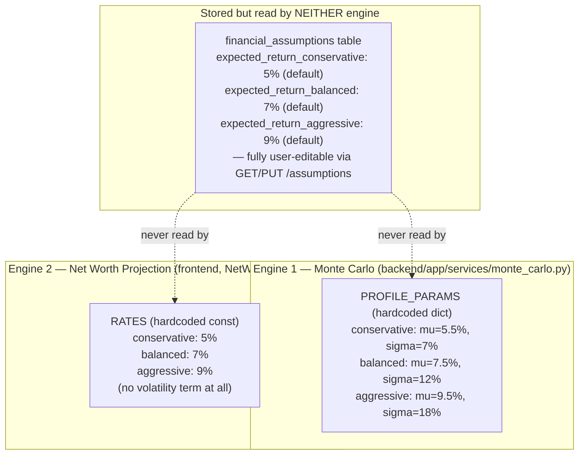

A user can open Settings, change their "balanced expected return" from 7% to 15% via `PUT /api/v1/assumptions`, and it will have **zero effect** on any Monte Carlo simulation or any net-worth projection they subsequently see. This is documented in full, with exact grep evidence, in §14 (Engineering Decisions) and §15 (Known Architectural Gaps) — it is stated here first because it is the fact every other section in this document should be read in light of.

---

## 2. Financial Mathematics

Every formula actually implemented in this codebase, traced to its exact source line.

### 2.1 Compound growth (single lump sum)

**Implemented in:** `EducationPlanningSection.tsx`, function `projectedCost`:
```ts
function projectedCost(currentCost: number, years: number, rate: number): number {
  return currentCost * Math.pow(1 + rate, years);
}
```
This is the textbook `FV = PV × (1 + r)^n` formula, annual compounding, applied to a single lump-sum "current cost" figure — no monthly contribution term, because this projection answers "what will this cost," not "will I have saved enough."

### 2.2 Future value of a growing series (compound interest + monthly contribution)

**Implemented in:** `NetWorthProjection.tsx`, function `project`:
```ts
function project(initial: number, monthly: number, years: number, rate: number): number {
  if (years === 0) return Math.round(initial);
  const mr = rate / 12;
  const months = years * 12;
  if (mr === 0) return Math.round(initial + monthly * months);
  return Math.round(
    initial * Math.pow(1 + mr, months) +
      monthly * (Math.pow(1 + mr, months) - 1) / mr,
  );
}
```
This is the closed-form **future value of an initial lump sum plus an ordinary annuity**:
```
FV = P₀(1 + i)^n + PMT × [(1 + i)^n − 1] / i
```
where `i = rate/12` (monthly rate) and `n = years × 12` (number of monthly periods). This is mathematically identical to the annuity-future-value formula derived from first principles (summing a geometric series of monthly contributions, each compounding for a different number of remaining months). The `mr === 0` branch is a correct, deliberate special-case: the formula above has `i` in a denominator, and division by zero must be avoided when the projected rate is exactly zero — handled by falling back to simple, non-compounding addition (`initial + monthly * months`).

### 2.3 Log-normal monthly return sampling (the Monte Carlo core)

**Implemented in:** `monte_carlo.py`, `run_simulation`:
```python
monthly_mu = mu_annual / 12
monthly_sigma = sigma_annual / (12 ** 0.5)
log_returns = rng.normal(
    loc=monthly_mu - 0.5 * monthly_sigma**2,
    scale=monthly_sigma,
    size=(num_simulations, months),
)
monthly_returns = np.exp(log_returns)
```
This samples each simulated month's *multiplicative* return from a **log-normal distribution** — the standard model for asset-price movements in continuous time (a Geometric Brownian Motion discretization). The `- 0.5 * monthly_sigma**2` term is the **Itô correction** (also called the volatility drag adjustment): without it, the *arithmetic mean* of the sampled multiplicative returns would be higher than the intended `mu_annual`, because `E[e^X] = e^(μ + σ²/2)` for a normally-distributed `X` — subtracting `0.5σ²` from the mean of the underlying normal distribution before exponentiating is exactly what cancels this bias out, so the simulation's realized average return matches the configured `mu` parameter.

**Annual-to-monthly conversion, verified:**
- Mean: `monthly_mu = mu_annual / 12` — a simple linear scaling (means are additive across independent periods).
- Volatility: `monthly_sigma = sigma_annual / sqrt(12)` — volatility scales with the **square root of time**, the standard result from the fact that variance (not standard deviation) is additive across independent periods: `Var(annual) = 12 × Var(monthly)`, so `σ_annual = σ_monthly × √12`, rearranged to solve for `σ_monthly`.

### 2.4 Portfolio compounding with contributions (Monte Carlo path evolution)

**Implemented in:** `monte_carlo.py`, `run_simulation`:
```python
portfolio = np.full(num_simulations, initial_amount, dtype=np.float64)
for t in range(months):
    portfolio = portfolio * monthly_returns[:, t] + monthly_contribution
```
This is a **vectorized** recurrence relation applied simultaneously across every simulated path (`num_simulations` independent portfolios, all advanced one month at a time in the same loop iteration via NumPy array broadcasting — not a nested Python loop per path). Each month, every path's current value is multiplied by that path's own sampled return for that specific month, then the fixed monthly contribution is added. This is mathematically equivalent to compounding each contribution from the month it was made through to the goal's end date, but expressed as a running recurrence rather than a closed-form annuity sum — necessary specifically because the return is *stochastic* (different every month, per path) rather than a single fixed `r`, so no closed-form annuity formula (§2.2) applies here.

### 2.5 Success rate and percentile extraction

```python
success_mask = terminal_values >= target_amount
success_rate = float(success_mask.mean() * 100)
p10, p25, p50, p75, p90 = np.percentile(terminal_values, [10, 25, 50, 75, 90])
```
`success_rate` is simply **the fraction of simulated paths whose final portfolio value meets or exceeds the target**, expressed as a percentage — the direct empirical estimate of "P(reach goal)" from the simulated distribution, not a closed-form probability computed from a formula. The five percentiles characterize the spread of the outcome distribution (P10 = a pessimistic outcome exceeded by 90% of paths; P50 = the median; P90 = an optimistic outcome exceeded by only 10% of paths).

### 2.6 Plan health score (weighted average)

**Implemented in:** `planning_service.py`, `compute_plan_health`:
```python
total_weight = sum(g.target_amount for g in goals)
weighted_sum = sum(g.probability * g.target_amount for g in goals)
raw = weighted_sum / total_weight
return min(100, max(0, round(raw)))
```
This is a **target-amount-weighted average** of every active goal's probability — a $500,000 retirement goal at 90% probability influences the score five times as much as a $100,000 travel goal at 90% probability. This is a deliberate design choice (a simple unweighted average would treat a trivial goal and a life-defining goal identically) — verified as intentional by the presence of dedicated tests (`test_weighted_by_target_amount`) confirming this exact behavior, not an accidental side effect of the formula's shape.

### 2.7 Savings rate

**Implemented in:** `planning_service.py`, `get_dashboard`:
```python
monthly_income = annual_income / 12
savings_rate = max(0.0, (monthly_income - monthly_expenses) / monthly_income * 100)
```
The standard personal-finance definition: `(income − expenses) / income × 100`, floored at zero (a negative savings rate — spending more than you earn — is clamped to 0% rather than displayed as a negative percentage; this is a display decision, not a claim that overspending doesn't happen, since `monthly_expenses` itself is never clamped).

### 2.8 Net worth

**Implemented in:** `planning_service.py`, `get_dashboard`:
```python
net_worth = total_assets - total_liabilities
```
The textbook definition, computed from the live sum of active `Asset.current_value` rows minus active `Liability.balance` rows — no adjustment for asset illiquidity, tax basis, or depreciation is applied anywhere in this calculation.

---

## 3. Goal Calculations

A `Goal` (`backend/app/models/goal.py`) is the central planning unit. Every numeric field a user can set is bounded at the schema layer (`backend/app/schemas/goal.py`):

```python
_MAX_AMOUNT = 1_000_000_000.0        # target_amount, current_amount
_MAX_MONTHLY_AMOUNT = 10_000_000.0    # monthly_contribution
```
These bounds exist, per the schema file's own comment, **specifically to keep the Monte Carlo engine's compounding loop away from `inf`/`NaN` territory** — a correctness safeguard, not just an anti-typo measure.

### 3.1 Years-to-goal calculation — computed twice, two different ways

**Backend (`planning_service.calculate_goal_probability`, the value that actually drives the simulation):**
```python
years_to_goal = max(0.1, (goal.target_date - date.today()).days / 365.25)
```
Exact day-count divided by the average Gregorian year length (365.25 days, accounting for leap years), floored at `0.1` years (about 36 days) so a goal with a target date in the past or today never produces a zero or negative horizon that would break the simulation's month count.

**Frontend (`GoalSimPanel.tsx`, `goalToEditForm`, purely for display/editing):**
```ts
const years = Math.max(1, new Date(g.targetDate).getFullYear() - new Date().getFullYear());
```
A **calendar-year subtraction** — floored at 1 whole year, and ignoring month/day entirely. **Verified inconsistency:** a goal created on December 1st with a target date of January 15th the following year is "1.13 years" by the backend's day-count math but "1 year" by this frontend calendar-year math — a minor, real discrepancy between what the edit form displays and what the backend actually simulates against, not large enough to be a correctness bug for the Monte Carlo result itself (the backend's own value is always what's actually simulated), but real enough to note here as a verified fact rather than gloss over.

### 3.2 Custom Inflation Rate — deliberately orthogonal to everything else

`goals.custom_inflation_rate` (nullable, `[0, 0.5]` bound) exists **solely** to feed the frontend's `EducationPlanningSection` projection (§2.1). It is explicitly and permanently excluded from `planning_service.CALCULATION_CONTEXT_FIELDS` (§7) — confirmed by 8 dedicated integration tests in `backend/tests/test_goal_inflation.py`, including a test that PATCHes this field three times in a row and asserts the goal's `probability` never once changes (`test_repeated_inflation_only_updates_never_drift_probability`).

---

## 4. Inflation Engine

**There is no backend inflation engine.** This is stated plainly because it would be easy to assume otherwise given `financial_assumptions.inflation_rate` exists as a stored, user-editable field (default `0.03`) with a full CRUD API (`routers/assumptions.py`). Verified by grep: **zero backend service reads `FinancialAssumptions.inflation_rate` in any calculation.** The only place any inflation rate is actually used in a formula is:

1. **`EducationPlanningSection.tsx`** — reads `api.getAssumptions().inflation_rate` as the *default* rate (`globalRate`), overridden per-goal by `goal.customInflationRate` if the user has set one (`effectiveRate = goal.customInflationRate ?? globalRate`), then applies the compound-growth formula (§2.1) entirely client-side.

This is the **one** place `financial_assumptions.inflation_rate` is actually consumed by a calculation anywhere in this codebase — every other subsystem (Monte Carlo, Net Worth Projection) either has its own hardcoded rate or has no inflation adjustment at all.

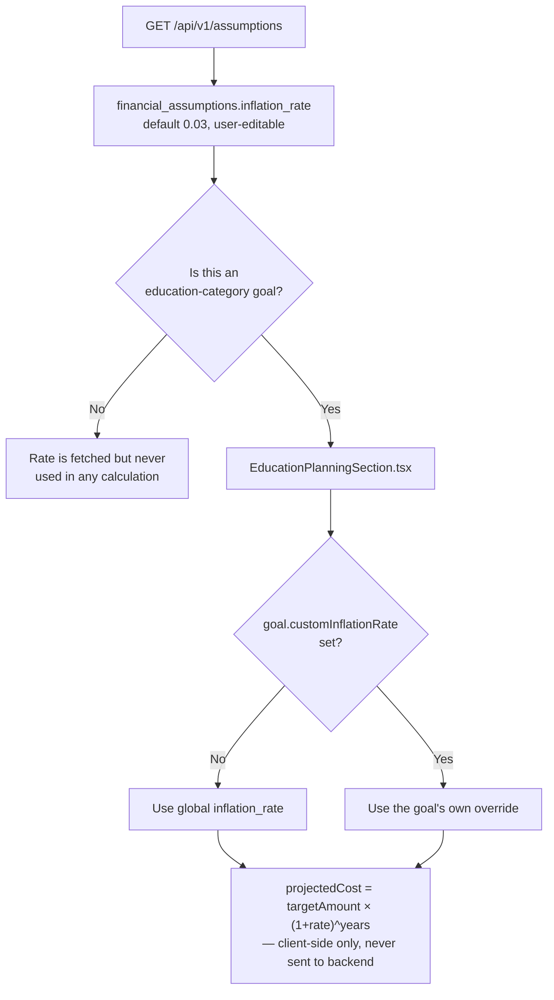

**Not implemented in this project:** there is no inflation adjustment anywhere in the Monte Carlo engine itself — `run_simulation`'s `mu`/`sigma` parameters in `PROFILE_PARAMS` are **nominal** (not inflation-adjusted) returns, and the engine never subtracts an inflation rate to produce a "real" probability. A goal's Monte Carlo probability is a probability of reaching a *nominal* dollar target, with no adjustment for the fact that a dollar in 20 years buys less than a dollar today.

---

## 5. Retirement Calculations

**There is no dedicated retirement calculation engine.** A "retirement goal" in this codebase is an ordinary `Goal` row with `category = "retirement"` — it receives no special treatment in the Monte Carlo engine, the Optimizer, or any service function, beyond two narrow places:

1. **`planning_service.get_dashboard()`:**
   ```python
   retirement_goals = [g for g in active_goals if g.category == "retirement"]
   projected_retirement = retirement_goals[0].target_amount if retirement_goals else 0.0
   ```
   This is **not a projection** in any calculated sense — it is a direct read of the *first* retirement goal's already-user-entered `target_amount`. No compounding, no decumulation modeling, no Monte Carlo re-run happens here.

2. **`family_dashboard_service._retirement_card()`:** reads the first retirement goal's already-stored `probability` and `on_track` fields — again, a pass-through read, not a new calculation.

**Verified, zero-consumer fields confirmed by grep — these exist in the schema but are never read by any calculation anywhere in this codebase:**
- `financial_assumptions.retirement_age` (default 65)
- `financial_assumptions.social_security_monthly` (default 0.0)

**Not implemented in this project:**
- No safe-withdrawal-rate (e.g. "4% rule") calculation exists anywhere.
- No decumulation-phase (post-retirement spending drawdown) simulation exists — the Monte Carlo engine only ever models an *accumulation* phase (contributions flowing in), never a withdrawal phase.
- No Social Security benefit calculation or integration exists, despite the dedicated field.
- No retirement-age-driven horizon calculation exists — a retirement goal's `years_to_goal` is computed identically to every other goal category, from its own `target_date`, never derived from the user's stored `retirement_age` minus their current age.

---

## 6. Monte Carlo Simulation

The single most substantial calculation in this codebase. Full source: `backend/app/services/monte_carlo.py` (191 lines).

### 6.1 Business purpose
Answer, with an actual statistical grounding rather than a single deterministic guess: "given how much I've saved, how much I'm adding monthly, my time horizon, and my risk tolerance, what is the probability I actually reach my target?" — directly replacing the single-number, false-precision answer a naive `FV = PV(1+r)^n` calculation would give.

### 6.2 Financial theory
Models each risk profile's monthly return as an independent draw from a **log-normal distribution** — the standard continuous-time model for asset prices (the discretized form of Geometric Brownian Motion used throughout quantitative finance for option pricing and portfolio simulation). This is a real, if simplified, model: returns are assumed independent month-to-month (no autocorrelation, no regime-switching, no fat tails/skewness beyond what log-normality itself produces), and volatility/mean are constant for the entire simulated horizon (no term structure).

### 6.3 The formula, end to end

```
For each of `num_simulations` independent paths:
  For each month t = 1 .. months:
    log_return[t] ~ Normal(μ_m − ½σ_m², σ_m)      (Itô-corrected monthly log-return)
    return[t] = exp(log_return[t])                (convert to a multiplicative factor)
    portfolio[t] = portfolio[t-1] × return[t] + contribution

terminal_value = portfolio[months]
success_rate = (fraction of paths where terminal_value ≥ target_amount) × 100
percentiles = P10, P25, P50, P75, P90 of the terminal_value distribution across all paths
```
where `μ_m = μ_annual / 12` and `σ_m = σ_annual / √12`.

### 6.4 Variables

| Variable | Meaning | Source |
|---|---|---|
| `initial_amount` | Current savings toward the goal | `goal.current_amount` |
| `monthly_contribution` | Fixed monthly addition | `goal.monthly_contribution` |
| `years_to_goal` | Investment horizon (decimal years) | Computed, `(target_date − today).days / 365.25` |
| `risk_profile` | One of `conservative`/`balanced`/`aggressive` | `goal.risk_profile` |
| `target_amount` | Dollar goal | `goal.target_amount` |
| `num_simulations` | Path count — 10,000 (full) or 2,000 (quick) | Caller-specified |
| `seed` | Optional RNG seed | `settings.monte_carlo_seed` (env-configured, default `None`) |
| `mu_annual`, `sigma_annual` | Risk-profile-specific assumed return/volatility | `PROFILE_PARAMS` (hardcoded, §8) |

### 6.5 Inputs / Outputs (as a pure function)

**Inputs:** the 5 goal-derived values above plus `num_simulations`/`seed`.
**Outputs (`SimulationResult` dataclass):** `success_rate` (float, 0–100), `p10`/`p25`/`p50`/`p75`/`p90` (dollar percentiles), `distribution` (a 50-bin histogram, each bin's fraction of total paths — used only by the full `/simulate` endpoint's chart, not by the quick-probability path), `terminal_values` (the raw NumPy array of every path's final value, not serialized to the API response).

### 6.6 Two entry points, one engine

```python
def run_simulation(..., num_simulations: int = 10_000, seed=None) -> SimulationResult: ...
def quick_probability(..., seed=None) -> float:
    """Fast probability estimate using 2,000 simulations for inline updates."""
    return run_simulation(..., num_simulations=2_000, seed=seed).success_rate
```
`quick_probability` is not a different algorithm — it is the exact same `run_simulation` function, called with a smaller path count (2,000 vs. 10,000) purely for speed, since it runs synchronously inline on every goal create/update. The full 10,000-path version is reserved for the explicit, user-triggered `/simulate` endpoint, which also returns the percentile/distribution detail the quick path discards.

### 6.7 Async offloading

```python
async def run_simulation_async(...) -> SimulationResult:
    fn = partial(run_simulation, ...)
    return await asyncio.get_running_loop().run_in_executor(None, fn)
```
Both `run_simulation_async` and `quick_probability_async` wrap their synchronous counterpart in the default thread-pool executor — the CPU-bound NumPy work never blocks the async event loop from serving other requests concurrently.

### 6.8 Edge cases, verified against the code and the test suite

- **`months = max(1, round(years_to_goal * 12))`** — a horizon under half a month rounds up to a 1-month simulation, never zero months (which would make the whole path-evolution loop a no-op).
- **Unknown `risk_profile` string:** `PROFILE_PARAMS.get(risk_profile, PROFILE_PARAMS["balanced"])` — silently falls back to "balanced" parameters rather than raising an error. This is a real, verified behavior: a typo'd or legacy risk-profile value never crashes the simulation, it just silently uses balanced assumptions.
- **Reproducibility:** `test_seed_produces_reproducible_results` confirms identical `success_rate`/`p50` for two runs with the same seed — the RNG is `np.random.default_rng(seed)`, a fresh generator per call, not a shared/mutated global state.
- **Monotonicity, verified by test, not just assumed:** higher contribution → equal-or-higher success rate (`test_more_contribution_increases_success_rate`); longer horizon → equal-or-higher success rate (`test_longer_horizon_increases_success_rate`); higher risk → wider P10–P90 spread (`test_higher_risk_produces_wider_distribution`).
- **Extreme inputs, verified by test:** a target far below what's achievable with huge contributions approaches (but is not asserted to reach) 100% (`test_certain_success_high_contribution`, asserts `>95%`); an essentially impossible target with minimal savings approaches near-0% (`test_near_zero_success_impossible_goal`, asserts `<5%`) — **note precisely:** the test suite does not assert exact 0%/100% boundary behavior, only "very high"/"very low," which is the correct claim to make about a Monte Carlo estimate (it can never be exactly 0 or 100 with a finite path count in the way a closed-form probability could be).
- **No golden/hand-calculated numeric test exists** — every test in `test_monte_carlo.py` is a property/invariant test (ordering, monotonicity, reproducibility, range), not an assertion against a specific, independently-computed expected value. This is a verified fact about test coverage, not a criticism — a stochastic simulation's exact output is not the kind of thing a golden-value test can meaningfully pin down run-to-run without seeding, and even with a seed, pinning to one exact NumPy-version-dependent float would be brittle.

### 6.9 Request lifecycle (full endpoint, `POST /api/v1/simulate`)

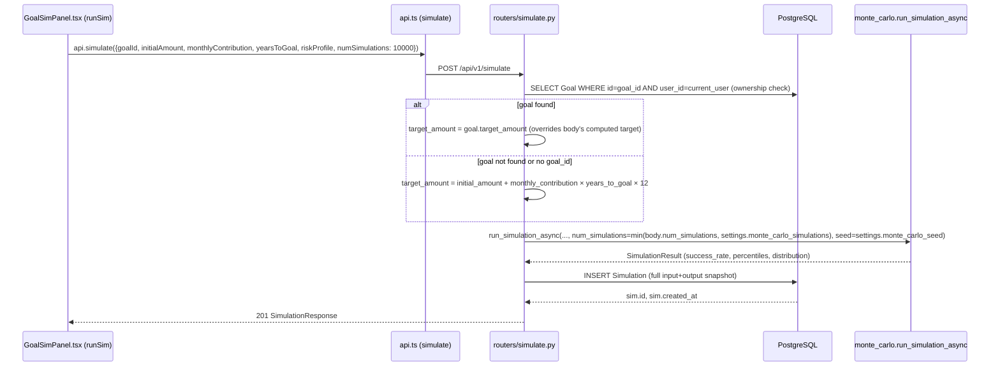

**Verified, load-bearing detail:** this endpoint **persists** a `Simulation` row (append-only, timestamped, full input snapshot) but **never writes back to the `Goal` row itself** — running an explicit simulation from the Goal panel does not change `goal.probability`/`goal.on_track`; only `calculate_goal_probability` (called from goal create/update) does that. A user can run this simulation ten times in a row with different `numSimulations` values and their goal's stored probability/on-track flag never moves.

---

## 7. Calculation Context

**Definition (verbatim from `planning_service.py`):**
```python
CALCULATION_CONTEXT_FIELDS = frozenset(
    {"current_amount", "monthly_contribution", "target_date", "risk_profile", "target_amount"}
)
```

This is **the single source of truth** for "which goal fields, if changed, must trigger a fresh Monte Carlo run." It is consumed in exactly one place, `routers/goals.py`'s `update_goal`:
```python
if CALCULATION_CONTEXT_FIELDS & updates.keys():
    await calculate_goal_probability(goal)
```
A set-intersection check — if *any* of the fields being patched are in the Calculation Context, recalculation fires; otherwise it does not.

**Fields deliberately excluded, verified from the schema and confirmed by dedicated tests:**
- `name`, `category`, `priority` — cosmetic/organizational, no financial bearing.
- `custom_inflation_rate` — feeds a completely separate, frontend-only projection (§4); explicitly and permanently excluded so a user experimenting with different inflation assumptions for the education-cost display never sees their Monte Carlo odds flicker as a side effect.

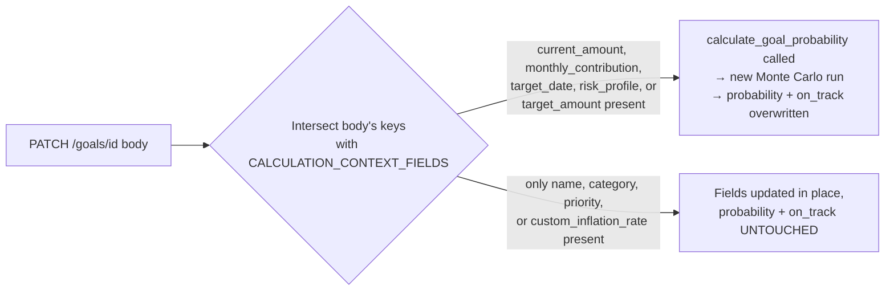

**Why a frozenset, not a per-field flag on the model or the schema:** a single, named collection means the recalculation *decision* lives in exactly one place (`routers/goals.py`'s one `if` statement), referencing one authoritative list (`planning_service.py`'s one `frozenset`) — a new Calculation Context field is added by editing one line, not by hunting down every place a "should I recalculate?" check might have been duplicated.

---

## 8. Risk Profiles

Three literal values (`conservative`, `balanced`, `aggressive`) appear in **four independent places** in this codebase, with **four different sets of numbers** — verified precisely:

| Location | conservative | balanced | aggressive | Has volatility? |
|---|---|---|---|---|
| `monte_carlo.PROFILE_PARAMS` (backend, actually drives simulations) | μ=5.5%, σ=7% | μ=7.5%, σ=12% | μ=9.5%, σ=18% | Yes |
| `financial_assumptions` table defaults (backend, user-editable, **never read by any calculation**) | 5% | 7% | 9% | No |
| `NetWorthProjection.tsx` `RATES` (frontend, hardcoded) | 5% | 7% | 9% | No |
| `GoalSimPanel.tsx` `RISK_OPTIONS` labels (frontend, cosmetic only) | "30/70" | "60/40" | "90/10" | N/A — display labels for an *implied* asset allocation split, not used in any formula anywhere |

**Verified, exact fact:** `NetWorthProjection.tsx`'s hardcoded `RATES` (5%/7%/9%) happen to numerically match `financial_assumptions`' *default* values (also 5%/7%/9%) — but this is **coincidence, not integration**: `NetWorthProjection.tsx` never calls `api.getAssumptions()`, so a user who has changed their stored assumptions away from the defaults will see a Net Worth Projection chart that silently continues using the original 5/7/9 hardcoded figures, disagreeing with whatever they've actually configured.

**The "30/70"/"60/40"/"90/10" labels are purely cosmetic** — verified by grep: no service or component anywhere parses these strings or uses them to derive an actual equity/debt split for any calculation. They exist only as a human-readable descriptor next to the risk-profile selector.

**Risk-profile ordering, where it matters for a real calculation:** `optimizer.py`'s `RISK_LADDER = ["conservative", "balanced", "aggressive"]` — an ordered list used by `_clamp_risk()` to determine whether "shift one level higher" is a valid suggestion (returns `None` if already at `"aggressive"`, preventing the optimizer from ever suggesting a fourth, nonexistent risk tier — verified by `test_aggressive_profile_cannot_go_higher`).

---

## 9. Goal Probability Engine

*(The composition of §6's Monte Carlo mechanics with §7's Calculation Context trigger — this is "the goal probability engine" as a distinct architectural concept.)*

**The engine's entire contract is one function:** `planning_service.calculate_goal_probability(goal: Goal) -> None`.

```python
async def calculate_goal_probability(goal: Goal) -> None:
    years_to_goal = max(0.1, (goal.target_date - date.today()).days / 365.25)
    probability = await quick_probability_async(
        initial_amount=goal.current_amount,
        monthly_contribution=goal.monthly_contribution,
        years_to_goal=years_to_goal,
        risk_profile=goal.risk_profile,
        target_amount=goal.target_amount,
        seed=settings.monte_carlo_seed,
    )
    goal.probability = round(probability, 1)
    goal.on_track = probability >= 70.0
```

**The 70% threshold is a single, hardcoded magic number**, defining the entire "on track vs. at risk" distinction used across the Dashboard, Family Dashboard, Notification Center, and every goal card in the UI. It is not user-configurable, not stored in `financial_assumptions`, and not derived from any calculation — it is a literal `70.0` written once in this one function.

**Callers, exhaustively verified by grep — there are exactly two:**
1. `routers/goals.py`'s `create_goal` — unconditionally, on every new goal.
2. `routers/goals.py`'s `update_goal` — conditionally, only when the Calculation Context intersection (§7) is non-empty.

**No other code path calls this function.** Dashboard, Reports, the AI Copilot, and the Family Dashboard all read `goal.probability`/`goal.on_track` as already-stored values — confirmed by the explicit "Read-only fetch — never mutates or persists a probability" comment on `planning_service._active_goals()`, and by the complete absence of any `calculate_goal_probability` call in `family_dashboard_service.py`, `family_recommendations_service.py`, or `routers/dashboard.py`.

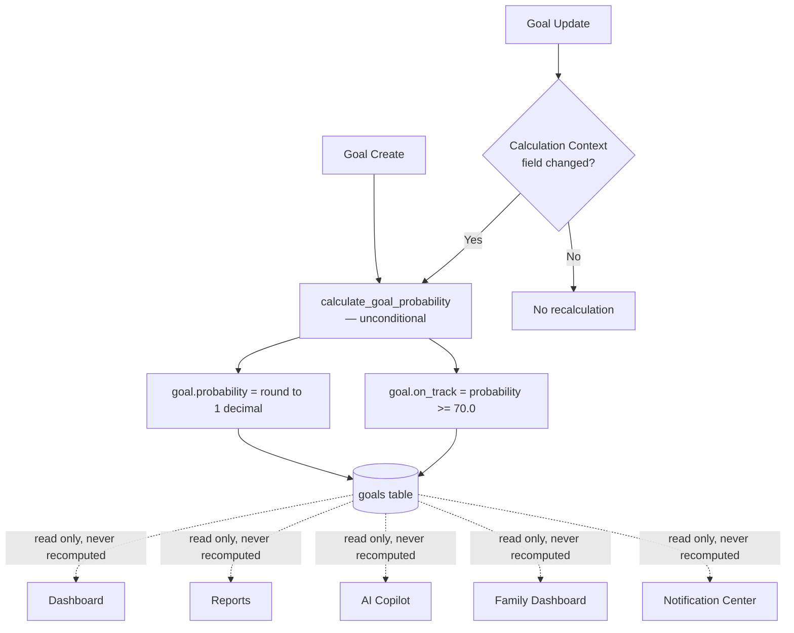

**Tests confirming this exact contract** (`test_planning_service.py::TestCalculateGoalProbability`): the function correctly rounds to 1 decimal (`82.345 → 82.3`), correctly derives `on_track` at both sides of 70% (`45.0 → False`), correctly forwards the configured seed (verified via `monkeypatch` capturing the kwargs actually passed to `quick_probability_async`), and `_active_goals` correctly excludes both another user's goals and the caller's own inactive (soft-deleted) goals.

---

## 10. Dashboard Calculation Lifecycle

**The single most important engineering decision in this entire codebase, per its own documentation trail (`ArchitectureDecisionRecord.md`, `MonteCarloConsistencyReport.md`), and independently re-verified here by reading `planning_service.get_dashboard()` line by line:**

The Dashboard performs **zero Monte Carlo computation**. Every figure it returns is either a direct database read, a simple arithmetic aggregation (§2.6–2.8), or a pass-through of an already-persisted `Goal.probability`/`Goal.on_track` value.

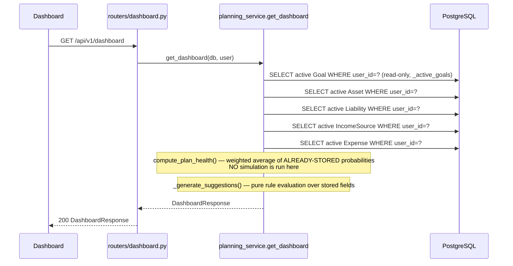

**Why this is a lifecycle, not just a function:** the *decision* about when a goal's probability changes was deliberately moved entirely out of the read path (Dashboard, Reports) and concentrated at the two write paths named in §9. This closed a real, documented defect (referenced across this project's own `ArchitectureDecisionRecord.md`): before this fix, `get_dashboard()` called an internal `refresh_goal_probabilities()` that re-ran an **unseeded** simulation on every dashboard view — meaning the *same goal*, with *no user action taken*, could show a different probability (and a boundary-case goal's `on_track` flag could silently flip) purely depending on which screen was opened last, with no audit trail explaining why. The current code has no such function at all — confirmed by grep, `refresh_goal_probabilities` does not exist anywhere in the current codebase.

**`_generate_suggestions()` — a rule-based function, not a calculation, worth distinguishing precisely:**
```python
if goal.probability < 50:   → "warning" severity, "Boost" suggestion
elif goal.probability < 70:  → "warning" severity, "needs attention" suggestion
if not any(g.category == "retirement" for g in goals): → "no_retirement" info suggestion
if not any(g.category == "emergency" for g in goals):  → "no_emergency" info suggestion
if 0 < savings_rate < 15: → "low_savings_rate" info suggestion
```
capped at 5 total (`suggestions[:5]`). This is threshold-based rule evaluation over already-computed values (`goal.probability`, `savings_rate`) — it originates no new financial figure, and every threshold (50, 70, 15) is a hardcoded literal in this one function, verified by 12 dedicated tests in `test_planning_service.py::TestGenerateSuggestions`.

---

## 11. Recommendation Calculation Dependencies

Two "recommendation" surfaces exist in this codebase, and **neither performs original financial calculation** — both are read-and-reformat layers over calculations that live elsewhere.

### 11.1 Family Insurance Recommendation (the one place a real tax figure is computed)

**Source:** `family_insurance_service.compute_insurance_recommendation()`.

**The only genuine "calculation" in the entire recommendation layer:**
```python
async def _base_80d_limit(db) -> float | None:
    section = (await db.execute(select(TaxSection).where(TaxSection.section_number == "80D"))).scalars().first()
    return section.limit_amount if section else None
```
The base ₹25,000 (Section 80D health-insurance-premium deduction) figure is **read from the seeded, versioned `tax_sections` table** — never a hardcoded literal in the service code itself. If this seed data is absent, the function returns `None` and the caller **must not fabricate a fallback figure** (verified: `compute_insurance_recommendation` returns `None` immediately if `base_limit is None`).

**The one arithmetic operation:**
```python
is_any_senior = any(age >= _SENIOR_CITIZEN_AGE for age in ages_known)  # _SENIOR_CITIZEN_AGE = 60
parent_limit = base_limit * 2 if is_any_senior else base_limit
```
A simple doubling: if any uninsured parent is 60 or older, the deduction limit doubles (₹25,000 → ₹50,000) — verified by `test_senior_parent_doubles_the_deduction_limit`. Age itself is computed by `scheme_eligibility_service.age_years()` (§11.2), reused here rather than re-derived — one age-calculation function serving both the Schemes and Insurance domains.

**Confidence score — a two-tier, not continuous, value:**
```python
confidence = 1.0 if not any_age_unknown else 0.7
```
Exactly two possible values, never a computed/interpolated confidence — verified by `test_missing_date_of_birth_never_fabricates_senior_status` asserting `confidence_score < 1.0` (not a specific intermediate number) when a parent's date of birth is unknown.

### 11.2 Government Scheme Eligibility (age math, no financial figures at all)

**Source:** `scheme_eligibility_service.py`.

```python
def age_years(dob: date, as_of: date) -> int:
    return as_of.year - dob.year - ((as_of.month, as_of.day) < (dob.month, dob.day))
```
**Exact completed-years age** — the standard calendar idiom (not a `days/365.25` approximation), chosen specifically to be correct at an exact birthday boundary (verified by two precise boundary tests: `test_exact_10th_birthday_is_not_eligible` and `test_day_before_10th_birthday_is_still_eligible`, pinning the SSY 10-year-old ceiling to the literal day).

**Rule evaluation is not a formula — it's a threshold comparison per rule type:**
```python
if rule_type == "max_age" and age >= threshold:        → not_eligible
if rule_type == "min_age" and age < threshold:
    if threshold - age <= 5:                            → potentially_eligible
    else:                                                → not_eligible
if rule_type == "gender" and dependent.gender != rule.value: → not_eligible
```
The `5`-year "potentially eligible" window (`_POTENTIALLY_ELIGIBLE_WINDOW_YEARS`) is a **product decision, not a financial/policy fact** (per the module's own comment) — it does not apply to maximum-age ceilings (SSY) at all, since "will become eligible by getting older" has no meaning for a scheme a child ages *out* of.

### 11.3 Family Recommendations Aggregation — verified zero-computation

**Source:** `family_recommendations_service.py`. Its own module docstring states it directly: **"This module performs zero eligibility math and zero deduction-figure computation of its own."** Verified by reading every line of `_insurance_recommendations()` and `_scheme_recommendations()` — both functions call into §11.1/§11.2's services and reformat the already-computed `why`/`confidence_score`/etc. fields into a shared `FamilyRecommendation` envelope. The only original logic in this module is **conflict detection**:
```python
groups: dict[tuple[subject, reference_code], set[source]] = {...}
conflicts = [g for g in groups if len(g.sources) > 1]
```
A pure set-membership grouping operation (do two different recommendation sources name the same subject *and* the same tax `reference_code`?) — not a financial calculation, a data-structure operation over already-computed labels.

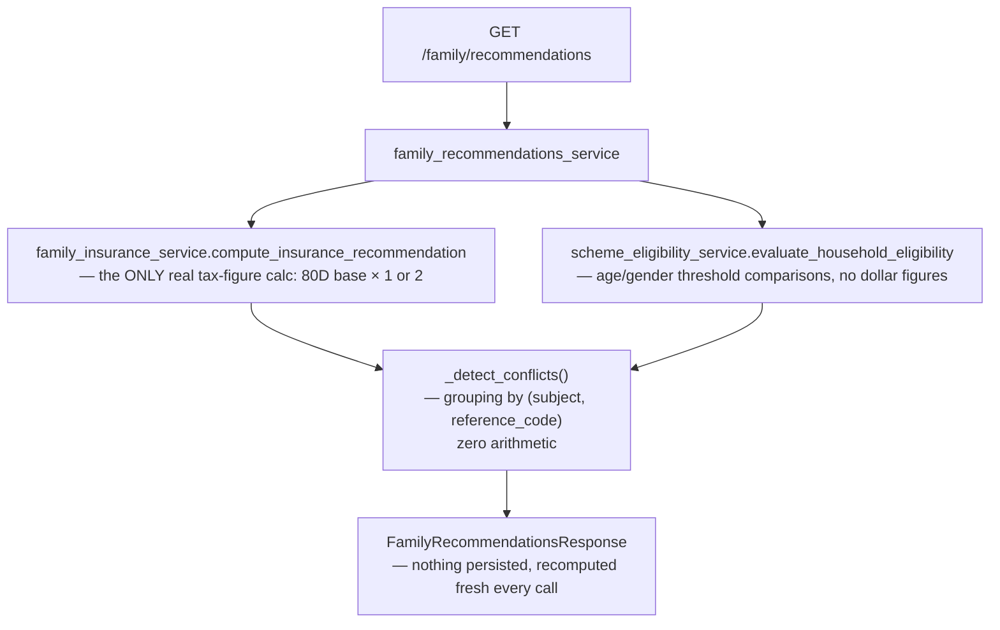

### 11.4 Notification Center — reuses, never recomputes

`notification_service.py`'s five sources (§ traced in Volume 1) read `Goal.on_track`, `Goal.current_amount >= Goal.target_amount`, `compute_insurance_recommendation()`, and `evaluate_household_eligibility()` — **verbatim, the exact same function calls the Insurance/Schemes pages themselves make.** Zero new calculation logic exists in the notification layer; its only original computation is a deterministic `uuid5` hash used as a stable identity key for read/dismiss tracking, which is an identity operation, not a financial one.

---

## 12. Sequence Diagrams

*(Consolidated here per the requested chapter structure; flows already diagrammed in their own sections above are cross-referenced rather than repeated.)*

- Goal creation → Monte Carlo trigger: **§9** (Goal Probability Engine flowchart) and Volume 1 §7.2.
- Dashboard load (read-only): **§10**.
- Full `/simulate` endpoint: **§6.9**.
- Family Recommendations aggregation: **§11.3**.

### 12.1 Optimizer suggestion generation (not diagrammed elsewhere)

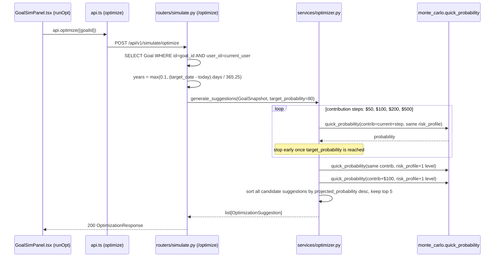

**Verified, exact detail:** the optimizer's own `_prob()` closure calls `quick_probability` (2,000 paths, §6.6) — **not** the full 10,000-path `run_simulation` — for every candidate it evaluates, since it may need to call it up to 6 times per request (4 contribution steps + 1 risk shift + 1 combination) and speed matters more than precision for a ranking comparison between candidates.

### 12.2 Education cost projection (frontend-only, not touching the backend calculation layer)

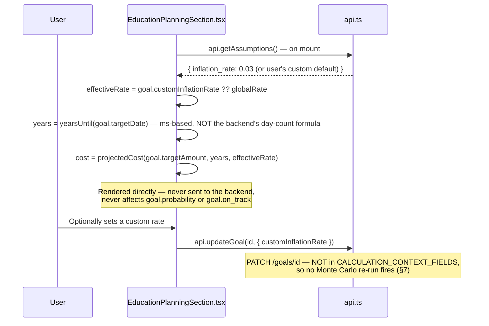

---

## 13. Flowcharts

### 13.1 Every calculation entry point in the system, in one diagram

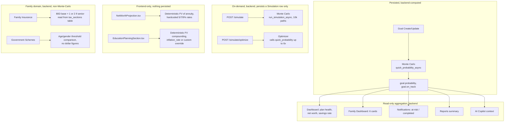

### 13.2 Where `financial_assumptions` data actually goes (verified — mostly nowhere)

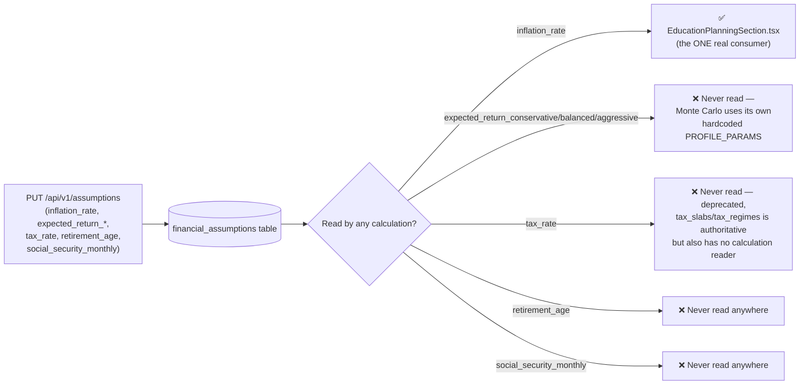

---

## 14. Engineering Decisions

*(The reasoning behind each verified calculation-architecture choice — not a restatement of the mechanism.)*

### 14.1 Why the Calculation Context is a frozenset, checked once, in one router

Concentrating the "should this trigger a recalculation?" decision into a single set-intersection check, referencing one named collection, means there is exactly one place in the entire codebase that can get this decision wrong — and exactly one place to fix it if a new field's classification ever needs to change. The alternative (each field having its own ad-hoc check scattered across the update logic) is precisely the kind of duplication `docs/ENGINEERING_CONSTITUTION.md` Rule 7 warns against, and precisely the kind of thing that produced the original Dashboard-mutation bug this project's own `ArchitectureDecisionRecord.md` documents (recalculation logic existing in more than one place, disagreeing with itself).

### 14.2 Why `quick_probability` uses 2,000 paths and not 10,000

`quick_probability`/`quick_probability_async` exist specifically because goal create/update runs *inline*, synchronously, within an HTTP request-response cycle — a user creating a goal should not wait for a 10,000-path simulation before getting a response. 2,000 paths is a deliberate speed/precision trade-off for a value (`goal.probability`) that gets *shown* to the user but is not the final word on precision — a user who wants the fuller picture can explicitly trigger the full 10,000-path `/simulate` endpoint (§6.9), which persists its own richer `Simulation` record with percentiles and a distribution histogram that the quick path never computes.

### 14.3 Why the Itô correction term exists in the log-return sampling

Without `- 0.5 * monthly_sigma**2` in the mean of the sampled normal distribution, the *arithmetic* average of the resulting log-normal multiplicative returns would systematically exceed the intended `mu_annual` — a well-known bias in naive log-normal return modeling. Including this correction means the configured `mu` parameter is actually the expected (mean) return the simulation produces, not merely the median — a real, non-obvious detail that separates a mathematically-correct log-normal simulation from a naive one that silently overstates returns.

### 14.4 Why the Optimizer stops early once a target probability is reached

`generate_suggestions`'s contribution-step loop (`for step in (50, 100, 200, 500)`) breaks as soon as a candidate reaches `target_probability` — this is a deliberate "minimum viable increase" design, per the module's own docstring: the user is shown the smallest sufficient change, not every possible change up to the maximum allowed increase, respecting the product principle that a recommendation should be the least disruptive one that actually solves the problem.

### 14.5 Why `custom_inflation_rate` was built as a goal-level override, not a global-only setting

The frontend component's own comment states the reasoning directly: tuition/education costs have historically run hotter than general inflation, so a single global rate applied uniformly to every goal (including an education goal) would systematically understate what a family actually needs to save. A nullable, goal-scoped override — defaulting to the global rate when unset — lets a user apply a more accurate, education-specific assumption to exactly the goals where it matters, without having to change their global assumption (which would then incorrectly apply to every other goal category too).

### 14.6 Why the 70% on-track threshold is a single hardcoded literal, not a stored setting

This appears to be a genuine, unresolved simplification rather than a deliberate, documented design choice — no comment, test, or schema field in this codebase suggests 70% is meant to be user- or persona-configurable. It is simply the number `70.0` written once in `calculate_goal_probability`, and every downstream consumer (Dashboard alerts, Notification "at risk" trigger, Family Dashboard retirement card, goal card coloring in the UI) inherits this exact same, non-configurable boundary.

---

## 15. Known Architectural Gaps

*(Only gaps directly verified in this codebase by reading the code and confirming absence via grep — nothing inferred or assumed.)*

1. **`financial_assumptions.expected_return_conservative/balanced/aggressive` are entirely disconnected from the Monte Carlo engine.** `monte_carlo.PROFILE_PARAMS` is a hardcoded module-level constant; zero code path reads the stored, user-editable assumption values into any simulation. A user changing their assumptions via `PUT /assumptions` has zero effect on any probability they subsequently see.
2. **`NetWorthProjection.tsx`'s hardcoded 5%/7%/9% rates are also disconnected from `financial_assumptions`**, and additionally have no volatility term at all (a purely deterministic projection, no Monte Carlo, no confidence range) — presented alongside a genuinely probabilistic Monte Carlo result elsewhere on the same Dashboard, with no visual distinction in the UI code that they represent fundamentally different kinds of claims (one certain-looking line per scenario vs. a percentage-with-uncertainty).
3. **`financial_assumptions.tax_rate`, `.retirement_age`, and `.social_security_monthly` have zero calculation consumers anywhere in the codebase** — confirmed by grep across every service file.
4. **No dedicated retirement decumulation/withdrawal-phase calculation exists.** A retirement goal is Monte-Carlo-simulated identically to every other goal category — as a pure accumulation-phase target, with no modeling of drawing the corpus down after the target date.
5. **`ANNUAL_INFLATION = 0.03` in `monte_carlo.py` is declared and never referenced anywhere** — confirmed dead code by grep.
6. **The `years_to_goal` calculation is implemented twice, inconsistently** — the backend's day-count formula (`(target_date - today).days / 365.25`, used to actually drive the simulation) and the frontend's calendar-year-subtraction formula (`getFullYear() - getFullYear()`, used only for the edit form's display) can disagree by up to nearly a full year depending on where in the calendar year the goal was created relative to its target date.
7. **`EducationPlanningSection.tsx`'s inflation projection uses its own `yearsUntil()` (a millisecond-based calculation), a third distinct implementation of "years until a date"** alongside the two named in #6.
8. **No golden/hand-verified numeric test exists for the Monte Carlo engine** — every existing test is a property/invariant assertion (ordering, monotonicity, reproducibility under a fixed seed), never an assertion against an independently-computed expected value.
9. **The 70% on-track threshold, the 5-year "potentially eligible" scheme window, and the two-tier (1.0/0.7) insurance confidence score are all single hardcoded literals** with no configuration surface, no persona-specific variation, and no derivation from any other stored value.

---

## 16. Verified Findings

*(A condensed, evidence-linked summary of this document's most consequential discoveries — each traceable to a specific grep or test result performed during this pass.)*

| Finding | Evidence |
|---|---|
| Monte Carlo's `PROFILE_PARAMS` is fully independent of `financial_assumptions` | `grep -rn "expected_return_conservative\|expected_return_balanced\|expected_return_aggressive" backend/app/` returns matches only in `models/assumptions.py`, `schemas/assumptions.py`, `routers/assumptions.py` — zero matches in any `services/` file |
| `ANNUAL_INFLATION` is dead code | `grep -rn "ANNUAL_INFLATION" backend/app/` returns exactly one match — its own declaration |
| `retirement_age`/`social_security_monthly` have zero consumers | `grep -rn "social_security_monthly\|retirement_age" backend/app/` outside the assumptions CRUD trio returns no matches |
| `custom_inflation_rate` never perturbs Monte Carlo probability | 5 dedicated integration tests in `test_goal_inflation.py`, including one that PATCHes the rate 3 times consecutively and asserts `probability` never changes |
| Age math is exact-calendar, boundary-tested | `test_exact_10th_birthday_is_not_eligible` and `test_day_before_10th_birthday_is_still_eligible` in `test_scheme_eligibility_service.py` pin the SSY ceiling to the literal day |
| The 80D senior-citizen doubling and confidence-score behavior are both test-verified | `test_senior_parent_doubles_the_deduction_limit` (asserts exactly `50_000.0`) and `test_missing_date_of_birth_never_fabricates_senior_status` (asserts `confidence_score < 1.0`) in `test_family_insurance.py` |
| Dashboard performs zero Monte Carlo computation | Direct read of `planning_service.get_dashboard()`/`_active_goals()` — no call to `calculate_goal_probability` or `run_simulation` anywhere in the function body or its call graph |
| `calculate_goal_probability` has exactly two callers | Grep confirms only `routers/goals.py`'s `create_goal` and `update_goal` call this function anywhere in the codebase |
| Optimizer suggestions use the fast (2,000-path), not full (10,000-path), simulation | `optimizer.py`'s `_prob()` closure calls `quote_probability` (`monte_carlo.quick_probability`), never `run_simulation`/`run_simulation_async` |
| No golden-value Monte Carlo test exists | Full read of `test_monte_carlo.py` (84 lines, 10 tests) — every assertion is a range check, ordering check, or equality-under-fixed-seed check, never a comparison to an independently hand-calculated number |

---

**End of Volume 2.** This document reflects the calculation logic as directly verified in the repository on 2026-07-09. Every hardcoded rate, threshold, and disconnected field named here is a literal fact about the current code, confirmed by direct reading and grep — not an inference, and not carried over from any prior report without re-verification. If the code changes, re-verify before relying on this document for a decision with real financial consequences.
