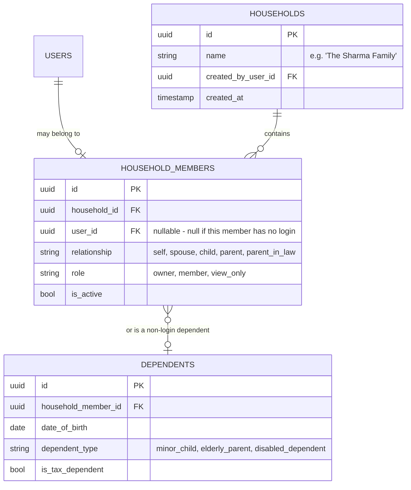
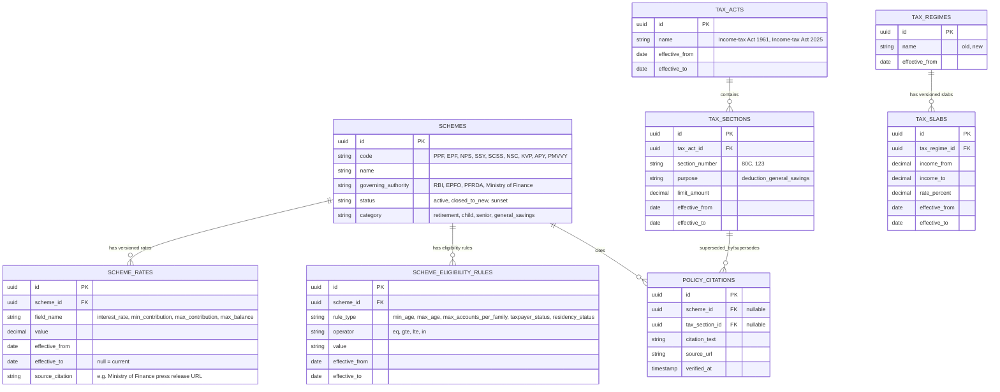
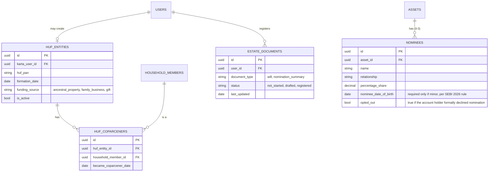
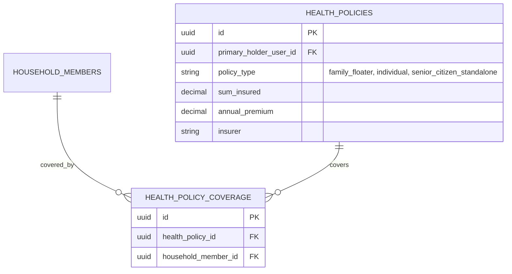
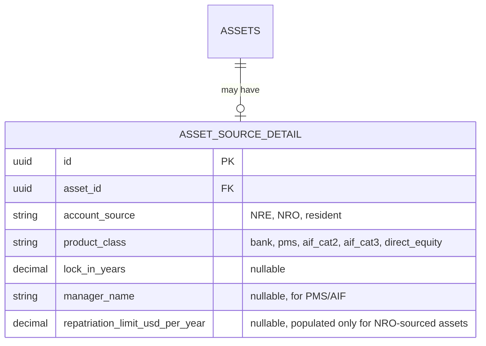
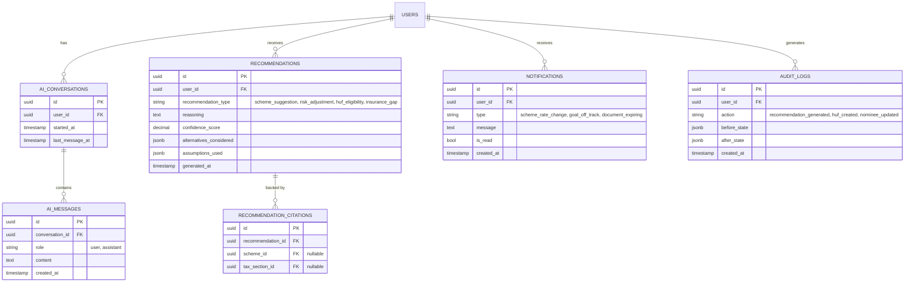

# Database Design Report

**Date:** 2026-07-06
**Method:** Pure synthesis — no new web research this phase. Every new entity below is traced directly to a specific finding in Phases 0-4 (cited inline as `[Phase X]`); nothing is spun up speculatively. The existing 9-table schema (`ProjectDiscoveryReport.md`) is treated as a stable foundation to extend, not replace — per your brief's "never redesign stable architecture unless a verified issue requires it."

---

## Design Principles Carried Forward

1. **Additive over destructive.** Every new table below sits alongside the existing 9, connected via foreign keys. No existing table's meaning changes.
2. **Versioned, effective-dated policy data — never hardcoded.** Proven necessary by the Income Tax Act 1961→2025 transition and quarterly PPF/SSY/SCSS rate changes `[Phase 1]`.
3. **Per-individual truth underneath household aggregates.** Proven necessary by India's no-joint-filing tax structure `[Phase 4]`.
4. **Soft deletes throughout**, matching the existing `is_active` convention (`CLAUDE.md`'s own stated rule) — extended to every new table, not just goals.

---

## Full Schema — Grouped by Domain

### Group A: Identity & Household (new)

**Why:** Personas 6, 7, 9, and 10 all require a household view that's an *aggregate of* per-individual data, not a merge `[Phase 4, "Cross-Persona Patterns" #1-2]`. `HOUSEHOLD_MEMBERS.user_id` is nullable specifically because a minor child or a dependent parent may need to be represented in the household without ever having their own login — this directly reflects the SSY-for-a-daughter-under-10 scenario `[Phase 1, Phase 3]`, where the daughter is a real planning subject with zero account of her own.

**Every existing per-user table (`goals`, `income_sources`, `expenses`, `assets`, `liabilities`) stays exactly as-is, keyed to `user_id`.** Household-level views are computed by joining through `household_members.user_id`, never by adding a `household_id` column to those tables directly — this preserves the "per-individual truth underneath the aggregate" principle without touching a single existing table.

### Group B: Government Policy Engine (new — the core "never hardcode" requirement)

**Why this shape specifically:** every field is `effective_from`/`effective_to` dated because this research proved, concretely, that PPF/SSY/SCSS rates move quarterly and the entire tax Act is being renumbered this fiscal year `[Phase 1]`. A query for "PPF's current interest rate" is `SELECT value FROM scheme_rates WHERE scheme_id = ? AND field_name = 'interest_rate' AND effective_from <= CURRENT_DATE AND (effective_to IS NULL OR effective_to > CURRENT_DATE)` — never a constant anywhere in application code. `SCHEMES.status` directly encodes the PMVVY lesson: a `closed_to_new` scheme must be structurally excluded from new-user recommendations regardless of how well eligibility otherwise matches `[Phase 1]`. `SCHEME_ELIGIBILITY_RULES` is a rule table, not a boolean column, specifically because APY's "excluded if income-taxpayer" rule is qualitatively different from a simple age range `[Phase 1]`, and this shape accommodates both without a schema change when the next unusual eligibility rule appears.

### Group C: Estate, HUF & Nomination (new)

**Why:** `HUF_ENTITIES.funding_source` is a required, explicitly-enumerated field — not free text — because Phase 3 established HUF recommendations must be *gated* on a real funding source (ancestral property or business income), not offered generically. `NOMINEES` is modeled per-`asset_id` with a `percentage_share` and up to 3 rows per asset, directly mirroring the actual SEBI rule (name + relationship mandatory, DOB only if minor, PAN/Aadhaar optional) verified in Phase 3 — not a generic "next of kin" field. `ESTATE_DOCUMENTS` deliberately stores only **status**, not document content — Phase 3 was explicit that storing actual will content/legal text is out of scope for a financial-planning app.

### Group D: Insurance & Health (new)

**Why a separate table from `assets`:** a floater policy's premium is priced off the *eldest covered member's age*, and the family-vs-standalone-parent-policy tradeoff (Phase 3, with the doubled 80D/123 deduction) is a genuinely different calculation shape than a bank balance or investment holding — forcing it into the generic `assets` table would require special-casing logic scattered through the codebase instead of being structurally distinct data.

### Group E: Sophisticated Holdings (new — HNI/NRI support)

**Why an extension table, not new columns on `assets` directly:** most users (personas 1-9) never touch NRE/NRO or PMS/AIF concepts at all — adding these as nullable columns directly on the high-traffic `assets` table would be schema clutter for the common case. A 1:0/1 extension table keeps the base `assets` table exactly as it is today (no migration risk to existing rows) while giving personas 10-11 the fields Phase 4 proved they specifically need — the NRE/NRO repatriability distinction and PMS/AIF's lock-in/manager/category shape, both explicitly identified as absent from the current bank-account-shaped `assets` table `[Phase 4, "Cross-Persona Patterns" #4-5]`.

### Group F: AI, Recommendations & Operations (new)

**Why:** `AI_CONVERSATIONS`/`AI_MESSAGES` directly closes the documented gap that Copilot's `conversation_id` is accepted but never persisted (`AUDIT.md` #11, confirmed in Project Discovery). `RECOMMENDATIONS` and `RECOMMENDATION_CITATIONS` are the literal database representation of your brief's explainable-AI requirement — every recommendation must carry reasoning, a confidence score, alternatives considered, and assumptions used, each stored as queryable structured data (not just embedded in a chat reply), and citations link back to the exact `SCHEME_RATES`/`TAX_SECTIONS` row a recommendation relied on, so a recommendation's grounding can be checked or invalidated if the underlying policy data later changes. `AUDIT_LOGS` covers the compliance-sensitive mutations this schema now has that didn't exist before (HUF creation, nominee changes) — a generic before/after JSON diff, not a bespoke table per action type.

---

## Normalization Review

All new tables are in **3NF**: every non-key attribute depends on the whole primary key and nothing but the key. The one deliberate denormalization is `RECOMMENDATIONS.alternatives_considered` and `assumptions_used` as `jsonb` rather than fully normalized child tables — justified because these are write-once, read-as-a-whole audit/explanation payloads that are never independently queried by their internal fields (no requirement surfaced in Phases 0-4 for "find all recommendations that considered scheme X as an alternative," which would justify normalizing that out).

## Indexes (beyond the implicit PK/FK indexes)

- `scheme_rates(scheme_id, field_name, effective_from, effective_to)` — composite, since every real query is "current value of field X for scheme Y," matching the existing codebase's own indexing convention (AUDIT.md's composite-index precedent).
- `household_members(household_id, is_active)`, `household_members(user_id)` — both directions of the household↔user lookup are equally common.
- `nominees(asset_id)` — every asset detail view needs its nominees.
- `ai_messages(conversation_id, created_at)` — conversation replay is always chronological.
- `audit_logs(user_id, created_at)` — audit review is always per-user, time-ordered.

## Scalability Review

- **Read-heavy policy tables** (`schemes`, `scheme_rates`, `tax_slabs`) change at most quarterly and are read on every recommendation — ideal candidates for an application-level cache with a short TTL (minutes, not the multi-hour TTL a slower-changing dataset could use), invalidated explicitly whenever an admin/data-pipeline process inserts a new effective-dated row. This is a caching decision the existing rate-limiter's in-memory pattern (`AUDIT.md` #12) already establishes precedent for in this codebase, though policy-data caching should not reuse the same in-memory structure (different invalidation semantics, different consistency requirements for financial data).
- **`audit_logs` and `ai_messages` are append-only, unbounded-growth tables** — the same class of concern already flagged and fixed for the rate-limiter's in-memory buckets (`AUDIT.md` #3), except here the fix is a retention/archival policy at the database level (e.g., partition by month, archive after N months), not an in-memory eviction strategy, since this data has real compliance/audit value that in-memory rate-limit buckets never had.
- **Household aggregation queries** (net worth across all members) fan out across multiple per-user tables per household — for a household of 4-6 members this is a small, bounded fan-out, not a scalability risk at any realistic household size.

---

## What This Phase Does Not Include

Trust structures (flagged as out of scope in Phase 3, deferred pending dedicated research), disabled-dependent-specific tax entities (same gap), and any schema for private financial products beyond the PMS/AIF extension above (a full private-product catalog is the next report, `Phase 6`'s "Private Product Research," and may surface additional entities this schema doesn't yet anticipate).
