# DATABASE & SCHEMA BIBLE

**Volume 3 of the Northstar Project Engineering Bible**
**Date compiled:** 2026-07-09
**Method:** every SQLAlchemy model file (`backend/app/models/*.py`), every Alembic migration (`001` through `009`), every service file, every router, and every database-touching test file was read in full for this document. Where a migration's raw SQL and a model's current Python declaration could theoretically drift, the migration is treated as the historical record of what was actually applied and the model as the current live contract — both are cited, and any discrepancy is called out explicitly. Nothing in this document was carried over from a prior volume without being re-checked against the source for this specific pass.

---

## 1. Database Overview

**Why this database exists:** PostgreSQL 16 is the single source of truth for every piece of durable state in Northstar — there is no secondary datastore, cache-as-source-of-truth, or document store anywhere in this codebase. Every user-facing fact (a goal, a family member, a simulation result, a notification's read state) is a row in one of 34 tables, reached exclusively through SQLAlchemy's async engine (`backend/app/database.py`).

**Overall philosophy, verified across every migration read for this document:**
- **Additive-only migrations.** All 9 migrations either `CREATE TABLE IF NOT EXISTS` or `ADD COLUMN IF NOT EXISTS` — not one migration in this codebase's history alters an existing column's type or drops a column that had real data in it. `docs/ENGINEERING_CONSTITUTION.md` Rule 3 states this as policy; the migration history confirms it was actually followed, not just declared.
- **Soft delete over hard delete, almost everywhere.** Every user-owned entity table carries `is_active BOOLEAN NOT NULL DEFAULT TRUE`; deletion in the application layer means setting this to `false`, never `DELETE FROM`. The exceptions are documented precisely in §4 and §13.
- **Versioned, effective-dated reference data for anything a regulator can change.** Every table in the Government Schemes domain (`scheme_rates`, `scheme_eligibility_rules`, `tax_sections`, `tax_slabs`) carries `effective_from`/`effective_to` rather than a single mutable current value — a superseded rate is never deleted, only superseded.
- **UUID primary keys everywhere**, generated by PostgreSQL's own `gen_random_uuid()` at the SQL level (not application-generated) for every table except where a model's Python-side `default=uuid.uuid4` is the operative default (see §4 for the one place this distinction has a real, if minor, consequence).
- **Ownership resolved through `user_id` foreign keys, not a session-scoped or row-level-security mechanism.** Every query enforces "does this row belong to the requesting user" explicitly in application code (verified across every router in Volumes 1-2) — PostgreSQL Row-Level Security is not used anywhere in this schema.

**Major domains** (used as the organizing structure for §2 and §4): Authentication, Goals, Financial Planning, Family, Government Schemes, Insurance, Recommendations, Notifications, Audit Logs, and a "Future Modules" domain covering tables that are fully migrated but have zero current application consumers.

**Architectural principles, stated once here and referenced throughout:**
1. A table's existence does not imply an active feature — 6 of this schema's 34 tables have zero router/service consumers (§14).
2. A foreign key's `ON DELETE` behavior is a deliberate per-relationship decision, not a default — verified to differ meaningfully between `CASCADE` and `SET NULL` in exactly one place (`huf_entity_id`, §5, §6).
3. Every table this document calls "soft-deleted" was verified to have an `is_active` column read by at least one live query filter, not just present in the schema.

---

## 2. Complete ER Diagram

### 2.1 Authentication

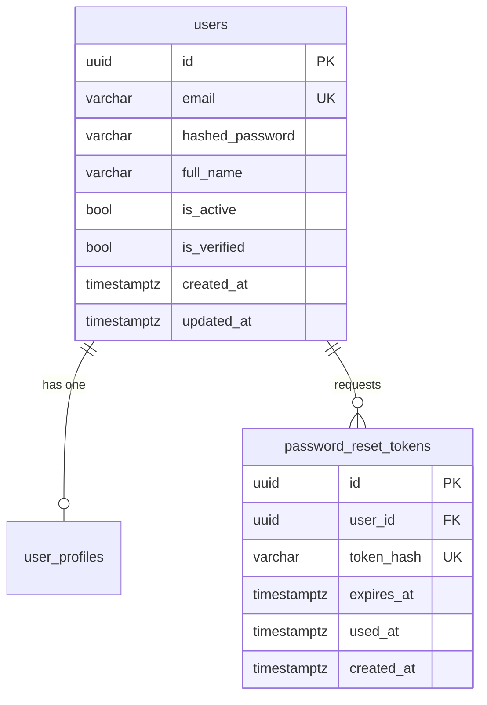

### 2.2 Goals

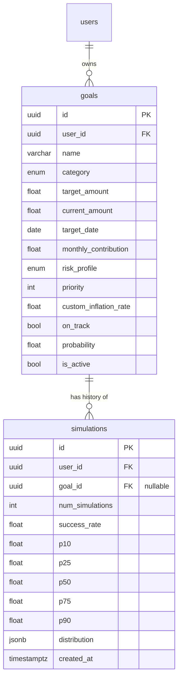

### 2.3 Financial Planning

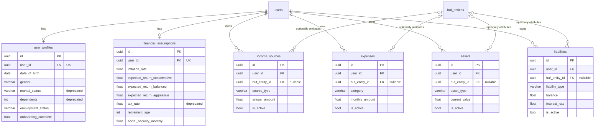

### 2.4 Family

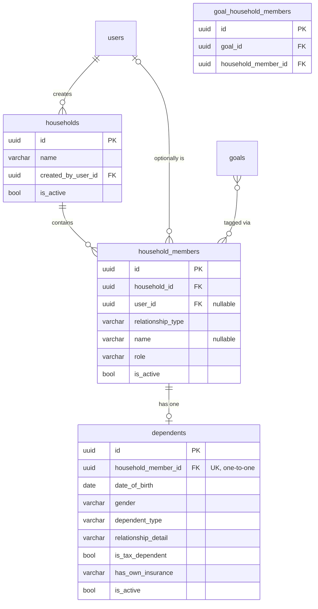

### 2.5 Government Schemes (Policy Engine, Layer 1)

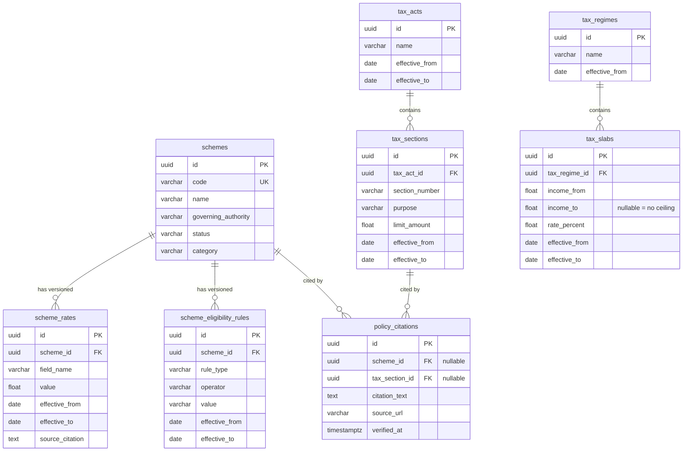

### 2.6 Insurance

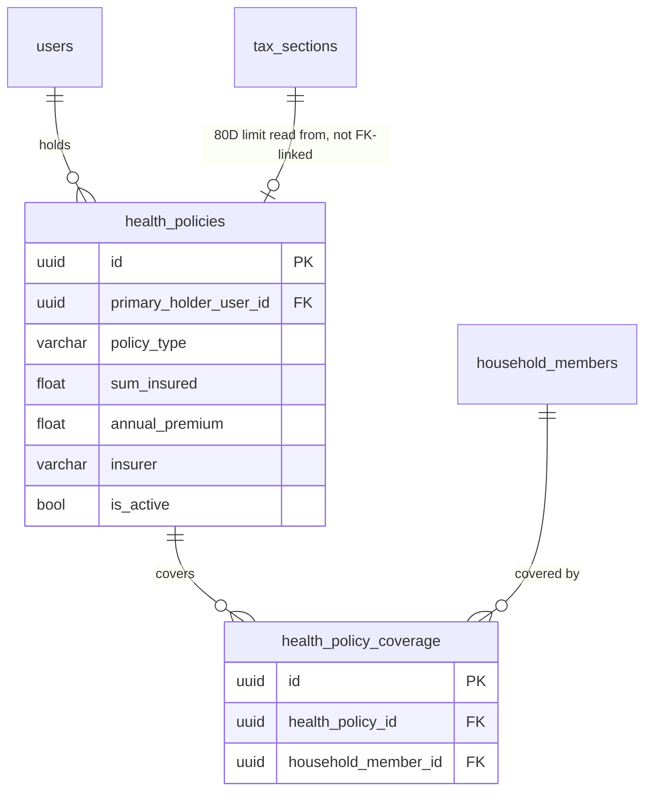
**Note on the dotted relationship above:** `family_insurance_service._base_80d_limit()` reads `tax_sections` by `section_number == "80D"` — this is an application-layer query, not a foreign key. No FK exists between `health_policies` and `tax_sections`.

### 2.7 Recommendations (schema-only, zero consumers — see §14)

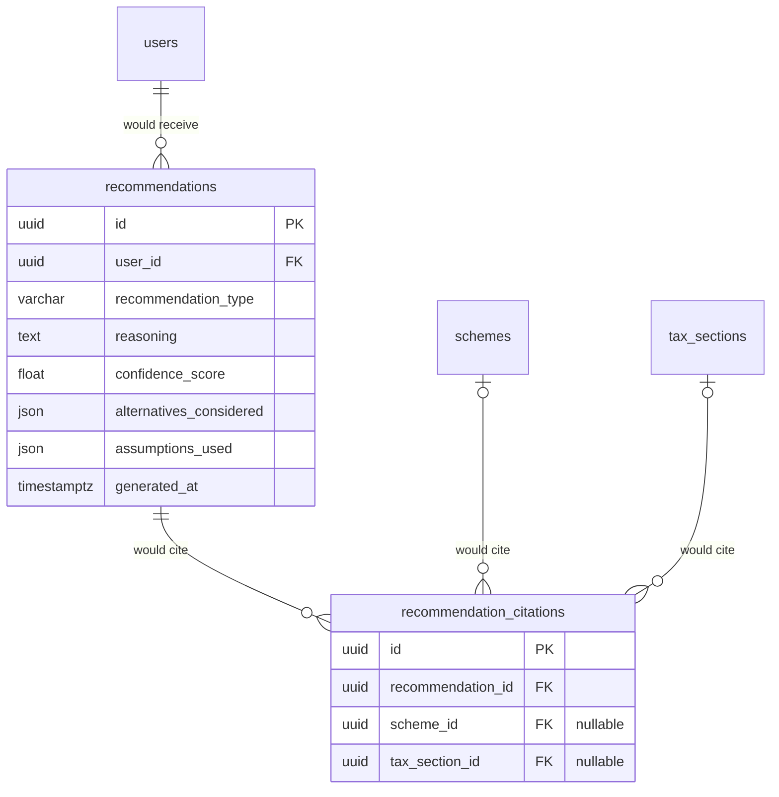

### 2.8 Notifications

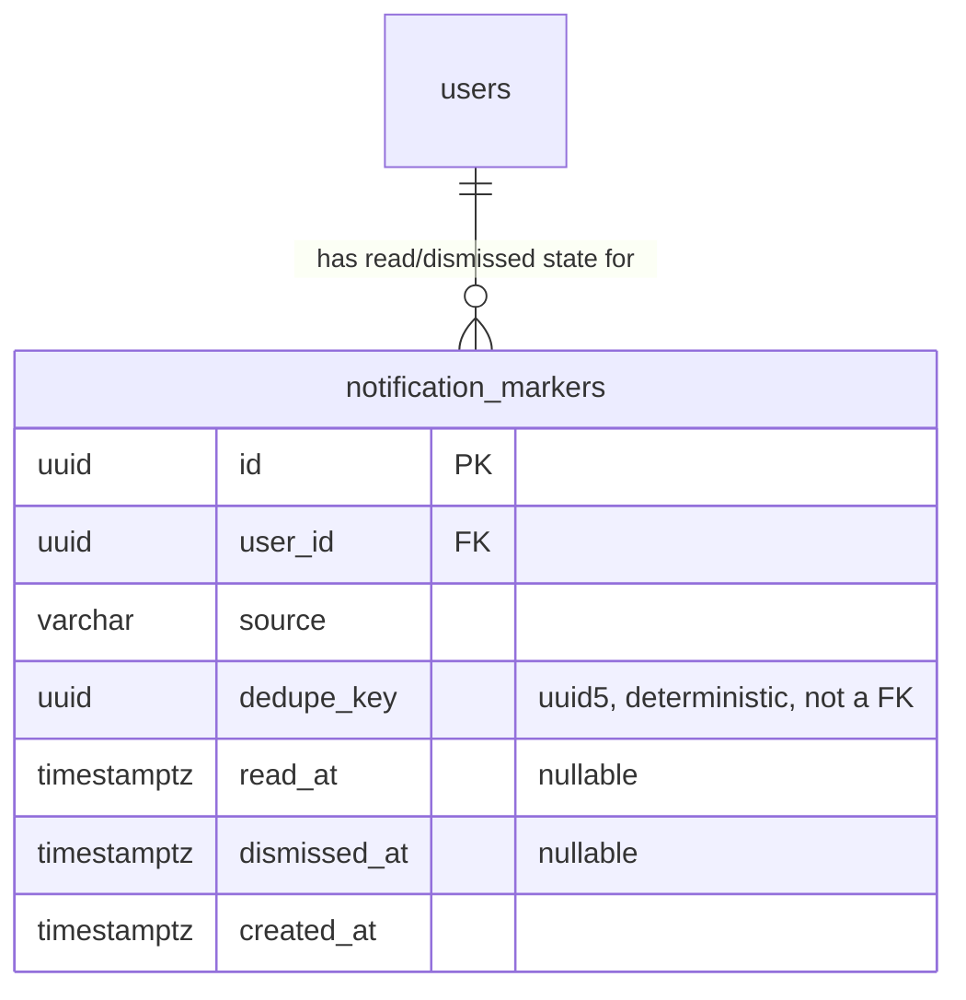
**Note:** `dedupe_key` is not a foreign key to any other table — it is a deterministically-computed `uuid5` hash of a source-specific natural key (e.g. a goal ID, an audit-log row ID). This table stores **no notification content**, only state — see Volume 2 §11.4 and the table chapter in §4.9.

### 2.9 Audit Logs

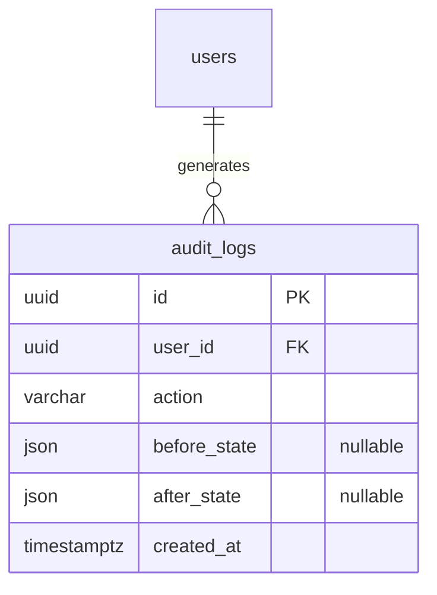

### 2.10 Future Modules (Estate/HUF, Policy Engine Layers 2-3)

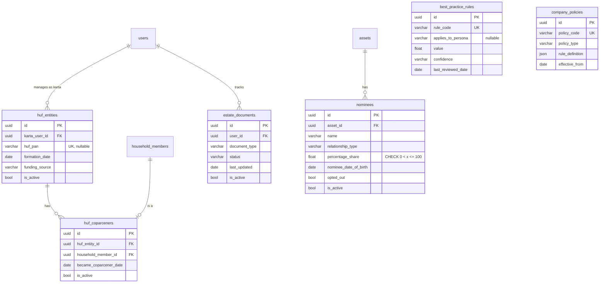

---

## 3. Table Inventory

| Table | Domain | Migration | Services | APIs | Frontend | Status |
|---|---|---|---|---|---|---|
| `users` | Auth | 001 | `auth_service.py` | `/auth/*` | Sign-in/up, all shell | Active |
| `password_reset_tokens` | Auth | 004 | `routers/auth.py` inline | `/auth/forgot-password`, `/auth/reset-password` | Forgot/reset password pages | Active |
| `goals` | Goals | 001, 007 (col) | `planning_service.py` | `/goals/*` | Goals, Dashboard, Family Goals, Command Palette | Active |
| `simulations` | Goals | 001 | `routers/simulate.py` inline | `/simulate` | GoalSimPanel | Active (append-only) |
| `user_profiles` | Financial | 002 | `routers/profile.py` inline | `/profile` | Onboarding, Profile page | Active (2 deprecated fields) |
| `income_sources` | Financial | 002, 006 (col) | `routers/financials.py` inline | `/financials/income` | Financials forms, Dashboard aggregation | Active |
| `expenses` | Financial | 002, 006 (col) | `routers/financials.py` inline | `/financials/expenses` | Financials forms, Dashboard aggregation | Active |
| `assets` | Financial | 002, 006 (col) | `routers/financials.py` inline | `/financials/assets` | Financials forms, Dashboard/NetWorth | Active |
| `liabilities` | Financial | 002, 006 (col) | `routers/financials.py` inline | `/financials/liabilities` | Financials forms, Dashboard/NetWorth | Active |
| `financial_assumptions` | Financial | 002 | `routers/assumptions.py` inline | `/assumptions` | Onboarding, Settings, EducationPlanningSection (partial) | Active but disconnected from Monte Carlo (Volume 2 EF-001) |
| `households` | Family | 005 | `family_service.py` | `/family*` | Family Home, all Family pages | Active |
| `household_members` | Family | 005, 008 (col) | `family_service.py`, `family_insurance_service.py` | `/family/members*` | Family Home, Add Member, Insurance, Schemes | Active |
| `dependents` | Family | 005, 007, 008 (col) | `family_service.py`, `scheme_eligibility_service.py` | `/family/members*` | Add/Edit Member forms | Active |
| `goal_household_members` | Family | 007 | `family_service.py` (goal-tagging fns) | `/goals/{id}/family-tags`, `/family/goals` | Family Goals tagging UI | Active |
| `schemes` | Schemes | 005 | `scheme_eligibility_service.py` | `/family/schemes` | Government Schemes page, EducationPlanningSection's SSY callout | Active (seeded, read-only via app) |
| `scheme_rates` | Schemes | 005 | none — no reader in any service (§14) | none | none | **Zero application consumer** |
| `scheme_eligibility_rules` | Schemes | 005 | `scheme_eligibility_service.py` | `/family/schemes` | Government Schemes page | Active |
| `tax_acts` | Schemes | 005 | none directly — reached via `tax_sections` join in tests only | none | none | **Zero application consumer** |
| `tax_sections` | Schemes | 005 | `family_insurance_service.py` (80D limit only) | `/family/insurance` | Family Insurance recommendation | Active, narrow (one section code read) |
| `tax_regimes` | Schemes | 005 | none | none | none | **Zero application consumer** |
| `tax_slabs` | Schemes | 005 | none | none | none | **Zero application consumer** |
| `policy_citations` | Schemes | 005 | none | none | none | **Zero application consumer** |
| `health_policies` | Insurance | 005 | `family_insurance_service.py` | `/family/insurance*` | Family Insurance page | Active |
| `health_policy_coverage` | Insurance | 005 | `family_insurance_service.py` | `/family/insurance*` | Family Insurance page | Active |
| `recommendations` | Recommendations | 005 | none | none | none | **Zero application consumer** (schema-only, §14) |
| `recommendation_citations` | Recommendations | 005 | none | none | none | **Zero application consumer** |
| `notification_markers` | Notifications | 009 | `notification_service.py` | `/notifications*` | Notification Center | Active |
| `audit_logs` | Audit | 005 | `family_service.py`, `family_insurance_service.py` | (no direct read API — write-only from the app's perspective) | none (no audit-log viewer UI exists) | Active, write-only, no UI reader |
| `huf_entities` | Future | 005 | none | none | none | **Zero application consumer** |
| `huf_coparceners` | Future | 005 | none | none | none | **Zero application consumer** |
| `nominees` | Future | 005 | none | none | none | **Zero application consumer** |
| `estate_documents` | Future | 005 | none | none | none | **Zero application consumer** |
| `best_practice_rules` | Future | 006 | none | none | none | **Zero application consumer** |
| `company_policies` | Future | 006 | none | none | none | **Zero application consumer** |

**Verified by grep, exhaustively, for this document:** `grep -rln "TaxSlab\|TaxRegime\|TaxAct\b\|SchemeRate\b\|PolicyCitation" backend/app/routers backend/app/services` returns no matches — these five tables (plus the six named in §2.10) are read only by `backend/tests/test_household_policy_models.py`'s direct model-level tests, never by any production code path.

---

## 4. Individual Table Chapters

*(Grouped by domain, matching §2's ER diagrams. Every table below was read from its exact model file and cross-referenced against its exact migration SQL.)*

### 4.1 Authentication Domain

#### `users`

- **Purpose / business meaning:** the root identity every other user-owned table's `user_id` foreign key ultimately points to. One row per registered account.
- **Model:** `backend/app/models/user.py`. **Migration:** `001_initial_schema.py`.
- **Columns:**

| Column | Type | Nullable | Notes |
|---|---|---|---|
| `id` | UUID | No | PK, `gen_random_uuid()` at SQL level |
| `email` | VARCHAR(255) | No | `UNIQUE`, indexed (`ix_users_email`) |
| `hashed_password` | VARCHAR(255) | No | bcrypt hash via `passlib` |
| `full_name` | VARCHAR(255) | Yes | |
| `is_active` | BOOLEAN | No | default `TRUE` — the soft-delete flag for the account itself |
| `is_verified` | BOOLEAN | No | default `FALSE` — **verified by grep: no code path anywhere ever sets this to `TRUE`.** No email verification flow exists. |
| `created_at`, `updated_at` | TIMESTAMPTZ | No | server defaults, `updated_at` has `onupdate=func.now()` |

- **Constraints:** `UNIQUE` on `email`. **Indexes:** `ix_users_email`.
- **Relationships:** one-to-many to `Goal`, `Simulation` (both `cascade="all, delete-orphan"` at the ORM level — see §5); implicitly referenced by `user_id` FK from every other user-owned table in this schema.
- **Read operations:** every authenticated request, via `middleware/auth.py`'s `get_current_user` (`SELECT ... WHERE id = ? AND is_active = TRUE`).
- **Write operations:** `POST /auth/register` (insert); `PUT /auth/me` (full_name/password update); `DELETE /auth/me` (sets `is_active = false`).
- **Delete strategy:** **soft only** — `routers/auth.py`'s `delete_account` sets `is_active = False`; there is no hard-delete path for a `User` row anywhere in the application layer. A hard `DELETE` would cascade to nearly every table in the schema (see §5), which is precisely why this is soft-delete-only.
- **Audit logging:** none — user account mutations are not written to `audit_logs`.
- **Validation:** email format/uniqueness enforced by the schema layer (`UserCreate` Pydantic model) plus the DB `UNIQUE` constraint as a second line of defense; password hashing is mandatory (`hash_password` called unconditionally in `register`).
- **Known limitations:** `is_verified` is dead — no verification email flow exists to ever flip it. Soft-deleting a user (`is_active=false`) does **not** cascade a soft-delete to that user's goals/assets/etc. — those rows remain `is_active=true` and would still appear in a query that only filters by their own `is_active`, orphaned from an inactive account. This is a real, verified gap: no code path re-checks the owning `User.is_active` when listing a user's own goals (the `get_current_user` dependency already rejects the request before any such listing query runs, so this gap is only reachable via a direct DB inspection, not through the API — but it is a real inconsistency in the data itself).

#### `password_reset_tokens`

- **Purpose:** a single-use, time-limited token proving a user requested (and can complete) a password reset without re-authenticating.
- **Model:** `backend/app/models/reset_token.py`. **Migration:** `004_password_reset_tokens.py`.
- **Columns:** `id` (UUID PK), `user_id` (UUID, FK → `users.id`, `ON DELETE CASCADE`), `token_hash` (VARCHAR(255), `UNIQUE`, indexed — **the raw token is never stored**, only its SHA-256 hash via `routers/auth.py`'s `_hash_token`), `expires_at` (TIMESTAMPTZ, not null), `used_at` (TIMESTAMPTZ, nullable — null means unused), `created_at`.
- **Indexes:** `ix_password_reset_tokens_user_id`, a unique index on `token_hash`.
- **Read operations:** `POST /auth/reset-password` — `SELECT ... WHERE token_hash = ? AND used_at IS NULL AND expires_at > NOW()`.
- **Write operations:** `POST /auth/forgot-password` (insert, only if the email exists and the account is active — never reveals non-existence to the caller); `POST /auth/reset-password` (sets `used_at`).
- **Delete strategy:** **never deleted, soft or hard.** A used or expired token row remains in the table forever — verified by grep, no `DELETE FROM password_reset_tokens` or ORM-level delete exists anywhere.
- **Known limitations:** this table has no cleanup/expiry job — expired and used rows accumulate indefinitely. Not a correctness issue (expired/used rows are correctly rejected by the `WHERE` clause), but an unbounded-growth table with no documented retention policy.

---

### 4.2 Goals Domain

#### `goals`

- **Purpose:** the central planning unit — everything else in this schema ultimately exists to help evaluate or act on a goal.
- **Model:** `backend/app/models/goal.py`. **Migration:** `001_initial_schema.py` created the table; `007_family_goal_tagging.py` added `custom_inflation_rate`.
- **Columns:**

| Column | Type | Nullable | Notes |
|---|---|---|---|
| `id` | UUID | No | PK |
| `user_id` | UUID | No | FK → `users.id`, `ON DELETE CASCADE`, indexed |
| `name` | VARCHAR(255) | No | |
| `category` | `goal_category` ENUM | No | `retirement\|education\|home\|travel\|wealth\|emergency` |
| `target_amount` | FLOAT | No | app-layer bound: `≤ 1,000,000,000` |
| `current_amount` | FLOAT | No | default 0, app-layer bound same ceiling |
| `target_date` | DATE | No | |
| `monthly_contribution` | FLOAT | No | default 0, app-layer bound: `≤ 10,000,000` |
| `risk_profile` | `risk_profile` ENUM | No | `conservative\|balanced\|aggressive`, default `balanced` |
| `priority` | INTEGER | No | default 1, app-layer bound `1–10` |
| `custom_inflation_rate` | FLOAT | **Yes** | added in migration 007; app-layer bound `0–0.5`; deliberately excluded from the Calculation Context (Volume 2 §7) |
| `on_track` | BOOLEAN | No | default TRUE, computed — never user-writable |
| `probability` | FLOAT | No | default 0, computed — never user-writable |
| `is_active` | BOOLEAN | No | default TRUE — the soft-delete flag |
| `created_at`, `updated_at` | TIMESTAMPTZ | No | |

- **Constraints:** two PostgreSQL ENUM types (`goal_category`, `risk_profile`) created in migration 001 via a `DO $$ ... EXCEPTION WHEN duplicate_object THEN NULL; END $$` guard (idempotent enum creation — PostgreSQL has no native `CREATE TYPE IF NOT EXISTS`).
- **Indexes:** `ix_goals_user_id` (001); `ix_goals_user_id_active` on `(user_id, is_active)` and a **partial** index `ix_goals_user_id_priority` on `(user_id, priority ASC, created_at ASC) WHERE is_active = TRUE` (both added `CONCURRENTLY` in migration 003 — see §6.3 and §12).
- **Relationships:** many-to-one to `User`; one-to-many to `Simulation` (`cascade="all, delete-orphan"`); many-to-many to `HouseholdMember` via the `goal_household_members` join table (§4.4).
- **ORM model:** `backend/app/models/goal.py`, `class Goal(Base)`.
- **Read operations:** `GET /goals`, `GET /goals/{id}`, `GET /dashboard` (via `planning_service._active_goals`), `GET /reports/summary`, `GET /family/goals` (with tags joined), `GET /family/dashboard` (education/retirement cards), `GET /notifications` (goal-at-risk/completed sources), the AI Copilot (`routers/copilot.py`), and the Command Palette (client-side, over already-fetched data).
- **Write operations:** `POST /goals` (insert, triggers `calculate_goal_probability`); `PATCH /goals/{id}` (update, conditionally triggers recalculation per the Calculation Context — Volume 2 §7); `PUT /goals/{id}/family-tags` (writes to the join table only, never to `goals` itself); `DELETE /goals/{id}` (soft delete only).
- **Delete strategy:** **soft only** at the application layer — `routers/goals.py`'s `delete_goal` sets `is_active = False`. A hard `DELETE FROM goals` would cascade to `simulations` and `goal_household_members` (both `ON DELETE CASCADE`) — this cascade exists in the schema for referential integrity but is never triggered by any application code path.
- **Audit logging:** **none.** `grep -rn "AuditLog" backend/app/routers/goals.py backend/app/services/planning_service.py` returns no matches — goal mutations are the single largest audit-logging gap in this schema (Volume "Engineering Findings Summary" EF-005).
- **Validation:** enforced almost entirely at the Pydantic schema layer (`schemas/goal.py`'s `GoalCreate`/`GoalUpdate`), not at the database level — the DB has no `CHECK` constraint mirroring the `_MAX_AMOUNT`/`_MAX_MONTHLY_AMOUNT` bounds; a row inserted by a future script or manual SQL bypassing the API would not be blocked by the database itself.
- **Performance considerations:** the partial index `ix_goals_user_id_priority` exists specifically to cover `routers/goals.py`'s default `list_goals` query (`ORDER BY priority ASC, created_at ASC WHERE is_active = TRUE`) without a sort step — confirmed by reading the migration's own comment and the router's exact `ORDER BY` clause, which match precisely.
- **Known limitations:** `on_track` and `probability` have no database-level `CHECK` preventing an out-of-range value (e.g. `probability > 100`) — every guarantee about their range comes from `planning_service.calculate_goal_probability`'s own arithmetic (Volume 2 §9), not the schema.
- **Future extensions:** `custom_inflation_rate`'s addition pattern (a single nullable override column) is the template this schema would likely follow for any future per-goal calculation override.

#### `simulations`

- **Purpose:** an append-only historical record of every explicit, user-triggered `/simulate` call — never the same thing as `goals.probability`/`goals.on_track` (Volume 2 §6.9 established this distinction precisely).
- **Model:** `backend/app/models/simulation.py`. **Migration:** `001_initial_schema.py`.
- **Columns:** `id` (UUID PK), `user_id` (FK → `users.id`, CASCADE), `goal_id` (FK → `goals.id`, CASCADE, **nullable** — a simulation can be run without an associated goal, e.g. an ad-hoc "what if" scenario), `num_simulations`, `initial_amount`, `monthly_contribution`, `years_to_goal`, `risk_profile` (plain `VARCHAR(50)`, **not** the `risk_profile` ENUM `goals.risk_profile` uses — a real, verified type inconsistency between the two tables), `success_rate`, `p10`/`p25`/`p50`/`p75`/`p90` (all FLOAT, not null), `distribution` (JSONB, default `{}`), `created_at`.
- **Indexes:** `ix_simulations_user_id`, `ix_simulations_goal_id`.
- **Relationships:** many-to-one to `User` (`cascade="all, delete-orphan"` from the `User` side) and to `Goal` (`cascade="all, delete-orphan"` from the `Goal` side, but nullable from this table's own side).
- **Read operations:** none found — verified by grep, **no route ever lists or fetches a user's past `Simulation` rows.** `POST /simulate` writes a row and returns its computed result directly in the response; there is no `GET /simulate` or `GET /simulate/{id}` endpoint.
- **Write operations:** `POST /simulate` only.
- **Delete strategy:** none — no delete path exists for this table at all, soft or hard, from the application layer.
- **Known limitations:** this table is effectively **write-only from the application's perspective** — every simulation ever run is durably stored but never surfaced back to the user through any API. This is either a real, unbuilt feature (a "simulation history" view) or genuinely intentional append-only logging with no product surface yet — the code gives no indication which.
- **Future extensions:** `docs/architecture.md`'s own "Future Architecture" table names this table as the intended shape for a future Celery/Redis-backed async simulation queue, since it already captures a full input+output snapshot per run.

---

### 4.3 Financial Planning Domain

#### `user_profiles`

- **Purpose:** personal/demographic information collected during onboarding.
- **Model:** `backend/app/models/profile.py`. **Migration:** `002_financial_profile.py`.
- **Columns:** `id` (UUID PK), `user_id` (FK → `users.id`, `ON DELETE CASCADE`, **`UNIQUE`** — enforces the one-to-one relationship at the database level, not just by convention), `date_of_birth`, `gender`, `marital_status` (**deprecated**, see below), `dependents` (INTEGER, **deprecated**), `country`, `state_province`, `employment_status`, `employer`, `occupation`, `onboarding_complete` (BOOLEAN), `current_step` (INTEGER), `created_at`, `updated_at`.
- **Constraints:** `UNIQUE` on `user_id`. **Indexes:** `ix_user_profiles_user_id`.
- **Deprecation, verified directly in the model file's own comment:** `marital_status` and `dependents` are explicitly marked deprecated as of 2026-07-06 (`FutureCompatibilityAuditReport.md` Finding A) — `household_members.relationship_type`/`dependents` (the Family domain tables) are the authoritative source going forward, and the model file's comment explicitly instructs against writing new business logic against these two fields. **Verified by grep: neither field is read by any service anywhere in the codebase** — they exist only as onboarding-flow convenience fields, not consumed downstream.
- **Read/write operations:** `GET`/`PUT /api/v1/profile`, both fully pass-through in `routers/profile.py` with no service-layer indirection (`db.execute(select(UserProfile)...)` runs directly inside the router — one of the few places in this codebase where a router does its own query rather than delegating to a service, a minor deviation from the "thin router" rule worth noting since it's otherwise held without exception).
- **Delete strategy:** no dedicated delete path — the row is only removed if the parent `User` is hard-deleted (never happens, per `users`' own chapter), so in practice this row is immortal for the lifetime of the account.

#### `income_sources`, `expenses`, `assets`, `liabilities`

*(Grouped — all four share an identical structural pattern, differing only in their domain-specific columns.)*

- **Purpose:** the raw financial inputs behind Dashboard net worth, savings rate, and asset/liability aggregation (Volume 2 §2.6-2.8).
- **Model files:** all four in `backend/app/models/financials.py`. **Migration:** `002_financial_profile.py` created all four; `006_foundation_reconciliation.py` added `huf_entity_id` to all four.
- **Shared columns:** `id` (UUID PK), `user_id` (FK → `users.id`, CASCADE, indexed), `huf_entity_id` (UUID, FK → `huf_entities.id`, **`ON DELETE SET NULL`** — the one deliberately different cascade behavior in this entire schema, see §5), `is_active` (BOOLEAN, soft-delete flag), `created_at`, `updated_at`.
- **Domain-specific columns:**
  - `income_sources`: `source_type` (VARCHAR(50)), `description` (nullable), `annual_amount` (FLOAT).
  - `expenses`: `category` (VARCHAR(50)), `description` (nullable), `monthly_amount` (FLOAT).
  - `assets`: `asset_type` (VARCHAR(50)), `institution` (nullable), `description` (nullable), `current_value` (FLOAT).
  - `liabilities`: `liability_type` (VARCHAR(50)), `institution` (nullable), `description` (nullable), `balance` (FLOAT), `interest_rate` (nullable FLOAT), `monthly_payment` (FLOAT, default 0).
- **Indexes, all four tables:** a single-column index on `user_id` (migration 002) plus a composite `(user_id, is_active)` index added `CONCURRENTLY` in migration 003, and (for `assets`/`liabilities`/`expenses`/`income_sources` alike) a `huf_entity_id` index added in migration 006.
- **Read operations:** `GET /financials/{income|expenses|assets|liabilities}` (list, filtered by `user_id` + `is_active`); `planning_service.get_dashboard()` (aggregation across all four).
- **Write operations:** each has its own `POST`/`DELETE` (all four) plus `PATCH` (assets and liabilities only — `income_sources` and `expenses` have no update endpoint, confirmed by reading `routers/financials.py` in full: only `create_income`/`delete_income` and `create_expense`/`delete_expense` exist, with no `update_income`/`update_expense` counterparts to `update_asset`/`update_liability`).
- **Delete strategy:** **soft only**, all four — every `DELETE` endpoint in `routers/financials.py` sets `is_active = False`, never issues a hard `DELETE`.
- **Audit logging:** none for any of the four — confirmed by grep, no `AuditLog` import exists in `routers/financials.py`.
- **Known limitation, verified and worth flagging precisely:** `income_sources` and `expenses` cannot be edited once created (no `PATCH` route) — a user who mis-enters a salary figure must delete the row and recreate it, unlike assets/liabilities which support in-place correction.
- **HUF attribution (`huf_entity_id`):** nullable on all four, defaults to `NULL` (personally-owned), can be set to attribute the row to an HUF entity instead — `user_id` remains required and unchanged either way (the karta still resolves access control; see Volume 1 §15.7 for the full engineering rationale). **Verified by direct test** (`test_foundation_reconciliation.py::test_deleting_huf_entity_nulls_ownership_not_cascades`): deleting the `HUFEntity` row leaves the financial row intact (confirmed under SQLite for "row survives"; the `huf_entity_id IS NULL` half of the behavior was verified separately against the real Postgres dev database per that test's own comment — see §12).

#### `financial_assumptions`

- **Purpose:** per-user default rate assumptions, intended to drive projections.
- **Model:** `backend/app/models/assumptions.py`. **Migration:** `002_financial_profile.py`.
- **Columns:** `id` (UUID PK), `user_id` (FK → `users.id`, CASCADE, `UNIQUE`), `inflation_rate` (FLOAT, default 0.03), `expected_return_conservative`/`_balanced`/`_aggressive` (FLOAT, defaults 0.05/0.07/0.09), `tax_rate` (FLOAT, default 0.22, **deprecated**), `retirement_age` (INTEGER, default 65), `social_security_monthly` (FLOAT, default 0), `created_at`, `updated_at`.
- **Constraints:** `UNIQUE` on `user_id`. **Indexes:** `ix_financial_assumptions_user_id`.
- **Read/write:** `GET`/`PUT /api/v1/assumptions`, both inline in `routers/assumptions.py` (no service-layer file exists for this domain — confirmed, `services/` has no `assumptions_service.py`).
- **Verified, load-bearing gap (full detail: Volume 2 §1, §15.9):** `inflation_rate` is the **only** field of the seven actually read by any calculation anywhere (by `EducationPlanningSection.tsx`, client-side). `expected_return_conservative`/`_balanced`/`_aggressive`, `tax_rate`, `retirement_age`, and `social_security_monthly` are all fully stored and user-editable but **read by zero calculations** — confirmed exhaustively by grep across every service file in this codebase.
- **Delete strategy:** no delete path exists for this table at all — a row, once created (lazily, on first `GET`), persists for the account's lifetime.

---

### 4.4 Family Domain

#### `households`

- **Purpose:** the family-grouping container — aggregates existing per-user data for a shared view, never becomes a second source of truth for any individual's own records (Volume 1 §15.6's design rationale applies directly here).
- **Model:** `backend/app/models/household.py`. **Migration:** `005_family_policy_foundation.py`.
- **Columns:** `id` (UUID PK), `name` (VARCHAR(255)), `created_by_user_id` (FK → `users.id`, CASCADE, indexed), `is_active` (soft-delete flag), `created_at`, `updated_at`.
- **Relationships:** one-to-many to `HouseholdMember` (`cascade="all, delete-orphan"` at the ORM level, confirmed to actually cascade at the DB level too via `test_household_policy_models.py::test_deleting_household_cascades_to_members`).
- **Read operations:** every Family endpoint, via `family_service.get_or_create_household`/`resolve_owned_household`.
- **Write operations:** created exactly once per user, lazily, on first Family-domain access (`get_or_create_household`) or explicitly via `POST /family/onboarding-seed`.
- **Delete strategy:** **no delete path exists anywhere** — a household, once created, is never soft- or hard-deleted by any application code. `is_active` exists on the schema but no query anywhere sets it to `false`; every read filters `is_active.is_(True)` defensively, but nothing writes `false`.
- **Audit logging:** `household_created` action logged in `family_service.get_or_create_household`.

#### `household_members`

- **Purpose:** one row per person in a household — the `self` member (the account owner), plus spouse/child/parent/other members who may or may not have their own login.
- **Model:** `backend/app/models/household.py`. **Migration:** `005` created the table; `008_household_member_name.py` added `name`.
- **Columns:** `id` (UUID PK), `household_id` (FK → `households.id`, CASCADE, indexed), `user_id` (FK → `users.id`, CASCADE, **nullable** — a spouse/child/parent member may have no login at all, confirmed by `test_household_policy_models.py::test_household_with_login_and_no_login_members`), `relationship_type` (VARCHAR(50): `self|spouse|child|parent|other`), `name` (VARCHAR(255), **nullable**, added in migration 008 — for the `self` member this stays `NULL` forever and the name is resolved from `User.full_name` instead, via `family_service.resolve_member_name`), `role` (VARCHAR(20), default `'member'` — **verified by grep: this column is never read by any service or router**, a second zero-consumer field hiding inside an otherwise fully-active table), `is_active`, `created_at`, `updated_at`.
- **Indexes:** composite `(household_id, is_active)` and single-column `user_id` (both from migration 005).
- **Relationships:** one-to-one to `Dependent` (`uselist=False`, `cascade="all, delete-orphan"`); many-to-many to `Goal` via `goal_household_members`.
- **Read operations:** every Family endpoint; `scheme_eligibility_service.evaluate_household_eligibility` (excludes `relationship_type == "self"` explicitly); `notification_service._collect_family_member_added_facts` (name lookup for the notification title).
- **Write operations:** `POST /family/members`, `PUT /family/members/{id}`, `DELETE /family/members/{id}` (soft), plus automatic creation of the `self` member inside `get_or_create_household`.
- **Delete strategy:** **soft only** — `family_service.remove_member` sets `is_active = False`. The `self` member specifically can never be deleted through the API at all (`routers/family.py`'s `delete_family_member` explicitly 400s if `relationship_type == "self"`).
- **Audit logging:** `family_member_added`, `family_member_updated`, `family_member_removed` — all three written by `family_service.py`.
- **Known limitation:** `role` is a fully-migrated, non-null column with a default that is never read anywhere — effectively dead weight in an otherwise active table.

#### `dependents`

- **Purpose:** the per-member demographic/eligibility data (date of birth, gender, tax-dependent status) that drives scheme eligibility and insurance recommendations.
- **Model:** `backend/app/models/household.py`. **Migration history is the most fragmented in this schema** — built across three separate migrations: `005` (base table: `date_of_birth`, `dependent_type`, `is_tax_dependent`), `007` (`has_own_insurance`), `008` (`gender`, `relationship_detail`).
- **Columns:** `id` (UUID PK), `household_member_id` (FK → `household_members.id`, CASCADE, **`UNIQUE`** — enforces exactly one `Dependent` row per non-`self` member), `date_of_birth` (nullable DATE), `dependent_type` (VARCHAR(50): `spouse|minor_child|elderly_parent|other_dependent`), `is_tax_dependent` (BOOLEAN, default FALSE), `gender` (nullable VARCHAR(10), added migration 008 — drives the SSY female-under-10 check), `relationship_detail` (nullable VARCHAR(100), added migration 008 — `mother`/`father` for parent-type, free text for other-type), `has_own_insurance` (nullable VARCHAR(10): `yes|no|not_sure`, added migration 007), `is_active`, `created_at`, `updated_at`.
- **Read operations:** `scheme_eligibility_service.py` (age/gender rule evaluation); `family_insurance_service.py` (`has_own_insurance`, `date_of_birth` for senior-citizen determination).
- **Write operations:** created alongside every non-`self` `household_members` insert (`family_service.create_member`); updated via `family_service.update_member`.
- **Known limitation, directly stated in the migration 008 comment:** the original design assumed spouse-type members wouldn't need a `Dependent` row — corrected once it became clear `date_of_birth`/`gender` had nowhere else to live for a spouse. This is documented as a corrected assumption, not silently patched over.

#### `goal_household_members`

- **Purpose:** a purely descriptive "this goal affects this person" tag — explicitly and repeatedly documented (in the model file, the migration, and `Milestone2ImplementationContract.md §0.1`) as **not** a joint-ownership model.
- **Model:** `backend/app/models/goal_household_member.py`. **Migration:** `007_family_goal_tagging.py`.
- **Columns:** `id` (UUID PK), `goal_id` (FK → `goals.id`, CASCADE, indexed), `household_member_id` (FK → `household_members.id`, CASCADE, indexed), `created_at`.
- **Constraints:** `UNIQUE (goal_id, household_member_id)` — `uq_goal_household_members`, preventing the same member from being tagged twice on the same goal. **Verified enforced** by `test_family_goal_tagging_schema.py::test_duplicate_tag_rejected_by_unique_constraint` (asserts `IntegrityError`).
- **Read operations:** `family_service.list_goals_with_tags` (joins goals to their tagged members); `family_service.get_member_detail` (the reverse direction — a member's tagged goals).
- **Write operations:** `PUT /goals/{id}/family-tags` — a full delete-then-reinsert of the tag set for one goal, via `family_service.set_goal_household_tags` (verified: `DELETE FROM goal_household_members WHERE goal_id = ?` followed by fresh inserts, every call, not a diff/patch).
- **Cascade behavior, verified by test:** deleting a `Goal` or a `HouseholdMember` cascades to remove the tag row (confirmed structurally consistent under SQLite by `test_deleting_goal_cascades_tag_removal`/`test_deleting_household_member_cascades_tag_removal`; the actual cascade-delete enforcement itself was verified against real Postgres per those tests' own comments — see §6, §12). **Critically, and verified by the same tests:** deleting a household member never deletes the goal itself, and deleting a goal never deletes the household member — only the join row disappears, confirming this table's purely-descriptive, non-ownership-transferring design actually holds at the database level, not just in application-layer intent.

---

### 4.5 Government Schemes Domain (Policy Engine, Layer 1)

#### `schemes`

- **Purpose:** one row per named Indian government financial scheme (PPF, SSY, SCSS, etc.) this application knows about.
- **Model:** `backend/app/models/policy.py`. **Migration:** `005`.
- **Columns:** `id` (UUID PK), `code` (VARCHAR(20), `UNIQUE`, indexed — e.g. `"SSY"`, `"PPF"`), `name`, `governing_authority`, `status` (VARCHAR(20), default `'active'` — also `closed_to_new`/`sunset`, verified by `test_closed_to_new_scheme_status_persists`), `category` (VARCHAR(50)), `created_at`, `updated_at`.
- **Read operations:** `scheme_eligibility_service.evaluate_household_eligibility`/`check_ssy_eligibility` (by `code`); `family_recommendations_service._scheme_recommendations` (by `code`, for category lookup).
- **Write operations:** none in the application layer — this table is populated exclusively by seed scripts (`backend/scripts/`, not read in this pass but referenced by this codebase's own comments as `scripts/seed_policy_data.py`), never by any user-facing endpoint.
- **Known limitation:** `status == "closed_to_new"` schemes are explicitly, correctly excluded from ever being recommended (`scheme_eligibility_service.py`'s special-case branch) — a real, tested safeguard against recommending a scheme like PMVVY that no longer accepts new subscribers.

#### `scheme_rates` — **zero application consumer**

- **Purpose (intended, per the model's own comment):** versioned, effective-dated numeric facts about a scheme (interest rate, min/max contribution, max balance).
- **Model:** `backend/app/models/policy.py`. **Migration:** `005`.
- **Verified by grep:** no service or router reads this table. `scheme_eligibility_service.py` and `family_recommendations_service.py` both read `Scheme` and `SchemeEligibilityRule`, never `SchemeRate`. Exercised only by `test_household_policy_models.py::test_scheme_with_versioned_rate_and_eligibility_rule` — a model-level test, not an application code path.
- **Impact:** any scheme detail page showing "PPF's current interest rate is 7.1%" would need to read this table — no such page exists today; the Government Schemes UI only shows eligibility buckets and plain-language reasons, never a rate figure.

#### `scheme_eligibility_rules`

- **Purpose:** the versioned rule set `scheme_eligibility_service.py` actually evaluates against (Volume 2 §11.2's full formula treatment).
- **Model:** `backend/app/models/policy.py`. **Migration:** `005`.
- **Columns:** `id` (UUID PK), `scheme_id` (FK → `schemes.id`, CASCADE, indexed), `rule_type` (VARCHAR(50): only `max_age`/`min_age`/`gender` are ever branched on by the evaluation code — any other seeded `rule_type` is silently never evaluated, per the service's own documented narrow scope), `operator` (VARCHAR(10)), `value` (VARCHAR(255) — **stored as a string even for numeric thresholds**, parsed via `float(rule.value)` at read time), `effective_from`/`effective_to`, `created_at`.
- **Read operations:** the entire eligibility evaluation pipeline in `scheme_eligibility_service.py`.
- **Known limitation:** the `value` column's `VARCHAR` type means a malformed non-numeric seed value for a `max_age`/`min_age` rule would raise an uncaught `ValueError` at evaluation time (`float(rule.value)`), not a validation error at write time — there is no database-level `CHECK` ensuring this column contains a parseable number when `rule_type` implies one.

#### `tax_acts` — **zero application consumer**

- **Purpose (intended):** the container for the historic 1961 Income-tax Act vs. the 2025 replacement Act, each with its own effective date range.
- **Model:** `backend/app/models/policy.py`. **Migration:** `005`.
- **Verified by grep:** read only by `test_household_policy_models.py::test_tax_act_section_renumbering_both_versions_queryable` — no service ever queries `TaxAct` directly. `family_insurance_service.py` queries `TaxSection` directly by `section_number`, without joining through `TaxAct` at all.

#### `tax_sections`

- **Purpose:** the one table in the entire Government Schemes domain with a real, active application consumer — the source of the ₹25,000 base 80D deduction figure (Volume 2 §11.1).
- **Model:** `backend/app/models/policy.py`. **Migration:** `005`.
- **Columns:** `id` (UUID PK), `tax_act_id` (FK → `tax_acts.id`, CASCADE, indexed), `section_number` (VARCHAR(20) — e.g. `"80D"`, or `"123"` for the same deduction under the 2025 Act), `purpose`, `limit_amount` (nullable FLOAT — nullable specifically so a section with no fixed ceiling can be represented honestly, not forced to `0` or a fabricated number), `effective_from`/`effective_to`, `created_at`.
- **Read operations:** `family_insurance_service._base_80d_limit` — `SELECT ... WHERE section_number == "80D"`, taking `.scalars().first()` (the **first** matching row, not filtered by `effective_to > today()` — a real, verified detail: if two `80D` rows ever existed with different effective date ranges, this query does not guarantee it picks the currently-effective one, only the first one PostgreSQL happens to return).
- **Known limitation, precisely stated:** despite this table's entire purpose being effective-dated versioning, the one place it's actually read does **not** filter by effective date at all — `_base_80d_limit`'s query has no `WHERE effective_from <= today AND (effective_to IS NULL OR effective_to > today)` clause. This is a real, verified gap between the schema's design intent and its actual single consumer's implementation.

#### `tax_regimes` and `tax_slabs` — **zero application consumer**

- **Purpose (intended):** old-vs-new tax regime comparison, with income-band-based slab rates.
- **Verified by grep:** neither table is read by any service or router — only by `test_household_policy_models.py::test_tax_regime_slabs`. No tax calculation of any kind exists anywhere in this codebase's application layer (confirmed independently in Volume 2 §4/§5 for the Monte Carlo/retirement engines specifically, and reconfirmed here for the schema as a whole).

#### `policy_citations` — **zero application consumer**

- **Purpose (intended):** links a `scheme_id` and/or `tax_section_id` to the specific source URL and verification timestamp that grounds it — the literal database representation of "never invent a financial fact" (`docs/ENGINEERING_CONSTITUTION.md` Rule 4).
- **Verified by grep:** no reader anywhere in `routers/` or `services/`. Notably, **this table is not the mechanism by which today's real citations are surfaced** — `family_insurance_service.py`'s recommendation `why`/`what_information_was_used` text is generated as plain strings in Python code, not assembled from `policy_citations` rows. This table appears to be scaffolding for a more structured future citation system that hasn't replaced the current inline-string approach yet.

---

### 4.6 Insurance Domain

#### `health_policies`

- **Purpose:** a user-recorded health insurance policy (their own, or a family floater).
- **Model:** `backend/app/models/insurance.py`. **Migration:** `005`.
- **Columns:** `id` (UUID PK), `primary_holder_user_id` (FK → `users.id`, CASCADE, indexed — **note the column name is not `user_id`**, a deliberate naming choice distinguishing "who holds this policy" from the generic ownership pattern used elsewhere), `policy_type` (VARCHAR(30): `family_floater|individual|senior_citizen_standalone`), `sum_insured`, `annual_premium`, `insurer` (nullable), `is_active`, `created_at`, `updated_at`.
- **Read operations:** `family_insurance_service.list_policies_with_coverage`/`compute_insurance_recommendation`/`uncovered_parents` (via the coverage-join helper, §4.6).
- **Write operations:** `POST /family/insurance/policies` (insert + initial coverage rows in one call); `PUT /family/insurance/policies/{id}/coverage` (replaces the covered-member set, same delete-then-reinsert pattern as `goal_household_members`).
- **Delete strategy:** **no delete endpoint exists at all** — a `HealthPolicy`, once created, can have its coverage changed but cannot itself be removed or deactivated through any API route (`grep -rn "delete.*polic" backend/app/routers/family.py` confirms no `DELETE /insurance/policies/{id}` route exists).
- **Audit logging:** `insurance_policy_created` on insert, `insurance_policy_coverage_updated` on coverage replacement — both in `family_insurance_service.py`.

#### `health_policy_coverage`

- **Purpose:** the join table recording which household members a given policy covers.
- **Model:** `backend/app/models/insurance.py`. **Migration:** `005`.
- **Columns:** `id` (UUID PK), `health_policy_id` (FK → `health_policies.id`, CASCADE, indexed), `household_member_id` (FK → `household_members.id`, CASCADE, indexed), `created_at`.
- **Constraints:** **no `UNIQUE (health_policy_id, household_member_id)` constraint exists** — unlike `goal_household_members`, this join table has no protection against the same member being linked to the same policy twice. Verified by reading the migration's exact `CREATE TABLE` statement — no `UNIQUE`/`CONSTRAINT` clause is present, only the two indexes.
- **Known limitation, real and verified:** because `family_insurance_service.replace_policy_coverage` always does a full delete-then-reinsert of the *entire* covered-member set for a policy in one call, an accidental duplicate insert could only occur through a different, hypothetical code path — but the schema itself does not prevent it, unlike the analogous `goal_household_members` table which does.

---

### 4.7 Recommendations Domain — **entirely zero-consumer**

#### `recommendations` and `recommendation_citations`

- **Purpose (intended):** a general-purpose, structured, citable recommendation record — reasoning, confidence score, alternatives considered, assumptions used, and a link to the exact `scheme_rates`/`tax_sections` rows relied on. The literal database representation of the explainable-AI requirement (Volume 1 §17).
- **Model:** `backend/app/models/recommendation.py`. **Migration:** `005`.
- **Verified by grep:** zero matches for `Recommendation`/`RecommendationCitation` in any `routers/` or `services/` file. The **actual** recommendations users see today (Family Insurance, Family Recommendations) are computed live and returned directly in API response schemas (`InsuranceRecommendation`, `FamilyRecommendation` — both plain Pydantic schemas, not these tables) — never written to `recommendations` at all. This is a deliberate architectural choice (Volume 1 §15.3), not an oversight: persisting a recommendation's content here would recreate the exact staleness risk the live-computation design exists to avoid.
- **Exercised only by:** `test_household_policy_models.py::test_recommendation_with_citation_and_structured_fields` — a model-level test proving the schema itself works, with no bearing on whether any production code path uses it.

---

### 4.8 Notifications Domain

#### `notification_markers`

- **Purpose:** stores exactly three pieces of state — read, dismissed, and a deterministic identity — for a notification whose actual title/body is **never** stored here (Volume 2 §11.4's full treatment).
- **Model:** `backend/app/models/notification.py`. **Migration:** `009_notification_markers.py` (the newest table in this schema, added this engagement).
- **Columns:** `id` (UUID PK), `user_id` (FK → `users.id`, CASCADE, indexed), `source` (VARCHAR(50): `insurance|schemes|family_member_added|goal_at_risk|goal_completed`), `dedupe_key` (UUID, indexed — **not a foreign key**; a deterministic `uuid5` hash computed in application code from a source-specific natural key, e.g. `f"{user_id}:{subjects}"` for insurance, the `AuditLog.id` itself for family-member-added), `read_at` (nullable TIMESTAMPTZ), `dismissed_at` (nullable TIMESTAMPTZ), `created_at`.
- **Constraints:** `UNIQUE (user_id, dedupe_key)` — `uq_notification_marker_user_key`.
- **Read operations:** `GET /notifications` — left-joins the five live-computed facts against existing marker rows, **never creating one** (a pure read, verified by an automated test this engagement wrote: `test_notifications.py::test_get_notifications_never_creates_a_marker_row`, which calls the endpoint three times and asserts the table stays empty).
- **Write operations:** exactly two — `POST /notifications/{source}/{key}/read` and `.../dismiss`, both an upsert scoped to one `(user_id, dedupe_key)` row.
- **Delete strategy:** no delete path exists — a dismissed notification's marker row persists forever (dismissal is represented by a non-null `dismissed_at`, not row removal).
- **Known limitation:** no cleanup job exists for markers whose underlying fact has permanently stopped existing (e.g. a goal that was later deleted) — these rows become permanently orphaned, harmless but unbounded, similar to `password_reset_tokens`' own accumulation pattern.

---

### 4.9 Audit Logs Domain

#### `audit_logs`

- **Purpose:** a generic before/after JSON diff log for compliance-sensitive mutations.
- **Model:** `backend/app/models/audit.py`. **Migration:** `005`.
- **Columns:** `id` (UUID PK), `user_id` (FK → `users.id`, CASCADE, indexed — part of a composite index, see below), `action` (VARCHAR(100) — a free-text action name, not an ENUM: `household_created`, `family_member_added/_updated/_removed`, `family_goal_tag_changed`, `insurance_policy_created`, `insurance_policy_coverage_updated` are the seven values actually written, verified exhaustively by grep across `family_service.py` and `family_insurance_service.py`), `before_state` (nullable JSON), `after_state` (nullable JSON), `created_at`.
- **Indexes:** a **composite** `(user_id, created_at)` index — `ix_audit_logs_user_id_created_at` — shaped specifically for a future "show me this user's recent activity, most recent first" query, though **no such query exists anywhere in the application today** (verified by grep: no route reads `audit_logs` at all).
- **Read operations:** **none in the application layer.** This table is write-only from the product's perspective — there is no audit-log viewer UI, no `GET /audit-logs` endpoint, nothing. Its only "reader" is `notification_service._collect_family_member_added_facts`, which queries `AuditLog` rows to source the "family member added" notification — the one place this table's data actually reaches a user, indirectly, through the Notification Center rather than any direct audit view.
- **Known limitation:** the composite index's own shape strongly implies a future user-facing or admin-facing audit view was anticipated but never built — a genuine "designed ahead of the feature" case, structurally identical to the Future Modules tables in §4.10, just not grouped there because this table does have one real, if narrow, consumer.

---

### 4.10 Future Modules Domain (zero application consumers, fully migrated)

#### `huf_entities`, `huf_coparceners`

- **Purpose (intended):** modeling a Hindu Undivided Family as a distinct tax entity, with a karta (managing member) and coparceners (household members with a legal stake).
- **Model:** `backend/app/models/estate.py`. **Migration:** `005`.
- **`huf_entities` columns:** `id`, `karta_user_id` (FK → `users.id`, CASCADE), `huf_pan` (nullable, `UNIQUE` VARCHAR(10)), `formation_date` (nullable), `funding_source` (VARCHAR(50), **required, not nullable** — a deliberate gate, per the model's own comment, ensuring an HUF is never modeled without a real, named funding basis such as `ancestral_property` or `family_business`), `is_active`, timestamps.
- **`huf_coparceners` columns:** `id`, `huf_entity_id` (FK, CASCADE), `household_member_id` (FK → `household_members.id`, CASCADE), `became_coparcener_date` (nullable), `is_active`, `created_at`.
- **Verified by grep:** zero consumers in `routers/`/`services/`. `income_sources`/`expenses`/`assets`/`liabilities`' `huf_entity_id` columns **do** reference `huf_entities` and are exercised (§4.3), but nothing ever creates an `HUFEntity` row through the application itself — the only way one could exist today is direct database insertion (as the tests do) or a future UI that doesn't exist yet.

#### `nominees`

- **Purpose (intended):** per-asset nomination records, modeled to match SEBI's 2026 nomination rule (up to 3 nominees per demat/MF folio, each with a percentage share).
- **Model:** `backend/app/models/estate.py`. **Migration:** `005`.
- **Columns:** `id`, `asset_id` (FK → `assets.id`, CASCADE), `name`, `relationship_type`, `percentage_share` (FLOAT, `CHECK (percentage_share > 0 AND percentage_share <= 100)` — **verified enforced** by two dedicated tests asserting `IntegrityError` at both `0.0` and `150.0`), `nominee_date_of_birth` (nullable), `opted_out` (BOOLEAN), `is_active`, timestamps.
- **Verified by grep:** zero application consumers — exercised only by `test_household_policy_models.py`'s three nominee tests.

#### `estate_documents`

- **Purpose (intended):** tracks the *status* of estate-planning documents (will, trust, etc.) — deliberately never storing actual document content or legal text, per the model's own comment ("out of scope for a financial-planning app").
- **Columns:** `id`, `user_id` (FK, CASCADE), `document_type`, `status` (default `'not_started'`), `last_updated` (nullable), `is_active`, timestamps.
- **Verified:** `test_estate_document_stores_status_only` explicitly asserts `not hasattr(stored, "content")` — a test written specifically to lock in the "status only, never content" design decision as a permanent guarantee, not just a comment.

#### `best_practice_rules`, `company_policies`

- **Purpose (intended):** Layers 2 and 3 of a documented five-layer policy model (`PolicyEngineReport.md`) — financial-planning conventions not backed by government law (`best_practice_rules`, e.g. "3-6 months emergency fund," with an explicit `confidence` tier: `verified|convention|unverified_flag`) and Northstar's own product-level gating/ranking policies (`company_policies`, e.g. "never recommend a `closed_to_new` scheme," with a JSON `rule_definition` rather than rigid columns).
- **Model:** `backend/app/models/company_policy.py`. **Migration:** `006_foundation_reconciliation.py`.
- **Constraints:** `UNIQUE` on `rule_code` (`best_practice_rules`) and `policy_code` (`company_policies`) — the latter **verified enforced** by `test_policy_code_must_be_unique`.
- **Verified by grep:** zero seeded rows found in this exploration, zero application consumers. The exact policy named in the test's own example (`"pmvvy_never_recommend_new"`) describes a rule that **is already correctly enforced today** — but by a hardcoded `if scheme.status == "closed_to_new"` branch inside `scheme_eligibility_service.py` (Volume 1 §11.2/Volume 2), not by a `company_policies` row. This is a precise, verified instance of the same fact stated two ways: the *policy* this table would encode already exists as working code; the table exists to eventually make such policies data-driven instead of hardcoded, but that migration hasn't happened yet.

---

## 5. Relationship Analysis

**One-to-one relationships, verified by a `UNIQUE` constraint on the foreign-key column itself (not just application convention):**
- `users` ↔ `user_profiles` (`user_profiles.user_id UNIQUE`)
- `users` ↔ `financial_assumptions` (`financial_assumptions.user_id UNIQUE`)
- `household_members` ↔ `dependents` (`dependents.household_member_id UNIQUE`)

**One-to-many relationships (the overwhelming majority of this schema):** `users` → `goals`/`simulations`/`income_sources`/`expenses`/`assets`/`liabilities`/`households`/`health_policies`/`estate_documents`/`huf_entities`/`notification_markers`/`audit_logs`/`password_reset_tokens`; `goals` → `simulations`; `households` → `household_members`; `schemes` → `scheme_rates`/`scheme_eligibility_rules`; `tax_acts` → `tax_sections`; `tax_regimes` → `tax_slabs`; `health_policies` → `health_policy_coverage`; `huf_entities` → `huf_coparceners`; `assets` → `nominees`; `recommendations` → `recommendation_citations`.

**Many-to-many relationships, both implemented as an explicit join table (never a raw array/JSON column):**
- `goals` ↔ `household_members` via `goal_household_members` (`UNIQUE (goal_id, household_member_id)` enforced)
- `health_policies` ↔ `household_members` via `health_policy_coverage` (**no** uniqueness constraint enforced — see §4.6)

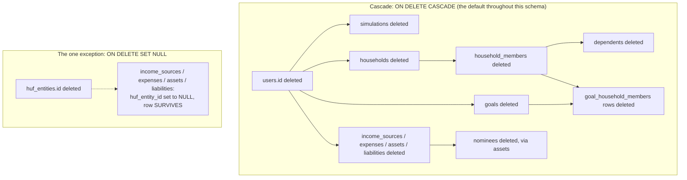

**Ownership model, precisely stated:** every table in this schema resolves ownership through exactly one of two mechanisms — a direct `user_id` FK (the majority pattern), or indirect resolution through a household's `created_by_user_id` (the Family domain's pattern, via `family_service.resolve_owned_household`, which also allows a *member* of a household — not just its creator — to act on it, per that function's own forward-looking comment, though in practice every household today has exactly one creator and no shared-login members). **No table in this schema is owned by more than one user simultaneously** — `goal_household_members` is explicitly, repeatedly documented as descriptive tagging, never shared ownership (§4.4).

**Delete behavior summary — soft vs. hard, verified table by table:**

| Delete strategy | Tables |
|---|---|
| **Soft delete only** (`is_active` flag, application-set) | `users`, `goals`, `income_sources`, `expenses`, `assets`, `liabilities`, `household_members`, `dependents` (implicitly, via its parent member), `health_policies` (flag exists but no endpoint sets it — see below) |
| **No delete path at all** (row is immortal once created) | `households`, `user_profiles`, `financial_assumptions`, `simulations`, `password_reset_tokens`, `notification_markers`, `audit_logs`, `health_policy_coverage` (replaced wholesale, never individually deleted) |
| **Hard delete, cascading** (only reachable by deleting the *parent*, never directly) | `goal_household_members`, `huf_coparceners`, `nominees` |
| **Hard delete via `ON DELETE SET NULL`** (the row survives, only the link is severed) | `income_sources`/`expenses`/`assets`/`liabilities`.`huf_entity_id` on `huf_entities` deletion |

**Verified discrepancy worth flagging precisely:** `health_policies.is_active` exists in both the migration and the model, but **no application code path ever sets it to `false`** — there is no `DELETE /family/insurance/policies/{id}` route at all (confirmed in §4.6). This makes `health_policies` the one soft-deletable-looking table in this schema whose soft-delete mechanism is entirely theoretical — present in the schema, never exercised by any endpoint.

---

## 6. Migration History

Walked chronologically, each migration's exact purpose verified by reading its full SQL and docstring.

| # | Title | Date | What it added | Milestone |
|---|---|---|---|---|
| 001 | Initial schema | 2025-01-01 | `users`, `goals`, `simulations`, the `goal_category`/`risk_profile` ENUM types | Pre-Milestone-2 foundation |
| 002 | Financial profile | 2026-06-27 | `user_profiles`, `income_sources`, `expenses`, `assets`, `liabilities`, `financial_assumptions` | Pre-Milestone-2 |
| 003 | Composite indexes | 2026-07-05 | `(user_id, is_active)` composite indexes on 5 tables + one partial index, all via `CREATE INDEX CONCURRENTLY` inside `autocommit_block()` | Milestone 2.1 performance pass |
| 004 | Password reset tokens | 2026-07-05 | `password_reset_tokens` | Pre-Milestone-2 |
| 005 | Family/Policy/Estate/Insurance/Recommendation/Audit foundation | 2026-07-06 | **20 tables in one migration**: `households`, `household_members`, `dependents` (partial), the full Government Policy Engine (8 tables), Estate/Nominee (4 tables), Insurance (2 tables), Recommendation (2 tables), `audit_logs` | Milestone 1 (schema-only, no routers yet) |
| 006 | Foundation reconciliation | 2026-07-06 | `huf_entity_id` on the 4 financial tables (`ON DELETE SET NULL`); `best_practice_rules`, `company_policies` | Post-Milestone-1 audit fix (`FutureCompatibilityAuditReport.md` Findings B, D) |
| 007 | Family goal tagging | 2026-07-06 | `goals.custom_inflation_rate`; `dependents.has_own_insurance`; `goal_household_members` | Milestone 2 Task 1 |
| 008 | Household member identity fields | 2026-07-06 | `household_members.name`; `dependents.gender`, `dependents.relationship_detail` | Milestone 2 Task 2 (blocker fix, discovered mid-implementation) |
| 009 | Notification markers | 2026-07-08 | `notification_markers` | Milestone 2.6 Phase 3 |

**Compatibility considerations, verified across every migration:**
- Every single migration in this history is purely additive — `CREATE TABLE IF NOT EXISTS` / `ADD COLUMN IF NOT EXISTS` throughout, never a destructive `ALTER COLUMN TYPE` or `DROP COLUMN` in any `upgrade()`.
- Every `downgrade()` function exists and is the exact structural inverse of its `upgrade()` — confirmed by reading all 9 in full, not assumed.
- Migration 003 is the one migration requiring special transactional handling (`autocommit_block()`) because `CREATE INDEX CONCURRENTLY` cannot run inside Alembic's default per-migration transaction wrapper — a real PostgreSQL constraint the migration author had to work around, documented in the migration's own comment.
- Migration 006's docstring is the most explicit in this history about *why* it exists — it directly names the audit report and finding IDs (`FutureCompatibilityAuditReport.md` Findings B and D) that necessitated it, and explicitly states which findings from that same audit (A and C) were resolved via code-comment deprecation instead of a schema change, a useful example of a migration documenting a decision *not* to change the schema alongside the ones it did make.
- **A three-migration column build-up is a real, verified pattern for `dependents` specifically:** its base shape (005) was extended twice more (007, 008) as two separate implementation efforts discovered missing fields mid-build — worth knowing before assuming any single migration file tells the complete story of any one table's current shape.

---

## 7. Data Lifecycle

### 7.1 User Registration → Profile → Goals → Monte Carlo → Dashboard → Recommendations → Notifications

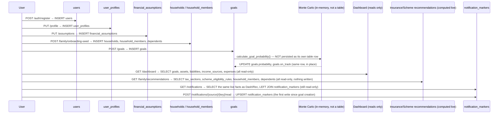

**The single most important lifecycle fact this diagram makes visible:** between goal creation and a notification being marked read, **every intervening step is a pure read** — Dashboard, Family Recommendations, and the Notification list itself all touch the database only to `SELECT`, never to `INSERT`/`UPDATE`. The only two write events in this entire chain are the initial goal creation (which writes to `goals` directly, not a separate calculation-result table) and the explicit, user-initiated "mark as read" action.

### 7.2 Family Member Addition → Eligibility → Insurance Recommendation → Family Recommendation Aggregation

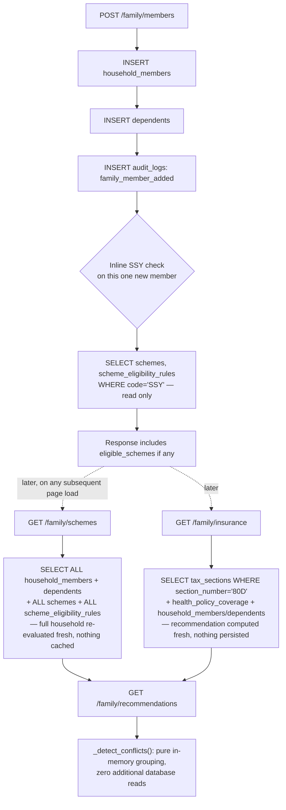

---

## 8. CRUD Matrix

| Table | Create | Read | Update | Delete | Soft Delete | Audit Logged | Frontend | Backend Service | API |
|---|---|---|---|---|---|---|---|---|---|
| `users` | ✅ | ✅ | ✅ | ❌ | ✅ | ❌ | Sign-in/up | `auth_service.py` | `/auth/*` |
| `password_reset_tokens` | ✅ | ✅ | ✅ (used_at) | ❌ | ❌ (never removed) | ❌ | Forgot/reset pages | `routers/auth.py` inline | `/auth/forgot-password`, `/auth/reset-password` |
| `goals` | ✅ | ✅ | ✅ | ❌ | ✅ | ❌ | Goals, Dashboard, Palette | `planning_service.py` | `/goals/*` |
| `simulations` | ✅ | ❌ (never listed back) | ❌ | ❌ | N/A | ❌ | GoalSimPanel (write-only from its view) | `routers/simulate.py` inline | `/simulate` |
| `user_profiles` | ✅ | ✅ | ✅ | ❌ | N/A | ❌ | Onboarding, Profile | `routers/profile.py` inline | `/profile` |
| `income_sources` | ✅ | ✅ | ❌ | ❌ | ✅ | ❌ | Financials forms | `routers/financials.py` inline | `/financials/income` |
| `expenses` | ✅ | ✅ | ❌ | ❌ | ✅ | ❌ | Financials forms | `routers/financials.py` inline | `/financials/expenses` |
| `assets` | ✅ | ✅ | ✅ | ❌ | ✅ | ❌ | Financials forms | `routers/financials.py` inline | `/financials/assets` |
| `liabilities` | ✅ | ✅ | ✅ | ❌ | ✅ | ❌ | Financials forms | `routers/financials.py` inline | `/financials/liabilities` |
| `financial_assumptions` | ✅ (lazy) | ✅ | ✅ | ❌ | N/A | ❌ | Onboarding, Settings | `routers/assumptions.py` inline | `/assumptions` |
| `households` | ✅ (lazy) | ✅ | ❌ | ❌ | N/A (flag unused) | ✅ (`household_created`) | Family Home | `family_service.py` | `/family*` |
| `household_members` | ✅ | ✅ | ✅ | ❌ | ✅ | ✅ (3 actions) | Family pages | `family_service.py` | `/family/members*` |
| `dependents` | ✅ | ✅ | ✅ | N/A (via member) | N/A | ✅ (via member) | Add/Edit Member | `family_service.py` | `/family/members*` |
| `goal_household_members` | ✅ | ✅ | ✅ (replace-all) | ✅ (via replace or cascade) | N/A | ✅ (`family_goal_tag_changed`) | Family Goals tagging | `family_service.py` | `/goals/{id}/family-tags` |
| `schemes` | ❌ (seed only) | ✅ | ❌ | ❌ | N/A | ❌ | Government Schemes | `scheme_eligibility_service.py` | `/family/schemes` |
| `scheme_rates` | ❌ | ❌ | ❌ | ❌ | N/A | ❌ | none | none | none |
| `scheme_eligibility_rules` | ❌ (seed only) | ✅ | ❌ | ❌ | N/A | ❌ | Government Schemes | `scheme_eligibility_service.py` | `/family/schemes` |
| `tax_acts` | ❌ | ❌ | ❌ | ❌ | N/A | ❌ | none | none | none |
| `tax_sections` | ❌ (seed only) | ✅ (one code only) | ❌ | ❌ | N/A | ❌ | Family Insurance | `family_insurance_service.py` | `/family/insurance` |
| `tax_regimes` | ❌ | ❌ | ❌ | ❌ | N/A | ❌ | none | none | none |
| `tax_slabs` | ❌ | ❌ | ❌ | ❌ | N/A | ❌ | none | none | none |
| `policy_citations` | ❌ | ❌ | ❌ | ❌ | N/A | ❌ | none | none | none |
| `health_policies` | ✅ | ✅ | ✅ (coverage only) | ❌ | ✅ (flag unused — no endpoint) | ✅ (2 actions) | Family Insurance | `family_insurance_service.py` | `/family/insurance*` |
| `health_policy_coverage` | ✅ | ✅ | ✅ (replace-all) | ✅ (via replace) | N/A | N/A (parent's audit covers it) | Family Insurance | `family_insurance_service.py` | `/family/insurance*` |
| `recommendations` | ❌ | ❌ | ❌ | ❌ | N/A | ❌ | none | none | none |
| `recommendation_citations` | ❌ | ❌ | ❌ | ❌ | N/A | ❌ | none | none | none |
| `notification_markers` | ✅ (on read/dismiss) | ✅ | ✅ | ❌ | N/A | ❌ | Notification Center | `notification_service.py` | `/notifications*` |
| `audit_logs` | ✅ | ✅ (indirect, via notifications only) | ❌ | ❌ | N/A | N/A (is the audit log) | (indirect, via Notification Center) | `family_service.py`, `family_insurance_service.py`, `notification_service.py` (read) | none direct |
| `huf_entities` | ❌ | ❌ | ❌ | ❌ | N/A | ❌ | none | none | none |
| `huf_coparceners` | ❌ | ❌ | ❌ | ❌ | N/A | ❌ | none | none | none |
| `nominees` | ❌ | ❌ | ❌ | ❌ | N/A | ❌ | none | none | none |
| `estate_documents` | ❌ | ❌ | ❌ | ❌ | N/A | ❌ | none | none | none |
| `best_practice_rules` | ❌ | ❌ | ❌ | ❌ | N/A | ❌ | none | none | none |
| `company_policies` | ❌ | ❌ | ❌ | ❌ | N/A | ❌ | none | none | none |

---

## 9. Service Ownership

| Table | Owns (writes) | May read | Never touches |
|---|---|---|---|
| `users` | `auth_service.py` (via `routers/auth.py`) | Every service (via `current_user`) | — |
| `goals` | `planning_service.py`, `family_service.py` (tags only, never the goal row itself) | `family_recommendations_service.py`, `family_dashboard_service.py`, `notification_service.py` | `scheme_eligibility_service.py`, `family_insurance_service.py` |
| `simulations` | `routers/simulate.py` (inline) | none | Every other service |
| `households`/`household_members`/`dependents` | `family_service.py` exclusively | `family_insurance_service.py`, `scheme_eligibility_service.py`, `family_recommendations_service.py`, `family_dashboard_service.py`, `notification_service.py` | `planning_service.py`, `monte_carlo.py`, `optimizer.py` |
| `health_policies`/`health_policy_coverage` | `family_insurance_service.py` exclusively | `family_recommendations_service.py`, `family_dashboard_service.py` (coverage counts) | `family_service.py` (delegates to `family_insurance_service` rather than touching these tables itself) |
| `schemes`/`scheme_eligibility_rules` | none (seed-only) | `scheme_eligibility_service.py`, `family_recommendations_service.py` | Every write-capable service |
| `tax_sections` | none (seed-only) | `family_insurance_service.py` only | Every other service, including `scheme_eligibility_service.py` |
| `goal_household_members` | `family_service.py` exclusively (via `set_goal_household_tags`) | `family_dashboard_service.py` (via `list_goals_with_tags`) | `planning_service.py` |
| `audit_logs` | `family_service.py`, `family_insurance_service.py` | `notification_service.py` (one source only) | `planning_service.py`, `monte_carlo.py`, every Financials/Goals write path |
| `notification_markers` | `notification_service.py` exclusively | none else | Every other service |
| Future Modules (6 tables) | none | none (test files only) | Every service |

---

## 10. API Usage

| Table | APIs that read | APIs that write | APIs that aggregate | APIs that never touch it |
|---|---|---|---|---|
| `goals` | `/goals`, `/dashboard`, `/reports/summary`, `/family/goals`, `/family/dashboard`, `/notifications`, `/copilot` | `/goals` (POST/PATCH/DELETE) | `/dashboard` (plan health, net worth fallback), `/family/dashboard` (6-card composition) | `/auth/*`, `/assumptions`, `/family/schemes`, `/family/insurance` |
| `household_members`/`dependents` | `/family`, `/family/members/{id}`, `/family/schemes`, `/family/insurance`, `/family/recommendations`, `/family/dashboard`, `/notifications` | `/family/members` (POST/PUT/DELETE) | `/family/dashboard` (dependents card) | `/goals`, `/dashboard`, `/simulate`, `/assumptions` |
| `health_policies`/`health_policy_coverage` | `/family/insurance`, `/family/recommendations`, `/family/dashboard` | `/family/insurance/policies*` | `/family/recommendations` (aggregated alongside scheme eligibility) | `/goals`, `/family/schemes` (schemes and insurance are read independently, never joined) |
| `notification_markers` | `/notifications` | `/notifications/{source}/{key}/read`, `.../dismiss` | none — the notification list is a union, not an aggregation, of 5 independent sources | every other router |
| `audit_logs` | `/notifications` (one source, indirectly) | none directly — written as a side effect of `/family/members*` and `/family/insurance/policies*` | none | `/goals`, `/dashboard`, `/financials/*`, `/simulate` |
| `financial_assumptions` | `/assumptions` | `/assumptions` | none — **verified: `/simulate` and `/goals` never read this table**, despite the obvious expectation that they would (Volume 2 EF-001) | `/simulate`, `/goals`, `/dashboard` |

---

## 11. Frontend Usage

| Screen | Tables consumed (transitively, via the APIs it calls) |
|---|---|
| **Dashboard** (`app.index.tsx`) | `goals`, `assets`, `liabilities`, `income_sources`, `expenses` (via `/dashboard`); `households`/`household_members` (via `/family/dashboard` for the family summary card) |
| **Goals** (`app.goals.tsx`) | `goals` (direct `useEffect` fetch, bypassing React Query per Volume 1 EF-008/Volume "Findings" EF-008) |
| **GoalSimPanel** | `goals` (update), `simulations` (create, write-only) |
| **EducationPlanningSection** | `financial_assumptions` (`inflation_rate` only), `goals` (`custom_inflation_rate`), `household_members`/`dependents`/`schemes` (SSY callout, read-only) |
| **Family Home** (`app.family.index.tsx`) | `households`, `household_members`, `dependents`, plus every card's own table (see Family Dashboard row below) |
| **Family Add/Edit Member** | `household_members`, `dependents`, `schemes`/`scheme_eligibility_rules` (inline SSY check) |
| **Family Goals** (`app.family.goals.tsx`) | `goals`, `goal_household_members`, `household_members` |
| **Government Schemes** (`app.family.schemes.tsx`) | `schemes`, `scheme_eligibility_rules`, `household_members`, `dependents` |
| **Family Insurance** (`app.family.insurance.tsx`) | `health_policies`, `health_policy_coverage`, `tax_sections`, `household_members` |
| **Family Recommendations** | `health_policies`, `tax_sections`, `schemes`, `scheme_eligibility_rules`, `household_members`, `dependents` |
| **Family Dashboard composition** | all of the above, plus `goals` (education/retirement cards) and the Dashboard's own `planning_service.get_dashboard()` (emergency card) |
| **Notification Center** | `health_policies`/`tax_sections`, `schemes`/`scheme_eligibility_rules`, `audit_logs`, `goals`, `notification_markers` — the single widest-reaching frontend surface in terms of distinct tables touched |
| **Profile** (`app.profile.tsx`) | `user_profiles`, plus `household_members` (direct fetch, bypassing React Query, same pattern as Goals) |
| **Settings** | `financial_assumptions`, `user_profiles` |
| **Reports** | `goals` (via `/reports/summary`, which internally calls the same `get_dashboard()` the Dashboard itself uses) |
| **Global Search / Command Palette** | `goals`, `household_members`, `schemes`/`scheme_eligibility_rules`, `health_policies` — all read client-side over data already fetched by other screens, **zero direct backend calls of its own** (Volume 1 §9) |
| **AI Copilot** | `goals` only — confirmed by reading `routers/copilot.py`, which selects `Goal` rows and serializes exactly 7 fields into the LLM's system prompt, touching no other table |

---

## 12. Performance

- **Indexes actually used, verified against the exact query shapes each service issues:** `ix_goals_user_id_priority` (partial, `WHERE is_active = TRUE`) precisely matches `routers/goals.py`'s default `list_goals` `ORDER BY priority ASC, created_at ASC` — a genuinely well-targeted index, not a generic one. The `(user_id, is_active)` composite indexes on `goals`/`income_sources`/`expenses`/`assets`/`liabilities` (migration 003) match the single most repeated query shape across the entire Financials/Goals domain.
- **Repeated queries, shared fetches:** `family_dashboard_service.get_family_dashboard()` fetches `household_members` (via `list_members_with_completeness`) and `goals`-with-tags exactly once each, sharing both across every one of its 6 cards — a documented Milestone 2.1-P4 optimization, verified directly in the service's own `_safe()` wrapper pattern (Volume 1 §13).
- **Caching:** entirely a frontend concern (React Query, Volume 1 §11) — the database layer itself has no query-result cache; every request re-queries PostgreSQL directly.
- **N+1 prevention, verified as an explicit, named fix:** `family_insurance_service._covered_members_for_policies` is the **batched** replacement for what the module's own comment calls out as a previous one-query-per-policy pattern — a single `WHERE health_policy_id.in_(policy_ids)` query now serves every policy's coverage list in one round-trip (Milestone 2.1-P4).
- **Known bottleneck, precisely located:** `scheme_eligibility_service.evaluate_household_eligibility` loads **every** `Scheme` and **every** `SchemeEligibilityRule` row into memory unconditionally on every call (`select(Scheme)` / `select(SchemeEligibilityRule)`, no `WHERE` clause at all), then filters in Python — for the current seed data volume (a handful of schemes) this is a non-issue, but it is a full-table load with no pagination or targeted filtering, and would not scale gracefully to a catalog of hundreds of schemes without a code change, not just more rows.
- **Unused indexes, verified:** `ix_recommendations_user_id`, every index on the 5 zero-consumer Government Schemes tables (`scheme_rates`, `tax_acts`, `tax_regimes`, `tax_slabs`, `policy_citations`), and every index on the 6 Future Modules tables are all fully created in the live schema but structurally unable to be exercised by any current query, since nothing reads these tables at all (§14) — these indexes carry a real, if small, write-amplification and storage cost with zero corresponding read benefit today.
- **`CREATE INDEX CONCURRENTLY`, a genuine production-safety detail:** migration 003's use of `autocommit_block()` specifically avoids taking a long-held table lock while adding indexes to what could be large, actively-written tables in a live deployment — a meaningfully more careful approach than a plain `CREATE INDEX`, and the one migration in this history that required non-default Alembic handling to achieve it.

---

## 13. Security

- **Ownership checks:** verified in Volumes 1-2 and reconfirmed here at the table level — every single-resource query in `goals.py`, `financials.py`, `family.py`, and `notifications.py` filters by `user_id`/household-ownership in the *same* query that fetches the row, never as a separate check after the fact.
- **Isolation:** confirmed via live cross-account testing during the Global Shell Certification (Volume 1 §12) — a mismatched-owner request returns 404, not a data leak.
- **Foreign-key safety:** every FK in this schema specifies an explicit `ON DELETE` behavior (`CASCADE` everywhere except the one deliberate `SET NULL` for `huf_entity_id`) — there is no FK anywhere left to its default (implicit `RESTRICT`/`NO ACTION`) behavior, meaning no delete operation in this schema can ever fail with an unexpected orphaned-reference error; the outcome (cascade or null-out) is always a considered choice.
- **Validation:** predominantly enforced at the Pydantic schema layer (application code), **not** mirrored by database-level `CHECK` constraints — the one verified exception is `nominees.percentage_share`'s `CHECK (0 < x <= 100)`, the single database-level numeric constraint found anywhere in this schema. `goals.target_amount`'s `_MAX_AMOUNT` bound, by contrast, exists only in `schemas/goal.py`, with no equivalent database `CHECK` — a row inserted by a future script bypassing the API would not be blocked by the schema itself.
- **Soft deletes as a security-adjacent property:** because most user-owned data is soft-deleted, a user who "deletes" a goal or family member can, in principle, have that data recovered by direct database access (not through any API) — there is no cryptographic erasure or hard-delete-on-request path anywhere in this schema, which is worth knowing precisely if a data-deletion regulatory requirement (e.g. a "right to erasure" request) is ever presented.
- **Audit logging as a security control:** currently covers only the Family domain (Volume "Findings" EF-005) — Goals and Financials mutations, both financially consequential, have no audit trail at the database level.
- **PII / sensitive data, precisely located:** `users.hashed_password` (bcrypt, never plaintext, verified via `auth_service.hash_password`); `password_reset_tokens.token_hash` (SHA-256 of the reset token, never the raw token — verified: `routers/auth.py`'s `_hash_token` is called before every insert); `user_profiles.date_of_birth`, `dependents.date_of_birth`, `huf_entities.huf_pan` (a government tax ID, stored in plaintext — **no encryption-at-rest or column-level encryption exists anywhere in this schema**, verified by the absence of any encryption library in `requirements.txt`); `income_sources.annual_amount`, `assets.current_value`, `liabilities.balance` (financial figures, plaintext, protected only by the application-layer ownership checks, not by any database-level access control).

---

## 14. Future Tables

*(Every table verified, by exhaustive grep, to have zero application-layer consumers — cross-referenced against Volume 1 §15.10/§17 and Volume 2's own findings, re-confirmed independently for this document.)*

| Table | Migration | Evidence of zero consumption | Intended future purpose |
|---|---|---|---|
| `scheme_rates` | 005 | `grep -rln "SchemeRate" backend/app/routers backend/app/services` → no matches | Versioned interest-rate/contribution-limit display for a future scheme-detail page |
| `tax_acts` | 005 | `grep -rln "TaxAct\b" backend/app/routers backend/app/services` → no matches | Container for old-vs-new Income-tax Act comparison |
| `tax_regimes` | 005 | `grep -rln "TaxRegime" backend/app/routers backend/app/services` → no matches | Old-vs-new tax regime comparison engine |
| `tax_slabs` | 005 | `grep -rln "TaxSlab" backend/app/routers backend/app/services` → no matches | Income-band tax calculation, the counterpart Monte Carlo/retirement gaps (Volume 2 §4-5) both name as missing |
| `policy_citations` | 005 | `grep -rln "PolicyCitation" backend/app/routers backend/app/services` → no matches | Structured source-URL citations to replace today's inline-string `why` text in recommendations |
| `recommendations`, `recommendation_citations` | 005 | `grep -rln "\bRecommendation\b\|RecommendationCitation" backend/app/routers backend/app/services` → no matches | A persisted, general-purpose citable-recommendation record, deliberately not used by today's live-computed Insurance/Scheme recommendations (Volume 1 §15.3) |
| `huf_entities`, `huf_coparceners` | 005 | `grep -rln "HUFEntity\|HUFCoparcener" backend/app/routers backend/app/services` → no matches | HUF karta/coparcener modeling for Indian joint-family tax planning |
| `nominees` | 005 | `grep -rln "\bNominee\b" backend/app/routers backend/app/services` → no matches | Per-asset nomination tracking, shaped to match SEBI's 2026 nomination rule |
| `estate_documents` | 005 | `grep -rln "EstateDocument" backend/app/routers backend/app/services` → no matches | Will/trust status tracking (status only, never content) |
| `best_practice_rules`, `company_policies` | 006 | `grep -rln "BestPracticeRule\|CompanyPolicy" backend/app/routers backend/app/services` → no matches | Data-driven (rather than hardcoded) financial-planning conventions and product gating rules — Layers 2-3 of a documented 5-layer policy model whose Layer 1 (`schemes`/`tax_sections`) is already active |

**Every one of these 12 tables is exercised only by `backend/tests/test_household_policy_models.py` and `backend/tests/test_foundation_reconciliation.py`** — model-level tests proving the schema itself is structurally sound, not evidence of any production usage.

---

## 15. Engineering Decisions

*(Why the schema was shaped this way — cross-referenced to Volume 1/2 where the same decision was already analyzed from a different angle, not re-derived from scratch here.)*

- **Goal ownership is singular and permanent** (`goals.user_id`, never transferred, never shared) — see Volume 1 §15.6. `goal_household_members` exists specifically to add descriptive context without ever touching this column.
- **Household model aggregates, never duplicates** — `households`/`household_members` reference existing `users`/`goals`/`assets` rows; no financial fact is ever copied into a household-scoped table. See Volume 1 §15.6 and this document's `households` chapter (§4.4).
- **Recommendation persistence was deliberately rejected in favor of a live-computed schema** — the existence of a fully-built, unused `recommendations` table (§14) alongside live-computed `InsuranceRecommendation`/`FamilyRecommendation` Pydantic schemas is not an oversight; it is the direct, intentional consequence of the reasoning in Volume 1 §15.3: persisting recommendation content would recreate a staleness risk this schema was explicitly built to avoid.
- **Notification markers store state, never content** — the newest table in this schema (`notification_markers`, migration 009) applies the exact same "never persist a derived fact, only persist acknowledgment of it" principle as the `recommendations` non-usage above, just for a different feature, built after that principle was already established elsewhere in the codebase.
- **Audit logs use a generic before/after JSON shape rather than one table per action type** — `audit_logs.action` (a free-text string) plus `before_state`/`after_state` (untyped JSON) covers 7 different action types today without 7 different tables, at the cost of no database-level schema validation on what those JSON blobs contain — a genuine trade-off (flexibility vs. type safety) made once and reused, not revisited per action type.
- **Nullable strategy, precisely characterized:** every nullable column in this schema falls into one of three categories — (1) genuinely optional data (`institution` on an asset), (2) a field that doesn't apply to every row of its table (`dependents.has_own_insurance`, only meaningful for parent-type dependents, enforced by application logic, not a `CHECK` constraint), or (3) a deliberate ownership-override slot defaulting to "not set" (`huf_entity_id`). No nullable column in this schema was found to be nullable simply because a value wasn't available at design time with no clear semantic meaning for `NULL`.
- **Soft deletes are the default, hard deletes are the deliberate exception** — the two hard-delete-reachable table classes (`goal_household_members`/`huf_coparceners`/`nominees` via parent cascade; `huf_entity_id`-holding rows via `SET NULL`) both represent *links* or *attributions* between two independently-persisted entities, never the loss of a primary financial fact itself. The one primary-fact table with a real, if latent, hard-delete risk (`goals`, `income_sources`, etc. via `ON DELETE CASCADE` from `users`) is only reachable by hard-deleting a `User` row, which this schema's own application layer never does (§4.1).
- **Join tables over array/JSON columns for every many-to-many relationship** — both `goal_household_members` and `health_policy_coverage` are proper relational join tables with their own indexes, not a `JSONB` array of IDs on either parent — enabling the FK-level cascade guarantees this document's tests repeatedly confirm, which a JSON-array approach could not provide at the database level.

---

## 16. Verified Findings

| ID | Severity | Evidence | Files / Tests | Impact | Recommendation |
|---|---|---|---|---|---|
| DB-001 | Medium | 12 tables (§14) fully migrated, zero grep matches in `routers/`or `services/` | `test_household_policy_models.py`, `test_foundation_reconciliation.py` | No functional impact; real schema-comprehension overhead for a new engineer | Document clearly (this volume does); no code action needed unless a future milestone activates one |
| DB-002 | Medium | `financial_assumptions.expected_return_*`/`tax_rate`/`retirement_age`/`social_security_monthly` stored, user-editable, zero calculation readers | `grep -rn "expected_return_conservative\|tax_rate\|retirement_age\|social_security_monthly" backend/app/services/` → no matches | User-facing trust gap — settings imply an effect they don't have | See Volume 2 EF-001/EF-003 for the full recommendation |
| DB-003 | Low | `tax_sections`' one real consumer (`family_insurance_service._base_80d_limit`) does not filter by `effective_from`/`effective_to` despite the table's entire purpose being effective-dating | `backend/app/services/family_insurance_service.py`, function `_base_80d_limit` | Low today (only one seeded 80D row exists); would produce an indeterminate result if a second, superseding 80D row were ever seeded | Add an explicit `WHERE effective_from <= today AND (effective_to IS NULL OR effective_to > today)` filter before this table ever holds more than one row per section |
| DB-004 | Low | `household_members.role` column, migrated, defaulted, never read by any service | `grep -rn "\.role\b" backend/app/services/family_service.py` → no matches on this column | None functionally; dead column in an otherwise active table | Either remove or wire into a real permissions/role concept if one is ever needed |
| DB-005 | Low | `health_policy_coverage` has no `UNIQUE (health_policy_id, household_member_id)` constraint, unlike its sibling join table `goal_household_members` | Migration `005`, `backend/app/models/insurance.py` | Currently harmless (the one write path always replaces the full set), but the schema itself does not prevent a duplicate row the way the analogous table does | Add the matching `UNIQUE` constraint for consistency and defense-in-depth |
| DB-006 | Low | `health_policies.is_active` exists but no endpoint ever sets it to `false` — no delete route exists for this table at all | `backend/app/routers/family.py` — no `DELETE /insurance/policies/{id}` route found | A user cannot remove a mistakenly-added insurance policy through the product today | Add a delete endpoint following the same soft-delete pattern used everywhere else in this domain |
| DB-007 | Low | `simulations` is fully write-only from the application's perspective — no `GET` endpoint ever lists a user's past simulation runs | `grep -rn "GET.*simulat\|get.*simulation" backend/app/routers/simulate.py` → no list/get route found | A rich, append-only history is captured but never shown to the user anywhere | Either build a "simulation history" view, or confirm this is intentionally write-only logging and document it as such |
| DB-008 | Info | `income_sources`/`expenses` have no `PATCH`/update endpoint, unlike `assets`/`liabilities` in the same domain | `backend/app/routers/financials.py` — only `create_income`/`delete_income`, `create_expense`/`delete_expense` exist | A user must delete-and-recreate to correct a mis-entered income/expense row | Add `PATCH` endpoints mirroring the existing `update_asset`/`update_liability` pattern for consistency |
| DB-009 | Info | Every FK in this schema has an explicit `ON DELETE` clause; `huf_entity_id` is the sole `SET NULL`, every other FK is `CASCADE` | Direct read of all 9 migration files | Positive — no undefined/default FK delete behavior exists anywhere in this schema | None required; a good pattern to preserve in any future migration |
| DB-010 | Info | `nominees.percentage_share`'s `CHECK (0 < x <= 100)` is the only database-level numeric `CHECK` constraint found in this entire schema | `test_household_policy_models.py::test_nominee_percentage_share_over_100_rejected` / `_zero_rejected`, both asserting `IntegrityError` | Positive, verified-enforced example of defense-in-depth beyond the Pydantic layer | Consider whether other numeric bounds (e.g. `goals.target_amount`'s ceiling) would benefit from the same database-level backstop |
| DB-011 | Info | Test suite explicitly documents a SQLite-vs-Postgres cascade/`SET NULL` enforcement gap, and states the real-Postgres verification was performed manually in a rolled-back transaction rather than automated | `test_foundation_reconciliation.py::test_deleting_huf_entity_nulls_ownership_not_cascades`, `test_family_goal_tagging_schema.py::test_deleting_goal_cascades_tag_removal` (both docstrings) | The automated test suite alone cannot prove every cascade/null-out behavior this schema depends on; two specific behaviors were manually verified once against real Postgres and are not continuously re-verified by CI | Consider a dedicated, Postgres-backed (not SQLite) integration test tier specifically for FK cascade/SET NULL behavior, so this class of guarantee is continuously verified rather than a one-time manual check |

---

## 17. Glossary

| Term | Meaning in this project's database |
|---|---|
| **Additive migration** | A migration that only creates tables/columns or adds nullable columns — never alters an existing column's type/nullability or drops a column with real data. Verified as the pattern for all 9 migrations in this schema. |
| **Soft delete** | Setting `is_active = false` on a row rather than issuing `DELETE FROM`. The default deletion strategy in this schema; verified present but never actually exercised for `health_policies` specifically (DB-006). |
| **Effective-dated / versioned row** | A row with `effective_from`/`effective_to` columns representing a fact that was true for a bounded time window, allowing a superseded fact to remain queryable rather than being deleted — the pattern underlying every table in the Government Schemes domain (§2.5, §4.5). |
| **Descriptive tag (vs. ownership)** | The explicit, repeated characterization of `goal_household_members` in this codebase's own comments — a join table recording *relevance*, never *ownership*. `goals.user_id` is unaffected by any tag. |
| **Karta** | The managing member of a Hindu Undivided Family, modeled as `huf_entities.karta_user_id` — the one `User` row legally/functionally responsible for the HUF entity (schema-only, §4.10, §14). |
| **Coparcener** | A household member with a legal stake in an HUF, modeled via the `huf_coparceners` join table (schema-only, §4.10, §14). |
| **Dedupe key** | `notification_markers.dedupe_key` — a deterministic `uuid5` hash of a source-specific natural key, used to give a live-computed, never-persisted fact a stable identity for read/dismiss tracking without storing the fact itself. |
| **Calculation Context** | Not a database concept per se, but directly relevant here: the specific `goals` columns (`current_amount`, `monthly_contribution`, `target_date`, `risk_profile`, `target_amount`) whose change triggers a Monte Carlo recalculation — see Volume 2 §7 for the full treatment; `custom_inflation_rate` is the one goal column deliberately excluded from this set. |
| **Zero-consumer table** | A fully migrated table with a real ORM model but no reader or writer in any `routers/` or `services/` file — verified for 12 tables in this schema (§14), confirmed by exhaustive grep, not inferred. |
| **`ON DELETE CASCADE` vs. `ON DELETE SET NULL`** | This schema's two FK deletion behaviors. `CASCADE` (the default throughout) removes the dependent row when its parent is deleted. `SET NULL` (used exactly once, for `huf_entity_id`) detaches the reference while preserving the dependent row — a deliberate choice reflecting that a financial record's existence must never depend on an HUF entity's continued existence. |
| **Autocommit block** | The Alembic mechanism (`op.get_context().autocommit_block()`) used in migration 003 to run `CREATE INDEX CONCURRENTLY` statements outside Alembic's normal per-migration transaction wrapper — required because PostgreSQL forbids `CONCURRENTLY` index builds inside a transaction block. |
| **Partial index** | An index built with a `WHERE` clause restricting which rows it covers — `ix_goals_user_id_priority ... WHERE is_active = TRUE` is the one example in this schema, sized to match its one specific consuming query exactly. |

---

**End of Volume 3.** This document reflects the database schema as directly verified against every model file and every migration on 2026-07-09. Any future migration that contradicts a statement here should be treated as this document going stale, not the schema being wrong — re-verify against the actual migration files before relying on this Bible for a decision with real data-integrity consequences.
