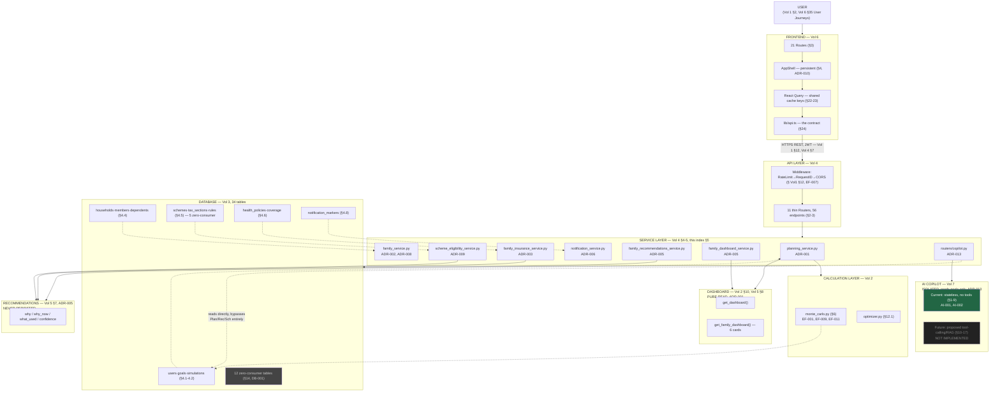

# ENGINEERING KNOWLEDGE INDEX

**The master navigation system over the Northstar Project Engineering Bible (Volumes 1–9) and `EngineeringFindingsSummary.md`.**
**Compiled:** 2026-07-10
**Purpose:** this document introduces **zero new technical content.** Every claim, fact, ID, and file reference below already exists in one of the ten source documents indexed here. This document's only job is to get any engineer from a question to the exact section, file, test, or finding that answers it — in under 60 seconds.

**How to use this index:** if you have a specific question, go straight to §15 (Search Guide). If you're new to the project, go to §14 (Reading Guides) and pick your role. If you need to find every reference to a table, service, route, or business rule, go to the matching index (§4–§10). If you need the full picture of how the system fits together, go to §16 (Dependency Map).

---

## 1. Executive Overview

### What documents exist

| Document | Short name used in this index | Size (sections) | Compiled |
|---|---|---|---|
| **Volume 1** — System Architecture Bible | `SystemArchitectureBible.md` | 18 sections | 2026-07-09 |
| **Volume 2** — Calculation & Financial Engine Bible | `CalculationEngineBible.md` | 16 sections | 2026-07-09 |
| **Volume 3** — Database & Schema Bible | `DatabaseSchemaBible.md` | 17 sections | 2026-07-09 |
| **Volume 4** — API & Service Interaction Bible | `APIServiceInteractionBible.md` | 15 sections | 2026-07-09 |
| **Volume 5** — Family, Government Scheme & Recommendation Engine Bible | `FamilyGovernmentSchemeRecommendationEngineBible.md` | 17 sections | 2026-07-10 |
| **Volume 6** — Frontend Architecture & User Experience Bible | `FrontendArchitectureUserExperienceBible.md` | 38 sections | 2026-07-10 |
| **Volume 7** — AI Copilot & Future AI Architecture Bible | `AICopilotFutureAIArchitectureBible.md` | 18 sections | 2026-07-10 |
| **Volume 8** — Project Owner's Handbook | `ProjectOwnersHandbook.md` | 17 sections | 2026-07-10 |
| **Volume 9** — Architecture Decision Record Bible | `ArchitectureDecisionRecordBible.md` | 17 sections | 2026-07-10 |
| **Companion** — Engineering Findings Summary | `EngineeringFindingsSummary.md` | 22 findings (EF-001–EF-022) | 2026-07-09 |

### When each should be used

| Situation | Open this document |
|---|---|
| "I need the full picture of how the system fits together" | Volume 1 |
| "I need the exact formula behind a number" | Volume 2 |
| "I need to know what a table does, or whether it's even used" | Volume 3 |
| "I need to know what an endpoint does, or what calls what" | Volume 4 |
| "I'm touching Family, Schemes, Insurance, or Recommendations" | Volume 5 |
| "I'm touching a screen, a component, or a form" | Volume 6 |
| "I'm touching the AI Copilot, or planning AI work" | Volume 7 |
| "I need to *act* — make a change, debug, extend, or plan a release" | Volume 8 |
| "I need to know *why* something is built the way it is" | Volume 9 |
| "I need a quick severity/status scan of every known issue" | `EngineeringFindingsSummary.md`, or §12 of this index |
| "I don't know which document I need" | This index — start at §14 or §15 |

### Who should read them

| Volume | Primary audience |
|---|---|
| 1 | Every engineer, on day one |
| 2 | Backend engineers touching any number; QA verifying a calculation |
| 3 | Backend engineers, DBAs, anyone writing a migration |
| 4 | Backend engineers, API consumers, integration testers |
| 5 | Backend and product engineers working in the Family domain |
| 6 | Frontend engineers, designers, accessibility reviewers |
| 7 | AI/ML engineers, anyone planning the Copilot roadmap |
| 8 | **Everyone who will actually operate this codebase day to day** — the practical entry point |
| 9 | Architects, tech leads, anyone asking "why is it like this" |
| Findings Summary | Engineering managers triaging technical debt |
| This index | Anyone who doesn't yet know which of the above they need |

---

## 2. Complete Documentation Map

```
Northstar Project Engineering Bible
├── Volume 1 — System Architecture Bible
│   └── The whole system, one layer at a time: stack, structure, request
│       lifecycles, feature inventory, module dependencies, state management,
│       security/performance posture, and 10 documented Design Decisions.
├── Volume 2 — Calculation & Financial Engine Bible
│   └── Every formula actually implemented — Monte Carlo mathematics, plan
│       health, savings rate, the Calculation Context/Lifecycle, risk
│       profiles, and the exact dependency chain between calculations and
│       recommendations.
├── Volume 3 — Database & Schema Bible
│   └── All 34 tables, every migration, every cascade/delete behavior, the
│       complete CRUD/service-ownership/API-usage matrices, and the 12
│       zero-consumer tables that look load-bearing but aren't (yet).
├── Volume 4 — API & Service Interaction Bible
│   └── All 56 endpoints, all 10 services, the complete service dependency
│       graph, authentication/validation pipelines, and a read-vs-write
│       classification of every single endpoint.
├── Volume 5 — Family, Government Scheme & Recommendation Engine Bible
│   └── The business-rule catalog (51 numbered rules) behind Family,
│       Schemes, Insurance, Recommendations, the Family Dashboard,
│       Notifications, and Audit Logging — why each rule exists, not just
│       what it does.
├── Volume 6 — Frontend Architecture & User Experience Bible
│   └── Every route, component, form, and user journey — 38 sections
│       covering routing, state management, accessibility, performance,
│       and a full click-to-code map for every major user action.
├── Volume 7 — AI Copilot & Future AI Architecture Bible
│   └── Exactly how the current, minimal AI Copilot works (one endpoint, no
│       memory, no tools), plus the fully-researched, clearly-labeled-as-
│       proposal future architecture (local Qwen, RAG, tool calling,
│       fine-tuning, safety, a five-stage roadmap).
├── Volume 8 — Project Owner's Handbook
│   └── The operating manual, not a reference — playbooks for adding
│       features, dependency chains for what breaks what, symptom-first
│       debugging trees, a maintenance checklist, and ~90 FAQ answers.
├── Volume 9 — Architecture Decision Record Bible
│   └── Why every major decision was made — 13 formal ADRs, every rejected
│       alternative, and the real incidents (PCA-1/2/3, the Global Shell
│       overlay bug) that became permanent architectural rules.
└── EngineeringFindingsSummary.md
    └── A flat, severity-sorted register of 22 findings (EF-001–EF-022)
        spanning Calculation, Security, Architecture, Performance, UX, and
        Data Model — the single fastest place to scan "what's currently
        wrong or worth knowing."
```

---

## 3. Knowledge Map

*(For each major subsystem: Volume → Chapter → Files → Tests → ADR → Finding, in that order — the exact chain the brief requested.)*

### Monte Carlo

Volume 2 §6 → `backend/app/services/monte_carlo.py` → `backend/tests/test_monte_carlo.py` → ADR-001 (Volume 9 §14) → EF-001, EF-009, EF-011 (Volume 2 §16 / `EngineeringFindingsSummary.md`)

### Goal Probability

Volume 2 §9 → `backend/app/services/planning_service.py` (`calculate_goal_probability`) → `backend/tests/test_planning_service.py::TestCalculateGoalProbability` → ADR-001 → EF-010

### Dashboard (money)

Volume 2 §10, Volume 4 §3.9 → `planning_service.get_dashboard` → `backend/tests/test_dashboard.py` → ADR-001 → EF-002, PCA-11/12 (Volume 9 §11)

### Family / Household

Volume 5 §2–§3 → `backend/app/services/family_service.py`, `backend/app/models/household.py` → `backend/tests/test_family_router.py` → ADR-002, ADR-008 (Volume 9 §14) → BUS-003 (Volume 5 §15)

### Government Schemes

Volume 5 §5 → `backend/app/services/scheme_eligibility_service.py`, `backend/scripts/seed_policy_data.py` → `backend/tests/test_scheme_eligibility_service.py` → ADR-009 (Volume 9 §14) → BUS-002, BUS-006 (Volume 5 §15)

### Insurance (80D)

Volume 5 §6, Volume 2 §11.1 → `backend/app/services/family_insurance_service.py` → `backend/tests/test_family_insurance.py` → ADR-003 (indirect, HUF ownership pattern) → BUS-001, BUS-004, BUS-005 (Volume 5 §15)

### Recommendations

Volume 5 §7, Volume 2 §11.3 → `backend/app/services/family_recommendations_service.py` → `backend/tests/test_family_recommendations.py` → ADR-005 (Volume 9 §14) → BUS-009 (Volume 5 §15)

### Family Dashboard (composed)

Volume 5 §8 → `backend/app/services/family_dashboard_service.py` → `backend/tests/test_family_dashboard.py` → ADR-005 (shares its "never persist" lineage) → EF-005 (audit scope), Volume 5 §14

### Notifications

Volume 5 §9, Volume 2 §11.4 → `backend/app/services/notification_service.py` → `backend/tests/test_notifications.py` → ADR-006 (Volume 9 §14) → EF-017

### Audit Logging

Volume 5 §10 → `backend/app/models/audit.py`, writers in `family_service.py`/`family_insurance_service.py` → (covered inside `test_family_router.py`/`test_family_insurance.py`) → — → EF-005

### AI Copilot (current)

Volume 7 §1–§9 → `backend/app/routers/copilot.py` → `backend/tests/test_copilot.py` → ADR-013 (Volume 9 §14) → AI-001, AI-002, AI-003, AI-004 (Volume 7 §17)

### AI Copilot (future/proposed)

Volume 7 §10–§17 → `AIAssistantResearch/00`–`13`, `AIArchitectureReport.md` (research documents, not code) → (eval harness not yet built) → — (future ADRs not yet written) → AI-007, AI-008

### Authentication

Volume 1 §12, Volume 4 §7 → `backend/app/services/auth_service.py`, `backend/app/middleware/auth.py` → `backend/tests/test_auth.py` → — → EF-018, EF-019, EF-020

### Frontend Routing & State

Volume 6 §3, §6, §22, §23 → `code/src/router.tsx`, `code/src/routes/*.tsx` → (no frontend test suite — Volume 6 §1) → ADR-010 (Volume 9 §14) → EF-006, EF-008, FE-005

### Global Shell (header)

Volume 1 §2.6, Volume 6 §4/§15/§16 → `code/src/components/app-shell.tsx`, `global-palette.tsx`, `notification-center.tsx` → live-verified only, no automated test → ADR-007, ADR-010 (Volume 9 §14) → EF-014 (resolved), EF-012

### Onboarding

Volume 6 §19 → `code/src/routes/onboarding.tsx`, `code/src/components/onboarding/*.tsx` → none automated → — → FE-002, FE-003 (Volume 6 §37), PCA-1/4/5/6/15 (Volume 9 §11)

### Reports

Volume 4 §3.16 → `backend/app/routers/reports.py` → `backend/tests/test_reports.py` → — → —

---

## 4. File Index

*(Grouped by domain. Only load-bearing files are listed individually — the 57-file shadcn `components/ui/` scaffold and the 34 model files' six-file grouping are summarized rather than enumerated one-by-one, consistent with Volume 6 §26's own treatment.)*

### Backend — Services

| File | Purpose | Volume | Chapter | Related ADR | Related Findings |
|---|---|---|---|---|---|
| `services/auth_service.py` | Password hashing + JWT lifecycle | Vol 4 | §4 | — | EF-019 |
| `services/planning_service.py` | Goal probability trigger + Dashboard read | Vol 1, Vol 2 | Vol1 §15.1-15.4, Vol2 §9-10 | ADR-001 | EF-001, EF-002, EF-010 |
| `services/monte_carlo.py` | The Monte Carlo engine | Vol 2 | §6 | ADR-001 | EF-001, EF-009, EF-011 |
| `services/optimizer.py` | Ranked improvement suggestions | Vol 2 | §12.1 | — | AI-005 (Vol 7, unwired offer) |
| `services/family_service.py` | Household/member CRUD, goal tagging | Vol 5 | §2, §3, §4 | ADR-002, ADR-008 | BUS-003 |
| `services/scheme_eligibility_service.py` | Scheme eligibility rules | Vol 5 | §5 | ADR-009 | BUS-002, BUS-006 |
| `services/family_insurance_service.py` | 80D recommendation | Vol 5 | §6 | ADR-003 (pattern) | BUS-001, BUS-004, BUS-005 |
| `services/family_recommendations_service.py` | Aggregation + conflict detection | Vol 5 | §7 | ADR-005 | BUS-009 |
| `services/family_dashboard_service.py` | 6-card composition | Vol 5 | §8 | ADR-005 (lineage) | — |
| `services/notification_service.py` | 5-source live notification read | Vol 5 | §9 | ADR-006 | EF-017 |

### Backend — Routers

| File | Purpose | Volume | Chapter |
|---|---|---|---|
| `routers/auth.py` | 10 auth endpoints | Vol 4 | §3.1-3.7 |
| `routers/goals.py` | 6 goal endpoints, incl. family-tags | Vol 4 | §3.8 |
| `routers/dashboard.py` | 1 endpoint | Vol 4 | §3.9 |
| `routers/simulate.py` | `/simulate`, `/simulate/optimize` | Vol 4 | §3.10-3.11 |
| `routers/copilot.py` | AI Copilot endpoint | Vol 4 §3.12, Vol 7 | §1-9 |
| `routers/profile.py` | Profile CRUD | Vol 4 | §3.13 |
| `routers/financials.py` | Income/Expenses/Assets/Liabilities CRUD | Vol 4 | §3.14 |
| `routers/assumptions.py` | Assumptions CRUD | Vol 4 | §3.15 |
| `routers/reports.py` | Reports summary | Vol 4 | §3.16 |
| `routers/family.py` | 13 Family-domain endpoints | Vol 4 §3.17-3.23, Vol 5 | throughout |
| `routers/notifications.py` | 3 notification endpoints | Vol 4 | §3.24 |

### Backend — Models (grouped)

| File(s) | Tables owned | Volume |
|---|---|---|
| `models/user.py`, `reset_token.py` | `users`, `password_reset_tokens` | Vol 3 §4.1 |
| `models/goal.py`, `simulation.py` | `goals`, `simulations` | Vol 3 §4.2 |
| `models/profile.py`, `assumptions.py`, `financials.py` | `user_profiles`, `financial_assumptions`, `income_sources`/`expenses`/`assets`/`liabilities` | Vol 3 §4.3 |
| `models/household.py` | `households`, `household_members`, `dependents` | Vol 3 §4.4 |
| `models/goal_household_member.py` | `goal_household_members` | Vol 3 §4.4 |
| `models/policy.py` | `schemes`, `scheme_rates`, `scheme_eligibility_rules`, `tax_acts`, `tax_sections`, `tax_regimes`, `tax_slabs`, `policy_citations` | Vol 3 §4.5 |
| `models/insurance.py` | `health_policies`, `health_policy_coverage` | Vol 3 §4.6 |
| `models/recommendation.py` | `recommendations`, `recommendation_citations` (unused) | Vol 3 §4.7 |
| `models/notification.py` | `notification_markers` | Vol 3 §4.8 |
| `models/audit.py` | `audit_logs` | Vol 3 §4.9 |
| `models/estate.py`, `company_policy.py` | 6 zero-consumer Future Module tables | Vol 3 §4.10 |

### Backend — Middleware / Infrastructure

| File | Purpose | Volume |
|---|---|---|
| `middleware/auth.py` | `get_current_user` dependency | Vol 1 §12, Vol 4 §7 |
| `middleware/rate_limit.py` | Token-bucket rate limiter | Vol 1 §12/§16, EF-007 |
| `middleware/request_id.py` | Correlation ID | Vol 1 §12 |
| `config.py` | All settings, incl. AI/OpenAI config | Vol 7 §1 |
| `database.py` | Async engine, session factory | Vol 3 §1 |
| `alembic/versions/001-009` | 9 migrations, all additive | Vol 3 §6 |
| `.github/workflows/ci.yml` | CI pipeline (lint/type/test/Docker) | EF-016 |

### Frontend — Routes (21)

Full table with `staticData.shellTitle` and purpose: Volume 6 §3's route tree, restated per-route in Volume 6 §5-§21. Summary list: `__root.tsx`, `index.tsx`, `auth.sign-in.tsx`, `auth.forgot-password.tsx`, `auth.reset-password.tsx`, `onboarding.tsx`, `app.tsx`, `app.index.tsx`, `app.goals.tsx`, `app.family.tsx`, `app.family.index.tsx`, `app.family.add.tsx`, `app.family.members.$id.tsx`, `app.family.goals.tsx`, `app.family.schemes.tsx`, `app.family.insurance.tsx`, `app.family.recommendations.tsx`, `app.copilot.tsx`, `app.profile.tsx`, `app.settings.tsx`, `app.reports.tsx`.

### Frontend — Shell / Shared Components

| File | Purpose | Volume |
|---|---|---|
| `components/app-shell.tsx` | Persistent sidebar/header | Vol 1 §2.6, Vol 6 §4 |
| `components/global-palette.tsx` | ⌘K Command Palette | Vol 1 §9, Vol 6 §15 |
| `components/notification-center.tsx` | Header bell | Vol 5 §9, Vol 6 §16 |
| `components/family/FamilyMemberForm.tsx` | Shared Add/Edit form | Vol 5 §11 BR-005, Vol 6 §9 |
| `components/dashboard/GoalSimPanel.tsx` | Goal detail slide-over | Vol 6 §8 |
| `components/dashboard/EducationPlanningSection.tsx` | Education cost projection | Vol 2 §3.2/§4, Vol 6 §19-adjacent |
| `components/dashboard/NetWorthProjection.tsx` | Deterministic projection chart | Vol 2 §2.2, FE-008 |
| `components/dashboard/NetWorthBreakdown.tsx` | Wealth donut chart | Vol 6 §7 |
| `components/onboarding/wizard-steps.tsx`, `list-steps.tsx` | 12-step onboarding wizard | Vol 6 §19 |

### Frontend — lib

| File | Purpose | Volume |
|---|---|---|
| `lib/api.ts` | The entire backend contract | Vol 6 §24 |
| `lib/mock-data.ts` | Fixtures | Vol 6 §1 |
| `lib/family.ts` | `relationshipLabel`/`relationshipIcon` | Vol 6 §26 |
| `lib/shell-title.ts` | `useShellTitle` escape hatch | Vol 6 §3 |
| `hooks/use-mobile.tsx` | `useIsMobile` (zero real consumer) | Vol 6 §26/§37 FE-006 |

### AI Research (design-stage, not code)

| File | Purpose | Volume |
|---|---|---|
| `AIArchitectureReport.md` | Earlier AI design synthesis (Intent Router concept) | Vol 7 §10 |
| `AIAssistantResearch/00`–`13` | 14-document evidence-tiered future-AI research series | Vol 7 §10-§17 |

### Root-level History Documents (partial list, the ones cited in Volume 9)

`PROJECT_STATE.md`, `CHANGELOG.md`, `MonteCarloConsistencyReport.md`, `ArchitectureDecisionRecord.md`, `ProductConsistencyAudit.md`, `FutureCompatibilityAuditReport.md` — see Volume 9 §17 for the full cross-reference table.

---

## 5. Service Index

| Service | Purpose | Volume | API | Database | Tests | Findings | ADR |
|---|---|---|---|---|---|---|---|
| `auth_service.py` | Password/JWT | Vol 4 §4 | `/auth/*` | `users`, `password_reset_tokens` | `test_auth.py` | EF-019 | — |
| `planning_service.py` | Calculation Lifecycle + Dashboard | Vol 2 §9-10, Vol 4 §4 | `/goals` (trigger), `/dashboard`, `/reports/summary` | `goals`, `assets`, `liabilities`, `income_sources`, `expenses` | `test_planning_service.py`, `test_dashboard.py` | EF-001, EF-002, EF-003, EF-009, EF-010, EF-011 | ADR-001 |
| `monte_carlo.py` | Simulation engine | Vol 2 §6 | (called by planning_service, simulate.py, optimizer.py) | none directly | `test_monte_carlo.py` | EF-001, EF-009, EF-011 | ADR-001 |
| `optimizer.py` | Ranked suggestions | Vol 2 §12.1 | `/simulate/optimize` | none | `test_simulate.py::TestOptimize` | — | — |
| `family_service.py` | Household/member CRUD, leaf service | Vol 5 §2-4, Vol 4 §4 | `/family/*` (most), `/goals/{id}/family-tags` | `households`, `household_members`, `dependents`, `goal_household_members` | `test_family_router.py`, `test_family_goal_tagging.py` | BUS-003, BUS-004 (adjacent) | ADR-002, ADR-008 |
| `scheme_eligibility_service.py` | Scheme rules | Vol 5 §5 | `/family/schemes`, inline in `/family/members` | `schemes`, `scheme_eligibility_rules` | `test_scheme_eligibility_service.py` | BUS-002, BUS-006 | ADR-009 |
| `family_insurance_service.py` | 80D recommendation | Vol 5 §6, Vol 2 §11.1 | `/family/insurance*` | `health_policies`, `health_policy_coverage`, `tax_sections` | `test_family_insurance.py` | BUS-001, BUS-004, BUS-005 | ADR-003 (pattern) |
| `family_recommendations_service.py` | Aggregation + conflicts | Vol 5 §7, Vol 2 §11.3 | `/family/recommendations` | reads only | `test_family_recommendations.py` | BUS-009 | ADR-005 |
| `family_dashboard_service.py` | 6-card composition | Vol 5 §8 | `/family/dashboard` | reads only | `test_family_dashboard.py` | — | ADR-005 (lineage) |
| `notification_service.py` | 5-source live read | Vol 5 §9, Vol 2 §11.4 | `/notifications*` | `notification_markers` | `test_notifications.py` | EF-017 | ADR-006 |

**Note on `routers/copilot.py`:** not a service-layer file (Volume 4 §1's own noted exception, alongside `profile.py`/`financials.py`/`assumptions.py`) — see Volume 7 for its full treatment instead of this table.

---

## 6. API Index

*(All 56 endpoints, grouped by domain exactly as Volume 4 §2 groups them. Each row: endpoint → Volume/Chapter → Service → primary Database table(s) → Frontend consumer → Tests → related ADR.)*

### Authentication (10)

| Endpoint | Service | DB | Frontend | Tests |
|---|---|---|---|---|
| `POST /auth/register` | `auth_service` | `users` | `onboarding.tsx` step 0 | `test_auth.py::TestRegister` |
| `POST /auth/login` | `auth_service` | `users` | `auth.sign-in.tsx` | `test_auth.py::TestLogin` |
| `POST /auth/refresh` | `auth_service` | — | `lib/api.ts` `apiFetch` (automatic) | `test_auth.py::TestRefresh` |
| `POST /auth/logout` | — | — | `app-shell.tsx` Sign Out | `test_auth.py` |
| `GET/PUT/DELETE /auth/me` | `auth_service` | `users` | `app.profile.tsx`, `app.settings.tsx` | `test_auth.py::TestMe` |
| `POST /auth/forgot-password` | `auth_service` | `password_reset_tokens` | `auth.forgot-password.tsx` | `test_auth.py` |
| `POST /auth/reset-password` | `auth_service` | `password_reset_tokens` | `auth.reset-password.tsx` | `test_auth.py` |
| `POST /auth/change-password` | `auth_service` | `users` | `app.settings.tsx` | `test_auth.py` |

Full deep-dive: Volume 4 §3.1-3.7. Auth flow diagram: Volume 4 §7, Volume 1 §12.

### Goals (6)

`GET/POST /goals`, `GET/PATCH/DELETE /goals/{id}`, `PUT /goals/{id}/family-tags` → `planning_service.py` + `family_service.py` (tags only) → `goals`, `goal_household_members` → `app.goals.tsx`, `GoalSimPanel.tsx`, `app.family.goals.tsx` → `test_goals.py`, `test_goal_inflation.py`, `test_family_goal_tagging.py` → **ADR-001** (probability trigger), **ADR-008** (tagging). Full deep-dive: Volume 4 §3.8, Volume 2 §7/§9.

### Dashboard (1)

`GET /dashboard` → `planning_service.get_dashboard` → 5 read-only queries → `app.index.tsx`, `app-shell.tsx` (shared cache) → `test_dashboard.py` → **ADR-001**. Full deep-dive: Volume 4 §3.9, Volume 2 §10.

### Simulation (2)

`POST /simulate`, `POST /simulate/optimize` → `monte_carlo.py`, `optimizer.py` → `simulations` → `GoalSimPanel.tsx` → `test_simulate.py` → —. Full deep-dive: Volume 4 §3.10-3.11, Volume 2 §6.9/§12.1.

### AI Copilot (1)

`POST /copilot` → inline (no service file) → `goals` (read only) → `app.copilot.tsx` → `test_copilot.py` → **ADR-013**. Full deep-dive: Volume 4 §3.12, Volume 7 §1-9.

### Profile (2)

`GET/PUT /profile` → inline → `user_profiles` → `app.profile.tsx` → `test_financials.py::TestProfile` → **ADR-004** (deprecation history). Full deep-dive: Volume 4 §3.13.

### Financials (14)

`GET/POST/DELETE /financials/income[/{id}]`, same shape for `expenses`, full CRUD for `assets`/`liabilities` → inline → 4 tables → onboarding list-steps → `test_financials.py` → —. Full deep-dive: Volume 4 §3.14.

### Assumptions (2)

`GET/PUT /assumptions` → inline → `financial_assumptions` → onboarding, Settings, `EducationPlanningSection.tsx` (partial) → `test_financials.py` → **ADR-004** (`tax_rate` deprecation). Full deep-dive: Volume 4 §3.15, EF-001/EF-003/EF-013.

### Reports (1)

`GET /reports/summary` → `planning_service.get_dashboard` (reused) → reads only → `app.reports.tsx` → `test_reports.py::test_dashboard_and_reports_show_identical_probability` → **ADR-001**. Full deep-dive: Volume 4 §3.16.

### Family (13)

`POST /family/onboarding-seed`, `GET /family`, `POST/PUT/GET/DELETE /family/members[/{id}]`, `GET /family/goals`, `GET/POST/PUT /family/insurance*`, `GET /family/recommendations`, `GET /family/dashboard`, `GET /family/schemes` → the full service trio (§5) → the full Family/Policy/Insurance table set (§7) → all `app.family.*.tsx` routes → `test_family_router.py` + 6 sibling test files → **ADR-002, ADR-003, ADR-005, ADR-008, ADR-009**. Full deep-dive: Volume 4 §3.17-3.23, all of Volume 5.

### Notifications (3)

`GET /notifications`, `POST /notifications/{source}/{key}/read`, `.../dismiss` → `notification_service.py` → `notification_markers` → `notification-center.tsx` → `test_notifications.py` → **ADR-006**. Full deep-dive: Volume 4 §3.24, Volume 5 §9.

### Health (1)

`GET /health` → inline in `main.py` → `SELECT 1` → — → — → —. Full deep-dive: Volume 4 §3.25.

---

## 7. Database Index

*(All 34 tables. Full per-table chapters live in Volume 3 §4 — this index gives the one-line cross-reference set for each.)*

| Table | Domain | Volume 3 Chapter | Services | API | Frontend | Findings |
|---|---|---|---|---|---|---|
| `users` | Auth | §4.1 | `auth_service.py` | `/auth/*` | Sign-in/up, all shell | — |
| `password_reset_tokens` | Auth | §4.1 | `routers/auth.py` inline | `/auth/forgot-password`, `/auth/reset-password` | Forgot/Reset pages | — |
| `goals` | Goals | §4.2 | `planning_service.py` | `/goals/*` | Goals, Dashboard, Family Goals, Palette | EF-004, EF-010 |
| `simulations` | Goals | §4.2 | `routers/simulate.py` inline | `/simulate` | GoalSimPanel | DB-007 |
| `user_profiles` | Financial | §4.3 | `routers/profile.py` inline | `/profile` | Onboarding, Profile | EF-013 (adjacent) |
| `income_sources`, `expenses`, `assets`, `liabilities` | Financial | §4.3 | `routers/financials.py` inline | `/financials/*` | Onboarding lists, Dashboard | DB-008 |
| `financial_assumptions` | Financial | §4.3 | `routers/assumptions.py` inline | `/assumptions` | Onboarding, Settings, EducationPlanningSection | EF-001, EF-003, EF-013 |
| `households` | Family | §4.4 | `family_service.py` | `/family*` | Family Home | — |
| `household_members` | Family | §4.4 | `family_service.py`, `family_insurance_service.py` | `/family/members*` | Family screens | DB-004 (`role` dead) |
| `dependents` | Family | §4.4 | `family_service.py`, `scheme_eligibility_service.py` | `/family/members*` | Add/Edit Member | — |
| `goal_household_members` | Family | §4.4 | `family_service.py` | `/goals/{id}/family-tags`, `/family/goals` | Family Goals tagging | — |
| `schemes` | Schemes | §4.5 | `scheme_eligibility_service.py` | `/family/schemes` | Government Schemes | — |
| `scheme_rates` | Schemes | §4.5 | **none** | none | none | DB-001 |
| `scheme_eligibility_rules` | Schemes | §4.5 | `scheme_eligibility_service.py` | `/family/schemes` | Government Schemes | — |
| `tax_acts` | Schemes | §4.5 | **none** | none | none | DB-001 |
| `tax_sections` | Schemes | §4.5 | `family_insurance_service.py` | `/family/insurance` | Family Insurance | DB-003 |
| `tax_regimes`, `tax_slabs` | Schemes | §4.5 | **none** | none | none | DB-001 |
| `policy_citations` | Schemes | §4.5 | **none** | none | none | DB-001 |
| `health_policies` | Insurance | §4.6 | `family_insurance_service.py` | `/family/insurance*` | Family Insurance | DB-006 |
| `health_policy_coverage` | Insurance | §4.6 | `family_insurance_service.py` | `/family/insurance*` | Family Insurance | DB-005 |
| `recommendations`, `recommendation_citations` | Recommendations | §4.7 | **none** | none | none | DB-001, EF-015 |
| `notification_markers` | Notifications | §4.8 | `notification_service.py` | `/notifications*` | Notification Center | — |
| `audit_logs` | Audit | §4.9 | `family_service.py`, `family_insurance_service.py` | none direct | none direct | EF-005 |
| `huf_entities`, `huf_coparceners` | Future | §4.10 | **none** | none | none | DB-001, EF-015 |
| `nominees` | Future | §4.10 | **none** | none | none | DB-001, EF-015 |
| `estate_documents` | Future | §4.10 | **none** | none | none | DB-001, EF-015 |
| `best_practice_rules`, `company_policies` | Future | §4.10 | **none** | none | none | DB-001, EF-015 |

**Zero-consumer tables, one-glance list (12 total):** `scheme_rates`, `tax_acts`, `tax_regimes`, `tax_slabs`, `policy_citations`, `recommendations`, `recommendation_citations`, `huf_entities`, `huf_coparceners`, `nominees`, `estate_documents`, `best_practice_rules`, `company_policies` — full evidence: Volume 3 §14, EF-015.

---

## 8. Frontend Index

### Routes (21) — see Volume 6 §3 for the full tree; this index adds the cross-reference columns the brief requested

| Route | Volume 6 §§ | API called | Service (backend) | Tests |
|---|---|---|---|---|
| `/` (Landing) | §5-adjacent | none | — | none |
| `/auth/sign-in` | §5 | `auth.login` | `auth_service.py` | `test_auth.py` (backend only) |
| `/auth/forgot-password`, `/auth/reset-password` | §5 | `auth.forgotPassword`/`resetPassword` | `auth_service.py` | `test_auth.py` |
| `/onboarding` | §19 | `auth.register/login`, `api.upsertProfile`, `api.seedFamilyOnboarding`, `api.createIncome/Expense/Asset/Liability`, `api.createGoal`, `api.upsertAssumptions` | `family_service.py`, `planning_service.py` | multiple backend test files |
| `/app` (layout) | §4 | `auth.me`, `api.getDashboard` (shared) | `auth_service.py`, `planning_service.py` | — |
| `/app` (Dashboard) | §7 | `api.getDashboard`, `api.getGoals`, `api.getFamilyDashboard` | `planning_service.py`, `family_dashboard_service.py` | `test_dashboard.py` |
| `/app/goals` | §8 | `api.getGoals/createGoal/updateGoal/deleteGoal`, `api.simulate/optimize` | `planning_service.py`, `monte_carlo.py`, `optimizer.py` | `test_goals.py`, `test_simulate.py` |
| `/app/family` (layout+home) | §9 | `api.getFamilyHome`, `api.getFamilyDashboard` | `family_service.py`, `family_dashboard_service.py` | `test_family_router.py`, `test_family_dashboard.py` |
| `/app/family/add` | §9 | `api.createFamilyMember` | `family_service.py` | `test_family_router.py` |
| `/app/family/members/:id` | §9 | `api.getFamilyMember/updateFamilyMember/deleteFamilyMember` | `family_service.py` | `test_family_router.py` |
| `/app/family/goals` | §9 | `api.getFamilyGoals`, `api.setGoalFamilyTags` | `family_service.py` | `test_family_goal_tagging.py` |
| `/app/family/schemes` | §10 | `api.getFamilySchemes` | `scheme_eligibility_service.py` | `test_scheme_eligibility_service.py` |
| `/app/family/insurance` | §11 | `api.getFamilyInsurance/createInsurancePolicy/updatePolicyCoverage` | `family_insurance_service.py` | `test_family_insurance.py` |
| `/app/family/recommendations` | §12 | `api.getFamilyRecommendations` | `family_recommendations_service.py` | `test_family_recommendations.py` |
| `/app/copilot` | §14 | `api.chat`, `auth.me` | `routers/copilot.py` | `test_copilot.py` |
| `/app/profile` | §17 | `auth.me`, `api.getFamilyHome`, `auth.updateMe` | `family_service.py`, `auth_service.py` | `test_auth.py` |
| `/app/settings` | §18 | `auth.changePassword`, `auth.deleteAccount` | `auth_service.py` | `test_auth.py` |
| `/app/reports` | §13 | `api.getReportSummary` | `planning_service.py` | `test_reports.py` |

### Shell Components

`AppShell` (§4), `GlobalPalette` (§15), `NotificationCenter` (§16) — see §4/§5 of this index for file paths.

### Hooks

`useIsMobile` (`hooks/use-mobile.tsx`) — Volume 6 §26/§28, flagged zero-real-consumer in §37 FE-006.

### Forms (18, full inventory)

Volume 6 §20's table — Sign in, Forgot/Reset Password, 8 onboarding steps, New/Edit Goal, Add/Edit Family Member, Add Insurance Policy, Change Password, Custom Inflation Rate, Family Goal Tagging, Policy Coverage Edit.

---

## 9. Calculation Index

*(Every formula, cross-referenced to its exact Volume 2 section and implementing file.)*

| Formula / Algorithm | Volume 2 §§ | File | Function |
|---|---|---|---|
| Compound growth (single lump sum) | §2.1 | `EducationPlanningSection.tsx` | `projectedCost` |
| Future value of a growing series (lump sum + annuity) | §2.2 | `NetWorthProjection.tsx` | `project` |
| Log-normal monthly return sampling (Itô-corrected) | §2.3, §6.3 | `monte_carlo.py` | `run_simulation` |
| Portfolio compounding with contributions (path evolution) | §2.4 | `monte_carlo.py` | `run_simulation` |
| Success rate + percentile extraction | §2.5 | `monte_carlo.py` | `run_simulation` |
| Plan health score (target-amount-weighted average) | §2.6 | `planning_service.py` | `compute_plan_health` |
| Savings rate | §2.7 | `planning_service.py` | `get_dashboard` |
| Net worth | §2.8 | `planning_service.py` | `get_dashboard` |
| Years-to-goal (backend, day-count) | §3.1 | `planning_service.py` | `calculate_goal_probability` |
| Years-to-goal (frontend, calendar-year — inconsistent, EF-004) | §3.1 | `GoalSimPanel.tsx` | `goalToEditForm` |
| Years-to-goal (frontend, ms-based — a 3rd variant, EF-004) | §3.1 | `EducationPlanningSection.tsx` | `yearsUntil` |
| Custom inflation rate (display-only) | §3.2, §4 | `EducationPlanningSection.tsx` | (component body) |
| Monte Carlo end-to-end formula | §6.3 | `monte_carlo.py` | `run_simulation` |
| Calculation Context (the recalculation trigger set) | §7 | `planning_service.py` | `CALCULATION_CONTEXT_FIELDS` |
| Risk profile parameters (`PROFILE_PARAMS`) | §8 | `monte_carlo.py` | module-level dict |
| Goal probability + on-track derivation (70% threshold) | §9 | `planning_service.py` | `calculate_goal_probability` |
| Dashboard suggestions (rule-based, thresholds 50/70/15) | §10 | `planning_service.py` | `_generate_suggestions` |
| 80D base limit read + senior-citizen doubling | §11.1, Vol 5 §6.3 | `family_insurance_service.py` | `_base_80d_limit`, `compute_insurance_recommendation` |
| Exact-calendar age calculation | §11.2, Vol 5 §5.2 | `scheme_eligibility_service.py` | `age_years` |
| Scheme rule evaluation (max_age/min_age/gender) | §11.2, Vol 5 §5.5 | `scheme_eligibility_service.py` | `_evaluate_rules_for_member` |
| Recommendation conflict detection (set grouping) | §11.3, Vol 5 §7.6 | `family_recommendations_service.py` | `_detect_conflicts` |
| Optimizer contribution/risk-shift search | §12.1 | `optimizer.py` | `generate_suggestions` |

**Findings tied to this index:** EF-001, EF-002, EF-003, EF-004, EF-009, EF-010, EF-011 (Volume 2 §16 / `EngineeringFindingsSummary.md`).

---

## 10. Business Rule Index

*(All 51 rules from Volume 5 §11, grouped by domain. Full text — trigger/conditions/outcome/evidence/tests — lives in Volume 5 §11; this index gives the ID → one-line summary → domain grouping the brief requested.)*

### Family / Household (BR-001–BR-013)

| ID | Summary |
|---|---|
| BR-001 | One household per user, lazily created |
| BR-002 | `self` member protected from edit/delete |
| BR-003 | `self` member name resolved from `User.full_name`, never duplicated |
| BR-004 | Every non-`self` member gets exactly one `Dependent` row |
| BR-005 | Relationship-type-dependent field validation |
| BR-006 | `date_of_birth` sanity bounds |
| BR-007 | Completeness definition (`is_complete`) |
| BR-008 | Idempotent onboarding seeding |
| BR-009 | Exactly one parent placeholder from onboarding regardless of count |
| BR-010 | `children_count` required and bounded (1-10) |
| BR-011 | Cross-household isolation (404, never 403) |
| BR-012 | `goal_household_members` is descriptive, never ownership |
| BR-013 | Full tag-set replacement, cross-household validated |

### Government Schemes (BR-014–BR-020)

| ID | Summary |
|---|---|
| BR-014 | Only SSY and SCSS are ever evaluable |
| BR-015 | SSY eligibility (female, exact age <10) |
| BR-016 | SCSS eligibility (age ≥60, 5-year potentially-eligible window) |
| BR-017 | `closed_to_new` schemes always ineligible |
| BR-018 | `self` members excluded from scheme evaluation |
| BR-019 | Missing data never guessed (schemes) |
| BR-020 | Inline SSY callout is positive-only |

### Insurance (BR-021–BR-029)

| ID | Summary |
|---|---|
| BR-021 | 80D base limit never fabricated |
| BR-022 | Insurance gap qualification (3-condition gate) |
| BR-023 | `not_sure` treated identically to `no` |
| BR-024 | Senior-citizen 80D doubling |
| BR-025 | Unknown age never assumed senior |
| BR-026 | Insurance confidence is two-tier |
| BR-027 | A policy must cover at least one person |
| BR-028 | Policy coverage validated against caller's own household |
| BR-029 | No policy deletion exists |

### Recommendations (BR-030–BR-035)

| ID | Summary |
|---|---|
| BR-030 | Recommendation aggregation performs zero original calculation |
| BR-031 | Conflict requires shared subject AND shared `reference_code` |
| BR-032 | Conflicts are additive, never suppressive |
| BR-033 | Reference codes ground, never display |
| BR-034 | Every recommendation is fully explained |
| BR-035 | Recommendations are never persisted |

### Dashboard (BR-036–BR-042)

| ID | Summary |
|---|---|
| BR-036 | Dashboard shares two fetches across six cards |
| BR-037 | Per-card graceful degradation |
| BR-038 | `recommendations_unavailable` distinct from "empty" |
| BR-039 | Education card shows only future-dated goals |
| BR-040 | Retirement card picks first retirement goal by existing ordering |
| BR-041 | Parents card and insurance recommendation share one authority |
| BR-042 | Emergency card is a verbatim passthrough |

### Notifications (BR-043–BR-049)

| ID | Summary |
|---|---|
| BR-043 | Exactly five notification sources |
| BR-044 | Notification reads never write |
| BR-045 | `family_member_added` has a 30-day window |
| BR-046 | `goal_completed`/`goal_at_risk` mutually exclusive per goal |
| BR-047 | Dedupe key is a deterministic identity, not content |
| BR-048 | Dismissal is permanent regardless of the fact's continued existence |
| BR-049 | Exactly two writes in the Notification domain |

### Audit (BR-050–BR-051)

| ID | Summary |
|---|---|
| BR-050 | Audit logging scoped to 7 action types, 2 services |
| BR-051 | Reads never audit-log |

---

## 11. ADR Index

*(All 13 ADRs from Volume 9 §14. Full Context/Alternatives/Consequences text lives there — this index adds the Status/Dependencies columns the brief requested.)*

| ADR | Title | Status | Related Code | Related Findings | Related Volumes | Dependencies |
|---|---|---|---|---|---|---|
| ADR-001 | Goal Probability Recalculation Trigger | Accepted & Implemented (source doc's own status field stale — see Vol 9 §14 note) | `planning_service.py`, `routers/goals.py` | EF-010, EF-011, PCA-3 | Vol 1 §15.2/15.4, Vol 2 §9/10, Vol 9 §14 | None (foundational) |
| ADR-002 | Household as Aggregator, Never Owner | Accepted & Implemented (Milestone 1) | `models/household.py`, `family_service.py` | EF-022 | Vol 3 §4.4, Vol 5 §2 | None |
| ADR-003 | Nullable Sibling Column for HUF Ownership | Accepted & Implemented (Foundation Reconciliation) | `models/financials.py`, migration 006 | EF-021 | Vol 1 §15.7, Vol 3 §5 | Depends on ADR-002's aggregation principle |
| ADR-004 | Deprecate-in-Place Rather Than Remove | Accepted & Implemented (Foundation Reconciliation; extended by Rule 11 during Stabilization Sprint) | `models/profile.py`, `models/assumptions.py` | EF-013, PCA-2 | Vol 1 §16, Vol 3 §4.1/4.3 | Directly produced by the same incident as ADR-001's sprint |
| ADR-005 | Recommendations Computed Live, Never Persisted | Accepted & Implemented (Milestone 2, Tasks 10-11) | `family_insurance_service.py`, `family_recommendations_service.py` | EF-015 | Vol 5 §6.7/7.12, Vol 3 §4.7 | **Directly derived from ADR-001** |
| ADR-006 | Notification Markers Store State, Never Content | Accepted & Implemented (Phase 3) | `notification_service.py`, `models/notification.py` | EF-017 | Vol 5 §9, Vol 3 §4.8 | **Directly derived from ADR-001/ADR-005** |
| ADR-007 | Single `activeOverlay` State for Global Shell Overlays | Accepted & Implemented (M2.6.1) | `app-shell.tsx`, `notification-center.tsx` | EF-014 | Vol 1 §15.8, Vol 6 §4 | Depends on ADR-010 (Persistent AppShell) existing first |
| ADR-008 | Goal Tagging as Descriptive, Never Ownership | Accepted & Implemented (Milestone 2, Task 1/8) | `models/goal_household_member.py` | — | Vol 5 §4/11 BR-012, Vol 3 §4.4 | Depends on ADR-002 |
| ADR-009 | `VARCHAR` Over `ENUM` for New Policy-Engine Fields | Accepted & Implemented (Milestone 1) | `models/policy.py`, `models/household.py` | (Future Compat. Finding H/I) | Vol 3 §4.5 | None |
| ADR-010 | AppShell Persistent Mount | Accepted & Implemented (Global Shell Phase 0) | `app.tsx`, `app-shell.tsx` | EF-008 (contrast case) | Vol 1 §13, Vol 6 §4 | Prerequisite for ADR-007 |
| ADR-011 | Deferred Schema Domains at Milestone 1 | Accepted & Implemented (Milestone 1 Decision Log) | — (a non-build decision) | EF-015 | Vol 3 §14, Vol 7 §1 | None |
| ADR-012 | HUF Entities Included Ahead of Their Own Milestone | Accepted & Implemented (Milestone 1) | `models/estate.py` | EF-015 | Vol 1 §17, Vol 3 §4.10 | Produced the need for ADR-003 |
| ADR-013 | Rule-Based Fallback as a First-Class AI Requirement | Accepted & Implemented (pre-Milestone-2 Backend Foundation) | `copilot.py` | AI-005, PCA-8 | Vol 7 §1/6 | None |

**Rejected alternatives register (not formal ADRs, but named and evidenced):** Volume 9 §11 — 13 rejected approaches, including background-job recalculation, persisted recommendations, real-time notifications, co-owned goals, and an LLM framework for AI tool calling.

---

## 12. Findings Index

*(Every finding across all six ID families — EF, DB, API, BUS, FE, AI — merged into one register, sorted first by severity, then grouped by category. 71 findings total: 22 EF + 11 DB + 9 API + 10 BUS + 11 FE + 8 AI.)*

### High Severity (7)

| ID | Category | Area | Title | Status | Volume |
|---|---|---|---|---|---|
| EF-001 | Calculation | Backend | `financial_assumptions.expected_return_*` fully disconnected from Monte Carlo | Open | EF Summary, Vol 2 §15 |
| EF-014 | Architecture | Frontend | Global Shell overlays could be simultaneously open | **Resolved (M2.6.1 / ADR-007)** | EF Summary, Vol 1 §15.8 |
| FE-001 | UX/Trust | Frontend | Landing/Sign-in pages market SOC 2/AES-256/OAuth linking as live capabilities | Open | Vol 6 §37 |
| FE-002 | UX/Trust | Frontend | Onboarding claims assumptions "power every projection" | Open | Vol 6 §37 |
| AI-001 | Correctness | AI | Conversation history never sent to the model, even within one session | Open | Vol 7 §17 |
| AI-002 | Coverage | AI | Copilot has zero access to 5 of 6 major domains | Open | Vol 7 §17 |
| — | (Historical, resolved) | Calculation | PCA-3 — Goal probability changed depending on last screen visited | **Resolved (ADR-001)** | Vol 9 §11/§15 |

### Medium Severity (24)

| ID | Category | Area | Title | Status |
|---|---|---|---|---|
| EF-002 | Calculation | Frontend | `NetWorthProjection.tsx` hardcoded rates disconnected from assumptions | Open |
| EF-003 | Calculation | Backend | `retirement_age`/`social_security_monthly` zero calculation consumers | Open |
| EF-004 | Calculation | Full-stack | `years_to_goal` computed 3 inconsistent ways | Open |
| EF-005 | Security | Backend | Audit logging scoped to Family domain only | Open (scoped by design) |
| EF-006 | Architecture | Frontend | No frontend automated test suite | Open |
| EF-007 | Performance | Backend | Rate limiter in-memory, single-process only | Open (documented trade-off) |
| EF-008 | Performance | Frontend | Two frontend pages bypass shared React Query cache | Open (expanded — see FE-005) |
| DB-001 | Data Model | Database | 12 zero-consumer tables | Documented, no action needed |
| DB-002 | Data Model | Database | `financial_assumptions` fields stored, zero calculation readers | Open (same root as EF-001) |
| API-001 | Security | API | Logout doesn't revoke still-valid access token | Open (standard JWT trade-off) |
| API-002 | Consistency | API | `income`/`expenses` lack `PATCH` | Open |
| BUS-001 | Data Freshness | Database | `tax_sections` read without effective-date filtering | Open |
| BUS-002 | Coverage Gap | Schemes | SCSS 55+/50+ routes deliberately unseeded | Documented gap |
| BUS-003 | UX | Onboarding | Only one parent placeholder seeded regardless of count | Likely accidental |
| BUS-006 | Performance | Schemes | Unconditional full-catalog load in eligibility evaluation | Non-issue today, future risk |
| BUS-009 | Precision | Recommendations | Conflict `reference_code` granularity is coarse | Deliberate scope boundary |
| FE-005 | Performance | Frontend | 4 screens bypass React Query entirely | Open |
| FE-006 | Dependency Hygiene | Frontend | `react-hook-form`/Zod-resolver/Sidebar hook declared, zero real consumers | Open |
| FE-011 | Performance | Frontend | `EducationPlanningSection` sequential N+1 fetch loop | Open |
| AI-003 | Consistency | AI/Frontend | Dashboard "AI Copilot" card is pure rule-based logic, inconsistently labeled | Open |
| AI-004 | Cost Control | AI | `/copilot` not in the rate limiter's tightened-bucket list | Open |
| PCA-4–PCA-6, PCA-10 | Product Consistency | Frontend | U.S.-only account types, currency symbol, flat tax-rate field, unexplained Plan Health | Open (Vol 9 §11) |
| PCA-11, PCA-12, PCA-16 | Product Consistency | Frontend | Net Worth headline/chart mismatch, triplicated Plan Health, unexplained jargon | Open (Vol 9 §11) |

### Low Severity (18)

| ID | Category | Title |
|---|---|---|
| EF-009 | Calculation | `ANNUAL_INFLATION` dead code |
| EF-010 | Calculation | 70% threshold hardcoded, non-configurable |
| EF-011 | Calculation | No golden-value Monte Carlo regression test |
| EF-012 | UX | Command Palette can't deep-link to Goal/Scheme/Insurance detail |
| EF-013 | Data Model | `financial_assumptions.tax_rate` deprecated, not removed |
| DB-003 through DB-011 (minus DB-001/DB-002 above) | Data Model | Effective-date filter gap, dead `role` column, missing uniqueness constraint, no policy-delete endpoint, write-only `simulations`, no PATCH for income/expenses, positive FK-behavior confirmations | See Vol 3 §16 |
| API-003 through API-009 | API | `/profile` vs `/assumptions` inconsistency, no policy-delete, uncaught `IntegrityError`, positive confirmations (auth chokepoint, refresh dedup, dashboard/reports parity, `/health` exclusion) | See Vol 4 §14 |
| BUS-004, BUS-005, BUS-007, BUS-008, BUS-010 | Data Model / UX | `health_policy_coverage` no uniqueness constraint, no policy-delete endpoint, staleness protection gap, hardcoded notification window, no RBAC (positive-by-absence) | See Vol 5 §15 |
| FE-004, FE-007, FE-009, FE-010 | UX | Spouse-DOB hint overstates real effect, no dark/light toggle (deliberate), Palette deep-link limitation (documented), Delete-account copy overstates guarantee | See Vol 6 §37 |
| AI-006 | Code Quality | `copilot.py` re-implements "active goals" filter independently | See Vol 7 §17 |
| PCA-13, PCA-14, PCA-15 | Product Consistency | Delete-account contradiction, competing landing CTAs, children-count placeholder ambiguity | See Vol 9 §11 |

### Info (positive confirmations / intentional patterns) (22)

`EF-015` through `EF-022`, `DB-009`/`DB-010` (positive), `API-006` through `API-009` (positive), `AI-007`/`AI-008` (informational), `PCA-7` (expected sequencing, resolved) — full text in each volume's own Findings section. **The single most repeated theme across every "Info" finding:** this codebase's own audit discipline confirms its own security/architecture patterns hold consistently (ownership checks inlined, cross-user isolation live-tested, CSRF double-submit correctly implemented, thin routers with zero exceptions beyond 3 named CRUD files).

**Cross-domain pattern worth naming once, here:** the single most-repeated *root cause* across all 71 findings is the same one Volume 9 §11's "Calculation" category summary already names for the EF register specifically — several independent numeric-assumption surfaces (`financial_assumptions`, `NetWorthProjection.tsx`, onboarding copy) were each built correctly in isolation but never integrated with each other or with the Monte Carlo engine. EF-001, EF-002, EF-003, EF-009, EF-010, FE-002, FE-003, PCA-6, PCA-10 are all variants of this one pattern.

---

## 13. Glossary

*(Merged from every volume's own Glossary section — Volume 1 §18, Volume 3 §17, Volume 4 §15, Volume 5 §17, Volume 6 §38, Volume 7 §18 — deduplicated where the same term appears in more than one volume, in which case the most complete definition is kept and every contributing volume is cited.)*

| Term | Meaning | Source Volume(s) |
|---|---|---|
| **Calculation Context** | The 5 `Goal` fields (`current_amount`, `monthly_contribution`, `target_date`, `risk_profile`, `target_amount`) whose change is the only trigger for Monte Carlo recalculation | Vol 1, Vol 2 §7 |
| **ADR-001** | The decision record establishing the Calculation Lifecycle rule | Vol 1, Vol 9 |
| **Household** | The family-grouping entity; aggregates existing per-user data, never a second source of truth | Vol 1, Vol 3, Vol 5 |
| **Dependent** | A per-`HouseholdMember` row carrying DOB, gender, tax-dependent status | Vol 1, Vol 3, Vol 5 |
| **Karta** | The managing member of an HUF — schema-only, not yet consumer-connected | Vol 1, Vol 3, Vol 5 |
| **80D** | The Income Tax Act section governing health-insurance-premium deductions | Vol 1, Vol 5 |
| **Reference Code** | A grounding string ("80D", "80C/123") used by conflict detection, never shown to the user as-is | Vol 1, Vol 5 |
| **Notification Marker** | The row storing only seen/read/dismissed state, never notification content | Vol 1, Vol 3, Vol 5 |
| **Active Overlay** | The single-state variable structurally guaranteeing only one header overlay is open | Vol 1, Vol 6 |
| **Global Shell** | The umbrella term for the persistent AppShell + Command Palette + Notification Center + Profile Menu | Vol 1, Vol 6 |
| **Plan Health Score** | A 0-100 target-amount-weighted average of every active goal's probability | Vol 1, Vol 2 |
| **On Track** | `probability >= 70.0` — the single hardcoded threshold | Vol 1, Vol 2 |
| **Effective-Dated / Versioned Data** | The `effective_from`/`effective_to` pattern used throughout the Government Schemes domain | Vol 1, Vol 3, Vol 5 |
| **CSRF Double-Submit** | The refresh-cookie + JS-readable-CSRF-cookie pattern | Vol 1 |
| **Token Bucket** | The rate-limiting algorithm | Vol 1 |
| **Additive Migration** | A migration that only creates/adds, never alters or drops | Vol 3 |
| **Soft Delete** | Setting `is_active = false` rather than `DELETE FROM` | Vol 3 |
| **Descriptive Tag (vs. Ownership)** | `goal_household_members`'s explicit, repeated characterization | Vol 3, Vol 5 |
| **Coparcener** | A household member with a legal stake in an HUF | Vol 3, Vol 5 |
| **Dedupe Key** | A deterministic `uuid5` hash giving a live-computed fact a stable identity for read/dismiss tracking | Vol 3, Vol 5 |
| **Zero-Consumer Table** | A fully migrated table with no reader/writer in any router or service | Vol 3 |
| **`ON DELETE CASCADE` vs. `SET NULL`** | This schema's two FK deletion behaviors; `SET NULL` used exactly once, for `huf_entity_id` | Vol 3 |
| **Partial Index** | An index built with a `WHERE` clause restricting coverage | Vol 3 |
| **Thin Router** | A router that validates, calls at most one service function, returns a schema | Vol 4 |
| **Shared In-Flight Promise** | `_refreshPromise` — ensures concurrent 401s trigger exactly one refresh call | Vol 4 |
| **Graceful Degradation** | The `_safe()` wrapper pattern — one card's failure never takes down the rest | Vol 4, Vol 5 |
| **Composition Service** | A service that calls other services but performs no calculation of its own | Vol 4 |
| **Leaf Service** | A service that calls no other service | Vol 4 |
| **Idempotent Seeding** | The onboarding-seed guarantee against duplicate placeholder members | Vol 4, Vol 5 |
| **Write-Only Endpoint** | `POST /simulate` — persists a row but nothing ever lists it back | Vol 4 |
| **Placeholder Member** | A `HouseholdMember` with no name/DOB yet, rendered with a "not yet named" affordance | Vol 5, Vol 6 |
| **Calculation-Lite Fact Application** | This codebase's own term for Insurance/Scheme recommendations — never a Milestone-5 general Recommendation Engine output | Vol 5, Vol 7 |
| **Potentially Eligible Window** | The 5-year, product-decided buffer before a `min_age` threshold | Vol 5 |
| **Senior Citizen (in this codebase)** | Exactly age ≥ 60, computed via exact-calendar arithmetic | Vol 5 |
| **Recommendation Conflict** | Two recommendations sharing both a subject and a reference code — additive, never suppressive | Vol 5 |
| **Disclosure Pattern** | Repeated use of a native `<details>`/`<summary>` for secondary/negative information | Vol 6 |
| **Reassurance-Forward Copy** | The consistent pattern of pairing every error/empty state with a "your data is safe" statement | Vol 6 |
| **RQ-Bypassing Screen** | Volume 6's shorthand for a screen using raw `useEffect` instead of `useQuery` | Vol 6 |
| **Mock Mode** | The `BASE_URL` unset state — every API call resolves a fixture instead of a real backend | Vol 6 |
| **Truth Hierarchy (T0-T3)** | The proposed 4-tier authority model for a future AI layer — **not implemented** | Vol 7 |
| **Grounding Validator** | A proposed deterministic, non-LLM function blocking any AI reply with an unverified number — **not implemented** | Vol 7 |
| **Tool Registry** | A proposed thin façade mapping AI tool calls to existing certified services — **not implemented** | Vol 7 |
| **QLoRA** | The recommended future fine-tuning technique, evidence-gated, format/voice only — **not implemented** | Vol 7 |
| **`LLM_PROVIDER`** | A proposed settings value generalizing the OpenAI-key presence check into an explicit provider switch — **not implemented** | Vol 7 |
| **Dogfooding Cohort** | The proposed V1 AI exposure strategy — a user allowlist, not public default-on | Vol 7 |
| **`calculate_tax` Gap** | The one proposed AI tool with no existing backing service anywhere in this codebase | Vol 7 |
| **Write Tool** | A proposed V4-only AI capability that actually mutates data, deferred behind 3 full read-only versions | Vol 7 |

---

## 14. Reading Guides

*(Each path assumes ~1-2 hours total. Follow in the listed order — each volume builds on the previous.)*

### New Backend Developer

Volume 1 (whole system) → Volume 3 (schema you'll be querying) → Volume 4 (endpoints you'll be building) → Volume 9 (why it's shaped this way) → **then** Volume 8 §5 (Adding a New Feature playbooks) as a working reference.

### AI Engineer

Volume 2 §6-9 (what the Copilot may one day narrate) → Volume 5 §7 (the Recommendation Engine's structured-explanation pattern the AI research explicitly builds on) → Volume 7 (whole volume) → Volume 9 §8 (why every AI decision was made this way).

### Frontend Developer

Volume 1 §2/§11 (product shape + state management) → Volume 6 (whole volume) → Volume 4 §2 (the API contract you're calling) → Volume 8 §6 (Safe Modification Guide, frontend rows) as ongoing reference.

### Product Manager

Volume 1 §1-2 (Executive Summary + Product Overview) → Volume 5 §1 (Business Domain Overview) → `EngineeringFindingsSummary.md` (what's actually true vs. what the product implies — read this before promising anything) → Volume 9 §11-12 (Decisions Rejected + Evolution, for "why don't we have X yet").

### QA / Test Engineer

Volume 1 §14 (Testing Overview) → Volume 2 §6.8 (property-testing philosophy for stochastic code) → Volume 5 §13 (Edge Cases) → Volume 6 §1/§27 (frontend test-suite absence, accessibility gaps) → §12 of this index (the full findings register, as a test-planning input).

### Security Engineer

Volume 1 §12 (Security Overview) → Volume 3 §13 (Database Security) → Volume 4 §12 (API Security) → Volume 7 §15 (proposed AI Safety Architecture, for future-planning) → §12 of this index, filtered to Security-category findings (EF-005, EF-007, EF-018, EF-019, EF-020, API-001).

### DevOps / Infrastructure Engineer

Volume 1 §4/§13 (Tech Stack + Performance) → Volume 8 §14 (Maintenance Checklist) → Volume 8 §15 (Future Vision — 100k/1M/enterprise scaling) → EF-007, EF-016 (rate limiter trade-off, CI pipeline confirmation).

### System Architect

Volume 1 (whole volume) → Volume 9 (whole volume) → Volume 5 §12 (Cross-System Dependencies) → Volume 8 §3/§16 (System Map, Dependency Map) — this is the one path that benefits from reading two full volumes rather than sections.

### Founder / Executive

Volume 1 §1 (Executive Summary) → Volume 8 §1 (Executive Overview, the practical restatement) → `EngineeringFindingsSummary.md`'s Summary Statistics table (§ near the end) → Volume 9 §1 (Executive Summary — the philosophy, for board-level "why is it built this way" conversations).

---

## 15. Search Guide

*(At least 200 real engineering questions, each answered with the exact chain: Volume → Chapter → Files → Tests → ADR → Finding. Grouped by domain for scannability. Every answer below reuses facts already established in Volumes 1–9 and `EngineeringFindingsSummary.md` — nothing here is a new claim.)*

### Goals & Monte Carlo (1–20)

| # | Question | Volume/§ | Files | Tests | ADR | Finding |
|---|---|---|---|---|---|---|
| 1 | Where is goal probability calculated? | Vol 2 §9 | `planning_service.py` | `TestCalculateGoalProbability` | ADR-001 | — |
| 2 | Where is the Monte Carlo engine itself? | Vol 2 §6 | `monte_carlo.py` | `test_monte_carlo.py` | ADR-001 | EF-001 |
| 3 | What triggers a probability recalculation? | Vol 2 §7 | `planning_service.py` (`CALCULATION_CONTEXT_FIELDS`), `routers/goals.py` | `test_goal_inflation.py` | ADR-001 | — |
| 4 | Why doesn't the Dashboard ever recalculate? | Vol 1 §15.2, Vol 2 §10 | `planning_service.get_dashboard` | `test_repeated_dashboard_reads_never_change_goal_probability` | ADR-001 | — |
| 5 | What does "on track" mean? | Vol 2 §9/§14.6 | `planning_service.py` | — | — | EF-010 |
| 6 | Why is 2,000 paths used instead of 10,000 for a normal save? | Vol 2 §6.6/§14.2 | `monte_carlo.py` | `test_monte_carlo.py` | — | — |
| 7 | How does the RNG seed work? | Vol 2 §6.4/§6.8 | `monte_carlo.py`, `config.py` | `test_seed_produces_reproducible_results` | ADR-001 | — |
| 8 | Why does my probability change slightly on identical re-runs? | Vol 2 §6.8 | `monte_carlo.py` | — | — | — |
| 9 | What are `PROFILE_PARAMS`? | Vol 2 §8 | `monte_carlo.py` | — | — | EF-001 |
| 10 | Why doesn't changing my Assumptions affect my probability? | Vol 2 §1/§15.9 | `monte_carlo.py`, `models/assumptions.py` | — | — | EF-001 |
| 11 | Where is `years_to_goal` computed? | Vol 2 §3.1 | `planning_service.py`, `GoalSimPanel.tsx`, `EducationPlanningSection.tsx` | — | — | EF-004 |
| 12 | Why are there 3 different years-to-goal numbers? | Vol 2 §15.6/15.7 | (all 3 files above) | — | — | EF-004 |
| 13 | Where does `custom_inflation_rate` get used? | Vol 2 §3.2/§4 | `EducationPlanningSection.tsx` | `test_goal_inflation.py` | — | — |
| 14 | Does editing a goal's inflation rate change its probability? | Vol 2 §3.2 | — | `test_repeated_inflation_only_updates_never_drift_probability` | — | — |
| 15 | Where is the Optimizer? | Vol 2 §12.1 | `optimizer.py` | `test_simulate.py::TestOptimize` | — | AI-005 (unwired offer, adjacent) |
| 16 | Does running `/simulate` change my stored probability? | Vol 4 §3.10 | `routers/simulate.py` | `test_simulate.py` | ADR-001 | — |
| 17 | Can I see my past simulation runs? | Vol 3 §4.2 | `models/simulation.py` | — | — | DB-007 |
| 18 | Why is there no golden-value test for Monte Carlo? | Vol 2 §6.8/§15 | `test_monte_carlo.py` | — | — | EF-011 |
| 19 | What's `ANNUAL_INFLATION` and why is it never used? | Vol 2 §15 | `monte_carlo.py` | — | — | EF-009 |
| 20 | What does the RISK_LADDER do? | Vol 2 §8 | `optimizer.py` | `test_aggressive_profile_cannot_go_higher` | — | — |

### Dashboard (21–32)

| # | Question | Volume/§ | Files | Tests | ADR | Finding |
|---|---|---|---|---|---|---|
| 21 | Where is Plan Health Score computed? | Vol 2 §2.6 | `planning_service.py` | — | — | PCA-10 |
| 22 | Why is a $500k goal weighted more than a $50k goal? | Vol 2 §2.6 | `planning_service.py` | `test_weighted_by_target_amount` | — | — |
| 23 | Do Dashboard and Reports ever disagree? | Vol 4 §3.16 | `reports.py`, `planning_service.py` | `test_dashboard_and_reports_show_identical_probability` | ADR-001 | — |
| 24 | Where do Dashboard suggestions come from? | Vol 2 §10 | `planning_service.py` | `TestGenerateSuggestions` | — | — |
| 25 | Is the Dashboard's "AI Copilot" card actually AI? | Vol 7 §5 | `planning_service.py`, `app.index.tsx` | — | — | AI-003 |
| 26 | Why did Net Worth headline show $0 next to a rising chart? | Vol 9 §11 | (frontend/backend fetch sync) | — | — | PCA-11 |
| 27 | Why does Plan Health show 3 different numbers? | Vol 9 §11 | `app-shell.tsx`, Dashboard, Reports | — | ADR-001 (root cause) | PCA-12 |
| 28 | Where is net worth computed? | Vol 2 §2.8 | `planning_service.py` | — | — | — |
| 29 | Where is savings rate computed? | Vol 2 §2.7 | `planning_service.py` | — | — | — |
| 30 | Why is `NetWorthProjection.tsx`'s chart deterministic, not Monte Carlo? | Vol 2 §1/§15 | `NetWorthProjection.tsx` | — | — | EF-002 |
| 31 | Why is there no explanation of what Plan Health measures? | Vol 9 §11 | — | — | — | PCA-10 |
| 32 | How many SQL queries does the Family Dashboard use? | Vol 4 §11 | `family_dashboard_service.py` | — | — | (Milestone 2.1 opt., Vol 9 §10) |

### Family / Household (33–48)

| # | Question | Volume/§ | Files | Tests | ADR | Finding |
|---|---|---|---|---|---|---|
| 33 | How is a household created? | Vol 5 §3.1 | `family_service.py` | `test_lazy_provisions_for_user_with_no_household` | ADR-002 | — |
| 34 | Why does adding 2 dependent parents only create 1 placeholder? | Vol 5 §3.1/BUS-003 | `family_service.seed_onboarding` | `test_creates_expected_member_rows` | — | BUS-003 |
| 35 | Can I delete the `self` member? | Vol 5 §3.5 | `routers/family.py` | `test_cannot_remove_self` | — | — |
| 36 | What makes a family member "complete"? | Vol 5 §11 BR-007 | `family_service.is_complete` | `test_completes_a_placeholder_member` | — | — |
| 37 | Does tagging a goal with my spouse give them access? | Vol 5 §4 | `models/goal_household_member.py` | `test_tagging_never_changes_goal_owner` | ADR-008 | — |
| 38 | Can a spouse log in under their own account? | Vol 5 §2 | `models/household.py` | — | — | — |
| 39 | Why does Profile's Household field sometimes show wrong data? | Vol 9 §11/§15 | `app.profile.tsx` (historical bug) | — | ADR-004 | PCA-2 (resolved) |
| 40 | What is `family_service.resolve_owned_household`? | Vol 5 §2 | `family_service.py` | — | — | — |
| 41 | Why is `household_members.role` never read? | Vol 3 §16 | `models/household.py` | — | — | DB-004 |
| 42 | Is there a household membership uniqueness constraint? | Vol 9 §11 (Finding J) | — | — | — | (Future Compat. Finding J) |
| 43 | Can two spouses jointly own a goal? | Vol 9 §11 (Finding E) | — | — | ADR-008 (why not) | — |
| 44 | Why was the onboarding "Family" promise broken at first? | Vol 9 §15 | — | — | — | PCA-1 (resolved) |
| 45 | What is `_DEPENDENT_TYPE_BY_RELATIONSHIP`? | Vol 5 §3.9 | `family_service.py` | — | — | — |
| 46 | Why does a spouse get a `Dependent` row too? | Vol 5 §2 | `models/household.py` | — | — | — |
| 47 | What are the date-of-birth bounds for a family member? | Vol 5 §11 BR-006 | `schemas/family.py` | `test_date_of_birth_in_future_rejected` | — | — |
| 48 | How is cross-household access prevented? | Vol 5 §11 BR-011 | `family_service.get_member_and_dependent` | `TestCrossHouseholdOwnership` | — | EF-020 |

### Government Schemes (49–60)

| # | Question | Volume/§ | Files | Tests | ADR | Finding |
|---|---|---|---|---|---|---|
| 49 | Which schemes are seeded? | Vol 5 §5.1 | `seed_policy_data.py` | — | ADR-009 | — |
| 50 | Which schemes actually have eligibility rules? | Vol 5 §5.1 | `seed_policy_data.py` | — | — | BUS-002 (SCSS gap) |
| 51 | Why does a 55-year-old VRS retiree show "not eligible" for SCSS? | Vol 5 §5.3 | `scheme_eligibility_service.py` | — | — | BUS-002 |
| 52 | How is a child's age calculated for SSY? | Vol 5 §5.2 | `scheme_eligibility_service.age_years` | `test_exact_10th_birthday_is_not_eligible` | — | — |
| 53 | What does "potentially eligible" mean? | Vol 5 §5.5 | `scheme_eligibility_service.py` | `test_scss_potentially_eligible_within_window` | — | — |
| 54 | Is the account holder (`self`) ever evaluated for schemes? | Vol 5 §5.5 | `scheme_eligibility_service.py` | `test_self_member_excluded_from_evaluation` | — | — |
| 55 | Why is PMVVY always "not eligible"? | Vol 5 §5.4 | `seed_policy_data.py`, `scheme_eligibility_service.py` | `test_closed_to_new_scheme_never_eligible` | — | — |
| 56 | How do I add a new scheme? | Vol 8 §5A | `seed_policy_data.py` | — | ADR-009 | — |
| 57 | Where do scheme rates (interest rates) get used? | Vol 3 §4.5 | `models/policy.py` | — | — | DB-001 |
| 58 | What rule types does the eligibility engine support? | Vol 5 §5.5 | `scheme_eligibility_service.py` | — | — | — |
| 59 | Is there a performance risk in the Scheme Engine? | Vol 5 §15/Vol 4 §11 | `scheme_eligibility_service.py` | — | — | BUS-006 |
| 60 | Why doesn't the Schemes screen show a currency-specific rate? | Vol 3 §4.5 (DB-001) | `models/policy.py` | — | — | DB-001 |

### Insurance (61–72)

| # | Question | Volume/§ | Files | Tests | ADR | Finding |
|---|---|---|---|---|---|---|
| 61 | Where is the 80D figure sourced from? | Vol 5 §6.3 | `family_insurance_service._base_80d_limit` | `test_figures_match_verified_source_exactly` | — | — |
| 62 | What makes the 80D limit double? | Vol 5 §6.3 | `family_insurance_service.py` | `test_senior_parent_doubles_the_deduction_limit` | — | — |
| 63 | Why did my insurance recommendation disappear? | Vol 5 §6.7 | `family_insurance_service.uncovered_parents` | `test_no_recommendation_when_parent_already_covered_by_a_policy` | ADR-005 | — |
| 64 | Can I delete a health policy? | Vol 5 §11 BR-029 | `routers/family.py` | — | — | DB-006 |
| 65 | Does "not sure" count as an insurance gap? | Vol 5 §11 BR-023 | `family_insurance_service.py` | `test_recommendation_fires_for_not_sure` | — | — |
| 66 | Why is confidence only 1.0 or 0.7? | Vol 5 §6.5 | `family_insurance_service.py` | `test_missing_date_of_birth_never_fabricates_senior_status` | — | — |
| 67 | Does `tax_sections` filter by effective date? | Vol 5 §6.3 | `family_insurance_service.py` | — | — | BUS-001 |
| 68 | Is there a uniqueness constraint on policy coverage? | Vol 3 §16 | `models/insurance.py` | — | — | DB-005 |
| 69 | Does an incomplete parent placeholder trigger a recommendation? | Vol 5 §6.2 | `family_insurance_service.py` | `test_incomplete_parent_placeholder_never_triggers_recommendation` | — | — |
| 70 | Is insurance policy creation audit-logged? | Vol 5 §10 | `family_insurance_service.py` | `test_create_policy_is_audit_logged` | — | (Milestone 2.1-P2, Vol 9 §2) |
| 71 | Where does `age_years()` get reused for insurance? | Vol 5 §6.3 | `scheme_eligibility_service.age_years` | — | — | — |
| 72 | Why can't I add a standalone senior citizen policy type via a special flow? | Vol 5 §6, Vol 3 §4.6 | `models/insurance.py` (`policy_type` enum) | — | — | — |

### Recommendations (73–82)

| # | Question | Volume/§ | Files | Tests | ADR | Finding |
|---|---|---|---|---|---|---|
| 73 | Are recommendations ever stored? | Vol 5 §7.12 | `family_recommendations_service.py` | `test_nothing_is_persisted` | ADR-005 | — |
| 74 | What counts as a conflict? | Vol 5 §7.6 | `family_recommendations_service._detect_conflicts` | `test_same_subject_same_reference_code_different_sources_is_a_conflict` | — | — |
| 75 | Does a conflict hide a recommendation? | Vol 5 §7.6 | `family_recommendations_service.py` | `test_conflict_never_removes_a_recommendation` | — | — |
| 76 | Why does the Family Dashboard feed match the standalone screen? | Vol 5 §8, Vol 6 §12 | `family_dashboard_service.py` | `test_feed_identical_to_recommendations_endpoint` | ADR-005 | — |
| 77 | What is `reference_code` used for? | Vol 5 §7.2 | `family_recommendations_service.py` | — | — | BUS-009 |
| 78 | Does the recommendations feed do any eligibility math itself? | Vol 5 §7.2 | `family_recommendations_service.py` | — | ADR-005 | — |
| 79 | Why does the `recommendations` table exist but sit unused? | Vol 3 §4.7, Vol 9 §4 | `models/recommendation.py` | — | ADR-005, ADR-011 | EF-015 |
| 80 | Is scheme recommendation confidence ever less than 1.0? | Vol 5 §7.9 | `family_recommendations_service.py` | `test_scheme_recommendation_confidence_is_full` | — | — |
| 81 | Are recommendations isolated between users? | Vol 5 §7.13 | `family_recommendations_service.py` | `test_recommendations_isolated_between_users` | — | EF-018 |
| 82 | Was there a design intended for recommendation ranking (Layers 2-3)? | Vol 9 §4/§11 | `models/company_policy.py` | — | ADR-011 | (Future Compat. Finding D) |

### Notifications (83–92)

| # | Question | Volume/§ | Files | Tests | ADR | Finding |
|---|---|---|---|---|---|---|
| 83 | How often does the bell refresh? | Vol 5 §9, Vol 6 §16 | `notification-center.tsx` | — | — | EF-017 |
| 84 | Where is notification content stored? | Vol 5 §9.6 | `models/notification.py` | — | ADR-006 | — |
| 85 | Does a dismissed notification ever come back? | Vol 5 §9.4 | `notification_service.py` | `test_dismissing_a_fact_that_still_exists_does_not_bring_it_back` | ADR-006 | — |
| 86 | Does viewing notifications create a DB row? | Vol 5 §9.3 | `notification_service.py` | `test_get_notifications_never_creates_a_marker_row` | ADR-006 | — |
| 87 | What are the 5 notification sources? | Vol 5 §9.1 | `notification_service._collect_facts` | — | — | — |
| 88 | How is a `dedupe_key` computed? | Vol 5 §9.6 | `notification_service._dedupe_key` | — | — | — |
| 89 | Can `goal_completed` and `goal_at_risk` both fire for one goal? | Vol 5 §9.2 | `notification_service._collect_goal_facts` | `test_goal_completed_appears_as_notification_not_at_risk` | — | — |
| 90 | What's the `family_member_added` recency window? | Vol 5 §9.1 | `notification_service.py` | — | — | — |
| 91 | How do I add a new notification source? | Vol 8 §5F | `notification_service.py` | — | — | — |
| 92 | Are notifications isolated between users? | Vol 4 §12 | `notification_service.py` | `test_notifications_are_scoped_to_the_requesting_user` | — | EF-018 |

### AI Copilot (93–108)

| # | Question | Volume/§ | Files | Tests | ADR | Finding |
|---|---|---|---|---|---|---|
| 93 | Where is the AI Copilot called from? | Vol 7 §1-2 | `routers/copilot.py` | `TestCopilot` | ADR-013 | — |
| 94 | Does the Copilot remember prior conversation turns? | Vol 7 §3 | `copilot.py`, `app.copilot.tsx`, `lib/api.ts` | — | — | AI-001 |
| 95 | What data can the Copilot see? | Vol 7 §4 | `copilot.py` | — | — | AI-002 |
| 96 | What happens with no OpenAI key? | Vol 7 §6 | `copilot.py._fallback_response` | `TestCopilotOpenAIPath` | ADR-013 | — |
| 97 | Can the Copilot create/edit a goal? | Vol 7 §9 | `copilot.py` | — | — | — |
| 98 | Does the Copilot run Monte Carlo itself? | Vol 7 §8 | `copilot.py` | — | ADR-001 (boundary respected) | — |
| 99 | Is there a local model option today? | Vol 7 §10 | — (proposal only) | — | — | AI-008 |
| 100 | Where would I start building AI tool-calling? | Vol 7 §13, Vol 8 §10 | (proposed, no code yet) | — | — | — |
| 101 | Why does the fallback never cite the actual probability number? | Vol 9 §11 | `copilot.py._fallback_response` | — | — | PCA-8 |
| 102 | What is the system prompt, verbatim? | Vol 7 §3 | `copilot.py` (`_SYSTEM_PROMPT`) | — | — | — |
| 103 | Is `/copilot` rate-limited the same as other endpoints? | Vol 7 §9 | `middleware/rate_limit.py` | — | — | AI-004 |
| 104 | What is the Truth Hierarchy (T0-T3)? | Vol 7 §15 | (proposal only, `AIAssistantResearch/00`) | — | — | — |
| 105 | What is the recommended future model? | Vol 7 §10 | (research only) | — | — | AI-007 |
| 106 | Why RAG only after tool calling? | Vol 7 §11 | (research only) | — | — | — |
| 107 | What is `calculate_tax`'s status? | Vol 7 §13 | (does not exist) | — | — | — |
| 108 | Does `copilot.py` duplicate the "active goals" filter? | Vol 7 §17 | `copilot.py`, `planning_service.py` | — | — | AI-006 |

### Authentication & Security (109–125)

| # | Question | Volume/§ | Files | Tests | ADR | Finding |
|---|---|---|---|---|---|---|
| 109 | How are passwords hashed? | Vol 1 §12 | `auth_service.py` | `test_auth.py` | — | — |
| 110 | Where does the refresh token live? | Vol 1 §12, Vol 4 §7 | `routers/auth.py` | `TestRefresh` | — | EF-019 |
| 111 | What happens if I fetch another user's goal by ID? | Vol 1 §12, Vol 4 §12 | `routers/goals.py` | — | — | EF-018, EF-020 |
| 112 | Is there a role/permission system? | Vol 4 §12 | — (none exists) | — | — | — |
| 113 | Does deleting my account erase my data? | Vol 1 §12, Vol 6 §37 | `routers/auth.py` | — | — | FE-010, PCA-13 |
| 114 | Is the rate limiter multi-process safe? | Vol 1 §16 | `middleware/rate_limit.py` | — | — | EF-007 |
| 115 | How is CSRF protected? | Vol 1 §12 | `routers/auth.py` | `TestRefresh` | — | EF-019 |
| 116 | Does logout revoke an already-issued access token? | Vol 4 §14 | `routers/auth.py` | — | — | API-001 |
| 117 | Is there encryption at rest? | Vol 3 §13 | — (none) | — | — | — |
| 118 | Where are ownership checks enforced? | Vol 1 §12, Vol 4 §12 | every resource-scoped router | — | — | EF-020 |
| 119 | Is `/copilot` behind `get_current_user`? | Vol 4 §7 | `copilot.py` | `test_chat_requires_auth` | — | — |
| 120 | What's the password-reset token security model? | Vol 4 §3.6/3.7 | `routers/auth.py` | `test_reset_password_token_used_twice_returns_400` | — | — |
| 121 | Is there a per-email throttle on forgot-password? | Vol 1 §12 | `routers/auth.py` | `test_forgot_password_throttled_per_email` | — | — |
| 122 | Does the CI pipeline actually exist? | EF Summary | `.github/workflows/ci.yml` | — | — | EF-016 |
| 123 | What does `X-Forwarded-For` trust default to? | Vol 1 §12 | `config.py` | — | — | — |
| 124 | Is there SEBI/regulatory review for the AI layer? | Vol 7 §15 | (flagged, unresolved) | — | — | — |
| 125 | What's the JWT token type separation (`access` vs `refresh`)? | Vol 1 §12 | `auth_service.py`, `middleware/auth.py` | — | — | — |

### Database & Migrations (126–140)

| # | Question | Volume/§ | Files | Tests | ADR | Finding |
|---|---|---|---|---|---|---|
| 126 | How many migrations exist? | Vol 3 §6 | `alembic/versions/001-009` | — | — | — |
| 127 | Are any migrations destructive? | Vol 3 §6 | (all 9, read in full) | — | — | — |
| 128 | Which tables have zero application consumers? | Vol 3 §14 | 12 tables | — | ADR-011, ADR-012 | DB-001, EF-015 |
| 129 | Why does `household_members.role` exist but never get read? | Vol 3 §16 | `models/household.py` | — | — | DB-004 |
| 130 | Is `health_policy_coverage` uniqueness-constrained? | Vol 3 §16 | `models/insurance.py` | — | — | DB-005 |
| 131 | What FK cascade behavior does `huf_entity_id` use? | Vol 3 §5, Vol 9 §14 | `models/financials.py` | `test_deleting_huf_entity_nulls_ownership_not_cascades` | ADR-003 | — |
| 132 | Are backend tests run against real Postgres? | Vol 1 §14, Vol 3 §16 | `tests/conftest.py` | — | — | DB-011 |
| 133 | Why is `scheme_eligibility_rules.value` untyped? | Vol 9 §11 (Finding I) | `models/policy.py` | — | ADR-009 | (Future Compat. Finding I) |
| 134 | What's the one database-level `CHECK` constraint in the schema? | Vol 3 §16 | `models/estate.py` (`nominees.percentage_share`) | `test_nominee_percentage_share_over_100_rejected` | — | DB-010 |
| 135 | Can I see a table's full CRUD matrix? | Vol 3 §8 | — | — | — | — |
| 136 | Which tables use native ENUM vs. VARCHAR? | Vol 3 §4.2/4.5, Vol 9 §14 | `models/goal.py`, `models/policy.py` | — | ADR-009 | (Future Compat. Finding H) |
| 137 | Is there a table for AI conversations? | Vol 3 §3, Vol 7 §1 | — (does not exist) | — | ADR-011 | AI-007 |
| 138 | What migration added `notification_markers`? | Vol 3 §6 | `009_notification_markers.py` | — | ADR-006 | — |
| 139 | Which migration added `goal_household_members`? | Vol 3 §6 | `007_family_goal_tagging.py` | — | ADR-008 | — |
| 140 | What was the very first migration? | Vol 3 §6 | `001_initial_schema.py` | — | — | — |

### Frontend (141–160)

| # | Question | Volume/§ | Files | Tests | ADR | Finding |
|---|---|---|---|---|---|---|
| 141 | Where is the entire API contract defined? | Vol 6 §24 | `lib/api.ts` | — | — | — |
| 142 | Does the app work with no backend running? | Vol 1 (CLAUDE.md rule), Vol 6 §1 | `lib/api.ts` | — | — | — |
| 143 | Why doesn't the header remount on navigation? | Vol 1 §13, Vol 6 §4 | `app.tsx`, `app-shell.tsx` | — | ADR-010 | — |
| 144 | Does ⌘K search hit the backend? | Vol 6 §15 | `global-palette.tsx` | — | — | EF-012 |
| 145 | Can I deep-link to a specific Goal from search? | Vol 6 §15 | `global-palette.tsx` | — | — | EF-012, FE-009 |
| 146 | Is there a dark/light theme toggle? | Vol 6 §37 | `styles.css` | — | — | FE-007 |
| 147 | Which screens bypass React Query? | Vol 6 §29 | `app.goals.tsx`, `app.profile.tsx`, `app.reports.tsx`, `EducationPlanningSection.tsx` | — | — | EF-008, FE-005 |
| 148 | Is `react-hook-form` actually used? | Vol 6 §37 | `components/ui/form.tsx` | — | — | FE-006 |
| 149 | Is the shadcn `Sidebar` component used? | Vol 6 §26 | `components/ui/sidebar.tsx` | — | — | FE-006 |
| 150 | What does the Onboarding wizard's step order look like? | Vol 6 §19 | `onboarding.tsx` | — | — | — |
| 151 | Does the Landing page's security copy match the real backend? | Vol 6 §37 | `index.tsx` | — | — | FE-001 |
| 152 | Does onboarding's Assumptions step overstate its effect? | Vol 6 §19/§37 | `wizard-steps.tsx` | — | — | FE-002 |
| 153 | What does the spouse date-of-birth hint claim? | Vol 6 §37 | `FamilyMemberForm.tsx` | — | — | FE-004 |
| 154 | Is there an N+1 fetch pattern anywhere in the frontend? | Vol 6 §29/§37 | `EducationPlanningSection.tsx` | — | — | FE-011 |
| 155 | What's the exact click-to-code path for "Create Goal"? | Vol 6 §36 | `app.goals.tsx` → `api.ts` → `routers/goals.py` → `planning_service.py` | — | ADR-001 | — |
| 156 | What's the click-to-code path for "Run Simulation"? | Vol 6 §36 | `GoalSimPanel.tsx` → `api.ts` → `routers/simulate.py` → `monte_carlo.py` | — | — | — |
| 157 | Is there a frontend test suite? | Vol 1 §14, Vol 6 §1 | — (none) | — | — | EF-006 |
| 158 | What design tokens does the app use? | Vol 6 §28 | `styles.css` | — | — | — |
| 159 | How is mobile responsiveness handled? | Vol 6 §28 | Tailwind responsive classes | — | — | — |
| 160 | Is `useIsMobile` actually used anywhere? | Vol 6 §26 | `hooks/use-mobile.tsx` | — | — | FE-006 |

### Architecture & Decisions (161–180)

| # | Question | Volume/§ | Files | Tests | ADR | Finding |
|---|---|---|---|---|---|---|
| 161 | Why did the Dashboard-mutation bug happen? | Vol 9 §11/§15 | `planning_service.py` (historical) | — | ADR-001 | PCA-3 |
| 162 | What is ADR-001's current status? | Vol 9 §14 | `ArchitectureDecisionRecord.md` | — | ADR-001 | — |
| 163 | Why is Household an aggregator, not an owner? | Vol 9 §4 | `models/household.py` | — | ADR-002 | — |
| 164 | Why a nullable column instead of a polymorphic Owner model for HUF? | Vol 9 §4/§14 | `models/financials.py` | — | ADR-003 | EF-021 |
| 165 | Why deprecate-in-place instead of removing legacy fields immediately? | Vol 9 §4/§14 | `models/profile.py`, `models/assumptions.py` | — | ADR-004 | EF-013 |
| 166 | Why are recommendations never persisted? | Vol 9 §3/§14 | (multiple services) | — | ADR-005 | EF-015 |
| 167 | Why do notifications never store content? | Vol 9 §4/§14 | `notification_service.py` | — | ADR-006 | EF-017 |
| 168 | Why one `activeOverlay` state instead of four? | Vol 9 §6/§14/§15 | `app-shell.tsx` | — | ADR-007 | EF-014 |
| 169 | Why is goal tagging descriptive, not ownership? | Vol 9 §4/§7/§14 | `models/goal_household_member.py` | — | ADR-008 | EF-022 |
| 170 | Why VARCHAR instead of ENUM for new Policy Engine fields? | Vol 9 §4/§14 | `models/policy.py` | — | ADR-009 | (Future Compat. Finding H) |
| 171 | Why did AppShell become persistent? | Vol 9 §6/§14 | `app.tsx` | — | ADR-010 | EF-008 |
| 172 | Which schema domains were deliberately deferred at Milestone 1? | Vol 9 §14 | — | — | ADR-011 | EF-015 |
| 173 | Why was HUF schema included ahead of its own milestone? | Vol 9 §14 | `models/estate.py` | — | ADR-012 | EF-015 |
| 174 | Why is the AI fallback a first-class requirement, not an afterthought? | Vol 9 §8/§14 | `copilot.py` | — | ADR-013 | PCA-8 |
| 175 | What alternatives were rejected for fixing PCA-3? | Vol 9 §11 | `ArchitectureDecisionRecord.md` | — | ADR-001 | — |
| 176 | Was persisting recommendations ever considered? | Vol 9 §11 | — | — | ADR-005 | — |
| 177 | Was a general rule-interpreter ever considered for schemes? | Vol 9 §11 | `scheme_eligibility_service.py` | — | ADR-009 | — |
| 178 | Was an LLM framework (LangChain etc.) ever considered? | Vol 9 §11 | (research only) | — | — | — |
| 179 | What's the project's core architectural philosophy in one sentence? | Vol 9 §1 | — | — | — | — |
| 180 | What are the project's 7 core Architecture Principles? | Vol 9 §13 | (cross-codebase) | — | — | — |

### Testing, DevOps & Process (181–200+)

| # | Question | Volume/§ | Files | Tests | ADR | Finding |
|---|---|---|---|---|---|---|
| 181 | What's the backend test coverage? | Vol 1 §14 | `pyproject.toml` | (full suite) | — | — |
| 182 | Does the Monte Carlo suite assert exact numeric values? | Vol 2 §6.8/§15 | `test_monte_carlo.py` | — | — | EF-011 |
| 183 | Is there a CI/CD pipeline? | EF Summary | `.github/workflows/ci.yml` | — | — | EF-016 |
| 184 | Is there a frontend Dockerfile? | Vol 1 §16 | — (none) | — | — | — |
| 185 | What's the recommended reading order for a new backend hire? | This index §14 | — | — | — | — |
| 186 | What should I check quarterly for maintenance? | Vol 8 §14 | `seed_policy_data.py` | — | — | — |
| 187 | What should I check before a production deploy? | Vol 8 §14 | — | — | — | — |
| 188 | How would I horizontally scale the backend today? | Vol 8 §15 | `middleware/rate_limit.py` | — | — | EF-007 |
| 189 | What happens at 100k users, architecturally? | Vol 8 §15 | — | — | — | — |
| 190 | What happens at 1M users? | Vol 8 §15 | — | — | — | — |
| 191 | What would an Enterprise version need first? | Vol 8 §15 | `family_service.resolve_owned_household` | — | — | — |
| 192 | Could a mobile app reuse this backend unchanged? | Vol 8 §15, Vol 6 §24 | `lib/api.ts` | — | — | — |
| 193 | What's the recommended AI roadmap sequencing? | Vol 7 §16, Vol 8 §10 | — (research only) | — | — | — |
| 194 | What debugging steps apply if a recommendation disappears? | Vol 8 §7 | (multiple services) | — | ADR-005 | — |
| 195 | What debugging steps apply if the Dashboard looks inconsistent? | Vol 8 §7 | `planning_service.py` | `test_dashboard_and_reports_show_identical_probability` | ADR-001 | — |
| 196 | What's the one-hour code reading order? | Vol 8 §13 | (8 files, ordered) | — | — | — |
| 197 | What are the "Things Never To Do" in this codebase? | Vol 8 §12 | — | — | — | — |
| 198 | Where is the full Technical Debt register? | Vol 8 §11, this index §12 | — | — | — | — |
| 199 | How do the 9 Bible volumes cross-reference each other? | This index §2/§17 | — | — | — | — |
| 200 | What's the overall documentation confidence level? | This index §17 | — | — | — | — |

---

## 16. Complete Dependency Map



**How to read this diagram against the volumes:** every subgraph box names the Bible volume that owns its full detail. The one dotted-line fact worth re-emphasizing (already the single most surprising fact in Volume 7): the AI Copilot's connection to the Database is **direct**, bypassing the entire Service/Calculation/Recommendation/Dashboard stack every other consumer goes through — it reads `goals` on its own, independently.

---

## 17. Final Assessment

### Coverage

This documentation set covers, with direct code citation, essentially the entire executable surface of the application: every backend service (10/10), every API endpoint (56/56), every database table (34/34, including the 12 that do nothing), every frontend route (21/21) and every hand-written component, every business rule in the Family/Scheme/Insurance/Recommendation domain (51 numbered rules), the complete current AI implementation, and 13 formally reconstructed architecture decisions. Coverage of *what exists* is, by the volumes' own repeated verification method (grep + direct file reading + test cross-checking), close to complete.

### Blind Spots

Named honestly, not hidden:

1. **No dedicated Infrastructure/DevOps volume.** Deployment topology, Docker orchestration beyond the single `backend/Dockerfile`, and environment-specific configuration are covered only in scattered mentions (Volume 1 §16, Volume 8 §14-15) — a future Volume 10 focused specifically on deployment/ops would close this.
2. **No live accessibility audit.** Volume 6 §27 is a code-level accessibility inventory (ARIA attributes, focus rings, `<details>` usage found by reading source) — it explicitly states no automated audit tool or screen-reader session was run. This is a documented limitation of the documentation, not a claim of full accessibility compliance.
3. **No performance/load-testing volume.** Volume 4 §11 and Volume 5's performance notes are architectural observations (query counts, N+1 fixes), not measured latency/throughput under real load.
4. **The ~51 shadcn `components/ui/` scaffold files were not individually traced for consumers** beyond the handful confirmed used or confirmed unused (Volume 6 §26) — a complete per-file consumer audit was explicitly named as future work in that section, not completed here.
5. **The `AIAssistantResearch/` series' own external web citations were not independently re-verified in this documentation pass** — Volume 7 correctly preserves their own three-tier evidence marking (`[verified-web]`/`[training-knowledge]`/`[assumption]`) rather than re-stating them as this Bible's own verified facts, which is the correct handling, but means anyone acting on a Qwen-model-selection claim should re-verify against current sources first, exactly as those documents themselves instruct.
6. **`PROJECT_STATE.md` was read in targeted excerpts, not cover-to-cover**, for Volume 9's compilation — the Milestone 1/Foundation-Reconciliation decision logs and the Global Shell Certification section were read in full; the intervening ~1000 lines (Tasks 2-12's individual "Validation Evidence"/"Reviews" subsections) were cross-verified against the equivalent, more concise `CHANGELOG.md` narrative instead. Any decision-history detail that exists *only* in those unread `PROJECT_STATE.md` subsections and nowhere else is not represented in Volume 9.

### Duplicate Sections (identified, not necessarily a defect)

- **Volume 1 §15 (Design Decisions) and Volume 9 (the entire ADR Bible)** cover overlapping ground — Volume 1's §15.1-15.10 are narrative "why" explanations; Volume 9 formalizes several of the same decisions (ADR-001, the HUF ownership decision, the overlay consolidation) into structured ADR format with explicit alternatives/consequences. This is **intentional layering, not redundant duplication** — Volume 1 is where a first-time reader encounters the reasoning; Volume 9 is where an architect finds the same reasoning in a decision-record format with rejected alternatives spelled out. Both are useful; neither should be deleted in favor of the other.
- **Volume 8 (Owner's Handbook) is, by design, a condensed restatement of Volumes 1-7's most actionable content** — its own opening line states it is "not documentation... an operating manual." Its overlap with Volumes 1-7 is the intended trade-off (optimize for a single, fast-access entry point) at the cost of some information existing in two places. Any future edit to a fact in Volumes 1-7 should be checked against Volume 8 for drift, since Volume 8's summaries will not automatically update.
- **Volume 2 §11 and Volume 5 §6-7** both describe the Insurance/Scheme/Recommendation calculation dependencies — Volume 2 covers them from the "what calculation happens" angle, Volume 5 from the "what business rule governs it" angle. Genuinely complementary, not duplicative, but a reader researching "how is the 80D figure computed" should expect to find pieces of the answer in both.

### Documentation Quality

Every volume in this set follows the same verification discipline: direct code reading over inference, explicit "Not implemented in this project" labeling where a capability doesn't exist, and severity-graded, evidence-cited findings rather than vague concerns. Volume 9 additionally introduces an explicit Verified-vs-Inferred distinction that the other volumes apply implicitly but don't always label as sharply. The findings registers (71 entries merged in §12 of this index) are the strongest evidence of quality: a documentation set willing to catalog its own subject's flaws in this much structured detail — including flaws in its own prior volumes (EF-016's correction of Volume 1's CI/CD claim) — is demonstrating the same "evidence before assumption" discipline it documents the codebase as following.

### Confidence Level

**High confidence** for: backend architecture, calculation formulas, database schema, API surface, Family/Scheme/Insurance/Recommendation business rules, and the current (as opposed to future) AI implementation — all independently re-verified against executable code and/or passing tests, several times across different volumes, with no contradictions found between volumes during this index's compilation.

**Medium confidence** for: the exact rationale behind several older, undocumented decisions (marked "Reason not fully verifiable from code" throughout Volume 9 — 11 such instances), the frontend's accessibility/performance posture beyond what static code reading can confirm, and any claim sourced from the `AIAssistantResearch/` series' own `[assumption]`-tagged content.

**Explicitly out of scope for confidence claims:** anything about the future AI architecture (Volume 7 §10-17) or future extension points (Volume 5 §16, Volume 8 §9, Volume 9 §16) — these are consistently and correctly labeled as proposals, not verified facts, throughout every volume that discusses them, and this index preserves that labeling rather than flattening it.

### Future Maintenance Recommendations

1. **Re-run the grep-based verification method** (the one common thread across all nine volumes) after any significant refactor — the volumes are only as good as their last verification date, stated explicitly on every volume's closing line.
2. **Update this index whenever a new finding, ADR, or volume is added** — it is the single point of failure for navigation; a stale index is worse than no index, since it actively misdirects.
3. **Resolve the single most-repeated open finding** (the `financial_assumptions`/Monte-Carlo/`NetWorthProjection` disconnection pattern — EF-001, EF-002, EF-003, FE-002, PCA-6, PCA-10, all variants of one root cause) before it accumulates further variants in future features.
4. **Keep the Verified-vs-Inferred distinction Volume 9 introduced** as the standard for any future ADR-style documentation — it is the single most valuable methodological addition this documentation set makes over a conventional engineering wiki, and future volumes should adopt it explicitly rather than let "why" claims drift back into unmarked assertion.

---

**End of the Engineering Knowledge Index.** This document contains zero new technical claims — every fact, ID, file path, and cross-reference above already exists in Volumes 1–9 or `EngineeringFindingsSummary.md`. If any reference here appears to disagree with its source volume, the source volume is correct; report the discrepancy and fix this index, not the other way around.
