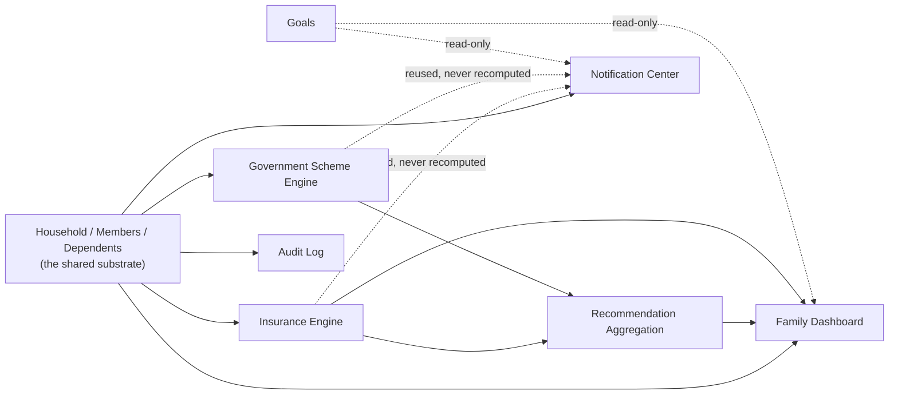
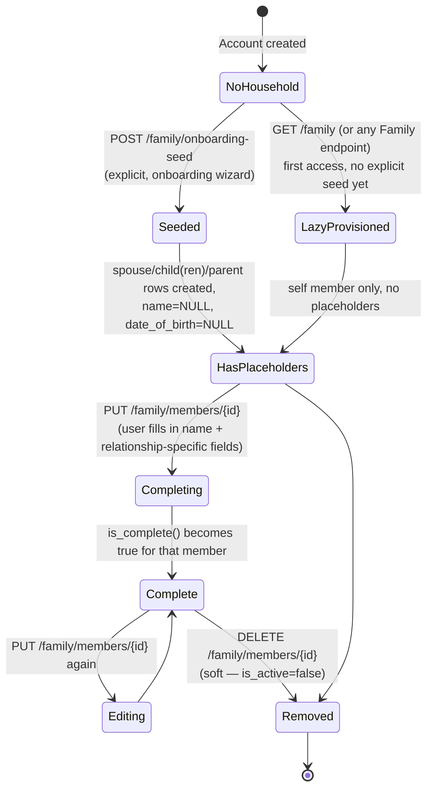
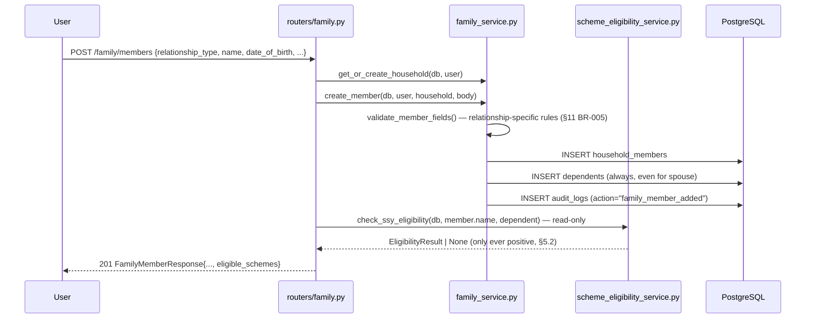
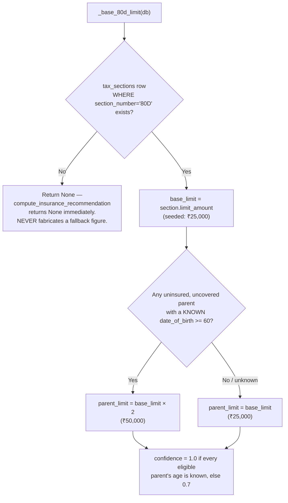
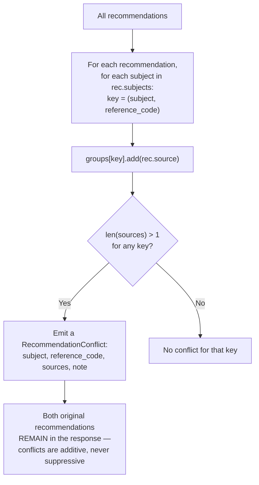
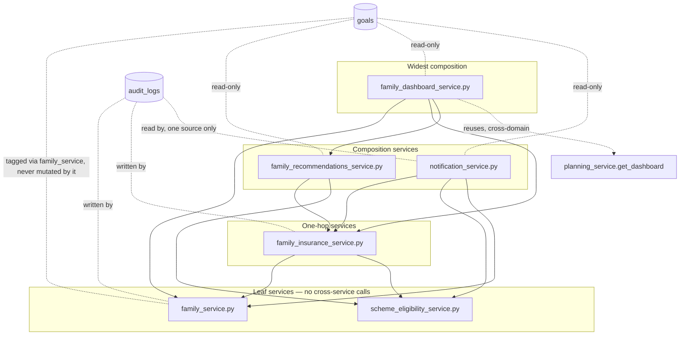

# FAMILY, GOVERNMENT SCHEME & RECOMMENDATION ENGINE BIBLE

**Volume 5 of the Northstar Project Engineering Bible**
**Date compiled:** 2026-07-10
**Method:** every file touching Family, Household, Government Schemes, Insurance, Recommendations, Notifications, Dashboard composition, or Audit Logs was read in full for this document — `backend/app/models/{household,policy,insurance,notification,audit,goal_household_member}.py`, `backend/app/services/{family_service,scheme_eligibility_service,family_insurance_service,family_recommendations_service,family_dashboard_service,notification_service}.py`, `backend/app/routers/{family,notifications}.py`, `backend/app/schemas/{family,family_dashboard,family_recommendations,insurance,notification}.py`, `backend/scripts/seed_policy_data.py` (the literal seeded scheme/tax catalog), every test file in this domain (by function name, cross-checked against the implementation each name claims to prove), and the relevant frontend routes (`code/src/routes/app.family.*.tsx`, `code/src/components/onboarding/wizard-steps.tsx`). Every business rule below is traced to the exact function that enforces it. Where a rule does not exist in code, this document says **"Not implemented in this project"** rather than describing an aspiration. This volume cross-references Volume 1 (`SystemArchitectureBible.md`), Volume 2 (`CalculationEngineBible.md`), Volume 3 (`DatabaseSchemaBible.md`), and Volume 4 (`APIServiceInteractionBible.md`) rather than re-deriving facts they already verified — restated only where this volume's business-rule framing adds something those architecture/data/API-level treatments didn't already capture.

---

## 1. Business Domain Overview

**Why the Family module exists.** Northstar's core Goal/Monte Carlo engine (Volumes 1–2) answers "will *I* reach *my* target?" for an individual. The Family module exists to answer a materially different question a single-user goal model cannot: "what is my household's *total* financial picture, and what does the Indian tax/policy system specifically owe *these people* — my spouse, my children, my parents?" This is not a UI convenience layered on top of Goals; it is a second planning surface with its own data model (`households`/`household_members`/`dependents`), because a spouse or a minor child is frequently a real financial-planning subject (the beneficiary of a Sukanya Samriddhi Yojana account, say) without ever being a Northstar account holder in their own right.

**Why Government Schemes exist.** India has a large catalog of state-run savings/insurance instruments (PPF, SSY, SCSS, EPF, NPS, NSC, KVP, APY, PMVVY) each with its own eligibility rules, tax treatment, and — critically — an Income-tax Act currently mid-transition (1961 Act → 2025 Act, with wholesale section renumbering, e.g. `80C` → `123`). A generic financial planner cannot tell a user which of these nine schemes actually apply to *their* household without evaluating real, dated eligibility rules against real household member data. The Government Scheme Engine (`scheme_eligibility_service.py`) exists to do exactly that evaluation — and, per `docs/PRODUCT_PRINCIPLES.md #6` (verified in Volume 1 §1), to present it as a **personalized, pre-filtered answer**, never a flat catalog the user has to self-filter.

**Why Insurance exists.** Section 80D of the Income-tax Act gives a distinct, *additional* deduction for health-insurance premiums paid for parents, on top of what a standalone family floater already covers — and the deduction *doubles* if a covered parent is a senior citizen. This is a real, quantifiable, and easy-to-miss planning opportunity specific to households with uninsured parents. The Insurance module (`family_insurance_service.py`) exists to surface this one calculation precisely, grounded in the same versioned tax data the Scheme Engine uses, rather than leave it undiscovered.

**Why Recommendations exist.** Insurance and Schemes are two independently correct engines that can, in principle, compete for the same bounded tax ceiling (e.g. two different scheme matches for the same person, both drawing from the same `80C`/`123` savings-deduction limit). The Recommendation aggregation layer (`family_recommendations_service.py`) exists to compose these into one feed **and** to flag that competition explicitly — a business need neither underlying engine can see on its own, since each evaluates only its own domain.

**How they work together.** Household data is the shared substrate every other Family-domain engine reads. Schemes and Insurance are both independent, "calculation-lite fact application" engines (a term used in this codebase's own code comments, §5.4) — narrow, verified, non-speculative computations over that household data. Recommendations composes those two engines' outputs without recomputing anything. The Family Dashboard composes Recommendations plus four more household-derived cards into one view. Notifications reuses the exact same Insurance/Scheme/Goal facts a fifth time, as a presentation-layer surface with its own read/dismiss state. See §12 for the full cross-system dependency diagram.

---

## 2. Household Model

**Household** (`models/household.py`, `Household` class). One row per user, created lazily on first Family-domain access (`family_service.get_or_create_household`). A household **aggregates** existing per-user data for a shared view; it is never a second source of truth for any individual fact — goals, assets, income all stay keyed to `user_id` exactly as they are outside the Family module (Volume 1 §15.6, restated precisely here because it is the single load-bearing architectural decision this entire chapter depends on).

**Members** (`HouseholdMember`). One row per person the household cares about, including the account owner (`relationship_type = "self"`, auto-created, never user-editable) and every spouse/child/parent/other member added afterward. `user_id` is **nullable** — a spouse, child, or dependent parent is a real planning subject without ever needing a login of their own (verified: `create_member` never sets `user_id` for a non-`self` member; only the auto-created `self` row ever carries one, and only ever the caller's own `user.id`).

**Relationships** — `relationship_type` is a coarse, four-value bucket (`spouse | child | parent | other`) plus the implicit fifth, `self`. This is *not* the same axis as `Dependent.relationship_detail`, a finer sub-label (`mother`/`father` for a parent-type member; free text for `other`) — the two exist because "which of the four buckets" and "which specific relationship within that bucket" are answered by different UI questions at different times (bucket at creation, detail can be edited later).

**Dependents** (`Dependent`, one-to-one with every non-`self` member, DB-enforced via a `UNIQUE` FK). Carries the demographic facts (`date_of_birth`, `gender`, `has_own_insurance`, `is_tax_dependent`) that drive every downstream eligibility/recommendation calculation. **Every** non-`self` member gets a `Dependent` row unconditionally, including spouses — the model file's own comment documents this as a corrected assumption: the original design (`Milestone2ImplementationContract.md`) assumed a spouse-type member wouldn't need one, until it became clear `date_of_birth`/`gender` had nowhere else to live for a spouse (migration `008`'s docstring, Volume 3 §4.4).

**Parents.** Modeled identically to spouse/child at the `HouseholdMember` level (`relationship_type = "parent"`), but with two parent-specific required fields at the `Dependent` level: `relationship_detail ∈ {mother, father}` and `has_own_insurance ∈ {yes, no, not_sure}` (`family_service.validate_member_fields`). These two fields exist *specifically* to drive the Insurance Engine's uncovered-parent detection (§6) — no other relationship type requires `has_own_insurance` at all.

**Children.** `relationship_type = "child"` requires `date_of_birth` (`validate_member_fields`) — the one field the Government Scheme Engine's SSY check (§5.2) needs. `gender` is optional at the schema level but functionally required for a positive SSY match, since SSY's eligibility rule is gender-conditional (§5.2).

**Ownership model.** Every table in this domain resolves ownership through exactly one household's `created_by_user_id`, resolved by `family_service.resolve_owned_household` — written deliberately against a slightly more general rule ("created it, or is a member of it") than Milestone 2 currently needs, per that function's own comment, so it does not require rewriting when shared-household-login access ships as a future milestone. **Not implemented in this project today:** no household member other than `self` has ever, through any code path, had `user_id` populated — shared login is schema-ready, not feature-built.

**Why this architecture was chosen.** A household-as-aggregator (rather than household-as-owner) model means adding the Family module required zero changes to how Goals, Assets, Income, or any other existing user-owned table is queried or secured — every ownership check anywhere else in the codebase (Volumes 1, 4 §12) continues to filter by `user_id` exactly as before. The alternative — making a household the owning entity for shared financial data — would have required rewriting every existing ownership check in the codebase to understand household membership, a far larger and riskier change for a Milestone 2 feature.

---

## 3. Family Lifecycle

### 3.1 Onboarding → Placeholder Members

The onboarding wizard (`code/src/components/onboarding/wizard-steps.tsx`) asks exactly three yes/no questions — "Do you have a spouse or partner?", "Do you have children?" (with a follow-up count, 1–10, only if yes), "Do you have dependent parents?" — deliberately kept to a handful of questions (Volume 1 §2.1) rather than a full census. `POST /family/onboarding-seed` (`family_service.seed_onboarding`) converts these answers into **bare `HouseholdMember` rows with no name, no date of birth, no other detail** — one `spouse` row if `has_spouse`; `children_count` (1–10, required by a `model_validator` when `has_children` is true, `schemas/family.py`'s `OnboardingSeedRequest`) `child` rows; and **exactly one** `parent` row if `has_dependent_parents` is true, regardless of how many parents the user actually has.

> **BR-EDGE (see §11, BR-009):** a household with two dependent parents (mother and father) gets **one** placeholder parent row from onboarding, not two — the wizard's yes/no question has no "how many" follow-up for parents the way it does for children. A user with two dependent parents must add the second one manually via "Add Family Member" after onboarding. This is a real, verified product-surface gap, not a bug in the seeding logic itself (which does exactly what its one boolean answer specifies).

### 3.2 Idempotent Re-Entry

`seed_onboarding` checks `get_or_create_household`'s own `created` boolean; if the household already existed (the user re-enters onboarding, or hits the endpoint twice), it returns immediately **without creating any new placeholder rows** — verified by `test_family_router.py::TestOnboardingSeed::test_idempotent_does_not_duplicate`. This is deliberately not a database-level uniqueness constraint; it is an application-level idempotency check on the household's existence.

### 3.3 Completion

A placeholder member is a real row from creation, immediately visible in `GET /family`, but flagged `is_complete: false` until it satisfies `family_service.is_complete()` (§11, BR-007) — the same function used consistently everywhere completeness matters (the member list, the response schema's own `is_complete` field, and the Insurance Engine's `uncovered_parents` gate, §6.2). Completion happens via `PUT /family/members/{id}`, which re-validates the same relationship-type-dependent field rules as creation (`validate_member_fields`, §11 BR-005) — there is no separate, looser validation path for "completing" versus "creating."

### 3.4 Editing

Editing is unrestricted for any non-`self` member at any time — no lock, no "editing an already-complete member requires confirmation" step exists. **Verified isolation property:** `test_family_router.py::test_editing_one_member_never_changes_another` confirms an edit to one member's fields never bleeds into a sibling member's row, and `test_editing_never_creates_a_duplicate_member` confirms an update never accidentally inserts a second row for the same member.

### 3.5 Deletion

`DELETE /family/members/{id}` is a soft delete (`member.is_active = False`, `family_service.remove_member`) — verified by `test_soft_deletes_not_hard_deletes`. **The `self` member is explicitly, permanently protected**: both `PUT` and `DELETE` on the `self` member return `400 Bad Request` (`"Cannot edit the 'self' member via this endpoint"` / `"Cannot remove the household creator"`) — the only two hardcoded relationship-type-specific guards anywhere in the Family router.

### 3.6 → Dashboard Updates

Every Family Dashboard card that reads member data (`_dependents_card`, `_coverage_card`, `_parents_card`, and — indirectly, since the household member list feeds the eligibility engine — the Recommendations feed) reflects a member's current `is_active`/completeness state on the **very next request**; nothing about membership state is cached or requires an explicit refresh trigger (§8).

### 3.7 → Recommendations

Completing a parent member's `has_own_insurance` field (or adding their `date_of_birth`) can *cause* an insurance recommendation to newly appear (if the answer resolves to `no`/`not_sure`) — or *disappear*, if it resolves to `yes`. There is no explicit "recompute recommendations" step; the next `GET /family/insurance` or `GET /family/recommendations` call simply evaluates the current row state fresh (§7).

### 3.8 → Notifications

A newly-added member generates exactly one notification fact — `family_member_added`, sourced from the `AuditLog` row `create_member` writes, with a hardcoded 30-day recency window (§9, BR-045) — after which it silently ages out of the notification feed (not deleted, simply no longer within the window `notification_service._collect_family_member_added_facts` queries).

### 3.9 Family Member Addition — Full Sequence

---

## 4. Goal Ownership

**User ownership.** `goals.user_id` is set once, at creation (`routers/goals.py`'s `create_goal`), and is **never** changed by any Family-domain operation — verified directly by reading `family_service.set_goal_household_tags` in full: the function selects, inserts, and deletes rows in `goal_household_members` only, never touches the `goals` table's own columns, and is independently, automatically confirmed by `test_family_goal_tagging.py::test_tagging_never_changes_goal_owner`.

**Family tagging.** `PUT /goals/{id}/family-tags` (delegated to `family_service.set_goal_household_tags`) replaces the *entire* tag set for one goal in a single delete-then-reinsert call — every submitted `household_member_id` is validated against the caller's own household (raising `ValueError` → `422` for a cross-household ID, verified by `test_cross_household_member_id_rejected_not_silently_ignored` — a foreign ID is rejected outright, never silently dropped). An empty list is a valid request and untags everyone (`test_empty_list_untags_everyone`).

**Goal associations.** `goal_household_members` (§11 BR-012) is the only place a goal and a household member are ever linked. Tagging a goal with a member does not require that member to be `is_complete` (§3.3) — a placeholder member can be tagged, since tagging is descriptive metadata, not an eligibility gate.

**Why tags never imply ownership.** `docs/PRODUCT_PRINCIPLES.md #7` ("never claim capability the data model doesn't actually have," verified in Volume 1 §15.6) is the direct governing principle: tagging a retirement goal with a spouse's name is a UI affordance for "this goal affects/benefits this person," never a joint-editing or joint-viewing grant. The data model has no mechanism for a second user to read or modify another user's goal — building a UI that implied otherwise would be describing a capability that does not exist.

**Engineering reasoning.** The alternative design — modeling `goal_household_members` as a genuine co-ownership table, with access-control implications — was never built, and would be a materially larger change (every goal-ownership check across the codebase would need to understand shared access, not just single-owner access). The chosen design keeps the *entire* access-control surface of the application single-owner (Volume 1 §12, Volume 3 §13), at the cost of the Family Goals screen being descriptive-only rather than collaborative. `test_tagging_never_changes_goal_probability` further confirms tagging has zero interaction with the Calculation Lifecycle (Volume 2 §7) — it is a pure metadata operation, architecturally inert with respect to every other subsystem except its own audit log entry.

---

## 5. Government Scheme Engine

**Source of truth for the catalog:** `backend/scripts/seed_policy_data.py` — the literal, only place the scheme catalog is populated (idempotent, skips any `code` that already exists). **Nine schemes are seeded; eligibility rules exist for exactly two of them.**

### 5.1 The Seeded Catalog

| Code | Name | Category | Status | Eligibility rules seeded? |
|---|---|---|---|---|
| `PPF` | Public Provident Fund | `general_savings` | `active` | **No** |
| `EPF` | Employees' Provident Fund | `retirement` | `active` | **No** |
| `NPS` | National Pension System | `retirement` | `active` | **No** |
| `SSY` | Sukanya Samriddhi Yojana | `child` | `active` | **Yes** — `max_age lt 10`, `gender eq female` |
| `SCSS` | Senior Citizens' Savings Scheme | `senior` | `active` | **Yes** — `min_age gte 60` |
| `NSC` | National Savings Certificate | `general_savings` | `active` | **No** |
| `KVP` | Kisan Vikas Patra | `general_savings` | `active` | **No** |
| `APY` | Atal Pension Yojana | `retirement` | `active` | **No** |
| `PMVVY` | Pradhan Mantri Vaya Vandana Yojana | `senior` | `closed_to_new` | **No** (moot — see §5.4) |

A scheme's `SchemeRate` rows (interest rate, min/max contribution — `scheme_rates` table) are seeded for all nine but read by **zero application code** (Volume 3 §4.5/§14) — the Government Schemes screen shows eligibility buckets and plain-language reasons only, never a rate figure. **Not implemented in this project:** no scheme-detail page exists that would consume `scheme_rates`.

### 5.2 SSY (Sukanya Samriddhi Yojana) — Full Business Logic

- **Purpose:** a government savings scheme for a girl child, seeded with two independent eligibility rules rather than one combined rule — a deliberate data-modeling choice (`seed_policy_data.py`'s own comment) so the evaluation engine "never hardcodes 'SSY is girls-only' itself, it just checks whatever rules exist for the scheme."
- **Eligibility rules (both must pass):**
  1. `max_age lt 10` — the child must be under 10 (strictly less than), evaluated via **exact completed-years age** (`scheme_eligibility_service.age_years`, the standard calendar idiom: `as_of.year - dob.year - ((as_of.month, as_of.day) < (dob.month, dob.day))`), not a `days/365.25` approximation. **Boundary-tested precisely:** a child on their exact 10th birthday is `not_eligible` (`test_exact_10th_birthday_is_not_eligible`); the day before is still `eligible` (`test_day_before_10th_birthday_is_still_eligible`). This is a maximum-age *ceiling* — once crossed, there is no "potentially eligible by getting older" direction (§5.5), so `max_age` rules never produce a `potentially_eligible` bucket.
  2. `gender eq female` — the `Dependent.gender` field must equal `"female"` exactly.
- **Age rules:** see above — exact calendar age, not day-count.
- **Gender rules:** exact string equality against `Dependent.gender`; a `null` gender (never asked, or the member is incomplete) fails the check silently rather than being guessed.
- **Tax implications:** SSY draws from the shared `80C`/`123` general-savings-deduction ceiling (₹150,000, seeded in `tax_sections`) — used by the Recommendation Engine's conflict detection only as a factual grounding reference (`_SAVINGS_SCHEME_REFERENCE_CODE = "80C/123"`, §7.2), never surfaced as a dollar figure anywhere in the Scheme Engine itself.
- **Configuration:** `scheme_eligibility_rules` rows, `effective_from = 2015-01-01` for both rules.
- **Database:** `schemes` (code `SSY`), `scheme_eligibility_rules` (2 rows).
- **Backend:** `scheme_eligibility_service._evaluate_rules_for_member`'s `max_age`/`gender` branches; also the sole consumer of `check_ssy_eligibility`, the narrow single-child inline check called from `POST`/`PUT /family/members` (§3.9) — deliberately reuses the identical rule-evaluation function rather than a second, hand-written age/gender check.
- **Frontend:** the Government Schemes screen (`app.family.schemes.tsx`) and the inline "eligible_schemes" callout on the Add/Edit Member form.
- **Tests:** `test_scheme_eligibility_service.py` — `test_girl_under_10_is_eligible`, `test_girl_over_10_is_not_eligible`, `test_boy_under_10_is_not_eligible` (confirms the gender rule is independently enforced, not implied by anything else), the two exact-birthday boundary tests above, `test_no_date_of_birth_yet_is_not_evaluable`.
- **Limitations:** evaluates only a *non-`self`* household member (§5.5); does not evaluate a maximum-per-family-account limit (SSY permits at most 2 accounts per family in the real scheme — **not implemented in this project**, no `max_accounts_per_family` rule is seeded despite the `rule_type` column being able to represent it, per the model's own comment listing it as an illustrative example type).
- **Unknowns / Future extension:** contribution-limit enforcement (₹250 min / ₹1,50,000 max, seeded in `scheme_rates` but never read, §5.1).

### 5.3 SCSS (Senior Citizens' Savings Scheme) — Full Business Logic

- **Purpose:** a government savings scheme for senior citizens, base case only.
- **Eligibility rule:** `min_age gte 60` — a `min_age` rule works in the *opposite* direction from `max_age`: not yet meeting the threshold can resolve to `potentially_eligible` if within `_POTENTIALLY_ELIGIBLE_WINDOW_YEARS` (5 years, §5.5) of the threshold, or `not_eligible` if further away.
- **Age rules:** identical exact-calendar-age function as SSY (`age_years`), reused, not reimplemented.
- **Gender rules:** none — SCSS has no gender-conditional eligibility rule seeded.
- **Tax implications:** **Not implemented in this project** — no SCSS-specific tax-section link exists; SCSS interest income taxability is not modeled anywhere in this codebase.
- **Configuration:** one `scheme_eligibility_rules` row, `effective_from = 2004-01-01`.
- **Known, deliberate limitation — the most consequential unseeded gap in this entire engine:** the real SCSS scheme has two additional eligibility routes — individuals 55+ who retired under superannuation/VRS, and retired defense personnel 50+ — verified in `GovernmentPolicyReport.md` but **deliberately not seeded**, because `household_members`/`dependents`/`user_profiles` capture **no field anywhere** recording retirement status or defense-service history (`seed_policy_data.py`'s own module docstring states this explicitly, citing `Milestone2ImplementationContract.md` Task 3 / `DesignReview.md`). This is a documented, intentional gap — seeding a rule with no corresponding data field to evaluate it against would either silently never fire (dead data) or require guessing, both of which this codebase's "never invent a financial fact" discipline (`docs/ENGINEERING_CONSTITUTION.md` Rule 4) rules out.
- **Tests:** `test_scss_potentially_eligible_within_window`, `test_scss_eligible_once_60`, `test_scss_not_eligible_far_from_threshold` (someone well under 55 is correctly `not_eligible`, not `potentially_eligible` — the window is bounded, not open-ended).
- **Future extension:** if a `retired_status`/`is_defense_personnel` field is ever added to `Dependent`, the two additional SCSS routes could be seeded as two more `SchemeEligibilityRule` rows against a new `rule_type` (e.g. `retirement_status`) — the schema and rule table already support this without a migration to the *rules* table itself, only a new `rule_type` branch in `_evaluate_rules_for_member` and a new `Dependent` column.

### 5.4 The Remaining Seven Schemes (PPF, EPF, NPS, NSC, KVP, APY, PMVVY)

**None of these seven have any seeded eligibility rule.** Per `evaluate_household_eligibility`'s own logic: a scheme with zero rules in `rules_by_scheme` is bucketed `not_eligible` for the household as a whole, with the explicit reason `"Eligibility criteria for {scheme.name} are not yet configured."` — **never** guessed into `eligible` or silently omitted. This is a deliberate design property, not a gap in test coverage: `test_scheme_with_no_seeded_rules_stays_not_eligible` locks this exact behavior in.

`PMVVY` carries a second, independent reason to always be `not_eligible`: its `status = "closed_to_new"` short-circuits evaluation entirely — `evaluate_household_eligibility`'s very first check per scheme is `if scheme.status == "closed_to_new"`, appending a `not_eligible` result with the reason `"{scheme.name} is closed to new subscriptions"` **before any rule is even looked up** — verified by `test_closed_to_new_scheme_never_eligible`. This is a real, tested safeguard the model's own comment attributes directly to PMVVY's actual 2023-03-31 closure to new subscribers.

### 5.5 The Rule Evaluation Engine Itself

**Source:** `scheme_eligibility_service._evaluate_rules_for_member` and `evaluate_household_eligibility`.

- **Only three `rule_type` values are ever branched on:** `max_age`, `min_age`, `gender` — a fourth seeded `rule_type` (e.g. a hypothetical `residency_status`) would be silently never evaluated, per the module's own docstring, a deliberate scope boundary (`docs/ENGINEERING_CONSTITUTION.md` Rule 7 — "extending to a fourth `rule_type` is a decision to make when a scheme actually needs one, not ahead of need").
- **The `_POTENTIALLY_ELIGIBLE_WINDOW_YEARS = 5` constant** is explicitly documented as a **product decision, not a financial/policy fact** — it does not exist in any government source; it is Northstar's own choice about how far in advance to start telling a user "you'll qualify soon." It applies **only** to `min_age` rules (SCSS); it structurally cannot apply to `max_age` ceilings (SSY), since "will become eligible by getting older" has no meaning for a scheme a person ages *out* of, not into.
- **Evaluation is deliberately narrow to non-`self` household members.** `evaluate_household_eligibility`'s own query filters `relationship_type != "self"` — a `self` member's own age lives on `UserProfile`, a different join this engine's two current use cases (child SSY, parent/senior SCSS) never require. **Not implemented in this project:** a `self` member's own eligibility for, say, SCSS (if the account holder is themselves 60+) is never evaluated — confirmed by `test_self_member_excluded_from_evaluation`.
- **An incomplete member (no `date_of_birth`) is never guessed.** `_evaluate_rules_for_member` returns `None` (not a bucket) if a needed field is missing — the caller (`evaluate_household_eligibility`) simply skips that member for that scheme rather than defaulting to any bucket. Verified: `test_no_date_of_birth_yet_is_not_evaluable`.
- **Performance characteristic, restated from Volume 3 §12/Volume 4 §11 in business terms:** every call loads **all nine** schemes and **all three** eligibility rules unconditionally (no `WHERE` clause), then filters in Python — correct today at this catalog size, but the cost scales with the *total* catalog, not the household being evaluated, which matters if this catalog ever grows to the "hundreds of schemes" scale a more complete Indian financial-planning product would need.

---

## 6. Insurance Engine

**Source:** `family_insurance_service.py` — the module's own comment calls this "a calculation-lite fact application... deliberately not a Milestone 5 Recommendation Engine output," citing `FamilyHUFPlanningReport.md`/`GovernmentPolicyReport.md`'s verified figures.

### 6.1 Coverage

A `HealthPolicy` (family floater, individual, or senior-citizen-standalone) covers zero or more `household_members` via the `health_policy_coverage` join table. Coverage is always managed as a **complete replacement of the covered-member set** (`replace_policy_coverage`), never an incremental add/remove — the same delete-then-reinsert pattern `family_service.set_goal_household_tags` uses for goal tags (§4), applied here to a different domain. A policy must cover **at least one** member (`household_member_ids` with `min_length=1`, `HealthPolicyCreate`) — a policy covering nobody is rejected at the schema level, never reaches the database.

### 6.2 Gap Detection (`uncovered_parents`)

The single business function that determines "which parents represent an uncovered-insurance planning gap." A parent-type member qualifies **only if all three** conditions hold:

1. **`family_service.is_complete(member, dependent)` is true** — an incomplete placeholder parent (no name, no `relationship_detail`, no `has_own_insurance` answer) never triggers a gap, regardless of what little data it does have. Verified: `test_incomplete_parent_placeholder_never_triggers_recommendation`.
2. **`dependent.has_own_insurance != "yes"`** — this is a **not-equal-yes** check, not an equal-to-"no" check. It fires identically for `"no"` **and** `"not_sure"` — the function's own comment states this was a deliberate resolution, not a silent default: `DataIntegrityReview_Task10.md` resolved the ambiguity of whether "not sure" should count as a gap by treating it the same as "no" (an unanswered/uncertain insurance status is itself the gap the recommendation exists to close). Verified by two distinct tests, `test_recommendation_fires_for_no` and `test_recommendation_fires_for_not_sure`.
3. **Not already covered by any active policy on file** — `covered_ids` (from `_covered_member_ids`) is checked *after* the `has_own_insurance` filter, specifically because the recorded answer can be **stale** relative to a policy added later; the function's own comment states the actual coverage data is treated as the more current signal, overriding a possibly-outdated self-report. Verified: `test_no_recommendation_when_parent_already_covered_by_a_policy` — even a parent whose `has_own_insurance` still reads `"no"` produces no recommendation once a policy covers them.

### 6.3 80D Calculations

- **The base figure is never a hardcoded literal** — `_base_80d_limit` reads `tax_sections` by `section_number == "80D"`, taking `.scalars().first()` (the first matching row, **not** filtered by `effective_from`/`effective_to` — a real, verified gap restated as a business risk in §15, BUS-001).
- **The senior-citizen doubling** — `_SENIOR_CITIZEN_AGE = 60`, reusing `scheme_eligibility_service.age_years` (the exact same exact-calendar-age function the Scheme Engine uses, §5.2) rather than a second age calculation. Fires if **any** eligible uninsured parent's age (from those whose `date_of_birth` is known) is ≥60 — verified by `test_senior_parent_doubles_the_deduction_limit`, asserting exactly `50_000.0`.
- **Missing information never fabricates a favorable-looking figure.** If a qualifying parent's `date_of_birth` is unset, that parent is simply excluded from `ages_known` (not assumed non-senior, not assumed senior) — verified precisely by `test_missing_date_of_birth_never_fabricates_senior_status`, asserting `confidence_score < 1.0` in that case, never a specific fabricated number.
- **Not seeded, by deliberate design:** the real 80D scheme has an *additional* senior-citizen-specific ₹50,000 tier (distinct from the doubling logic above) that `seed_policy_data.py`'s own docstring states was **not** seeded, because the current schema's single-limit-per-`TaxSection` shape "doesn't cleanly represent" an age-conditional limit — seeding it as an unconditional second row would have misrepresented it as unconditional. The doubling behavior in `family_insurance_service.py` is this codebase's own application-layer workaround for that schema limitation, not a second source of truth for the figure.

### 6.4 Parent Handling

Only `relationship_type == "parent"` members are ever evaluated by the Insurance Engine — spouse, child, and other-type members are structurally excluded from `uncovered_parents`'s query (`HouseholdMember.relationship_type == "parent"`). This matches the real-world 80D rule this feature targets (the *additional* parent-specific deduction), and is a narrower scope than the Scheme Engine (which evaluates every non-`self` type, just with only two schemes actually configured).

### 6.5 Confidence

A **two-value, never-interpolated** score: `1.0` if every qualifying parent's age is known, `0.7` otherwise (§6.3). There is no continuous confidence model anywhere in this engine — "somewhat sure" is represented as a single fixed literal, not a computed probability.

### 6.6 Recommendations — Content

`compute_insurance_recommendation` returns a fully-populated `InsuranceRecommendation` (never a partially-filled one) whenever `uncovered_parents` returns at least one qualifying member: `why` (the generic tax-benefit framing), `why_now` (why this specific household, right now — names the actual uninsured/uncovered parent(s) by name), `what_information_was_used` (an explicit list — insurance status, date of birth if known, existing-policy coverage count), `what_information_is_missing` (explicit — "X's date of birth" if unknown), `floater_deduction_limit`/`parent_deduction_limit` (the ₹25,000/₹50,000 figures), and `confidence_score`. Verified as unconditional by `test_recommendation_always_fully_explained`.

### 6.7 Coverage Updates and Recommendation Removal

There is no explicit "dismiss this insurance recommendation" action anywhere in this codebase. A recommendation disappears **only** as a direct, causal consequence of the underlying fact changing — a parent gets added to a policy's coverage set (`PUT /family/insurance/policies/{id}/coverage`), or their `has_own_insurance` answer is edited to `"yes"` (`PUT /family/members/{id}`). This is not a special "recommendation lifecycle" feature; it falls out for free from the fact that `compute_insurance_recommendation` is recomputed fresh on every single request (§7.5, §14.1) — there is no persisted recommendation state to explicitly clear.

### 6.8 Business Reasoning

The Insurance Engine's narrow scope (one tax section, one relationship type, one age threshold) is a direct instance of `docs/ENGINEERING_CONSTITUTION.md` Rule 7 (no premature abstraction) applied to a tax-domain feature: it solves the one verified, real gap (parents outside a floater, missing the additional 80D deduction) precisely, rather than building a general-purpose deduction-optimization engine ahead of a proven need for one.

---

## 7. Recommendation Engine

*(The largest chapter, per the brief — this is the composition layer that turns two independently-correct engines into one coherent, conflict-aware feed.)*

### 7.1 Why Recommendations Exist

Insurance and Schemes each answer a narrow, correct question in isolation. Neither can see that its own answer might compete with the other's for the same bounded resource — a person eligible for an SSY-adjacent savings scheme and also named in an insurance recommendation both, in principle, touch tax-deduction ceilings, and a user deciding where to actually put money needs to know when two "yes, do this" answers are drawing from the same pool. `family_recommendations_service.py` exists specifically to add this one missing piece of context — nothing more.

### 7.2 How Recommendations Are Generated

**Source: `get_family_recommendations(db, user, household)`.** Two independent collection functions, called exactly once each:

- `_insurance_recommendations` — calls `family_insurance_service.compute_insurance_recommendation` once; if it returns a result, wraps it as exactly **one** `FamilyRecommendation` with `source="insurance"`, `reference_code="80D"` (a literal constant, `_INSURANCE_REFERENCE_CODE`).
- `_scheme_recommendations` — calls `scheme_eligibility_service.evaluate_household_eligibility` once, then converts **every** entry in the `eligible` bucket (never `potentially_eligible` or `not_eligible`) into one `FamilyRecommendation` each, with `source="schemes"`, `reference_code="80C/123"` (a literal constant, `_SAVINGS_SCHEME_REFERENCE_CODE`) — a factual grounding reference stating SSY/SCSS both draw from the combined general-savings ceiling, per `GovernmentPolicyReport.md`'s tax-section table, used **only** to detect a genuine resource conflict, never shown to the user as-is.

**Zero eligibility math and zero deduction-figure computation happens in this module** — its own docstring states this directly, and every value in the resulting `FamilyRecommendation` (`why`, `confidence_score`, etc.) is read verbatim from the underlying engine's own output, reformatted into a shared envelope.

### 7.3 How Recommendations Disappear

Exactly as in §6.7 — there is no explicit dismissal mechanism anywhere in this module. A recommendation stops appearing the instant the underlying household fact it was grounded in changes (a member becomes covered, ages past a scheme's ceiling, or answers a completeness-gating question), because every call recomputes from scratch (§7.5).

### 7.4 Aggregation

A flat, source-tagged list — `[*insurance_recs, *scheme_recs]` — with **no ranking, priority ordering, or deduplication step** beyond the conflict *detection* described next. **Not implemented in this project:** there is no "top 3 recommendations" truncation, no priority score, and no explicit ordering rule anywhere in this function; the response's order is simply insurance-then-schemes, in whatever order `evaluate_household_eligibility`'s own iteration produces the scheme matches.

### 7.5 Priority

**Not implemented in this project.** No recommendation in this feed carries a priority/rank/severity field of its own (contrast with Dashboard suggestions, Volume 2 §10, which *do* carry a `severity`). Every `FamilyRecommendation` is presented as an equally-weighted item in the list; the only differentiation a user sees is `confidence_score` (§6.5, §5's implicit 1.0-always for scheme matches, §7.2).

### 7.6 Conflict Detection

**Source: `_detect_conflicts`.**

- **A conflict requires BOTH a shared subject AND a shared `reference_code`.** Two recommendations for the same person but *different* `reference_code`s (e.g. one 80D, one 80C/123) are **not** a conflict — `test_same_subject_different_reference_code_no_conflict`. Two recommendations for *different* people sharing the same `reference_code` are also **not** a conflict — `test_different_subject_same_reference_code_no_conflict`. Only the intersection triggers one — `test_same_subject_same_reference_code_different_sources_is_a_conflict`.
- **Purely a set-membership grouping operation** — zero arithmetic, zero dollar-amount comparison. The conflict does not attempt to say *how much* is actually at stake or which recommendation "wins"; it only flags that the user should be aware two recommendations reference the same bounded pool.
- **Conflicts are additive, never suppressive** — `test_conflict_never_removes_a_recommendation` locks this in permanently. No recommendation is ever hidden or demoted as a result of a detected conflict; the conflict is surfaced as *additional* context alongside both original, unmodified recommendations.

### 7.7 Reason Generation

Every recommendation's `why`/`why_now` text is generated as **plain Python string interpolation**, not templated from any external content-management system and not assembled from the schema-only `policy_citations` table (Volume 3 §4.5, confirmed zero-consumer). Scheme recommendations use a small category-keyed template dict (`_WHY_NOW_BY_CATEGORY`, keyed on `"child"`/`"senior"` — the only two categories that can currently produce an `eligible` result at all, since only SSY (`child`) and SCSS (`senior`) have seeded rules, §5); any other category falls back to a generic template. **Verified, worth flagging precisely:** the `_WHY_NOW_BY_CATEGORY` dict's fallback branch is presently unreachable in production — since only SSY/SCSS can ever appear in the `eligible` bucket today, every scheme recommendation this system currently produces uses one of the two named templates, never the generic fallback. This is dead-but-harmless defensive code, not a bug.

### 7.8 Evidence Generation

Every recommendation's `what_information_was_used`/`what_information_is_missing` lists are populated by the *originating* engine (§6.6 for insurance; `_scheme_recommendations`'s own `what_used` list — eligibility bucket, date of birth if known, gender if known — for schemes), then passed through this module unmodified. This is the literal mechanism behind `RecommendationIntegrityReview_Task11.md`'s requirement that every recommendation be fully explained — verified permanently by `test_every_recommendation_fully_explained`.

### 7.9 Confidence

Insurance recommendations inherit the two-tier 1.0/0.7 score from §6.5. **Scheme recommendations are always `confidence_score = 1.0`** — a literal constant in `_scheme_recommendations`, never computed — because eligibility for SSY/SCSS is a deterministic age/gender comparison with no missing-information branch analogous to insurance's "date of birth unknown" case (a member with a missing `date_of_birth` is simply never evaluable at all for a scheme, §5.5, rather than producing a lower-confidence match). Verified: `test_scheme_recommendation_confidence_is_full`.

### 7.10 Missing Information

Surfaced verbatim from the underlying engine (§7.8) — this module adds no missing-information detection of its own.

### 7.11 Live Computation

**Verified, automatically, permanently:** `test_family_recommendations.py::test_calculation_lifecycle_untouched` confirms fetching recommendations never touches `goal.probability`/`goal.on_track` (the Calculation Lifecycle, Volume 2 §7-9, is architecturally invisible to this entire module — it never imports `planning_service` or `monte_carlo`). `test_nothing_is_persisted` confirms the database is unchanged, row-count-wise, before and after a `GET /family/recommendations` call.

### 7.12 Why Recommendations Are NOT Persisted

Restated here at the business-logic level (Volume 1 §15.3 covers the architecture-level reasoning): a recommendation is a *claim about the current state of a household*. The moment a parent's insurance status changes, or a child crosses a scheme's age ceiling, a *persisted* recommendation becomes actively wrong until something re-runs the computation and overwrites it — introducing exactly the kind of staleness-with-no-audit-trail failure mode ADR-001 (Volume 1 §15.2) already documents as a real, prior incident in this codebase's history (the Dashboard's old `refresh_goal_probabilities()` bug). Recomputing fresh on every read costs a handful of extra queries per request (Volume 4 §11) in exchange for a correctness guarantee that requires no invalidation logic at all — there is no cache to bust, no background job to schedule, no "last computed at" staleness window to reason about.

### 7.13 Isolation

`test_recommendations_isolated_between_users` confirms one user's recommendation feed contains zero trace of another user's household data — consistent with every other domain's ownership-check discipline (Volume 4 §12).

---

## 8. Dashboard Business Logic

**Source: `family_dashboard_service.get_family_dashboard`.** Six independent card computations plus the Recommendations feed, composed from **two shared fetches** (the household member list and the goal-with-tags list, each queried exactly once and reused across every card that needs it — a documented Milestone 2.1-P4 optimization, Volume 1 §13/Volume 3 §12).

| Card (frontend title) | Backend function | Data source | Business meaning | Dependencies | Limitations |
|---|---|---|---|---|---|
| **"Who depends on me?"** | `_dependents_card` | Shared member list, grouped by `relationship_type` | A raw headcount by relationship bucket (children/parents/spouse/other) | Household members only | Excludes `self` from every count; an `other`-type member is bucketed into a generic `others` count with no further breakdown |
| **"Education costs ahead"** | `_education_card` | Shared goal-with-tags list, filtered `category == "education"` | The single nearest **future-dated** education goal, with its tagged members' names | Goals + goal tags | Returns `None` (empty state) if every education goal's `target_date` has already passed — a past-dated goal is deliberately never shown as "ahead"; only ever surfaces one goal even if the household has several |
| **"Insurance coverage"** | `_coverage_card` | `family_insurance_service.list_policies_with_coverage` + shared member list | `N of M` household members covered by *any* active policy on file | Health policies + coverage join + member list | A pure count — does not distinguish "covered by a comprehensive floater" from "covered by a minimal individual policy"; no sum-insured-adequacy signal at all |
| **"Parents"** | `_parents_card` | `family_insurance_service.uncovered_parents` (the exact same function, same call, as the Insurance recommendation, §6.2) | Names of parents representing an insurance gap | Insurance Engine | **Deliberately shares one authority with the Insurance recommendation** (`DependencyValidation_Task12.md` Finding 2, cited directly in the code) — the warning and the recommendation appear and disappear together by construction, not by convention; links to `/app/family/insurance`, not `/app/family/schemes` |
| **"Retirement readiness"** | `_retirement_card` | Shared goal-with-tags list, filtered `category == "retirement"` | The first retirement goal's already-persisted `probability`/`on_track` | Goals (read-only, Calculation Lifecycle-respecting) | Picks the first retirement goal by the list's existing priority-then-created ordering (the same convention `get_dashboard()`'s own `projected_retirement` uses) — a household with two retirement goals only ever surfaces one here |
| **"Emergency readiness"** | `_emergency_card` | `planning_service.get_dashboard()` — the identical function the main Dashboard calls | Liquid assets and monthly expenses, verbatim | The main money Dashboard (cross-domain reuse) | No months-of-coverage figure is computed on the *backend* — that arithmetic is explicitly left to the frontend, per Task 9's own established precedent (`DependencyValidation_Task12.md` Finding 1) |
| **Recommendations feed** | `family_recommendations_service.get_family_recommendations` | §7 | The full aggregated feed, embedded in this same response | Insurance + Schemes | Guarded by its own independent `try`/`except`; `recommendations_unavailable` (a distinct boolean) is set on failure rather than an empty list, so "nothing to recommend" and "couldn't check" are never conflated |

**Graceful degradation, the composition-wide contract:** each card computes under its own `_safe()` wrapper — an exception is logged in full (`logger.exception`, never silently swallowed) and that one card degrades to `None`, while every other card still populates in the same response. A `None` card renders as "unavailable" in the frontend, **never** as a zero that could be mistaken for a real figure (`IntegrationIntegrityReview_Task12.md`, restated in the schema's own docstring, §11 BR-037). Verified automatically and permanently by `test_partial_failure_degrades_gracefully` and `test_recommendations_unavailable_flag`.

**Zero financial arithmetic in this layer** — the module's own docstring states this directly: "This module contains zero financial arithmetic — only counting, set membership, and `min()`-by-date selection." Every dollar figure this composition surfaces was computed by a different, already-certified engine (Insurance, Schemes, `planning_service`) and is passed through, at most reshaped into a card-specific envelope.

**Consistency guarantee:** `test_feed_identical_to_recommendations_endpoint` confirms the recommendations feed embedded in `GET /family/dashboard` is byte-for-byte identical to what `GET /family/recommendations` returns independently — both call the same underlying function, so there is no risk of the two screens disagreeing.

---

## 9. Notification Business Logic

**Source: `notification_service.py`.** Restated here at the business-rule level; Volume 1 §7.5/§10.3 and Volume 2 §11.4 already covered the architecture.

### 9.1 How Notifications Are Generated

Exactly **five** sources, collected fresh on every `GET /notifications` call, each reusing an already-certified engine rather than computing anything new:

| Source | What it reads | Business trigger |
|---|---|---|
| `insurance` | `family_insurance_service.compute_insurance_recommendation()` — the identical call `/family/insurance` itself makes | A qualifying insurance recommendation exists (§6) |
| `schemes` | `scheme_eligibility_service.evaluate_household_eligibility()` — identical call `/family/schemes` makes | A household member is in the `eligible` **or** `potentially_eligible` bucket for any scheme (the only notification source that surfaces `potentially_eligible`, not just `eligible`) |
| `family_member_added` | `AuditLog` rows, `action == "family_member_added"`, within a 30-day recency window | A member was added recently (§3.8, §11 BR-045) |
| `goal_at_risk` | `Goal.on_track == False` (already-persisted, never recomputed) | A goal's stored on-track flag is currently false |
| `goal_completed` | `Goal.current_amount >= Goal.target_amount` | A goal has reached or exceeded its target |

### 9.2 Precedence: `goal_completed` vs. `goal_at_risk`

`_collect_goal_facts` checks `current_amount >= target_amount` **first**; only if that is false does it check `not on_track`. This means a goal that is both fully funded *and* (for whatever transient reason) not flagged `on_track` will **only ever** surface as `goal_completed`, never simultaneously as `goal_at_risk` — the two sources are mutually exclusive per goal by construction, not by coincidence. Verified: `test_goal_completed_appears_as_notification_not_at_risk`.

### 9.3 Read Markers

`notification_markers` (one row per `(user_id, dedupe_key)`, `UNIQUE`-constrained) stores exactly `read_at`/`dismissed_at` timestamps — **never** the notification's title, body, or any other content. A marker is created **only** on an explicit write (§9.5), never as a side effect of listing notifications — verified, permanently, by `test_get_notifications_never_creates_a_marker_row` (calls the list endpoint three times, asserts the table stays empty throughout).

### 9.4 Dismissal

`dismissed_at` (non-null) causes `list_notifications` to skip that item entirely from the returned list — dismissal is permanent and does not reappear even if the underlying fact still exists on a subsequent call: verified precisely by `test_dismissing_a_fact_that_still_exists_does_not_bring_it_back`. There is no "un-dismiss" endpoint anywhere in this API.

### 9.5 Why Notifications Are Computed, Not Stored

Restated at the business level: a notification is a *derived signal about current household/goal state*. Storing its content would create the exact same staleness risk the Insurance/Scheme recommendations already avoid (§7.12) — an insurance recommendation that changes (a parent gets covered) must be reflected in the notification feed on the very next load, with zero explicit invalidation step, which is only possible if the notification's content was never stored to begin with.

### 9.6 Why Content Is Not Stored

The `dedupe_key` (a deterministic `uuid5` hash of a source-specific natural key — e.g. `user_id:sorted(subjects)` for insurance, the literal `AuditLog.id` for family-member-added) gives a live-computed, never-persisted fact a **stable identity** for read/dismiss tracking, without ever needing to store the fact's actual text. This is the single mechanism that makes "notifications are computed, never stored" *and* "a user can mark a specific notification read/dismissed" simultaneously true — without a stable key, there would be nothing to attach a read/dismissed marker to across two independent computations of the same underlying fact.

### 9.7 Only Two Writes

`mark_read` and `mark_dismissed` (both routed through the single `_upsert_marker` helper) are the **only** two write operations anywhere in this domain — both always an explicit, user-initiated action, never a side effect of any read.

---

## 10. Audit Logging

**Source: `models/audit.py`, written by exactly two services.**

**What is logged.** Seven action types, all in the Family domain: `household_created`, `family_member_added`, `family_member_updated`, `family_member_removed`, `family_goal_tag_changed` (all from `family_service.py`); `insurance_policy_created`, `insurance_policy_coverage_updated` (both from `family_insurance_service.py`). Every mutating action carries `before_state`/`after_state` as untyped JSON — a generic before/after diff shape rather than one table per action type (Volume 3 §15).

**What is not logged.** Goals CRUD and Financials CRUD (income/expenses/assets/liabilities) write **zero** audit entries anywhere — confirmed by grep across `routers/goals.py`/`planning_service.py`/`routers/financials.py` (Volume 1 §12/§16, Volume 3 §4.9, Volume 4 §12/§14 API-006 area — restated here as this volume's own confirmation, not a new finding). Reading any Family-domain data (a `GET` request) never writes an audit entry — verified for insurance specifically by `test_reading_insurance_produces_no_audit_entry`; every audit-logged action pairs with a real state mutation.

**Why.** Audit logging exists to make every mutation in a domain with real tax/legal consequence (family composition, insurance coverage) reconstructable after the fact — who changed what, from what, to what. The Family domain was the first to need this discipline because HUF/nomination/estate concerns (this codebase's own documented future scope, Volume 1 §17) carry genuine legal weight a goal's target-amount edit does not (Volume 1 §15.5).

**Current limitations, verified precisely:**
- **No duplicate-write guarantee is a schema-level constraint** — `test_no_duplicate_audit_entries_per_action` verifies the *application* writes exactly one row per action, but nothing in the schema itself prevents a hypothetical future bug from double-writing.
- **No direct reader.** There is no `GET /audit-logs` endpoint and no audit-log viewer UI anywhere in this codebase (Volume 3 §4.9) — this table is write-only from the product's perspective, with exactly one indirect exception: `notification_service._collect_family_member_added_facts` queries `AuditLog` rows directly to source the `family_member_added` notification's title and event timestamp (§9.1) — the *only* place this table's data ever reaches a user, and only indirectly, through the Notification Center rather than any purpose-built audit view.
- **The composite `(user_id, created_at)` index exists with no query to serve today** — its shape strongly implies a future "recent activity" view was anticipated but never built (Volume 3 §4.9).

---

## 11. Business Rule Catalog

*(Every rule below is verified against the exact function or schema field that enforces it. IDs are stable within this document.)*

| ID | Purpose | Trigger | Conditions | Outcome | Evidence / Source | Tests |
|---|---|---|---|---|---|---|
| BR-001 | One household per user | Any first Family-domain access | User has no `Household` row where `created_by_user_id` = them (or where they're a member) | A new `Household` + a `self` `HouseholdMember` are created lazily | `family_service.get_or_create_household` | `test_lazy_provisions_for_user_with_no_household` |
| BR-002 | Protect the `self` member | `PUT`/`DELETE /family/members/{id}` where the target is the `self` member | `member.relationship_type == "self"` | `400 Bad Request`, no mutation | `routers/family.py` `update_family_member`/`delete_family_member` | `test_cannot_edit_self_via_member_endpoint`, `test_cannot_remove_self` |
| BR-003 | `self` member name is never duplicated | Any read that resolves a member's display name | `relationship_type == "self"` | Name is read from `User.full_name`, never from `household_members.name` (which stays `NULL` for `self`) | `family_service.resolve_member_name` | `test_tag_goal_with_self_resolves_name_from_user` |
| BR-004 | Every non-`self` member gets exactly one `Dependent` row | `create_member` for any relationship type | `relationship_type != "self"` | A `Dependent` row is always inserted, including for `spouse` | `family_service.create_member`, migration `008`'s docstring | `test_create_spouse_success` |
| BR-005 | Relationship-type-dependent field validation | `POST`/`PUT /family/members` | `spouse`/`child` → `date_of_birth` required; `parent` → `relationship_detail ∈ {mother, father}` AND `has_own_insurance` required; `other` → `relationship_detail` required | `ValueError` → `422` on violation | `family_service.validate_member_fields` | `test_create_spouse_missing_dob_rejected`, `test_create_parent_requires_relationship_detail_and_insurance`, `test_create_other_missing_relationship_detail_rejected` |
| BR-006 | `date_of_birth` sanity bounds | Any member create/update with a `date_of_birth` | Value in the future, or more than 130 years in the past | `422` | `schemas/family.py` `_validate_date_of_birth` | `test_date_of_birth_in_future_rejected` |
| BR-007 | Completeness definition | Any read of a member's `is_complete` field | Per-type: `self`→always true; `spouse`/`child`→named AND has DOB; `parent`→named AND `relationship_detail` AND `has_own_insurance` set; `other`→named AND `relationship_detail` set | Boolean surfaced consistently everywhere completeness matters | `family_service.is_complete` | `test_completes_a_placeholder_member` |
| BR-008 | Idempotent onboarding seeding | `POST /family/onboarding-seed` called more than once | Household already exists | Second call returns the existing household, creates zero new rows | `family_service.seed_onboarding` | `test_idempotent_does_not_duplicate` |
| BR-009 | Exactly one parent placeholder from onboarding | `has_dependent_parents = true` | — | **One** `parent` `HouseholdMember` row is created, regardless of how many dependent parents the household actually has | `family_service.seed_onboarding` | `test_creates_expected_member_rows` (see §3.1 edge-case callout) |
| BR-010 | `children_count` required and bounded | `has_children = true` | `children_count` missing → rejected; `> 10` → rejected | `422` | `schemas/family.py` `OnboardingSeedRequest` | `test_children_count_required_when_has_children_true`, `test_children_count_above_ten_rejected` |
| BR-011 | Cross-household isolation | `GET`/`PUT`/`DELETE /family/members/{id}` for a member not in the caller's own household | ID belongs to a different household | `404`, never `403` (existence not confirmed to a non-owner) | `family_service.get_member_and_dependent` (ownership-scoped query) | `TestCrossHouseholdOwnership` (4 tests) |
| BR-012 | `goal_household_members` is descriptive, never ownership | `PUT /goals/{id}/family-tags` | Any tag set change | `goals.user_id` is never read or written by this operation | `family_service.set_goal_household_tags` | `test_tagging_never_changes_goal_owner` |
| BR-013 | Full tag-set replacement, cross-household validated | `PUT /goals/{id}/family-tags` | Any submitted ID not in the caller's own household | `ValueError` → `422`, entire request rejected (no partial application) | `family_service.set_goal_household_tags` | `test_cross_household_member_id_rejected_not_silently_ignored` |
| BR-014 | Only SSY and SCSS are ever evaluable | Any scheme eligibility check | Scheme has zero seeded `SchemeEligibilityRule` rows | Bucketed `not_eligible`, reason `"...not yet configured"` — never guessed | `scheme_eligibility_service.evaluate_household_eligibility` | `test_scheme_with_no_seeded_rules_stays_not_eligible` |
| BR-015 | SSY eligibility | Household eligibility evaluation or inline child check | Member is female (exact match) AND under 10 (exact calendar age, strictly less-than) | `eligible`; otherwise `not_eligible` | `scheme_eligibility_service._evaluate_rules_for_member`, seeded rules `max_age lt 10` + `gender eq female` | `test_girl_under_10_is_eligible`, `test_exact_10th_birthday_is_not_eligible` |
| BR-016 | SCSS eligibility (base case only) | Household eligibility evaluation | Member's exact calendar age ≥ 60 | `eligible`; within 5 years below 60 → `potentially_eligible`; further below → `not_eligible` | Seeded rule `min_age gte 60`, `_POTENTIALLY_ELIGIBLE_WINDOW_YEARS = 5` | `test_scss_eligible_once_60`, `test_scss_potentially_eligible_within_window`, `test_scss_not_eligible_far_from_threshold` |
| BR-017 | `closed_to_new` schemes are always ineligible | Any scheme with `status == "closed_to_new"` (currently only PMVVY) | — | `not_eligible`, reason `"...closed to new subscriptions"`, checked **before** any rule lookup | `evaluate_household_eligibility` | `test_closed_to_new_scheme_never_eligible` |
| BR-018 | `self` members are excluded from scheme evaluation | Any household eligibility evaluation | `relationship_type == "self"` | Never evaluated for any scheme | `evaluate_household_eligibility`'s query filter | `test_self_member_excluded_from_evaluation` |
| BR-019 | Missing data is never guessed (schemes) | A member is missing `date_of_birth` for an age-based rule | — | That member is skipped (returns `None`) for that scheme, not bucketed at all | `_evaluate_rules_for_member` | `test_no_date_of_birth_yet_is_not_evaluable` |
| BR-020 | Inline SSY callout is positive-only | `POST`/`PUT /family/members` for a `child`-type member | Member evaluates to anything other than `eligible` | `eligible_schemes: []` (never shows a negative/near-miss result inline) | `scheme_eligibility_service.check_ssy_eligibility` | `FamilyPlanningDesign.md` Part 4.2 (design intent); module docstring |
| BR-021 | 80D base limit is never fabricated | Insurance recommendation computation, `tax_sections` has no `80D` row | — | `compute_insurance_recommendation` returns `None` (no recommendation at all, not a fallback figure) | `family_insurance_service._base_80d_limit` | Module docstring; grep-confirmed no fallback literal exists |
| BR-022 | Insurance gap qualification | Per parent-type member | `is_complete()` true AND `has_own_insurance != "yes"` AND not covered by any active policy | Included in the insurance recommendation's subject list | `family_insurance_service.uncovered_parents` | `test_incomplete_parent_placeholder_never_triggers_recommendation`, `test_recommendation_fires_for_not_sure`, `test_no_recommendation_when_parent_already_covered_by_a_policy` |
| BR-023 | `not_sure` is treated identically to `no` | `has_own_insurance` evaluation | Value is `"no"` or `"not_sure"` | Both count as an insurance gap | `uncovered_parents`, resolved per `DataIntegrityReview_Task10.md` | `test_recommendation_fires_for_no`, `test_recommendation_fires_for_not_sure` |
| BR-024 | Senior-citizen 80D doubling | Insurance recommendation computation | Any qualifying parent with known age ≥ 60 | `parent_deduction_limit = base_limit × 2` | `family_insurance_service.compute_insurance_recommendation`, `_SENIOR_CITIZEN_AGE = 60` | `test_senior_parent_doubles_the_deduction_limit` (asserts exactly `50_000.0`) |
| BR-025 | Unknown age never assumed senior | A qualifying parent's `date_of_birth` is unset | — | Excluded from the senior-status check; `confidence_score` drops to `0.7` | `compute_insurance_recommendation` | `test_missing_date_of_birth_never_fabricates_senior_status` |
| BR-026 | Insurance confidence is two-tier | Every insurance recommendation | Every qualifying parent's age known → `1.0`; any unknown → `0.7` | Exactly one of two values, never interpolated | `compute_insurance_recommendation` | `test_missing_date_of_birth_never_fabricates_senior_status` |
| BR-027 | A policy must cover at least one person | `POST /family/insurance/policies` | `household_member_ids` empty | `422` | `schemas/insurance.py` `HealthPolicyCreate` (`min_length=1`) | `test_create_policy_with_zero_covered_members_rejected` |
| BR-028 | Policy coverage is validated against the caller's own household | `POST .../policies`, `PUT .../coverage` | A submitted member ID belongs to a different household | `ValueError` → `422` | `family_insurance_service._validate_member_ids` | `test_create_policy_with_foreign_member_id_rejected` |
| BR-029 | No policy deletion exists | Any attempt to remove a `HealthPolicy` | — | **Not implemented in this project** — no endpoint exists | `routers/family.py` (grep-confirmed absent) | Restated from Volume 3 DB-006/Volume 4 API-004 |
| BR-030 | Recommendation aggregation performs zero original calculation | `GET /family/recommendations` | — | Every field sourced from Insurance/Schemes engines, reformatted only | `family_recommendations_service.py` module docstring | `test_every_recommendation_fully_explained` |
| BR-031 | Conflict requires shared subject AND shared `reference_code` | Two or more recommendations | `(subject, reference_code)` key shared by >1 distinct `source` | A `RecommendationConflict` is emitted | `family_recommendations_service._detect_conflicts` | `test_same_subject_same_reference_code_different_sources_is_a_conflict` |
| BR-032 | Conflicts are additive, never suppressive | A conflict is detected | — | Both original recommendations remain in the response unmodified | `_detect_conflicts` | `test_conflict_never_removes_a_recommendation` |
| BR-033 | Reference codes ground, never display | Every recommendation | `reference_code` (`"80D"` or `"80C/123"`) | Used internally for conflict grouping only, never rendered as-is to the user | `family_recommendations_service.py` | Schema docstring (`FamilyRecommendation.reference_code`) |
| BR-034 | Every recommendation is fully explained | Any recommendation emitted from either source | — | `why`, `why_now`, `what_information_was_used`, `what_information_is_missing`, `confidence_score` are all mandatory, never omitted | `schemas/family_recommendations.py` `FamilyRecommendation` (no optional fields) | `test_every_recommendation_fully_explained` |
| BR-035 | Recommendations are never persisted | Every `GET /family/recommendations`, `/insurance`, `/schemes`, `/dashboard` call | — | Zero rows written; fully recomputed from current state every call | Verified across every relevant service | `test_nothing_is_persisted` (recommendations, dashboard) |
| BR-036 | Dashboard shares two fetches across six cards | `GET /family/dashboard` | — | Member list and goal-with-tags list are each queried exactly once | `family_dashboard_service.get_family_dashboard` | Module docstring (Milestone 2.1-P4) |
| BR-037 | Per-card graceful degradation | Any single card computation raises | — | That card becomes `null`; every other card still populates; error is logged, never swallowed | `family_dashboard_service._safe` | `test_partial_failure_degrades_gracefully` |
| BR-038 | `recommendations_unavailable` is distinct from "empty" | The recommendations feed computation itself raises | — | `recommendations_unavailable = true`, `recommendations = []` — never conflated with a genuine zero-recommendation state | `get_family_dashboard` | `test_recommendations_unavailable_flag` |
| BR-039 | Education card shows only future-dated goals | `_education_card` | Goal's `target_date < today` | Excluded from consideration; if none remain, card is empty (not stale) | `family_dashboard_service._education_card` | `test_education_card_shows_nearest_future_goal_with_tagged_member` |
| BR-040 | Retirement card picks the first retirement goal by existing ordering | `_retirement_card` | Household has ≥1 retirement-category goal | The list's first entry (priority asc, created asc — matching `get_dashboard()`'s own convention) is shown; others are invisible to this card | `family_dashboard_service._retirement_card` | `test_retirement_card_uses_persisted_probability` |
| BR-041 | Parents card and insurance recommendation share one authority | `_parents_card` | — | Calls the exact same `uncovered_parents` function/query as the insurance recommendation | `family_dashboard_service._parents_card`, `DependencyValidation_Task12.md` Finding 2 | `test_parents_card_and_recommendation_move_together` |
| BR-042 | Emergency card is a verbatim passthrough | `_emergency_card` | — | Reads `planning_service.get_dashboard()`'s `liquid_assets`/`monthly_expenses` unchanged; computes no months-covered figure on the backend | `family_dashboard_service._emergency_card` | `test_emergency_card_passes_through_dashboard_figures` |
| BR-043 | Exactly five notification sources | `GET /notifications` | — | `insurance`, `schemes` (eligible + potentially_eligible), `family_member_added`, `goal_at_risk`, `goal_completed` — no others | `notification_service._collect_facts` | Endpoint inventory, `test_notifications.py` |
| BR-044 | Notification reads never write | `GET /notifications` | — | Zero `notification_markers` rows created by a read, even repeated reads | `notification_service.list_notifications` | `test_get_notifications_never_creates_a_marker_row` |
| BR-045 | `family_member_added` has a 30-day window | `_collect_family_member_added_facts` | `AuditLog.created_at` older than 30 days | Excluded from the notification feed | `notification_service._FAMILY_MEMBER_ADDED_WINDOW_DAYS = 30` | `NotificationIdentityReview.md` |
| BR-046 | `goal_completed` and `goal_at_risk` are mutually exclusive per goal | `_collect_goal_facts` | `current_amount >= target_amount` checked before `on_track` | A completed goal never also appears as at-risk | `notification_service._collect_goal_facts` | `test_goal_completed_appears_as_notification_not_at_risk` |
| BR-047 | Dedupe key is a deterministic identity, not content | Every notification fact | — | `uuid5(namespace, "{source}:{natural_key}")`; namespace UUID must never change in production | `notification_service._dedupe_key`, `_NAMESPACE` | `NotificationIdentityReview.md` |
| BR-048 | Dismissal is permanent regardless of the fact's continued existence | A notification is dismissed, then the underlying fact is checked again | Fact still exists | Notification does not reappear | `notification_service.list_notifications` (skip on `dismissed_at is not None`) | `test_dismissing_a_fact_that_still_exists_does_not_bring_it_back` |
| BR-049 | Exactly two writes in the Notification domain | `POST .../read`, `POST .../dismiss` | — | Both are explicit, user-initiated upserts of one marker row; nothing else writes to `notification_markers` | `notification_service._upsert_marker` | Endpoint inventory |
| BR-050 | Audit logging scoped to exactly seven action types, two services | Any Family-domain mutation | Action is one of `household_created`/`family_member_added`/`_updated`/`_removed`/`family_goal_tag_changed`/`insurance_policy_created`/`insurance_policy_coverage_updated` | An `AuditLog` row is written with before/after JSON | `family_service.py`, `family_insurance_service.py` | `test_create_policy_is_audit_logged`, `test_tagging_writes_audit_log` |
| BR-051 | Reads never audit-log | Any `GET` in the Family/Insurance domain | — | No `AuditLog` row is written | Grep-confirmed: `AuditLog` imported only alongside write paths | `test_reading_insurance_produces_no_audit_entry` |

---

## 12. Cross-System Dependencies

**Family → Insurance → Government Schemes → Recommendations → Dashboard → Notifications, precisely stated:**

1. **Family** (`family_service.py`) is the one true leaf for household/member data — every other service in this domain reads from it, it calls into nothing else.
2. **Insurance** (`family_insurance_service.py`) is one hop deeper: it reads household data (via `family_service`) and reuses one pure function from **Schemes** (`scheme_eligibility_service.age_years`) — the *only* cross-pollination between these two otherwise-independent engines, and it is age arithmetic, not eligibility logic (§6.3, "reusing it does not blur the schemes/insurance boundary" per the code's own comment).
3. **Government Schemes** (`scheme_eligibility_service.py`) is also a leaf — it never calls Insurance, Family, or any other service.
4. **Recommendations** (`family_recommendations_service.py`) is a pure composition of Insurance + Schemes — it is the first place in this chain both engines' outputs are combined.
5. **Dashboard** (`family_dashboard_service.py`) is the single deepest call chain in this entire codebase (Volume 4 §5): `router → family_dashboard_service → family_recommendations_service → family_insurance_service → family_service`, four layers for one field (the embedded recommendations feed) in one response — and it is the *only* Family-domain service that also reaches outside the domain entirely, into `planning_service.get_dashboard()`, to source the Emergency card.
6. **Notifications** (`notification_service.py`) sits at the same composition depth as Recommendations but is architecturally independent of it — it calls Insurance and Schemes **directly**, not through the Recommendations layer, deliberately duplicating the *call*, never the *calculation* (§9.1).

**What never happens, verified exhaustively by grep across this domain:** `family_service.py` never calls any other service in this codebase (a true leaf); `scheme_eligibility_service.py` never calls any other service; `planning_service.py` (the core money Dashboard) never calls into any Family-domain service, despite `family_dashboard_service.py` calling *into* `planning_service` — the dependency between the two Dashboards is strictly one-directional, restated here because it is the one place the Family domain and the core Goals/Money domain touch at all.

---

## 13. Edge Cases

*(Every edge case below is a real, tested behavior — not a hypothetical.)*

1. **Exact-birthday boundary, SSY.** A girl on her literal 10th birthday is `not_eligible`; the day before, `eligible` — exact-calendar-age arithmetic, not an approximation, exists specifically so this boundary is correct (§5.2).
2. **SCSS "potentially eligible" is a bounded window, not open-ended.** Someone well under 55 is `not_eligible`, not `potentially_eligible` — the 5-year window has a real floor (§5.5).
3. **A placeholder member with no date of birth is skipped, not guessed, for any age-based rule** — both in Schemes (§5.5, BR-019) and, implicitly, in Insurance (a parent with no DOB can still trigger a recommendation, but is excluded from the senior-status determination specifically, §6.3/BR-025).
4. **`self` members are invisible to the Scheme Engine entirely**, even though they have their own age and could, in principle, qualify for SCSS themselves (§5.5, BR-018) — a documented future extension, not a bug.
5. **A scheme with no seeded rules is `not_eligible`, never silently omitted or guessed `eligible`** — seven of nine seeded schemes hit this path today (§5.4, BR-014).
6. **`PMVVY`'s `closed_to_new` short-circuit runs before any rule lookup** — even if a rule existed for it, it would never matter (§5.4, BR-017).
7. **An incomplete parent placeholder never triggers an insurance recommendation**, even if its (incomplete) data would otherwise suggest a gap — completeness gates the entire calculation, not just individual fields (§6.2, BR-022).
8. **A stale `has_own_insurance = "no"` answer is overridden by newer coverage data** — adding a policy that covers a parent suppresses the recommendation even without the user ever going back to correct the original onboarding answer (§6.2).
9. **`"not_sure"` and `"no"` are treated identically** for insurance-gap purposes — a deliberate resolution of an ambiguous acceptance criterion, not an accidental default (§6.2, BR-023).
10. **Two recommendations for the same person can coexist without being a conflict**, if they reference different tax ceilings — conflict detection is deliberately narrow (§7.6, BR-031).
11. **A conflict never removes or demotes a recommendation** — it is purely additive context (§7.6, BR-032).
12. **A completed goal is never simultaneously shown as at-risk**, even if its `on_track` flag happens to still read `false` at the moment it crosses the target — check-order, not a separate exclusion rule, produces this (§9.2, BR-046).
13. **Dismissing a notification is permanent even if the underlying fact persists** — the marker, not the fact, governs visibility (§9.4, BR-048).
14. **Onboarding seeds at most one parent placeholder regardless of how many dependent parents exist** — a real, user-facing gap in the onboarding flow specifically, not the general member-creation flow (§3.1, BR-009).
15. **A cross-household ID in a tag/coverage/member request is rejected outright (`422`), never silently dropped or ignored** — every place a set of IDs is submitted (goal tags, policy coverage) validates the entire set before applying any of it (§4, §6.1, BR-013, BR-028).
16. **The `self` member can never be edited or removed via the member endpoints**, and has no `Dependent` row at all — every dependent-derived field on it (`date_of_birth`, `gender`, etc.) is `null` by construction, and `get_family_member` explicitly guards against crashing on this (§3.5, `routers/family.py`'s `if dependent else []`).
17. **Repeated tagging of the same goal with the same members never creates duplicate rows** — the replace-all (delete-then-reinsert) pattern makes this structurally impossible, not just tested-to-be-absent (§4, `test_repeated_tagging_never_creates_duplicate_rows`).
18. **`health_policy_coverage` has no database-level uniqueness constraint**, unlike its sibling join table `goal_household_members` — currently unreachable via the one write path (always a full replace), but a real, unenforced schema gap (§15, BUS-004).

---

## 14. Engineering Decisions

*(Why, not what — cross-referenced to Volumes 1–4 where the same decision was analyzed from a different angle.)*

### 14.1 Why recommendations are computed live

Restated precisely for this domain (§7.12, §6.7): a recommendation is a claim about *current* household state. The alternative — persisting `InsuranceRecommendation`/`FamilyRecommendation` content — would require either a background job to keep it synchronized with the state it describes (infrastructure this codebase deliberately does not have, Volume 4 §13) or accepting silent staleness. Live computation was chosen consistently, independently, across three separate milestones (Insurance/Task 10, Schemes/Task 3, Recommendations/Task 11, and later Notifications/Phase 3) — the same architectural answer arrived at four times without code reuse between the decisions, which is itself evidence this is the *correct* answer for this domain, not an accident of one engineer's preference (Volume 1 §15.3, Volume 4 §13).

### 14.2 Why the Dashboard (and Family Dashboard) only reads

`_emergency_card`'s reuse of `planning_service.get_dashboard()` verbatim (§8) is a direct extension of ADR-001 (Volume 1 §15.2, Volume 2 §10) into the Family domain — the Family Dashboard was built *after* the core Dashboard's mutation bug was already fixed, and deliberately inherits the same read-only discipline by calling the exact same function rather than re-deriving the figures.

### 14.3 Why insurance recommendations disappear automatically

There is no "recommendation lifecycle" state machine anywhere in this codebase (§6.7) — a recommendation disappearing is not a feature that was built, it is the *absence* of persistence producing the correct behavior for free. This is a direct consequence of 14.1: if nothing is ever stored, there is nothing that needs to be explicitly cleared when it becomes stale.

### 14.4 Why family members are placeholders

Onboarding's three yes/no questions (§3.1) cannot know a spouse's name, a child's exact birthdate, or a parent's insurance status — those facts require a dedicated, focused form the onboarding wizard deliberately doesn't front-load (Volume 1 §2.1's "deliberately kept to a handful of questions" design principle). Placeholder members let the household's *shape* exist immediately (so it's visible in `GET /family` and can be tagged on goals right away) while deferring the *detail* to a purpose-built completion flow — `is_complete()` (§11, BR-007) is the single function that lets every downstream consumer (Insurance, the member list UI) agree on exactly when a placeholder has become real data.

### 14.5 Why goal ownership is separate from family tagging

Restated precisely (§4): building `goal_household_members` as genuine shared ownership would have required rewriting every ownership check in the codebase (Goals, Financials, everywhere) to understand multi-user access — a fundamentally larger change than this milestone's actual need ("show who this goal affects"). The chosen design gets the descriptive value at a fraction of the engineering cost, at the explicit, documented cost of never supporting real collaborative editing (`docs/PRODUCT_PRINCIPLES.md #7`).

### 14.6 Why recommendation conflicts are additive

Suppressing one of two conflicting recommendations would require this system to decide *which one wins* — a genuine financial-advice judgment call (`docs/ENGINEERING_CONSTITUTION.md`'s "never invent a financial fact," Rule 4, extended here to "never invent a financial *priority*") this codebase's own discipline explicitly avoids making on the user's behalf. Surfacing both, with an explicit note that they compete, respects the user's own judgment while still providing the missing context neither underlying engine could see alone (§7.6).

### 14.7 Why government rules are configurable (data-driven), not hardcoded per scheme

`SchemeEligibilityRule`'s `(rule_type, operator, value)` shape (§5, Volume 3 §4.5) means a new scheme with an eligibility profile matching an *already-supported* rule type (age, gender) requires **zero code change** — only a new seed row. This is exactly why SSY and SCSS, two structurally different schemes (a maximum-age-plus-gender ceiling vs. a minimum-age floor with an approach window), are both served by the identical `_evaluate_rules_for_member` function. The trade-off, made deliberately (§5.5, `docs/ENGINEERING_CONSTITUTION.md` Rule 7): a genuinely *new kind* of rule (e.g. residency status, taxpayer status) still requires a code change, because building a fully general rule interpreter ahead of a second, third, and fourth concrete need would be premature abstraction.

### 14.8 Why SCSS's 55+/50+ special routes and the 80D senior tier were deliberately not seeded

Both are the same decision applied twice: seeding a rule with no data field to evaluate it against, or seeding a figure the current schema shape can't represent honestly (an age-conditional limit in a single-limit-per-section table), would either produce dead data or a misleading unconditional-looking number. `docs/ENGINEERING_CONSTITUTION.md` Rule 4 ("never invent a financial fact") is applied here not just to *values* but to *scope* — the honest response to "we can't represent this correctly yet" is to not represent it at all, documented explicitly in the seed script's own docstring, rather than approximate it (§5.3, §6.3).

---

## 15. Verified Findings

| ID | Severity | Evidence | Impact | Recommendation | Intentional or accidental? |
|---|---|---|---|---|---|
| BUS-001 | Medium | `_base_80d_limit` reads `tax_sections` without filtering `effective_from`/`effective_to`, despite this table's entire purpose being effective-dating (Volume 3 DB-003, restated here in business terms) | If a second, superseding `80D` row is ever seeded (e.g. a rate change under the 2025 Act), the deduction figure shown to every household becomes whichever row PostgreSQL happens to return first — not necessarily the currently-effective one | Add an explicit `WHERE effective_from <= today AND (effective_to IS NULL OR effective_to > today)` filter before a second `80D` row is ever seeded | Accidental — the table's own purpose implies this filter should exist |
| BUS-002 | Medium | SCSS's 55+ (VRS retiree)/50+ (defense personnel) routes are deliberately unseeded (§5.3) | A real household member who genuinely qualifies for SCSS via either special route (ages 50–59) will see `not_eligible`, indistinguishable from someone who genuinely doesn't qualify at all — the eligibility answer is honest about *what was checked*, but incomplete relative to the *real* scheme | Add `retired_status`/`is_defense_personnel` fields to `Dependent` and seed the two additional rules once that data can be honestly captured | Fully intentional and documented (`seed_policy_data.py`'s own docstring) — flagged here as a business-facing gap regardless of intent, since the user-visible effect is the same either way |
| BUS-003 | Low | Onboarding seeds exactly one `parent` placeholder regardless of `has_dependent_parents`'s implied count (§3.1, §13 edge case 14) | A household with two dependent parents starts with an incomplete picture until the user manually adds the second parent — no prompt exists nudging them to do so | Either add a parent-count follow-up question (mirroring `children_count`) or add explicit post-onboarding guidance to add a second parent if applicable | Likely accidental — no code comment documents this as a deliberate scope decision, unlike the SCSS/80D gaps above which are explicitly documented |
| BUS-004 | Low | `health_policy_coverage` has no `UNIQUE (health_policy_id, household_member_id)` constraint, unlike its sibling join table `goal_household_members` (Volume 3 DB-005, restated here) | Currently unreachable in practice (the one write path always replaces the full coverage set), but the schema does not structurally prevent a duplicate row the way the analogous table does | Add the matching `UNIQUE` constraint for defense-in-depth consistency | Accidental inconsistency between two structurally similar join tables |
| BUS-005 | Low | No `DELETE /family/insurance/policies/{id}` endpoint exists (Volume 3 DB-006, Volume 4 API-004, restated here) | A user who mistakenly creates a policy cannot remove it through the product — only its coverage set can be edited | Add a soft-delete endpoint mirroring the pattern used everywhere else in this domain | Likely accidental — no comment documents this as deliberate |
| BUS-006 | Low | `evaluate_household_eligibility` loads **every** `Scheme` and **every** `SchemeEligibilityRule` unconditionally on every call, with no `WHERE` clause (Volume 3 §12, Volume 4 §11, restated here as a business-scaling risk) | Fine at 9 schemes / 3 rules; every endpoint that transitively evaluates eligibility (`/family/schemes`, `/family/recommendations`, `/family/dashboard`, `/notifications`) would scale in cost with the *total* catalog size if this codebase ever expanded to a realistic hundreds-of-schemes Indian financial-planning catalog | Add a targeted query (e.g. filter to schemes with at least one seeded rule) before the catalog grows materially | Non-issue today; a genuine scaling risk if the product's own stated ambition (a real, comprehensive scheme catalog) is pursued |
| BUS-007 | Info | The `_WHY_NOW_BY_CATEGORY` template dict's generic fallback branch is currently unreachable — only `child`/`senior` categories can ever produce an `eligible` scheme match today (§7.7) | None — harmless, forward-compatible defensive code | None required; will become live the moment a third scheme category gets eligibility rules seeded | Deliberate forward-compatibility, not a bug |
| BUS-008 | Info | `_FAMILY_MEMBER_ADDED_WINDOW_DAYS = 30` is a single hardcoded literal with no configuration surface, no persona variation (§9.1) | A household that adds a member and doesn't check notifications for 31 days simply never sees that notification — a real but low-severity, deliberately simple product boundary | None required unless a product need for configurability emerges | Deliberate simplicity, consistent with this codebase's stated preference for the simplest solution that works |
| BUS-009 | Info | Conflict detection's `"80C/123"` reference code lumps every scheme drawing from the combined general-savings ceiling (SSY, and implicitly PPF/NSC/KVP if they were ever seeded with rules) under one label, rather than modeling the real ₹150,000 basket's actual sub-limits | A genuinely comprehensive conflict-detection system would need to know the *actual remaining room* in the ₹150,000 ceiling, not just that two things reference it — this system flags the *possibility* of competition, never quantifies it | Document as a known simplification; a future iteration could read the actual `tax_sections.limit_amount` and attempt a real remaining-capacity calculation, though that would be a materially larger feature | Deliberate scope boundary (§7.6's own "purely additive... zero arithmetic" design) — restated here as a finding because a user could reasonably expect more precision than the system provides |
| BUS-010 | Info | No role/permission system exists anywhere in the Family domain — every authenticated user has identical capability over their own household, none over anyone else's (Volume 4 §12, restated here); `household_members.role` is a fully-migrated, non-null, never-read column (Volume 3 DB-004) | None today — no code path ever sets a non-`self` member's `user_id`, so shared-login access (which `role` would presumably govern) is not a reachable scenario through any current feature | Either remove `role` or wire it into a real permissions concept when/if shared household login ships | Positive-by-absence: the column is genuinely forward-compatible schema, not misleading dead code, since `resolve_owned_household`'s own comment already anticipates the feature it would support |

---

## 16. Future Extension Points

*(How the current architecture supports each of these without a redesign — verified from the actual schema/code shape, not speculation.)*

**Portfolio recommendations.** The `FamilyRecommendation` envelope (§7.2, `schemas/family_recommendations.py`) — `source`, `recommendation_type`, `subjects`, `reference_code`, `why`/`why_now`, evidence lists, `confidence_score` — is already a generic-enough shape that a third `source` value (e.g. `"portfolio"`) could be added to the `RecommendationSource` literal type and produce recommendations through the exact same aggregation/conflict-detection pipeline (§7.4, §7.6) with zero changes to `_detect_conflicts` itself — conflict detection already operates purely on `(subject, reference_code)`, agnostic to which engine produced either recommendation.

**Investment engine.** `tax_regimes`/`tax_slabs` (Volume 3 §2.5/§4.5, `models/policy.py`) already model old-vs-new-regime, income-banded tax slabs with effective dating — fully migrated, zero application consumers today. A future investment-tax-optimization feature could read this table directly through a new service function, following the exact pattern `family_insurance_service._base_80d_limit` already establishes (read a versioned reference table, never fabricate a fallback) — no schema change required to begin.

**Tax optimization.** The `"80C/123"` reference-code convention (§7.2) already demonstrates the pattern a real cross-scheme tax-optimization feature would need: grounding a recommendation in the *specific* tax-code section it draws from, in a form stable across the 1961→2025 Act renumbering (the same underlying deduction is `"80C"` under one Act and `"123"` under the other, and this codebase already tracks both `TaxSection` rows independently, Volume 3 §4.5). A genuine optimization engine could extend `_detect_conflicts` to also read `TaxSection.limit_amount` and compute actual remaining capacity (§15, BUS-009) rather than only flagging the possibility of competition.

**Estate planning.** `HUFEntity`/`HUFCoparcener`/`Nominee`/`EstateDocument` (Volume 1 §17, Volume 3 §2.10/§4.10) are fully migrated, zero-consumer tables built specifically ahead of this feature — `HUFCoparcener` already links to `household_members` (this volume's own domain), so a future HUF-planning feature would extend the *existing* household model rather than build a parallel one. `Nominee` is already shaped to match SEBI's 2026 nomination rule (up to 3 nominees, percentage-share `CHECK` constraint, Volume 3 §4.10) — the one database-level numeric constraint verified anywhere in this schema, ready today.

**LLM recommendations.** The `Recommendation`/`RecommendationCitation` schema (Volume 1 §15.10/§17, Volume 3 §4.7) — reasoning, confidence score, alternatives considered, assumptions used, and a citation link back to the exact `scheme_rates`/`tax_sections` row relied on — is explicitly documented in this codebase's own comments as "the literal database representation of the explainable-AI requirement." Today's Insurance/Scheme recommendations (§6, §5) already produce every one of those same conceptual fields (`why`, `confidence_score`, `what_information_was_used`) as plain Pydantic response fields, never persisted; an LLM-backed recommendation generator could write into this exact unused schema instead of a new one, and the AI Copilot (Volume 1 §2.7) already establishes the precedent of grounding an LLM's output in *already-computed* figures rather than letting it originate financial facts — the same discipline (`docs/ENGINEERING_CONSTITUTION.md` Rule 4) an LLM-backed Family recommendation would need to inherit.

**RAG.** `policy_citations` (Volume 3 §4.5, zero consumers) — `citation_text`, `source_url`, `verified_at`, linked to either a `scheme_id` or `tax_section_id` — is the literal schema shape a retrieval-augmented system would need to ground a generated explanation in a *specific, verifiable* source, replacing today's inline Python-string `why` text (§7.7) with something a RAG pipeline could actually retrieve and cite. Building this out would not require a new table, only wiring an existing one.

**Fine-tuned models.** Nothing in this codebase's current architecture blocks a fine-tuned model from replacing `_evaluate_rules_for_member`'s or `compute_insurance_recommendation`'s deterministic logic — but doing so would be a genuine architectural regression relative to this codebase's own stated discipline (`docs/ENGINEERING_CONSTITUTION.md` Rule 4, "never invent a financial fact," and the repeated, explicit "calculation-lite fact application... never a Milestone 5 Recommendation Engine output" framing throughout `family_insurance_service.py`/`scheme_eligibility_service.py`'s own comments). The more consistent extension path, if machine-learning-driven ranking is ever wanted, is a model that *ranks or prioritizes* the deterministically-generated recommendations from §7 (a genuinely absent feature today, §7.5) rather than one that *generates* eligibility or deduction facts, which this codebase's entire Family domain is built to keep verifiable and citation-grounded, not learned.

---

## 17. Glossary

| Term | Meaning in this project |
|---|---|
| **Household** | The family-grouping entity (`models/household.py`); aggregates existing per-user data for a shared view, never a second source of truth for any individual's own records (§2) |
| **Placeholder member** | A `HouseholdMember` row created with no name/detail (via onboarding seeding), real and visible immediately but flagged `is_complete: false` until filled in (§3.1, §3.3) |
| **Is complete** | The per-relationship-type definition of "has enough data to be useful downstream" (`family_service.is_complete`) — gates the Insurance Engine's parent evaluation, not the Scheme Engine's or goal-tagging's (§3.3, §6.2, BR-007) |
| **Descriptive tag (vs. ownership)** | `goal_household_members`'s own repeated characterization in this codebase's comments — records relevance, never ownership; `goals.user_id` is unaffected by any tag (§4) |
| **Eligibility bucket** | One of `eligible`/`potentially_eligible`/`not_eligible` — the three-way classification every scheme-per-member evaluation resolves to, never a continuous score (§5) |
| **Potentially eligible window** | The 5-year, product-decided (not policy-derived) buffer before a `min_age` threshold within which a member is shown as "will qualify soon" rather than "doesn't qualify" — never applies to `max_age` ceilings (§5.5) |
| **Calculation-lite fact application** | This codebase's own term (in `family_insurance_service.py`/`scheme_eligibility_service.py` comments) for the Insurance and Scheme engines — deliberately distinguished from a future, more general "Recommendation Engine" (the unused `Recommendation` model, §16) |
| **Senior citizen (in this codebase)** | Exactly age ≥ 60 (`_SENIOR_CITIZEN_AGE`), computed via exact-calendar-year arithmetic, the one threshold shared between the Insurance and Scheme engines via `age_years` (§5.2, §6.3) |
| **Reference code** | A string (`"80D"`, `"80C/123"`) used only by `family_recommendations_service._detect_conflicts` to determine whether two recommendations compete for the same bounded tax ceiling — never displayed to the user as-is (§7.6, §11 BR-033) |
| **Recommendation conflict** | Two recommendations sharing both a subject and a reference code — a purely additive signal, never a suppression mechanism (§7.6, §11 BR-031/BR-032) |
| **Dedupe key** | A deterministic `uuid5` hash of a source-specific natural key, giving a live-computed, never-persisted notification fact a stable identity for read/dismiss tracking (§9.6) |
| **Notification marker** | The `notification_markers` row storing only seen/read/dismissed state — never a notification's actual content (§9.3) |
| **Graceful degradation** | The Family Dashboard's `_safe()` wrapper pattern — one card's failure logs and returns `None` for that card while every other card and the recommendations feed still populate (§8) |
| **Recommendations unavailable** | A distinct boolean, separate from "recommendations empty," so the frontend never conflates "nothing to recommend" with "we couldn't check" (§8, §11 BR-038) |
| **Karta** | The managing member of a Hindu Undivided Family — modeled as `HUFEntity.karta_user_id` (schema-only, §16) |
| **Coparcener** | A household member with a legal stake in an HUF — modeled via `huf_coparceners`, linking to this volume's own `household_members` table (schema-only, §16) |
| **80D** | The Indian Income Tax Act section governing health-insurance-premium deductions — the one figure this codebase's Insurance Engine cites, read from the seeded `tax_sections` table, never hardcoded (§6.3) |
| **80C / 123** | The general-savings-deduction section, `80C` under the 1961 Act and `123` under the 2025 Act for the identical deduction — the section this codebase's SSY/SCSS scheme recommendations are grounded against for conflict-detection purposes (§5.2, §7.2) |
| **Effective-dated / versioned data** | The `effective_from`/`effective_to` pattern on every scheme rate, tax slab, and eligibility rule — a superseded government figure is never deleted, only superseded (Volume 3 §17, restated here because it is the property BUS-001 identifies as under-enforced at its one live consumer) |
| **Audit log** | A generic before/after JSON diff record, scoped to exactly seven Family-domain action types, written by `family_service.py` and `family_insurance_service.py` only (§10) |

---

**End of Volume 5.** This document reflects the Family, Government Scheme, Insurance, Recommendation, Notification, Dashboard-composition, and Audit-logging business logic as directly verified against every model, service, router, schema, seed script, and test file on 2026-07-10. Any future code change that contradicts a statement here should be treated as this document going stale, not the code being wrong — re-verify against the source before relying on this Bible for a decision with real business or user-facing consequences.
