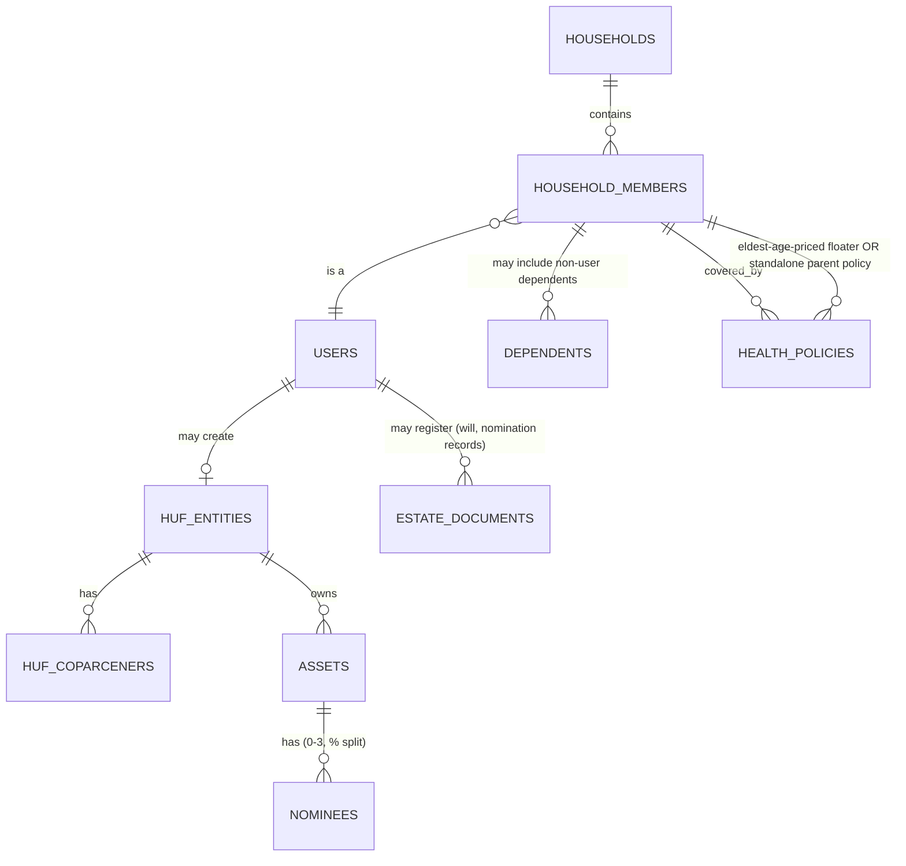

# Family & HUF Planning Report

**Date:** 2026-07-06
**Method:** Live-verified via web search, same standard as Phases 1-2. HUF/succession law changes far less frequently than tax slabs (these are decades-old codified Acts with periodic amendments), but the SEBI nomination rules below are a **May 2026 change, effective September 2026** — genuinely new, not stable background knowledge.

---

## Part A: Family Financial Planning Fundamentals

### Joint Income, Joint Goals, Family Cash Flow

Professional practice treats a family's finances as a **single household ledger with per-member attribution**, not merged-and-anonymized totals — every rupee of income, expense, asset, and liability is tagged to the family member who owns/earns it, and household-level views (net worth, cash flow, savings rate) are *derived* aggregates, never the source of truth. This is the single most important structural principle for Phase 5's database design: **the current Northstar schema has no concept of "household" at all — every table is keyed directly to a single `user_id`.** Retrofitting a household layer is an additive schema change (a new `households` and `household_members` layer sitting above the existing per-user tables), not a rewrite, but it does mean every existing query that currently assumes "the current user's data is all the data" needs an explicit household-scoping decision.

### Children & Education Planning

Two distinct planning modes, commonly conflated:
1. **Dedicated child-goal savings** — SSY (Phase 1, girl child only, EEE, 21-year horizon) or a generic goal-tracked investment for a boy child (no equivalent government EEE scheme exists specifically for a male child — this asymmetry is a real, verified fact, not an oversight in this report).
2. **Child insurance/protection** — distinct from savings: what happens to the education goal if the earning parent dies before the goal matures. This is a term-insurance sizing question (covered in the Private Product Research phase), not a savings-scheme question — the two are often bundled by product marketing in ways that obscure that they solve different problems.

### Dependent Parents & Medical Planning

**Verified, concrete, and directly actionable for a recommendation engine:**
- Purchasing a **separate** family-floater policy for dependent parents (rather than adding them to the primary family's floater) is the professionally-recommended default, because floater premiums price off the *eldest* member's age — adding a 65-year-old parent to a young couple's floater inflates the whole family's premium and couples claim risk across generations unnecessarily.
- This also **doubles the available tax deduction**: up to ₹25,000 for a self/spouse/children floater, **plus a separate** ₹25,000 (₹50,000 if the parents are senior citizens) for a standalone parents' policy — a real, quantifiable planning recommendation your engine could surface automatically once a user records dependent parents.
- Medical cost inflation is running at **~11.5% annually** in 2026 versus ~4-5% general inflation — roughly 2.5-3x — meaning any emergency-fund or healthcare-goal calculation using the app's general inflation assumption for medical costs specifically will systematically understate the real target. This is a concrete gap in Northstar's current single-inflation-rate model (`FinancialAssumptions.inflation_rate`) — medical goals need their own inflation assumption.
- Sum-insured guidance: ₹10-15 lakh for a young family in a Tier-1 city; **₹15-25 lakh minimum once elderly parents are covered** (whether jointly or separately).

### Disabled Family Members

Not independently researched in this pass — flagged as a gap. India has specific tax provisions (Section 80DD/80U equivalents under the new Act) for maintenance of a disabled dependent that were not verified here and should not be assumed from memory given the same Act-renumbering risk documented in the Government Policy Report.

---

## Part B: HUF (Hindu Undivided Family) — Deep Dive

### What It Is

An HUF is **a separate legal taxable entity** recognized under Hindu law (also available to Sikh, Jain, and Buddhist families) — not a company, not a trust, but a family unit that can independently own assets, earn income, and file its own tax return, distinct from any individual member's personal return. It is headed by a **Karta** (typically the senior-most male member historically, though this has evolved via case law) who manages HUF affairs, with other family members as **coparceners** holding equal rights in HUF property — including daughters, following the 2005 amendment to the Hindu Succession Act (below).

### Formation

Genuinely simple: draft an HUF deed, obtain a separate PAN for the HUF, open a bank account in the HUF's name, and begin routing HUF-designated income/assets through it (typically funded via an initial gift or ancestral property).

### Tax Treatment — Why Families Create One

- **A second, independent basic exemption**: ₹4 lakh under the new regime / ₹2.5 lakh under the old regime — effectively a second "person's" worth of tax-free income for the same family.
- **A second set of deduction ceilings**: the HUF can independently claim 80C/123 (₹1.5 lakh), 80D, and capital-gains exemptions — separate from what each individual family member already claims personally.
- **Gifts from members to the HUF are not taxable** — a clean, legal mechanism for consolidating family wealth into a lower marginal rate structure.
- **Critical exclusion, verified:** the ₹12-lakh-effectively-tax-free **Section 87A rebate** (the mechanism that makes the new regime attractive for individuals) is **only available to resident individuals — not to HUFs.** An HUF facing the new-regime slab structure without the rebate is a materially different calculation than an individual's, and this distinction must not be glossed over in any HUF-vs-individual comparison the app ever shows a user.

### Disadvantages — Why HUF Is Not Universally Recommended

- **Dissolution requires unanimous consent of all coparceners** — every member has an equal, indivisible claim on HUF property, so a family disagreement (common in multi-generational households) can make winding down an HUF genuinely difficult, unlike simply closing a personal account.
- **Partition triggers its own valuation disputes, legal/administrative cost, and capital-gains/tax consequences** on the distributed assets — not a clean, penalty-free exit.
- **Ongoing compliance burden**: a second PAN, a second tax return, and the administrative overhead of maintaining HUF-vs-personal books distinctly (commingling HUF and personal funds carelessly is a common real-world compliance failure this report flags but does not attempt to fully enumerate).

### When To Recommend (and When Not To)

**Reasonable fit:** families with genuine ancestral property or a business that can legitimately be routed through an HUF structure, in a stable multi-generational household where all coparceners are aligned, and where the tax-bracket arbitrage (a second exemption + deduction ceiling) is large enough in absolute rupee terms to justify the compliance overhead.

**Poor fit — and this is the more common case for the kind of individual/nuclear-family user Northstar's current personas likely represent:** a young, single-earner nuclear family with no ancestral property has nothing legitimate to fund an HUF with (contributions must have a real income/asset source — an HUF cannot simply be gifted current salary income without other tax consequences), and the dissolution/compliance overhead is disproportionate to the tax benefit for a small corpus.

**Product implication:** an HUF recommendation should be **gated behind a real eligibility check** — presence of ancestral property, family business income, or a sufficiently large joint corpus — not offered as a generic "save more tax" suggestion to every user. This is exactly the kind of feature your brief's "challenge every assumption" instruction should apply to hardest: HUF is a compelling *tax* story but a genuinely narrow-fit *product* recommendation, and a poorly-gated HUF suggestion risks steering an unprepared young family into a structure with real dissolution friction later.

---

## Part C: Nomination, Succession & Estate Planning

### Nomination Rules — Major Change, Verified (May 2026, effective September 2026)

**This is new enough that it should not be treated as settled background knowledge in any future phase of this engagement:**

- From **1 September 2026**, every new single-holder demat account or mutual fund folio **must** carry either a registered nominee or a formal opt-out declaration — a blank nomination field is no longer permitted for new accounts.
- SEBI has **simplified** nominee data requirements: only the nominee's **name and relationship** are mandatory (date of birth additionally required if the nominee is a minor); PAN, Aadhaar, passport, email, and mobile are now **optional**, not mandatory — a meaningful reduction in onboarding friction versus older, stricter rules.
- Up to **three nominees per account/folio**, each assignable a specific **percentage share**.
- A witness signature is required only when the investor signs via thumb impression (not for a normal signature).
- **Joint-holder accounts remain exempt** — nomination is optional there, since co-owners already have survivorship rights.

**Product implication:** Northstar's `assets`/financials schema currently has no nominee concept at all. Given this rule applies at the *account/folio* level (i.e., per-asset, not per-user), any future nominee feature should be modeled as a property of each asset/account record (with support for multiple nominees + percentage split, mirroring the regulation directly), not as a single user-level "next of kin" field.

### Succession Law — Two Different Acts, Commonly Confused

- **Hindu Succession Act, 1956** (amended 2005) governs **intestate** succession (no will) for Hindus, Buddhists, Jains, and Sikhs — a class-based heir hierarchy (Class I heirs first, then Class II, then agnates, then cognates). The 2005 amendment gave **daughters equal coparcenary rights with sons** — verified as firmly established by repeated Supreme Court rulings through 2026, though the same research notes real-world "awareness gaps... and social resistance to women claiming property" persist as practical (not legal) obstacles.
- **Indian Succession Act, 1925** governs how a **will** must be executed and interpreted, for Hindus and non-Hindus alike, **once someone actually makes one.**
- **The practical planning takeaway:** the Hindu Succession Act is the *default* that applies only in the absence of a will — the single highest-leverage estate-planning action for any user is simply having a valid will at all, which sidesteps the class-hierarchy default entirely and lets the user's actual wishes govern. This is a much simpler, more universally-applicable recommendation than HUF, and arguably belongs earlier in any recommendation-engine priority order than HUF does.

---

## Part D: Database Entities This Phase Implies

None of the following exist in the current schema (confirmed in the Project Discovery Report) — this is the concrete input for Phase 5:

Key new entities: `households`, `household_members` (linking real `users` rows plus non-user dependents like minor children or parents with no login), `huf_entities` + `huf_coparceners`, `nominees` (per-asset, percentage-split, per the SEBI rule above), `estate_documents` (will existence/status — not the will's legal content, which is out of scope for a financial-planning app to store), and a `health_policies` entity distinct from the generic `assets`/`liabilities` tables since floater-vs-standalone pricing logic is genuinely different from a savings/investment asset.

---

## What's Not Covered in This Pass

Disabled-dependent tax provisions, trust structures (mentioned in your original brief but not researched here — trusts are a materially different legal vehicle from HUF and deserve their own dedicated research pass rather than being folded in as an afterthought), and detailed will-drafting/registration mechanics. Flagged for a follow-up phase if these become priorities before Phase 5's schema is finalized.
