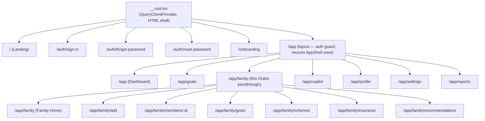
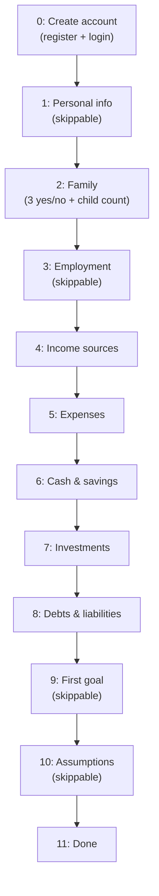
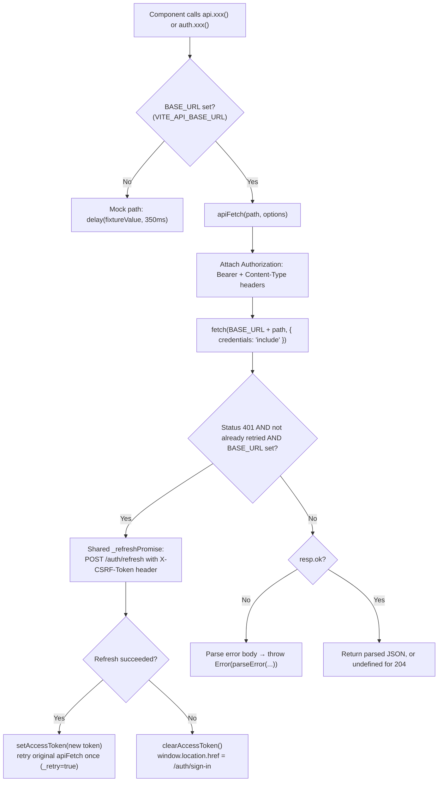

# FRONTEND ARCHITECTURE & USER EXPERIENCE BIBLE

**Volume 6 of the Northstar Project Engineering Bible**
**Date compiled:** 2026-07-10
**Method:** every route file (`code/src/routes/*.tsx`, 21 files), every hand-written component (`code/src/components/**/*.tsx`, excluding the 57-file shadcn `components/ui/` primitive scaffold, which was inventoried and spot-checked for actual usage rather than read line-by-line), every file in `code/src/lib/` (9 files, including the complete `api.ts` backend contract), the one custom hook (`hooks/use-mobile.tsx`), the router/entry files (`router.tsx`, `start.ts`, `server.ts`, `__root.tsx`), the design-token stylesheet (`styles.css`), and `package.json` were read in full for this document. Zero frontend test files exist in this repository (confirmed by `find code/src -iname "*.test.*" -o -iname "*.spec.*"` returning nothing) — restated from Volume 1 §14, re-verified independently here. This volume cross-references Volumes 1–5 rather than re-deriving facts they already established (App Shell mechanics, Global Palette, Notification Center, Calculation Lifecycle, Family business rules) — restated only where this volume's component-level framing adds something those higher-level treatments didn't already capture.

---

## 1. Frontend Overview

Northstar's frontend is a **TanStack Start** (React 19) application — file-based routing via `@tanstack/react-router`, SSR-capable (`shellComponent`/`RootShell` in `__root.tsx`), built with Vite 8. It is a **Lovable-generated project** (confirmed by `__root.tsx`'s own default meta tags — `"Lovable App"`, `"Lovable Generated Project"`, and `code/src/lib/lovable-error-reporting.ts`'s `window.__lovableEvents` integration), later customized into the Northstar product (the meta tags are overridden per-route via `head()`, e.g. `index.tsx`'s `"Northstar — AI Goal-Based Financial Planning"`).

**Two operating modes, one codebase:** every function in `code/src/lib/api.ts` branches on `BASE_URL = import.meta.env.VITE_API_BASE_URL`. When set, every call hits the real FastAPI backend (Volumes 1–5). When unset, every call resolves a mock fixture after an artificial `350ms` delay (`delay()`), so the entire UI — onboarding, goals, family, insurance, schemes, recommendations, notifications — is fully interactive and visually complete with zero backend running. This is not a partial stub: mock functions like `mockFamilyHomeFrom` and `mockFamilyMemberFrom` deliberately mirror the *exact* business rules of their real backend counterparts (onboarding seeding shape, `is_complete` logic, SSY eligibility) so the mock path exercises the same UI branches production does (§24).

**No frontend automated test suite exists** — restated and reconfirmed: no `*.test.tsx`/`*.spec.tsx` file exists anywhere under `code/src/`. Frontend correctness in this project is verified by `tsc --noEmit`, `eslint`, and manual/live browser verification only (Volume 1 §14).

**Screen count:** 21 routed screens (2 public marketing/auth-adjacent + 4 auth + 1 onboarding wizard + 14 authenticated `/app/*` screens), enumerated fully in §3.

---

## 2. Folder Structure

```
code/src/
├── routes/                    File-based routes — one file = one URL
│   ├── __root.tsx              Root route: HTML shell, QueryClientProvider, 404/error boundaries
│   ├── index.tsx                "/" — public marketing landing page
│   ├── auth.sign-in.tsx         "/auth/sign-in"
│   ├── auth.forgot-password.tsx "/auth/forgot-password"
│   ├── auth.reset-password.tsx  "/auth/reset-password"
│   ├── onboarding.tsx           "/onboarding" — 12-step wizard (all steps in one file + 2 component files)
│   ├── app.tsx                  "/app" layout — auth guard + mounts <AppShell> once
│   ├── app.index.tsx            "/app" — Dashboard
│   ├── app.goals.tsx            "/app/goals"
│   ├── app.family.tsx           "/app/family" layout — thin <Outlet/> passthrough
│   ├── app.family.index.tsx     "/app/family" — Family Home (composed page)
│   ├── app.family.add.tsx       "/app/family/add"
│   ├── app.family.members.$id.tsx "/app/family/members/:id"
│   ├── app.family.goals.tsx     "/app/family/goals"
│   ├── app.family.schemes.tsx   "/app/family/schemes"
│   ├── app.family.insurance.tsx "/app/family/insurance"
│   ├── app.family.recommendations.tsx "/app/family/recommendations"
│   ├── app.copilot.tsx          "/app/copilot"
│   ├── app.profile.tsx          "/app/profile"
│   ├── app.settings.tsx         "/app/settings"
│   └── app.reports.tsx          "/app/reports"
├── components/
│   ├── app-shell.tsx            Persistent sidebar + header + mobile nav (Volume 1 §2.6)
│   ├── global-palette.tsx       ⌘K Command Palette (Volume 1 §2.6)
│   ├── notification-center.tsx  Header bell popover (Volume 1 §2.6)
│   ├── dashboard/                4 files — Dashboard-only visualizations and the goal detail panel
│   ├── family/                   1 file — FamilyMemberForm.tsx, shared by Add and Edit flows
│   ├── onboarding/                2 files — wizard-steps.tsx (account/personal/family/employment/goal/assumptions), list-steps.tsx (income/expenses/assets/liabilities)
│   └── ui/                       57 files — shadcn-style Radix scaffold (button, dialog, dropdown-menu, popover, command, etc.)
├── hooks/
│   └── use-mobile.tsx            useIsMobile() — sole consumer is ui/sidebar.tsx (§26, FE-006)
├── lib/
│   ├── api.ts                    The entire backend contract — 1 file, every domain (§24)
│   ├── mock-data.ts               Goal fixture + dashboard/net-worth/allocation fixtures + formatCurrency/formatPercent
│   ├── family.ts                  relationshipLabel/relationshipIcon — shared presentation-only helpers
│   ├── shell-title.ts             ShellTitleOverrideContext + useShellTitle() escape hatch
│   ├── utils.ts                   cn() — clsx + tailwind-merge
│   ├── error-page.ts              Static HTML string for a catastrophic-SSR-failure fallback page
│   ├── error-capture.ts           Out-of-band global error capture for server.ts's h3-swallowed-error recovery
│   ├── lovable-error-reporting.ts reportLovableError() — forwards React error-boundary catches to window.__lovableEvents
│   └── router-static-data.d.ts    Module augmentation adding `staticData.shellTitle` to TanStack Router's route option types
├── router.tsx                    getRouter() — creates the QueryClient + the TanStack Router instance
├── start.ts                       createStart() — server request middleware (error-page fallback)
├── server.ts                      Cloudflare/edge-style fetch handler wrapping the SSR entry, with h3-swallowed-error recovery
├── routeTree.gen.ts                Auto-generated by @tanstack/router-plugin — never hand-edited
└── styles.css                     "Deep Navy Premium" design tokens — frozen per CLAUDE.md
```

**Organizing principle:** file-based routing means the `routes/` tree *is* the sitemap — a new engineer can read the file list above and know every URL the app serves without opening a router config. Components are split by scope: shell-level (`app-shell.tsx`, `global-palette.tsx`, `notification-center.tsx` live at `components/` root because they're used by the layout, not any one page), domain-scoped (`dashboard/`, `family/`, `onboarding/`), and the generic, largely-unused-beyond-a-few-primitives `ui/` scaffold.

---

## 3. Routing Architecture

**Engine:** TanStack Router, file-based (`@tanstack/router-plugin` generates `routeTree.gen.ts` from the `routes/` directory at build time — this file is never hand-edited, confirmed by its own generated-file header comment).

**Route tree:**



**Route guarding.** `/app`'s `beforeLoad` checks `localStorage.getItem("ns_access_token")` and `throw redirect({ to: "/auth/sign-in" })` if absent — SSR-safe (`typeof window === "undefined"` guard first). `AppLayout`'s own component body **re-checks on every mount** via a client-side `useEffect`, including after SSR hydration, before rendering `<AppShell>` — a `ready` state gate (`if (!ready) return null`) prevents a flash of authenticated content before the check completes. **No route below `/app` has its own individual auth check** — the layout route is the single gate for all 11 authenticated screens (Volume 1 §12 restated at the component level).

**`staticData.shellTitle`.** Every `/app/*` leaf route declares its persistent-header title via `createFileRoute(...)({ staticData: { shellTitle: "..." } })` — a TanStack Router option this codebase augments via `router-static-data.d.ts`'s module declaration. `AppShell` reads whichever route is currently deepest-matched (`useMatches({ select: (matches) => matches[matches.length - 1]?.staticData?.shellTitle })`). **Exactly one route needs a title that varies at render time, not just per-route:** `app.family.add.tsx`'s title depends on its own `?type=` search param ("Add a parent who depends on you" vs. "Add someone else") — for this one case, the leaf calls `useShellTitle(dynamicTitle)` (`lib/shell-title.ts`), a narrow `useLayoutEffect`-based override context, not a general title API.

**Search-param validation (Zod, 3 routes only — §21):**
| Route | Schema | Purpose |
|---|---|---|
| `/app/goals` | `{ new: z.boolean().default(false) }` | Lets the Command Palette's "Create Goal" quick action open the page's existing "New goal" modal via `?new=true` |
| `/auth/reset-password` | `{ token: z.string().optional() }` | Carries the reset token from the forgot-password flow's dev-mode link |
| `/app/family/add` | `{ type: z.enum(["parent", "other"]).default("other") }` | Determines which relationship-type form renders |

**404 and error handling** are declared once, at the root (`__root.tsx`'s `notFoundComponent`/`errorComponent`) — every route in the tree inherits the same not-found and error-boundary UI; no leaf route defines its own (§30).

---

## 4. App Shell

*(Full mechanics already certified in Volume 1 §2.6/§7.4/§9/§13/§15.8 — restated here compactly, with the component-level detail those architecture-level passes didn't need.)*

`components/app-shell.tsx` (361 lines) is mounted exactly once, by `/app`'s layout route (`app.tsx`), and persists across every navigation within `/app/*` — only its `<Outlet/>`-rendered leaf content swaps. It owns:

- **Desktop sidebar** (`lg:` breakpoint and above): logo/wordmark link to `/`, 7-item primary nav (`nav` array — Dashboard/Goals/Family/AI Copilot/Reports/Profile/Settings), a live Plan Health mini-card (reads the shared `["dashboard"]` query, §23) shown only once loaded, and a Sign Out button.
- **Header** (all breakpoints): dynamic page title, a Search trigger button (opens the Command Palette, `⌘K` hinted via a `<kbd>`), the Notification bell, and a Profile dropdown menu (avatar-initials trigger, account info, My Profile/Settings links, Sign Out).
- **Mobile bottom nav** (`lg:hidden`): a fixed 5-slot bar — 4 primary items (Dashboard/Goals/Family/Copilot, per `MOBILE_PRIMARY`) plus a "More" button that opens a small popover listing the 3 overflow items (Reports/Profile/Settings, per `MOBILE_MORE`).
- **`activeOverlay` state** (Milestone 2.6.1, Volume 1 §15.8): a single `"palette" | "notifications" | "profile" | "more" | null` value structurally guaranteeing only one header overlay is ever open — `GlobalPalette`, `NotificationCenter`, and the profile `DropdownMenu` are all controlled components (`open`/`onOpenChange`) driven by this one variable, and the mobile "More" sheet reuses the same variable rather than a fifth independent boolean.
- **`⌘K`/`Ctrl+K` global listener**, registered once via `useEffect` (empty dependency array) since `AppShell` itself mounts once per session, not once per navigation.
- **Two `useQuery` calls**, `["currentUser"]` (`auth.me`, 5-minute `staleTime`) and `["dashboard"]` (`api.getDashboard`, 60-second `staleTime`) — both intentionally sharing cache keys with other consumers (the Dashboard route itself, `GlobalPalette`) so the shell's own data needs never trigger a second, independent fetch.

**Avatar initials logic** (`computeInitials`): first+last-word initials for a multi-word name, first two characters of a single-word name, `"?"` on a fetch error, `"··"` while loading — a three-state display preserved verbatim from the pre-Phase-0 implementation this replaced.

---

## 5. Authentication UX

Four screens, all hand-rolled forms (no shared `<AuthLayout>` component — each screen repeats its own `hero-bg` full-screen wrapper and card markup independently).

| Screen | Fields | Client validation | Success path | Failure path |
|---|---|---|---|---|
| **Sign in** (`auth.sign-in.tsx`) | Email, password (show/hide toggle) | HTML5 `required`/`type="email"` only — no client-side password-strength check | `auth.login` → `setAccessToken` → `navigate({ to: "/app" })` | Inline red error banner; the same message for "user not found" and "wrong password" (mirrors the backend's deliberate 401-for-both, Volume 4 §3.2) |
| **Forgot password** (`auth.forgot-password.tsx`) | Email | none beyond `required` | 3-state machine (`idle→loading→sent`/`error`) — "sent" state shows a generic confirmation **and**, only when the mock/dev backend returns a `reset_token` in the body (Volume 4 §3.6's `settings.debug`-gated behavior), a dev-mode reveal box with a direct link into Reset Password | Inline error banner |
| **Reset password** (`auth.reset-password.tsx`) | Reset token (pre-filled from `?token=` if present, else a manual field), new password, confirm password | Live mismatch detection (`confirm.length > 0 && password !== confirm`) disables submit and shows an inline "Passwords don't match" message; `minLength={8}` on the password field | `auth.resetPassword` → success screen with a "Go to sign in" CTA | Inline error banner, generic "may have expired" copy |
| **Onboarding account step** (`onboarding.tsx`'s step 0) | Full name, email, password, confirm | Password length (`≥8`) and match checked client-side before the network call | `auth.register` → `auth.login` (immediate, same form submission) → `setAccessToken` → advance to step 1 | Inline error banner; registration failure (e.g. duplicate email) surfaces the backend's own message via `err.message` |

**Session mechanics** (Volume 1 §12, restated at the client-code level): `setAccessToken`/`clearAccessToken` (`lib/api.ts`) write/clear `localStorage["ns_access_token"]` — the only place JS ever handles the access token directly. The refresh token and CSRF pair are never touched by React code at all; `apiFetch`'s automatic-refresh-on-401 logic (§24) is the only code path that references `getCsrfToken()` (reads the JS-readable `ns_csrf_token` cookie) and calls `/auth/refresh`.

---

## 6. Navigation System

Three concurrent navigation surfaces, all reading from the same `nav`/`PAGES` intent but never sharing one literal array (a real, minor duplication — `AppShell`'s `nav` and `GlobalPalette`'s `PAGES` are two independently-maintained lists, the latter additionally including Schemes/Insurance/Recommendations, which have no sidebar entry at all):

1. **Desktop sidebar** (§4) — 7 items, always visible ≥`lg`.
2. **Mobile bottom nav + "More" sheet** (§4) — 4 primary + 3 overflow, visible <`lg`.
3. **Command Palette** (§15) — every page in `PAGES` (10 entries) plus 2 quick actions, keyboard- and click-invoked from anywhere.

**In-page navigation** (not part of any of the three above): Family Home's Quick Actions and 4 feature links (Goals/Insurance/Schemes/Recommendations) are the *only* way to reach `/app/family/schemes`, `/app/family/insurance`, and `/app/family/recommendations` outside the Command Palette — confirmed by grep, no sidebar or bottom-nav entry links to any of these three directly (Volume 1 §9's "Search Scope Review" comment in `global-palette.tsx` states this explicitly).

**Active-state logic**, identical in both the sidebar and mobile nav: `item.exact ? pathname === item.to : pathname.startsWith(item.to)` — the Dashboard entry (`/app`) is the only one marked `exact`, since every other route's path is a proper prefix-safe distinguishing string (`/app/goals` vs. `/app/goals/xyz` never collides with `/app`).

---

## 7. Dashboard

**Route:** `app.index.tsx` (`/app`, `staticData.shellTitle: "Overview"`).

**Composition, top to bottom:**

1. **4 stat cards** (net worth w/ YTD delta, invested, liquid, monthly savings w/ savings-rate delta) — `useQuery(["dashboard"])`, skeleton (`StatSkeleton`) while loading.
2. **`FamilyCard`** — a single quiet link-card summarizing the Family Dashboard (`useQuery(["family-dashboard"])`). **Deliberately renders `null` on loading or error** (no skeleton, no error state) — the code comment states this explicitly: "the money dashboard must never break or grow a second spinner because the family aggregate is unavailable."
3. **Cash flow strip** — income/expenses/net savings, shown only if `monthly_income > 0 || monthly_expenses > 0` (an implicit empty-state: a brand-new account with no financials recorded yet sees no strip at all, not a strip full of zeroes).
4. **Net worth projection chart** (`NetWorthProjection`, §29 FE-008) + **Wealth breakdown donut** (`NetWorthBreakdown`) side by side.
5. **Goals list** (first 4, `userGoals.slice(0, 4)`) with a "Manage goals" link, empty state ("No goals yet" + CTA), loading skeleton.
6. **AI Copilot preview card** — reuses `dashData.suggestions` (the same rule-based suggestions the backend's `_generate_suggestions` produces, Volume 2 §10) with a severity-colored icon per item, and a link into the full Copilot screen.

**Data sources:** exactly two `useQuery` calls at the page level (`["dashboard"]`, `["goals"]`), both cache-shared with other consumers (`AppShell` shares `["dashboard"]`; `GlobalPalette` shares `["goals"]`). `FamilyCard` adds a third, independent query (`["family-dashboard"]`).

---

## 8. Goal Management

**Two screens compose this feature:** `app.goals.tsx` (list + create) and `components/dashboard/GoalSimPanel.tsx` (a slide-over detail panel for one goal — simulate, optimize, edit, delete).

**List screen** (`app.goals.tsx`): search-by-name filter (client-side substring match), a 3-way status filter (All/On track/At risk, client-side on `g.onTrack`), a responsive card grid, and a "New goal" modal. **Data fetching bypasses React Query** — a raw `useEffect(() => { api.getGoals().then(setGoals).finally(...) }, [])` (§29, FE-005) — meaning this screen's own goal list is a second, independent in-memory copy from whatever `["goals"]` the Dashboard or Command Palette may have already cached.

**New Goal modal:** name, category (6-way select), target amount, monthly contribution, years-to-goal, risk profile (3-button visual picker). On submit, `api.createGoal` is called with `targetDate` computed client-side (`new Date(); setFullYear(+yearsToGoal)`) — the backend then runs the unconditional Monte Carlo trigger on create (Volume 2 §9).

**`GoalSimPanel`** (a right-side slide-over, `motion.aside` with a spring transition): shows progress (current/target, percent bar), an **inline edit form** (name/category/target/current/monthly/years/risk — toggled via a pencil icon in the header, not a separate route), the `EducationPlanningSection` (education-category goals only), a **Monte Carlo section** ("Run 10,000 paths" button → `api.simulate` → success-rate + p10/p50/p90 bars), an **Optimization section** ("Optimize toward 80%" button → `api.optimize` → ranked suggestions, each optionally offering a one-click "Switch to {risk}" action that calls `api.updateGoal({ riskProfile })` directly), and a two-step delete confirmation.

**Verified inconsistency, restated precisely at the component level (Volume 2 §3.1's finding, now pinned to its exact two source lines):** `GoalSimPanel.tsx`'s `goalToEditForm` computes `years` via `Math.max(1, new Date(g.targetDate).getFullYear() - new Date().getFullYear())` — calendar-year subtraction — while the backend's actual simulation horizon (Volume 2 §3.1) is `(target_date - today).days / 365.25`. The edit form's "Years to goal" field and the Monte Carlo panel's own `years` computation for `runSim`'s `yearsToGoal` argument (`Math.max(0, new Date(goal.targetDate).getFullYear() - new Date().getFullYear())`, a **third**, slightly different variant with a `0` floor instead of `1`) both use this frontend approximation, not the backend's day-count formula — a real, minor display/simulate-input discrepancy near a goal's target date, never affecting the backend's own stored `probability` (which is always computed server-side from the exact date).

---

## 9. Family Workspace

*(Business rules fully certified in Volume 5 — this section covers only the UI composition, screen-by-screen, that surfaces those rules.)*

| Screen | Route | Purpose | Data hooks |
|---|---|---|---|
| Family Home | `/app/family` | Household summary, member list (complete/incomplete badges), the embedded 6-card Family Dashboard + recommendations feed, quick actions, links to the 4 sub-features | `["family-home"]`, `["family-dashboard"]` |
| Add Family Member | `/app/family/add` | Net-new parent or other-type member only (`?type=parent\|other`) | mutation only, invalidates `["family-home"]` |
| Family Member Detail | `/app/family/members/:id` | View (name, DOB, tagged goals, coverage) or edit (same form as Add) — a placeholder member renders the form immediately (no view state exists for an incomplete member) | `["family-member", id]` |
| Family Goals | `/app/family/goals` | Per-member sections of tagged goals + an "untagged" bucket; inline tag-editing checkboxes per goal | `["family-goals"]`, `["family-home"]` |
| Government Schemes | `/app/family/schemes` | Three-bucket display (Eligible now / Potentially eligible / Not eligible, the last collapsed behind a `<details>`) | `["family-schemes"]` |
| Family Insurance | `/app/family/insurance` | Recommendation card (if any) + policy list + inline "Add a policy" form | `["family-insurance"]`, `["family-home"]` |
| Family Recommendations | `/app/family/recommendations` | Conflict banners + full recommendation cards, each with a collapsible "What we used / don't know yet" detail | `["family-recommendations"]` |

**Family Home's structure**, top to bottom: `FamilyContent` (household summary card + member list, or `EmptyState` if only the `self` member exists) → `FamilyDashboardSection` (the 6 cards + recommendations feed, §12) → `QuickActions` (2 links: "Add a parent," "Add someone else") → 4 feature links (Goals/Insurance/Recommendations/Schemes) → a single, honestly-labeled "Coming soon" section (`COMING_SOON` array — currently just "Recent changes," a future audit-log viewer, per Volume 5 §10's own "no audit-log viewer UI exists" finding).

**`FamilyMemberForm`** (shared by Add and Edit): renders a different field set per `relationshipType`, mirroring `family_service.validate_member_fields` exactly (Volume 5 §11, BR-005) — spouse/child get a required DOB field, parent gets relationship-detail (mother/father select) + has-own-insurance (yes/no/not-sure select), other gets a free-text relationship-detail field, and child alone gets an optional gender select. **Client-side `validate()` is a deliberate, explicit mirror of the backend's own rule set** (the function's own comment: "this is client-side UX (fail fast, clear message) only; the server remains the real enforcement") — a genuine defense-in-depth pattern, not duplicated business logic pretending to be authoritative.

**Family Goals' disclosure text** (`disclosureText`): every tagged goal explicitly states "This goal belongs to your account. {names} can see it if you share access, but their own contributions aren't tracked separately yet." — a precise, honest UI-level enforcement of Volume 5 §4's "tags never imply ownership" rule, worth noting as a positive example (§34).

---

## 10. Government Schemes Screen

Covered structurally in §9's table. UI-specific detail: three sections use distinct visual tones (`TONE_STYLES` — emerald for eligible, warning-amber for potentially eligible, neutral for not-eligible), the eligible and potentially-eligible sections are always expanded, and the not-eligible section is collapsed behind a native `<details>`/`<summary>` (keyboard-accessible by default, no custom JS needed) labeled "Not eligible — show N more." An empty state ("No schemes matched yet") appears only if all three buckets are empty — which, per Volume 5 §5.4's BR-014, is common for a household with no children or seniors, since 7 of 9 seeded schemes can never appear as anything but `not_eligible`.

---

## 11. Insurance Screen

Covered structurally in §9's table. The recommendation card (if `data.recommendation` is non-null) renders first, above the policy list — `why`/`why_now` text plus two pill badges showing the floater and standalone-parent deduction limits (`formatINR`), and a collapsible "What we used, and what we don't know yet" detail matching the Recommendations screen's own pattern exactly (shared UX convention, not shared code — the two `<details>` blocks are hand-duplicated in `app.family.insurance.tsx` and `app.family.recommendations.tsx`, not a shared component). Each policy row supports inline coverage editing (checkbox list of household members, `api.updatePolicyCoverage`) — **there is no delete/remove action anywhere on this screen**, correctly matching the backend's own absence of a policy-delete endpoint (Volume 5 §11 BR-029) rather than offering a control that would fail.

---

## 12. Recommendation Experience

Two independent renderings of the identical `FamilyRecommendation`/`RecommendationConflict` data: the compact feed embedded in Family Home's dashboard section (`DashboardRecommendationsFeed` — icon + `why` text + "See full detail →" link, conflicts rendered as small warning banners) and the full standalone screen (`app.family.recommendations.tsx` — `why` + `why_now` + the same collapsible evidence detail as Insurance). Both read from the same underlying data shape but via **two separate `useQuery` calls with two separate cache keys** (`["family-dashboard"]` embeds its own copy; `["family-recommendations"]` is the standalone screen's) — not a shared query, so the two screens can transiently disagree for up to their respective `staleTime` windows after an underlying fact changes, even though the backend itself guarantees they'd compute identically if fetched at the same instant (Volume 4 §3.22's `test_feed_identical_to_recommendations_endpoint`).

---

## 13. Reports

**Route:** `app.reports.tsx`. A single-page, read-only summary: 4 stat cards (net worth, plan health score with severity-colored text, goals-on-track ratio, monthly savings), a full goal-breakdown table (progress bar per goal, on-track/needs-attention badge), and a cash-flow strip — all sourced from one `api.getReportSummary()` call. **Bypasses React Query** (raw `useEffect` + `.then()`, §29 FE-005) — the fourth confirmed instance of this pattern. The "Export PDF" button calls the browser's native `window.print()` — **there is no server-generated PDF anywhere in this codebase**; "export" means "use your browser's print-to-PDF," confirmed by grep (no PDF-generation library in `package.json`).

---

## 14. AI Copilot

**Route:** `app.copilot.tsx`. A chat UI: a scrolling message list (user messages right-aligned with a gradient bubble, assistant messages left-aligned with a bordered surface bubble), a 3-dot "thinking" indicator during a pending request, 4 canned suggestion buttons, and a text input + send button. The greeting message is personalized via a separate, **uncached** `auth.me()` call (not the shared `["currentUser"]` query) — a first-name-only greeting, falling back to a generic greeting on fetch failure. Every send calls `api.chat(text, convId)`, threading the returned `conversation_id` into subsequent calls — **conversation history is never persisted anywhere** (Volume 4 §3.12 confirmed no `Conversation` table exists; this is purely a client-side array, lost on refresh/navigation away).

---

## 15. Search

*(Fully certified in Volume 1 §2.6/§9 — restated compactly with component-level detail.)*

`components/global-palette.tsx` (321 lines) is the Command Palette (`cmdk`-based, `⌘K`/`Ctrl+K` or the header Search button). **Entirely client-side** — zero backend endpoint of its own (Volume 1 §9, reconfirmed by this pass: no `/search` call anywhere in `api.ts`). Search scope: `PAGES` (10 static entries), `QUICK_ACTIONS` (2: Create Goal, Add Family Member), and, **only once the palette has been opened at least once** (`enabled: everOpened` on all 4 lazy queries — goals/family-home/family-schemes/family-insurance), live results filtered by `cmdk`'s own in-memory fuzzy scorer against `value` strings built per item (e.g. `"${goal.name} ${goal.category}"`). **Recent searches** persist in `localStorage`, keyed per-user (`ns_recent_searches_{userId}`, capped at 5, most-recent-first) — shown only when the input is empty.

**Deep-linking limitation, restated precisely (Volume 1 §16):** only Family Member results navigate to a specific record (`/app/family/members/$id`); Goal/Scheme/Insurance results all navigate to their respective list screen, never a specific item — because no URL-addressable detail route exists for those three entity types.

---

## 16. Notifications

*(Fully certified in Volume 1 §7.5/§10.3, Volume 5 §9 — restated compactly.)*

`components/notification-center.tsx` (189 lines) — a header-bell `Popover`, `useQuery(["notifications"])` with `refetchInterval: 120_000` (2-minute polling, no WebSocket/SSE) and `staleTime: 30_000`. Items are split into "Today" and "Earlier" sections (`isToday()`, a pure client-side date comparison). Each row supports **open** (marks read via `readMutation` if currently unread, closes the popover, navigates to `item.action_path`) and **dismiss** (a small `X` button, visible on hover/focus, calls `dismissMutation` — both mutations `invalidateQueries(["notifications"])` on success, never optimistically update). Unread count renders as a small badge on the bell icon, capped display at `"9+"`.

---

## 17. Profile

**Route:** `app.profile.tsx`. Editable fields: full name, email (both via `auth.updateMe`) — a `isDirty` comparison against the last-saved snapshot gates the Save button and reveals a Discard button. A read-only "Household" field lists every family member (name or relationship label, "· not yet added" for an incomplete non-self member) sourced from `api.getFamilyHome()`, explicitly captioned "can't be edited here yet" (correctly pointing users to the Family screens rather than implying in-place editing). **Bypasses React Query** (`Promise.all([auth.me(), api.getFamilyHome()]).then(...)` in a raw `useEffect`, §29 FE-005) — the second confirmed instance.

---

## 18. Settings

**Route:** `app.settings.tsx`. Three sections: **Change Password** (current/new/confirm, live mismatch detection, `auth.changePassword` — the one password-change flow in this app that requires proof of the current password, Volume 4 §3.7), two **honestly-labeled "Coming soon" cards** (Notifications digest, Linked accounts via Plaid — both explicitly `opacity-60` with a "Coming soon" pill, never rendered as if functional), and **Delete Account** — a type-`DELETE`-to-confirm pattern (`auth.deleteAccount` → `auth.logout` → `clearAccessToken` → redirect to sign-in), copy stating "Permanently deactivates your account. Your data will not be recoverable" — **worth flagging precisely (§37, FE-010):** the backend's actual behavior (Volume 1 §12, §4.1) is a **soft** deactivation (`is_active = False`); "not be recoverable" overstates the guarantee for a user thinking about GDPR/CCPA-style erasure, since the underlying row (and every dependent row) is never hard-deleted.

---

## 19. Onboarding

**Route:** `onboarding.tsx` (617 lines) + `components/onboarding/wizard-steps.tsx` (555 lines) + `components/onboarding/list-steps.tsx` (505 lines) — a single-page, 12-step (`step` state `0`–`11`) wizard, no route change between steps (the URL stays `/onboarding` throughout).



| Step | Component | Fields | Backend call | Skippable |
|---|---|---|---|---|
| 0 | `AccountStep` (inline in `onboarding.tsx`) | Full name, email, password, confirm | `auth.register` → `auth.login` | No |
| 1 | `StepPersonal` | DOB (max = 18 years ago), gender, country, state/province | `api.upsertProfile` | Yes |
| 2 | `StepFamily` | 3 yes/no questions + conditional children count (1–10) | `api.seedFamilyOnboarding` | No (but every answer can be "no") |
| 3 | `StepEmployment` | Employment status, employer, occupation | `api.upsertProfile` | Yes |
| 4–8 | `StepIncome`/`StepExpenses`/`StepLiquidAssets`/`StepInvestments`/`StepLiabilities` | Repeated add/remove list pattern, one API call per item | `api.createIncome`/`createExpense`/`createAsset`(×2)/`createLiability`, `deleteX` per removal | Yes (button reads "Skip" if no items added, "Continue" once ≥1 exists) |
| 9 | `StepGoal` | Name, category, target amount, monthly contribution, years-to-goal, risk profile | `api.createGoal` | Yes |
| 10 | `StepAssumptions` | Inflation %, tax %, retirement age, Social Security $/mo | `api.upsertAssumptions` → `api.upsertProfile({ onboarding_complete: true })` | Yes (still marks `onboarding_complete: true`) |
| 11 | `DoneStep` | — | none | — |

**Every step save is best-effort and non-blocking** — `saveAndAdvance`'s `try/catch` explicitly swallows a failed `upsertProfile` call ("profile save is best-effort; never block the wizard") and advances regardless; step 10's `handleAssumptions` does the same for the entire assumptions save. This is a deliberate UX choice (never trap a user mid-wizard on a transient network blip) at the cost of silent data loss if a save genuinely fails (§30).

**Critical UX-copy finding (§37, FE-002 — the most consequential frontend/backend mismatch found in this pass):** Step 10's own copy states **"These defaults power every projection"** directly above fields for expected-return assumptions, tax rate, retirement age, and Social Security — but Volume 2 §1/§15.9 established, and this session independently re-confirmed by reading `financial_assumptions`' zero calculation consumers, that **none of these four fields are ever read by any calculation anywhere in the backend** (only `inflation_rate` is read, and only by the frontend-only Education Cost projection, §29 FE-008). A new user is told, at the exact moment they're setting these numbers, that they "power every projection" — they do not power the Monte Carlo engine that produces every probability shown on their Dashboard, Goals, and Reports screens.

---

## 20. Forms

**No form library is actually used** despite `react-hook-form`, `@hookform/resolvers`, and `zod` all being declared dependencies (`package.json`) — see §26/§37 FE-006 for the full finding. **Every real form in this codebase is hand-rolled**: local `useState` per field (or one object-shaped `useState` per form), a `handleSubmit(e: React.FormEvent)` that calls `e.preventDefault()`, runs synchronous client-side validation, and awaits an `api.*` call inside a `try/catch/finally` that toggles a `saving`/`submitting` boolean.

**Complete form inventory (18 distinct forms):**

| Form | File | Fields | Validation style |
|---|---|---|---|
| Sign in | `auth.sign-in.tsx` | email, password | HTML5 only |
| Forgot password | `auth.forgot-password.tsx` | email | HTML5 only |
| Reset password | `auth.reset-password.tsx` | token, password, confirm | Live mismatch + `minLength` |
| Onboarding: account | `onboarding.tsx` | fullName, email, password, confirm | Password length + match, pre-submit |
| Onboarding: personal | `wizard-steps.tsx` `StepPersonal` | DOB, gender, country, state | HTML5 `max` on DOB only |
| Onboarding: family | `wizard-steps.tsx` `StepFamily` | 3 selects + conditional count | Manual range check (1–10) in `onboarding.tsx`'s `handleFamily` |
| Onboarding: employment | `wizard-steps.tsx` `StepEmployment` | status, employer, occupation | None (all optional) |
| Onboarding: income/expense/asset/liability ×5 | `list-steps.tsx` | type/category + amount (+ optional fields) | Manual `amount > 0` (or `>= 0`) check per add |
| Onboarding: first goal | `wizard-steps.tsx` `StepGoal` | name, category, target, monthly, years, risk | `required trim()` on name only |
| Onboarding: assumptions | `wizard-steps.tsx` `StepAssumptions` | 4 numeric fields | HTML5 `min`/`max`/`step` only |
| New Goal | `app.goals.tsx` | name, category, target, monthly, years, risk | HTML5 `required`/`min` only |
| Edit Goal | `GoalSimPanel.tsx` | same 7 fields as New Goal + currentAmount | HTML5 only |
| Add/Edit Family Member | `FamilyMemberForm.tsx` | name + relationship-type-conditional fields | Hand-written `validate()` mirroring backend rules exactly |
| Add Insurance Policy | `app.family.insurance.tsx` `AddPolicyForm` | type, sum insured, premium, insurer, covered members | Manual `selected.size === 0` check |
| Change Password | `app.settings.tsx` | current, new, confirm | Live mismatch + length ≥8 |
| Custom Inflation Rate | `EducationPlanningSection.tsx` | rate % | Manual `0–50` range check |
| Family Goal Tagging | `app.family.goals.tsx` `GoalTagRow` | checkbox set | None (empty selection is valid — untags everyone) |
| Policy Coverage Edit | `app.family.insurance.tsx` `PolicyRow` | checkbox set | Manual `selected.size === 0` check |

---

## 21. Validation

**Two independent validation layers, never unified:**

1. **HTML5 native attributes** — `required`, `type="email"`, `min`/`max`/`step`, `minLength`/`maxLength` — present on nearly every input, but every form also sets `noValidate` on its `<form>` element (confirmed across every form file read for this pass), meaning **the browser's native validation UI never actually fires** — these attributes exist only as a semantic/accessibility signal and a fallback for JS-disabled contexts, not as the enforcement mechanism.
2. **Hand-written JS validation functions**, run inside each form's own submit handler, producing a plain string error message rendered inline (`{error && <p className="text-red-400">{error}</p>}` — the same pattern repeated in every form, never a shared `<FormError>` component).

**Zod's only real role** in this codebase is **route search-param validation** (§3's 3-route table) — `validateSearch: searchSchema` — never form-field validation, despite `@hookform/resolvers` (a library whose entire purpose is wiring Zod schemas into `react-hook-form`) being a declared dependency. This is the load-bearing evidence behind §26/§37's FE-006 finding.

**The one place client validation is explicitly documented as deliberately mirroring, not replacing, server validation:** `FamilyMemberForm.tsx`'s `validate()` function, whose own comment states "this is client-side UX (fail fast, clear message) only; the server remains the real enforcement" — the single instance in this codebase of a validation function explicitly reasoning about its own authority (or lack thereof).

---

## 22. State Management

*(Volume 1 §11 already certified the architecture-level facts — restated compactly, with the component-level detail this pass adds.)*

| Concern | Mechanism | Notes |
|---|---|---|
| Server state | TanStack React Query — **but only on 17 of 21 screens** | 4 screens (`app.goals.tsx`, `app.profile.tsx`, `app.reports.tsx`, `EducationPlanningSection.tsx`) use raw `useEffect`+`.then()` instead (§29 FE-005) |
| Client/UI state | `useState`, always local to the component that owns it | No Redux/Zustand/Context-based global store exists anywhere — confirmed by grep across `package.json` (no state-management library dependency) and every component read this pass |
| Cross-cutting UI state | Exactly one instance: `AppShell`'s `activeOverlay` (§4) | Not a general pattern — every other piece of shared state is either a React Query cache entry or prop-passed |
| URL state | TanStack Router search params, 3 routes only (§3) | Filters/tabs/pagination elsewhere are pure local `useState`, never reflected in the URL (e.g. `app.goals.tsx`'s search query and status filter are lost on refresh) |
| Escape-hatch shared state | `ShellTitleOverrideContext` (`lib/shell-title.ts`) | A single-purpose React Context, used by exactly one consumer (`app.family.add.tsx`) |
| Local-storage-backed state | `ns_access_token` (auth), `ns_recent_searches_{userId}` (palette) | Two distinct keys, two distinct purposes, never a general local-storage abstraction |

**Verified, precisely:** no component in this codebase uses `useReducer`, `useContext` for anything other than `ShellTitleOverrideContext`, or any third-party state library — the entire client-state surface is `useState` plus React Query.

---

## 23. React Query

**One `QueryClient`, instantiated once** in `router.tsx`'s `getRouter()`, provided once in `__root.tsx`'s `RootComponent`. No custom `defaultOptions` are configured (confirmed by reading the `QueryClient` constructor call — no arguments) — every query's caching behavior is set per-call-site via its own `staleTime`/`refetchInterval`.

**Deliberately shared cache keys** (the load-bearing pattern this entire query layer depends on, Volume 1 §11):

| Query key | Consumers | `staleTime` |
|---|---|---|
| `["currentUser"]` | `AppShell`, `GlobalPalette` | 5 min |
| `["dashboard"]` | `AppShell`, `app.index.tsx` | 60 s |
| `["goals"]` | `app.index.tsx`, `GlobalPalette` | 60 s (Dashboard) / default (palette) |
| `["family-home"]` | `app.family.index.tsx`, `GlobalPalette`, `app.family.goals.tsx`, `app.family.insurance.tsx`, `app.profile.tsx` (bypasses RQ here, §29) | 30 s where set, default elsewhere |
| `["family-dashboard"]` | `app.index.tsx`'s `FamilyCard`, `app.family.index.tsx`'s `FamilyDashboardSection` | 30 s |
| `["notifications"]` | `NotificationCenter` (sole consumer) | 30 s, `refetchInterval` 120 s |
| `["family-schemes"]`, `["family-insurance"]` | Their own screens + `GlobalPalette` (lazy) | default / none set |

**No mutation ever uses optimistic updates anywhere in this codebase** — every mutation (`useMutation` in `NotificationCenter`; every other mutation is a bare `await api.X()` inside a manual handler, not a `useMutation` at all) waits for the server response, then either calls `queryClient.invalidateQueries` (Notifications) or updates local component state directly with the response body (everywhere else — Goals, Family). **`useMutation` itself is used in exactly one component** (`NotificationCenter`, for `readMutation`/`dismissMutation`) — every other write path in this application is a plain async function, not a React Query mutation, meaning those paths get no automatic retry, no `isPending` derived state beyond a hand-rolled boolean, and no built-in cache invalidation beyond what's manually called.

---

## 24. API Layer

`lib/api.ts` (1,293 lines) is the **entire** backend contract in one file — every domain from Volumes 1–5 (auth, dashboard, profile, family × 7 sub-features, goals, financials × 4, assumptions, simulate/optimize, copilot, reports) as one flat `api` object plus a separate `auth` object.



**Shape mapping.** Only Goals has a dedicated snake_case↔camelCase mapping layer (`toGoal`/`toGoalPatch`, `RawGoal` type) — every other domain's frontend types (`FamilyMemberDetail`, `HealthPolicy`, `NotificationItem`, etc.) are declared **directly in snake_case**, matching the backend's own Pydantic schema field names verbatim (confirmed across every type in `api.ts` — `date_of_birth`, `has_own_insurance`, `target_amount`, etc.). This is a real, deliberate asymmetry: Goals predates the Family/Insurance/Schemes domains and established the camelCase convention first; every domain added afterward simply adopted the backend's own naming rather than adding a second mapping layer, per no comment explaining a reversal — but consistent enough (zero mixed-case leakage found in any type) that it reads as a considered, if unstated, convention shift.

**Mock fixtures are behaviorally faithful, not just structurally present** — restated from §1: `mockFamilyHomeFrom` reproduces the exact "self + one row per yes-answer, one parent row regardless of count" onboarding-seed shape (Volume 5 §3.1, BR-009's edge case reproduced faithfully in the mock too), and `mockFamilyMemberFrom` reproduces `family_service.is_complete()`'s exact per-relationship-type completeness rule and a simplified SSY eligibility check — both explicitly commented as intentional mirrors, "for mock-mode fixtures only — the real completeness authority remains the backend."

---

## 25. Component Architecture

**No formal container/presentational split is enforced** — the large majority of components in this codebase are both: a single file fetches its own data (via `useQuery` or raw `useEffect`), owns its own local UI state, and renders its own markup, with no separate "dumb" rendering layer. The closest exception is `GoalSimPanel`/`FamilyMemberForm`, which receive their subject data as props (`goal`, `initial`) from a parent that owns the fetch — but even these own substantial internal state (edit-form fields, simulation/optimization results) rather than being purely presentational.

**Composition patterns actually used, verified by grep across every component:**
- **Render-as-children / compound-ish patterns**: Radix primitives (`DropdownMenu`/`DropdownMenuTrigger`/`DropdownMenuContent`, `Popover`/`PopoverTrigger`/`PopoverContent`, `CommandDialog`/`CommandInput`/`CommandList`) — all from the `ui/` scaffold, never a custom compound component built by this codebase itself.
- **Prop-driven card variants**: Family Dashboard's `CardShell`/`LinkCardShell`/`UnavailableCard` trio (§9) is the one clear instance of a small, deliberate variant-component family in this codebase.
- **No `React.memo`, no `useMemo`/`useCallback` beyond what a handful of `useId()` calls imply** — confirmed by grep: zero `React.memo` usages, and `useMemo`/`useCallback` appear in zero component files read this pass. This is consistent with this codebase's overall preference for simplicity over premature optimization (§29).

---

## 26. Shared Components

| Component | Used by | Purpose |
|---|---|---|
| `AppShell` | `/app` layout (mounted once) | §4 |
| `GlobalPalette` | `AppShell` | §15 |
| `NotificationCenter` | `AppShell` | §16 |
| `FamilyMemberForm` | `app.family.add.tsx`, `app.family.members.$id.tsx` | The one genuinely reused, multi-consumer domain component in this codebase |
| `EducationPlanningSection` | `GoalSimPanel` (education-category goals only) | §19-adjacent, §29 |
| `InputField`/`SelectField` (`wizard-steps.tsx`) | Every onboarding step | Small, shared field wrappers — the closest thing to a form-field design system in this codebase, though scoped only to onboarding (Goals/Family/Insurance forms each define their own inline `<label>`/`<input>` markup rather than reusing these) |
| `ItemList`/`AddFormShell`/`ListNavRow` (`list-steps.tsx`) | The 5 onboarding list steps | A shared add/remove list pattern, scoped to onboarding only |
| **`components/ui/*`** (57 files) | Mixed — see below | shadcn-style Radix scaffold |

**`components/ui/` usage audit, verified by grep for actual import sites outside the scaffold itself:**
- **Actively used:** `command.tsx` (Palette), `dialog.tsx` (Palette's `DialogTitle`/`DialogDescription`), `dropdown-menu.tsx` (AppShell's profile menu), `popover.tsx` (NotificationCenter).
- **Zero-consumer, confirmed by grep (§37, FE-006):** `form.tsx` (the `react-hook-form` integration wrapper — no application form imports it) and `sidebar.tsx` (a full shadcn `Sidebar` primitive — `AppShell` builds its own hand-rolled `<aside>` instead). `sidebar.tsx` is also the **sole** consumer of `hooks/use-mobile.tsx`'s `useIsMobile()` — meaning that hook, too, has zero real application consumer.
- **The remaining ~51 files** (`accordion`, `alert-dialog`, `avatar`, `badge`, `calendar`, `carousel`, `chart`, `checkbox`, `table`, etc.) were not individually traced for consumers in this pass — they constitute the full shadcn install-everything scaffold typical of a Lovable-generated project, and this document does not claim each is either used or unused beyond the two explicitly confirmed above; a targeted `grep -rl "from \"@/components/ui/X\""` per remaining file would be needed to complete that inventory precisely.

---

## 27. Accessibility

*(Assessed from source code only — no automated audit or screen-reader session was performed this pass; every claim below is a direct code-level observation, not a certification.)*

**Present, verified by direct reading:**
- **Focus-visible rings** on nearly every interactive element outside forms (`focus-visible:outline-none focus-visible:ring-2 focus-visible:ring-ring focus-visible:ring-offset-2 focus-visible:ring-offset-background` — the exact same utility string, repeated verbatim across dozens of buttons/links in `app-shell.tsx`, all Family screens, `notification-center.tsx`) — a real, consistent, if copy-pasted-rather-than-componentized, focus-visibility convention.
- **`aria-label`** on icon-only buttons (Search trigger, Account menu trigger, Notification bell — with a dynamic unread-count label, "More navigation," per-notification "Dismiss: {title}").
- **`aria-hidden="true"`** on every purely decorative icon paired with adjacent text (verified across dozens of `lucide-react` icon usages).
- **`role="alert"`** on every inline form-error and page-level error state (Sign in, Forgot/Reset Password, every Family screen's `ErrorState`).
- **`role="status"`** on live-updating informational content that isn't an error (SSY callout, saved-scheme confirmation banners, recommendation cards, conflict banners).
- **`aria-busy="true"`** plus a visually-hidden `<span className="sr-only">` loading description on Family Home's and Family Goals'/Insurance's/Schemes' loading states — a deliberate pattern of pairing a visual skeleton with a screen-reader-only text equivalent, not present on every loading state in the app (the Dashboard's `StatSkeleton` and Goals list's card skeletons have no equivalent `sr-only` text).
- **Native `<details>`/`<summary>`** used twice (Schemes' "not eligible" section, every recommendation card's evidence disclosure) — correctly leveraging built-in keyboard/screen-reader semantics rather than a custom JS-driven collapsible.
- **Focus restoration on cancel**: `FamilyMemberDetail`'s remove-confirmation flow explicitly returns focus to the trigger button (`removeButtonRef.current?.focus()`) when cancelled — the one instance in this codebase of an explicit focus-management concern beyond default browser behavior.

**Not implemented in this project, verified by absence:**
- **No skip-to-content link** anywhere in `__root.tsx` or `AppShell`.
- **No live region (`aria-live`)** on the Notification bell's badge count or the Copilot's streaming "thinking" indicator — a screen-reader user gets no announcement when a new notification arrives or a reply completes, beyond whatever the browser infers from DOM mutation alone.
- **No documented or automated color-contrast verification** — the "Deep Navy Premium" palette (§28) was not contrast-checked in this pass; several `text-muted-foreground` usages on `bg-surface`/`bg-background` would need a manual or tool-assisted check to confirm WCAG AA compliance.
- **No reduced-motion handling** — every `motion.div`/`motion.aside` animation (Landing page hero, Goal cards, `GoalSimPanel`'s slide-in, progress bar fills) runs unconditionally; no `prefers-reduced-motion` media query or Framer Motion `useReducedMotion()` check exists anywhere in this codebase, confirmed by grep.

---

## 28. Responsive Design

**Breakpoint convention:** Tailwind's default scale, with `lg` (1024px) as the one architecturally significant breakpoint — `AppShell` switches its entire navigation paradigm at `lg` (sidebar+header above, bottom-nav below), confirmed as the single largest responsive behavior change in the app. `md` (768px) governs secondary layout shifts (Dashboard's 2-vs-4-column stat grid, the Landing page's 2-column hero split, various `grid-cols-1 md:grid-cols-2` form field pairs).

**`useIsMobile()`** (`hooks/use-mobile.tsx`) exists as a JS-based `768px` `matchMedia` hook but, per §26, has **zero real application consumer** — every actual responsive behavior in this codebase is pure CSS (Tailwind responsive prefixes), not JS-driven conditional rendering keyed off this hook.

**Verified from source, not from live device testing this pass:** every grid/flex layout read across Dashboard, Goals, Family, and onboarding uses relative units and Tailwind's responsive grid utilities (`grid-cols-2 lg:grid-cols-4`, `md:grid-cols-2 xl:grid-cols-3`, etc.) rather than fixed pixel widths, and `GoalSimPanel`'s slide-over is `w-full max-w-md` (full-width on mobile, capped on larger screens). **No explicit `overflow-x` guard was found** on the widest tabular content (Reports' goal-breakdown rows, Family Insurance's policy rows) — these rely on their content naturally wrapping rather than an explicit horizontal-scroll container, which was not verified against an actual narrow viewport in this pass.

---

## 29. Performance

*(Volume 1 §13 certified the shell-level facts — this section adds the component-level detail found this pass.)*

- **Shared-cache query keys** (§23) are the primary performance mechanism in this frontend — restated as the single most consequential pattern, since it eliminates duplicate fetches across `AppShell`+Dashboard, `AppShell`+`GlobalPalette`, and the two Family Dashboard renderings.
- **Lazy queries in the Command Palette** (`enabled: everOpened`, §15) mean a user who never opens `⌘K` in a session never fetches goals/family/schemes/insurance a second time for search purposes at all.
- **Verified, precisely, the four React-Query-bypassing screens** (§20/§37 FE-005): `app.goals.tsx`, `app.profile.tsx`, `app.reports.tsx`, `EducationPlanningSection.tsx` — each issues its own uncached `fetch` on every mount, meaning repeated navigation to Goals, Profile, or Reports, or repeated mounting of an education goal's detail panel, re-fetches data the rest of the app may have already cached under `["goals"]`/`["family-home"]`/etc.
- **`EducationPlanningSection`'s N+1 pattern, a genuine, newly-identified finding (§37, FE-011):** on mount, it calls `api.getFamilyGoals()`, then, for the matched goal's tagged members, calls `api.getFamilyMember(member.id)` **once per tagged member, sequentially inside a `for` loop** (`for (const member of match.tagged_members) { const detail = await api.getFamilyMember(member.id); ... }`), breaking out of the loop only once an SSY match is found. For an education goal tagged with several children, this issues up to N sequential round-trips (never parallelized via `Promise.all`) purely to find one possible SSY callout — a real, if currently low-volume (few tagged members per goal in practice), N+1-shaped inefficiency.
- **Chart rendering:** `NetWorthProjection` computes all 21 data points (`YEARS.length × 3 scenarios`) synchronously on every render via plain arithmetic (§2.2-equivalent client formula) — cheap enough not to warrant memoization, and none is applied (consistent with §25's no-`useMemo` finding).
- **Animation properties:** every `motion.div` animation read this pass animates `opacity`, `y`/`x` transform, `width` (as a CSS percentage on a bar-fill `div`, not the element's own layout width), or `scale` — all compositor-friendly per this project's own stated convention (CLAUDE.md's "Common Pitfalls" table), with **one caveat**: progress-bar fills (Dashboard goal cards, `GoalSimPanel`'s progress bar, onboarding's step progress bar) animate a `style={{ width: "N%" }}` on an *inner* fixed-position bar div — a `width` animation, which CLAUDE.md's own pitfalls table flags as non-compositor-friendly in general, though here it's a small, isolated element (not a full-page layout dimension), so the real-world cost is likely negligible; flagged for completeness since it's a literal match against this project's own documented anti-pattern.

---

## 30. Error Handling

**Three layers, from broadest to narrowest:**

1. **Root-level React error boundary** (`__root.tsx`'s `errorComponent`) — catches any uncaught render error anywhere in the route tree, shows a generic "This page didn't load" screen with "Try again" (calls `router.invalidate()` + the boundary's own `reset()`) and "Go home," and reports the error via `reportLovableError` (forwards to `window.__lovableEvents.captureException`, a Lovable-platform integration, §1).
2. **Server-level catastrophic-failure fallback** (`start.ts`'s `errorMiddleware`, `server.ts`'s `normalizeCatastrophicSsrResponse`) — a **static HTML string** (`lib/error-page.ts`'s `renderErrorPage()`, deliberately not a React component, since this fires when SSR itself has failed and React may not be renderable at all) served for any uncaught server error, with a specific recovery path for a known h3-framework failure mode (a 500 whose JSON body matches `{"unhandled":true,"message":"HTTPError"}`, silently produced by the underlying server framework — `error-capture.ts`'s out-of-band global listener exists specifically to recover the real stack trace in that one case, since the thrown error itself never reaches a normal `catch` block).
3. **Per-screen inline error states** — every data-fetching screen (Family × 6, Goals via a per-action catch, Reports, Copilot) shows a bordered, red-tinted inline message on its own fetch/mutation failure, consistently phrased to reassure the user their data is safe ("Your family details are safe — this is just a loading problem," "Your goal itself is unaffected," "Your other family information is safe," "Nothing else was changed") — a genuinely consistent copy pattern across every Family screen specifically, verified across all 6 that have their own error state.

**Mutation error handling is uniformly local, never global** — no toast/snackbar system is wired to any mutation despite `sonner` (a toast library) being present in `components/ui/sonner.tsx` and `package.json` — confirmed by grep: `sonner`'s `toast()` function is never called anywhere outside its own scaffold file. Every error surfaces as inline text at the exact form/section that failed, not as an app-wide notification.

---

## 31. Loading States

| Pattern | Where used | Shape |
|---|---|---|
| Skeleton blocks (`animate-pulse` + muted-color divs shaped like the eventual content) | Dashboard stats/goals/charts, Goals list cards, Family Home/Goals/Insurance/Schemes/Recommendations/Member-detail | The dominant loading pattern across the app |
| Spinner icon (`Loader2` + `animate-spin`) | Every button mid-submit (Sign in, all onboarding steps, New/Edit Goal, Family forms, password change, account deletion), Reports' full-page load, Copilot's greeting-not-yet-loaded gap | Used specifically for button/action-level "in progress," never a full-page primary loading state except Reports |
| Silent (render nothing) | `FamilyCard` on the Dashboard (§7), `EducationPlanningSection` while `globalRate === null` | Deliberately chosen to avoid a secondary loading indicator competing with the page's primary one |
| Animated dots | Copilot's "thinking" indicator (3 pulsing dots, staggered `animation-delay`) | The one chat-specific loading affordance |
| Progress bar (determinate) | Onboarding's own step progress (`step / TOTAL_WIZARD_STEPS`) | Not a "loading" state per se, but the same visual language (a filling bar) reused for wizard progress |

**No global loading indicator or route-transition progress bar exists** — navigating between `/app/*` routes shows no top-of-page loading bar; each destination screen manages its own loading state independently via its own query/effect.

---

## 32. Empty States

Every list-shaped screen in this codebase has an explicit, hand-written empty state — confirmed across Goals ("No goals yet" / "No goals match," with a CTA only in the former case), Dashboard's goal list ("No goals yet" + CTA), Family Home (`EmptyState` — "It's just you right now," explicitly reassuring: "nothing about your plan requires it"), Family Goals ("No goals yet" + CTA to Goals), Family Schemes ("No schemes matched yet," explaining *why* — "as you add family members..."), Family Recommendations ("No recommendations right now," same explanatory pattern), Family Insurance ("No health policies recorded yet"), Reports ("No goals yet — add goals to see your plan breakdown"), and the Copilot's suggestion list has no empty state need (always populated with 4 static suggestions).

**A consistent authorial voice across every empty state:** each one explains *why* the section is empty and what action (if any) would populate it — never a bare "No data" or "Nothing here." This is a deliberate, verified pattern (not an accident of similar copy), matching the same reassurance-forward tone found in the error states (§30).

---

## 33. Engineering Decisions

*(Frontend-specific reasoning — cross-referenced to Volumes 1–5 where the same decision was already analyzed from the backend/architecture angle.)*

- **Why the mock/real split lives entirely inside `api.ts`, not a separate mock-server layer:** every `api.X` function's own `BASE_URL ? real : mock` ternary keeps the branching co-located with the real call it mirrors, so a new endpoint's mock fixture is impossible to forget (the function wouldn't compile without both branches) — a stronger guarantee than a separate MSW-style mock-server file that could silently drift out of sync with the real client (Volume 1 §2's "mock fallback must always work" CLAUDE.md rule, enforced structurally here).
- **Why `AppShell` mounts once at the layout route, not per-leaf-route:** Volume 1 §13's own documented Phase 0 fix — eliminating a fresh `auth.me()`/`getDashboard()` fetch on every single navigation, measured and fixed as a real, prior performance regression.
- **Why `activeOverlay` is one variable, not four booleans:** Volume 1 §15.8's own documented Milestone 2.6.1 fix — a real, reproduced bug (two overlays open simultaneously) is exactly what a single discriminated-union state structurally prevents.
- **Why forms are hand-rolled instead of using the already-installed `react-hook-form`:** not documented anywhere in code comments — the most plausible reading, given every form's shape (small field counts, no dynamic field arrays, no complex cross-field validation beyond password-match/range checks), is that hand-rolled `useState` was simply sufficient for every form actually built, and `react-hook-form`/`zod`-for-forms were scaffolded by the Lovable/shadcn starter template but never adopted once real forms were written — genuinely unused capability, not a considered rejection (§37, FE-006).
- **Why Family Goals' tag-editing discloses non-ownership inline, every time (§9):** a direct, repeated UI-level enforcement of `docs/PRODUCT_PRINCIPLES.md #7` (Volume 5 §4) — the same principle that shaped the backend's `goal_household_members` schema is independently re-applied at the copy-writing level here, not left to the backend alone to "be correct" while the UI implies otherwise.
- **Why the Command Palette is entirely client-side (§15):** Volume 1 §9's own reasoning — searching data the page/shell has already fetched via React Query's cache costs nothing extra and requires no new backend endpoint, at the acknowledged cost of the palette only ever searching what's already been loaded into cache (not a true full-text server search).

---

## 34. UX Decisions

- **Reassurance-forward error copy (§30, §32):** a deliberate, consistent voice across every Family-domain error state — the data is safe, only the *loading* failed. This reduces the chance a user interprets a transient network error as data loss, a real UX risk for a financial-planning product specifically.
- **Onboarding steps are individually skippable except Account and Family (§19):** Account is mandatory because nothing downstream can function without a session; Family is presented as "no wrong answer" (every question defaults to "No" and can stay that way) rather than truly skippable, reflecting that the Family module's placeholder-member pattern (Volume 5 §3.1) makes "answer honestly, detail later" a first-class flow, not a secondary one.
- **Placeholder members render immediately, not after a "processing" state (§9, Volume 5 §3):** a user who says "yes, I have 2 children" during onboarding sees 2 named-nothing-yet member rows on Family Home right away, each inviting completion — the incompleteness itself is the call-to-action, not a hidden pending state.
- **The "not eligible" scheme bucket and the "what we don't know yet" recommendation detail are both collapsed-by-default, disclosure-pattern UI (§10, §12):** the product surfaces the positive/actionable information prominently and makes the negative/informational detail available-but-not-intrusive — a considered information-hierarchy choice, not a technical shortcut (both use plain, accessible `<details>`).
- **The Command Palette's "recent searches" persist per-user in `localStorage`, not server-side (§15):** a deliberate low-stakes, client-only convenience feature — losing recent-search history on a new device or browser is an acceptable trade-off for not needing a backend endpoint for something this minor.

---

## 35. User Journey Catalog

### 35.1 New user, first session (account → first goal)

`/` (Landing) → "Build your plan" → `/onboarding` step 0 (register+login) → steps 1–3 (personal/family/employment, any/all skippable) → steps 4–8 (financial lists, any/all skippable) → step 9 (first goal, skippable) → step 10 (assumptions, skippable) → step 11 (Done) → "Open my dashboard" → `/app` (Dashboard, now showing real, non-mock data if a real backend is configured).

### 35.2 Returning user checks goal health

`/auth/sign-in` → `/app` (Dashboard) → sees a goal card with a low probability badge → clicks "Manage goals" → `/app/goals` → clicks the goal card → `GoalSimPanel` slides in → "Run 10,000 paths" → reviews percentile spread → "Optimize toward 80%" → reviews suggestions → clicks "Switch to aggressive" on a risk-shift suggestion → panel updates in place with the new persisted probability.

### 35.3 User completes a family member added during onboarding

`/app/family` → sees a dashed-border "not yet named" child card → clicks it → `/app/family/members/:id` → form renders immediately (member is incomplete) → fills DOB + optional gender → "Save & continue" → if SSY-eligible, sees the inline scheme callout → "Back to Family →" → `/app/family` now shows the member as "Complete."

### 35.4 User discovers and acts on an insurance recommendation

`/app` (Dashboard) → `FamilyCard` shows "1 suggestion to review" → `/app/family` → Family Dashboard's "Parents" card shows a warning (uncovered parent name) → clicks through → `/app/family/insurance` → reads the recommendation card, expands "What we used, and what we don't know yet" → "Add a policy" → selects the uncovered parent → submits → recommendation disappears from this screen and from every other surface that showed it (Dashboard's `FamilyCard`, Family Home's Parents card, the Notification feed) on their next respective query refresh, since all four are recomputed live from the same now-changed fact (Volume 5 §6.7).

### 35.5 User acts on a notification

Any `/app/*` screen → clicks the bell (badge shows unread count) → popover opens, "Today"/"Earlier" sections → clicks a `goal_at_risk` notification → marked read (badge count decrements) → popover closes → navigates to `/app/goals` (`action_path`).

### 35.6 User searches via the Command Palette

Any `/app/*` screen → `⌘K` → palette opens (first-open lazily fetches goals/family/schemes/insurance) → types a family member's name → sees matched results across Goals/Family/Schemes/Insurance sections (only entities matching the query text appear) → selects a Family Member result → navigates directly to `/app/family/members/:id`; selecting a Goal/Scheme/Insurance result instead navigates to that entity's *list* screen (§15's deep-linking limitation).

### 35.7 User deletes their account

`/app/settings` → "Delete account" → confirmation panel appears → types `DELETE` (submit stays disabled until exact match) → "Confirm deletion" → `auth.deleteAccount` (soft-deactivates server-side) → `auth.logout` → `clearAccessToken` → redirected to `/auth/sign-in`.

---

## 36. Interaction Catalog

| Interaction | Trigger | Immediate feedback | Resulting state change |
|---|---|---|---|
| Open Command Palette | `⌘K`/`Ctrl+K` or header Search button | Dialog opens, input focused | `activeOverlay = "palette"` |
| Open Notifications | Bell click | Popover opens | `activeOverlay = "notifications"` |
| Open Profile menu | Avatar click | Dropdown opens | `activeOverlay = "profile"` |
| Open mobile "More" | Bottom-nav "More" tap | Small menu opens above the tab bar | `activeOverlay = "more"` |
| Sign out | "Sign out" (sidebar or profile menu) | Immediate navigation | `auth.logout()` (fire-and-forget) + `clearAccessToken` + redirect |
| Create Goal | "New goal" button, or Palette's "Create Goal" quick action | Modal opens (directly, or via `?new=true` reactive `useEffect`) | On submit: `api.createGoal`, goal prepended to local list, modal closes |
| Run simulation | "Run 10,000 paths" in `GoalSimPanel` | Button shows spinner | `api.simulate`, result rendered in place, **never** written back to the goal's own stored probability (Volume 4 §3.10) |
| Optimize goal | "Optimize toward 80%" | Button shows spinner | `api.optimize`, suggestions rendered; each suggestion's own "Switch to {risk}" is a *second*, independent interaction |
| Apply a risk-shift suggestion | "Switch to {risk}" button within an optimization result | Small inline spinner on that one button | `api.updateGoal({ riskProfile })` — clears both the sim and opt result panels, since the goal itself changed |
| Delete Goal | "Delete this goal" → "Yes, delete" (2-step) | Second click shows a spinner | `api.deleteGoal`, panel closes, goal removed from local list |
| Add Family Member | Quick Action link → fill form → "Save & continue" | Button shows spinner | `api.createFamilyMember`, invalidates `["family-home"]`, shows SSY callout or navigates away |
| Complete/Edit Family Member | Member card click → (form renders automatically if incomplete, or "Edit details" if complete) | Button shows spinner | `api.updateFamilyMember`, invalidates `["family-home"]` + `["family-member", id]` |
| Remove Family Member | "Remove from household" → "Yes, remove" (2-step, with focus restoration on cancel) | Spinner on confirm | `api.deleteFamilyMember`, invalidates `["family-home"]`, navigates to `/app/family` |
| Tag/untag a goal with family members | "Tag family members" → checkbox toggles → "Save" | Spinner on Save | `api.setGoalFamilyTags` (full replace), invalidates `["family-goals"]` |
| Add insurance policy | "Add a policy" → fill form + select members → "Save policy" | Spinner on submit | `api.createInsurancePolicy`, invalidates `["family-insurance"]` |
| Edit policy coverage | "Edit coverage" → checkbox toggles → "Save" | Spinner on Save | `api.updatePolicyCoverage`, invalidates `["family-insurance"]` |
| Mark notification read | Click a notification row | Popover closes, navigation begins | `readMutation` → invalidates `["notifications"]` |
| Dismiss notification | Click the row's `X` (hover/focus-revealed) | Row disappears from the list on next data refresh | `dismissMutation` → invalidates `["notifications"]` |
| Set custom education inflation rate | "Set a custom rate" → enter % → "Save" | Spinner on Save | `api.updateGoal({ customInflationRate })` — explicitly never affects Monte Carlo probability (Volume 2 §3.2, restated verbatim in the component's own on-screen copy) |
| Send a Copilot message | Type + Enter/Send, or click a suggestion chip | 3-dot "thinking" animation | `api.chat`, reply appended; conversation history is in-memory only |
| Change password | Fill 3 fields → "Update password" | Spinner, then a 3-second "Password updated" confirmation | `auth.changePassword` |
| Delete account | Type `DELETE` → "Confirm deletion" | Spinner | `auth.deleteAccount` → `auth.logout` → redirect |

---

## 37. FE-001 Finding Register

*(Frontend-specific findings, verified against source in this pass. IDs are stable within this document. Severity/impact framed the same way as prior volumes' BUS-/EF-series findings.)*

| ID | Severity | Evidence | Impact | Recommendation | Intentional or accidental? |
|---|---|---|---|---|---|
| FE-001 | **High** | Landing page (`index.tsx`) markets "SOC 2 Type II · AES-256 · read-only linking" (sign-in page too), "Bank-grade security... SOC 2 Type II, AES-256 at rest, OAuth read-only account linking, no credential storage," and a 3-step "How it works" naming "Link your accounts (read-only, OAuth, no credentials stored)" as a real product step — none of these exist anywhere in the verified backend (Volumes 1–5: hand-rolled JWT, no OAuth account-linking flow, no documented encryption-at-rest, no SOC 2 certification evidence anywhere in this repo). `app.settings.tsx`'s own "Linked accounts... coming in a future release" directly contradicts the Landing page's framing of the same capability as already real. | A prospective user reads concrete, specific compliance/security claims on the marketing surface that the product does not currently back up anywhere in its actual implementation — the single clearest violation of `docs/PRODUCT_PRINCIPLES.md #7` ("never claim capability the data model doesn't actually have," Volume 1 §15.6) found anywhere in this frontend, more severe than the backend-side instances already catalogued because it's user-facing marketing copy, not an internal design note. | Rewrite Landing/Sign-in copy to describe only currently-true security properties (JWT auth, httpOnly refresh cookies, CSRF double-submit — all real, Volume 1 §12), or build the claimed capabilities before claiming them | Almost certainly template/placeholder copy carried over from the Lovable-generated starting point, never audited against the real backend — no code comment anywhere treats these claims as deliberate |
| FE-002 | **High** | Onboarding step 10 (`StepAssumptions`, `wizard-steps.tsx`): "These defaults power every projection" | Verified false for 3 of 4 fields on this exact screen (expected returns, tax rate, retirement age, Social Security — Volume 2 §1/§15.9); only `inflation_rate` has any real effect, and only on one frontend-only projection | Change the copy to name only `inflation_rate`'s real, narrow effect, or wire the other fields into the Monte Carlo engine (a materially larger backend change, Volume 2's own recommendation) | Accidental — no comment anywhere treats this claim as deliberate; it directly contradicts the backend's own documented, deliberate architecture |
| FE-003 | Medium | Onboarding step 1 (`StepPersonal`): "Helps tailor projections to your tax region and life stage" | `UserProfile.country`/`state_province`/`date_of_birth` have zero calculation consumers anywhere in the backend (Volume 2, Volume 3 §4.3) | Soften or remove the claim; these fields are collected but not yet load-bearing | Accidental |
| FE-004 | Medium | `FamilyMemberForm.tsx`'s spouse date-of-birth hint: "Age affects joint retirement timing and health-insurance premium calculations" | Spouse-type members are never evaluated by the Insurance Engine (parent-only, Volume 5 §6.4) and no "joint retirement timing" calculation exists anywhere (Volume 2 §5 confirms retirement goals receive no special treatment at all) | Correct the hint to state what the field is actually used for today (nothing calculation-facing yet — a spouse's DOB currently has zero verified downstream consumer, confirmed by grep for `dependent_type: "spouse"` reads) or note it's forward-looking | Accidental |
| FE-005 | Medium | 4 screens bypass React Query entirely via raw `useEffect`+`.then()`: `app.goals.tsx`, `app.profile.tsx`, `app.reports.tsx`, `components/dashboard/EducationPlanningSection.tsx` (the last is a newly-confirmed 4th instance beyond Volume 1 EF-008's original two) | Each re-fetches data on every mount independent of any existing cache, causing redundant network calls on repeat navigation | Convert all 4 to `useQuery` with the same cache keys their data already has elsewhere (`["goals"]`, `["family-home"]`, a new `["report-summary"]`) | Accidental inconsistency — every other screen in the app uses `useQuery` |
| FE-006 | Low | `react-hook-form`, `@hookform/resolvers`, and Zod-for-forms are all declared dependencies with zero real application consumer — `components/ui/form.tsx` (the RHF wrapper) and `components/ui/sidebar.tsx` (+ its sole consumer `hooks/use-mobile.tsx`) are confirmed zero-consumer files by grep; every real form is hand-rolled `useState`, and Zod's only real usage is 3 route search-param schemas | No functional impact; genuine dependency-footprint and comprehension overhead — parallel to the backend's own zero-consumer-table pattern (Volume 3 §14) | Either remove the unused scaffold files/dependencies, or adopt them for new forms going forward for consistency | Scaffold carried over from project generation, never pruned |
| FE-007 | Info | Single dark theme only — `styles.css`'s `.dark` class is an empty placeholder ("same; app is dark by default") despite `@custom-variant dark` being wired up | No functional impact today; a future light-mode request would need real token values added, not just a toggle | None required unless light mode becomes a real requirement | Deliberate, per CLAUDE.md's frozen design-system instruction — restated here as a fact, not a defect |
| FE-008 | Info | `NetWorthProjection.tsx`'s hardcoded 5/7/9% rates render as smooth, confident lines directly beside genuinely-probabilistic Monte Carlo results elsewhere in the app, with no visual distinction marking the difference in kind (Volume 2 EF-002, restated here at the exact component) | A user could reasonably read a deterministic projection line and a Monte Carlo probability percentage as equally rigorous claims | Add a visual/textual cue distinguishing "illustrative projection" from "simulated probability" | Likely accidental — no comment in `NetWorthProjection.tsx` acknowledges the distinction |
| FE-009 | Info | Command Palette cannot deep-link Goal/Scheme/Insurance results to a specific record — only Family Member results do (Volume 1 §16, restated here) | Minor UX friction — a matched goal search result lands on the goal list, not the goal itself | Build detail routes for these 3 entity types if deep-linking becomes a priority | Documented, scoped limitation (no URL-addressable detail view exists for these types at all, so the palette can't be blamed independently) |
| FE-010 | Low | Settings' Delete Account copy: "Permanently deactivates your account. Your data will not be recoverable" | The backend performs a **soft** deactivation (`is_active = False`, Volume 1 §12/§4.1) — the row and every dependent row remain in the database, in principle recoverable by direct DB access, not truly "not be recoverable" | Soften the claim to match the actual soft-delete guarantee, or implement genuine hard-deletion/anonymization if the copy's promise is meant to be literal | Accidental overstatement |
| FE-011 | Low | `EducationPlanningSection.tsx` calls `api.getFamilyMember(member.id)` sequentially, once per tagged member, inside a `for` loop (not `Promise.all`), to find one possible SSY callout | N+1-shaped network pattern; low real-world cost today given typically few tagged members per goal, but would scale poorly | Parallelize with `Promise.all`, or have the backend surface eligible-scheme info directly on the `FamilyGoalSummary`/tagged-member response to avoid the N extra round-trips entirely | Accidental — no comment acknowledges the sequential-fetch trade-off |

---

## 38. Glossary

| Term | Meaning in this project's frontend |
|---|---|
| **Mock mode** | The `BASE_URL` (`VITE_API_BASE_URL`) unset state — every `api.*`/`auth.*` call resolves a fixture after an artificial delay instead of hitting a real backend (§1, §24) |
| **`staticData.shellTitle`** | A per-route TanStack Router option (module-augmented via `router-static-data.d.ts`) declaring the persistent AppShell header's title text for that route (§3) |
| **`useShellTitle`** | The one narrow escape hatch (`lib/shell-title.ts`) for a route whose title depends on render-time state rather than being fixed per-route — used by exactly one route (`app.family.add.tsx`) (§3) |
| **`activeOverlay`** | `AppShell`'s single discriminated-union state (`"palette"\|"notifications"\|"profile"\|"more"\|null`) structurally guaranteeing only one header overlay is open at a time (§4, Volume 1 §15.8) |
| **Placeholder member** | A `HouseholdMember` rendered in the UI with a dashed border and "not yet named"/"+ Add details" affordance — the frontend's visual treatment of Volume 5's backend `is_complete: false` state (§9) |
| **Calculation-lite fact application** | See Volume 5's Glossary — the Insurance/Scheme recommendations this frontend renders via `RecommendationCard`/`InsuranceRecommendation` components, never a general AI/ML output (§11, §12) |
| **Shared query key** | A React Query cache key deliberately reused across multiple, otherwise-unrelated components so they share one fetch instead of issuing independent ones (§23) |
| **RQ-bypassing screen** | This document's own shorthand for the 4 screens (§20, §29, FE-005) that fetch data via raw `useEffect`+`.then()` instead of `useQuery`, forfeiting the shared-cache benefit every other screen gets |
| **Zero-consumer component** | A component or hook present in the codebase with no real application import site — `ui/form.tsx`, `ui/sidebar.tsx`, and `hooks/use-mobile.tsx` are the three confirmed instances in this frontend (§26, §37 FE-006), directly parallel to the backend's own zero-consumer-table pattern (Volume 3 §14) |
| **Disclosure pattern** | This document's term for the repeated use of a native `<details>`/`<summary>` element to hide secondary/negative information behind an explicit, accessible expand action — used for "not eligible" schemes and every recommendation's evidence detail (§10, §12, §27) |
| **Reassurance-forward copy** | The consistent authorial pattern (§30, §32, §34) of pairing every error/empty state with an explicit statement that the user's underlying data is safe/unaffected |

---

**End of Volume 6.** This document reflects the frontend as directly verified against every route, hand-written component, library file, and configuration file on 2026-07-10. Any future frontend change that contradicts a statement here should be treated as this document going stale, not the code being wrong — re-verify against the actual source before relying on this Bible for a decision with real user-experience consequences.
