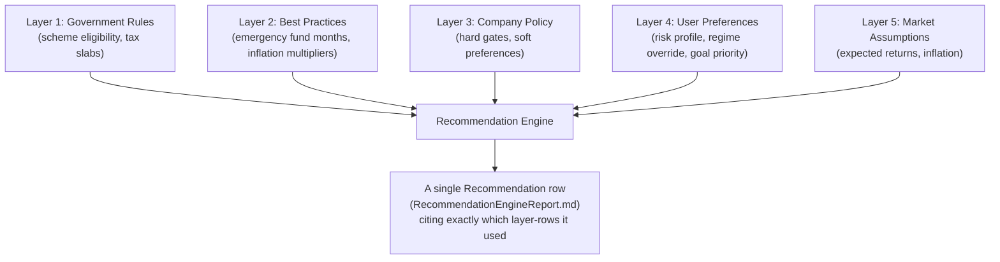

# Policy Engine Design Report

**Date:** 2026-07-06
**Purpose:** Your brief requires five distinct policy layers to be separated and independently configurable — government rules, financial-planning best practices, company recommendation policies, user preferences, and market assumptions. `DatabaseDesignReport.md`'s Group B covers only the first layer (government rules). This report defines all five, how they layer together at recommendation time, and why conflating them is a real risk this codebase should design against from the start.

---

## Why Five Separate Layers, Not One Config Table

Each layer changes at a different cadence, is authored by a different party, and carries different liability if wrong:

| Layer | Who authors it | Change cadence | Verified example from this engagement |
|---|---|---|---|
| Government Rules | RBI/SEBI/IRDAI/PFRDA/IT Dept — external, authoritative | Quarterly (rates) to multi-year (Acts) | PPF rate: quarterly. Tax Act: once-in-decades, happening now `[Phase 1]` |
| Best Practices | Financial-planning convention, not law | Rare, evolves with CFP-community consensus | "Separate floater for dependent parents," "3-6 months emergency fund" `[Phase 3]` |
| Company Policy | Northstar's own product decisions | As often as the product team decides | e.g., "we gate HUF recommendations behind a funding-source check" `[Phase 3]` |
| User Preferences | The individual user | Whenever they change their mind | Risk tolerance, regime preference override, goal priority |
| Market Assumptions | Northstar's chosen return/inflation estimates | Reviewed periodically, not a live feed | `expected_return_conservative/balanced/aggressive`, `inflation_rate` — already exist in `financial_assumptions` |

**A single flat config table would collapse these distinctions** — exactly the failure mode your brief's "never hardcode policies" warns against, just one layer deeper: a *configurable-but-undifferentiated* table is still fragile if a government-rate update and a company-policy tweak are indistinguishable rows in the same table, because they need different write-access controls (who's allowed to change a government rate vs. a company recommendation threshold are very different trust levels) and different audit requirements (a government-rate change needs a `source_citation`; a company-policy change needs an internal approval trail instead).

---

## Layer 1: Government Rules — already designed

Covered fully in `DatabaseDesignReport.md` Group B (`schemes`, `scheme_rates`, `scheme_eligibility_rules`, `tax_acts`, `tax_sections`, `tax_regimes`, `tax_slabs`, `policy_citations`). No changes here; referenced for completeness.

## Layer 2: Best-Practice Rules (new)

```
best_practice_rules
  id, rule_code (e.g. "emergency_fund_months_freelancer"),
  applies_to_persona (nullable — some rules are universal, some persona-specific, per Phase 4),
  value, unit, rationale_text, source_type ("cfp_convention" | "verified_research" | "internal_heuristic"),
  confidence ("verified" | "convention" | "unverified_flag"), last_reviewed_date
```

**Why a distinct `confidence`/`source_type` field:** this engagement itself produced examples of all three states — "3-6 months emergency fund" is industry convention (not a law, not independently re-derived here), the medical-inflation 2.5-3x multiplier is **verified research** (a specific, cited 2026 figure), and the DTI-ratio thresholds mentioned in `CalculationEngineReport.md` #8 are explicitly flagged as **unverified** pending a primary-source check. A policy engine that can't distinguish "we verified this" from "this is common wisdom" from "we haven't checked this yet" will eventually present a guess with the same confidence as a verified fact — precisely the failure mode this whole engagement has been designed to avoid at the tax/scheme level, and it applies equally here.

## Layer 3: Company Recommendation Policy (new)

```
company_policies
  id, policy_code (e.g. "huf_recommendation_gate", "pmvvy_never_recommend_new"),
  policy_type ("hard_gate" | "soft_preference" | "ranking_weight"),
  rule_definition (jsonb — references best_practice_rules / scheme eligibility as needed),
  effective_from, approved_by, changelog_notes
```

**This is where Northstar's own product judgment lives, explicitly separated from external fact.** Two concrete examples this engagement already produced:
- `pmvvy_never_recommend_new`: a **hard_gate**, because `SCHEMES.status = 'closed_to_new'` is a government fact (Layer 1), but *the decision to structurally block any recommendation of a closed scheme* is Northstar's own product policy responding to that fact — the government didn't mandate that Northstar's UI must never show it, Northstar chose that as a company policy to prevent the exact stale-recommendation bug class identified in Phase 1.
- `huf_recommendation_gate`: a **soft_preference** encoding Phase 3's finding that HUF should only surface when a real funding source exists — this is Northstar's product judgment about *when* to raise an eligible-but-narrow-fit option, not a government eligibility rule (the government doesn't require a funding source to *form* an HUF; Northstar's policy requires it before *recommending* one).

## Layer 4: User Preferences (mostly exists, needs one addition)

Already exists per-user: `goals.risk_profile`, `goals.priority` (schema field confirmed in Project Discovery, currently unused by any calculation — flagged in `CalculationEngineReport.md` #18), `financial_assumptions` (though this is really Layer 5, market assumptions, currently modeled as if it were a user preference — see the note below).

**One addition needed:** a `user_tax_regime_override` field — because #14 in the Calculation Engine report computes *both* regimes and recommends the better one, but the user must be able to explicitly lock in a choice (e.g., they know they're switching jobs and want to plan around the regime they'll actually file under) that the system should respect rather than silently recompute against every time.

## Layer 5: Market Assumptions (exists, but conflated with user preference — worth separating)

`financial_assumptions.expected_return_conservative/balanced/aggressive` and `.inflation_rate` are currently stored **per-user**, editable by the user, in the existing schema. This is worth questioning rather than accepting as-is, per your brief's "challenge every assumption" instruction: **should individual users really be setting their own expected-return assumptions, or should Northstar publish a single reviewed set of market assumptions (Layer 5, company-authored) that users can see but not silently diverge from without a clear "you are overriding our default" signal?**

Both models are defensible — user-editable assumptions respect that reasonable people disagree about future returns; a company-default model reduces the risk of a user setting an unrealistic 20% expected return and getting an over-confident goal probability as a result. **Recommendation:** keep the field user-editable (avoid a destructive schema change to a working feature, per your instructions), but add a `market_assumptions_defaults` table (Layer 5 proper) that the UI displays alongside the user's current value, with an explicit "using custom assumption, differs from Northstar's published default" indicator — this is a UI/product decision more than a schema one, and cheap to add without disturbing the existing field.

---

## How the Five Layers Combine at Recommendation Time



**Concretely, for one example — "should this user consider an HUF":**
1. Layer 1 confirms the user's family structure could legally form an HUF (no government rule blocks it).
2. Layer 3's `huf_recommendation_gate` company policy checks whether a real funding source is on record (Phase 3's gating criterion) — if not, the recommendation engine stops here and never surfaces HUF at all, regardless of theoretical tax benefit.
3. If the gate passes, Layer 1's tax data (HUF's separate exemption + deduction ceiling, and its **exclusion** from the Section 87A-equivalent rebate, both verified in Phases 1/3) computes the actual rupee benefit.
4. Layer 2's best-practice weighting might down-rank the suggestion if the household's corpus is too small for the compliance overhead to be worth it (a "is this worth the hassle" heuristic, distinct from the hard eligibility gate).
5. Layer 4's user preference (e.g., stated low tolerance for administrative complexity, if such a preference field existed) could further suppress or emphasize it.
6. Layer 5's market assumptions feed into projecting the long-run rupee value of the tax saving.
7. The final `RECOMMENDATIONS` row (Database Design Group F) cites exactly which `scheme_rates`/`tax_sections`/`company_policies`/`best_practice_rules` rows it relied on — satisfying your brief's AI Advisor requirement that every recommendation show its reasoning, policies used, and government schemes considered.

---

## What Must Never Happen (the anti-pattern this design prevents)

A hardcoded `if user.has_business_income: suggest_huf()` check scattered somewhere in application code is exactly what this five-layer design exists to prevent — it would conflate a government fact (HUF eligibility), a company policy (the funding-source gate), and a best-practice judgment (is it worth the hassle) into one unversioned, unexplainable, untraceable `if` statement. Every one of the four report chapters so far in this engagement (Phases 1, 3, 4, and now 5) has independently surfaced a concrete case where "just hardcode it" would have been wrong within the same fiscal year this product would ship — that pattern, repeated across genuinely unrelated research areas, is the strongest evidence in this whole engagement that the policy-engine requirement in your original brief is solving a real problem, not a hypothetical one.
