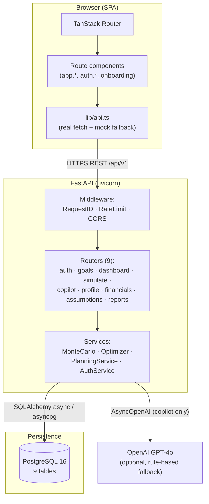
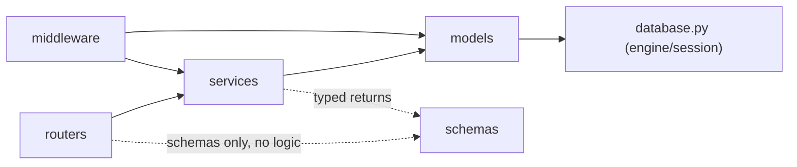

# Project Discovery Report — Northstar

**Date:** 2026-07-06
**Purpose:** Complete, current-state understanding of the existing repository before any domain research, redesign, or roadmap work begins. Nothing in this document is modified as part of producing it — pure discovery.

---

## 1. What This Project Is Today

Northstar is a **single-user, goal-based financial planning web app**: register → onboard (profile, income, expenses, assets, liabilities, one goal, assumptions) → get a Monte Carlo–simulated probability of hitting each goal → dashboard/reports/AI copilot to track and improve it. It has no multi-user/family model, no government-scheme awareness, no India-specific tax logic, and no HUF/estate/nomination concepts today — all of that is greenfield relative to the current codebase. That gap is exactly what the rest of this engagement needs to size honestly, not paper over.

**Stack:** FastAPI 0.115 (Python 3.12, async SQLAlchemy, asyncpg) + PostgreSQL 16 backend; TanStack Start (React 19, Vite, Bun) frontend. GPT-4o-backed AI Copilot, optional (rule-based fallback when no API key).

---

## 2. High-Level Architecture



---

## 3. Module Inventory

### Backend (`backend/app/`, ~40 files)

| Layer | Files | Responsibility |
|---|---|---|
| `models/` | user, goal, simulation, profile, financials (Income/Expense/Asset/Liability), assumptions, reset_token | SQLAlchemy ORM — schema source of truth |
| `schemas/` | user, goal, simulation, profile, financials, assumptions, reports | Pydantic request/response contracts |
| `routers/` | auth, goals, dashboard, simulate, copilot, profile, financials, assumptions, reports | Thin HTTP handlers — zero business logic (verified by reading all 9 in a prior session) |
| `services/` | monte_carlo, optimizer, planning_service, auth_service | All business logic |
| `middleware/` | auth, rate_limit, request_id | Cross-cutting: JWT extraction, token-bucket rate limiting, request correlation |

### Frontend (`code/src/`, ~11,000 LOC TS/TSX)

| Area | Files | Responsibility |
|---|---|---|
| `routes/` | index, onboarding, auth.sign-in/forgot-password/reset-password, app.tsx (guard), app.index (dashboard), app.goals, app.reports, app.copilot, app.profile, app.settings | Page-level containers, one per URL |
| `components/dashboard/` | GoalSimPanel, NetWorthBreakdown, NetWorthProjection | Dashboard/goal-detail visualizations |
| `components/onboarding/` | wizard-steps, list-steps | The 10-step onboarding wizard's form steps |
| `components/ui/` | ~50 files | shadcn/ui primitives (buttons, dialogs, forms, charts, etc.) — generic, not domain-specific |
| `lib/api.ts` | — | Single API client: every call has a real-fetch branch and a mock-fixture branch, switched by `VITE_API_BASE_URL` |
| `lib/mock-data.ts` | — | Fixture data + shared formatters (`formatCurrency`, `formatPercent`) |

**Notable absence:** no state-management library beyond TanStack Query for server state and local `useState` for UI state — no Redux/Zustand/Jotai. No design-system layer beyond Tailwind + shadcn. No i18n/l10n framework (all strings are hardcoded English) — relevant later, since a serious India-market product will eventually need at least number/date localization even if not full translation.

---

## 4. Database Schema (Current)

```mermaid
erDiagram
    USERS ||--o| USER_PROFILES : has
    USERS ||--o{ GOALS : owns
    USERS ||--o{ INCOME_SOURCES : owns
    USERS ||--o{ EXPENSES : owns
    USERS ||--o{ ASSETS : owns
    USERS ||--o{ LIABILITIES : owns
    USERS ||--o| FINANCIAL_ASSUMPTIONS : has
    USERS ||--o{ SIMULATIONS : runs
    USERS ||--o{ PASSWORD_RESET_TOKENS : requests
    GOALS ||--o{ SIMULATIONS : "simulated for"

    USERS {
        uuid id PK
        string email
        string hashed_password
        string full_name
        bool is_active
        bool is_verified
    }
    USER_PROFILES {
        uuid user_id FK
        date date_of_birth
        string marital_status
        int dependents
        string employment_status
        bool onboarding_complete
    }
    GOALS {
        uuid user_id FK
        string category
        float target_amount
        float current_amount
        date target_date
        float monthly_contribution
        string risk_profile
        float probability
        bool on_track
    }
    INCOME_SOURCES { uuid user_id FK, string source_type, float annual_amount }
    EXPENSES { uuid user_id FK, string category, float monthly_amount }
    ASSETS { uuid user_id FK, string asset_type, float current_value }
    LIABILITIES { uuid user_id FK, string liability_type, float balance, float interest_rate }
    FINANCIAL_ASSUMPTIONS { uuid user_id FK, float inflation_rate, float expected_return_conservative_balanced_aggressive, float tax_rate }
    SIMULATIONS { uuid user_id FK, uuid goal_id FK, float success_rate, json distribution }
```

**Single-user model, single flat `tax_rate` field.** There is no household/family entity, no per-member ownership, no scheme/product/policy tables, no document storage, no audit log, no notifications table. Every one of these is a genuine gap against the "family financial planning" and "government policy engine" vision in your brief — this is the concrete starting point for the Database Design phase later.

---

## 5. Request Lifecycle (two representative flows)

### A. Login → Dashboard

1. `POST /api/v1/auth/login` — verify bcrypt hash, issue short-lived access JWT (returned in body) + httpOnly refresh-token cookie + CSRF cookie.
2. Frontend stores access token in `localStorage`, navigates to `/app`.
3. `app.tsx`'s `beforeLoad` guard checks for the token client-side; `AppLayout` re-checks on mount.
4. `GET /api/v1/dashboard` — `get_current_user` middleware validates the bearer JWT → `planning_service.get_dashboard()` → refreshes every active goal's probability via `asyncio.gather` over `quick_probability_async` (2,000-path Monte Carlo per goal, run concurrently) → aggregates income/expenses/assets/liabilities → returns `DashboardResponse`.
5. On 401 (expired access token), `api.ts`'s `apiFetch` transparently calls `POST /auth/refresh` (cookie + CSRF header) once, retries the original request.

### B. Create Goal → Simulate

1. `POST /api/v1/goals` — validated `GoalCreate` schema (bounded amounts, 6 fixed categories, 3 risk profiles) → `_refresh_probability()` runs one `quick_probability_async` call inline before insert → row committed.
2. User opens the goal detail panel → `POST /api/v1/simulate` — full 10,000-path `run_simulation_async` (NumPy log-normal, offloaded to the default thread pool so it doesn't block the event loop) → percentiles + histogram distribution persisted as a `Simulation` row → returned to the chart.
3. Optionally `POST /api/v1/simulate/optimize` — `optimizer.generate_suggestions()` runs several more probability estimates (contribution increase, risk-profile shift, combined) and ranks them.

---

## 6. Existing Calculation Engine (inventory, not yet the full documentation the later phase asks for)

| Calculation | Location | Method |
|---|---|---|
| Goal success probability | `monte_carlo.run_simulation` / `quick_probability` | 10,000 (or 2,000 fast-probe) log-normal monthly-return paths, vectorized NumPy, percentile + histogram output |
| Plan health score | `planning_service.compute_plan_health` | Weighted rule-based score from on-track goal ratio + savings rate + emergency-fund coverage (exact weights not yet re-derived here — flagged for the Calculation Engine phase) |
| Net worth / dashboard aggregates | `planning_service.get_dashboard` | Straight sums: assets − liabilities, income − expenses |
| Contribution/risk optimization | `optimizer.generate_suggestions` | Iterative probability re-estimation across candidate contribution deltas and risk-profile shifts, ranked by projected probability |
| Tax | **Not modeled** — `FinancialAssumptions.tax_rate` is one flat user-entered percentage, not derived from any real tax regime | — |

The absence of any real tax-slab logic, any government-scheme awareness, and any household-level modeling are the three biggest gaps between "what exists" and "what a world-class India-focused planner needs" — every later phase of this engagement should be read against that baseline.

---

## 7. AI Component

`copilot.py`: single stateless chat endpoint. When `OPENAI_API_KEY` is set, calls GPT-4o with a system prompt containing the user's current goals/probabilities as JSON context; falls back to a rule-based responder otherwise. `conversation_id` is accepted but **never persisted** (documented gap, `AUDIT.md` #11 / `TechnicalDebt.md`) — there is no real multi-turn memory today. This is directly relevant to the "AI Advisor" phase of your brief: the explainability/reasoning/confidence-score design you're asking for doesn't exist yet at all — today's Copilot returns a single unstructured text reply with no reasoning trace, no policy citations, no confidence score.

---

## 8. Dependency Graph (backend)



Strictly directional, no cycles, no layer violations — confirmed by reading every router and service in a prior validation session (see `ArchitectureReport.md` in this repo for the full audit, done 2026-07-05).

---

## 9. What This Means for the Rest of Your Brief

Everything in this discovery points to the same conclusion: **the current codebase is a solid, well-tested single-user MVP** (164 backend tests, 96%+ coverage, clean `mypy --strict`/Ruff, thin routers, real Monte Carlo engine) **but is architecturally distant from the family/HUF/government-scheme/tax-aware platform your brief describes.** That's not a criticism — it's the honest starting line. None of the domain research, competitor analysis, or database redesign work should assume any of that complexity already exists; it all needs to be designed from here.

---

## Next Step — Sequencing the Remaining Work

Your brief has ~15 more major sections after this one (domain research, government policy research across 6 regulators, private product research, family/HUF planning, competitor analysis, personas, database redesign, calculation engine docs, policy engine, AI advisor design, roadmap, implementation plan). Each of those is independently substantial — the government policy section alone covers PPF/EPF/NPS/SSY/SCSS/PMVVY and more, each needing current, source-verified eligibility/limits/tax-treatment data via live search rather than memory (see my opening note on why memory isn't sufficient here, given how much can change in a budget cycle).

I'd rather sequence this deliberately than produce 15 shallow sections in one pass. See the question below.
