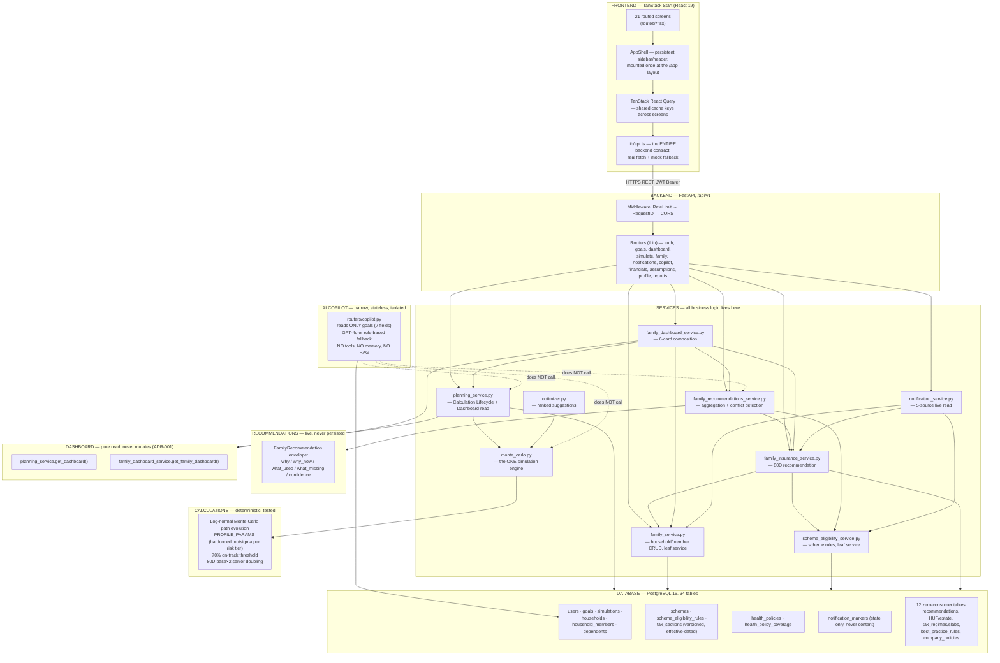
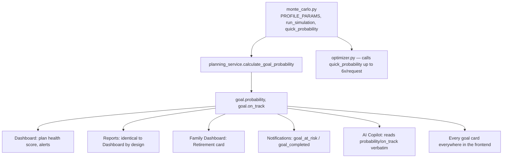
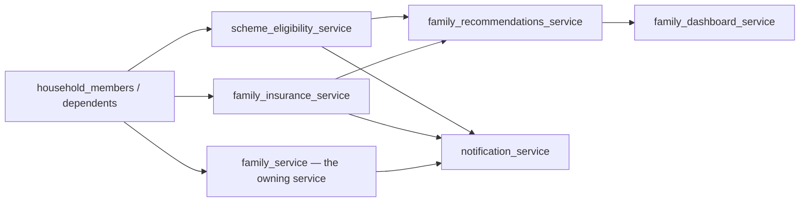

# THE PROJECT OWNER'S HANDBOOK

**Northstar — Goal-Based Financial Planning SaaS**
**Compiled:** 2026-07-10 — as a companion to, and index over, Volumes 1–7 of the Northstar Project Engineering Bible.

---

### A note before you start

This is not documentation. Documentation tells you what the system *is*. This handbook tells you how to *think*, what to *trust*, what to *touch*, and what to *never touch* — so that ten years from now, whoever is reading this (possibly you, having forgotten everything) can sit down, make a change with confidence, and not accidentally break the one property this codebase has spent its entire history protecting: **a user can trust every number this product shows them.**

Everything in this handbook is backed by one of the seven prior volumes, each independently verified against the actual, executable source code — not aspiration, not memory, not a README that drifted out of date. Where this handbook makes a claim, it tells you exactly which volume to open for the full evidence trail. Nothing here contradicts the code. If you ever find that it does, the code is right and this handbook is stale — fix the handbook, not your understanding of the code.

---

## 1. Executive Overview

**Northstar is a goal-based financial planning SaaS.** A user defines financial goals — retirement, a home, a child's education, an emergency fund — and the platform runs a real 10,000-path Monte Carlo simulation to compute an actual, statistically grounded probability that each goal will be met. It then surfaces concrete, ranked ways to improve that probability. On top of this individual-goal core sits a second, genuinely differentiated pillar: **family-first, India-specific financial planning** — a household model that tracks family members, evaluates their eligibility against real, versioned Indian government schemes (PPF, SSY, SCSS, and six others), and computes tax-deduction-aware health insurance recommendations (Section 80D) — all without ever inventing a financial fact the codebase hasn't verified against a real, cited source.

**Who it's for:** individuals and families building a long-term plan, with the family/scheme/insurance layer specifically built around Indian tax and policy context, while the core goal engine is currency- and country-agnostic.

**What it replaces:** a spreadsheet-and-guesswork answer to "will I actually retire on time?" with a real probabilistic one, and a "which of these nine government schemes apply to me?" flat-catalog problem with a personalized, pre-filtered, explained answer.

**The stack, in one line each:** TanStack Start (React 19) frontend, Vite 8 build, Tailwind CSS v4 with a frozen "Deep Navy Premium" design system; FastAPI 0.115 (Python 3.12) backend, SQLAlchemy 2.0 async + asyncpg, PostgreSQL 16, Alembic migrations (9, all additive); an optional GPT-4o AI Copilot with a deterministic rule-based fallback so the product works with zero API key.

**What's real vs. what's scaffolding — the single most important thing to internalize before touching anything:** roughly a third of this database's 34 tables (HUF/estate entities, a general-purpose `recommendations` table, the entire tax-regime/slab engine, a policy-citation table) are fully migrated, tested at the model level, and have **zero application consumer** — they are deliberately pre-built runway for features that don't exist yet, not dead code and not a bug (Volume 1 §15.10, Volume 3 §14). Learn to recognize this pattern immediately: a table existing does not mean a feature exists.

**Current maturity, honestly stated:** the Goals/Monte Carlo core and the Family/Schemes/Insurance/Recommendations layer are both production-real, tested (>97% backend coverage, 341+ tests), and live-verified. The AI Copilot is intentionally minimal — one stateless endpoint, no memory, no tools, no retrieval (Volume 7). No CI/CD pipeline is committed. No frontend test suite exists. These are documented facts, not secrets — see §11.

---

## 2. Mental Model

**How to think about this codebase, in one sentence:** *every financial fact has exactly one place it is computed, exactly one place it is written, and every other place in the system only ever reads it.*

That sentence is not a stylistic preference — it is the direct, hard-won fix for a real, documented incident (ADR-001, Volume 1 §15.2): the Dashboard used to silently re-run an unseeded Monte Carlo simulation on every page view, meaning the same goal could show a different success percentage depending on which screen was opened last. The entire architecture you're about to inherit was shaped by that one bug and the discipline adopted to make it structurally impossible to repeat.

**Core principles you must internalize:**

1. **One authority per fact.** `goal.probability` is written in exactly one function (`planning_service.calculate_goal_probability`), called from exactly two places (goal create, goal update). Every other screen — Dashboard, Reports, Family Dashboard, Notifications, the AI Copilot — is a *read-only consumer* of that one stored value. This pattern repeats for the 80D insurance figure (read from `tax_sections`, never hardcoded), for scheme eligibility (evaluated by one shared function, never re-implemented per screen), and for every recommendation.
2. **Reads never mutate.** No `GET` endpoint in this backend writes to the database. Ever. This is tested and enforced (`test_repeated_dashboard_reads_never_change_goal_probability` and its siblings across Family/Recommendations/Notifications).
3. **Never invent a financial fact.** If the data to answer a question honestly doesn't exist, the correct behavior is to say so explicitly ("not yet configured," "we don't yet know") — never to guess, interpolate, or default to a plausible-sounding number. This applies to code (SCSS's 55+/50+ eligibility routes are deliberately unseeded because no data field exists to check them) and, as of Rule 10, to the AI layer too.
4. **Aggregation, never duplication.** The Family module doesn't own a second copy of a user's goals or assets — it reads the same `goals`/`assets` tables everyone else does, joined through a household. When two features need the same fact (the Family Dashboard's Parents card and the Insurance recommendation), they call the *same function*, not two independently-written versions that could drift.
5. **Soft delete, additive migrations, versioned government data.** Nothing is ever hard-deleted except through a cascade from a parent row a real production code path never triggers. Every migration only adds. Every government rate/threshold/eligibility rule carries `effective_from`/`effective_to` so a superseded fact is superseded, not erased.
6. **The audit trail is the documentation.** Every root-level `.md` report in this repository (dozens of them) is this project's own decision log, satisfying Rule 8 ("every non-obvious decision gets a decision log entry"). This handbook and Volumes 1–7 are the newest layer of that same practice — read the older reports when you need historical *why*, not just current *what*.

**Assumptions you must never violate, stated as hard rules — each explained fully in §4 and §12:**
- `goal.probability`/`goal.on_track` are only ever set by `calculate_goal_probability`.
- No `planning_service`, `family_dashboard_service`, or notification read path may call `calculate_goal_probability` or `monte_carlo.run_simulation`.
- `goal_household_members` (family tagging) never implies ownership; `goals.user_id` is immutable after creation.
- Recommendations (insurance, scheme, family) are **never** persisted — always recomputed fresh, every request.
- The AI Copilot must never originate a financial number, rate, or eligibility verdict — only narrate what a deterministic service already computed.

---

## 3. System Map



**Read this diagram once, slowly, and notice the one dotted-line fact:** the AI Copilot sits at the edge of the system, isolated. It reads the `goals` table directly and nothing else. This is deliberate (Volume 7 §2, §4) and is the single most surprising fact a new owner needs to know before touching the AI layer.

---

## 4. Golden Engineering Rules

*(Verbatim from `docs/ENGINEERING_CONSTITUTION.md`, `docs/PRODUCT_PRINCIPLES.md`, and `docs/UX_PRINCIPLES.md` — real files in this repository, not invented for this handbook — each with the WHY this handbook adds.)*

### Engineering Constitution (`docs/ENGINEERING_CONSTITUTION.md`)

| # | Rule | Why it exists |
|---|---|---|
| 1 | **Routers are thin. Always.** | The Calculation Lifecycle (below) can only be structurally guaranteed if the *decision* to recalculate lives in exactly one place. A router that contained its own recalculation logic is exactly how ADR-001's bug happened. |
| 2 | **Never hardcode a fact that can change without a code deploy.** | A PPF interest rate changes quarterly; a tax slab changes annually. Hardcoding either means a future correction requires a deploy instead of a data update — this is why `scheme_rates`/`tax_sections` are database rows, not Python constants. |
| 3 | **Migrations are additive by default.** | A destructive migration (`ALTER COLUMN`, `DROP COLUMN`) can silently destroy real user data or break a still-running previous version during a rolling deploy. All 9 of this project's migrations follow this without exception. |
| 4 | **Never invent a financial policy, rate, or rule.** | The entire product's trust proposition rests on every number being real. This is the rule Rule 10 (below) extends into the AI layer. |
| 5 | **`mypy --strict` and Ruff are the gate, not a suggestion.** | Type errors and lint violations in a financial-calculation codebase are not cosmetic — a wrong type flowing into `monte_carlo.py` can silently produce a wrong probability. |
| 6 | **Tests prove behavior; they do not get adjusted to match a bug.** | If a test fails, the default assumption must be "the code is wrong," never "the test is too strict." Loosening a test to make a red build green is how a real regression becomes permanent. |
| 7 | **Minimal diff. No premature abstraction.** | Directly why `scheme_eligibility_service.py` only branches on 3 rule types (not a general rule interpreter) and why HUF ownership is a nullable sibling column, not a polymorphic owner model — both documented, deliberate rejections of over-engineering ahead of a proven second use case. |
| 8 | **Every non-obvious decision gets a decision log entry.** | This is why the repository root is full of `.md` reports — it is a *policy*, not clutter. When you make a non-obvious call, add to this trail; don't rely on a commit message alone. |
| 9 | **Verify against real infrastructure, not just unit tests.** | The backend test suite runs against SQLite, not PostgreSQL — a deliberate speed trade-off with one real consequence (naive vs. aware datetimes). A handful of cascade/`SET NULL` behaviors were verified manually against real Postgres specifically because SQLite can't prove them. Know which claims in this codebase rest on that manual verification, not CI. |
| 10 | **The AI Advisor computes nothing; it narrates what was already computed.** | The single most important rule for anything you build in the AI layer — see Volume 7 in full. |
| 11 | **Deprecation Completion** | A field marked deprecated in a comment is not actually deprecated until every consumer, frontend and backend, has been found and migrated — verified by grep, not assumed. A real incident (`user_profiles.marital_status`/`dependents` living on in `app.profile.tsx` for a full extra day) is why this rule exists. |

### Product Principles (`docs/PRODUCT_PRINCIPLES.md`) — the 3 you'll touch most

- **#2 — Every recommendation must be explainable.** This is *why* `FamilyRecommendation` has mandatory `why`/`why_now`/`what_information_was_used`/`what_information_is_missing`/`confidence_score` fields, never optional.
- **#7 — Never claim capability the data model doesn't actually have.** This is *why* Family Goal tagging always discloses "this goal belongs to your account" — and it's the rule the Landing page's security marketing copy currently violates (Volume 6, finding FE-001) — a real example of what breaking this principle looks like in production.
- **#8 — Every unverified fact stays visibly unverified.** This is the plain-English version of Rule 4, and it's the governing idea behind the Truth Hierarchy (T0–T3) the AI research proposes (Volume 7 §15).

### UX Principles (`docs/UX_PRINCIPLES.md`) — the ones with real engineering consequences

- **#5 — Every recommendation explains why it was generated.** The UI-side mirror of Product Principle #2.
- **#7 — Honesty over polish when the two conflict.** This is why a `null` Family Dashboard card renders "Temporarily unavailable" rather than a zero — a zero could be mistaken for a real, honest answer.
- **#11 — Empty states are normal states, not apologies.** This is why every empty state in this app explains *why* it's empty and what would populate it, instead of a bare "No data."

**The rule this handbook adds, synthesizing all of the above into one operational test you can run on any change you're about to make:** *"If I make this change, can a number reach a user's screen that no deterministic engine actually verified?"* If the answer is yes, stop — you've violated the spine of this entire codebase.

---

## 5. Adding a New Feature

*(Each playbook below names every file you will touch, in the order you'll touch them, with the exact reason.)*

### A. New Government Scheme

1. **`backend/scripts/seed_policy_data.py`** — add a tuple to `_SCHEMES` (code, name, authority, status, category). If the scheme's eligibility can be expressed with the three existing rule types (`max_age`, `min_age`, `gender`), add rows to `_SCHEME_ELIGIBILITY_RULES` too — **no other code change is needed**, because `scheme_eligibility_service.py` is data-driven (Volume 5 §14.7).
2. If the eligibility needs a **new rule type** (e.g. `residency_status`), edit `scheme_eligibility_service._evaluate_rules_for_member` to add one new `elif` branch — this is the one place the "no premature abstraction" rule (Rule 7) tells you *not* to build a general rule interpreter ahead of this real second need.
3. **Never seed a rate or eligibility fact you haven't verified against a real government source** — every existing row in `seed_policy_data.py` carries a `source_citation`; match that discipline.
4. **`backend/tests/test_scheme_eligibility_service.py`** — add a boundary test for the new scheme, following the existing pattern of exact-boundary tests (e.g. the SSY 10th-birthday tests).
5. **Frontend: nothing to change.** `/app/family/schemes` is a direct passthrough of the evaluation engine (Volume 6 §10) — a new scheme with rules appears automatically.
6. **Documentation:** update Volume 5 §5 (the per-scheme catalog table) so the next owner doesn't have to re-derive the seed data by reading the script.

### B. New Insurance Recommendation Logic

1. **`backend/app/services/family_insurance_service.py`** — the one file that owns the 80D calculation. Extend `compute_insurance_recommendation` or add a new, narrowly-scoped function alongside it — never duplicate the age/coverage logic already in `uncovered_parents`/`_covered_member_ids`.
2. **`backend/app/schemas/insurance.py`** — extend `InsuranceRecommendation` only with fields you can populate honestly (never a placeholder).
3. **`backend/app/models/insurance.py`** — only if new persisted state is genuinely needed (most insurance logic changes need zero schema change, since the recommendation is computed live).
4. **`backend/tests/test_family_insurance.py`** — add both a positive and a "why it doesn't fire" test, mirroring the existing `test_recommendation_fires_for_no`/`test_no_recommendation_when_parent_already_covered_by_a_policy` pair.
5. **`code/src/lib/api.ts`** — update `InsuranceRecommendation`'s type to match the new schema field exactly (snake_case, matching the backend verbatim — Volume 6 §24).
6. **`code/src/routes/app.family.insurance.tsx`** — render the new field inside the existing `RecommendationCard`.
7. **Cross-check `family_recommendations_service.py`** — if the new recommendation should participate in conflict detection, confirm its `reference_code` is set correctly (Volume 5 §7.6).

### C. New Dashboard Card

1. **`backend/app/services/family_dashboard_service.py`** — add one new `_x_card()` function following the existing pattern: pure read, wrapped in `_safe()`, computing "zero financial arithmetic — only counting, set membership."
2. **`backend/app/schemas/family_dashboard.py`** — add the new card as a **nullable** field on `FamilyDashboardResponse` — nullability is not optional, it's how graceful degradation works (Volume 5 §8).
3. Wire the new card into `get_family_dashboard`'s `_safe(...)` call list.
4. **`backend/tests/test_family_dashboard.py`** — add a happy-path test and a "this card fails, others still populate" test.
5. **`code/src/lib/api.ts`** — add the field to the `FamilyDashboard` type.
6. **`code/src/routes/app.family.index.tsx`** — add a new `XCard` component following the `CardShell`/`LinkCardShell`/`UnavailableCard` trio pattern (Volume 6 §25).

### D. New Goal Category

1. **`backend/app/models/goal.py`** — add the new value to the `goal_category` Postgres ENUM. **This requires a migration** — PostgreSQL enum additions are additive-safe (`ALTER TYPE ... ADD VALUE`), consistent with Rule 3.
2. **`backend/app/schemas/goal.py`** — update the category literal type.
3. **Frontend — three separate places, verified triplicated in this codebase (a real, known duplication, Volume 6):** `code/src/routes/app.goals.tsx`'s `CATEGORIES`, `code/src/components/dashboard/GoalSimPanel.tsx`'s `CATEGORIES` + `ICON_MAP`, `code/src/components/onboarding/wizard-steps.tsx`'s `CATEGORIES`. **Update all three or the new category will be selectable in one form and invisible in another.**
4. **`backend/tests/test_goals.py`** — add a create-goal test for the new category.
5. Consider whether the new category needs special Dashboard treatment the way `retirement`/`education`/`emergency` currently get (Volume 2 §5, §10, Volume 5 §8's Education/Retirement cards) — most categories get none, and that's fine; only add special handling if there's a real, proven need.

### E. New Financial Calculation

1. **Decide which service owns it, following the existing domain split** — a goal-scoped calculation belongs in `planning_service.py`; a Family-domain calculation belongs in the relevant `family_*_service.py`; a genuinely new domain gets its own new service file (Rule 7 doesn't forbid new files, it forbids new *abstractions* ahead of need).
2. **It must be deterministic, versioned-data-driven if it touches a government fact, and it must never live in a router or in the frontend as the source of truth.** The frontend may *display* a derived, clearly-labeled projection (like `NetWorthProjection.tsx` does — but see Volume 6 finding FE-008 for what happens when that label is missing) — it may never be the place a real financial decision number originates.
3. Add the calculation's exact formula, in prose, to the relevant Volume 2 or Volume 5 section as you build it — future-you will need it.
4. Write the test *first* if you're following this project's own stated TDD discipline, and make it a property/invariant test where an exact closed-form answer doesn't exist (Volume 2 §6.8's own precedent for the Monte Carlo suite).

### F. New Notification Source

1. **`backend/app/services/notification_service.py`** — add one new `_collect_x_fact(s)` function following the existing pattern exactly: **read an already-certified engine or already-existing data, compute nothing new**, return a list of `_Fact` objects with a `dedupe_key` built from `_dedupe_key(source, natural_key)`.
2. Add the call to `_collect_facts`.
3. **`backend/app/schemas/notification.py`** — add the new source string to the `NotificationSource` literal.
4. **`code/src/lib/api.ts`** — mirror the new value in the frontend `NotificationSource` type.
5. **No frontend component change needed** — `NotificationCenter` renders any `NotificationItem` generically.
6. **`backend/tests/test_notifications.py`** — verify the new source appears correctly *and* that reading it never creates a marker row (the single most important invariant in this domain).

### G. New AI Capability

*(Today, per Volume 7: the Copilot has no tool layer, so "adding a capability" means editing the system prompt and context assembly in `routers/copilot.py` directly — carefully.)*

1. If you're extending what the Copilot can *talk about* today (still zero tools): expand the context-assembly query in `chat()` to include the new data, expand `goals_json`'s shape or add a second JSON block to the prompt, and expand `_fallback_response` with a matching rule so the non-AI path stays equally informed. **Do this sparingly** — every field you add to the prompt is a field the model could get wrong about, with no grounding validator (Volume 7 §9, §15) to catch it today.
2. If you're building toward the *proposed* tool-calling architecture (Volume 7 §13): do not start by editing `copilot.py`'s prompt. Start by building the tool registry as a thin façade over an *already-certified* service (9 of 10 proposed tools already have one) — this is additive, and it means the very first tool you ship inherits all of that service's existing test coverage for free.
3. **Never let the model compute a number itself.** If you're tempted to ask the model to "estimate" or "calculate" something the backend doesn't already provide, that's the exact violation Rule 10 exists to prevent — build the calculation as a real, tested backend function first.

### H. New Family Feature (e.g. a new relationship type, or a new per-member field)

1. **`backend/app/models/household.py`** — add the new field to `Dependent` (nullable, additive) or a new `relationship_type` value (a `VARCHAR`, not an ENUM, so no migration-level type change is needed — but the frontend's `RelationshipType` literal union in `code/src/lib/api.ts` **is** a closed type and must be updated).
2. **`backend/app/services/family_service.py`** — extend `validate_member_fields` with the new relationship-type-specific rule, and `_DEPENDENT_TYPE_BY_RELATIONSHIP` if it's a new coarse type.
3. **`backend/app/schemas/family.py`** — extend `FamilyMemberFieldsBase`/`RelationshipType`.
4. **`code/src/components/family/FamilyMemberForm.tsx`** — add the new conditional field block, and extend its hand-written `validate()` function to mirror the backend rule (client-side UX only — the comment in that file states this explicitly; never treat it as the real enforcement).
5. **`backend/tests/test_family_router.py`** — add creation/validation tests for the new type, following the existing per-relationship-type test grouping.
6. Decide deliberately whether the new type should be evaluated by the Scheme/Insurance engines (both currently gate on specific `relationship_type` values — `scheme_eligibility_service` excludes `self`; `family_insurance_service.uncovered_parents` is `parent`-only) — don't assume a new type is automatically covered.

---

## 6. Safe Modification Guide

*(What breaks, downstream, when you change X — read this before touching any of the six subsystems below.)*

### If you change Monte Carlo (`monte_carlo.py`)


Touch `PROFILE_PARAMS` (the mu/sigma per risk tier) and **every existing goal's probability becomes silently inconsistent with any newly-created goal** until each is re-saved (probability is only recomputed on create/update, never retroactively). Touch the Itô-correction math and you change what "balanced 7.5%" *actually means* statistically — re-run the entire `test_monte_carlo.py` invariant suite (monotonicity, reproducibility-under-seed) before merging; these are property tests specifically because there's no golden numeric value to compare against.

### If you change inflation handling

`financial_assumptions.inflation_rate` and `goal.custom_inflation_rate` feed **exactly one place**: `EducationPlanningSection.tsx`'s frontend-only projection. They do **not** feed Monte Carlo (Volume 2 §4/§15.9 — a documented, deliberate architectural gap, not a bug to "fix" casually). If you decide to close this gap and wire inflation into `monte_carlo.py`, understand you are making a real, load-bearing architecture change: every existing goal's probability will shift the moment this ships, `test_goal_inflation.py`'s entire suite (which currently asserts inflation *never* changes probability) must be rewritten with full team awareness, and Volume 2's documentation of this exact gap must be updated in the same change, not left stale.

### If you change the 70% on-track threshold

One literal (`calculate_goal_probability`'s `probability >= 70.0`) — but dozens of *consumers* assume this exact number, most of them via hardcoded UI copy rather than a shared constant (grep the frontend for `"70"` before changing it). Changing it silently shifts: Dashboard alert counts, Notification `goal_at_risk` triggers, every goal card's color coding, Family Dashboard's Retirement card, Reports' "needs attention" badges. **There is no single frontend source of truth for this number today** — it is currently a backend literal that the frontend re-derives visually from `on_track` (a boolean, not the raw number) in most places, which limits the blast radius somewhat, but any place the frontend independently checks `probability < 70` as a raw comparison (rather than reading `on_track`) would silently disagree with a changed backend threshold.

### If you change Family/household data shape


A schema change to `Dependent` (e.g. a new field) cascades through up to 5 services that read it. Before changing a field's meaning (not just adding one — additive is always safe), grep every one of `scheme_eligibility_service.py`, `family_insurance_service.py`, `family_recommendations_service.py`, `family_dashboard_service.py`, and `notification_service.py` for reads of that field. This is exactly the class of mistake Rule 11 (Deprecation Completion) exists to catch.

### If you change Recommendations (`family_recommendations_service.py`)

Affects: the standalone Recommendations screen, and the Family Dashboard's embedded feed (which calls the *same* function — Volume 6 §12 confirmed these two screens are guaranteed identical because they share one call, not two independent ones). **Does not affect Notifications** — a genuinely useful, non-obvious fact: `notification_service.py` calls `family_insurance_service`/`scheme_eligibility_service` **directly**, bypassing `family_recommendations_service` entirely (Volume 5 §12, Volume 7's diagram in §3). Changing conflict-detection logic (`_detect_conflicts`) has zero effect on what notifications a user sees.

### If you change the Dashboard (`planning_service.get_dashboard`)

Affects: the main Dashboard route, `AppShell`'s Plan Health mini-card (shares the same `["dashboard"]` query key), Reports (calls the identical function — this is *why* Dashboard and Reports are tested to agree exactly), and the Family Dashboard's Emergency card (explicitly reuses this function rather than re-deriving liquid-assets/expenses). **Never** affects goal probability — this is a strictly one-directional dependency (`family_dashboard_service` calls `planning_service`, never the reverse), and it must stay that way.

### If you change the AI Copilot (`copilot.py`)

Today: isolated. Nothing else in the codebase reads from or depends on the Copilot — it is a pure leaf consumer of the `goals` table. You can change the system prompt, the fallback logic, or the model entirely without any downstream ripple **as long as you don't change what `ChatResponse` returns** (frontend depends on exactly `{reply, conversation_id}`). The moment you build the tool-calling layer proposed in Volume 7 §13, this changes completely: the Copilot becomes a *new caller* of `monte_carlo.py`, `family_recommendations_service.py`, etc. — meaning any future change to those services must now also consider "does this break a tool call the AI makes," the same way it already considers "does this break the Dashboard."

---

## 7. Debugging Guide

*(Practical, symptom-first. Each one names the exact file/function to open, in order.)*

### "A goal's probability changed unexpectedly"

1. Was this goal just created or PATCHed? → Only two legitimate call sites exist: `routers/goals.py`'s `create_goal` (always recalculates) and `update_goal` (recalculates **only if** the PATCH body intersects `planning_service.CALCULATION_CONTEXT_FIELDS = {current_amount, monthly_contribution, target_date, risk_profile, target_amount}`). Check what fields were actually sent.
2. Is `settings.monte_carlo_seed` unset (the default)? → Then re-running the *exact same inputs* through create/update will legitimately produce a slightly different probability each time — this is expected sampling noise, not a bug, unless the swing is large.
3. Did this happen on a plain `GET /dashboard`, `GET /goals`, or a Copilot chat? → **This would be a real regression.** Reads must never mutate (ADR-001). Check that `test_repeated_dashboard_reads_never_change_goal_probability` (and the Copilot/Reports/Family Dashboard equivalents) still pass; if one of them is missing or was weakened, that's your root cause.
4. Still confused? Read `planning_service.calculate_goal_probability` end to end (12 lines) — it is short enough to fully hold in your head in one sitting.

### "A recommendation disappeared"

1. **Remember first: recommendations are never persisted.** "Disappeared" always means "the underlying fact changed," never a caching bug on the backend (though it could be a *frontend* staleness issue — see step 4).
2. If it was an insurance recommendation: open `family_insurance_service.uncovered_parents` — check whether the parent's `has_own_insurance` answer changed to `"yes"`, whether `is_complete()` now fails (someone cleared a required field), or whether a policy now covers them (`_covered_member_ids`).
3. If it was a scheme recommendation: open `scheme_eligibility_service._evaluate_rules_for_member` — check whether the member's age crossed a threshold (most common: a child turned 10 and aged out of SSY), or whether their `date_of_birth`/`gender` field was cleared (making them un-evaluable again, not ineligible).
4. Query `/family/insurance` and `/family/schemes` directly (via the API or the UI) to see the live, current-truth answer — if it agrees with what the user now sees, this isn't a bug, it's the system working correctly; the "disappearance" is real, not stale.
5. If the live answer disagrees with what the UI shows, check the frontend's React Query `staleTime` for the relevant query key (`["family-insurance"]`, `["family-schemes"]`, `["family-recommendations"]`, `["family-dashboard"]` — Volume 6 §23) — you may just be looking at a cache that hasn't refetched yet.

### "The Dashboard looks inconsistent"

1. Compare `/dashboard` and `/reports/summary` directly — they are tested to be byte-identical for probability (`test_dashboard_and_reports_show_identical_probability`); if they disagree, something broke that guarantee and it's a real bug in `reports.py`'s call to `planning_service.get_dashboard`.
2. Check for a goal with `is_active = false` leaking into a total — every aggregation query should filter `is_active = TRUE`; grep for the specific query that looks wrong.
3. Remember the Family Dashboard and the main money Dashboard are **two different aggregation paths** that happen to share one card (Emergency). A discrepancy between "Family → Emergency readiness" and the main Dashboard's own liquid-assets figure would be a real bug (they're supposed to be identical, since one calls the other) — a discrepancy between the Family Dashboard's *other* five cards and the main Dashboard is expected, since those cards compute genuinely different things.
4. Check React Query staleness (`["dashboard"]` = 60s, `["family-dashboard"]` = 30s) before assuming a backend bug — a user switching screens quickly can legitimately see two different `staleTime` windows resolve at different moments.

### "A notification is missing"

1. Is it a `family_member_added` notification, older than 30 days? → Expected — `notification_service._FAMILY_MEMBER_ADDED_WINDOW_DAYS = 30` is a hard cutoff, not a bug.
2. Was it dismissed? → Check `notification_markers` for a row with this `dedupe_key` and a non-null `dismissed_at` — dismissal is permanent and intentional, even if the underlying fact still exists.
3. Does the underlying fact (the insurance rec, the scheme eligibility, the goal state) still genuinely exist? → If it doesn't, this isn't a missing notification, it's a correctly-disappeared one (same as the Recommendations debugging path above — notifications and recommendations share the exact same "live read, no persistence" property).
4. Check the specific `_collect_x_fact(s)` function in `notification_service.py` for the source in question — each is short and independently readable.

### "The AI Copilot's reply seems disconnected from my actual data"

1. **First, check whether the question was about anything other than Goals.** If it was about Family, Insurance, Schemes, Recommendations, Dashboard totals, or Assumptions — the Copilot has **zero access to any of that data today** (Volume 7 §4). This is expected, current behavior, not a bug — the model is either declining accurately or (on the OpenAI path, with no guardrail preventing it) answering from its own general knowledge, ungrounded.
2. If the question was about a goal and the answer still seems wrong: check `/goals` directly first — if the raw data is wrong, that's a Goals bug, not an AI bug.
3. If the raw data is right but the reply misstates it: check whether `settings.openai_api_key` is set — if not, you're looking at `_fallback_response`'s literal, deterministic text; read that 12-line function directly, there's no model behavior to debug.
4. If a key *is* set and the model still gets something obviously wrong from the correct 7-field JSON it was given, this is a model-quality issue with the current, no-validator setup (Volume 7 §9's limitation #13) — there is no grounding check today to catch or block it.

---

## 8. Data Flow Cheat Sheets

### Create Goal

```
User fills "New goal" form (name, category, target, monthly, years, risk)
  → POST /api/v1/goals
  → routers/goals.py: Goal(user_id=current_user.id, **body)
  → UNCONDITIONALLY: planning_service.calculate_goal_probability(goal)
      → monte_carlo.quick_probability_async() — 2,000 paths
      → goal.probability = round(x, 1); goal.on_track = probability >= 70.0
  → db.add(goal); db.flush()  — ONE insert, already complete, never insert-then-update
  → 201 GoalResponse
  → Frontend: goal prepended to local list; Dashboard/Copilot/Reports will see it
    on their NEXT independent fetch (no push, no shared cache invalidation
    triggered by this specific mutation beyond the creating screen's own state)
```
**Full detail:** Volume 1 §7.2, Volume 2 §9, Volume 4 §3.8.

### Add Family Member

```
User fills Add/Edit form (relationship-type-conditional fields)
  → POST /api/v1/family/members
  → family_service.get_or_create_household() — lazy, idempotent
  → family_service.create_member() → validate_member_fields() (relationship-specific)
  → INSERT household_members, INSERT dependents (always, even for spouse)
  → INSERT audit_logs (action="family_member_added")
  → INLINE: scheme_eligibility_service.check_ssy_eligibility() — read-only,
    positive-only callout, reuses the SAME evaluation code the Schemes
    screen uses
  → 201 FamilyMemberResponse{..., eligible_schemes}
  → Frontend invalidates ["family-home"]
```
**Full detail:** Volume 5 §3.9, Volume 6 §9.

### Compute Insurance Recommendation

```
GET /api/v1/family/insurance
  → family_insurance_service._base_80d_limit() — read tax_sections WHERE
    section_number='80D' (never hardcoded; returns None → no fabricated
    fallback if the seed row is missing)
  → family_insurance_service.uncovered_parents() — is_complete() AND
    has_own_insurance != 'yes' AND NOT already covered by an active policy
  → if empty: return None (no recommendation)
  → else: age_years() for each qualifying parent (reused from
    scheme_eligibility_service — one age function, two consumers)
  → any age >= 60 → parent_limit = base_limit × 2
  → confidence = 1.0 if every age known, else 0.7
  → 200 FamilyInsuranceResponse{policies, recommendation}
  → NOTHING PERSISTED — recomputed fresh on every single call
```
**Full detail:** Volume 5 §6, Volume 2 §11.1.

### Government Scheme Check

```
GET /api/v1/family/schemes
  → scheme_eligibility_service.evaluate_household_eligibility()
  → load ALL schemes + ALL scheme_eligibility_rules (no WHERE clause —
    a known, currently-harmless performance characteristic, Volume 5 BUS-006)
  → for each scheme: closed_to_new? → not_eligible immediately
  → no seeded rules? → not_eligible, "not yet configured"
  → else evaluate max_age/min_age/gender rules per non-self member
  → 200 FamilySchemesResponse{eligible, potentially_eligible, not_eligible}
  → NOTHING PERSISTED
```
**Full detail:** Volume 5 §5.

### Notification Generation

```
GET /api/v1/notifications
  → notification_service._collect_facts() — 5 independent sources:
    1. family_insurance_service.compute_insurance_recommendation()  [reused verbatim]
    2. scheme_eligibility_service.evaluate_household_eligibility()   [reused verbatim]
    3. AuditLog rows, action=family_member_added, < 30 days old
    4. Goal.current_amount >= Goal.target_amount → goal_completed
    5. NOT (4) AND Goal.on_track == False → goal_at_risk
  → LEFT JOIN against notification_markers by dedupe_key — NEVER creates
    a row on this read path (test-enforced)
  → 200 NotificationListResult{items, unread_count}

POST /api/v1/notifications/{source}/{key}/read   → upsert marker.read_at
POST /api/v1/notifications/{source}/{key}/dismiss → upsert marker.dismissed_at
  — the ONLY two writes anywhere in this domain
```
**Full detail:** Volume 5 §9, Volume 2 §11.4.

### AI Copilot Chat

```
User types a message (frontend keeps a local Msg[] array, never sent in full)
  → POST /api/v1/copilot {message, conversation_id?}
  → SELECT Goal WHERE user_id=? AND is_active=TRUE   (the ONLY data read)
  → serialize 7 fields per goal → goals_json
  → settings.openai_api_key set?
      NO  → _fallback_response(): if any goal.probability < 70, name up to 2;
            else generic reassurance
      YES → chat.completions.create(system=[template+goals_json], user=[message])
            — exactly 2 messages, NO history, NO tools
            → OpenAIError? → fall back to the same rule-based function above
  → 200 ChatResponse{reply, conversation_id}
  → NOTHING PERSISTED — the conversation_id is decorative today
```
**Full detail:** Volume 7 §2–§4.

---

## 9. Extension Playbook

*(For each proposed future module: what already exists as scaffolding, and the safest place to start.)*

| Future module | What already exists | Safest integration point |
|---|---|---|
| **Portfolio module** | `assets`/`liabilities` models exist; Dashboard already aggregates them into `net_worth`/`invested`/`liquid_assets`. No analytic engine beyond that exists. | A new `portfolio_service.py`, reading the same `Asset`/`Liability` rows, computing genuinely new metrics (allocation drift, concentration risk) — never touch `planning_service.get_dashboard()` itself; add a new, separate endpoint. |
| **Tax optimizer** | `tax_regimes`/`tax_slabs` tables exist, fully migrated, **zero application consumer** (Volume 3 §14). This is real, ready-to-use scaffolding. | Build the personal-tax computation engine as its own new service — this is exactly the `calculate_tax` gap Volume 7 §13 flags. Follow the `family_insurance_service` pattern precisely: read versioned rows, never hardcode a slab, return `None`/explicit-missing rather than fabricate. |
| **Estate Planning** | `Nominee`, `EstateDocument` models exist, schema-only, already shaped to SEBI's 2026 nomination rule (percentage-share `CHECK` constraint already enforced at the DB level). | A new `estate_service.py`. **Do not** let this module infer succession-law outcomes — India's personal-law variation by religion is explicitly named in the AI research (Volume 7, `AIAssistantResearch/03_Dataset_Research.md` §7) as a topic with no reliable corpus; keep this module strictly to status-tracking (`EstateDocument.status`, deliberately "never storing actual document content") until real legal-domain expertise is engaged. |
| **HUF (Hindu Undivided Family)** | `HUFEntity`/`HUFCoparcener` models exist, schema-only, with a deliberate, gated `funding_source` (non-nullable, no default) and the `huf_entity_id` nullable-sibling-column pattern already wired into all 4 financial tables (Volume 1 §15.7). | Build the create/manage-HUF service and router; the hardest design decision (how ownership attribution works) is already made and tested (`ON DELETE SET NULL`, verified by `test_deleting_huf_entity_nulls_ownership_not_cascades`). |
| **Investment engine** | Nothing beyond raw `Asset` rows and the Monte Carlo engine's own risk-profile mu/sigma pairs. | Treat this as genuinely new engine work, following the Monte Carlo file's own shape (pure functions, NumPy-vectorized, property-tested, no hidden state) — do not bolt it onto `optimizer.py`, which has a narrow, already-well-defined job. |
| **Mutual Funds** | Nothing — `AMFI NAV feeds` are named in the AI research as a future data source, not yet integrated anywhere. | A new external-data-ingestion service, kept strictly separate from the calculation engines (an external price feed is a different trust tier than an internal calculation — never let a live market-data fetch block or influence a Monte Carlo run). |
| **Stock Analysis** | Nothing. | Out of this product's current scope entirely — before building this, revisit Product Principle #1 ("solve a real user problem, not a competitor-parity checkbox") and #6 ("simplicity over feature count"); this is the kind of feature this project's own principles would ask you to justify carefully before starting. |

**The one rule that applies to every row above:** new domains get new service files, not expansions of existing ones (Rule 7). A new domain's first version should be read-only and narrow, exactly like `scheme_eligibility_service.py` was when it shipped with 3 rule types instead of a general interpreter.

---

## 10. AI Roadmap

*(Condensed from Volume 7 §10–§16 into owner-actionable sequencing. Full detail, evidence, and reasoning: Volume 7.)*

**Do this first, not RAG, not memory:** build the **read-only tool registry** (Volume 7 §13). It is the highest-value, lowest-risk piece, because 9 of the 10 proposed tools already have a certified, tested backing service — you are writing a thin, typed wrapper, not new business logic. Tools call services **in-process**, never over HTTP, and auth context is injected server-side, never model-supplied — this single design choice makes a cross-tenant prompt-injection attack structurally inexpressible, not just disallowed by convention.

**Then, alongside it, build the grounding validator** (Volume 7 §11/§15) — a deterministic, non-LLM function that checks every number in a draft AI reply against this turn's actual tool outputs, before the user ever sees it. This is not optional polish; it is the mechanism that makes Rule 10 *enforced* rather than merely requested.

**Then, minimal RAG** — pgvector on the **existing** PostgreSQL instance (a new extension and a few new tables, zero new infrastructure), a few dozen curated, effective-dated government documents, never duplicating a number already in `tax_sections`/`scheme_rates`.

**Do not fine-tune yet.** Fine-tuning is a V2+, evidence-gated decision — only justified if a real evaluation harness (built *before* any training pipeline) shows a persistent, prompt-resistant gap. When it is justified: QLoRA only, on synthetic data generated from Northstar's own engines, never on real user data, never to teach the model a financial fact (facts live in tables and get stale quarterly — a fine-tuned weight can't be updated by a data migration).

**Local Qwen integration is a configuration change, not a rewrite:** because `copilot.py`'s `AsyncOpenAI` client already speaks the OpenAI-compatible wire format, and every serious local-serving runtime (Ollama, llama.cpp) speaks it too, swapping in a local Qwen3-8B model is a `base_url` + `model` change to the existing client construction — the request/response shape, the `OpenAIError` handling, and the rule-based fallback all stay exactly as they are today.

**Sequencing discipline — do not skip ahead:** tools → validator → minimal RAG → eval harness (in parallel with all of the above, not after) → dogfood internally only → conditional fine-tuning → default-on. Writes (the AI creating or editing a goal on the user's behalf) come last, at V4, and only with explicit per-action confirmation UI and an `AuditLog` entry — following the exact audit pattern the Family domain already established.

**One legal item, named and not resolved here:** before any default-on, advice-adjacent framing ships, get counsel review on the SEBI Investment Adviser boundary (Volume 7 §15). This handbook flags it again specifically so it doesn't get lost between now and whenever V2 actually starts.

---

## 11. Technical Debt

*(Every real, verified finding from Volumes 1–7, grouped by category. Each ID links back to its full evidence entry in the named volume.)*

### Architecture

| Finding | Summary | Volume |
|---|---|---|
| — | `financial_assumptions.expected_return_*`/`tax_rate`/`retirement_age`/`social_security_monthly` are fully stored, user-editable, and read by **zero** calculations | Vol 1 §16, Vol 2 §15 |
| — | Two frontend pages (`app.goals.tsx`, `app.profile.tsx`) bypass the shared React Query cache — since expanded to a confirmed 4th and 5th instance | Vol 1 §16 → Vol 6 FE-005 |
| — | `years_to_goal` is computed 3 independent, slightly-inconsistent ways across the codebase (backend day-count, `GoalSimPanel`'s calendar-year subtraction, `EducationPlanningSection`'s ms-based calculation) | Vol 2 §15.6/15.7, Vol 6 §8 |
| API-001–API-009 | Logout doesn't revoke the still-valid access token; `income`/`expenses` lack `PATCH`; `/profile` vs `/assumptions` inconsistent 404-vs-lazy-create behavior; no policy-delete endpoint; uncaught `IntegrityError` surfaces as bare 500 | Vol 4 §14 |
| DB-001–DB-011 | 12 zero-consumer tables; `tax_sections`' one live reader doesn't filter effective dates; `household_members.role` is dead; `health_policy_coverage` lacks the uniqueness constraint its sibling table has | Vol 3 §16 |

### Calculation

| Finding | Summary | Volume |
|---|---|---|
| — | `ANNUAL_INFLATION = 0.03` in `monte_carlo.py` is declared and never referenced — confirmed dead code | Vol 2 §15 |
| — | 70% on-track threshold is a single hardcoded literal, unconfigurable, not derived from anything | Vol 2 §14.6 |
| — | No golden/hand-calculated numeric test exists for Monte Carlo — every test is a property/invariant check | Vol 2 §15/§16 |

### Frontend

| Finding | Summary | Volume |
|---|---|---|
| FE-001 | Landing/Sign-in pages market SOC 2, AES-256-at-rest, and OAuth account linking as live capabilities — none exist in the verified backend | Vol 6 §37 |
| FE-002 | Onboarding tells every new user its rate/tax/retirement assumptions "power every projection" — only `inflation_rate` has any real effect | Vol 6 §37 |
| FE-005 | 4 screens bypass React Query entirely | Vol 6 §37 |
| FE-006 | `react-hook-form`, its Zod resolver, and the shadcn `Sidebar`/`useIsMobile` hook are all declared dependencies with zero real consumer | Vol 6 §37 |
| FE-011 | `EducationPlanningSection.tsx` fetches tagged members' scheme eligibility in a sequential, un-parallelized N+1 loop | Vol 6 §37 |

### Database

See DB-001–DB-011 above (Architecture section) — the full table is in Volume 3 §16.

### AI

| Finding | Summary | Volume |
|---|---|---|
| AI-001 | Conversation history is never sent to the model, even within one session | Vol 7 §17 |
| AI-002 | Zero access to Family/Insurance/Schemes/Recommendations/Dashboard data | Vol 7 §17 |
| AI-003 | Dashboard's "AI Copilot" card is pure rule-based logic, inconsistently labeled vs. the Family module's own "never call rule-based logic AI" convention | Vol 7 §17 |
| AI-004 | `/copilot` — the one endpoint with real external per-call cost — isn't in the rate limiter's tightened-bucket list | Vol 7 §17 |

### Performance

| Finding | Summary | Volume |
|---|---|---|
| BUS-006 | `scheme_eligibility_service` loads the entire schemes/rules catalog unconditionally on every call — fine today, a real scaling risk at catalog growth | Vol 5 §15 |
| — | `family_dashboard_service` is the single most query-heavy endpoint with no dedicated latency test | Vol 4 §11 |

### Security

| Finding | Summary | Volume |
|---|---|---|
| — | Rate limiter is in-memory, single-process — will not correctly share limits across multiple workers or horizontal scale | Vol 1 §16 |
| — | No role/permission (RBAC) system anywhere | Vol 4 §12 |
| — | No encryption-at-rest, no column-level encryption anywhere in the schema, including `huf_entities.huf_pan` (a government tax ID) | Vol 3 §13 |
| FE-010 | Delete-account copy overstates the actual (soft) deletion guarantee | Vol 6 §37 |

### Testing

| Finding | Summary | Volume |
|---|---|---|
| — | No frontend automated test suite exists at all | Vol 1 §14, Vol 6 §1 |
| — | No committed CI/CD pipeline | Vol 1 §16 |
| — | Backend tests run against SQLite, not real Postgres — a handful of cascade/`SET NULL` guarantees rest on one-time manual verification, not continuous CI | Vol 3 §16 (DB-011) |

**How to use this section in practice:** before you start any sprint, re-skim this table. Several of these findings are one-line fixes (add `/copilot` to the sensitive-prefix rate-limit list; add the missing `UNIQUE` constraint to `health_policy_coverage`) that a new owner could knock out in an afternoon — do not let them accumulate indefinitely just because none of them is currently on fire.

---

## 12. Things Never To Do

Each of these is a direct, hard-won consequence of a real design decision or a real incident documented across Volumes 1–7 — not a matter of taste.

1. **Never calculate inside a Dashboard read.** This is ADR-001, verbatim, the single most important rule in this codebase. A Dashboard/Reports/Family-Dashboard `GET` must never call `calculate_goal_probability` or `run_simulation`. The bug this prevents already happened once (Volume 1 §15.2).
2. **Never duplicate recommendation logic.** `family_recommendations_service.py`'s own docstring states it directly: "zero eligibility math and zero deduction-figure computation of its own." If you find yourself re-deriving an eligibility or deduction figure anywhere outside `scheme_eligibility_service.py`/`family_insurance_service.py`, stop — call the existing function instead.
3. **Never store a computed recommendation.** The `recommendations`/`recommendation_citations` tables exist, migrated, and are deliberately unused — persisting a recommendation recreates the exact staleness risk (a stale figure surviving a household-state change) the live-computation design exists to avoid (Volume 1 §15.3, Volume 5 §7.12).
4. **Never bypass an ownership check by fetching first, then checking.** Every real ownership check in this codebase filters by `user_id`/household in the *same query* that fetches the row — never a separate "fetch, then verify" step that could be forgotten in a future edit. A mismatched owner returns 404, never confirming the resource's existence to a non-owner.
5. **Never duplicate a financial formula.** If two places in the codebase compute "years to goal," "age," or "80D limit" independently, one of them is wrong the moment the other changes — this has already happened twice in this codebase (the `years_to_goal` triplication, Volume 2 §15.6) and is a known, accepted debt, not a pattern to add a third instance of.
6. **Never let `goal.user_id` change after creation.** Family tagging (`goal_household_members`) is explicitly, repeatedly documented as descriptive, never ownership-transferring. A goal's owner is set once, at creation, forever.
7. **Never hard-delete a user-owned row through the application layer.** Every deletion path in this codebase is soft-delete (`is_active = false`) except joins/links reachable only through a parent cascade. A hard `DELETE FROM users` would cascade through nearly the entire schema — the application layer never triggers this, on purpose.
8. **Never write a non-additive migration without a Rule-8 decision log entry.** Rule 3 is enforced by convention across all 9 existing migrations, not by a database-level guard — the discipline is the only thing protecting it.
9. **Never let the AI Copilot originate a number.** Rule 10. If a future tool-calling layer is built and a tool's output is ever paraphrased loosely enough that the model could substitute its own figure, that is a Rule 10 violation regardless of how confident the reply sounds.
10. **Never seed a government rate or eligibility rule you haven't verified against a real source.** Every row in `seed_policy_data.py` carries a citation; the SCSS 55+/50+ routes are deliberately *unseeded* specifically because seeding a rule with no real data field to evaluate it against would be a form of this exact violation (Volume 5 §5.3).
11. **Never assume a table's existence means a feature exists.** 12 tables in this schema are fully migrated and completely unused (Volume 3 §14) — check for a real router/service consumer before building on top of any table you haven't personally traced a live code path through.

---

## 13. Code Reading Guide

**If you have one hour before your first real change, read in this exact order.** This sequence is chosen to build the mental model in §2 as fast as possible, front-loading the files with the highest "everything else makes sense once you understand this" density.

| Time | File | Why this, now |
|---|---|---|
| 0–5 min | `CLAUDE.md` (repo root) | The canonical, always-current AI/dev guide — critical rules, key file map, common pitfalls, in one page |
| 5–10 min | `docs/ENGINEERING_CONSTITUTION.md` + `docs/PRODUCT_PRINCIPLES.md` | The 11 + 9 rules everything else in this handbook explains the consequences of |
| 10–20 min | `backend/app/services/planning_service.py` | The Calculation Lifecycle, in ~150 lines — `calculate_goal_probability`, `CALCULATION_CONTEXT_FIELDS`, `get_dashboard`. Once this clicks, the entire "reads never mutate" discipline clicks with it. |
| 20–30 min | `backend/app/services/monte_carlo.py` | The one simulation engine everything else reads from. Short (191 lines), heavily commented, entirely self-contained. |
| 30–35 min | `backend/app/routers/goals.py` | See the Calculation Lifecycle trigger in its actual call site — the `if CALCULATION_CONTEXT_FIELDS & updates.keys()` line is the single most important `if` statement in this codebase. |
| 35–50 min | `backend/app/services/scheme_eligibility_service.py`, `family_insurance_service.py`, `family_recommendations_service.py` (in that order) | The Family engine trio — read them in dependency order (leaf → one-hop → composition) exactly as they're structured; you'll see the "narration, not computation" pattern that the AI layer is designed to eventually mirror. |
| 50–55 min | `code/src/lib/api.ts` (skim, don't read every line) | The entire frontend-backend contract in one file — skim the type definitions to see how closely the frontend mirrors the backend's own field names. |
| 55–60 min | `code/src/components/app-shell.tsx` | See how the persistent shell, the shared React Query cache keys, and the single `activeOverlay` state variable all fit together — the frontend's own version of "one authority per fact." |

**If you have a full day instead of an hour:** add `backend/app/services/family_dashboard_service.py` (the widest composition point in the backend), `backend/app/services/notification_service.py` (the newest subsystem, built to deliberately reuse every pattern above rather than invent a new one), and `code/src/routes/app.family.index.tsx` (the widest single frontend screen). Then read Volumes 1 and 5 in full — they cover, respectively, the whole system's shape and the Family domain's complete business-rule catalog.

---

## 14. Maintenance Checklist

### Weekly
- [ ] Run the full backend test suite (`pytest -v` in `backend/`) — confirm still ≥80% coverage (`pytest --cov=app --cov-fail-under=80`), and confirm it's still passing at the ~97%+ level Volume 1 last measured, not just above the hard floor.
- [ ] Run `tsc --noEmit` and `eslint` on the frontend — no committed CI enforces this today (a real gap, §11), so it must be a manual habit until that's fixed.
- [ ] Skim recently merged PRs for any new hardcoded value that should have been a versioned database row (Rule 2).

### Monthly
- [ ] Grep the frontend for the on-track threshold and any other backend literal (`"70"`, category lists, etc.) — confirm no new place has silently re-derived a value that should reference one source.
- [ ] Review `backend/scripts/seed_policy_data.py`'s citations for freshness — small-savings scheme rates (`SchemeRate` rows) are the specific, named quarterly-cadence risk (Volume 5, `AIAssistantResearch/03_Dataset_Research.md`).
- [ ] Check for any new zero-consumer table or component introduced since last review (grep for a new model/schema file with no matching router/service import) — either it's deliberate pre-built runway (document it as such, Volume 1 §15.10's pattern) or it's genuinely dead and should be flagged.

### Quarterly
- [ ] **Re-verify every `SchemeRate`/`TaxSection` row against its real government source** — this is the single highest-value recurring task in this entire codebase, because a stale government figure is the one class of bug that silently violates Rule 4 without ever throwing an exception.
- [ ] Review the Technical Debt register (§11 of this handbook) — close at least the smallest, cheapest items each quarter so debt doesn't compound indefinitely.
- [ ] Re-read `docs/ENGINEERING_CONSTITUTION.md`/`PRODUCT_PRINCIPLES.md`/`UX_PRINCIPLES.md` in full — confirm the last quarter's changes didn't drift from any of the 31 rules without a documented, deliberate decision.
- [ ] If the annual tax-slab change window is approaching (India's Finance Act cadence), schedule the `tax_slabs`/`tax_sections` update explicitly rather than discovering it's stale reactively.

### Before Release
- [ ] Full regression run: backend suite + manual/live frontend verification of every screen touched (per this project's own established practice, given no frontend automated suite exists — Volume 1 §14).
- [ ] Confirm every new migration is additive-only and has a working `downgrade()` (Rule 3) — verified by actually running the upgrade→downgrade→upgrade cycle against a real database, not just reviewed by eye (Rule 9).
- [ ] Confirm no new Dashboard/Reports/Notification/Family-Dashboard read path calls a calculation or recommendation-generating function — grep for new imports of `monte_carlo`, `calculate_goal_probability`, or the recommendation services from any router file that should be read-only.
- [ ] If the AI Copilot's prompt or fallback logic changed: re-run `test_copilot.py` in full, including the OpenAI-path fake-client tests.

### Before Production (first deploy, or any major infrastructure change)
- [ ] Re-read Volume 1 §16's Known Limitations in full — several (the in-memory rate limiter, no CI/CD, single-process assumptions) are specifically about production readiness and must be consciously accepted or fixed before real users depend on this.
- [ ] Confirm `JWT_SECRET_KEY` and `OPENAI_API_KEY` (if used) are real, unique, environment-provided secrets — never the `.env.example` placeholder values.
- [ ] Confirm the rate limiter's `trusted_proxy_ips` setting matches your actual deployment topology (empty by default, meaning `X-Forwarded-For` is ignored entirely until explicitly configured).
- [ ] Decide, deliberately, whether you're accepting the in-memory rate limiter's single-process limitation or replacing it with Redis before scaling past one process (§15 covers this transition in more depth).

---

## 15. Future Vision

*(Incremental evolution only — every step below builds on what exists, and none of them requires a rewrite of anything documented in Volumes 1–7.)*

### At 100k users
- **The in-memory rate limiter becomes the first real bottleneck**, not because of load but because of correctness — it cannot share state across multiple backend processes or horizontally-scaled instances (Volume 1 §16, its own module docstring already names Redis as the intended replacement). This is a config-and-implementation swap behind the same middleware interface, not an architecture change.
- **The Monte Carlo engine's inline execution** (thread-pool-offloaded today, Volume 1 §13) may need to move to a background job queue if p99 simulation latency becomes a real user-facing problem — `docs/architecture.md`'s own "Future Architecture" table already names this (Celery/Redis, SSE streaming for results), and the `simulations` table is already shaped (append-only, timestamped, full input snapshot) to support this without a schema change.
- **`scheme_eligibility_service`'s unconditional full-catalog load** (Volume 5 BUS-006) starts to matter once the scheme catalog genuinely grows past a handful of rows — add a targeted `WHERE` clause at this point, not before.

### At 1M users
- **Read replicas** for Dashboard/Reports/Family-Dashboard's read-heavy aggregation queries — every one of these is already a pure read with no write-path entanglement (ADR-001 again paying off, this time for horizontal scaling, not just correctness).
- **The AI layer's serving tier** shifts from "local model on a dev machine" to "Northstar-hosted GPU with vLLM" (Volume 7's own roadmap V4/V5) — the `LLM_PROVIDER` abstraction proposed in Volume 7 §10 is specifically designed so this is a configuration change, not a rewrite of `copilot.py`.
- **Notification polling** (120-second interval today, no WebSocket/SSE) may need to become push-based — this is additive infrastructure alongside the existing polling endpoint, not a replacement of the underlying live-read design.

### Enterprise SaaS
- **RBAC does not exist today** (Volume 4 §12) — every user has identical capability over their own data and zero capability over anyone else's. An enterprise tier needs a real role/permission layer; `household_members.role` (a currently-dead column, Volume 3 DB-004) is *not* a starting point for this — it was never wired to any authorization logic and shouldn't be repurposed casually.
- **`family_service.resolve_owned_household`** already has a forward-looking comment anticipating shared household access beyond the creator alone — this is the correct, already-marked extension point for multi-user household collaboration, not something to build from scratch elsewhere.
- **An audit-log viewer** — `audit_logs` has a composite index (`user_id`, `created_at`) shaped for exactly this query, with zero UI consumer today (Volume 3 §4.9, Volume 5 §10) — this is close to a pure frontend-plus-one-endpoint feature.

### Mobile App
- **`lib/api.ts` already fully separates the API contract from the UI** — a React Native (or any other) client could be built against the identical backend, unchanged, since the backend has no knowledge of what kind of client is calling it beyond a JWT bearer token. The real work is a new frontend, not a new backend.

### AI-First Planner
- Follow Volume 7's roadmap (§10 of this handbook, full detail in Volume 7 §16) precisely, in order: tools → grounding validator → minimal RAG → eval harness → dogfood → conditional fine-tuning → default-on → writes (V4, last). **Do not let "AI-first" become an excuse to relax Rule 10** — the entire strategic argument for this product (Volume 7's own closing line: *"a narrator that is architecturally incapable of lying about them"*) depends on the deterministic core staying deterministic no matter how sophisticated the AI layer around it becomes.

---

## 16. Owner FAQ

*(Grouped by domain. Each answer names the exact file/function and, where useful, the Volume section with the full evidence trail.)*

### Goals & Monte Carlo

1. **Where is probability calculated?** `planning_service.calculate_goal_probability`, calling `monte_carlo.quick_probability_async`. (Vol 2 §9)
2. **How many simulation paths does a normal goal save use?** 2,000 (`quick_probability`), not the full 10,000 — that's reserved for the explicit `/simulate` endpoint. (Vol 2 §6.6)
3. **Why does my goal's probability sometimes change slightly when I re-run a simulation with the same inputs?** The RNG is unseeded by default (`settings.monte_carlo_seed = None`) — this is intentional sampling noise, not a bug. (Vol 2 §6.8)
4. **Where do I change the risk-profile return assumptions?** `monte_carlo.PROFILE_PARAMS` — but know this is fully disconnected from `financial_assumptions`, so changing a user's Settings won't touch this. (Vol 2 §1)
5. **Why doesn't changing my expected-return assumption in Settings change my probability?** Because nothing reads it — a real, documented architectural gap, not a UI bug. (Vol 2 §15.9)
6. **What does `on_track` mean exactly?** `probability >= 70.0`, one hardcoded literal. (Vol 2 §14.6)
7. **Does editing a goal's name change its probability?** No — only fields in `CALCULATION_CONTEXT_FIELDS` (`current_amount`, `monthly_contribution`, `target_date`, `risk_profile`, `target_amount`) trigger recalculation. (Vol 2 §7)
8. **Where does `custom_inflation_rate` get used?** Only in `EducationPlanningSection.tsx`'s frontend-only projection — never Monte Carlo. (Vol 2 §3.2, §4)
9. **Why are there two different "years to goal" numbers in different parts of the UI?** A known, unresolved triplication (backend day-count vs. two different frontend calendar-based approximations). (Vol 2 §15.6/15.7)
10. **What happens if a goal's target date is in the past?** `years_to_goal` floors at 0.1 years — never zero or negative. (Vol 2 §6.8)
11. **Can I run a simulation without creating a goal first?** Yes — `POST /simulate` accepts either a `goal_id` or raw parameters. (Vol 4 §3.10)
12. **Does running `/simulate` change my goal's stored probability?** No, never — only `calculate_goal_probability`'s two call sites do that. (Vol 2 §6.9)
13. **How does the Optimizer decide what to suggest?** Tries $50/$100/$200/$500 contribution increases (stopping early once the target probability is reached), then a risk-tier shift, then both combined — always using the fast 2,000-path check. (Vol 2 §12.1)

### Dashboard

14. **Why doesn't the Dashboard ever show a different number when I just refresh the page?** By design (ADR-001) — it's a pure read of already-stored values, never a recalculation. (Vol 1 §15.2)
15. **Where is "Plan Health Score" computed?** `planning_service.compute_plan_health` — a target-amount-weighted average of every active goal's probability. (Vol 2 §2.6)
16. **Why is a $500k goal weighted more than a $50k goal in Plan Health?** Deliberate — it's target-amount-weighted, not a flat average, so a life-defining goal matters more than a trivial one. (Vol 2 §2.6)
17. **Do Dashboard and Reports ever disagree?** They shouldn't — both call the identical `planning_service.get_dashboard()`, and this is a permanent, automated test guarantee. (Vol 4 §3.16)
18. **Where do Dashboard "suggestions" come from?** `planning_service._generate_suggestions` — pure rule evaluation (thresholds 50/70/15), zero AI/LLM involvement despite the frontend labeling this card "AI Copilot." (Vol 2 §10, Vol 7 AI-003)

### Family

19. **How is a household created?** Lazily, on first Family-domain access, via `family_service.get_or_create_household` — or explicitly during onboarding. (Vol 5 §3.1)
20. **Why does adding "2 dependent parents" in onboarding only create 1 placeholder parent?** A real, verified onboarding UX gap — the yes/no question has no count follow-up the way children does. (Vol 5 §3.1, BUS-003)
21. **Can I delete the "self" household member?** No — both edit and delete are explicitly blocked with a 400 at the router level. (Vol 5 §3.5)
22. **What makes a family member "complete"?** `family_service.is_complete()` — different rules per relationship type (spouse/child need a name+DOB; parent needs relationship-detail+insurance-answer; other needs a name+relationship-detail). (Vol 5 §11, BR-007)
23. **Does tagging a goal with my spouse give them access to it?** No — explicitly, repeatedly documented as descriptive only; `goals.user_id` never changes. The UI discloses this directly. (Vol 5 §4)
24. **Can a spouse or child log into the app under their own account?** No code path today ever sets a non-self member's `user_id` — schema-ready, not feature-built. (Vol 5 §2)

### Government Schemes

25. **Which schemes does this app actually check?** 9 are seeded (PPF, EPF, NPS, SSY, SCSS, NSC, KVP, APY, PMVVY) but only 2 (SSY, SCSS) have any eligibility rules — the other 7 always show "not yet configured." (Vol 5 §5.1)
26. **Why is a 55-year-old showing "not eligible" for SCSS when they've retired under VRS?** The 55+/50+ special SCSS routes are deliberately unseeded — no field anywhere records retirement/defense-service status to check them against. (Vol 5 §5.3)
27. **Where do I add a new scheme?** `backend/scripts/seed_policy_data.py` — see §5A of this handbook for the full playbook.
28. **How is a child's age calculated for SSY?** Exact completed-years (calendar idiom), not a days/365.25 approximation — boundary-tested to the exact day. (Vol 5 §5.2)
29. **What does "potentially eligible" mean?** Within 5 years of a minimum-age threshold (SCSS only) — a product decision, not a government fact, and it never applies to maximum-age ceilings like SSY's. (Vol 5 §5.5)
30. **Is the `self` account holder ever evaluated for scheme eligibility?** No — the evaluation engine explicitly excludes `relationship_type == "self"`. (Vol 5 §5.5)

### Insurance

31. **Where is the 80D deduction figure sourced from?** `tax_sections` table, `section_number = "80D"` — never hardcoded. (Vol 5 §6.3)
32. **What makes the 80D limit double?** Any qualifying uninsured parent aged 60+ (known DOB only — never guessed). (Vol 5 §6.3)
33. **Why did an insurance recommendation for my parent disappear after I added a policy?** Correct behavior — coverage overrides a stale "no" answer; nothing is cached that would need explicit clearing. (Vol 5 §6.7)
34. **Can I delete a health policy I added by mistake?** No — no delete endpoint exists for `HealthPolicy` today, only coverage editing. (Vol 5 §11, BR-029)
35. **Does a "not sure" insurance-status answer count as a gap?** Yes, identical to "no" — a deliberate resolution documented in the code. (Vol 5 §11, BR-023)

### Recommendations

36. **Are recommendations ever stored in the database?** No, never — recomputed fresh on every single request. (Vol 5 §7.12)
37. **What counts as a "conflict" between two recommendations?** The same subject person AND the same `reference_code` (e.g. both touching "80C/123") from two different sources. (Vol 5 §7.6)
38. **Does a conflict hide one of the two recommendations?** No — conflicts are purely additive context; both recommendations always remain visible. (Vol 5 §7.6, BR-032)
39. **Why does the Family Dashboard's recommendations feed always match the standalone Recommendations screen?** They call the identical function, not two independent implementations. (Vol 5 §8, Vol 6 §12)

### Notifications

40. **Where are notifications stored?** Their *content* is never stored — only a read/dismissed marker (`notification_markers`), keyed by a deterministic hash. (Vol 5 §9.6)
41. **How often does the notification bell refresh?** Every 120 seconds (polling) — no WebSocket/SSE exists. (Vol 5 §9, Vol 6 §16)
42. **If I dismiss a notification and the underlying issue is still real, does it come back?** No — dismissal is permanent, tested explicitly. (Vol 5 §9.4)
43. **Does viewing my notifications ever create a database row?** No — permanently, automatically tested to never happen. (Vol 5 §9.3)

### AI

44. **Where is the AI Copilot called from?** `routers/copilot.py`, one function, `POST /api/v1/copilot`. (Vol 7 §1–2)
45. **Does the Copilot remember what I said earlier in the conversation?** No — not even within the same browser session; only the single latest message is ever sent to the model. (Vol 7 §3, AI-001)
46. **What data can the Copilot actually see about me?** Only your active goals — 7 fields per goal. Nothing about Family, Insurance, Schemes, Recommendations, or Dashboard totals. (Vol 7 §4)
47. **What happens if no OpenAI API key is configured?** A deterministic rule-based fallback (`_fallback_response`) — the app stays fully functional. (Vol 7 §6)
48. **Can the AI Copilot create or edit a goal for me?** No — no tools of any kind exist today; it can only generate text. (Vol 7 §9)
49. **Does the AI ever run a Monte Carlo simulation itself?** No — it only reads the already-stored `probability`. (Vol 7 §8)
50. **Is there a local model option today?** No — GPT-4o (cloud) or the rule-based fallback are the only two paths that exist. Local Qwen is a fully-researched but entirely unimplemented proposal. (Vol 7 §10)
51. **Where would I start building tool-calling for the AI?** A new tool registry wrapping existing services — 9 of 10 proposed tools already have a certified backing function. (Vol 7 §13)

### Frontend

52. **Where is the entire backend API contract defined on the frontend side?** One file, `code/src/lib/api.ts`. (Vol 6 §24)
53. **Does the app work with no backend running at all?** Yes — every `api.*` function has a mock fallback, gated on `VITE_API_BASE_URL` being unset. (Vol 1 CLAUDE.md rule, Vol 6 §1)
54. **Why does the sidebar/header not remount when I navigate between app pages?** `AppShell` mounts once at the `/app` layout route, not per-leaf-route — a deliberate Phase 0 performance fix. (Vol 1 §13, Vol 6 §4)
55. **How does ⌘K search work — does it hit the backend?** No — entirely client-side, searching data already fetched into the React Query cache. (Vol 6 §15)
56. **Why can't I search-and-jump directly to a specific Goal or Insurance Policy from the palette?** Only Family Members have a URL-addressable detail route today — the other three entity types have none. (Vol 6 §15, FE-009)
57. **Is there a dark/light theme toggle?** No — single dark theme only ("Deep Navy Premium"), frozen by explicit project convention. (Vol 6 §37, FE-007)
58. **Which screens don't use the shared React Query cache?** Goals, Profile, Reports, and the Education Planning section — each fetches independently via raw `useEffect`. (Vol 6 §29, FE-005)
59. **Is `react-hook-form` (a declared dependency) actually used anywhere?** No — every real form in this app is hand-rolled `useState`. (Vol 6 §37, FE-006)

### Auth & Security

60. **How are passwords hashed?** bcrypt via `passlib`, in `auth_service.hash_password` — never plaintext, never a different hash anywhere else. (Vol 1 §12)
61. **Where does the refresh token live?** An httpOnly cookie scoped to `/api/v1/auth` only — never accessible to JavaScript. (Vol 1 §12)
62. **What happens if someone tries to fetch another user's goal by ID?** 404, not 403 — never confirms the resource's existence to a non-owner. (Vol 1 §12, Vol 4 §12)
63. **Is there a role/permission (admin vs. regular user) system?** No — every user has identical capability over only their own data. (Vol 4 §12)
64. **Does deleting my account actually erase my data?** No — it's a soft deactivation (`is_active = false`); the Settings page's own copy currently overstates this. (Vol 1 §12, Vol 6 §37 FE-010)
65. **Is the rate limiter safe for multiple backend processes?** No — it's in-memory, single-process by design, with Redis explicitly named as the intended future replacement. (Vol 1 §16)

### Database & Migrations

66. **How many migrations exist, and are any of them destructive?** 9, all additive-only, verified by reading every one in full. (Vol 3 §6)
67. **What happens to a goal's `simulations` history — can I ever see my past runs?** No — the table is write-only from the application's perspective; no endpoint ever lists past simulations. (Vol 3 §4.2, DB-007)
68. **Are there tables in this database that no code actually uses?** Yes — 12, fully migrated, zero consumers, deliberately pre-built runway (HUF/estate, general recommendations, tax regime/slabs, policy citations, best-practice/company-policy rules). (Vol 3 §14)
69. **Why does `household_members` have a `role` column that's never read?** A genuinely dead field, migrated but never wired to any logic. (Vol 3 DB-004)
70. **Is there encryption at rest for sensitive fields like a PAN number?** No — plaintext, protected only by application-layer ownership checks. (Vol 3 §13)

### Testing

71. **What's the backend test coverage?** Was last measured above 97%, with an 80% hard floor enforced by `pytest --cov-fail-under=80`. (Vol 1 §14)
72. **Is there a frontend test suite?** No — zero `*.test.tsx` files exist anywhere; correctness is verified via `tsc`/`eslint`/manual browser testing only. (Vol 1 §14, Vol 6 §1)
73. **Do the Monte Carlo tests check for an exact expected numeric answer?** No — every test is a property/invariant check (monotonicity, reproducibility under a fixed seed, range checks), since a stochastic simulation has no single "right" answer to pin to. (Vol 2 §6.8)
74. **Are backend tests run against real PostgreSQL?** No — SQLite, for speed, with one documented consequence (naive vs. aware datetime handling) and a couple of cascade behaviors verified manually against real Postgres instead of by CI. (Vol 1 §14, Vol 3 DB-011)

### Deployment & Operations

75. **Is there a CI/CD pipeline?** None committed to this repository. (Vol 1 §16)
76. **Is there a frontend Dockerfile?** No — only a `backend/Dockerfile` exists. (Vol 1 §16)
77. **How would I horizontally scale the backend today?** You'd need to replace the in-memory rate limiter first (Redis), since it's the one piece of state that doesn't survive multi-process/multi-instance deployment correctly. (Vol 1 §16, §15 of this handbook)

### "How do I..." — practical starting points

78. **...find where a specific number on a screen comes from?** Start in `code/src/lib/api.ts` for the type, then grep the backend for the matching schema field name (snake_case, mirrored almost verbatim into the frontend types). (Vol 6 §24)
79. **...add a new field to a family member?** §5H of this handbook.
80. **...add a new calculation?** §5E of this handbook — and re-read §12 item 5 (never duplicate a formula) before you start.
81. **...know if a change I'm making could break the Dashboard?** §6 of this handbook — trace the dependency chain for the specific subsystem you're touching.
82. **...debug "why is this number wrong"?** §7 of this handbook — start with the specific symptom, not the whole codebase.
83. **...know which tests to run after a specific kind of change?** Each playbook in §5 and §6 names the exact test file(s) to touch or re-run.
84. **...understand why a design decision was made, not just what it is?** Every "Engineering Decisions" section across Volumes 1–7 (e.g. Vol 1 §15, Vol 2 §14, Vol 5 §14) — this is where the *why*, not just the *what*, lives.
85. **...find every place a specific service is called from?** Volume 4 §5's Service Dependency Graph, or Volume 5 §12's cross-system dependency diagram for the Family domain specifically.
86. **...know what's safe to remove as dead code?** Cross-check against Volume 3 §14 (zero-consumer tables) and Volume 6 §26 (zero-consumer frontend components) first — several things that look dead are deliberate, documented pre-built runway, not garbage.
87. **...add Hindi language support?** Named explicitly in the AI research (Vol 7, `AIAssistantResearch/01_Model_Comparison.md` §3.6) as a V2+ item, gated on its own quality evaluation — not something to bolt onto the UI layer alone, since it touches the AI corpus/model choice too.
88. **...know if a UI copy claim is actually backed by the code?** Cross-check against the Findings registers (Vol 5 BUS-, Vol 6 FE-, Vol 7 AI-) — several existing copy claims (assumptions "powering every projection," account deletion being "not recoverable," security certifications) are already known to overstate reality; verify new copy the same way before shipping it.
89. **...understand the onboarding flow end to end?** Volume 6 §19's full 12-step table, cross-referenced with Volume 5 §3 for what happens to the Family answers specifically.
90. **...know what happens if I add a write-capable AI tool today, ahead of the roadmap?** Don't — re-read Volume 7 §16's roadmap and §15's safety architecture; every V1–V3 stage is deliberately read-only, and skipping ahead removes the confirmation-UX and audit-trail protections V4 is specifically designed around.

---

## 17. Cross References

*(Every prior volume, what it's authoritative for, and when to open it instead of relying on this handbook's summary.)*

| Volume | Title | Authoritative for | Open it when... |
|---|---|---|---|
| **1** | System Architecture Bible | Overall shape, tech stack, request lifecycles, module dependencies, state management, security/performance overview, known limitations | ...you need the full picture of how a request flows end to end, or the complete list of what this system does *not* do |
| **2** | Calculation & Financial Engine Bible | Every formula actually implemented — Monte Carlo math, plan health, savings rate, Calculation Context, risk profiles | ...you're touching any number that appears on a screen and need the exact formula, not just which function computes it |
| **3** | Database & Schema Bible | Every table, every column, every migration, every cascade/delete behavior, every zero-consumer table | ...you're writing a migration, debugging a cascade, or need to know whether a table is real or scaffolding |
| **4** | API & Service Interaction Bible | Every endpoint, every service's public methods, the complete service dependency graph, read-vs-write classification | ...you need to know exactly what an endpoint does, what calls it, or what it calls, without reading the router file yourself |
| **5** | Family, Government Scheme & Recommendation Engine Bible | The complete Family domain business-rule catalog (51 numbered rules), every scheme's exact eligibility logic, the Insurance 80D calculation, edge cases | ...you're touching anything under `/app/family/*` or the corresponding backend services |
| **6** | Frontend Architecture & User Experience Bible | Every route, every component, every form, every user journey, accessibility/responsive/performance notes, click-to-code maps | ...you're making a frontend change and need to know what else on screen depends on the same data, or what the existing UX convention is |
| **7** | AI Copilot & Future AI Architecture Bible | The current Copilot's exact behavior, plus the full evidence-tiered research for local Qwen, RAG, tool calling, fine-tuning, safety, and the V1–V5 roadmap | ...you're touching `copilot.py`, or planning any part of the AI roadmap in §10 of this handbook |
| **This handbook** | Owner's operating manual | How to think, what's safe to change, what breaks what, how to debug, how to extend, what never to do | ...you need to *act*, not just *know* — and then follow its links back into Volumes 1–7 for the underlying evidence |

**The one habit worth building for the next ten years:** when you make a non-obvious decision, add to this trail — either as a new root-level `.md` report (this project's own long-standing convention, Rule 8) or as an update to the relevant volume above. The reason you're able to read this handbook today, instead of re-deriving all of this from scratch, is that the people before you did exactly that. Keep doing it.

---

**End of the Owner's Handbook.** Everything above traces to Volumes 1–7, each independently verified against this repository's actual, executable source on 2026-07-10. If the code changes and this handbook doesn't, trust the code — and then come back and fix the handbook, so the next reader doesn't have to make the same discovery twice.
