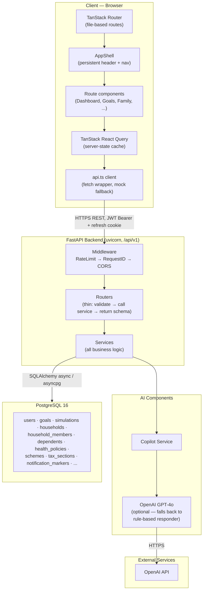
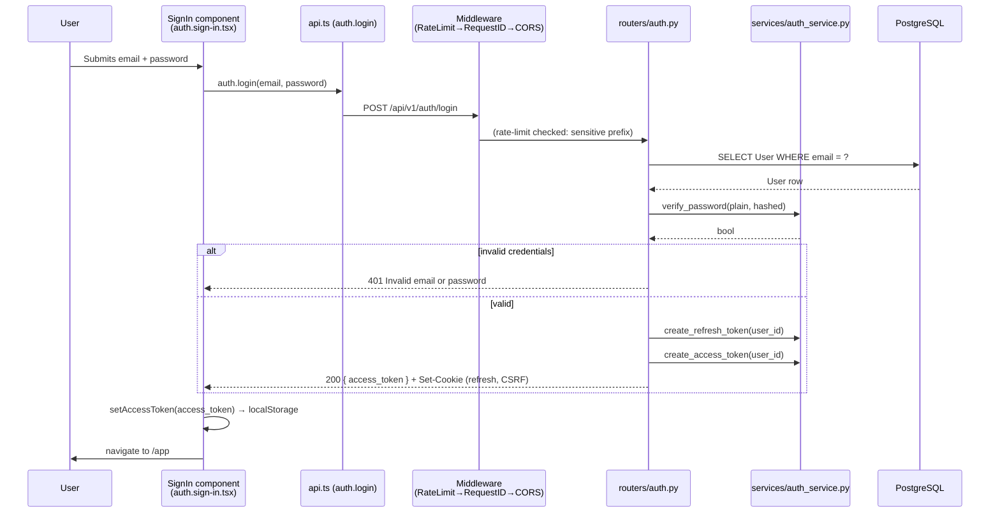
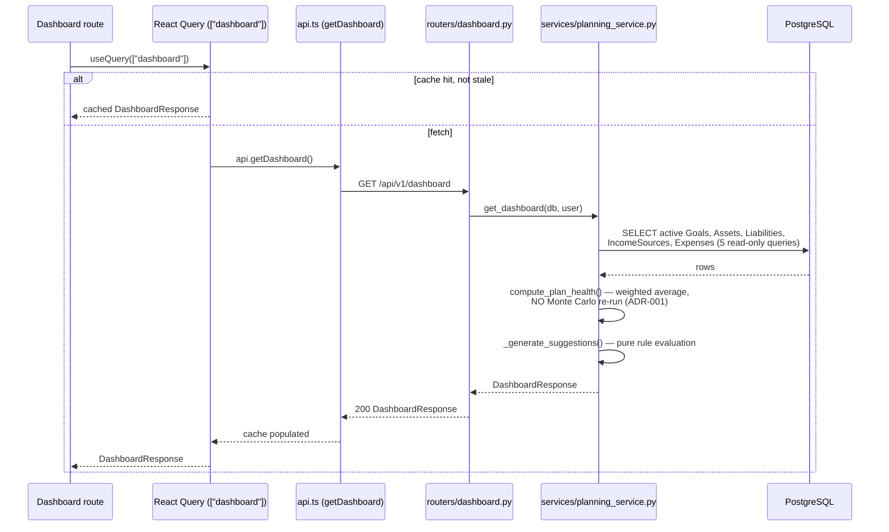
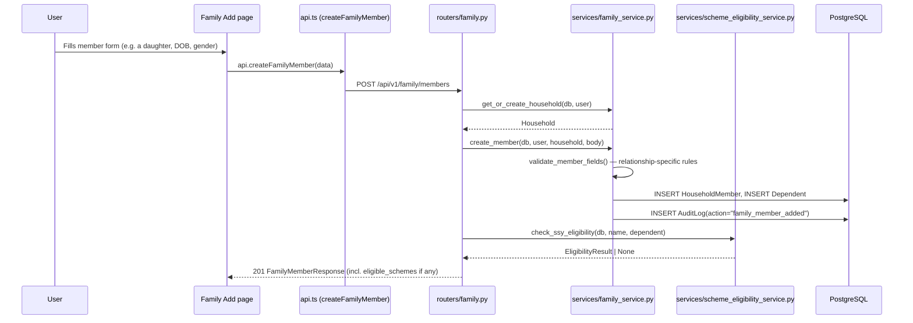
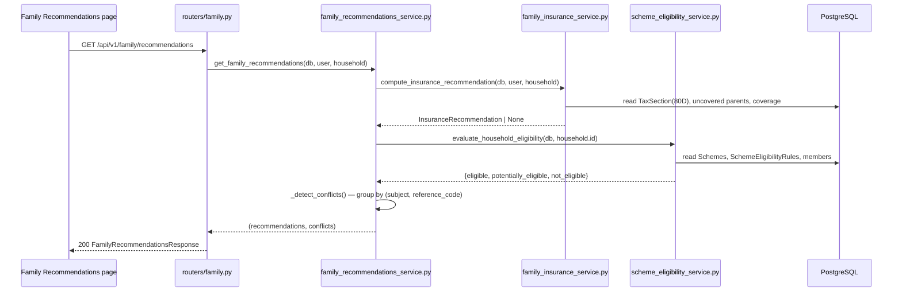
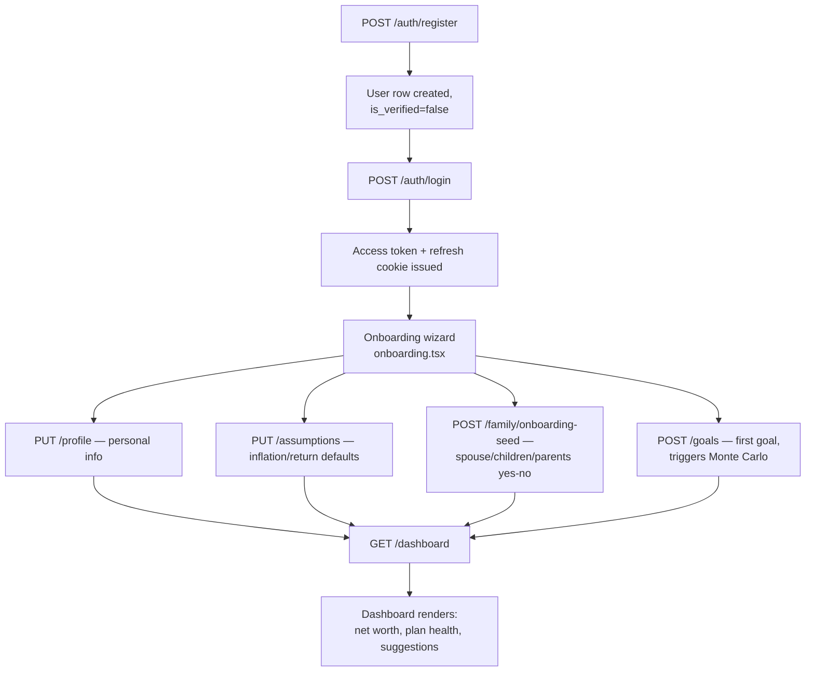
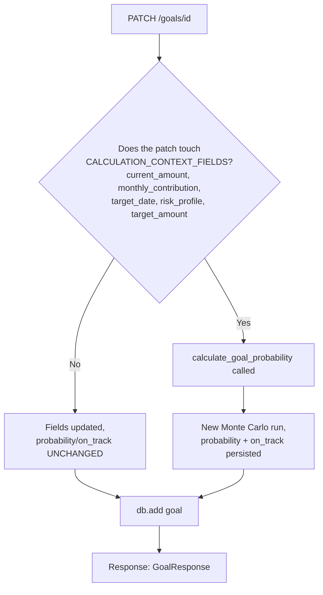
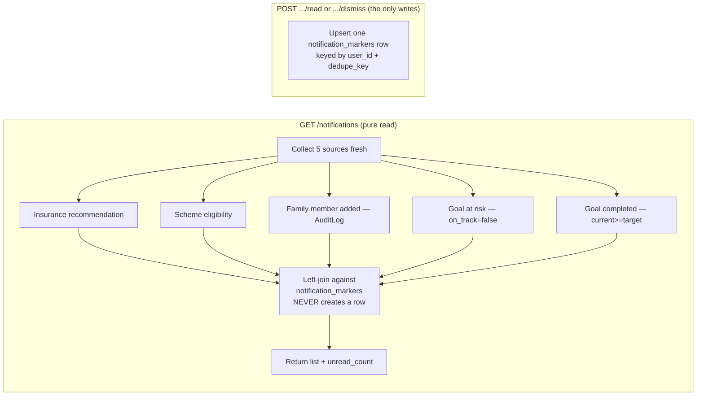

# SYSTEM ARCHITECTURE BIBLE

**Volume 1 of the Northstar Project Engineering Bible**
**Date compiled:** 2026-07-09
**Method:** Every statement in this document was verified by directly reading the source in this repository — routers, services, models, schemas, middleware, the frontend route tree, `api.ts`, and `package.json`/`pyproject.toml`. Where something is not implemented, this document says so explicitly rather than describing an aspiration. This is not source-code documentation; it is the engineering handbook a new senior engineer, an interviewer, or a stakeholder should read to understand how Northstar actually works today.

---

## 1. Executive Summary

**Northstar is a goal-based financial planning SaaS.** A user defines financial goals — retirement, a child's education, a home purchase, an emergency fund — and the platform runs a real Monte Carlo simulation to compute an actual, statistically-grounded probability that the goal will be met, then surfaces concrete, ranked ways to improve that probability (save more, extend the timeline, take more risk). Beyond individual goals, Northstar has a genuinely differentiated second pillar: **family-first, India-specific financial planning** — a household model that tracks family members, evaluates their eligibility for real Indian government schemes (Sukanya Samriddhi Yojana, Senior Citizens' Savings Scheme, etc.) against versioned, effective-dated policy data, and computes tax-deduction-aware insurance recommendations (Section 80D) — all without ever inventing a financial fact the codebase hasn't verified against a real source.

**Who are the users?** Individuals and families building a long-term financial plan, most concretely modeled around Indian tax/scheme context (the family/insurance/schemes subsystem is explicitly India-specific), while the core goal/Monte-Carlo engine is currency-agnostic.

**What business value does it provide?** It replaces a spreadsheet-and-guesswork approach to "will I actually retire on time?" with a real probabilistic answer, and replaces "do I qualify for any of these nine government schemes?" with a personalized, pre-filtered, explained answer — both are things `docs/PRODUCT_PRINCIPLES.md` explicitly commits to (`#2` every recommendation must be explainable; `#6` schemes are personalized, never presented as a flat catalog).

**Major capabilities, verified present in this codebase:**
- Goal creation/tracking with a real 10,000-path Monte Carlo simulation engine (`backend/app/services/monte_carlo.py`)
- A financial dashboard aggregating goals, assets, liabilities, income, and expenses into net worth, savings rate, and a weighted "plan health" score
- An Optimizer that proposes ranked, concrete contribution/risk-profile changes to raise a goal's success probability
- A Family module: household/member management, government scheme eligibility evaluation, family health-insurance tracking with an 80D-deduction recommendation, a cross-source recommendation aggregator with conflict detection, and a composed Family Dashboard
- A Global Shell: a persistent app frame with a working Global Command Palette (⌘K search), a Notification Center (backend-driven, presentation-layer-only), and a Profile Menu — all built and hardened across this project's own Milestone 2.6
- An AI Copilot that narrates the user's *already-computed* data via GPT-4o, with a deterministic rule-based fallback when no API key is configured
- JWT authentication with httpOnly-cookie refresh rotation, CSRF double-submit protection, and a token-bucket rate limiter

---

## 2. Product Overview

*(User-facing capabilities only — implementation details are covered from Section 6 onward.)*

### 2.1 Onboarding
A new user registers, then walks through a step-based onboarding wizard (`code/src/routes/onboarding.tsx`) that seeds their profile, financial assumptions, and an initial household (spouse/children/dependent-parents yes/no questions — deliberately kept to a handful of questions per `UX_PRINCIPLES.md #2`, not a full census).

### 2.2 Dashboard
The landing screen after login. Shows net worth, liquid vs. invested assets, liabilities, monthly income/expenses/savings rate, a "plan health" score (0–100, weighted by each goal's dollar size), a projected retirement figure, and a short list of actionable suggestions ("boost this goal," "no retirement goal found," "savings rate is low").

### 2.3 Goals
Users create goals (name, category — retirement/education/home/travel/wealth/emergency — target amount, target date, monthly contribution, risk profile). Every goal shows a live-computed success probability and an on-track/at-risk flag. Editing a goal's financial inputs triggers a fresh Monte Carlo run; editing anything else (e.g. a custom inflation override) does not.

### 2.4 Simulation & Optimization
A dedicated simulate/optimize surface lets a user request a full 10,000-path simulation (with percentile outcomes, not just a pass/fail) and ask for ranked suggestions ("increase monthly contribution by $200," "shift risk profile to Aggressive") to reach a target confidence level.

### 2.5 Family
A household workspace: add family members (spouse/child/parent/other), each with relationship-specific required fields (a parent needs an insurance-status answer; a child needs a date of birth). The Family module surfaces:
- **Family Goals** — goals tagged with which household members they affect (a descriptive tag, never a joint-ownership model)
- **Government Schemes** — every seeded scheme bucketed into Eligible / Potentially Eligible / Not Eligible per member, each with a plain-language reason
- **Family Insurance** — tracked health policies and their covered members, plus a standalone-parent-policy tax-deduction recommendation when applicable
- **Family Recommendations** — insurance + scheme recommendations aggregated into one feed, with explicit conflict flags when two recommendations compete for the same tax ceiling
- **Family Dashboard** — a single composed view of six cards (dependents, education, coverage, parents, retirement, emergency) plus the recommendations feed, degrading individual cards to "unavailable" rather than failing the whole page if one section errors

### 2.6 Global Shell (Header)
- **⌘K / Ctrl+K Command Palette** — searches goals, family members, government schemes, and insurance policies by name; navigates to any page; two quick actions (Create Goal, Add Family Member)
- **Notification Center** — a real, backend-driven bell showing insurance recommendations, scheme eligibility, family-member-added events, and goal-at-risk/goal-completed alerts, each markable read or dismissible
- **Profile Menu** — account info, My Profile, Settings, Sign Out

### 2.7 AI Copilot
A chat surface grounded in the user's actual goal data (name, category, target, current amount, probability, on-track status) — it narrates and reasons about numbers the Monte Carlo engine already computed; it never originates a financial figure itself.

### 2.8 Reports & Settings
A read-only summary report (mirrors the dashboard's figures plus a per-goal breakdown) and an account settings surface.

---

## 3. High-Level Architecture



**Communication summary:**
- Frontend ↔ Backend: HTTPS REST under `/api/v1`, JSON bodies, JWT access token in the `Authorization: Bearer` header, a separate httpOnly refresh-token cookie scoped to `/api/v1/auth`, and a readable CSRF cookie echoed back as a header on refresh.
- Backend ↔ Database: `asyncpg` driver through SQLAlchemy's async engine (`backend/app/database.py`), connection-pooled (`database_pool_size`/`database_max_overflow`, `app/config.py`).
- Backend ↔ AI: `backend/app/routers/copilot.py` calls the OpenAI SDK directly (`AsyncOpenAI`), reused as a single module-level client instance; **no other external service exists in this codebase.**

---

## 4. Technology Stack

| Layer | Technology | Why (as evidenced in this repo) |
|---|---|---|
| Frontend framework | **TanStack Start** (React 19) — `code/package.json` | File-based routing (`@tanstack/react-router`) with SSR shell support (`shellComponent`/`RootShell` in `__root.tsx`) |
| Frontend build | **Vite 8** + `@tanstack/router-plugin` | Route-tree code generation (`routeTree.gen.ts`), fast dev server |
| Styling | **Tailwind CSS v4** (`@tailwindcss/vite`) | Utility-first, matches the frozen "Deep Navy Premium" design system in `code/src/styles.css` |
| Component primitives | **Radix UI** (`@radix-ui/react-*`) + a shadcn-style `components/ui/` scaffold | Accessible, unstyled primitives (Dialog, Popover, DropdownMenu) — the entire Global Shell (Command Palette, Notifications, Profile Menu) is built on these |
| Command palette engine | **cmdk** | Purpose-built ⌘K component library, wired up in Milestone 2.6 Phase 2 |
| Server state | **TanStack React Query v5** | One `QueryClient`, created once in `router.tsx`, provided once in `__root.tsx` — the single source of truth for all server-derived state |
| Client routing state | **TanStack Router** | File-based routes under `code/src/routes/`, `staticData` for per-route shell titles, `validateSearch` (Zod) for typed search params |
| Forms | **react-hook-form** + **@hookform/resolvers** + **Zod** | Schema-validated forms |
| Charts | **Recharts** | Dashboard net-worth projection, wealth breakdown |
| Animation | **motion** (Framer Motion successor) | Used sparingly per this project's own compositor-friendly-properties convention |
| Icons | **lucide-react** | Consistent icon set across the entire app, including the Global Shell |
| Backend framework | **FastAPI 0.115** (`backend/requirements.txt`) | Async-native, Pydantic-integrated, automatic OpenAPI |
| ASGI server | **uvicorn[standard] 0.32** | — |
| ORM | **SQLAlchemy 2.0 (async)** + **asyncpg 0.30** | Async-first end to end; no sync DB driver anywhere in this codebase |
| Migrations | **Alembic 1.14** | 9 migrations to date (`001_initial_schema.py` → `009_notification_markers.py`), all additive per `docs/ENGINEERING_CONSTITUTION.md` Rule 3 |
| Validation | **Pydantic 2.10** | Every request/response schema in `backend/app/schemas/` |
| Auth | **python-jose[cryptography]** (JWT) + **passlib[bcrypt]** (hashing) | Hand-rolled JWT issuance/verification in `services/auth_service.py` — no third-party auth-as-a-service |
| Numerics | **NumPy 2.2** | The entire Monte Carlo engine is vectorized NumPy — no simulation loop is a Python-level per-path loop |
| AI | **openai 1.58** (official SDK) | `AsyncOpenAI` client, GPT-4o, `backend/app/routers/copilot.py` |
| Database | **PostgreSQL 16** | Confirmed via `backend/.env` connection string and Alembic's `postgresql+asyncpg://` URLs |
| Backend testing | **pytest** + **pytest-asyncio** + **pytest-cov** | `asyncio_mode = "auto"`, `--cov-fail-under=80` enforced in `pyproject.toml` |
| Backend lint/type-check | **Ruff** + **mypy --strict** | Both configured in `pyproject.toml`; `docs/ENGINEERING_CONSTITUTION.md` Rule 5 treats both as a hard gate |
| Frontend lint/format | **ESLint 9** (flat config) + **Prettier** | — |
| Deployment | **Dockerfile** present in `backend/`; no committed frontend Dockerfile or CI/CD pipeline found in this repo | **Not implemented in this project**: no observed CI config (no `.github/workflows` referenced in this exploration), no committed production deployment manifest for the frontend |

---

## 5. Repository Structure

```
Goal-oriented/
├── backend/                  FastAPI application
│   ├── app/
│   │   ├── main.py           App factory: middleware order, router registration, /health
│   │   ├── config.py         Pydantic Settings — every env-driven value in one place
│   │   ├── database.py       Async engine, session factory, declarative Base
│   │   ├── logging_config.py Structured logging setup
│   │   ├── middleware/       auth.py (JWT dependency), rate_limit.py, request_id.py
│   │   ├── models/           SQLAlchemy ORM — the schema's source of truth
│   │   ├── schemas/          Pydantic request/response contracts
│   │   ├── routers/          Thin HTTP handlers — one file per domain
│   │   └── services/         All business logic — the only place calculations happen
│   ├── alembic/versions/     9 migrations, additive-only
│   ├── tests/                pytest suite, ≥80% coverage enforced
│   └── scripts/               (seed/utility scripts — not enumerated in this pass)
├── code/                     TanStack Start frontend
│   └── src/
│       ├── routes/           File-based routes (one file = one URL, `app.*.tsx` under the `/app` layout)
│       ├── components/       app-shell.tsx, global-palette.tsx, notification-center.tsx,
│       │                      dashboard/, family/, onboarding/, and the ui/ Radix scaffold
│       ├── lib/               api.ts (the entire backend contract), utils, mock-data
│       └── hooks/             (custom hooks — not enumerated in this pass)
├── docs/                     Pre-existing architecture/backend/database/frontend notes
│                              (partially superseded by this document — see callouts below)
└── *.md (repo root)          A very large number of dated engineering reports —
                               Dependency Validations, Architecture Reviews, PR Reports,
                               Certifications — one per milestone/task, the project's own
                               audit trail (see docs/ENGINEERING_CONSTITUTION.md Rule 8)
```

**Cross-reference note:** `docs/architecture.md` (pre-existing) is accurate for Milestone 1 but predates the Family module, the Notification system, and the entire Global Shell — it does not list the `family` or `notifications` routers. This document (Volume 1 of the Bible) supersedes it as the current source of truth; `docs/architecture.md` is not deleted but should be read as historical.

---

## 6. Application Layers

| Layer | Purpose | Main files | Communicates with |
|---|---|---|---|
| **Presentation** | Renders UI, captures user input | `code/src/routes/*.tsx`, `code/src/components/**` | React Query hooks → `api.ts` |
| **API (frontend)** | Single point of contact with the backend; shape-maps snake_case ↔ camelCase; token refresh | `code/src/lib/api.ts` | `fetch` → Backend API layer |
| **API (backend)** | HTTP concerns only: path/method, dependency injection, status codes, response models | `backend/app/routers/*.py` | Service layer |
| **Business/Service** | All calculations, validation-with-context, orchestration across models | `backend/app/services/*.py` | Persistence layer |
| **Persistence (ORM)** | Schema definition, relationships, cascades | `backend/app/models/*.py` | Database layer via SQLAlchemy |
| **Database** | Durable storage | PostgreSQL 16, migrated by Alembic | — |
| **Infrastructure** | Cross-cutting concerns: auth, rate limiting, request correlation, CORS | `backend/app/middleware/*.py`, `main.py`'s `add_middleware` calls | Wraps every request before it reaches a router |

**The one rule enforced throughout `backend/app/routers/`, verified in every router read for this document:** a router calls at most one service function's worth of logic and returns a schema — `docs/ENGINEERING_CONSTITUTION.md` Rule 1 ("Routers are thin. Always.") holds without exception across `auth.py`, `goals.py`, `dashboard.py`, `simulate.py`, `family.py`, `notifications.py`, `copilot.py`, `financials.py`, `assumptions.py`, `profile.py`, and `reports.py`.

---

## 7. Request Lifecycle

### 7.1 User Login



### 7.2 Goal Creation (with Monte Carlo trigger)

```mermaid
sequenceDiagram
    participant U as User
    participant FE as Goals page
    participant API as api.ts (createGoal)
    participant R as routers/goals.py
    participant S as services/planning_service.py
    participant MC as services/monte_carlo.py
    participant DB as PostgreSQL

    U->>FE: Fills goal form, submits
    FE->>API: api.createGoal(goal)
    API->>R: POST /api/v1/goals
    R->>R: Goal(user_id=current_user.id, **body)
    R->>S: calculate_goal_probability(goal)
    S->>MC: quick_probability_async(...)
    MC->>MC: run_simulation() — 2,000 paths,<br/>vectorized NumPy, thread-pool offloaded
    MC-->>S: success_rate (float)
    S->>S: goal.probability = round(success_rate, 1)<br/>goal.on_track = probability >= 70.0
    R->>DB: db.add(goal); db.flush()
    DB-->>R: goal row (with id, timestamps)
    R-->>FE: 201 GoalResponse
```

**Why this matters (ADR-001):** this is the *only* path that ever writes `goal.probability`/`goal.on_track`. See §15.3.

### 7.3 Dashboard Load



**Critical property, verified by reading `planning_service.get_dashboard()` and `_active_goals()` directly:** this path is 100% read-only. It never calls `calculate_goal_probability`. `AppShell` (`code/src/components/app-shell.tsx`) shares this exact `["dashboard"]` query key with the Dashboard route itself, so both consumers read one cached response, not two independent fetches.

### 7.4 Family Member Addition



### 7.5 Recommendation Generation (Family Recommendations)



**Verified, load-bearing property:** `family_recommendations_service.py` performs **zero eligibility math and zero deduction-figure computation of its own** — every value is read from an already-certified engine (insurance service, scheme eligibility service) and only reformatted. This is directly why the module's own comment says "aggregation only."

---

## 8. Feature Inventory

| Feature | Purpose | Frontend | Backend | Database | Status |
|---|---|---|---|---|---|
| Auth (register/login/refresh/logout/password reset/change) | Account access | `routes/auth.*.tsx` | `routers/auth.py`, `services/auth_service.py` | `users`, `password_reset_tokens` | ✅ Complete |
| Goals (CRUD + probability) | Core planning unit | `routes/app.goals.tsx` | `routers/goals.py`, `services/planning_service.py` | `goals` | ✅ Complete |
| Monte Carlo Simulation | Probabilistic goal outcome | `GoalSimPanel.tsx` | `routers/simulate.py`, `services/monte_carlo.py` | `simulations` | ✅ Complete |
| Optimizer | Ranked improvement suggestions | (via simulate/optimize) | `services/optimizer.py` | (reads `goals`, writes nothing) | ✅ Complete |
| Dashboard | Aggregate financial view | `routes/app.index.tsx` | `routers/dashboard.py`, `services/planning_service.py` | reads `goals`,`assets`,`liabilities`,`income_sources`,`expenses` | ✅ Complete |
| Financials (income/expenses/assets/liabilities) | Manual account entry | (financials forms — not deep-read this pass) | `routers/financials.py` | `income_sources`,`expenses`,`assets`,`liabilities` | ✅ Complete (CRUD) |
| Assumptions | Per-user inflation/return/tax defaults | (settings-adjacent) | `routers/assumptions.py` | `financial_assumptions` | ⚠️ Complete as CRUD, **but disconnected from the Monte Carlo engine** — see §15.9 |
| Profile | Personal info (DOB, employment, country) | `routes/app.profile.tsx` | `routers/profile.py` | `user_profiles` | ✅ Complete, with two deprecated fields (`marital_status`, `dependents` — see §16) |
| Family Home/Members | Household + member CRUD | `routes/app.family.*.tsx` | `routers/family.py`, `services/family_service.py` | `households`,`household_members`,`dependents` | ✅ Complete |
| Family Goal Tagging | "Who this affects" descriptive tags | `routes/app.family.goals.tsx` | `routers/goals.py` (`/family-tags`), `routers/family.py` (`/goals`) | `goal_household_members` | ✅ Complete |
| Government Scheme Eligibility | India-specific scheme matching | `routes/app.family.schemes.tsx` | `routers/family.py` (`/schemes`), `services/scheme_eligibility_service.py` | `schemes`,`scheme_eligibility_rules`,`scheme_rates` | ✅ Complete, narrow scope (3 rule types only) |
| Family Insurance | Health policy tracking + 80D recommendation | `routes/app.family.insurance.tsx` | `routers/family.py` (`/insurance*`), `services/family_insurance_service.py` | `health_policies`,`health_policy_coverage`,`tax_sections` | ✅ Complete |
| Family Recommendations | Cross-source aggregation + conflict detection | `routes/app.family.recommendations.tsx` | `routers/family.py` (`/recommendations`), `services/family_recommendations_service.py` | reads only, nothing persisted | ✅ Complete |
| Family Dashboard | Composed 6-card + recommendations view | `routes/app.family.index.tsx` | `routers/family.py` (`/dashboard`), `services/family_dashboard_service.py` | reads only, graceful per-card degradation | ✅ Complete |
| Global Command Palette | ⌘K search + navigation + quick actions | `components/global-palette.tsx` | none (client-side search over already-fetched data) | none | ✅ Complete (Milestone 2.6 Phase 2) |
| Notification Center | Presentation-layer notifications | `components/notification-center.tsx` | `routers/notifications.py`, `services/notification_service.py` | `notification_markers` (state only, never content) | ✅ Complete (Milestone 2.6 Phase 3) |
| Profile Menu / Persistent AppShell | Header identity menu + non-remounting shell | `components/app-shell.tsx` | none | none | ✅ Complete (Milestone 2.6 Phases 0-1, mutual-exclusion fixed in M2.6.1) |
| AI Copilot | Grounded chat over user's own data | `routes/app.copilot.tsx` | `routers/copilot.py` | reads `goals`; writes nothing | ✅ Complete, with deterministic fallback |
| Reports | Read-only summary export | `routes/app.reports.tsx` | `routers/reports.py` | reads only | ✅ Complete |
| Recommendation Engine (persisted, general-purpose) | A schema for citable, structured recommendations | — | `models/recommendation.py` | `recommendations`,`recommendation_citations` | ⛔ **Not implemented in this project** — schema exists, zero router/service reads or writes it |
| HUF (Hindu Undivided Family) entities | Indian joint-family tax entity modeling | — | `models/estate.py` | `huf_entities`,`huf_coparceners` | ⛔ **Not implemented in this project** — schema-only |
| Nominees / Estate Documents | Nomination and will-status tracking | — | `models/estate.py` | `nominees`,`estate_documents` | ⛔ **Not implemented in this project** — schema-only |
| Best-Practice / Company Policy rules | Layers 2-3 of a 5-layer policy engine | — | `models/company_policy.py` | `best_practice_rules`,`company_policies` | ⛔ **Not implemented in this project** — schema-only, zero seeded rows found in this exploration |

---

## 9. Module Dependency Map

```mermaid
flowchart LR
    Auth[Auth] --> Goals
    Auth --> Family
    Auth --> Dashboard
    Auth --> Notifications
    Auth --> AICopilot[AI Copilot]
    Auth --> Search[Global Search / Palette]

    Goals --> Dashboard
    Goals --> Simulate[Simulate / Optimizer]
    Goals --> AICopilot
    Goals --> Search
    Goals --> Family

    Family --> FamilyGoals[Family Goal Tagging]
    FamilyGoals --> Goals
    Family --> Schemes[Government Schemes]
    Family --> Insurance[Family Insurance]
    Insurance --> Recommendations[Family Recommendations]
    Schemes --> Recommendations
    Recommendations --> FamilyDashboard[Family Dashboard]
    Family --> FamilyDashboard
    Dashboard -.shares planning_service.get_dashboard.-> FamilyDashboard

    Notifications -.reads live, never duplicates.-> Insurance
    Notifications -.reads live, never duplicates.-> Schemes
    Notifications -.reads.-> Goals
    Notifications -.reads.-> Family

    Search -.client-side reads already-fetched.-> Goals
    Search -.client-side reads already-fetched.-> Family
    Search -.client-side reads already-fetched.-> Schemes
    Search -.client-side reads already-fetched.-> Insurance

    Settings[Settings] --> Auth
    Profile --> Auth
```

**Key dependency facts, verified from the code, not inferred:**
- `family_recommendations_service` **depends on but never modifies** `family_insurance_service` and `scheme_eligibility_service` — a strict one-way, read-only dependency.
- `family_dashboard_service` depends on `family_service`, `family_insurance_service`, `family_recommendations_service`, **and** `planning_service.get_dashboard()` (for the Emergency card) — it is the single most-connected module in the Family domain, by design, since its job is composition.
- `notification_service` depends on `family_insurance_service.compute_insurance_recommendation()` and `scheme_eligibility_service.evaluate_household_eligibility()` **exactly as they already exist** — it duplicates zero calculation logic (verified by reading `backend/app/services/notification_service.py` directly this session).
- The Global Command Palette has **no backend dependency at all** — it searches data the page/shell has *already fetched* via React Query, using `cmdk`'s in-memory scorer.
- `goals.py`'s `set_goal_family_tags` endpoint calls into `family_service` (not the reverse) — Family Goal Tagging is implemented as a Goals-router endpoint that reuses Family's household-resolution logic, not a Family-router endpoint that reaches into Goals.

---

## 10. Data Flow

### 10.1 Registration → Onboarding → First Dashboard View



### 10.2 Goal Update → Recalculation Decision



**This decision boundary (`CALCULATION_CONTEXT_FIELDS`, defined once in `planning_service.py`) is the single most important data-flow rule in the codebase — see §15.3.**

### 10.3 Notifications: Live Read, Never-Persisted Content



---

## 11. State Management

- **Server state:** exclusively **TanStack React Query**. One `QueryClient` is instantiated once (`code/src/router.tsx`'s `getRouter()`) and provided once (`__root.tsx`'s `RootComponent`) — there is no second query client and no ad-hoc `useEffect`+`fetch` pattern in the shell components (though see §16 for two pages that still do this). Query keys are deliberately shared across independent call sites (`["dashboard"]` used by both `AppShell` and the Dashboard route; `["currentUser"]` used by both `AppShell` and `GlobalPalette`) so React Query's cache — not a second in-memory store — is the sole deduplication mechanism.
- **Routing:** **TanStack Router**, file-based, with `beforeLoad` guards (`app.tsx` checks `localStorage` for a token before rendering the `/app` subtree), `staticData` for per-route shell titles (avoiding prop-drilling a title into a now-persistent `AppShell`), and `validateSearch` (Zod-typed search params, e.g. `app.goals.tsx`'s `?new=true` used by the Command Palette's "Create Goal" quick action).
- **Caching:** governed per-query by `staleTime` (e.g. `["currentUser"]` at 5 minutes, `["dashboard"]` at 1 minute, `["notifications"]` at 30 seconds with a 2-minute `refetchInterval`) — no global cache-time default is overridden; each query's staleness reflects how often that data realistically changes.
- **Shared UI state (Global Shell overlays):** as of Milestone 2.6.1, a single discriminated-union state (`activeOverlay: "palette" | "notifications" | "profile" | "more" | null`) lives in `AppShell` and is threaded down as controlled `open`/`onOpenChange` props to `GlobalPalette`, `NotificationCenter`, and the profile `DropdownMenu` — chosen specifically so only one header overlay can ever be open at once (see §15.10).
- **Local state:** ordinary `useState` everywhere else (form fields, a single component's open/closed toggle) — no Redux, Zustand, or Context-based global store exists anywhere in this codebase.

**Why these choices were made:** React Query was chosen (per this project's own established pattern, reused consistently since Milestone 1) because it gives caching, deduping, and staleness semantics for free, which is exactly the property the Phase 0 "Persistent AppShell" work needed (a shell that mounts once should not re-fetch the same user/dashboard data on every navigation) — a second, hand-rolled state layer would have had to reinvent this.

---

## 12. Security Overview

- **Authentication:** JWT, HS256, two token types (`access`, 30 min default; `refresh`, 7 days default — `app/config.py`), each carrying `sub`, `type`, `iat`, `exp`, and a unique `jti`. Verified in `services/auth_service.py` and `middleware/auth.py`'s `get_current_user` dependency (checks `type == "access"` explicitly — a refresh token cannot be used as an access token, and vice versa, since `/auth/refresh` explicitly requires `expected_type="refresh"`).
- **Refresh token delivery:** an httpOnly cookie, scoped to path `/api/v1/auth` only (never sent on ordinary API calls), paired with a **separate, JS-readable CSRF cookie** whose value must be echoed back in an `X-CSRF-Token` header on `/auth/refresh` — the double-submit pattern, verified in `routers/auth.py`'s `_verify_csrf` using `secrets.compare_digest` (constant-time comparison, not `==`).
- **Refresh token rotation:** every successful `/auth/refresh` call issues a *new* refresh token and CSRF pair (`_set_auth_cookies` is called again), shrinking the replay window for a leaked token.
- **Authorization / ownership checks:** every single resource-scoped endpoint in `goals.py`, `financials.py`, `family.py`, and `notifications.py` filters by `current_user.id` (or, for Family, by household ownership resolved via `family_service.resolve_owned_household`) in the same query that fetches the row — there is no separate "fetch then check ownership" step that could be forgotten, and a mismatched ID returns 404, not 403 (avoiding confirming a resource's existence to a non-owner).
- **Protected routes (frontend):** `app.tsx`'s `beforeLoad` (SSR-safe, checks `typeof window`) plus a client-side `useEffect` re-check on every mount — both redirect to `/auth/sign-in` if no access token is present.
- **Audit logs:** `AuditLog` (`models/audit.py`) is written by `family_service` (`household_created`, `family_member_added`, `family_member_updated`, `family_member_removed`, `family_goal_tag_changed`) and `family_insurance_service` (`insurance_policy_created`, `insurance_policy_coverage_updated`) — every mutating action in the Family domain has a before/after JSON snapshot. **Not implemented in this project:** goal creation/update and financials CRUD do **not** write to `AuditLog` — audit logging is currently scoped to the Family domain only.
- **Data isolation:** confirmed directly this session (Milestone 2.6 Certification) via a live cross-account test — fetching another user's goal or family member by ID with a valid-but-wrong-owner token returns 404, and the Notification feed for one account was checked to contain zero trace of another account's data.
- **Rate limiting:** an in-memory token-bucket limiter (`middleware/rate_limit.py`), IP-keyed (with an explicit trusted-proxy allowlist before honoring `X-Forwarded-For` — an untrusted client cannot spoof this header to bypass its own limit), with tighter, path-specific buckets for `/auth/login`, `/auth/register`, and `/simulate`. A **separate**, per-email throttle exists specifically for `/auth/forgot-password` (`routers/auth.py`'s `_check_forgot_password_throttle`) because the generic IP limiter alone can't stop a distributed attempt to mass-issue reset tokens for one target email.
- **Password reset:** `/forgot-password` always returns 200 regardless of whether the email exists (prevents user enumeration); the reset token is only ever returned in the response body when `settings.debug` is true.
- **CORS:** an explicit origin allowlist (`cors_origins` in `config.py`), not a wildcard.
- **Validation:** every write endpoint's request body is a Pydantic schema with explicit bounds (e.g. `GoalCreate`'s `_MAX_AMOUNT`/`_MAX_MONTHLY_AMOUNT` upper bounds exist specifically to keep the Monte Carlo engine's compounding loop away from `inf`/`NaN` territory — a security-adjacent correctness bound, not just UX).

---

## 13. Performance Overview

- **Async-first backend:** every DB call in every service function uses SQLAlchemy's async session — confirmed with no exceptions across every service file read for this document.
- **Monte Carlo offloading:** `run_simulation_async`/`quick_probability_async` run the CPU-bound NumPy simulation in the default thread-pool executor (`asyncio.get_running_loop().run_in_executor`), so a 10,000-path simulation never blocks the event loop from serving other requests concurrently.
- **Vectorized simulation:** the Monte Carlo path loop (`run_simulation` in `monte_carlo.py`) uses NumPy array operations across all simulated paths at once (`portfolio = portfolio * monthly_returns[:, t] + monthly_contribution`), not a per-path Python loop — this is what makes 10,000 paths tractable inline rather than requiring a background job.
- **Query reuse within the Family Dashboard:** `family_dashboard_service.get_family_dashboard()` fetches the household's member list and goal-with-tags list **exactly once each**, sharing both across every card that needs them (a documented Milestone 2.1-P4 optimization) — verified by reading the `_safe()` wrapper pattern directly.
- **Query reuse within the Global Shell:** `AppShell` and `GlobalPalette` share the `["currentUser"]` cache key; `AppShell` and the Dashboard route share `["dashboard"]` — confirmed via live network capture during this project's own Phase 0/Phase 2 verification work (documented in `PerformanceComparison.md`, `SearchPerformanceReport.md`).
- **Persistent shell, no remount-on-navigation:** `AppShell` is mounted once at the `/app` layout route (Milestone 2.6 Phase 0) — navigating between `/app/*` pages swaps only the route's own `<Outlet/>` content, not the sidebar/header, eliminating a fresh `auth.me()`/`getDashboard()` fetch on every click that existed before this fix.
- **Notification polling, not push:** `refetchInterval: 120_000` on the `["notifications"]` query — no WebSocket/SSE exists anywhere in this codebase (**not implemented in this project**).
- **Known, verified bottleneck class:** two frontend pages (`app.goals.tsx`, `app.profile.tsx`) fetch data via a raw `useEffect`+`fetch`/`Promise.all` rather than `useQuery`, so they never populate or read the shared React Query cache the rest of the shell relies on — confirmed by grep (zero `useQuery` occurrences in either file) during this project's own Phase 2/Certification work. This causes redundant network calls on repeated navigation to those two pages specifically, not elsewhere.

---

## 14. Testing Overview

- **Backend tests:** `backend/tests/`, run via `pytest`, `asyncio_mode = "auto"` (no manual `@pytest.mark.asyncio` boilerplate needed per test, per `pyproject.toml`), against an in-memory SQLite test database (per `tests/conftest.py`'s `TestSessionLocal`, confirmed in this session's own Phase 3 test-writing work) — **not** against the real PostgreSQL instance, which is a deliberate speed/isolation trade-off with one documented consequence: SQLite returns naive datetimes even for `TIMESTAMPTZ` columns, requiring an explicit `_aware()` normalization helper in code that compares timestamps (seen directly in `notification_service.py`).
- **Coverage enforcement:** `--cov=app --cov-fail-under=80` is a hard `pytest` failure condition (`pyproject.toml`), not an advisory report — confirmed passing at 97.53% as of the most recent full-suite run performed in this session (341 tests).
- **Regression discipline:** `docs/ENGINEERING_CONSTITUTION.md` Rule 6 — "tests prove behavior; they do not get adjusted to match a bug" — is the stated philosophy; this session's own work (fixing two real bugs found during Phase 2/Phase 3 live verification) followed it by fixing the implementation and confirming the existing/new tests then passed, never loosening an assertion.
- **Frontend validation:** `tsc --noEmit` and `eslint` are run after every meaningful frontend change (confirmed as the working pattern throughout this entire session's Global Shell work) — there is **no committed frontend unit/component test suite** found in this exploration (**not implemented in this project**: no `*.test.tsx` files were discovered under `code/src/`).
- **Live/manual verification:** this project's own engineering process (evidenced across every phase's PR report) supplements automated tests with live, browser-driven verification against the real running app for anything overlay/UI-interaction-related — a deliberate compensation for the absence of a frontend automated test suite.

---

## 15. Design Decisions

*(The reasoning, not just the mechanism — cross-referenced to the actual code and this project's own decision-log documents where they exist.)*

### 15.1 Why calculations are centralized

Every financial calculation in this codebase lives in exactly one service function per concern: `planning_service.calculate_goal_probability()` is the **only** function anywhere that writes `goal.probability`/`goal.on_track`; `monte_carlo.run_simulation()` is the **only** simulation loop; `family_insurance_service._base_80d_limit()` is the **only** place the 80D figure is read. This is a direct, load-bearing application of `docs/ENGINEERING_CONSTITUTION.md` Rule 1 (thin routers) and Rule 4 (never invent a financial fact) — if a calculation existed in two places, they could drift, and a user could see two different "true" answers for the same question depending on which screen they were on. This exact failure mode is precisely what happened before ADR-001 (see 15.3) and is why it was fixed at the architectural level, not patched at the call site.

### 15.2 Why dashboard reads never mutate

`planning_service.get_dashboard()` and `_active_goals()` are read-only by explicit design and explicit code comment ("Read-only fetch — never mutates or persists a probability"). This is the direct fix for a **real, documented incident** referenced throughout this codebase's own history (`ArchitectureDecisionRecord.md`, `MonteCarloConsistencyReport.md`): `get_dashboard()` used to call `refresh_goal_probabilities()` on every view, re-running an *unseeded* Monte Carlo simulation and overwriting the stored probability — meaning the same goal could show a different success percentage depending on which screen was opened last, with a boundary-case goal's `on_track` flag silently flipping between page loads and no audit trail of why. The fix (documented as ADR-001) removed the mutating call entirely; every read path now consumes whatever was last persisted by an actual user action.

### 15.3 Why recommendations are computed live, never persisted

`family_insurance_service.compute_insurance_recommendation()`, `scheme_eligibility_service.evaluate_household_eligibility()`, and `family_recommendations_service.get_family_recommendations()` are all called fresh on every single request — confirmed by reading each function's own docstring and call site, all citing the same underlying reasoning (`RecommendationIntegrityReview_Task10.md`/`Task11.md`): a recommendation grounded in a household's *current* state must never go stale the way a persisted, cached recommendation would the moment that state changes. This same reasoning was explicitly re-applied and re-confirmed when the Notification Center was designed in Milestone 2.6 Phase 3 — notifications never persist *content*, only a seen/read/dismissed marker, specifically to avoid recreating this exact staleness risk in a new subsystem.

### 15.4 Why Monte Carlo is triggered only on goal update, not on every read

Directly answers "why doesn't the Dashboard just always show the freshest possible probability?" The Monte Carlo engine's RNG is unseeded by default (`settings.monte_carlo_seed` is `None` unless explicitly configured) — running it on every read would mean the *same goal, with no user action taken*, shows a different probability on every page load purely from sampling noise. Centering recalculation on the Calculation Context change (current_amount, monthly_contribution, target_date, risk_profile, target_amount — the exact fields in `planning_service.CALCULATION_CONTEXT_FIELDS`) means a stored probability is always traceable to a specific, identifiable user action, and Dashboard/Reports/AI Copilot become cheap reads instead of paying a simulation cost on every view.

### 15.5 Why audit logging exists (and why it's scoped to Family, not universal)

Audit logging exists to make every mutation in a compliance-sensitive domain (family composition, insurance coverage — data with real tax and legal implications) reconstructable after the fact: who changed what, from what, to what. It is currently implemented only in `family_service.py` and `family_insurance_service.py`, not in `goals.py` or `financials.py` — this is a real, verifiable scope boundary in the code (confirmed by grep: `AuditLog` is imported in exactly those two service files), not a documentation gap. The Family domain was the first to need this discipline because HUF/nomination/estate concerns (this codebase's own stated future scope) carry genuine legal weight that a goal's target-amount edit does not.

### 15.6 Why family ownership is separated from goal ownership

`goal_household_members` (the table backing "who this goal affects") is explicitly documented in its own model file as **not** a joint-ownership model: `goals.user_id` remains the sole owner of record for every purpose — tax attribution, contribution tracking, access control — for the entire lifetime of the row. Tagging a goal with a spouse's name never changes who can edit or delete it. This is a direct, deliberate application of `docs/PRODUCT_PRINCIPLES.md #7` ("never claim capability the data model doesn't actually have") — the UI is explicitly required to disclose that a tagged goal still belongs to one account, rather than implying a joint-ownership capability this schema was never built to support.

### 15.7 Why a nullable sibling column (`huf_entity_id`), not a polymorphic owner model, for HUF support

`financials.py`'s four tables (`IncomeSource`, `Expense`, `Asset`, `Liability`) each carry a nullable `huf_entity_id` alongside the always-required `user_id`. A fully generalized polymorphic "owner" abstraction (where `User` and `HUFEntity` both implement a common `Owner` supertype) was explicitly considered and rejected — documented in the model file itself — because only two owner types exist today, and changing `user_id`'s FK target would be a real breaking change to a stable column, not an additive one. This is `docs/ENGINEERING_CONSTITUTION.md` Rule 7 (no premature abstraction) applied to a concrete schema decision, not just an aspiration.

### 15.8 Why the Global Shell overlays were consolidated into one state variable (Milestone 2.6.1)

Originally, each header overlay (Command Palette, Notification popover, Profile Menu, mobile "More" sheet) owned its own open/closed boolean independently — two visible to `AppShell`, one trapped inside `NotificationCenter`, one fully invisible inside Radix's uncontrolled `DropdownMenu` internals. This meant the `⌘K` keyboard handler could only ever toggle the one variable it had a reference to, and whether two overlays could coexist depended entirely on whether two *different* Radix primitives happened to agree on their own default dismiss-on-outside-interaction behavior — which they didn't (`Popover` auto-closed on a `Dialog` opening; `DropdownMenu` did not), producing a real, reproduced bug (both open simultaneously) that this project's own Global Shell Certification caught. The fix consolidates all four into one `activeOverlay` discriminated-union state owned by `AppShell` (already the common ancestor of all four), making mutual exclusion a structural, type-level guarantee rather than an emergent property of four independent components' happenstance behavior.

### 15.9 A genuine, unresolved architectural gap: `FinancialAssumptions` vs. `PROFILE_PARAMS`

Verified directly by grep in this session: `backend/app/models/assumptions.py` defines per-user `expected_return_conservative`/`_balanced`/`_aggressive` and `inflation_rate` fields, fully exposed via `routers/assumptions.py`'s GET/PUT endpoints — but `services/monte_carlo.py`'s `PROFILE_PARAMS` dict (the actual mu/sigma values every simulation uses) is a **hardcoded module-level constant**, entirely independent of any user's stored assumptions. A user can change their "expected balanced return" to 10% via the Assumptions API and it will have **zero effect** on any Monte Carlo simulation they run. Additionally, `monte_carlo.py`'s own `ANNUAL_INFLATION = 0.03` constant is declared but never referenced anywhere in the simulation logic (confirmed by grep — dead code). This is stated here explicitly as a real, unresolved fact about the current system, not glossed over: the Assumptions subsystem and the Monte Carlo engine are two parallel, non-communicating pieces of the same conceptual data.

### 15.10 Why the schema contains multiple fully-built, zero-consumer tables

`Recommendation`/`RecommendationCitation` (a general-purpose, citable-recommendation schema), `HUFEntity`/`HUFCoparcener`/`Nominee`/`EstateDocument` (estate/HUF planning), and `BestPracticeRule`/`CompanyPolicy` (a 5-layer policy engine's Layers 2-3) are all fully modeled, migrated, and **have zero router or service consumers** — confirmed by grep across `backend/app/routers/` and `backend/app/services/` returning no matches for any of these class names. This is a deliberate, documented pattern in this codebase (each model file's own comments cite the specific future-milestone report that justifies its existence, e.g. `FutureCompatibilityAuditReport.md`) — schema is built ahead of the feature that will use it, specifically so that milestone doesn't require a schema migration to start. It is explicitly *not* the "dead code" it would be in most codebases; it is intentional, pre-built runway.

---

## 16. Known Limitations

*(Only limitations directly verified in this codebase — nothing invented.)*

1. **`FinancialAssumptions` is disconnected from the Monte Carlo engine** — see §15.9. A user's configured expected-return assumptions have no effect on their simulations.
2. **`user_profiles.marital_status` and `user_profiles.dependents` are deprecated but not removed** — the code comments explicitly warn against writing new business logic against them, in favor of `household_members`/`dependents`. `financial_assumptions.tax_rate` carries the identical deprecation status in favor of the `tax_regimes`/`tax_slabs` engine.
3. **Two frontend pages bypass the shared React Query cache** — `app.goals.tsx` and `app.profile.tsx` use raw `useEffect`+`fetch` instead of `useQuery`, causing redundant network requests on repeat navigation (verified via network capture during this project's own Certification pass).
4. **No frontend automated test suite exists** — no `*.test.tsx` files were found under `code/src/` in this exploration; frontend correctness is currently verified via `tsc`/`eslint` plus manual/live browser verification, not automated component or integration tests.
5. **Scheme eligibility evaluation is narrow by design** — `scheme_eligibility_service.py`'s own docstring states it evaluates exactly three rule types (`max_age`, `min_age`, `gender`) against non-`self` household members only; a `self` member's own eligibility (which would require joining to `UserProfile`) is not evaluated, and SCSS's special-case retiree/defense-personnel eligibility routes have no seeded rules to check against.
6. **No real-time transport** — Notification Center polling only (120-second interval), no WebSocket/SSE anywhere in this codebase.
7. **No committed CI/CD pipeline or frontend Dockerfile** was found in this repository exploration — only a `backend/Dockerfile` exists.
8. **Audit logging is scoped to the Family domain only** — Goals and Financials CRUD operations are not audit-logged.
9. **Rate limiting is in-memory, single-process** — the rate limiter's own module docstring states this is a deliberate trade-off ("no Redis dependency... for multi-process deployments, replace the in-memory store with Redis") — it will not correctly share limits across multiple uvicorn worker processes or horizontally-scaled instances.
10. **The Command Palette cannot deep-link to a specific Goal, Government Scheme, or Insurance Policy** — only Family Member results deep-link to a specific record (`/app/family/members/$id` exists as a real route); the other three entity types have no URL-addressable detail view, so their search results navigate to the relevant list page instead.

---

## 17. Future Extension Points

*(Where the architecture is intentionally shaped to grow — verified from actual schema/code structure, not speculation.)*

- **AI:** `models/recommendation.py`'s `Recommendation`/`RecommendationCitation` schema is explicitly built as "the literal database representation of the explainable-AI requirement" (reasoning, confidence score, alternatives considered, assumptions used, and a citation link back to the exact `scheme_rates`/`tax_sections` rows relied on) — a future Recommendation Engine milestone can persist real, citable recommendations into this schema without a migration.
- **HUF / Estate Planning:** `HUFEntity` (gated on a required, enumerated `funding_source` — never inferred), `HUFCoparcener`, `Nominee` (already shaped to match SEBI's 2026 nomination rule of up to 3 nominees with percentage splits), and `EstateDocument` (status-only, deliberately never storing actual document content) are fully migrated and ready for a future feature to read/write.
- **Policy Engine, Layers 2-3:** `BestPracticeRule` (with an explicit `confidence` tier — verified/convention/unverified_flag) and `CompanyPolicy` (JSON `rule_definition`, hard_gate/soft_preference/ranking_weight typing) exist purely as structural support for a future ranking/recommendation-policy layer on top of the already-built Layer 1 (government schemes/tax data).
- **Investment / Tax Engine:** the versioned `tax_regimes`/`tax_slabs`/`tax_acts`/`tax_sections` tables already support effective-dated old-vs-new tax regime comparison; no router currently exposes a full tax calculation, but the data model is present.
- **Multi-owner financial data:** the `huf_entity_id` nullable-sibling-column pattern (see §15.7) is explicitly designed to extend to a third owner type in the future without another breaking schema change, should one arise.
- **Simulation infrastructure:** `docs/architecture.md`'s own "Future Architecture" table (still accurate on this point) names moving Monte Carlo to a Celery/Redis worker with SSE streaming as the next step if inline p99 latency ever exceeds 200ms — the `simulations` table is already shaped (append-only, timestamped, input-snapshotted) to support a background-job model without a redesign.
- **Notifications:** `NotificationIdentityReview.md`'s own documented next candidate source ("goal probability changed") was deliberately deferred in Phase 3 because it is the one source that would require new state (a last-notified-probability snapshot) beyond the current sources' pure-read model — a clearly scoped, well-understood future addition, not an open question.

---

## 18. Glossary

| Term | Meaning in this project |
|---|---|
| **Calculation Context** | The specific set of `Goal` fields (`current_amount`, `monthly_contribution`, `target_date`, `risk_profile`, `target_amount`) whose change is the *only* trigger for a Monte Carlo recalculation (`planning_service.CALCULATION_CONTEXT_FIELDS`) |
| **ADR-001** | The Architecture Decision Record establishing the Calculation Lifecycle rule (§15.2/15.4) — read operations never recompute or persist financial calculations |
| **Household** | The family-grouping entity (`models/household.py`); aggregates existing per-user data for a shared view but never becomes the source of truth for any individual's own records |
| **Dependent** | A per-`HouseholdMember` row carrying date of birth, gender, tax-dependent status, and relationship detail — every non-`self` member gets exactly one |
| **Karta** | The managing member of a Hindu Undivided Family (HUF) — modeled as `HUFEntity.karta_user_id` (schema-only, not yet consumer-connected) |
| **80D** | The Indian Income Tax Act section governing health-insurance-premium deductions; the figure this codebase's insurance recommendation cites, read from the seeded `tax_sections` table, never hardcoded |
| **Reference Code** | A string (e.g. `"80D"`, `"80C/123"`) used by `family_recommendations_service._detect_conflicts()` to determine whether two recommendations compete for the same bounded tax ceiling |
| **Recommendation-Lite / Calculation-Lite Fact Application** | This codebase's own term (in code comments) for the Insurance and Scheme recommendations — deliberately distinguished from a future, more general "Recommendation Engine" (the unused `Recommendation` model) |
| **Notification Marker** | The Phase 3 `notification_markers` table row — stores only seen/read/dismissed state for a notification, keyed by a deterministic `uuid5` identity, never the notification's actual content |
| **Active Overlay** | The Milestone 2.6.1 single-state variable (`AppShell`'s `activeOverlay`) that structurally guarantees only one header overlay (palette/notifications/profile/mobile-more) can be open at a time |
| **Global Shell** | The umbrella term (used throughout this project's own Milestone 2.6 documentation) for the persistent AppShell plus its Command Palette, Notification Center, and Profile Menu, treated as one integrated capability |
| **Plan Health Score** | A 0–100 integer, the target-amount-weighted average of every active goal's Monte Carlo success probability (`planning_service.compute_plan_health`) |
| **On Track** | A boolean derived from `probability >= 70.0` — the single hardcoded threshold defining whether a goal is flagged at-risk anywhere in the UI |
| **Effective-Dated / Versioned Data** | The pattern used throughout `models/policy.py` (`effective_from`/`effective_to` on every scheme rate, tax slab, and eligibility rule) so a superseded government figure is never deleted, only superseded — required because these values genuinely change over time (quarterly scheme-rate resets, annual tax-slab changes) |
| **CSRF Double-Submit** | The pattern pairing an httpOnly refresh-token cookie with a separate, JS-readable CSRF cookie whose value must be echoed back as a header — `routers/auth.py`'s `_verify_csrf` |
| **Token Bucket** | The rate-limiting algorithm implemented in `middleware/rate_limit.py`'s `_TokenBucket` — continuous refill at a fixed rate, consume-on-request |

---

**End of Volume 1.** This document reflects the repository state as directly verified on 2026-07-09. Any future change to the code that contradicts a statement here should be treated as this document going stale, not the code being wrong — re-verify against the source before relying on this Bible for a decision with real consequences.
