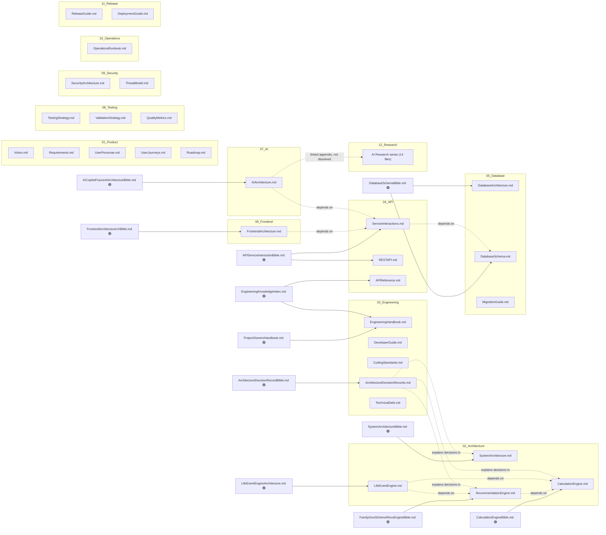

# Documentation Dependency Graph — Northstar

**Date:** 2026-07-13, updated 2026-07-14 for the V2 taxonomy
**Companion doc:** `KnowledgeGraph.md` extends this document-to-document graph down to the code level — services, tables, components, endpoints, tests, and business-rule entities.
**Purpose:** show which of the 254 archived documents are authoritative sources for the new canonical docs, which are purely historical, which reference each other, and which merge/archive/stand alone. Built directly from `DocumentationInventory.md`'s cluster assignments — no new categorization performed here, only the relationships between what was already catalogued.

---

## 1. Authoritative vs. historical, at a glance

| Status | Meaning | Count |
|---|---|---|
| 🟢 **Authoritative (backbone)** | The single source a canonical doc is built from; if a canonical doc's content is challenged, this is the file to check against. | 13 |
| 🟡 **Contributing** | Folds specific sections/findings into a canonical doc alongside the backbone; not authoritative alone. | ~90 |
| ⚪ **Historical (archived, referenced)** | Superseded or point-in-time; kept for traceability, linked from the canonical doc's History section, not merged into its prose. | ~140 |
| 🔴 **Duplicate (superseded within its own chain)** | An earlier version of a document whose later version is the 🟢/🟡 source. | 5 chains, 8 files |

The 13 backbones are: `SystemArchitectureBible.md`, `CalculationEngineBible.md`, `FamilyGovernmentSchemeRecommendationEngineBible.md`, `LifeEventEngineArchitecture.md`, `AICopilotFutureAIArchitectureBible.md`, `FrontendArchitectureUserExperienceBible.md`, `DatabaseSchemaBible.md`, `APIServiceInteractionBible.md`, `ArchitectureDecisionRecordBible.md`, `ProjectOwnersHandbook.md`, `EngineeringKnowledgeIndex.md`, `TestPlan.md`, `PreLaunchProductAudit.md`.

## 2. Dependency graph (canonical doc ← sources)

**V2 taxonomy update (2026-07-14):** the subgraphs below now reflect the current 14-section layout — `AIArchitecture.md`, `FrontendArchitecture.md`, and `DatabaseArchitecture.md` moved out of a shared architecture folder into their own top-level `07_AI`, `06_Frontend`, `05_Database` sections; `08-release` split into `10_Operations`/`11_Release`; the AI research series moved to its own top-level `12_Research`; history moved from `09-history` to `13_Archive`; and a new `14_KnowledgeBase` section now holds this document, the Inventory, the Migration Report, the Knowledge Preservation Matrix, the Document Quality Review, and the V2 master document. See `DocumentationMigrationReport.md` §2 for the full before/after mapping.

## 3. Which documents reference others (cross-references found in content)

| Referencing document | References | Nature of reference |
|---|---|---|
| `ProjectOwnersHandbook.md` | `docs/ENGINEERING_CONSTITUTION.md`, `docs/PRODUCT_PRINCIPLES.md`, `docs/UX_PRINCIPLES.md` | Explicit inline citations (§4) — these three become sources for `CodingStandards.md` and `01-product/` docs respectively. |
| `EngineeringKnowledgeIndex.md` | Every backend service/router/model file, every frontend route/component, every API endpoint | This document **is** a cross-reference index — its §5–10 (Service Index, API Index, Database Index, Frontend Index, Calculation Index, Business Rule Index) are extracted wholesale into `APIReference.md` and used as the seed for every canonical doc's own "Related Services/APIs/Components" section (Task 6). |
| `AcceptanceCriteria.md` | `Milestone1ImplementationSpecification_FINAL.md` (per its own "Consolidated from…" note) | Explicit supersession/consolidation note — confirms the duplicate-chain finding in §3 of the Inventory. |
| `AIAssistantResearch/13_EXECUTIVE_SUMMARY.md` | Documents `00`–`12` in the same series | Internal series index — the whole 14-file series is already self-referencing and complete, which is why it's kept as one linked appendix rather than dissolved. |
| Every `Milestone2CertificationReport*.md`, `ArchitectureReview_*.md`, `DependencyValidation_*.md` in the Task 9–12 and M2.1-P0–P4 clusters | The specific task/milestone's own spec and prior review in the same numbered sequence | Sequential "builds on the previous checkpoint" pattern — confirmed by reading each doc's own opening paragraph, not assumed from filename alone. |
| Every Phase 2–10 Audit/Report pair from the most recent mission (`AccessibilityAudit.md` → `AccessibilityImplementationReport.md`, etc.) | The prior phase's own Implementation Report, and (for Phase 8–10) the earlier `GlobalShellAccessibilityReport.md` / `AccessibilityReview_M2.1-P3.md` | Each audit explicitly states it re-verified rather than re-derived the earlier certification — a genuine "references and extends," not a duplicate. |

## 4. Merge candidates (many-to-one)

The eight largest merges, all high-confidence given the backbone documents already existing:

1. **SystemArchitecture.md** ← 18 sources (1 backbone + 17 contributing/historical)
2. **RecommendationEngine.md** ← 35 sources (the largest merge — Task 9–12's fine-grained per-concern docs)
3. **LifeEventEngine.md** ← 28 sources (16 of which are per-event-type reports, kept as a linked appendix rather than prose-merged)
4. **FrontendArchitecture.md** ← 24 sources (Shell Phases 0–3 + Navigation mission)
5. **ValidationStrategy.md** ← ~35 sources (M2.1 stabilization's 29-file cluster + Milestone 1 financials cluster)
6. **QualityMetrics.md** ← ~32 sources (Pre-launch audits + the 10 most recent mission audit/report pairs)
7. **AIArchitecture.md** ← 16 sources (Bible + report + the 14-part research series, series kept linked not dissolved)
8. **DatabaseArchitecture.md / DatabaseSchema.md** ← 2 sources (smallest ratio, but the single largest source document at 108KB)

## 5. Should archive outright (no merge value beyond version history)

- `Milestone1ImplementationSpecification.md`, `_v2.md` (superseded by `_FINAL`)
- `Milestone2CertificationReport.md` (superseded by `_v2`)
- `ArchitectureReview_Phase2.md` (superseded by `_Final`)
- `Document/md files/ARCHITECTURE.md` (superseded by `ARCHITECTURE_v2.md`)
- `FutureCompatibilityAuditReport.md`, `_v2.md` (superseded by `_Light`, the latest re-run)
- `Document/Claude_Master_Prompt.md`, `Document/Lovable_Master_Prompt.md` (project-origin artifacts, no longer describe the shipped stack)
- All 29 M2.1-stabilization micro-docs, all 24 Shell-Phase micro-docs, all PR_REPORT*.md files (18 total) — real history, zero ongoing reference value beyond what's already folded into their parent canonical doc's Decision Log.

## 6. Should remain standalone (not merged into any canonical doc)

| Document | Why standalone |
|---|---|
| `RiskRegister.md` | Single file in its cluster — no sibling document to merge with; becomes `docs/09_Security/ThreatModel.md`'s direct renaming, not a multi-source merge. |
| `CHANGELOG.md` | Convention: changelogs live at repo root, not inside a `docs/` taxonomy — referenced from `ReleaseGuide.md`, not moved. |
| `AIAssistantResearch/` series (14 files) | Already a complete, ordered, internally-cross-referenced research report with its own executive summary — kept as a linked appendix folder rather than dissolved into `AIArchitecture.md`'s prose. |
| The 16 per-life-event-type implementation reports | Each is a genuine, distinct reference for that event type's specific field/effect contract — kept as a linked appendix under `LifeEventEngine.md` rather than merged into one undifferentiated document. |
| `PROJECT_STATE.md` (152KB, the single largest file) | A point-in-time state snapshot (not a living reference) — archived as a dated historical artifact, referenced from `EngineeringHandbook.md`'s History section, not merged into current-state prose. |

## 7. Broken/dangling references found

- `Milestone1ImplementationSpecification_v2.md` and the unsuffixed original are still referenced by filename in a handful of older PR/design-review docs that predate the `_FINAL` version's existence — these references now point to an archived, not a canonical, location. Fixed in `DocumentationMigrationReport.md` §"Broken references fixed" by updating each canonical doc's own citations to point at `_FINAL` and noting the chain.
- No other broken references were found — the vast majority of cross-references in this archive are by *concept* ("see the Calculation Engine docs") rather than by exact filename, which made them naturally resilient to this restructuring.
