# Knowledge Graph

**Date:** 2026-07-14
**Purpose:** where `DocumentationDependencyGraph.md` connects document to document, this graph connects **documents to the actual system** — services, database tables, frontend components, API endpoints, tests, life events, recommendation rules, financial calculations, and business rules. Every node here is traceable to a canonical document; every edge is a real, code-verified relationship, not an inferred one.

---

## 1. Core Engine Cluster

```mermaid
graph TB
    subgraph Docs["Canonical Documents"]
        CalcDoc[CalculationEngine.md]
        RecoDoc[RecommendationEngine.md]
        LifeDoc[LifeEventEngine.md]
        SysDoc[SystemArchitecture.md]
        ADRDoc[ArchitectureDecisionRecords.md]
    end

    subgraph Services["Backend Services"]
        MC[monte_carlo.py]
        PS[planning_service.py]
        OPT[optimizer.py]
        FS[family_service.py]
        SES[scheme_eligibility_service.py]
        FIS[family_insurance_service.py]
        FRS[family_recommendations_service.py]
        FDS[family_dashboard_service.py]
        NS[notification_service.py]
        LES[life_event_service.py]
    end

    subgraph Tables["Database Tables"]
        Goals[(goals)]
        Sims[(simulations)]
        HH[(households / members / dependents)]
        Schemes[(schemes / scheme_eligibility_rules)]
        Policies[(health_policies / coverage)]
        LE[(life_events / life_event_effects)]
        NM[(notification_markers)]
    end

    subgraph Endpoints["API Endpoints"]
        EPGoals["POST/PATCH /goals"]
        EPSim["POST /simulate"]
        EPFam["GET /family/*"]
        EPLE["POST/GET /life-events*"]
        EPNotif["GET /notifications"]
    end

    subgraph Tests["Test Suites"]
        TMC[test_monte_carlo.py]
        TPS[test_planning_service.py]
        TFam[test_family_*.py]
        TLE[test_life_event_*.py]
        TNotif[test_notifications.py]
    end

    CalcDoc -.documents.-> MC
    CalcDoc -.documents.-> PS
    CalcDoc -.documents.-> OPT
    RecoDoc -.documents.-> FS
    RecoDoc -.documents.-> SES
    RecoDoc -.documents.-> FIS
    RecoDoc -.documents.-> FRS
    RecoDoc -.documents.-> FDS
    RecoDoc -.documents.-> NS
    LifeDoc -.documents.-> LES

    MC --> Goals
    PS --> Goals
    OPT --> Goals
    FS --> HH
    SES --> Schemes
    FIS --> Policies
    NS --> NM
    LES --> LE

    EPGoals --> PS
    EPSim --> MC
    EPFam --> FS
    EPFam --> FRS
    EPLE --> LES
    EPNotif --> NS

    MC -.tested by.-> TMC
    PS -.tested by.-> TPS
    FS -.tested by.-> TFam
    LES -.tested by.-> TLE
    NS -.tested by.-> TNotif

    ADRDoc -.governs.-> PS
    ADRDoc -.governs.-> FRS
    ADRDoc -.governs.-> NS
```

## 2. Business Rule & Financial Calculation Traceability

| Business Rule / Calculation | Owning Service | Owning Table(s) | Canonical Doc §  | Test |
|---|---|---|---|---|
| Calculation Context recalculation trigger | `planning_service.calculate_goal_probability` | `goals` | `CalculationEngine.md` §6 | `test_planning_service.py::TestCalculateGoalProbability` |
| Log-normal Monte Carlo sampling + Itô correction | `monte_carlo.run_simulation` | `simulations` (writes on `/simulate` only) | `CalculationEngine.md` §2.3 | `test_monte_carlo.py` (property/invariant suite) |
| Plan health weighted average | `planning_service.compute_plan_health` | reads `goals` | `CalculationEngine.md` §2.6 | `test_planning_service.py` |
| SSY eligibility (exact-age, gender) | `scheme_eligibility_service._evaluate_rules_for_member` | `schemes`, `scheme_eligibility_rules`, `dependents` | `RecommendationEngine.md` §5 | `test_scheme_eligibility_service.py` (boundary tests) |
| SCSS eligibility (min-age + potentially-eligible window) | same | same | `RecommendationEngine.md` §5 | `test_scheme_eligibility_service.py` |
| 80D insurance deduction (base × senior doubling) | `family_insurance_service.compute_insurance_recommendation` | `health_policies`, `tax_sections` | `RecommendationEngine.md` §6 | `test_family_insurance.py` |
| Recommendation conflict detection | `family_recommendations_service._detect_conflicts` | reads only | `RecommendationEngine.md` §7 | `test_family_recommendations.py` |
| Family Dashboard 6-card composition | `family_dashboard_service.get_family_dashboard` | reads `households`, `goals`, recommendations | `RecommendationEngine.md` §8 | `test_family_dashboard.py` |
| 18 Life Event effect contracts | `life_event_service.py` + 18 handlers | `life_events`, `life_event_effects`, + every touched domain table | `LifeEventEngine.md` §5 | `test_life_event_hardening.py`, per-handler test files |
| Notification generation (5 sources, never-persist) | `notification_service.py` | `notification_markers` | `RecommendationEngine.md` §9 | `test_notifications.py` |

## 3. Frontend Component ↔ Backend Traceability

| Frontend Component | Calls (via `lib/api.ts`) | Canonical Doc |
|---|---|---|
| `app-shell.tsx` | `auth.me`, `getDashboard` | `FrontendArchitecture.md` §4 |
| `GoalSimPanel.tsx` | `simulate`, `optimize`, `updateGoal` | `FrontendArchitecture.md` §9, `CalculationEngine.md` §6 |
| `RecordLifeEventDialog.tsx` | `previewLifeEvent`, `recordLifeEvent` | `LifeEventEngine.md` §8, `FrontendArchitecture.md` §8 |
| `notification-center.tsx` | `getNotifications`, `markRead`, `markDismissed` | `RecommendationEngine.md` §9 |
| `app.family.*.tsx` (7 routes) | the full `/family/*` surface | `RecommendationEngine.md`, `FrontendArchitecture.md` §9 |
| `app.copilot.tsx` | `chat` | `AIArchitecture.md` §2 |

## 4. ADR ↔ Code Traceability

| ADR | Enforced in | Verified by |
|---|---|---|
| ADR-001 (Calculation Lifecycle) | `planning_service.get_dashboard` (never calls Monte Carlo) | `test_repeated_dashboard_reads_never_change_goal_probability` |
| ADR-005 (Recommendations live, never persisted) | `family_insurance_service`, `scheme_eligibility_service`, `family_recommendations_service` | `test_nothing_is_persisted` |
| ADR-006 (Notification markers store state only) | `notification_service.py` | `test_get_notifications_never_creates_a_marker_row` |
| ADR-007 (`activeOverlay` single state) | `app-shell.tsx` | Live keyboard-only verification (Global Shell Certification) |
| ADR-008 (Goal tagging descriptive, never ownership) | `family_service.set_goal_household_tags` | `test_tagging_never_changes_goal_owner` |

## 5. Every Node Is Traceable — Coverage Statement

Every service named above has: a canonical document describing it, a database table it reads/writes (or an explicit "reads only" note), an API endpoint that reaches it, and a test file that verifies it. Where any of these four was not independently confirmed for this graph, it is not included above — this graph does not assert a relationship it did not verify.

---

## Related Documents
`DocumentationDependencyGraph.md` (document-to-document graph) · `KnowledgePreservationMatrix.md` · `NorthstarEngineeringKnowledgeBaseV2.md`
